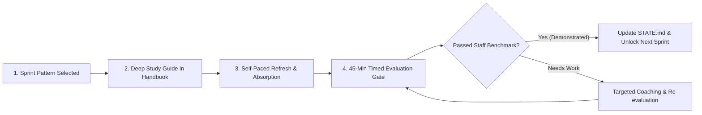
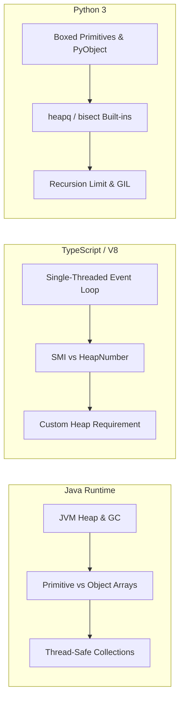

# Track 01: DSA & Computational Reasoning

[Back to Master Dashboard](../index.mdx)

:::info

**Track Philosophy & Staff Standard**

At Staff / Architect level, coding rounds evaluate more than just passing LeetCode test cases. They evaluate:
1. **Mathematical Invariant Proofs:** Formulating state transitions and loop invariants upfront.
2. **Execution Speed:** Clean, modular, production-grade code within 25-35 minutes.
3. **Multi-Language Nuances:** Implementing and contrasting Java, TypeScript, and Python runtimes.
4. **The Architect Bridge:** Translating single-machine algorithms into distributed cluster equivalents.

:::

---

## The Gated Sprint Architecture (Study -> Master -> Evaluate)

To eliminate anxiety, refresh rusty patterns, and build authentic Staff-level depth, preparation follows a strict **gated sprint model**. No sprint advances without passing an explicit evaluation gate:



1. **Handbook Study Artifact:** Before any evaluation or testing, an authoritative study guide is generated under `patterns/` covering invariants, multi-language code tabs, runtime internals, and distributed bridges.
2. **Self-Paced Mastery:** The candidate reviews and practices the patterns without time pressure.
3. **Timed Staff Evaluation Gate:** Upon candidate readiness signal, an unseen Staff-level challenge is run under the 45-minute protocol.
4. **Mandatory Progression Lock:** The next sprint remains locked until the current pattern competency is demonstrated.

---

## The 45-Minute Staff Interview Protocol

Every coding problem follows this strict, time-boxed sequence:

```text
[00:00 - 00:05] Step 1: Requirements, Ambiguity & Constraint Auditing
  • Extract inputs, outputs, memory limits, and scale bounds ($N \le 10^5$, $O(N \log N)$ target).
  • Identify edge cases: null/empty, duplicates, extreme bounds, negatives, integer overflow.

[00:05 - 00:15] Step 2: Algorithmic Invariants, Brute Force & Trade-Offs
  • State the brute-force baseline and its complexity bottleneck.
  • Propose 2 distinct optimal approaches (e.g., Binary Search vs Two Pointers, DP vs Greedy).
  • Formulate the state transition, loop invariants, or monotonic property.
  • Agree on the optimal approach before writing code.

[00:15 - 00:35] Step 3: Production-Grade Implementation
  • Write clean, modular, self-documenting code with meaningful variable names.
  • Maintain explicit separation between helper methods and primary logic.
  • Enforce immutability and defensive copies.

[00:35 - 00:40] Step 4: Dry-Run Verification with Invariants & Edge Cases
  • Step through execution manually with a non-trivial example tracing pointers/tables.
  • Verify edge case coverage (e.g., $N=0$, $N=1$, all identical values).

[00:40 - 00:45] Step 5: Distributed Scale & Production Bridge
  • Explain how the algorithm behaves when $N$ exceeds single-machine RAM.
  • Connect to real-world distributed equivalents.
```

---

## The 16 Core Problem-Solving Patterns

| Pattern | Invariant / Core Technique | Distributed / Production Equivalent |
|---|---|---|
| **01. Arrays & Hashing** | Hash table collision mitigation, frequency maps | Distributed partitioning, In-memory caches |
| **02. Two Pointers** | Opposite-direction / Fast-and-slow invariants | Partitioning algorithms, Stream deduping |
| **03. Sliding Window** | Dynamic window constraints, Monotonic deque | Sliding Window Rate Limiters, Flink windows |
| **04. Prefix Sum** | Precomputed cumulative aggregates, Difference arrays | 2D range query engines, Analytics aggregation |
| **05. Binary Search** | Monotonic predicates ($f(x) \ge target$), Boundary search | Distributed index lookup, Cassandra token ring |
| **06. Monotonic Stack** | Next greater/smaller element, Histogram areas | Real-time spike detection, Event stream indexing |
| **07. Monotonic Queue** | Sliding window maximum/minimum in $O(1)$ amortized | Rolling anomaly detection in telemetry streams |
| **08. Linked Lists** | Pointer manipulation, cycle detection | LRU cache doubly-linked lists |
| **09. Intervals** | Sweep-line, Meeting rooms, Coordinate compression | Resource schedulers, Calendar booking engines |
| **10. Heaps** | Top-K elements, K-way merge, Dual-heap median | Distributed task schedulers, Streaming Top-K |
| **11. Trees & BSTs** | Recursive/iterative traversal, LCA, Tree diameter | Hierarchical document storage, File systems |
| **12. Tries** | Prefix matching, Bitwise XOR trie | Search autocomplete engines, IP routing tables |
| **13. Graphs** | BFS/DFS, Kahn's Topo Sort, Union-Find, Dijkstra | Service dependency DAGs, Build engines, Fraud rings |
| **14. Dynamic Programming** | State definition, DAG recurrence, Rolling array space | Optimal resource allocation, Route optimization |
| **15. Greedy** | Greedy-choice property proofs, Exchange arguments | Task dispatchers, Bandwidth allocation |
| **16. Backtracking** | Branch-and-bound, Search space pruning | Constraint-satisfaction engines |

---

## Multi-Language Runtime Matrix

When comparing implementations across languages:



---

## Subdirectory Structure

This workspace stores verified problem solutions and pattern cheat sheets:

- `patterns/`: 1-page pattern blueprints and invariant cheat sheets.
- `solutions/`: Battle-tested, multi-language solutions with complexity derivations and production bridges.
