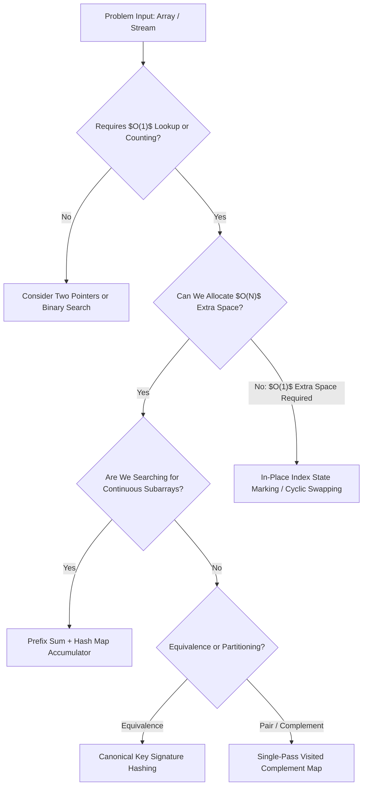
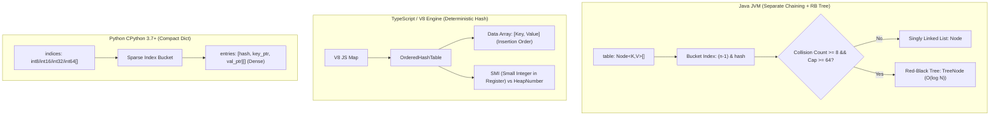
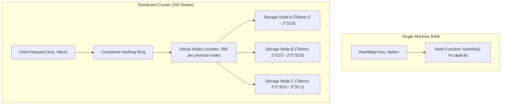

import Tabs from '@theme/Tabs';
import TabItem from '@theme/TabItem';

# Pattern 01: Arrays, Hashing & Lookup Optimization

:::info

**Staff Architectural Competency**

At Staff / Architect level, hash tables are evaluated beyond basic $O(1)$ lookup calls. Evaluators probe:
1. **Mathematical Invariant Formulations:** State transformation across array traversals (complement lookups, prefix differences, and in-place index mapping).
2. **Runtime Memory & Engine Internals:** Java bucket treeification, V8 SMI/HeapNumber representation and compact maps, CPython dense array layouts.
3. **The Scale Bridge:** Transitioning single-machine hash tables to distributed consistent hashing rings, hot partition salting, and probabilistic sketches.

:::

---

## 1. Pattern Detection & Decision Heuristics

When reviewing an ambiguous problem prompt, look for these architectural signals:

| Problem Signal | Underlying Invariant | Target Complexity |
|---|---|---|
| *"Find a pair or triplet satisfying $A + B = K$"* | Complement lookup: Check if $K - A$ was previously recorded in $O(1)$ | $O(N)$ Time, $O(N)$ Space |
| *"Group equivalent items or strings"* | Equivalence class signature: Map distinct elements to a canonical representation | $O(N \cdot L)$ Time |
| *"Find subarray sum equal to $K$"* | Prefix sum difference: $Prefix[i] - Prefix[j] = K \iff Prefix[j] = Prefix[i] - K$ | $O(N)$ Time, $O(N)$ Space |
| *"Find smallest missing integer in $O(1)$ extra space"* | Array indexing as hash buckets: Place value $v$ at index $v-1$ in-place | $O(N)$ Time, $O(1)$ Space |
| *"Find most frequent element in real-time stream"* | Frequency map with sliding decay or Count-Min Sketch | Amortized $O(1)$ per event |



---

## 2. Mathematical Invariants

### 1. The Complement Invariant
For any target relation $f(x, y) = K$, we rewrite the relation in terms of the current element $y$:
$$x = f^{-1}(y, K)$$

As we iterate index $i$ from $0$ to $N-1$:
- The hash table stores all previously evaluated elements $\{nums[0], \dots, nums[i-1]\}$.
- We check if the required complement $x$ already exists in the table.
- **Invariant:** Every possible pair $(x, y)$ with $x$ appearing before $y$ is verified exactly once at the moment $y$ is visited. This eliminates the nested loop from $O(N^2)$ to $O(N)$.

### 2. Prefix Sum Differential Invariant
Given an array $A$ of length $N$, define the prefix sum sequence $P$:
$$P[i] = \sum_{k=0}^{i} A[k], \quad \text{with } P[-1] = 0$$

The sum of any contiguous slice $A[j \dots i]$ (where $j \le i$) is:
$$\text{Sum}(A[j \dots i]) = P[i] - P[j-1]$$

To find whether any contiguous subarray sums to target $K$:
$$P[i] - P[j-1] = K \iff P[j-1] = P[i] - K$$

By storing the frequencies of visited prefix sums $P[j-1]$ in a hash map, we determine the count of valid subarrays ending at index $i$ in $O(1)$ time.

### 3. In-Place Index Mapping Invariant (Cyclic Sort)
When an algorithm requires finding missing or duplicate values in an array of size $N$ with elements constrained to $\{1, \dots, N\}$ in $O(1)$ auxiliary space:
- Treat the input array $A$ itself as the hash table.
- Place every element $v \in [1, N]$ at its natural home index: $\text{Index} = v - 1$.
- **Invariant:** During traversal, swap elements until $A[i] = A[A[i] - 1]$ or $A[i]$ is out of bounds $[1, N]$. Each element is placed at its correct destination index at most once, maintaining $O(N)$ total time complexity.

---

## 3. Runtime Internals: Java vs. TypeScript (V8) vs. Python

Staff-level engineers must understand how runtimes lay out hash tables in physical memory:



### 1. Java (`java.util.HashMap`)

- **Table Representation:** Backed by an array of buckets: `transient Node<K,V>[] table`.
- **Hash Spreading Function:**
  ```java
  static final int hash(Object key) {
      int h;
      return (key == null) ? 0 : (h = key.hashCode()) ^ (h >>> 16);
  }
  ```
  Mixing the upper 16 bits with lower 16 bits prevents hash collisions when the table length is small and index masking `(n - 1) & hash` ignores high-order bits.
- **Power of Two Sizing:** Capacity is always a power of 2 ($16, 32, 64, \dots$). This allows fast bitwise masking `(length - 1) & hash` instead of an expensive CPU modulo division (`%`).
- **Collision Resolution & Treeification:**
  - Collisions initially chain into a singly linked list (`Node<K,V>`).
  - **Treeification Threshold:** When a bucket's chain length reaches $8$ and the overall table capacity is at least $64$, the linked list converts into a balanced Red-Black tree (`TreeNode<K,V>`).
  - Lookup drops from worst-case $O(N)$ (hash collision DoS attack) to $O(\log N)$.
  - **Untreeify Threshold:** If removals shrink the bucket size to $6$, it converts back to a linked list.
- **Memory Footprint:** Heavy. Each `Node<K,V>` has 4 reference fields: `int hash`, `K key`, `V value`, `Node<K,V> next`. On a 64-bit JVM with Compressed OOPs, each node consumes 32 bytes minimum, plus the boxed primitive wrapper (e.g., `Integer` consumes 24 bytes). Pointer chasing leads to CPU cache line misses.

### 2. TypeScript / JavaScript (V8 Engine `Map`)

- **Standard Guarantee:** ECMAScript requires `Map` to guarantee **deterministic insertion-order iteration**.
- **Internal Structure (`OrderedHashTable`):** V8 implements `Map` using a closed-addressing, compact structure consisting of two continuous memory blocks:
  - A hash table holding offsets.
  - A contiguous data table containing sequential entries `[key, value]`.
- **SMI vs. HeapNumber Representation:**
  - V8 represents numbers either as an **SMI (Small Integer)** or a **HeapNumber**.
  - On 64-bit architectures, 31-bit or 32-bit signed integers are encoded directly into the pointer register using pointer tagging (least significant bit = `0`). Lookups on SMI keys avoid heap allocations entirely.
  - Floating point numbers or integers exceeding 32 bits are boxed into `HeapNumber` objects on the V8 heap, causing garbage collection overhead.
- **Avoid Plain Objects as Hash Tables:** Never use `{}` when keys are dynamic or non-string. Plain objects coerce keys to strings (`obj[1]` becomes `obj["1"]`), have prototype pollution vulnerabilities, and suffer performance degradation when triggering megamorphic property access.

### 3. Python (`dict` in CPython 3.7+)

- **Compact Dictionary Layout:** CPython uses Raymond Hettinger's compact dictionary memory layout:
  - **`indices` table:** A sparse array storing integer indices into the entries table.
  - **`entries` table:** A dense array storing `[hash, key_ptr, value_ptr]`.
- **Memory Efficiency:** Traditional sparse tables wasted 66% of space with empty slots containing `NULL` pointer buckets. The compact layout saves 30% to 40% memory and ensures `for key in d:` iterates in insertion order.
- **Collision Resolution:** Open addressing with pseudo-random probing:
  $$j = (5 \cdot j + 1 + \text{perturb}) \pmod{2^k}, \quad \text{where } \text{perturb} \gg= 5$$
- **Boxing Overhead:** Every integer in Python is a `PyObject` (`PyLongObject`) containing reference count, type pointer, and size header (typically 28 bytes on 64-bit platforms).

---

## 4. Canonical Problem Archetypes

### Archetype 1: Single-Pass Complement Lookup (Two Sum)

:::note

**Problem Formulation**

Given an array of integers `nums` and an integer `target`, return indices of the two numbers such that they add up to `target`. Each input has exactly one solution, and the same element may not be used twice.

:::

<Tabs>
  <TabItem value="java" label="Java" default>

```java
import java.util.HashMap;
import java.util.Map;

public final class TwoSumSolution {
    /**
     * Finds indices of two numbers that add up to target.
     * Time Complexity: O(N) single-pass
     * Space Complexity: O(N) visited map
     */
    public int[] twoSum(int[] nums, int target) {
        if (nums == null || nums.length < 2) {
            throw new IllegalArgumentException("Input array must contain at least 2 elements");
        }

        // Pre-size map based on expected entries to avoid rehash: initialCapacity = (N / 0.75) + 1
        Map<Integer, Integer> visited = new HashMap<>((int) (nums.length / 0.75f) + 1);

        for (int i = 0; i < nums.length; i++) {
            int complement = target - nums[i];

            if (visited.containsKey(complement)) {
                return new int[] { visited.get(complement), i };
            }

            visited.put(nums[i], i);
        }

        throw new IllegalArgumentException("No two sum solution found");
    }
}
```

  </TabItem>
  <TabItem value="ts" label="TypeScript">

```typescript
/**
 * Finds indices of two numbers that add up to target.
 * Time Complexity: O(N)
 * Space Complexity: O(N)
 */
export function twoSum(nums: number[], target: number): [number, number] {
  if (!nums || nums.length < 2) {
    throw new Error("Input array must contain at least 2 elements");
  }

  // Use Map to avoid prototype pollution and guarantee type safety
  const visited = new Map<number, number>();

  for (let i = 0; i < nums.length; i++) {
    const current = nums[i];
    const complement = target - current;

    const complementIndex = visited.get(complement);
    if (complementIndex !== undefined) {
      return [complementIndex, i];
    }

    visited.set(current, i);
  }

  throw new Error("No two sum solution found");
}
```

  </TabItem>
  <TabItem value="py" label="Python">

```python
from typing import List, Tuple

def two_sum(nums: List[int], target: int) -> Tuple[int, int]:
    """
    Finds indices of two numbers that add up to target.
    Time Complexity: O(N)
    Space Complexity: O(N)
    """
    if not nums or len(nums) < 2:
        raise ValueError("Input array must contain at least 2 elements")

    visited: dict[int, int] = {}

    for i, num in enumerate(nums):
        complement = target - num
        if complement in visited:
            return (visited[complement], i)
        visited[num] = i

    raise ValueError("No two sum solution found")
```

  </TabItem>
</Tabs>

---

### Archetype 2: Canonical Signature & Frequency Hashing (Group Anagrams)

:::note

**Problem Formulation**

Given an array of strings `strs`, group the anagrams together. Return the grouped strings in any order. An anagram is a word formed by rearranging the letters of another word.

:::

<Tabs>
  <TabItem value="java" label="Java" default>

```java
import java.util.*;

public final class GroupAnagramsSolution {
    /**
     * Groups anagrams by deterministic 26-character frequency signature.
     * Time Complexity: O(N * L) where N is number of words, L is max string length.
     * Space Complexity: O(N * L) for storing grouped results.
     */
    public List<List<String>> groupAnagrams(String[] strs) {
        if (strs == null || strs.length == 0) {
            return Collections.emptyList();
        }

        Map<String, List<String>> signatureMap = new HashMap<>();

        for (String str : strs) {
            // Count frequencies of lowercase English letters
            int[] counts = new int[26];
            for (int j = 0; j < str.length(); j++) {
                counts[str.charAt(j) - 'a']++;
            }

            // Build deterministic signature: "#1#0#0...#2"
            StringBuilder sb = new StringBuilder(52);
            for (int count : counts) {
                sb.append('#').append(count);
            }
            String signature = sb.toString();

            signatureMap.computeIfAbsent(signature, k -> new ArrayList<>()).add(str);
        }

        return new ArrayList<>(signatureMap.values());
    }
}
```

  </TabItem>
  <TabItem value="ts" label="TypeScript">

```typescript
/**
 * Groups anagrams using a 26-length frequency character signature.
 * Time Complexity: O(N * L)
 * Space Complexity: O(N * L)
 */
export function groupAnagrams(strs: string[]): string[][] {
  if (!strs || strs.length === 0) {
    return [];
  }

  const signatureMap = new Map<string, string[]>();

  for (const str of strs) {
    // Fixed 26-element array for lowercase latin alphabet
    const count = new Array<number>(26).fill(0);
    for (let i = 0; i < str.length; i++) {
      count[str.charCodeAt(i) - 97]++;
    }

    // Join into a unique string key
    const signature = count.join("#");

    const group = signatureMap.get(signature);
    if (group) {
      group.push(str);
    } else {
      signatureMap.set(signature, [str]);
    }
  }

  return Array.from(signatureMap.values());
}
```

  </TabItem>
  <TabItem value="py" label="Python">

```python
from collections import defaultdict
from typing import List

def group_anagrams(strs: List[str]) -> List[List[str]]:
    """
    Groups anagrams using a 26-tuple character frequency signature.
    Time Complexity: O(N * L)
    Space Complexity: O(N * L)
    """
    if not strs:
        return []

    # Tuples are immutable and hashable in Python, serving as optimal dict keys
    groups: defaultdict[tuple[int, ...], list[str]] = defaultdict(list)

    for s in strs:
        count = [0] * 26
        for char in s:
            count[ord(char) - 97] += 1
        groups[tuple(count)].append(s)

    return list(groups.values())
```

  </TabItem>
</Tabs>

---

### Archetype 3: In-Place State Marking (First Missing Positive)

:::note

**Problem Formulation**

Given an unsorted integer array `nums`, return the smallest positive integer that is not present in `nums`. You must implement an algorithm that runs in $O(N)$ time and uses $O(1)$ auxiliary space.

:::

<Tabs>
  <TabItem value="java" label="Java" default>

```java
public final class FirstMissingPositiveSolution {
    /**
     * Finds smallest missing positive integer via in-place cyclic positioning.
     * Time Complexity: O(N) because each element is placed in its final slot at most once.
     * Space Complexity: O(1) auxiliary space (in-place modification).
     */
    public int firstMissingPositive(int[] nums) {
        if (nums == null || nums.length == 0) {
            return 1;
        }

        int n = nums.length;

        // Cyclic sort: place value v at index (v - 1)
        for (int i = 0; i < n; i++) {
            while (nums[i] > 0 && nums[i] <= n && nums[nums[i] - 1] != nums[i]) {
                // Swap nums[i] with nums[nums[i] - 1]
                int targetIndex = nums[i] - 1;
                int temp = nums[i];
                nums[i] = nums[targetIndex];
                nums[targetIndex] = temp;
            }
        }

        // Find first slot where index + 1 != value
        for (int i = 0; i < n; i++) {
            if (nums[i] != i + 1) {
                return i + 1;
            }
        }

        return n + 1;
    }
}
```

  </TabItem>
  <TabItem value="ts" label="TypeScript">

```typescript
/**
 * Finds smallest missing positive using in-place bucket swapping.
 * Time Complexity: O(N)
 * Space Complexity: O(1)
 */
export function firstMissingPositive(nums: number[]): number {
  if (!nums || nums.length === 0) {
    return 1;
  }

  const n = nums.length;

  for (let i = 0; i < n; i++) {
    while (nums[i] > 0 && nums[i] <= n && nums[nums[i] - 1] !== nums[i]) {
      const targetIndex = nums[i] - 1;
      const temp = nums[i];
      nums[i] = nums[targetIndex];
      nums[targetIndex] = temp;
    }
  }

  for (let i = 0; i < n; i++) {
    if (nums[i] !== i + 1) {
      return i + 1;
    }
  }

  return n + 1;
}
```

  </TabItem>
  <TabItem value="py" label="Python">

```python
from typing import List

def first_missing_positive(nums: List[int]) -> int:
    """
    Finds smallest missing positive using cyclic placement.
    Time Complexity: O(N)
    Space Complexity: O(1)
    """
    if not nums:
        return 1

    n = len(nums)

    for i in range(n):
        # Continue swapping while nums[i] is in valid range [1, n] and not in place
        while 1 <= nums[i] <= n and nums[nums[i] - 1] != nums[i]:
            target_idx = nums[i] - 1
            nums[i], nums[target_idx] = nums[target_idx], nums[i]

    for i in range(n):
        if nums[i] != i + 1:
            return i + 1

    return n + 1
```

  </TabItem>
</Tabs>

---

### Archetype 4: Cumulative State Accumulation with Prefix Hash Maps (Subarray Sum Equals K)

:::note

**Problem Formulation**

Given an array of integers `nums` and an integer `k`, return the total number of continuous subarrays whose sum equals to `k`.

:::

<Tabs>
  <TabItem value="java" label="Java" default>

```java
import java.util.HashMap;
import java.util.Map;

public final class SubarraySumSolution {
    /**
     * Counts subarrays summing to k using prefix sum difference invariant.
     * Time Complexity: O(N) single pass
     * Space Complexity: O(N) prefix frequency map
     */
    public int subarraySum(int[] nums, int k) {
        if (nums == null || nums.length == 0) {
            return 0;
        }

        // Map stores: PrefixSum -> Frequency of occurrence
        Map<Integer, Integer> prefixFrequencies = new HashMap<>();
        
        // Base case: A prefix sum of 0 has occurred 1 time (empty prefix)
        prefixFrequencies.put(0, 1);

        int runningSum = 0;
        int count = 0;

        for (int num : nums) {
            runningSum += num;

            // Invariant: If (runningSum - k) exists, then subarray sum from previous index to current is k
            int targetPrefix = runningSum - k;
            if (prefixFrequencies.containsKey(targetPrefix)) {
                count += prefixFrequencies.get(targetPrefix);
            }

            prefixFrequencies.put(runningSum, prefixFrequencies.getOrDefault(runningSum, 0) + 1);
        }

        return count;
    }
}
```

  </TabItem>
  <TabItem value="ts" label="TypeScript">

```typescript
/**
 * Counts subarrays with sum equal to k using a prefix sum frequency Map.
 * Time Complexity: O(N)
 * Space Complexity: O(N)
 */
export function subarraySum(nums: number[], k: number): number {
  if (!nums || nums.length === 0) {
    return 0;
  }

  const prefixFrequencies = new Map<number, number>();
  // Base case: prefix sum of 0 seen once before iterating
  prefixFrequencies.set(0, 1);

  let runningSum = 0;
  let count = 0;

  for (const num of nums) {
    runningSum += num;

    const targetPrefix = runningSum - k;
    const matchCount = prefixFrequencies.get(targetPrefix);
    if (matchCount !== undefined) {
      count += matchCount;
    }

    const currentFreq = prefixFrequencies.get(runningSum) ?? 0;
    prefixFrequencies.set(runningSum, currentFreq + 1);
  }

  return count;
}
```

  </TabItem>
  <TabItem value="py" label="Python">

```python
from collections import defaultdict
from typing import List

def subarray_sum(nums: List[int], k: int) -> int:
    """
    Counts continuous subarrays summing to k via prefix differences.
    Time Complexity: O(N)
    Space Complexity: O(N)
    """
    if not nums:
        return 0

    prefix_counts: defaultdict[int, int] = defaultdict(int)
    prefix_counts[0] = 1  # Base case for subarrays starting at index 0

    running_sum = 0
    count = 0

    for num in nums:
        running_sum += num
        # If (running_sum - k) was observed, add its occurrences to count
        count += prefix_counts[running_sum - k]
        prefix_counts[running_sum] += 1

    return count
```

  </TabItem>
</Tabs>

---

## 5. Staff-Level Edge Case Audit Matrix

In top-tier interviews, failure to handle these conditions triggers immediate down-leveling:

| Edge Case Category | Specific Scenario | Failure Mode / Pitfall | Robust Defense Strategy |
|---|---|---|---|
| **Integer Overflow** | Two Sum with values near `Integer.MAX_VALUE` | `target - num` overflows 32-bit signed integer | Use 64-bit integer (`long` in Java, `BigInt` or safe range in TS) when bounds exceed $2^{31}-1$. |
| **Negative Values & Zeros** | Prefix sum with negative numbers | Two-pointer sliding window fails (non-monotonic) | Sliding window requires positive numbers; prefix sum + hash map is mandatory for negative numbers. |
| **Hash Collision DoS** | Malicious keys with identical `hashCode()` | Linked list degrades to $O(N)$ lookup | Java 8+ treeification to Red-Black tree ($O(\log N)$). Python randomized SipHash seed. |
| **Object Key Mutation** | Mutating an object after inserting into `Map` | `hashCode()` changes, key is permanently lost | Enforce immutability (`final` fields, defensive copies, or primitive identifiers). |
| **Empty or Single Item** | Array with $N=0$ or $N=1$ | Array out of bounds exception / IndexOutOfBounds | Explicit length checks at method boundary; throw `IllegalArgumentException` or return base value. |

---

## 6. The Architect Bridge: From In-Memory Hash Map to Distributed Systems

Staff engineers must immediately translate single-node hash tables to macro distributed architectures:



### 1. Consistent Hashing & Ring Rebalancing
- **The Bottleneck with Simple Modulo:** If you partition keys across $N$ cache servers using `node = hash(key) % N`, adding or removing a single node forces nearly $100\%$ of keys to rehash, causing cache stampedes.
- **The Consistent Hashing Solution:**
  - Map both node identifiers and data keys onto a circular token space $[0, 2^{32} - 1]$ (e.g., via MD5 or Murmur3).
  - A key is assigned to the first node whose token is $\ge \text{hash}(key)$ (traversed clockwise).
  - When a node joins or leaves, only $K / N$ keys need migration on average.
  - **Virtual Nodes (vnodes):** To prevent data skew and hotspots, each physical server is mapped to 100-256 virtual positions on the ring using distinct seed hashes (`nodeA#1`, `nodeA#2`).

### 2. Hot-Key Mitigation in Distributed Caches
- When a celebrity key (e.g., viral user profile) generates 500,000 QPS, consistent hashing sends all traffic to a single partition, overloading the node.
- **Mitigation Techniques:**
  - **Key Salting:** Append random integer suffix to key: `key_suffix = key + "_" + random(1, 10)`. Spread reads across 10 cache replicas; write to all 10.
  - **Local In-Memory Cache Layer:** Use a local L1 cache (Caffeine / Guava in Java or LRU in Node.js) on the application server with a 1-second TTL to absorb spikes before hitting Redis/Memcached.

### 3. Space-Constrained Billion-Event Telemetry (Probabilistic Hashing)
- When $N = 10^9$ events stream through per hour and exact counting would exhaust RAM:
  - **Bloom Filter:** Bit array with $k$ independent hash functions to test set membership in $O(1)$ space with zero false negatives and tunable false positives.
  - **Count-Min Sketch:** 2D array of counters with depth $d$ and width $w$ to compute frequency estimation for streaming data using sub-linear memory.
  - **HyperLogLog (HLL):** Estimates cardinality of distinct elements with $\approx 1.04 / \sqrt{m}$ standard error using only 1.5 KB of memory for billions of items.
