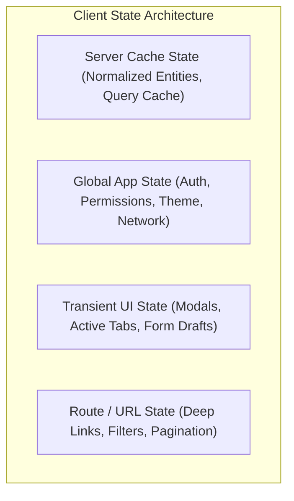

# Track 03: Frontend System Design & Web Architecture

[Back to Master Dashboard](../index.mdx)

:::info

**The Client as a Distributed Node**

The browser is not merely a visual presentation layer. In modern Staff-level systems, the browser is a **resource-constrained, distributed client node operating over untrusted, high-latency, intermittently connected networks**.

Frontend System Design demands identical architectural rigor, scalability calculations, failure analysis, and organizational thinking to Backend Distributed Systems.

:::

---

## The Staff-Level Frontend Reasoning Framework

When designing client-side web platforms, follow this structured progression:

```text
Business Problem & User Experience Requirements
                     ↓
Device, Network & Platform Constraints (Mobile, Desktop, Network tiers)
                     ↓
Rendering & Delivery Strategy (CSR, SSR, SSG, Streaming, Islands)
                     ↓
Component & Domain Boundary Decomposition
                     ↓
Client State Architecture & Data Normalization
                     ↓
Data Fetching, Caching & Invalidation Strategy
                     ↓
Real-Time, Optimistic Updates & Conflict Resolution
                     ↓
Performance Budgets & Core Web Vitals (LCP, INP, CLS, Frame Budgets)
                     ↓
Offline Storage & Synchronization Protocols (IndexedDB, Service Workers)
                     ↓
Security Boundaries & Asset Delivery (CSP, CDN, Sandboxing)
                     ↓
Client Observability, Telemetry & Crash Reporting
                     ↓
Multi-Team Governance (Micro-frontends, Design Systems, Versioning)
                     ↓
Architecture Trade-offs & Failure Modes
```

---

## Client State Taxonomy & Normalization

Staff-level client architectures cleanly partition state into distinct lifecycles:



### Relational Entity Normalization Standard
Relational entities must never be duplicated across multiple component trees. Normalize all API responses into indexed dictionary maps:

```typescript
// Anti-Pattern: Nested / Duplicated State
interface PostWithAuthor {
  id: string;
  title: string;
  author: { id: string; name: string; avatar: string };
  comments: Array<{ id: string; text: string; author: { id: string; name: string } }>;
}

// Staff Standard: Normalized Relational Entity Tables
interface NormalizedClientState {
  entities: {
    users: Record<string, UserEntity>;
    posts: Record<string, PostEntity>;
    comments: Record<string, CommentEntity>;
  };
  feed: {
    postIds: string[];
    isLoading: boolean;
    nextCursor: string | null;
  };
}
```

---

## Rendering Strategy Comparison Matrix

| Strategy | First Contentful Paint (FCP) | Time to Interactive (TTI) | Server Compute Cost | SEO Capability | Best For |
|---|:---:|:---:|:---:|:---:|---|
| **Client-Side Rendering (CSR)** | Slow on low-end CPUs | Matches FCP | Near Zero (Static CDN) | Requires crawler JS execution | Rich dashboards, SaaS tools |
| **Server-Side Rendering (SSR)** | Very Fast | Lag behind FCP (Hydration) | Moderate to High | Native & Instant | Public e-commerce, content apps |
| **Streaming SSR (React 18+)** | Immediate stream chunks | Progressive per island | Moderate | Native | High-scale content feeds |
| **Static Site Generation (SSG)** | Instantaneous | Instantaneous | Zero (Build-time) | Native | Documentation, Marketing |
| **Edge Rendering** | Sub-50ms worldwide | Near-instantaneous | Low (Edge workers) | Native | Geographically targeted portals |

---

## 60fps Rendering & Core Web Vitals Budgets

Every interaction must respect hardware constraints:

- **16.6ms Frame Budget (60fps):** 10ms for JS execution + 6ms for Style, Layout, Paint, and Composite.
- **Largest Contentful Paint (LCP) $\le$ 2.5s:** Preload hero media, eliminate render-blocking JS, inline critical CSS.
- **Interaction to Next Paint (INP) $\le$ 200ms:** Break long tasks using `scheduler.yield()`, defer non-urgent state transitions (`startTransition`).
- **Cumulative Layout Shift (CLS) $\le$ 0.1:** Enforce explicit aspect ratios, reserve skeleton slots, zero dynamic injection above fold.

---

## Subdirectory Structure

- `blueprints/`: Architectural guides for state normalization, DOM virtualization, and offline sync.
- `case-studies/`: High-scale designs for Collaborative Editors, Social Feeds, and Micro-Frontend Platforms.
