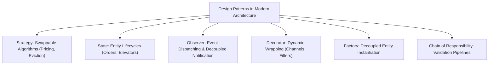

# Track 04: Low-Level Design & Concurrency

[Back to Master Dashboard](../index.mdx)

:::info

**The Staff Machine Coding Standard**

At Staff / Architect level, LLD evaluates whether you can produce **clean, decoupled, thread-safe, and infinitely extensible code under timed conditions (60-90 minutes)**.

A passing solution is not merely functional. It must satisfy SOLID principles, demonstrate zero race conditions under concurrent access, and accommodate surprise requirement shifts with minimal code churn.

:::

---

## The 90-Minute Machine Coding Protocol

Execute machine coding sessions using this structured time allocation:

```text
[00:00 - 00:15] Phase 1: Clarification, Boundaries & API Contract
  • Clarify assumptions, constraints, and non-functional requirements.
  • Identify primary entities, state machines, and lifecycles.
  • Define interface contracts and method signatures before any implementation.

[00:15 - 00:45] Phase 2: Core Domain Models & Strategy Abstractions
  • Implement core domain models, immutable value objects, and enums.
  • Introduce GoF design patterns (Strategy, Factory, State, Observer) where business logic varies.
  • Implement in-memory data structures (ConcurrentHashMap, PriorityQueue, Atomic references).

[00:45 - 00:70] Phase 3: Service Layer & Concurrency Hardening
  • Implement orchestrator service with business rules and validation.
  • Enforce thread safety: explicit ReentrantReadWriteLock, synchronized blocks, or atomic primitives.
  • Prevent deadlocks: establish strict lock ordering across multi-resource operations.

[00:70 - 00:85] Phase 4: Driver Execution, Unit Tests & Edge Cases
  • Write a runnable main/driver class demonstrating all core requirements and edge cases.
  • Add concurrent multi-threaded test cases using ExecutorService and CountDownLatch.

[00:85 - 00:90] Phase 5: The "Requirement Twist" Defense
  • Explain how the design accommodates 2 unexpected future requirements.
```

---

## Java Concurrency Primitives Reference

| Primitive | Primary Use Case | Critical Traps to Avoid |
|---|---|---|
| `AtomicInteger` / `AtomicReference` | Single-variable atomic updates via CAS | ABA problem (use `AtomicStampedReference` if needed) |
| `volatile` | Cross-core CPU cache visibility for status flags | `volatile` does NOT guarantee atomicity for compound actions (`count++`) |
| `ReentrantLock` | Fine-grained lock acquisition with timeout (`tryLock`) | Must release inside a `finally` block |
| `ReentrantReadWriteLock` | High read / low write data structures (Caches, Docs) | Upgrading read lock to write lock causes immediate deadlock |
| `StampedLock` | Optimistic read locking for ultra-high read throughput | Must re-validate stamp via `validate(stamp)` |
| `Semaphore` | Limiting concurrent permits to a resource pool | Forgetting to release permits in error handling branches |
| `CountDownLatch` | Coordinating multi-threaded test harnesses | Calling `await()` without a safety timeout |
| `BlockingQueue` | Thread-safe producer-consumer pipelines | Busy waiting instead of blocking `take()` and `offer(timeout)` |

---

## Deadlock Prevention via Global Lock Ordering

When an operation requires acquiring locks on two distinct resources (e.g., transferring funds between Account A and Account B), always sort by unique identifier before locking:

```java
public void transfer(Account from, Account to, BigDecimal amount) {
    Account first = from.getId().compareTo(to.getId()) < 0 ? from : to;
    Account second = first == from ? to : from;

    first.getLock().lock();
    try {
        second.getLock().lock();
        try {
            from.debit(amount);
            to.credit(amount);
        } finally {
            second.getLock().unlock();
        }
    } finally {
        first.getLock().unlock();
    }
}
```

---

## Core Design Patterns in Practice



---

## Subdirectory Structure

- `patterns/`: Deep-dives into Concurrency in Java, Memory Models, and Clean GoF patterns.
- `machine-coding/`: Runnable implementations of Rate Limiters, In-Memory Pub-Sub, Elevator Dispatchers, and Task Schedulers.
