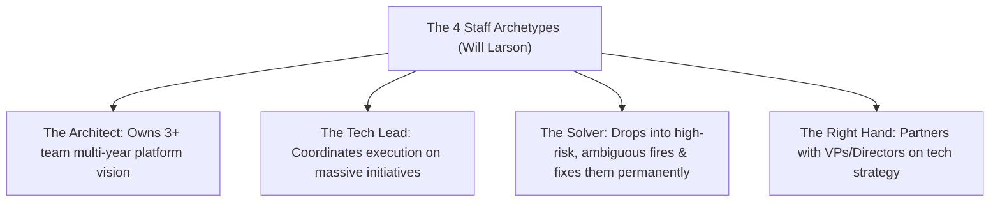

# Track 05: Leadership, Influence & Written Staff Artifacts

[Back to Master Dashboard](../index.mdx)

:::info

**The Staff Leadership Standard**

At Staff / Architect level, you are not evaluated on the code you write alone. You are evaluated on your **Scope, Ambiguity Navigation, Cross-Organizational Influence, and Multiplier Effect across 20-50+ engineers**.

This workspace houses your authenticated 12-year **STAR+ Story Bank** and **Written Engineering Artifacts** (RFCs, ADRs, Executive Pitches).

:::

---

## The 4 Staff Archetypes

Ground your behavioral narratives and leadership presence in these recognized industry archetypes:



---

## The STAR+ Storytelling Framework

All leadership narratives follow this enhanced structure to demonstrate mature engineering judgment:

```text
[S] Situation (15%)
    • Concise business context, scale, and organizational environment.
    • The specific tension: Why was this critical? What was at risk?

[T] Task & Personal Ownership (10%)
    • What was the team's mandate vs. what did I PERSONALLY own?
    • What made this problem uniquely difficult or ambiguous?

[A] Action & Influence Strategy (55% — The Core)
    • How did I frame the problem and evaluate alternatives?
    • What trade-offs did I explicitly make?
    • Who disagreed, and how did I achieve consensus without relying on formal authority?
    • What did I delegate, and how did I empower other technical leads?
    • How did I mitigate organizational risk and execute the strategy?

[R] Quantified Result (15%)
    • Business impact: Revenue saved, conversion increase, latency reduction, cost savings.
    • Technical impact: Availability from 99.5% to 99.99%, P99 latency halved.
    • Organizational impact: Adopted across 4 teams, saved 20 dev-hours per sprint.

[+] Reflection & Architectural Principle (5% — The Staff Signature)
    • What did I learn from the unintended consequences?
    • What would I do differently today?
    • What enduring architectural or leadership principle did I establish?
```

:::warning

**The "I vs We" Rule**

Never use passive phrases like *"We decided to adopt Kafka..."* in behavioral evaluations. Clearly identify:
- What did **YOU** personally propose, model, benchmark, or negotiate?
- What was your specific, individual multiplier contribution?

:::

---

## The 10 Core Leadership Competencies

Your story bank covers these 10 distinct leadership competencies:

1. **Defining Technical Vision & Strategy:** Leading multi-quarter modernization without halting business delivery.
2. **Influence Without Authority:** Aligning autonomous teams on shared standards and breaking contracts.
3. **High-Stakes Disagreement:** Resolving ideological splits between principal architects or product and engineering.
4. **Navigating Ambiguity:** Delivering when business requirements were constantly shifting.
5. **Technical Debt Governance:** Convincing business leadership to fund major refactoring using risk-based language.
6. **Production Outage & Incident Command:** Leading recovery during Sev-1 customer outages with calm authority.
7. **Failure, Miscalculation & Accountability:** Owning a major architectural failure, extracting post-incident resilience.
8. **Mentoring & Developing Senior Engineers:** Helping senior engineers step up to lead, or transforming team dynamics.
9. **Build vs. Buy / Vendor Evaluation:** Defending a major technology selection decision with empirical benchmarks.
10. **Organizational Architecture (Conway's Law):** Restructuring service boundaries to align with changing team structures.

---

## Written Staff Artifact Templates

Staff engineers lead asynchronously through clear writing:

- **Request for Comments (RFC):** Proposal for cross-team architectural changes, API contracts, and migration paths.
- **Architecture Decision Record (ADR):** Lasting 1-page record of context, options considered, trade-offs, and compliance.
- **1-Page Executive Pitch:** Business problem, ROI, technical strategy, risk mitigation, and resource ask for VPs/CTOs.
- **Blameless Incident Post-Mortem:** Chronological timeline, 5-Whys root cause, contributing factors, and preventative action items.

---

## Subdirectory Structure

- `star-story-bank/`: Real 12-year career experiences excavated and refined into STAR+ format.
- `written-artifacts/`: Ready-to-use RFC, ADR, Executive Pitch, and Post-Mortem templates and drafts.
