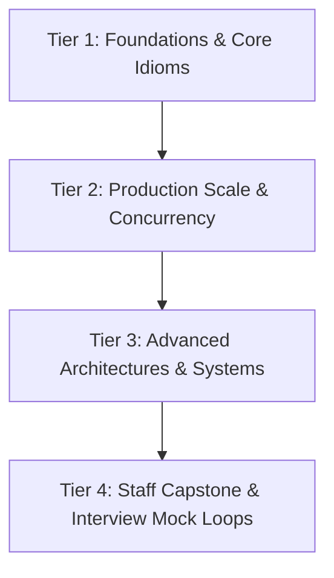

# Staff & Architect Career Preparation Command Center

:::info

**Preparation Mission & Target Standard**

Targeting **Staff Software Engineer (L6 / E6), Principal Engineer, and Software Architect** roles at top-tier product tech companies (Google, Meta, Stripe, Uber, Netflix, Amazon, Adobe).

The preparation is organized around **5 specialized tracks** and a **4-tier milestone engine**, powered by the dual-engine model: **Interactive AI Coaching (Active Muscle Memory) -> Living Handbook & Artifact Portfolio (Proven Work).**

:::

---

## The 5 Preparation Tracks

Navigate directly to each track's workspace, architectural blueprints, and artifact repositories:

| Track | Primary Focus & Competencies | Primary Stack / Deliverables | Workspace |
|---|---|---|---|
| **01 — DSA** | Algorithmic invariants, 45-min interview speed, scale bridges | Java, TypeScript, Python | [DSA Workspace](./01-dsa/README.mdx) |
| **02 — Backend HLD** | Distributed systems, storage engines, CAP/PACELC, event meshes | PostgreSQL, DynamoDB, Kafka, AWS | [Backend HLD Workspace](./02-backend-system-design/README.mdx) |
| **03 — Frontend HLD** | Web architecture, client state normalization, 60fps frame budget, offline sync | React, TypeScript, IndexedDB, WebSockets | [Frontend HLD Workspace](./03-frontend-system-design/README.mdx) |
| **04 — LLD & Concurrency** | Clean OOD, GoF patterns, Java multithreading, 90-min machine coding | Modern Java (17/21), Concurrency Primitives | [LLD Workspace](./04-low-level-design/README.mdx) |
| **05 — Leadership** | Staff presence, cross-org influence, STAR+ story bank, written artifacts | RFCs, ADRs, 1-Page Exec Pitches | [Leadership Workspace](./05-leadership/README.mdx) |

---

## 4-Tier Capability Milestones

Progress is evaluated on **demonstrated capability and production-grade artifacts**, organized into 4 capability tiers:



### [Tier 1: Foundations & Core Idioms (Sprints 1-12)](./milestones/01-tier-1-foundations.mdx)
- **DSA:** Core pattern invariants (Arrays, Two Pointers, Sliding Window, Prefix Sum).
- **Backend HLD:** Requirements clarification, capacity envelope, RDBMS vs NoSQL access patterns.
- **Frontend HLD:** Client state taxonomy, state normalization, DOM virtualization basics.
- **LLD:** SOLID abstractions, domain entity decoupling, clean interface contracts.
- **Leadership:** 12-Year career story mining, baseline STAR+ formatting.

### [Tier 2: Production Scale & Concurrency (Sprints 13-24)](./milestones/02-tier-2-scale-and-concurrency.mdx)
- **DSA:** Non-linear structures (Trees, BSTs, Graphs, Kahn's Topo Sort, Heaps, Intervals).
- **Backend HLD:** Distributed data partitioning, caching stampede mitigation, Kafka semantics.
- **Frontend HLD:** Real-time WebSockets/SSE, offline-first IndexedDB, mutation queues, Core Web Vitals.
- **LLD:** Java concurrency primitives (`ReentrantLock`, `StampedLock`, Atomics), thread-safe custom data structures.
- **Leadership:** High-stakes disagreements, cross-team alignment without authority.

### [Tier 3: Advanced Architectures & Systems (Sprints 25-36)](./milestones/03-tier-3-advanced-systems.mdx)
- **DSA:** Complex optimization (1D/2D Dynamic Programming, Monotonic Stack/Queue, Sweep-line).
- **Backend HLD:** Multi-region active-active architectures, Saga + Outbox patterns, consensus (Raft/Paxos).
- **Frontend HLD:** Micro-frontends & Module Federation, collaborative editing (CRDTs/OT), design system governance.
- **LLD:** Full 90-minute machine coding simulations (Rate Limiter, Pub-Sub, Task Scheduler).
- **Leadership:** Written Staff engineering deliverables (RFCs, 1-page executive pitches, post-mortems).

### [Tier 4: Staff Capstone & Interview Mock Loops (Sprints 37-48)](./milestones/04-tier-4-staff-capstone-mocks.mdx)
- **Cross-Track Capstones:** End-to-end full-stack systems synthesizing HLD, Frontend, LLD, and RFCs.
- **Timed Interview Loops:** 45-minute DSA, 60-minute System Design, and 45-minute Staff Behavioral mocks.
- **FAANG L6 / Meta E6 Calibration:** Final Polish, ambiguity navigation, and executive communication.

---

## The 4-State Competency Model

Every milestone competency is tracked via four explicit stages:

```
[Untested] -> [Needs Practice] -> [Developing] -> [Demonstrated]
```

1. **Untested:** Baseline topic not yet evaluated in active coaching.
2. **Needs Practice:** Attempted, but revealed blind spots, anti-patterns, or incomplete trade-off defense.
3. **Developing:** Correct solution reached with minor assistance, or lacking Staff-level communication pace.
4. **Demonstrated:** Independently solved, defended trade-offs, analyzed failure modes, and generated a clean handbook artifact.
