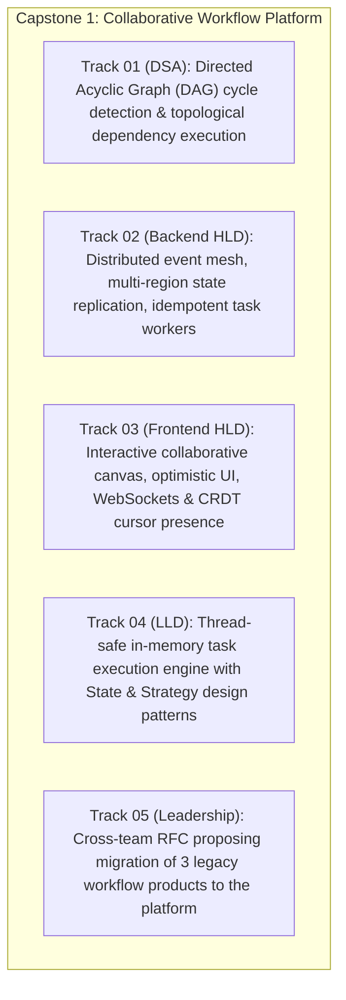
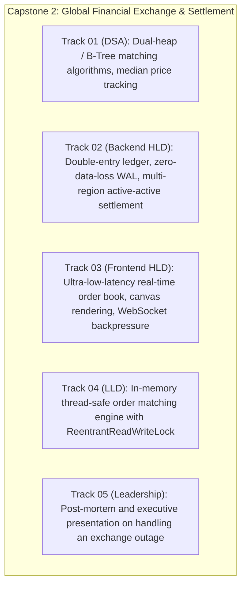

# Tier 4: Staff Capstones & Interview Loops (Sprints 37-48)

[Back to Master Dashboard](../index.mdx)

:::info

**Tier 4 Strategic Goal**

Synthesize all 5 tracks into end-to-end Staff-level engineering execution:
- **Cross-Track Capstones:** Solving real-world enterprise platforms across HLD, Frontend, LLD, and Leadership.
- **Full-Loop Mock Interviews:** 45-minute DSA, 60-minute Backend Design, 60-minute Frontend Design, 90-minute Machine Coding, and 45-minute Staff Behavioral loops.
- **Top-Tier Calibration:** Uncompromising alignment with Google L6, Meta E6, and Amazon Principal leveling expectations.

:::

---

## Sprints 37-39: Capstone 1 — Enterprise Collaborative Workflow Platform

Execute an integrated end-to-end design for a mission-critical enterprise platform:

### Deliverables Check-in:
- [ ] Runnable Java implementation of the thread-safe workflow execution engine
- [ ] Full backend system design topology diagram and storage partitioning schema
- [ ] Frontend client state normalization and canvas rendering architecture
- [ ] Formal RFC document presented and defended under simulated stakeholder review

---

## Sprints 40-42: Capstone 2 — Global High-Frequency Exchange & Settlement

Execute an integrated end-to-end design for a financial trading and settlement system:

### Deliverables Check-in:
- [ ] Thread-safe matching engine implementation in Java with unit tests
- [ ] Written Architecture Decision Record (ADR) on double-entry ledger durability
- [ ] Frontend order book 60fps frame budget analysis and virtualized rendering design
- [ ] Blameless post-mortem document for a simulated settlement failure

---

## Sprints 43-45: Full FAANG Staff / Architect Mock Interview Loops

Simulate real, continuous 5-round Staff interview loops:

### Round 1: DSA & Algorithmic Problem Solving (45 Mins)
- [ ] Unseen algorithmic problem with complex invariants
- [ ] Constraint clarification and brute-force complexity analysis
- [ ] Clean, compilable implementation in Java or TypeScript within 25 minutes
- [ ] Dry-run edge case walkthrough and distributed scale extension

### Round 2: Backend System Design & Distributed Systems (60 Mins)
- [ ] Ambiguous, massive-scale system prompt (100k+ QPS, petabyte storage)
- [ ] Capacity envelope, domain modeling, and data partitioning strategy
- [ ] Deep-dive into critical paths, distributed transactions, and failure modes
- [ ] Written Architecture Decision Record (ADR) produced under timed conditions

### Round 3: Frontend System Design & Web Architecture (60 Mins)
- [ ] Complex client-side system prompt (Collaborative app, social feed, or video player)
- [ ] Client state taxonomy, entity normalization, and real-time synchronization
- [ ] 60fps frame budget, DOM virtualization, and Core Web Vitals defense
- [ ] Multi-team governance, micro-frontends, and client security

### Round 4: Low-Level Design & Machine Coding (90 Mins)
- [ ] End-to-end thread-safe system implementation in Java from scratch
- [ ] Decoupled domain models, GoF design patterns, and exception hierarchies
- [ ] Multi-threaded test suite proving zero race conditions or deadlocks
- [ ] Requirement twist successfully implemented in final 15 minutes

### Round 5: Staff Leadership & Organizational Influence (45 Mins)
- [ ] In-depth exploration of Scope, Ambiguity, and Cross-Team Influence
- [ ] Relentless cross-examination on personal ownership, metrics, and trade-offs
- [ ] 2-Minute Executive Pitch delivered to a simulated CTO
- [ ] Demonstration of Staff archetypes (*The Architect* and *The Multiplier*)

---

## Sprints 46-48: Final Polish, Spaced Repetition & Leveling Strategy

- [ ] Complete Spaced Repetition Queue review for all demonstrated competencies
- [ ] Review full portfolio: 10 STAR+ stories, 4 ADRs, 2 RFCs, and 2 Machine Coding repos
- [ ] Calibration check against target company leveling rubrics:
  - Google L6 (Software Engineer III / Staff Software Engineer)
  - Meta E6 (Staff Software Engineer)
  - Stripe L3 (Staff Software Engineer)
  - Amazon L7 (Principal Software Engineer)
- [ ] Final readiness sign-off across all 5 tracks
