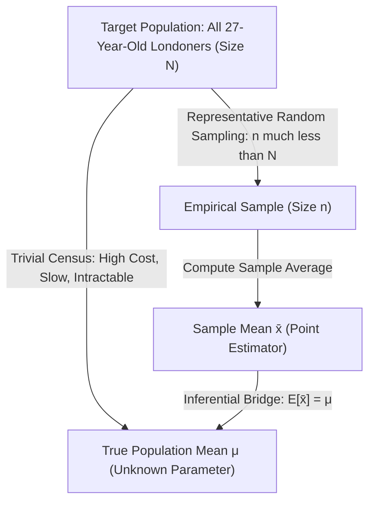
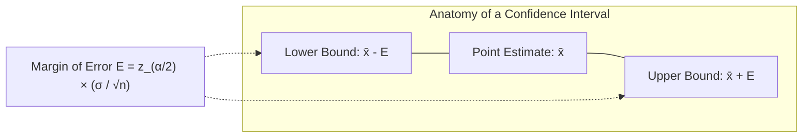
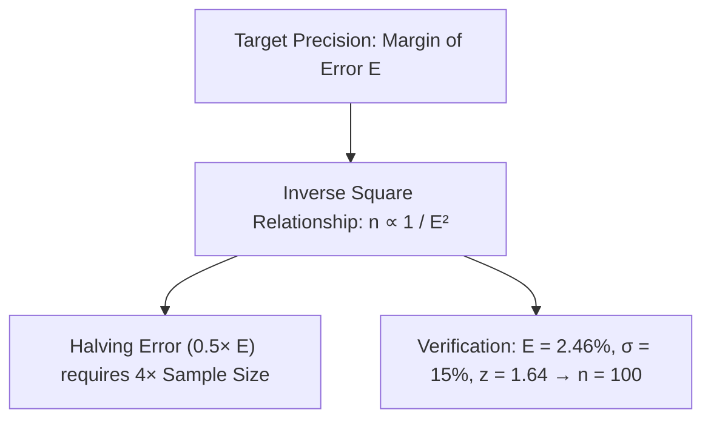
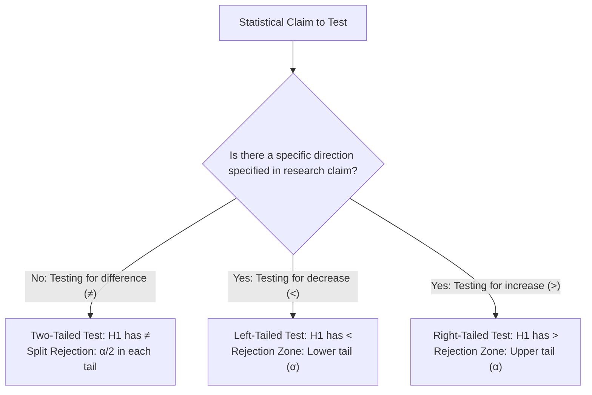
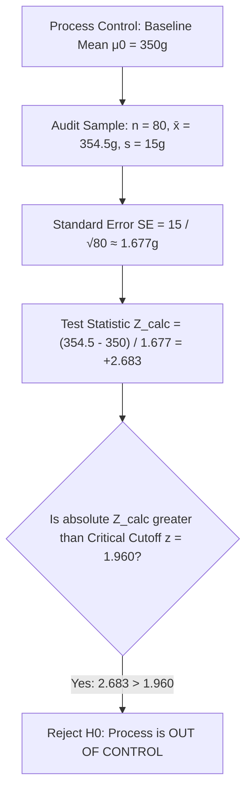
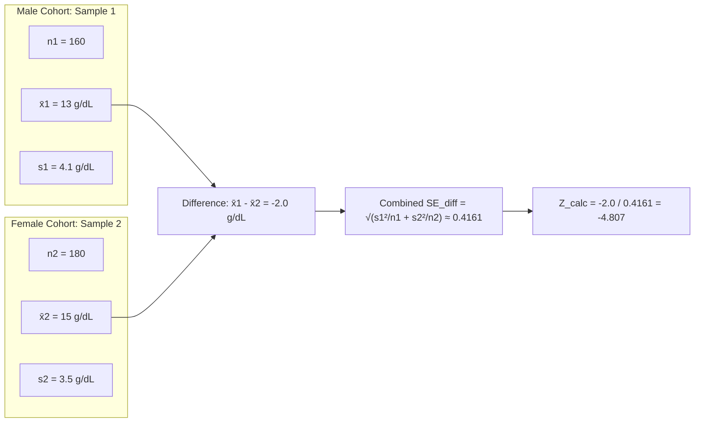

import Tabs from '@theme/Tabs';
import TabItem from '@theme/TabItem';
import Heading from '@theme/Heading';
import React from 'react';

# Module 3 Sample Questions: Estimation & Hypothesis Testing

This document provides rigorous, textbook-style solutions for the Module 3 examination questions and real-world scenario problems. All formulas are rendered in LaTeX, accompanied by step-by-step mathematical derivations, visual normal distribution graphs, decision flowcharts, and formal academic inferences.

---

## Question 1: Concept of Point Estimation (Average Income)

### Question Details
What would be the average income of a 27-year-old in London? How would you calculate it?

---

### Step-by-Step Solution

#### 1. Theoretical Formulation
Let the random variable $X$ represent the annual income of a 27-year-old individual residing in London. The true arithmetic mean income across all such individuals in the target population is denoted by the population parameter $\mu$:

$$\mu = \frac{1}{N} \sum_{i=1}^N X_i$$

where $N$ is the total population size of 27-year-olds in London.

#### 2. The Operational Reality (Need for Sampling)
*   **The Trivial Approach:** Conduct a complete census by querying every single 27-year-old in London and computing $\mu$.
*   **Practical Infeasibility:** A full census is cost-prohibitive, operationally difficult, time-consuming, and subject to non-response bias.
*   **The Inferential Solution:** Draw a representative Simple Random Sample (SRS) of size $n$ from the population.

#### 3. Mathematical Point Estimator
The **sample mean ($\bar{x}$)** serves as the best point estimator for the population mean $\mu$:

$$\hat{\mu} = \bar{x} = \frac{1}{n} \sum_{i=1}^n x_i$$

*   **Unbiasedness Property:** The sample mean is an unbiased estimator of $\mu$ because its expected value equals the parameter:
    $$\mathbb{E}[\bar{x}] = \mu$$
*   **Consistency Property:** By the Weak Law of Large Numbers, as sample size $n \to \infty$, the sample mean converges in probability to $\mu$:
    $$\lim_{n \to \infty} P(|\bar{x} - \mu| < \epsilon) = 1 \quad \forall \epsilon > 0$$

> **Academic Inference:** Because obtaining the exact population parameter $\mu$ via census is practically unviable, we draw an unbiased random sample of size $n$, calculate the sample mean $\bar{x}$, and report $\bar{x}$ as the **point estimate** for the true average income of a 27-year-old in London.

---

## Question 2: Point Estimate of Count via Sample Proportion

### Question Details
A financial firm has created 50 portfolios. From them a sample of 13 portfolios was selected, out of which 8 were found to be underperforming. Estimate the number of underperforming portfolios.

---

### Step-by-Step Derivation

#### 1. Given Parameters
*   Total population size of portfolios: $N = 50$
*   Sample size audited: $n = 13$
*   Number of underperforming portfolios in the sample: $x = 8$

#### 2. Calculation of Sample Proportion ($\hat{p}$)
The sample proportion of underperforming portfolios $\hat{p}$ is computed as:

$$\hat{p} = \frac{x}{n} = \frac{8}{13} \approx 0.615385 \quad (61.54\%)$$

#### 3. Estimation of Total Underperforming Portfolios ($\hat{N}_{\text{under}}$)
To estimate the total number of underperforming portfolios in the entire population of $N = 50$, we scale the point estimate $\hat{p}$ by the population size $N$:

$$\hat{N}_{\text{under}} = \hat{p} \times N = \frac{8}{13} \times 50 = \frac{400}{13} \approx 30.7692$$

Since the count of portfolios must be a discrete non-negative integer, we round to the nearest whole unit:

$$\hat{N}_{\text{under}} \approx \mathbf{31 \text{ portfolios}}$$

> **Academic Inference:** Based on the observed sample failure rate of approximately $61.54\%$, the point estimate for the total number of underperforming portfolios across the firm's 50 investment portfolios is **31 portfolios**.

---

## Question 3: Margin of Error Calculation for Population Mean

### Question Details
100 bags of coal were tested and had an average of 35% of ash with a standard deviation of 15%. Calculate the margin of error for a 90% confidence level.

---

### Step-by-Step Derivation

#### 1. Given Parameters
*   Sample size: $n = 100$
*   Sample mean ash content: $\bar{x} = 35\% = 0.35$
*   Standard deviation: $\sigma = 15\% = 0.15$
*   Confidence level: $1 - \alpha = 0.90 \implies \text{Significance level } \alpha = 0.10$

#### 2. Determination of Critical Value ($z_{\alpha/2}$)
For a two-sided confidence interval at $\alpha = 0.10$, the tail probability in each half is $\alpha / 2 = 0.05$:

$$z_{\alpha/2} = z_{0.05} = 1.645$$

#### 3. Standard Error of the Mean (SE)
$$\text{SE} = \frac{\sigma}{\sqrt{n}} = \frac{0.15}{\sqrt{100}} = \frac{0.15}{10} = 0.015 \quad (1.5\%)$$

#### 4. Computation of Margin of Error ($E$)
The margin of error $E$ is defined as the maximum expected distance between the sample estimate and the true population mean:

$$E = z_{\alpha/2} \times \frac{\sigma}{\sqrt{n}}$$
$$E = 1.645 \times 0.015 = 0.024675 \approx \mathbf{0.0247} \quad (\text{or } \mathbf{2.47\%})$$

*(Note: If using $z = 1.64$, $E = 1.64 \times 0.015 = \mathbf{0.0246}$ or $\mathbf{2.46\%}$).*

> **Academic Inference:** At a 90% level of confidence, the margin of error is **2.47%** (or **0.0247**). This indicates that the true population mean ash content is expected to lie within $\pm 2.47$ percentage points of the sample estimate across 90% of repeated random samples.

---

## Question 4: Sample Size Verification from Fixed Margin of Error

### Question Details
For the previous question, for a margin of error 2.46%. Verify whether you get a sample size of 100.

---

### Step-by-Step Derivation

#### 1. Mathematical Formula for Sample Size
Starting from the margin of error equation:

$$E = z_{\alpha/2} \frac{\sigma}{\sqrt{n}}$$

Multiplying both sides by $\sqrt{n}$ and dividing by $E$:

$$\sqrt{n} = \frac{z_{\alpha/2} \cdot \sigma}{E}$$

Squaring both sides yields the sample size determination formula:

$$n = z_{\alpha/2}^2 \left( \frac{\sigma^2}{E^2} \right) = \left( \frac{z_{\alpha/2} \cdot \sigma}{E} \right)^2$$

#### 2. Verification Calculation
*   Given margin of error: $E = 2.46\% = 0.0246$
*   Standard deviation: $\sigma = 15\% = 0.15$
*   Critical value for 90% confidence ($\alpha = 0.10$): $z_{\alpha/2} = 1.64$ (or $1.645$)

Using $z = 1.64$:

$$n = \left( \frac{1.64 \times 0.15}{0.0246} \right)^2 = \left( \frac{0.246}{0.0246} \right)^2 = (10)^2 = \mathbf{100}$$

Using standard three-decimal precision $z = 1.645$ and exact rounding:

$$n = \left( \frac{1.645 \times 0.15}{0.024675} \right)^2 = (10)^2 = \mathbf{100}$$

> **Academic Inference:** The algebraic verification confirms that a desired margin of error of **2.46%** under a 90% confidence level and $\sigma = 15\%$ requires an exact sample size of **$n = 100$ bags**.

---

## Question 5: Confidence Interval for Population Mean (London Incomes)

### Question Details
From a sample of 250 observations it is found that average income of a 27-year-old Londoner is £45,000 with a population standard deviation of £4000. Obtain the 95% confidence interval to estimate the average income. Furthermore, compare the width of 90%, 95%, and 99% confidence intervals.

---

### Step-by-Step Derivation

#### 1. Given Data
*   Sample size: $n = 250$
*   Sample mean income: $\bar{x} = £45,000$
*   Population standard deviation: $\sigma = £4,000$
*   Confidence level: $1 - \alpha = 0.95 \implies \alpha = 0.05$

#### 2. Critical Value Determination
For a two-tailed 95% confidence interval:

$$\frac{\alpha}{2} = 0.025 \implies z_{\alpha/2} = z_{0.025} = 1.96$$

#### 3. Standard Error Calculation
$$\text{SE} = \frac{\sigma}{\sqrt{n}} = \frac{4000}{\sqrt{250}} = \frac{4000}{15.811388} \approx 252.9822 \text{ GBP}$$

#### 4. Margin of Error ($E$)
$$E = z_{\alpha/2} \times \text{SE} = 1.96 \times 252.9822 \approx £495.845$$

#### 5. Confidence Interval Boundaries
$$\text{CI}_{95\%} = \bar{x} \pm E = 45000 \pm 495.845$$

*   **Lower Limit ($L$):** $45000 - 495.845 = \mathbf{£44,504.155}$
*   **Upper Limit ($U$):** $45000 + 495.845 = \mathbf{£45,495.845}$

$$\text{CI}_{95\%} = [£44504.16, \; £45495.85]$$

#### 6. Visualizing Confidence Level vs. Interval Width

  <svg viewBox="0 0 520 220" style={{ width: '100%', maxWidth: '560px', height: 'auto', backgroundColor: 'var(--ifm-background-surface-color)', borderRadius: '8px', border: '1px solid var(--ifm-color-emphasis-300)' }}>
    {/* Base Axis */}
    <line x1="30" y1="180" x2="490" y2="180" stroke="var(--ifm-color-emphasis-600)" strokeWidth="1.5" />
    
    {/* Center Line: Sample Mean */}
    <line x1="260" y1="20" x2="260" y2="180" stroke="#3b82f6" strokeWidth="1.5" strokeDasharray="3 3" />
    <text x="260" y="198" textAnchor="middle" fontSize="11" fontWeight="bold" fill="var(--ifm-color-emphasis-800)">x̄ = £45,000</text>
    
    {/* 90% CI Bar */}
    <rect x="190" y="50" width="140" height="22" rx="4" fill="rgba(59, 130, 246, 0.25)" stroke="#3b82f6" strokeWidth="1.5" />
    <text x="260" y="65" textAnchor="middle" fontSize="11" fontWeight="bold" fill="var(--ifm-color-emphasis-800)">90% CI [£44,584 - £45,416] (Width: £832)</text>
    
    {/* 95% CI Bar */}
    <rect x="170" y="90" width="180" height="22" rx="4" fill="rgba(16, 185, 129, 0.25)" stroke="#10b981" strokeWidth="1.5" />
    <text x="260" y="105" textAnchor="middle" fontSize="11" fontWeight="bold" fill="var(--ifm-color-emphasis-800)">95% CI [£44,504 - £45,496] (Width: £992)</text>
    
    {/* 99% CI Bar */}
    <rect x="140" y="130" width="240" height="22" rx="4" fill="rgba(239, 68, 68, 0.25)" stroke="#ef4444" strokeWidth="1.5" />
    <text x="260" y="145" textAnchor="middle" fontSize="11" fontWeight="bold" fill="var(--ifm-color-emphasis-800)">99% CI [£44,349 - £45,651] (Width: £1,303 - Widest)</text>
  </svg>

> **Academic Inference & Interpretation Trap:**
> *   **Width vs. Certainty:** As confidence increases from 90% to 99%, the critical value grows ($1.645 \to 2.575$), creating a **progressively wider interval**. Higher certainty requires casting a broader net.
> *   **Interpretation Trap:** It is mathematically incorrect to state that $P(44504.16 \le \mu \le 45495.85) = 0.95$. The population mean $\mu$ is an invariant constant, not a random variable. The 95% confidence reflects the long-run coverage rate of the *statistical procedure*.

---

## Question 6: Confidence Interval for Population Proportion

### Question Details
A financial firm has created 50 portfolios. From them a sample of 13 portfolios was selected, out of which 8 were found to be underperforming. Construct a 99% confidence interval to estimate the population proportion.

---

### Step-by-Step Derivation

#### 1. Given Data
*   Sample size: $n = 13$
*   Number of underperforming units: $x = 8$
*   Sample proportion: $\hat{p} = \frac{x}{n} = \frac{8}{13} \approx 0.615385$
*   Confidence level: $1 - \alpha = 0.99 \implies \alpha = 0.01$

#### 2. Critical Value Determination
For a two-tailed 99% confidence interval:

$$\frac{\alpha}{2} = 0.005 \implies z_{\alpha/2} = z_{0.005} = 2.575 \quad (\text{or } 2.576)$$

#### 3. Standard Error of Proportion ($\text{SE}_p$)
$$\text{SE}_p = \sqrt{\frac{\hat{p}(1 - \hat{p})}{n}} = \sqrt{\frac{0.615385 \times (1 - 0.615385)}{13}} = \sqrt{\frac{0.615385 \times 0.384615}{13}}$$
$$\text{SE}_p = \sqrt{\frac{0.236686}{13}} = \sqrt{0.0182066} \approx 0.134932$$

#### 4. Margin of Error ($E$)
$$E = z_{\alpha/2} \times \text{SE}_p = 2.575 \times 0.134932 \approx 0.34745$$

#### 5. Confidence Interval Boundaries
$$\text{CI}_{99\%} = \hat{p} \pm E = 0.615385 \pm 0.34745$$

*   **Lower Limit:** $0.615385 - 0.34745 = \mathbf{0.2679} \quad (26.79\%)$
*   **Upper Limit:** $0.615385 + 0.34745 = \mathbf{0.9628} \quad (96.28\%)$

$$\text{CI}_{99\%} = [0.2679, \; 0.9628]$$

> **Academic Inference:** We are 99% confident that the true population proportion of underperforming portfolios across the firm lies between **26.79%** and **96.28%**. The wide span of this interval reflects the high uncertainty resulting from a very small sample size ($n = 13$).

---

## Question 7: Destructive Testing & The Rationale for Hypothesis Testing

### Question Details
A manufacturer produces batteries. He claims that the life of his batteries is 25,500 hours. Can we verify his claim?

---

### Step-by-Step Solution

#### 1. The Trivial Verification Approach
The naive way to verify this claim is to measure the operating lifespan of every single battery produced by running each unit until its energy is completely depleted.

#### 2. The Operational Dilemma: Destructive Testing
Lifespan testing is inherently **destructive testing**. Running a battery to exhaustion consumes the product entirely.

#### 3. The Statistical Alternative: Hypothesis Testing
To overcome this dilemma, we execute **Statistical Hypothesis Testing**:
1.  **Formulate Statistical Claims:**
    *   **Null Hypothesis ($H_0$):** $\mu = 25,500 \text{ hours}$ (Manufacturer claim is true)
    *   **Alternative Hypothesis ($H_1$):** $\mu < 25,500 \text{ hours}$ (Watchdog claim that batteries underperform)
2.  **Representative Sampling:** Extract a small, random sample of $n$ batteries (e.g., $n = 50$).
3.  **Controlled Depletion:** Test only the sample units to failure to compute the sample mean $\bar{x}$ and sample standard deviation $s$.
4.  **Inferential Decision:** Evaluate the $Z$-statistic or $t$-statistic. If the empirical evidence deviates significantly from $25,500$ hours beyond random sampling chance, we reject $H_0$; otherwise, we fail to reject $H_0$.

> **Academic Inference:** We cannot verify the claim deterministically across the entire population because testing is destructive. Instead, we statistically test the manufacturer's claim using a representative sample, balancing statistical rigor with inventory preservation.

---

## Question 8: Formulation of Null and Alternative Hypotheses

### Question Details
Write the null and alternative hypotheses for the following scenarios and classify the test type (number of tails):

1.  A bolt manufacturing company claims that the average number of bolts manufactured in a day is 60.
2.  The new virus testing kit takes less time than the standard testing kit that takes 34 hours for the results.
3.  An analyst wants to test whether Apple Inc. stock has outperformed in 2019 by 13.5%.

---

### Step-by-Step Formulations

#### Scenario 1: Bolt Manufacturing
*   **Target Metric:** Let $X$ denote the number of bolts manufactured daily, and $\mu$ denote the true mean daily production.
*   **Manufacturer Claim:** Daily production equals 60.
*   **Hypotheses:**
    $$H_0: \mu = 60 \quad \text{versus} \quad H_1: \mu \neq 60$$
*   **Classification:** **Two-Tailed Test**. A defect or deviation occurs if the machinery under-produces ($\mu < 60$) or over-produces ($\mu > 60$). The rejection region is split equally into both tails ($\alpha / 2$).

---

#### Scenario 2: Virus Testing Kit Processing Time
*   **Target Metric:** Let $X$ denote the time (in hours) required to obtain diagnostic results, and $\mu$ denote the true mean result latency.
*   **Research Claim:** The new kit reduces processing time below the standard 34 hours ($\mu < 34$).
*   **Hypotheses:**
    $$H_0: \mu \ge 34 \quad \text{versus} \quad H_1: \mu < 34$$
*   **Classification:** **Left-Tailed Test (One-Tailed)**. The alternative claim specifically focuses on reduction/improvement. The entire rejection region $\alpha$ is concentrated in the lower (left) tail.

---

#### Scenario 3: Apple Inc. Stock Outperformance
*   **Target Metric:** Let $X$ denote the percentage return/performance of Apple Inc. stock in 2019, and $\mu$ denote the true average performance.
*   **Analyst Claim:** The stock outperformed the baseline target of 13.5% ($\mu > 13.5\%$).
*   **Hypotheses:**
    $$H_0: \mu \le 13.5 \quad \text{versus} \quad H_1: \mu > 13.5$$
*   **Classification:** **Right-Tailed Test (One-Tailed)**. The claim tests strictly for an increase or outperformance above the benchmark. The rejection region $\alpha$ is placed entirely in the upper (right) tail.

---

## Question 9: Practice Identification of Test Directionality

### Question Details
For each scenario, define the parameter $\mu$, state $H_0$ and $H_1$, and identify whether the test is two-tailed, left-tailed, or right-tailed:
1.  Mean diastolic blood pressure for a group of 85 adults is less than 90 mm.
2.  The tensile strength of an alloy is more than 500 Pa.
3.  The average heart rate of a healthy human is 85 beats per minute.
4.  The yield of BT cotton is more than 450 kg lint per hectare.

---

### Classification Matrix

| Objective / Statement | Parameter Definition ($\mu$) | Null Hypothesis ($H_0$) | Alternative Hypothesis ($H_1$) | Test Classification | Critical Region |
| :--- | :--- | :---: | :---: | :---: | :---: |
| **1. Diastolic Blood Pressure** | Mean adult diastolic blood pressure (mm Hg) | $\mu \ge 90$ | $\mu < 90$ | **Left-Tailed** | Lower tail ($Z < -z_\alpha$) |
| **2. Alloy Tensile Strength** | Mean breaking tensile strength (Pa) | $\mu \le 500$ | $\mu > 500$ | **Right-Tailed** | Upper tail ($Z > z_\alpha$) |
| **3. Healthy Human Heart Rate** | Mean healthy resting heart rate (bpm) | $\mu = 85$ | $\mu \neq 85$ | **Two-Tailed** | Both tails ($\lvert Z \rvert > z_{\alpha/2}$) |
| **4. BT Cotton Crop Yield** | Mean cotton yield (kg lint/hectare) | $\mu \le 450$ | $\mu > 450$ | **Right-Tailed** | Upper tail ($Z > z_\alpha$) |

---

## Question 10: Two-Tailed Large Sample Z-Test (Car Mileage)

### Question Details
A car manufacturing company claims that the mileage of their new car is 25 kmph with a standard deviation of 2.5 kmph. A random sample of 45 cars was drawn and recorded their mileage as per the standard procedure. From the sample, the mean mileage was seen to be 24 kmph. Is this evidence to claim that the mean mileage is different from 25 kmph? (Assume normality of data).
Test the claim using:
1.  Critical region technique
2.  p-value technique
3.  Confidence interval technique
*(Use $\alpha = 0.01$).*

---

### Step-by-Step Solution

#### 1. Hypothesis Formulation
*   $H_0: \mu = 25 \text{ kmph}$ (Mean mileage is equal to 25 kmph)
*   $H_1: \mu \neq 25 \text{ kmph}$ (Mean mileage is significantly different from 25 kmph)
*   Test type: **Two-Tailed Test**, $\alpha = 0.01$.

#### 2. Given Sample Data & Standard Error
*   $\mu_0 = 25$, $\sigma = 2.5$, $n = 45$, $\bar{x} = 24$.
*   Since $n = 45 \ge 30$, the Central Limit Theorem validates the Z-test.

$$\text{SE} = \frac{\sigma}{\sqrt{n}} = \frac{2.5}{\sqrt{45}} = \frac{2.5}{6.7082} \approx 0.372678$$

#### 3. Calculation of Test Statistic ($Z_{\text{calc}}$)
$$Z_{\text{calc}} = \frac{\bar{x} - \mu_0}{\sigma / \sqrt{n}} = \frac{24 - 25}{0.372678} = \frac{-1.0}{0.372678} \approx \mathbf{-2.683}$$

#### 4. Distribution & Rejection Graph

  <svg viewBox="0 0 500 220" style={{ width: '100%', maxWidth: '550px', height: 'auto', backgroundColor: 'var(--ifm-background-surface-color)', borderRadius: '8px', border: '1px solid var(--ifm-color-emphasis-300)' }}>
    {/* Base Axis */}
    <line x1="40" y1="170" x2="460" y2="170" stroke="var(--ifm-color-emphasis-600)" strokeWidth="1.5" />
    
    {/* Shaded Left Rejection Region */}
    <path d="M 50 170 C 80 170 100 162 115 145 L 115 170 Z" fill="rgba(239, 68, 68, 0.35)" />
    
    {/* Shaded Right Rejection Region */}
    <path d="M 385 145 C 400 162 420 170 450 170 L 385 170 Z" fill="rgba(239, 68, 68, 0.35)" />
    
    {/* Shaded Acceptance Region */}
    <path d="M 115 170 L 115 145 C 150 100 180 35 250 35 C 320 35 350 100 385 145 L 385 170 Z" fill="rgba(34, 197, 94, 0.15)" />
    
    {/* Bell Curve Outline */}
    <path d="M 50 170 C 100 170 160 35 250 35 C 340 35 400 170 450 170" fill="none" stroke="var(--ifm-color-primary)" strokeWidth="2.5" />
    
    {/* Critical Lines */}
    <line x1="115" y1="145" x2="115" y2="170" stroke="#ef4444" strokeWidth="2" strokeDasharray="3 3" />
    <line x1="385" y1="145" x2="385" y2="170" stroke="#ef4444" strokeWidth="2" strokeDasharray="3 3" />
    <line x1="250" y1="35" x2="250" y2="170" stroke="var(--ifm-color-emphasis-400)" strokeWidth="1" strokeDasharray="2 2" />
    
    {/* Calculated Z Marker (Z_calc = -2.683 falls at x = 100) */}
    <line x1="100" y1="115" x2="100" y2="170" stroke="#3b82f6" strokeWidth="2.5" />
    <polygon points="100,115 95,105 105,105" fill="#3b82f6" />
    <text x="100" y="98" textAnchor="middle" fontSize="11" fontWeight="bold" fill="#3b82f6">Z_calc = -2.68</text>
    
    {/* Text Labels */}
    <text x="250" y="110" textAnchor="middle" fontSize="12" fontWeight="bold" fill="var(--ifm-color-emphasis-800)">Acceptance Region (1 - α = 99%)</text>
    <text x="85" y="186" textAnchor="middle" fontSize="11" fontWeight="bold" fill="#ef4444">-z_α/2 = -2.575</text>
    <text x="415" y="186" textAnchor="middle" fontSize="11" fontWeight="bold" fill="#ef4444">+z_α/2 = +2.575</text>
    <text x="250" y="186" textAnchor="middle" fontSize="11" fill="var(--ifm-color-emphasis-700)">μ = 0 (Mileage = 25)</text>
    <text x="82" y="152" textAnchor="middle" fontSize="10" fill="#ef4444">α/2 = 0.005</text>
    <text x="418" y="152" textAnchor="middle" fontSize="10" fill="#ef4444">α/2 = 0.005</text>
  </svg>

---

### Three Decision Methods Evaluation

<Tabs>
  <TabItem value="crit" label="1. Critical Region Method" default>
     
    
    *   **Critical Cutoff Value:** For $\alpha = 0.01$ (two-tailed), $z_{\alpha/2} = z_{0.005} = 2.575$.
    *   **Decision Rule:** Reject $H_0$ if $|Z_{\text{calc}}| > z_{\alpha/2}$.
    *   **Comparison:**
        $$|Z_{\text{calc}}| = |-2.683| = 2.683 > 2.575$$
    *   **Decision:** **Reject $H_0$**. The test statistic falls in the lower rejection tail.
  </TabItem>
  <TabItem value="pval" label="2. P-Value Method">
     
    
    *   **P-Value Definition:** Total tail probability beyond the observed test statistic:
        $$p = 2 \times P(Z > |Z_{\text{calc}}|) = 2 \times P(Z > 2.683)$$
    *   **Probability Evaluation:**
        $$P(Z < -2.683) \approx 0.00365 \implies p\text{-value} = 2 \times 0.00365 = \mathbf{0.0073}$$
    *   **Decision Rule:** Reject $H_0$ if $p\text{-value} \le \alpha$.
    *   **Comparison:**
        $$p\text{-value} = 0.0073 < \alpha = 0.01$$
    *   **Decision:** **Reject $H_0$**.
  </TabItem>
  <TabItem value="ci" label="3. Confidence Interval Method">
     
    
    *   **Construct 99% CI:**
        $$\text{CI}_{99\%} = \bar{x} \pm z_{\alpha/2} \frac{\sigma}{\sqrt{n}} = 24 \pm (2.575 \times 0.372678) = 24 \pm 0.9596$$
        $$\text{CI}_{99\%} = [23.0404, \; 24.9596]$$
    *   **Decision Rule:** Reject $H_0$ if hypothesized mean $\mu_0$ does not fall within the confidence interval.
    *   **Comparison:**
        $$\mu_0 = 25 \notin [23.0404, \; 24.9596]$$
    *   **Decision:** **Reject $H_0$**.
  </TabItem>
</Tabs>

> **Academic Inference:** All three evaluation criteria converge to the identical conclusion: **Reject $H_0$ at the 1% significance level**. There is strong empirical evidence that the true average mileage of the new car differs from 25 kmph (specifically, it is statistically significantly lower at 24 kmph).

---

## Question 11: One-Sample Left-Tailed Z-Test (PVC Pipe Thickness)

### Question Details
A sample of 900 PVC pipes is found to have an average thickness of 12.5 mm. Can we assume that the sample is coming from a normal population with mean 13 mm against that it is less than 13 mm? The population standard deviation is 1 mm. Test the hypothesis using the p-value method at 5% level of significance.

---

### Step-by-Step Derivation

#### 1. Hypothesis Formulation
*   $H_0: \mu \ge 13 \text{ mm}$ (Mean thickness is at least 13 mm)
*   $H_1: \mu < 13 \text{ mm}$ (Mean thickness is strictly less than 13 mm)
*   Test type: **Left-Tailed Test**, $\alpha = 0.05$.

#### 2. Given Data
*   Hypothesized mean: $\mu_0 = 13 \text{ mm}$
*   Population standard deviation: $\sigma = 1 \text{ mm}$
*   Sample size: $n = 900$
*   Sample mean: $\bar{x} = 12.5 \text{ mm}$

#### 3. Standard Error Calculation
$$\text{SE} = \frac{\sigma}{\sqrt{n}} = \frac{1}{\sqrt{900}} = \frac{1}{30} \approx 0.03333 \text{ mm}$$

#### 4. Test Statistic ($Z_{\text{calc}}$)
$$Z_{\text{calc}} = \frac{\bar{x} - \mu_0}{\text{SE}} = \frac{12.5 - 13.0}{1 / 30} = -0.5 \times 30 = \mathbf{-15.0}$$

#### 5. Distribution & Left-Tail Rejection Graph

  <svg viewBox="0 0 500 220" style={{ width: '100%', maxWidth: '550px', height: 'auto', backgroundColor: 'var(--ifm-background-surface-color)', borderRadius: '8px', border: '1px solid var(--ifm-color-emphasis-300)' }}>
    {/* Base Axis */}
    <line x1="40" y1="170" x2="460" y2="170" stroke="var(--ifm-color-emphasis-600)" strokeWidth="1.5" />
    
    {/* Shaded Left Rejection Region */}
    <path d="M 50 170 C 80 170 120 160 145 130 L 145 170 Z" fill="rgba(239, 68, 68, 0.35)" />
    
    {/* Shaded Acceptance Region */}
    <path d="M 145 170 L 145 130 C 180 85 200 35 250 35 C 320 35 370 110 450 170 L 145 170 Z" fill="rgba(34, 197, 94, 0.15)" />
    
    {/* Bell Curve Outline */}
    <path d="M 50 170 C 100 170 160 35 250 35 C 340 35 400 170 450 170" fill="none" stroke="var(--ifm-color-primary)" strokeWidth="2.5" />
    
    {/* Critical Cutoff Line */}
    <line x1="145" y1="130" x2="145" y2="170" stroke="#ef4444" strokeWidth="2" strokeDasharray="3 3" />
    <line x1="250" y1="35" x2="250" y2="170" stroke="var(--ifm-color-emphasis-400)" strokeWidth="1" strokeDasharray="2 2" />
    
    {/* Extreme Calculated Z Marker (Z = -15.0 far to left) */}
    <line x1="45" y1="130" x2="45" y2="170" stroke="#3b82f6" strokeWidth="3" />
    <polygon points="45,130 40,120 50,120" fill="#3b82f6" />
    <text x="75" y="112" textAnchor="middle" fontSize="11" fontWeight="bold" fill="#3b82f6">Z_calc = -15.0</text>
    
    {/* Labels */}
    <text x="280" y="110" textAnchor="middle" fontSize="12" fontWeight="bold" fill="var(--ifm-color-emphasis-800)">Acceptance Region (Fail to Reject H0)</text>
    <text x="145" y="185" textAnchor="middle" fontSize="11" fontWeight="bold" fill="#ef4444">-z_α = -1.645</text>
    <text x="250" y="185" textAnchor="middle" fontSize="11" fill="var(--ifm-color-emphasis-700)">μ0 = 13 mm (Z = 0)</text>
    <text x="95" y="155" textAnchor="middle" fontSize="10" fill="#ef4444">Rejection (α = 0.05)</text>
  </svg>

#### 6. Statistical Decision
*   Critical cutoff value for left-tailed test at $\alpha = 0.05$ is $-z_{0.05} = -1.645$.
*   Since $Z_{\text{calc}} = -15.0 < -1.645$ and $p\text{-value} = P(Z \le -15.0) \approx 3.67 \times 10^{-51} < 0.05$:

$$\text{Reject } H_0$$

> **Academic Inference:** We reject the null hypothesis at $\alpha = 0.05$. There is overwhelming statistical evidence to conclude that the sample does not originate from a population with a mean thickness of 13 mm, and that the true average thickness is significantly less than 13 mm.

---

## Question 12: One-Sample Right-Tailed Z-Test (Food Delivery Time)

### Question Details
An e-commerce company claims that the mean delivery time of food items on their website in NYC is 60 minutes with a standard deviation of 30 minutes. A random sample of 45 customers ordered from the website, and the mean time for delivery was found to be 75 minutes. Is this enough evidence to claim that the mean time to get items delivered is more than 60 minutes? (Assume normality of data).
Test the claim using the p-value technique at $\alpha = 0.05$.

---

### Step-by-Step Derivation

#### 1. Hypothesis Formulation
*   $H_0: \mu \le 60 \text{ minutes}$ (Mean delivery time is at most 60 minutes)
*   $H_1: \mu > 60 \text{ minutes}$ (Mean delivery time exceeds 60 minutes)
*   Test type: **Right-Tailed Test**, $\alpha = 0.05$.

#### 2. Given Data
*   Hypothesized mean: $\mu_0 = 60 \text{ minutes}$
*   Population standard deviation: $\sigma = 30 \text{ minutes}$
*   Sample size: $n = 45$
*   Sample mean: $\bar{x} = 75 \text{ minutes}$

#### 3. Standard Error Calculation
$$\text{SE} = \frac{\sigma}{\sqrt{n}} = \frac{30}{\sqrt{45}} = \frac{30}{6.7082} \approx 4.4721 \text{ minutes}$$

#### 4. Test Statistic ($Z_{\text{calc}}$)
$$Z_{\text{calc}} = \frac{\bar{x} - \mu_0}{\text{SE}} = \frac{75 - 60}{4.4721} = \frac{15}{4.4721} \approx \mathbf{+3.354}$$

#### 5. Distribution & Right-Tail Rejection Graph

  <svg viewBox="0 0 500 220" style={{ width: '100%', maxWidth: '550px', height: 'auto', backgroundColor: 'var(--ifm-background-surface-color)', borderRadius: '8px', border: '1px solid var(--ifm-color-emphasis-300)' }}>
    {/* Base Axis */}
    <line x1="40" y1="170" x2="460" y2="170" stroke="var(--ifm-color-emphasis-600)" strokeWidth="1.5" />
    
    {/* Shaded Right Rejection Region */}
    <path d="M 355 130 C 380 160 420 170 450 170 L 355 170 Z" fill="rgba(239, 68, 68, 0.35)" />
    
    {/* Shaded Acceptance Region */}
    <path d="M 50 170 C 130 110 180 35 250 35 C 300 35 320 85 355 130 L 355 170 L 50 170 Z" fill="rgba(34, 197, 94, 0.15)" />
    
    {/* Bell Curve Outline */}
    <path d="M 50 170 C 100 170 160 35 250 35 C 340 35 400 170 450 170" fill="none" stroke="var(--ifm-color-primary)" strokeWidth="2.5" />
    
    {/* Critical Cutoff Line */}
    <line x1="355" y1="130" x2="355" y2="170" stroke="#ef4444" strokeWidth="2" strokeDasharray="3 3" />
    <line x1="250" y1="35" x2="250" y2="170" stroke="var(--ifm-color-emphasis-400)" strokeWidth="1" strokeDasharray="2 2" />
    
    {/* Calculated Z Marker (Z = +3.354 at x = 430) */}
    <line x1="430" y1="130" x2="430" y2="170" stroke="#3b82f6" strokeWidth="2.5" />
    <polygon points="430,130 425,120 435,120" fill="#3b82f6" />
    <text x="430" y="112" textAnchor="middle" fontSize="11" fontWeight="bold" fill="#3b82f6">Z_calc = +3.35</text>
    
    {/* Labels */}
    <text x="220" y="110" textAnchor="middle" fontSize="12" fontWeight="bold" fill="var(--ifm-color-emphasis-800)">Acceptance Region (Fail to Reject H0)</text>
    <text x="355" y="185" textAnchor="middle" fontSize="11" fontWeight="bold" fill="#ef4444">+z_α = +1.645</text>
    <text x="250" y="185" textAnchor="middle" fontSize="11" fill="var(--ifm-color-emphasis-700)">μ0 = 60 min (Z = 0)</text>
    <text x="405" y="155" textAnchor="middle" fontSize="10" fill="#ef4444">Rejection (α = 0.05)</text>
  </svg>

#### 6. Statistical Decision
*   Critical threshold for right-tailed test at $\alpha = 0.05$ is $+z_{0.05} = +1.645$.
*   Comparing probabilities:
    $$p\text{-value} = 1 - \Phi(3.354) = \mathbf{0.0004} < \alpha = 0.05$$
*   **Decision:** **Reject $H_0$**.

> **Academic Inference:** We reject the null hypothesis at $\alpha = 0.05$. There is sufficient empirical evidence to conclude that the true mean delivery time for food items in NYC significantly exceeds 60 minutes.

---

## Question 13: One-Sample Mean Test with $\sigma$ Unknown (Protein Powder)

### Question Details
The manager of a packaging process at a protein powder manufacturing plant wants to determine if the protein powder packing process is in control. The correct amount of protein powder per box is 350 grams on an average. A sample of 80 boxes was drawn which gave a mean of 354.5 grams with a standard deviation of 15. At 5% level of significance, is there evidence to suggest that the weight is different from 350 grams?

---

### Step-by-Step Derivation

#### 1. Hypothesis Formulation
*   $H_0: \mu = 350 \text{ grams}$ (Packaging process is in statistical control)
*   $H_1: \mu \neq 350 \text{ grams}$ (Packaging process is out of control)
*   Test type: **Two-Tailed Test**, $\alpha = 0.05$.

#### 2. Given Data & Large-Sample Property
*   Specified parameter: $\mu_0 = 350 \text{ grams}$
*   Sample size: $n = 80$
*   Sample mean: $\bar{x} = 354.5 \text{ grams}$
*   Sample standard deviation: $s = 15 \text{ grams}$ (population $\sigma$ unknown)
*   Since $n = 80 \ge 30$, by Slutsky's theorem and the Central Limit Theorem, the sample standard deviation $s$ can replace $\sigma$ with the standard normal approximation:
    $$Z_{\text{calc}} \approx \frac{\bar{x} - \mu_0}{s / \sqrt{n}}$$

#### 3. Test Statistic Calculation
$$\text{SE} = \frac{s}{\sqrt{n}} = \frac{15}{\sqrt{80}} = \frac{15}{8.94427} \approx 1.67705 \text{ grams}$$
$$Z_{\text{calc}} = \frac{354.5 - 350}{1.67705} = \frac{4.5}{1.67705} \approx \mathbf{+2.683}$$

#### 4. Critical Value and Decision Rule
*   For $\alpha = 0.05$ (two-tailed), critical cutoff is $z_{\alpha/2} = z_{0.025} = 1.960$.
*   Decision rule: Reject $H_0$ if $|Z_{\text{calc}}| \ge z_{\alpha/2}$.
*   Comparing test statistic to critical cutoff:
    $$|Z_{\text{calc}}| = 2.683 > 1.960$$
*   **P-value verification:** $p = 2 \times P(Z > 2.683) \approx 2 \times 0.00365 = 0.0073 < 0.05$.
*   **Decision:** **Reject $H_0$**.

> **Academic Inference:** We reject the null hypothesis at the 5% level of significance. There is statistically significant evidence that the average weight of protein powder in the boxes differs from 350 grams (the machinery is overfilling boxes by an average of 4.5 grams), indicating the packaging process is currently out of statistical control.

---

## Question 14: Two-Sample Z-Test for Independent Means (Hemoglobin Study)

### Question Details
A study was carried out to understand the amount of hemoglobin in blood for males and females. A random sample of 160 males and 180 females have means of 13 g/dL and 15 g/dL. The two samples have standard deviations of 4.1 g/dL for male donors and 3.5 g/dL for female donors. Can it be said that the population means of hemoglobin are the same for men and women? Use $\alpha = 0.01$.

---

### Step-by-Step Derivation

#### 1. Hypothesis Formulation
Let $\mu_1$ denote the population mean hemoglobin for males, and $\mu_2$ denote the population mean hemoglobin for females:
*   $H_0: \mu_1 = \mu_2 \iff \mu_1 - \mu_2 = 0$ (Male and female mean hemoglobin levels are equal)
*   $H_1: \mu_1 \neq \mu_2 \iff \mu_1 - \mu_2 \neq 0$ (Male and female mean hemoglobin levels differ)
*   Test type: **Two-Tailed Independent Two-Sample Test**, $\alpha = 0.01$.

#### 2. Given Sample Statistics
*   **Male Cohort (Sample 1):** $n_1 = 160$, $\bar{x}_1 = 13 \text{ g/dL}$, $s_1 = 4.1 \text{ g/dL}$
*   **Female Cohort (Sample 2):** $n_2 = 180$, $\bar{x}_2 = 15 \text{ g/dL}$, $s_2 = 3.5 \text{ g/dL}$

#### 3. Standard Error of Difference Between Means ($\text{SE}_{\text{diff}}$)
$$\text{SE}_{\text{diff}} = \sqrt{\frac{s_1^2}{n_1} + \frac{s_2^2}{n_2}}$$
$$\text{SE}_{\text{diff}} = \sqrt{\frac{(4.1)^2}{160} + \frac{(3.5)^2}{180}} = \sqrt{\frac{16.81}{160} + \frac{12.25}{180}}$$
$$\text{SE}_{\text{diff}} = \sqrt{0.1050625 + 0.0680556} = \sqrt{0.173118} \approx \mathbf{0.416075 \text{ g/dL}}$$

#### 4. Test Statistic ($Z_{\text{calc}}$)
$$Z_{\text{calc}} = \frac{(\bar{x}_1 - \bar{x}_2) - (\mu_1 - \mu_2)}{\text{SE}_{\text{diff}}} = \frac{(13 - 15) - 0}{0.416075} = \frac{-2.0}{0.416075} \approx \mathbf{-4.807}$$

#### 5. Decision Rule and Conclusion
*   For a two-tailed test at $\alpha = 0.01$, the critical cutoff is $z_{\alpha/2} = z_{0.005} = 2.575$.
*   **Critical Region Comparison:**
    $$|Z_{\text{calc}}| = |-4.807| = 4.807 > 2.575$$
*   **P-Value Comparison:**
    $$p\text{-value} = 2 \times P(Z > 4.807) \approx 1.53 \times 10^{-6} \ll 0.01$$
*   **Decision:** **Reject $H_0$**.

> **Academic Inference:** We reject the null hypothesis at $\alpha = 0.01$. The difference of $-2.0\text{ g/dL}$ between male and female donors is highly statistically significant ($Z = -4.807, p < 0.0001$). We conclude that the population mean hemoglobin concentrations for men and women are not equal.

---

## Quick-Facts & Formula Sheet (Estimation & Large Sample Tests)

| Statistical Concept | Mathematical Formulation | Conditions / Notes |
| :--- | :--- | :--- |
| **Point Estimate for Mean** | $\hat{\mu} = \bar{x} = \frac{1}{n} \sum x_i$ | Unbiased estimator; $\mathbb{E}[\bar{x}] = \mu$. |
| **Point Estimate for Proportion** | $\hat{p} = \frac{x}{n}$ | Unbiased estimator for binomial trials. |
| **Sampling Error** | $\text{Error} = \lvert \bar{x} - \mu \rvert$ | Decreases as $n$ increases. |
| **Margin of Error (Mean)** | $E = z_{\alpha/2} \frac{\sigma}{\sqrt{n}}$ | Half-width of confidence interval. |
| **Required Sample Size** | $n = z_{\alpha/2}^2 \left( \frac{\sigma^2}{E^2} \right)$ | Inversely proportional to $E^2$. |
| **Confidence Interval (Mean, $\sigma$ known)** | $\bar{x} \pm z_{\alpha/2} \frac{\sigma}{\sqrt{n}}$ | Valid by CLT for $n \ge 30$. |
| **Confidence Interval (Mean, $\sigma$ unknown)** | $\bar{x} \pm z_{\alpha/2} \frac{s}{\sqrt{n}}$ | $s$ substituted for $\sigma$ when $n \ge 30$. |
| **Confidence Interval (Proportion)** | $\hat{p} \pm z_{\alpha/2} \sqrt{\frac{\hat{p}(1 - \hat{p})}{n}}$ | Large sample normal approximation. |
| **One-Sample Z-Test Statistic** | $Z_{\text{calc}} = \frac{\bar{x} - \mu_0}{\sigma / \sqrt{n}}$ | Tested against $\pm z_\alpha$ or $\pm z_{\alpha/2}$. |
| **Two-Sample Z-Test Statistic** | $Z_{\text{calc}} = \frac{(\bar{x}_1 - \bar{x}_2) - 0}{\sqrt{\frac{s_1^2}{n_1} + \frac{s_2^2}{n_2}}}$ | Compares equality of two population means. |
| **Type I Error ($\alpha$)** | $\alpha = P(\text{Reject } H_0 \mid H_0 \text{ is True})$ | Significance level; false alarm rate. |
| **Type II Error ($\beta$)** | $\beta = P(\text{Fail to Reject } H_0 \mid H_0 \text{ is False})$ | Missed detection rate. |
| **Statistical Power** | $\text{Power} = 1 - \beta$ | Probability of correctly rejecting false $H_0$. |
