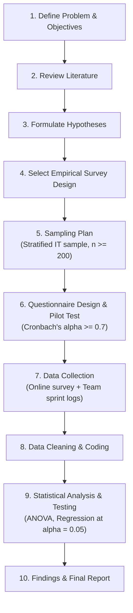

# Set A - Question 1

## Question Details

A group of researchers aims to study the impact of remote work arrangements on employee productivity and job satisfaction in the information technology (IT) sector.

* **A.** Formulate a clear research problem and objectives for the study. (5 Marks)
* **B.** Develop an appropriate hypothesis. (5 Marks)
* **C.** Suggest a suitable research design (theoretical, experimental, or empirical) and justify your choice. (5 Marks)
* **D.** Create a flowchart of the research process you would adopt. (5 Marks)

---

## Model Answer

### A. Formulate a clear research problem and objectives for the study. (5 Marks)

#### 1. Research Problem Statement (2 Marks)
While remote work offers flexibility and autonomy, it introduces challenges like blurred work-life boundaries, digital fatigue, and communication friction. 

> **Problem Statement:**  
> "To investigate how different remote work modalities (fully remote, hybrid, and on-site) impact employee productivity (task efficiency, output quality) and multidimensional job satisfaction (work-life balance, mental well-being) among software professionals in the IT sector."

*   **Independent Variable ($X$):** Remote work arrangement (Fully remote, Hybrid, On-site).
*   **Dependent Variables ($Y$):** Employee productivity ($Y_1$) and Job satisfaction ($Y_2$).

#### 2. Research Objectives (3 Marks)
*   **Primary Objective:** To evaluate and quantify the relationship between remote work arrangements, employee productivity, and job satisfaction in the IT industry.
*   **Sub-Objective 1:** To measure and compare productivity metrics (task turnaround, deliverable quality) across remote, hybrid, and on-site IT employees.
*   **Sub-Objective 2:** To assess employee job satisfaction levels (work-life balance, autonomy, organizational engagement) across different work modes.
*   **Sub-Objective 3:** To identify key moderating factors (digital communication tools, home office infrastructure, total work experience) influencing this relationship.

---

### B. Develop an appropriate hypothesis. (5 Marks)

#### 1. Core Concept (1 Mark)
A research hypothesis is a testable proposition asserting a relationship between operationalized variables, formulated as a **Null Hypothesis ($H_0$)** and an **Alternative Hypothesis ($H_1$)**.

#### 2. Formulated Hypotheses (3 Marks)

*   **Hypothesis Set 1 (Remote Work vs. Productivity):**
    *   **$H_{01}$ (Null):** There is no significant difference in employee productivity among IT professionals working in remote, hybrid, and on-site arrangements.  
        $$\mu_{\text{Remote}} = \mu_{\text{Hybrid}} = \mu_{\text{On-site}}$$
    *   **$H_{11}$ (Alternative):** There is a significant difference in employee productivity among IT professionals across different work arrangements.

*   **Hypothesis Set 2 (Remote Work vs. Job Satisfaction):**
    *   **$H_{02}$ (Null):** Remote work arrangements have no significant positive impact on employee job satisfaction in the IT sector.
    *   **$H_{12}$ (Alternative):** Remote work arrangements have a statistically significant positive impact on employee job satisfaction in the IT sector.

#### 3. Verification Method (1 Mark)
*   Tested at **$\alpha = 0.05$** (95% confidence level) using **One-Way ANOVA** (comparing means across 3 work modes) and **Multiple Linear Regression** (predicting satisfaction from remote work frequency).

---

### C. Suggest a suitable research design (theoretical, experimental, or empirical) and justify your choice. (5 Marks)

#### 1. Selected Design (1 Mark)
*   **Empirical Research Design** (specifically, a **Quantitative Cross-Sectional Correlational / Ex-Post Facto Survey Design**).

#### 2. Justification (4 Marks)

1.  **Ecological Validity:** Gathers authentic, real-world data directly from practicing software professionals in their genuine working environments.
2.  **Captures Latent Constructs:** Job satisfaction and perceived productivity are psychological constructs best measured using validated psychometric survey instruments (e.g., 5-point Likert scales, Minnesota Satisfaction Questionnaire).
3.  **Experimental Infeasibility:** A true experimental design (randomly forcing employees into 100% remote or 100% office groups) is unethical, disrupts enterprise operations, and cannot control external household variables.
4.  **Quantitative Hypothesis Testing:** Enables collection of numerical data from a large sample ($n \ge 200$) across multiple IT firms, satisfying assumptions for ANOVA and regression modeling.

---

### D. Create a flowchart of the research process you would adopt. (5 Marks)

#### 1. Research Process Flowchart (3 Marks)

#### 2. Key Phase Summary (2 Marks)
*   **Planning Phase (Steps 1-4):** Clarify scope, review literature, define testable hypotheses ($H_0/H_1$), and select an empirical survey framework.
*   **Execution Phase (Steps 5-7):** Stratify sample across IT roles, validate questionnaire reliability, and collect primary responses.
*   **Analytical Phase (Steps 8-10):** Clean dataset, execute inferential statistical tests, verify hypotheses, and deliver policy recommendations.
