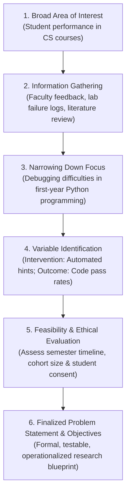

# Set B - Question 1

## Question Details

The department wants to improve student performance in programming courses.

* **A.** Explain how you identify and formulate a research problem. (5 Marks)
* **B.** Enumerate the criteria used to evaluate whether the problem is suitable for research. (5 Marks)
* **C.** Draw a flowchart showing the research problem formulation process. (5 Marks)
* **D.** Identify three possible research problems and compare them based on feasibility, novelty, and significance. Select the best research problem and justify your choice. (5 Marks)

---

## Model Answer

### A. Explain how you identify and formulate a research problem. (5 Marks)

#### 1. Identification of the Problem (2 Marks)
In educational research, identifying a viable research problem involves systematic discovery from practical and scholarly sources:
1.  **Practical Observations:** Identifying recurring failure rates in introductory programming (CS1), high dropout trends, syntax struggles, and lab submission delays.
2.  **Stakeholder Consultations:** Gathering feedback from course instructors, lab teaching assistants, and underperforming students regarding cognitive bottlenecks.
3.  **Literature Survey:** Reviewing ACM/IEEE computing education journals to identify existing pedagogical gaps in introductory programming.

#### 2. Formulation into a Research Problem (3 Marks)
Transforming a vague practical issue into an operationalized research inquiry follows four structured steps:
1.  **Delimit the Scope:** Narrow down the broad area (*"student programming performance"*) to a specific target (*"first-year students learning OOP in Python"*).
2.  **Identify Key Variables:**
    *   *Independent Variable ($X$):* Pedagogical intervention (e.g., interactive automated code feedback vs. standard syntax lectures).
    *   *Dependent Variable ($Y$):* Student performance (debugging efficiency, assignment pass rate, lab test scores).
3.  **Define Core Research Questions:** Does immediate compiler error explanation reduce student cognitive load and increase lab completion velocity?
4.  **Draft a Precise Problem Statement:** A clear, declarative statement articulating the gap, population, and expected analytical outcomes.

---

### B. Enumerate the criteria used to evaluate whether the problem is suitable for research. (5 Marks)

Evaluating whether an identified problem is academically and operationally viable requires assessing five fundamental criteria:

1.  **Feasibility & Manageability (1 Mark):**  
    The problem must be achievable within the semester timeline, with access to student cohorts, teaching labs, and institutional ethical permissions (IRB / student consent).
2.  **Novelty & Originality (1 Mark):**  
    It must not duplicate known findings; it should offer fresh insights (e.g., evaluating modern LLM-driven feedback vs. traditional compiler syntax warnings).
3.  **Significance & Practical Utility (1 Mark):**  
    The outcomes must provide tangible institutional value, directly improving course pass rates, reducing coding anxiety, and enhancing department placement readiness.
4.  **Measurability & Data Availability (1 Mark):**  
    Key constructs must be objectively quantifiable using available telemetry (e.g., compiler error logs, Git commit frequencies, midterm lab test scores).
5.  **Researcher Competence & Technical Resources (1 Mark):**  
    The research team must possess the necessary domain expertise in software engineering education and statistical analysis software (e.g., SPSS, Python `scipy.stats`).

---

### C. Draw a flowchart showing the research problem formulation process. (5 Marks)

#### 1. Problem Formulation Flowchart (3 Marks)

#### 2. Process Summary (2 Marks)
*   **Divergent Phase (Steps 1-2):** Explores broad educational challenges, course failure statistics, and relevant pedagogical theories.
*   **Convergent Phase (Steps 3-4):** Sharpens the focus onto specific operational variables, controls, and measurable parameters.
*   **Validation Phase (Steps 5-6):** Evaluates ethical feasibility and resources before freezing the formal research problem statement.

---

### D. Identify three possible research problems and compare them based on feasibility, novelty, and significance. Select the best research problem and justify your choice. (5 Marks)

#### 1. Three Candidate Research Problems (1.5 Marks)
*   **Problem 1 ($P_1$):** Impact of real-time AI-assisted syntax error explanations on first-year students' code debugging speed.
*   **Problem 2 ($P_2$):** Evaluating gamified coding challenges versus traditional weekly homework assignments on end-semester programming exam scores.
*   **Problem 3 ($P_3$):** Real-time EEG neuro-imaging to track cognitive brainwave overload during pointer and memory-management comprehension in C.

#### 2. Comparative Evaluation Matrix (2 Marks)

| Problem | Feasibility (Out of 5) | Novelty (Out of 5) | Significance (Out of 5) | Overall Score |
| :--- | :---: | :---: | :---: | :---: |
| **$P_1$ (AI Error Feedback)** | **5/5** (Software-based, easy lab integration) | **4/5** (Timely, evaluates modern AI tools) | **5/5** (Directly reduces student lab dropouts) | **14/15** |
| **$P_2$ (Gamification vs. Homework)** | **4/5** (Requires grading game platform) | **3/5** (Extensively studied in literature) | **4/5** (Improves engagement) | **11/15** |
| **$P_3$ (EEG Brainwave Tracking)** | **1/5** (Expensive medical hardware, intrusive) | **5/5** (High neurological novelty) | **2/5** (Impractical for daily classroom adoption) | **8/15** |

#### 3. Selection & Justification (1.5 Marks)
*   **Selected Problem:** **Problem 1 ($P_1$) - Real-time AI-assisted syntax error explanations.**
*   **Justification:**  
    1.  *Highest Feasibility:* Can be easily integrated into existing browser-based coding environments (e.g., VS Code extensions or Jupyter) without requiring extra hardware.
    2.  *High Practical Significance:* Directly targets the primary cause of beginner failure-cryptic compiler error messages-offering immediate, scalable pedagogical benefits to the department.
