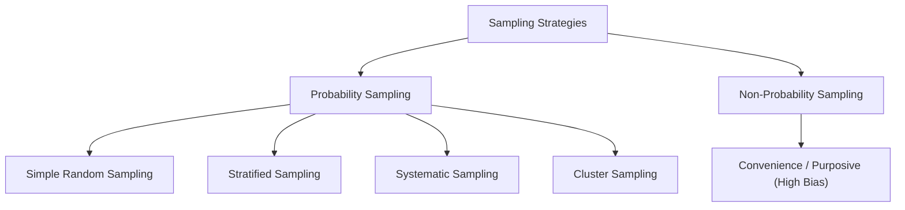

import Tabs from '@theme/Tabs';
import TabItem from '@theme/TabItem';
import Heading from '@theme/Heading';
import React from 'react';

# Data and Sampling

> **Topic -** Statistics provides the formal mathematical framework to collect, organize, analyze, interpret, and present empirical data. Understanding the structural properties of data and the methodologies used to sample populations is a prerequisite for valid inferential or predictive modeling.

---

## 1. The Role of Statistics

Statistics bridges empirical observation and mathematical truth. It is divided into two primary disciplines:

*   **Descriptive Statistics:** Techniques used to summarize, organize, and simplify sample datasets without extrapolating beyond the observed instances.
*   **Inferential Statistics:** Methodologies that leverage probability theory to deduce population properties from sample data, quantify confidence intervals, and test scientific hypotheses.

---

## 2. Variables and Data Types

In statistical modeling, an observation is a realization of one or more variables. The taxonomy of variables dictates the mathematical operations permitted during downstream modeling.

### Qualitative (Categorical) Variables
Represent qualities or discrete groups rather than physical counts or measurements.

*   **Nominal:** Categories with no intrinsic order, hierarchy, or ranking. Mathematical operations are restricted to equality checks ($=$ or $\neq$). Examples: Medical diagnosis categories, Blood type ($A, B, AB, O$).
*   **Ordinal:** Categories possessing an inherent, logical ranking, but where intervals between adjacent ranks are undefined or irregular. Valid operations include inequalities ($<, >$). Examples: Education level (High School, Bachelor, Master, PhD), Likert survey scale (1 to 5).

### Quantitative (Numerical) Variables
Represent measurable mathematical quantities where distance and arithmetic operations are defined.

*   **Discrete:** Values resulting from counting processes, forming a countable set of distinct real numbers (often integers). Examples: Number of network packets dropped, Defect count per manufacturing batch.
*   **Continuous:** Values resulting from measurement across an unbroken continuum, possessing infinite mathematical granularity. Examples: System latency in milliseconds, Server CPU temperature.

---

## 3. Levels of Measurement (Stevens' Scales)

Data classification determines which statistical metrics are mathematically sound:

<Tabs>
  <TabItem value="nominal" label="1. Nominal" default>
     
    
    *   **Properties:** Classification only.
    *   **Permissible Math:** Frequency distribution, Mode, Contingency tables ($\chi^2$).
    *   **Invalid Math:** Mean, Median, Standard Deviation.
  </TabItem>
  <TabItem value="ordinal" label="2. Ordinal">
     
    
    *   **Properties:** Classification and order.
    *   **Permissible Math:** Median, Percentiles, Interquartile Range, Spearman's rank correlation.
    *   **Invalid Math:** Arithmetic Mean (the distance between ranks is inconsistent).
  </TabItem>
  <TabItem value="interval" label="3. Interval">
     
    
    *   **Properties:** Ordered with uniform, standardized intervals, but lacks an absolute, non-arbitrary zero point.
    *   **Permissible Math:** Addition, Subtraction, Mean, Variance, Pearson correlation.
    *   **Limitation:** Multiplication and division of raw values are invalid (e.g., $20^\circ\text{C}$ is not "twice as hot" as $10^\circ\text{C}$).
  </TabItem>
  <TabItem value="ratio" label="4. Ratio">
     
    
    *   **Properties:** Full arithmetic properties with a true, meaningful absolute zero (representing total absence of the quantity).
    *   **Permissible Math:** All arithmetic operations ($+, -, \times, \div$), Geometric Mean, Coefficient of Variation.
    *   **Examples:** Kelvin temperature, Memory utilization, Execution time.
  </TabItem>
</Tabs>

---

## 4. Sampling Methodologies

Inferential statistics relies on the assumption that a sample reliably mirrors the distribution of the broader population. Systematic sampling bias inevitably renders inferential conclusions mathematically invalid.

### Probability Sampling Designs
1.  **Simple Random Sampling (SRS):** Every member in the population of size $N$ has an identical selection probability $P = 1/N$. Generates unbiased parameter estimates but can suffer high variance if minority subgroups are missed.
2.  **Stratified Sampling:** The population is divided into mutually exclusive strata based on shared attributes (e.g., age, geographic zone). Random samples are drawn within each stratum proportionally, guaranteeing representation for low-frequency classes.
3.  **Systematic Sampling:** Selects elements at uniform intervals $k = N/n$ from an ordered sampling frame, starting at a random offset $r \in [1, k]$.
4.  **Cluster Sampling:** The population is segmented into naturally occurring heterogeneous clusters. A random subset of entire clusters is selected, and all elements within those clusters are evaluated. Minimizes collection costs at the expense of higher sampling error.

---

## 5. Synthesis & Review

  

    

      

        <h3>Mathematical Consistency</h3>
      

      

        <ul>
          <li><b>Measurement Dictates Metrics:</b> Computing an arithmetic mean on ordinal survey data produces mathematically meaningless quantities.</li>
          <li><b>Unbiased Estimators:</b> Sound inferential modeling demands random selection to avoid confounding variables.</li>
        </ul>
      

    

  

  

    

      

        <h3>Engineering Realities</h3>
      

      

        <ul>
          <li><b>Sampling Bias:</b> Convenience sampling introduces catastrophic survivorship and selection bias into machine learning training datasets.</li>
          <li><b>Stratification Standard:</b> Always use stratified sampling for imbalanced classification splits (<code>StratifiedKFold</code>).</li>
        </ul>
      

    

  

 

:::info

**Key Takeaways**

*   **Scale hierarchy matters:** Nominal $\subset$ Ordinal $\subset$ Interval $\subset$ Ratio. Higher scales inherit all mathematical properties of lower scales.
*   **Stratified vs. Cluster:** Stratified sampling draws samples from *every* subgroup to ensure representation; Cluster sampling draws *entire* subgroups to minimize sampling cost.
*   **Inferential validity:** No complex statistical model can compensate for unrepresentative or biased sampling.

:::

**Next Section:** [Descriptive Statistics](./02-descriptive-statistics.mdx) - quantifying central tendency, spatial dispersion, and distribution morphology.
