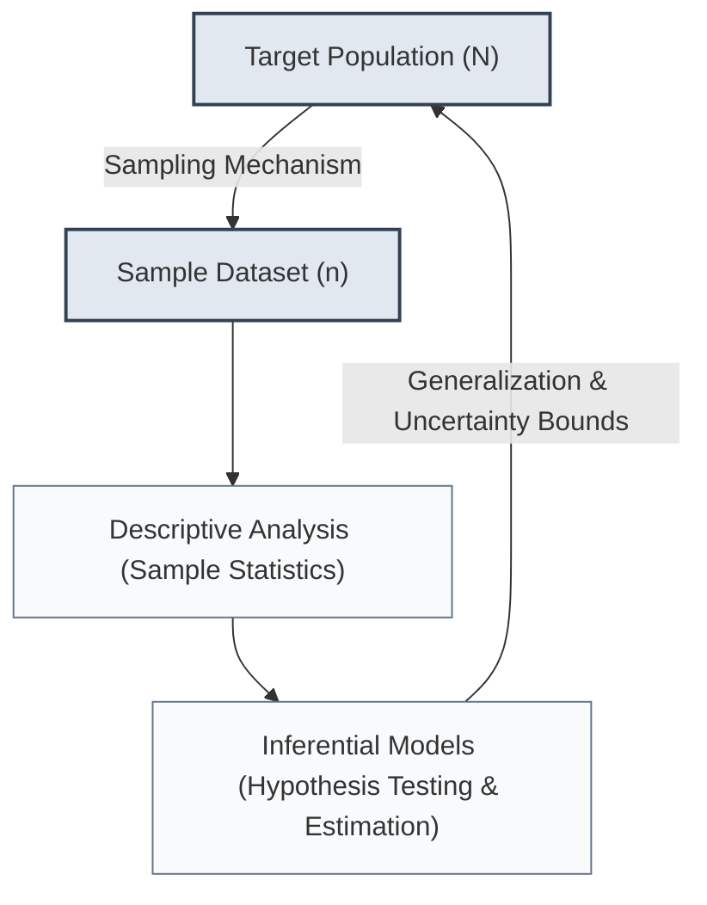
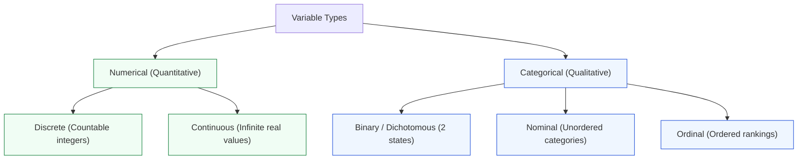
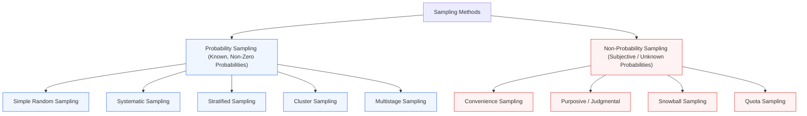

import Tabs from '@theme/Tabs';
import TabItem from '@theme/TabItem';
import Heading from '@theme/Heading';
import React from 'react';

# Data & Sampling Methods

> **Topic -** Statistics transforms raw, unstructured observations into actionable inferences about populations. Before computing parameters, one must categorize variable types, understand data structures across time and space, and select an unbiased sampling technique that guarantees statistical validity.

---

## 1. Intuition & Architectural Flow

Statistical inference bridges the gap between what we can feasibly observe (a **sample**) and the complete universe of entities we wish to understand (a **population**). 

The field is bifurcated into two primary branches:
1. **Descriptive Statistics:** Summarizing, organizing, and visualizing the concrete features of an observed collection of data points without extending conclusions beyond the sample.
2. **Inferential Statistics:** Using mathematical probability theory, hypothesis testing, and estimation models to generalize conclusions from a sample to an unobserved population.



### Characteristics and Functions of Statistics

Statistics operates under distinct empirical characteristics:
*   **Aggregation of Facts:** Isolated, single figures (e.g., "John earns 50,000 USD") are not statistics; only aggregates of figures across subjects reveal distributions.
*   **Multifactorial Causation:** Real-world data points are shaped by numerous interacting variables rather than a single isolated cause.
*   **Systematic Collection:** Data must be gathered systematically for a pre-planned purpose; haphazard observation invalidates statistical inference.
*   **Comparability:** Data points must be homogeneous enough with respect to their measurement scales to permit valid relative comparisons.

---

## 2. Taxonomy of Data and Variables

Statistical models process numbers, but the numerical representation depends strictly on the underlying **variable scale**.



### Variable Scales Decomposition

<Tabs>
  <TabItem value="numerical" label="1. Numerical Variables" default>
    <br/>
    
    *   **Discrete Variables:** Variables whose values are distinct, separate integers resulting from counting processes.
        *   *Examples:* Number of defective parts per batch, daily website visits, number of hospital beds occupied.
        *   *Condition:* Countably finite or countably infinite ($x \in \mathbb{N} \cup \{0\}$).
    *   **Continuous Variables:** Variables that can take an uncountably infinite number of real values within an interval.
        *   *Examples:* Temperature in Celsius, transaction processing latency, stock prices, aircraft flight velocity.
        *   *Condition:* Uncountably infinite ($x \in \mathbb{R}$).
  </TabItem>
  <TabItem value="categorical" label="2. Categorical Variables">
    <br/>
    
    *   **Nominal Variables:** Qualitative categories without any intrinsic natural order, rank, or distance metric.
        *   *Examples:* Server operating system (Linux, macOS, Windows), blood group (A, B, AB, O), product categories.
        *   *Permitted Operations:* Equality checks ($=$ or $\neq$), mode, frequency distributions.
    *   **Ordinal Variables:** Qualitative categories with a distinct relative ranking or hierarchical sequence, but without equal intervals between levels.
        *   *Examples:* Customer satisfaction ratings (Poor, Fair, Good, Excellent), education levels (Bachelors, Masters, PhD).
        *   *Permitted Operations:* Order relations ($<, >$), median, rank correlation (Spearman's $\rho$).
    *   **Binary / Dichotomous Variables:** Qualitative categories restricted strictly to two mutual levels.
        *   *Examples:* Transaction fraud status (Fraudulent vs Genuine), patient diagnosis (Positive vs Negative).
  </TabItem>
  <TabItem value="temporal" label="3. Temporal Structure of Datasets">
    <br/>
    
    *   **Cross-Sectional Data:** Observations on multiple distinct entities or subjects gathered at a single fixed point in time.
    *   **Time Series Data:** Repeated observations of a single subject or variable collected across consecutive, regular time intervals.
    *   **Pooled Data:** Combination of cross-sectional and time series data where different entities are surveyed across multiple distinct time periods.
    *   **Panel / Longitudinal Data:** The exact same cross-sectional entities (e.g., the same set of firms or patients) are tracked and measured across consecutive time periods.
  </TabItem>
</Tabs>

:::warning

**The Categorical Encoding Fallacy**

Assigning arbitrary integer IDs to categorical levels (e.g., mapping `Male = 0, Female = 1` or `Linux = 1, Windows = 2, macOS = 3`) does not convert qualitative categories into numerical variables. 

Computing arithmetic means or standard deviations on integer encodings of nominal categories yields mathematically meaningless results (e.g., an "average OS" of $2.3$ has no physical interpretation).

:::

---

## 3. Sampling Methodologies

Conducting a census across an entire population ($N$) is frequently cost-prohibitive, computationally impractical, or physically destructive (e.g., testing the lifespan of every light bulb produced). Therefore, sampling selects a representative subset ($n \ll N$).

### Probability vs Non-Probability Sampling



#### Probability Sampling Designs
Every individual in the population has a known, non-zero probability of selection, enabling rigorous mathematical estimation of sampling error:
1. **Simple Random Sampling (SRS):** Every member of the population has an identical probability of inclusion ($P = 1/N$), and all combinations of $n$ elements are equally likely. Requires an exhaustive sampling frame.
2. **Systematic Sampling:** Elements are selected at a constant periodic interval $k = N/n$ after a randomly selected starting point $r \in [1, k]$.
3. **Stratified Sampling:** The population is segmented into mutually exclusive, homogeneous subgroups (**strata** based on attributes like age or department). A random sample is drawn from *each* stratum. Guarantees proportional representation of minority subpopulations.
4. **Cluster Sampling:** The population is naturally grouped into heterogeneous mini-populations (**clusters**, such as school districts or regional branches). A random sample of *entire clusters* is selected, and all entities within selected clusters are surveyed.
5. **Multistage Sampling:** Hierarchical sampling combining multiple methods sequentially (e.g., randomly picking cities $\rightarrow$ picking schools within cities $\rightarrow$ randomly selecting students within schools).

#### Non-Probability Sampling Designs
Selection relies on convenience, availability, or researcher judgment. These methods cannot produce unbiased population parameter estimates or calculate confidence intervals:
*   **Convenience Sampling:** Surveying units that are easiest to reach (e.g., interviewing visitors entering a shopping mall).
*   **Purposive / Judgmental Sampling:** Selecting specific units based on expert judgment of what constitutes a "typical" case.
*   **Snowball Sampling:** Initial participants recruit subsequent contacts from their social or professional networks (essential for hard-to-reach populations, such as rare disease patients).
*   **Quota Sampling:** Specifying fixed proportions of demographic traits (e.g., 50% women, 50% men), but selecting the individuals within those categories via convenience rather than randomization.

---

## 4. Sampling Error Mechanics

When calculating sample statistics ($\bar{x}, s$) to estimate population parameters ($\mu, \sigma$), errors naturally emerge:

$$\text{Total Error} = \text{Sampling (Random) Error} + \text{Non-Sampling (Systematic) Error}$$

<Tabs>
  <TabItem value="random" label="1. Random Sampling Error" default>
    <br/>
    
    *   **Nature:** Unsystematic, chance variations between the sample statistic and the true population parameter.
    *   **Directionality:** Symmetric; just as likely to overestimate as underestimate the true parameter.
    *   **Mitigation:** Increasing sample size ($n$) strictly decreases the standard error of the estimate inversely proportional to the square root of $n$:
    
    $$\text{SE}(\bar{x}) = \frac{\sigma}{\sqrt{n}}$$
  </TabItem>
  <TabItem value="systematic" label="2. Non-Sampling (Systematic) Error">
    <br/>
    
    *   **Nature:** Flaws in study design, sampling frame omission, instrumentation bias, or respondent behavior that skew results unidirectionally.
    *   **Key Varieties:**
        *   **Selection / Frame Bias:** The sampling frame systematically omits portions of the population (e.g., conducting internet surveys omits non-digitized households).
        *   **Non-Response / Completion Rate Bias:** Individuals who refuse or fail to participate hold fundamentally different characteristics than respondents.
        *   **Measurement / Interviewer Bias:** Leading questions or interviewer behavior alters responses.
    *   **Mitigation:** Increasing sample size does **not** reduce systematic error; it simply produces a more precise estimate of a biased figure.
  </TabItem>
</Tabs>

---

## 5. Step-by-Step Numerical Walkthrough

Academic examinations frequently test the execution of **Systematic Sampling** intervals and **Stratified Allocation**.

### Problem: Stratified Proportional Allocation
A university has $N = 2,000$ students distributed across three schools:
*   School of Engineering ($N_1 = 1,000$)
*   School of Business ($N_2 = 600$)
*   School of Humanities ($N_3 = 400$)

Design a representative stratified sample of total size $n = 200$ using proportional allocation. Calculate the sampling interval $k$ if systematic sampling were applied to the entire population.

#### Step 1: Compute Proportional Sampling Fraction
The uniform sampling fraction $f$ across all strata is:

$$f = \frac{n}{N} = \frac{200}{2000} = 0.10 \quad (10\%)$$

#### Step 2: Calculate Strata Sample Sizes ($n_h$)

$$n_h = N_h \times \frac{n}{N}$$

1.  **Engineering:** $n_1 = 1000 \times 0.10 = 100$ students.
2.  **Business:** $n_2 = 600 \times 0.10 = 60$ students.
3.  **Humanities:** $n_3 = 400 \times 0.10 = 40$ students.

$$\sum_{h=1}^3 n_h = 100 + 60 + 40 = 200 = n$$

#### Step 3: Compute Systematic Sampling Interval ($k$)
If the entire list of $2,000$ students is ordered alphabetically:

$$k = \left\lfloor \frac{N}{n} \right\rfloor = \frac{2000}{200} = 10$$

Select a random integer $r$ uniformly distributed between $1$ and $10$. If $r = 7$, sample student IDs: $7, 17, 27, 37, \dots, 1997$.

---

## 6. Implementation Lab

:::tip

**Implementation Lab: Sampling Distributions & Bias in Python**

Experiment with probability vs convenience sampling on simulated synthetic populations.

<a href="https://colab.research.google.com/github/vettrivel-kl/vettrivel-kl.github.io/blob/master/static/labs/inferential-statistics/01-introduction/descriptive_statistics.ipynb" target="_blank" rel="noopener noreferrer">
  
</a>

**Key Experiments to Run:**
*   **Experiment 1 (Sample Size vs Standard Error):** Scale $n$ from $10$ to $10,000$ and observe the convergence of $\bar{x} \to \mu$.
*   **Experiment 2 (Selection Bias Demonstration):** Sample exclusively from an unrepresentative tail of a distribution to verify that larger $n$ does not correct systematic bias.

:::

### Comparative Implementation

<Tabs>
  <TabItem value="pandas" label="1. Pandas / Scikit-Learn Vectorized" default>
    <br/>

```python
import numpy as np
import pandas as pd
from sklearn.model_selection import train_test_split

# Generate a synthetic population of 10,000 records
np.random.seed(42)
departments = np.random.choice(['Engineering', 'Business', 'Humanities'], size=10000, p=[0.5, 0.3, 0.2])
salaries = np.random.normal(loc=75000, scale=15000, size=10000)

pop_df = pd.DataFrame({'Department': departments, 'Salary': salaries})

# 1. Simple Random Sampling (n = 200)
srs_sample = pop_df.sample(n=200, random_state=42)

# 2. Stratified Sampling preserving exact department ratios (n = 200)
strat_sample, _ = train_test_split(pop_df, train_size=200, stratify=pop_df['Department'], random_state=42)

print("Population Department Distribution:")
print(pop_df['Department'].value_counts(normalize=True))
print("\nStratified Sample Distribution:")
print(strat_sample['Department'].value_counts(normalize=True))
```
  </TabItem>
  <TabItem value="scratch" label="2. Pure Python / NumPy from Scratch">
    <br/>

```python
import numpy as np

# Systematic sampling function from scratch
def systematic_sample(data: np.ndarray, sample_size: int) -> np.ndarray:
    N = len(data)
    k = N // sample_size
    # Step 1: Draw random starting index between 0 and k-1
    start_index = np.random.randint(0, k)
    # Step 2: Step through the population at fixed intervals of k
    selected_indices = np.arange(start_index, N, k)[:sample_size]
    return data[selected_indices]

population = np.linspace(100, 5000, num=1000)
sample = systematic_sample(population, sample_size=50)

print(f"Population Size: {len(population)}, Sample Size: {len(sample)}")
print(f"First 5 Sampled Elements: {sample[:5]}")
```
  </TabItem>
</Tabs>

---

## 7. Interactive Exploration: Sampling Architecture

The widget below demonstrates how changing the sampling technique impacts parameter estimation on a population with distinct subgroups:

export const SamplingComparator = () => {
  const [method, setMethod] = React.useState('srs');
  
  const results = {
    srs: {
      name: 'Simple Random Sampling (SRS)',
      coverage: 'Equal chance for all individuals. Minorities may be underrepresented in small samples by random chance.',
      risk: 'High sample variance if the population has distinct heterogeneous sub-clusters.',
      variance: 'Standard Error = \u03c3 / \u221an'
    },
    strat: {
      name: 'Stratified Random Sampling',
      coverage: 'Guarantees proportional or optimal representation of every designated subgroup/stratum.',
      risk: 'Requires exhaustive prior knowledge of stratification variables for the entire population.',
      variance: 'Lower variance than SRS when within-strata variance is smaller than between-strata variance.'
    },
    cluster: {
      name: 'Cluster Sampling',
      coverage: 'Samples whole natural clusters (e.g., geographic regions). Feasible when individual frames do not exist.',
      risk: 'Higher sampling error if individuals within clusters are highly homogeneous (low cluster diversity).',
      variance: 'Higher variance than SRS for the same sample size due to intra-cluster correlation.'
    }
  };

  const curr = results[method];

  return (
    <div style={{ padding: '20px', border: '1px solid var(--ifm-color-emphasis-200)', borderRadius: '8px', backgroundColor: 'rgba(148, 163, 184, 0.05)', margin: '20px 0' }}>
      <h4 style={{ margin: '0 0 12px 0' }}>Sampling Design Evaluator</h4>
      <p style={{ margin: '0 0 14px 0', fontSize: '14px' }}>Select a sampling methodology to evaluate its structural trade-offs:</p>
      
      <div style={{ display: 'flex', gap: '10px', flexWrap: 'wrap', marginBottom: '16px' }}>
        <button
          onClick={() => setMethod('srs')}
          style={{ padding: '6px 14px', borderRadius: '4px', border: '1px solid #3182ce', backgroundColor: method === 'srs' ? '#3182ce' : 'transparent', color: method === 'srs' ? '#fff' : 'var(--ifm-font-color-base)', cursor: 'pointer', fontSize: '13px' }}
        >
          Simple Random
        </button>
        <button
          onClick={() => setMethod('strat')}
          style={{ padding: '6px 14px', borderRadius: '4px', border: '1px solid #3182ce', backgroundColor: method === 'strat' ? '#3182ce' : 'transparent', color: method === 'strat' ? '#fff' : 'var(--ifm-font-color-base)', cursor: 'pointer', fontSize: '13px' }}
        >
          Stratified
        </button>
        <button
          onClick={() => setMethod('cluster')}
          style={{ padding: '6px 14px', borderRadius: '4px', border: '1px solid #3182ce', backgroundColor: method === 'cluster' ? '#3182ce' : 'transparent', color: method === 'cluster' ? '#fff' : 'var(--ifm-font-color-base)', cursor: 'pointer', fontSize: '13px' }}
        >
          Cluster
        </button>
      </div>

      <div style={{ padding: '14px', borderRadius: '6px', backgroundColor: 'var(--ifm-background-surface-color)', border: '1px solid var(--ifm-color-emphasis-300)' }}>
        <div style={{ fontSize: '15px', fontWeight: 'bold', color: '#3182ce', marginBottom: '8px' }}>{curr.name}</div>
        <div style={{ fontSize: '13px', marginBottom: '6px' }}><strong>Population Coverage:</strong> {curr.coverage}</div>
        <div style={{ fontSize: '13px', marginBottom: '6px' }}><strong>Primary Design Risk:</strong> {curr.risk}</div>
        <div style={{ fontSize: '13px', color: '#718096' }}><strong>Variance Property:</strong> {curr.variance}</div>
      </div>
    </div>
  );
};

<SamplingComparator />

---

## 8. Exam Traps & Operational Nuances

<Tabs>
  <TabItem value="trap1" label="1. Stratified vs Cluster Sampling" default>
    <br/>
    
    *   **The Trap:** Confusing the structural composition of strata vs clusters in university exams.
    *   **The Golden Rule:**
        *   **Stratified Sampling:** Subgroups must be **homogeneous within** (members share identical traits) and **heterogeneous between** (strata differ markedly from each other). We sample *from all* strata.
        *   **Cluster Sampling:** Subgroups must be **heterogeneous within** (each cluster is a mini-replica of the population) and **homogeneous between** (clusters resemble each other). We sample *all units from some* clusters.
  </TabItem>
  <TabItem value="trap2" label="2. Increasing Sample Size Myth">
    <br/>
    
    *   **The Trap:** Believing that increasing sample size ($n$) fixes non-response bias, faulty survey questions, or unrepresentative selection frames.
    *   **The Mathematical Reality:** $\lim_{n \to \infty} \text{SE}(\bar{x}) = 0$. Large samples drive random sampling error to zero, but they concentrate and solidify systematic errors (bias) with misleadingly narrow confidence intervals.
  </TabItem>
</Tabs>

---

## 9. Summary & Cheatsheet

<div className="row">
  <div className="col col--6">
    <div className="card" style={{ height: '100%', marginBottom: '15px' }}>
      <div className="card__header">
        <h3>Core Data Taxonomies</h3>
      </div>
      <div className="card__body">
        <ul>
          <li><b>Numerical:</b> Discrete (integers, counts) vs Continuous (real line, measurements).</li>
          <li><b>Categorical:</b> Binary (2 states), Nominal (labels without rank), Ordinal (ordered ranks).</li>
          <li><b>Data Formats:</b> Cross-sectional (one time, many entities), Time series (one entity, repeated times), Panel (many entities across repeated times).</li>
        </ul>
      </div>
    </div>
  </div>
  <div className="col col--6">
    <div className="card" style={{ height: '100%', marginBottom: '15px' }}>
      <div className="card__header">
        <h3>Sampling Rules</h3>
      </div>
      <div className="card__body">
        <ul>
          <li><b>Probability:</b> SRS, Systematic ($k = N/n$), Stratified (homogeneity within), Cluster (heterogeneity within).</li>
          <li><b>Non-Probability:</b> Convenience, Purposive, Snowball, Quota. Cannot quantify confidence margins.</li>
          <li><b>Error Law:</b> Random error decreases with $\sqrt{n}$; systematic bias is invariant to sample size.</li>
        </ul>
      </div>
    </div>
  </div>
</div>

<br/>

:::info

**Key Takeaways**

*   **Takeaway 1:** Choosing the correct statistical tool depends strictly on knowing whether variables are nominal, ordinal, discrete, or continuous.
*   **Takeaway 2:** Probability sampling is the foundational prerequisite for all inferential tests, confidence intervals, and hypothesis tests.
*   **Takeaway 3:** Stratified sampling minimizes variance across diverse subgroups; systematic sampling simplifies physical or sequential data collection using periodic interval $k$.

:::

**Next Section:** [Descriptive Statistics & Dispersion](./02-descriptive-statistics.mdx) - Explore central tendency, variance, skewness, and kurtosis.

---

## 10. Active Recall & Practice

*Test your understanding by answering first, then clicking to reveal the underlying principles.*

### Checkpoint Quiz

export const PracticeQuiz = () => {
  const [selected, setSelected] = React.useState(null);
  return (
    <div style={{ padding: '20px', border: '1px solid var(--ifm-color-emphasis-200)', borderRadius: '8px', backgroundColor: 'rgba(148, 163, 184, 0.05)', margin: '20px 0' }}>
      <h4 style={{ margin: '0 0 10px 0' }}>Interactive Checkpoint: Self-Test</h4>
      <p style={{ margin: '0 0 15px 0' }}>A researcher wants to survey rural healthcare conditions. They randomly choose 10 districts out of 50 in a state, and interview every household in those 10 districts. Which sampling method is this?</p>
      <div style={{ display: 'flex', gap: '10px', flexWrap: 'wrap' }}>
        <button onClick={() => setSelected('opt1')} style={{ padding: '8px 16px', borderRadius: '4px', border: '1px solid #3182ce', backgroundColor: selected === 'opt1' ? '#e53e3e' : 'transparent', color: selected === 'opt1' ? '#fff' : 'var(--ifm-font-color-base)', cursor: 'pointer', transition: '0.2s' }}>Stratified Sampling</button>
        <button onClick={() => setSelected('opt2')} style={{ padding: '8px 16px', borderRadius: '4px', border: '1px solid #3182ce', backgroundColor: selected === 'opt2' ? '#38a169' : 'transparent', color: selected === 'opt2' ? '#fff' : 'var(--ifm-font-color-base)', cursor: 'pointer', transition: '0.2s' }}>Cluster Sampling (Correct)</button>
        <button onClick={() => setSelected('opt3')} style={{ padding: '8px 16px', borderRadius: '4px', border: '1px solid #3182ce', backgroundColor: selected === 'opt3' ? '#e53e3e' : 'transparent', color: selected === 'opt3' ? '#fff' : 'var(--ifm-font-color-base)', cursor: 'pointer', transition: '0.2s' }}>Quota Sampling</button>
      </div>
      {selected === 'opt1' && <p style={{ color: '#e53e3e', marginTop: '15px', fontWeight: 'bold', fontSize: '14px', marginBottom: '0' }}>Incorrect. Stratified sampling would take a sample from ALL 50 districts.</p>}
      {selected === 'opt2' && <p style={{ color: '#38a169', marginTop: '15px', fontWeight: 'bold', fontSize: '14px', marginBottom: '0' }}>Correct! The districts act as naturally occurring clusters; randomly selecting entire clusters and surveying everyone within them is Cluster Sampling.</p>}
      {selected === 'opt3' && <p style={{ color: '#e53e3e', marginTop: '15px', fontWeight: 'bold', fontSize: '14px', marginBottom: '0' }}>Incorrect. Quota sampling is a non-probability method based on convenience within preset categories.</p>}
    </div>
  );
};

<PracticeQuiz />

### Review Flashcards

<details>
  <summary><b>1. [TAXONOMY] Why is customer satisfaction rated on a 1 to 5 scale ordinal rather than interval?</b></summary>
  <div className="answer-content">
    <br/>
    
    *   While the numbers 1, 2, 3, 4, 5 are ordered, the subjective perceptual distance between "Poor (1)" and "Fair (2)" is not guaranteed to be mathematically identical to the distance between "Good (4)" and "Excellent (5)". 
    *   Therefore, order exists, but equal intervals do not.
  </div>
</details>

<details>
  <summary><b>2. [EXAM QUESTION] What happens to the standard error of the mean if the sample size is increased from 100 to 400?</b></summary>
  <div className="answer-content">
    <br/>
    
    *   Since $\text{SE} = \frac{\sigma}{\sqrt{n}}$, increasing $n$ by a factor of 4 reduces the standard error by $\sqrt{4} = 2$.
    *   The standard error is halved (cut by $50\%$).
  </div>
</details>

<details>
  <summary><b>3. [ENGINEERING] When is Snowball Sampling methodologically justifiable in real-world data collection?</b></summary>
  <div className="answer-content">
    <br/>
    
    *   When the target population is concealed, marginalized, or has no formal sampling directory/frame (e.g., investigating individuals with rare medical conditions, specialized domain hackers, or underground communities).
  </div>
</details>
