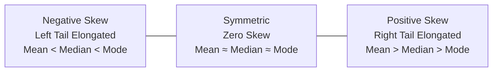

import Tabs from '@theme/Tabs';
import TabItem from '@theme/TabItem';
import Heading from '@theme/Heading';
import React from 'react';

# Descriptive Statistics

> **Topic -** Descriptive statistics mathematically summarize the core properties of empirical data distributions. By formalizing central tendency, dispersion, and shape parameters, we translate large datasets into concise, actionable analytical metrics.

---

## 1. Measures of Central Tendency

Central tendency identifies the central location or expected balance point of a dataset.

### The Arithmetic Mean
The arithmetic mean sums all observations and divides by sample size. It incorporates all mathematical information but is highly sensitive to extreme outliers.

$$\bar{x} = \frac{1}{n} \sum_{i=1}^n x_i, \quad \mu = \frac{1}{N} \sum_{i=1}^N x_i$$

### The Median
The middle value when the data is sorted in monotonic order. It acts as a **robust statistic** that remains unaffected by heavy-tailed outliers.

$$\text{Median} = \begin{cases} x_{\frac{n+1}{2}} & \text{if } n \text{ is odd} \\[6pt] \frac{1}{2} \left( x_{\frac{n}{2}} + x_{\frac{n}{2} + 1} \right) & \text{if } n \text{ is even} \end{cases}$$

### The Mode
The value that appears with the highest empirical frequency. Unlike the mean and median, the mode can be evaluated on purely nominal categorical data.

---

## 2. Measures of Dispersion

Dispersion quantifies the degree of spread, scatter, or variability around the central tendency.

<Tabs>
  <TabItem value="variance" label="Variance & Bessel's Correction" default>
    <br/>
    
    The average squared mathematical deviation from the mean:
    
    $$\sigma^2 = \frac{1}{N} \sum_{i=1}^N (x_i - \mu)^2 \quad \text{(Population)}$$
    
    $$s^2 = \frac{1}{n - 1} \sum_{i=1}^n (x_i - \bar{x})^2 \quad \text{(Sample)}$$
    
    *   **Bessel's Correction ($n - 1$):** Dividing by $n$ when evaluating a sample underestimates population variance because sample deviations are computed relative to $\bar{x}$ rather than the true population mean $\mu$. The $n - 1$ factor yields an **unbiased estimator** ($E[s^2] = \sigma^2$).
  </TabItem>
  <TabItem value="std" label="Standard Deviation">
    <br/>
    
    The square root of variance, returning the dispersion metric into the identical measurement units of the raw data:
    
    $$s = \sqrt{s^2} = \sqrt{\frac{1}{n - 1} \sum_{i=1}^n (x_i - \bar{x})^2}$$
  </TabItem>
  <TabItem value="iqr" label="Interquartile Range (IQR)">
    <br/>
    
    The spread of the central 50% of ordered observations:
    
    $$\text{IQR} = Q_3 - Q_1$$
    
    *   **Outlier Boundary (Tukey's Fences):** Observations falling outside $[Q_1 - 1.5 \cdot \text{IQR}, Q_3 + 1.5 \cdot \text{IQR}]$ are mathematically classified as mild outliers.
  </TabItem>
</Tabs>

---

## 3. Distribution Morphology (Shape)

### Skewness (Third Standardized Moment)
Skewness measures the degree of directional asymmetry of a distribution around its mean:

$$\tilde{\mu}_3 = \frac{\frac{1}{n}\sum_{i=1}^n (x_i - \bar{x})^3}{\left( \frac{1}{n}\sum_{i=1}^n (x_i - \bar{x})^2 \right)^{3/2}}$$



### Kurtosis (Fourth Standardized Moment)
Kurtosis quantifies the propensity of a distribution to generate extreme outliers (the heaviness of its tails):

$$\text{Kurtosis} = \frac{\frac{1}{n}\sum_{i=1}^n (x_i - \bar{x})^4}{\left( \frac{1}{n}\sum_{i=1}^n (x_i - \bar{x})^2 \right)^2}$$

*   **Mesokurtic ($\text{Kurtosis} \approx 3$, Excess $= 0$):** Gaussian / normal distribution profile.
*   **Leptokurtic (Excess $> 0$):** Heavy tails and acute central peak; indicates frequent extreme outlier anomalies.
*   **Platykurtic (Excess $< 0$):** Light tails and flat peak; fewer extreme deviations.

---

## 4. Implementation Lab

Analyze descriptive statistics programmatically using Python, NumPy, Pandas, and SciPy in this hands-on lab.

<a href="/labs/inferential-statistics/01-introduction/descriptive_statistics.ipynb" target="_blank" rel="noopener noreferrer">
  
</a>

```python
import numpy as np
import pandas as pd
from scipy import stats

# Generate simulated right-skewed distribution
np.random.seed(42)
sample = np.random.exponential(scale=10.0, size=1000)

# Central Tendency
mean_val = np.mean(sample)
median_val = np.median(sample)

# Dispersion (enforcing Bessel's correction with ddof=1)
sample_var = np.var(sample, ddof=1)
sample_std = np.std(sample, ddof=1)
iqr_val = stats.iqr(sample)

# Distribution Morphology
skew_val = stats.skew(sample)
kurt_val = stats.kurtosis(sample)  # Fisher's definition: Normal = 0.0

print(f"Mean: {mean_val:.2f} | Median: {median_val:.2f}")
print(f"Variance: {sample_var:.2f} | Std Dev: {sample_std:.2f} | IQR: {iqr_val:.2f}")
print(f"Skewness: {skew_val:.2f} | Excess Kurtosis: {kurt_val:.2f}")
```

<br/>

:::info

**Key Takeaways**

*   **Metric Robustness:** Prefer the median and IQR when modeling heavy-tailed or skewed distributions, as the arithmetic mean and standard deviation are readily distorted by outliers.
*   **Unbiased Variance:** Bessel's correction ($n - 1$) is required for sample variance to prevent systematic underestimation of population variance.
*   **Tail Diagnostics:** High positive excess kurtosis warns of fat tails, indicating that standard Gaussian assumptions may underestimate risk.

:::

**Next Section:** [Correlation and Covariance](./03-correlation-and-covariance.mdx) - quantifying directional and linear relationships between bivariate continuous variables.
