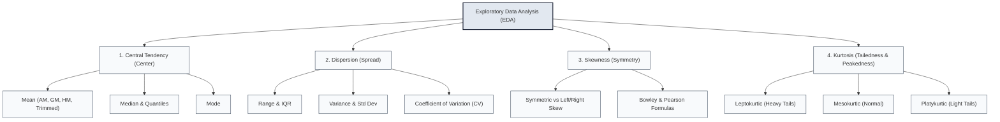
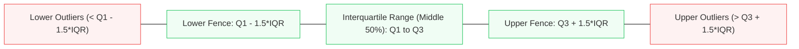
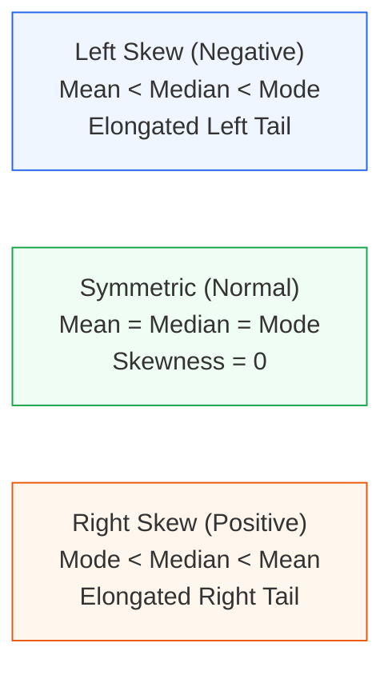

import Tabs from '@theme/Tabs';
import TabItem from '@theme/TabItem';
import Heading from '@theme/Heading';
import React from 'react';

# Descriptive Statistics & Data Distributions

> **Topic -** Descriptive statistics summarizes high-dimensional collections of observations into concise mathematical indicators of location, spread, and distribution shape. Mastering these metrics enables robust exploratory data analysis, outlier identification, and the diagnostic evaluation of normality assumptions.

---

## 1. Intuition & Architectural Flow

When analyzing an unfamiliar dataset, raw tables of thousands of values conceal structural patterns. We condense this complexity into four foundational mathematical dimensions:



---

## 2. Measures of Central Tendency

Central tendency identifies the single central value around which numerical observations concentrate.

### Core Mathematical Formulations

<Tabs>
  <TabItem value="arithmetic" label="1. Arithmetic & Trimmed Mean" default>
    <br/>
    
    *   **Arithmetic Mean ($\bar{x}$):** The sum of all observations divided by sample count $n$:
    
    $$\bar{x} = \frac{1}{n} \sum_{i=1}^n x_i$$
    
    *   *Merits:* Utilizes all observations; mathematically tractable for downstream algebraic derivations.
    *   *Demerits:* Severe sensitivity to outliers; inapplicable to nominal categorical features.
    *   **Trimmed Mean ($\alpha$-Trimmed):** Arithmetic mean computed after discarding the lowest and highest $\alpha\%$ of ordered observations:
    
    $$\bar{x}_{\alpha} = \frac{1}{n - 2k} \sum_{i=k+1}^{n-k} x_{(i)} \quad \text{where } k = \lfloor n \cdot \alpha \rfloor$$
    
    *   *Engineering Application:* Used in Olympic judging and robust data pipelines to prevent extreme values from distorting baseline trends (`scipy.stats.trim_mean`).
  </TabItem>
  <TabItem value="geometric" label="2. Geometric & Harmonic Mean">
    <br/>
    
    *   **Geometric Mean (GM):** The $n$-th root of the product of $n$ non-negative observations:
    
    $$\text{GM} = \left(\prod_{i=1}^n x_i \right)^{1/n} = \sqrt[n]{x_1 \cdot x_2 \cdots x_n}$$
    
    *   *Primary Application:* Calculating average compound growth rates (e.g., CAGR, investment multipliers, financial portfolio indexation).
    *   **Harmonic Mean (HM):** The reciprocal of the arithmetic mean of reciprocals:
    
    $$\text{HM} = \frac{n}{\sum_{i=1}^n \frac{1}{x_i}}$$
    
    *   *Primary Application:* Averaging rates and ratios across equal units of work (e.g., average vehicle speed over equal distance segments, $F_1$-score in machine learning).
    *   *Fundamental Inequality:* For any positive dataset: $\text{HM} \le \text{GM} \le \bar{x}$, with equality holding if and only if all values are identical.
  </TabItem>
  <TabItem value="median-mode" label="3. Median & Mode">
    <br/>
    
    *   **Median ($\tilde{x}$ or $Q_2$):** The positional midpoint dividing sorted data into two equal halves ($50\%$ above, $50\%$ below):
    
    $$\tilde{x} = \begin{cases} x_{\left(\frac{n+1}{2}\right)} & \text{if } n \text{ is odd} \\ \frac{x_{\left(\frac{n}{2}\right)} + x_{\left(\frac{n}{2} + 1\right)}}{2} & \text{if } n \text{ is even} \end{cases}$$
    
    *   *Merits:* Robust to extreme outliers; valid for ordinal rankings.
    *   **Mode:** The value occurring with greatest empirical frequency.
        *   Can be unimodal (1 peak), bimodal (2 distinct peaks), or multimodal ($> 2$ peaks).
        *   Applicable to nominal categorical data (e.g., modal operating system).
  </TabItem>
</Tabs>

---

## 3. Measures of Dispersion & Outlier Fences

Dispersion quantifies the spread, variability, and reliability of the central tendency measure. High dispersion signifies that the central tendency provides a weaker representation of individual observations.



### Dispersion Metrics Decomposition

<Tabs>
  <TabItem value="range-iqr" label="1. Range & Interquartile Range (IQR)" default>
    <br/>
    
    *   **Range:** $R = x_{\max} - x_{\min}$. Quickest to compute, but highly unreliable because it depends exclusively on two extreme observations.
    *   **Quartiles ($Q_1, Q_2, Q_3$):** Partition values dividing sorted data into 4 equal quarters ($25\%$, $50\%$, $75\%$).
    *   **Interquartile Range (IQR):** The spread of the middle $50\%$ of the observations:
    
    $$\text{IQR} = Q_3 - Q_1$$
    
    *   **Tukey's Outlier Fences:** Outliers are mathematically flagged if they breach the inner fences:
    
    $$\text{Lower Bound} = Q_1 - 1.5 \times \text{IQR}, \quad \text{Upper Bound} = Q_3 + 1.5 \times \text{IQR}$$
  </TabItem>
  <TabItem value="variance-sd" label="2. Variance & Standard Deviation">
    <br/>
    
    *   **Population Variance ($\sigma^2$) vs Sample Variance ($s^2$):**
    
    $$\sigma^2 = \frac{1}{N} \sum_{i=1}^N (x_i - \mu)^2, \qquad s^2 = \frac{1}{n - 1} \sum_{i=1}^n (x_i - \bar{x})^2$$
    
    *   *Bessel's Correction ($n - 1$):* Dividing sample variance by $n$ underestimates true population variance because sample deviations are measured around the sample mean $\bar{x}$ rather than the true parameter $\mu$. Dividing by $n - 1$ produces an unbiased estimator ($\mathbb{E}[s^2] = \sigma^2$).
    *   **Standard Deviation ($s$):** The square root of variance: $s = \sqrt{s^2}$. Unlike variance (which is expressed in squared units), standard deviation is expressed in the identical units of the original dataset. Range: $0 \le s < \infty$.
  </TabItem>
  <TabItem value="cv" label="3. Coefficient of Variation (CV)">
    <br/>
    
    *   **Definition:** The ratio of the standard deviation to the mean, expressed as a unitless percentage:
    
    $$\text{CV} = \left( \frac{s}{\bar{x}} \right) \times 100\%$$
    
    *   *Purpose:* Standard deviation cannot compare variability across features with differing units (e.g., comparing volatility of stock prices in dollars versus trading volume in shares) or differing means.
    *   *Interpretation:* A dataset with lower CV possesses higher relative consistency and stability.
  </TabItem>
</Tabs>

---

## 4. Distribution Shape: Skewness & Kurtosis

Beyond center and spread, distribution shapes determine whether parametric statistical procedures (such as Z-tests or Linear Regression) are valid.



### Skewness Formulations

Skewness quantifies the asymmetry and direction of a distribution's tail:

1.  **Karl Pearson's Coefficient of Skewness ($S_k$):** Based on the divergence between mean, median, and mode:
    
    $$S_k = \frac{\bar{x} - \text{Mode}}{s} \approx \frac{3(\bar{x} - \text{Median})}{s}$$
    
    Values typically fall within $[-3, +3]$. If $S_k = 0$, the distribution is symmetric.
2.  **Bowley's Coefficient of Skewness ($S_b$):** Based purely on quartile partition values:
    
    $$S_b = \frac{(Q_3 - Q_2) - (Q_2 - Q1)}{Q_3 - Q_1} = \frac{Q_3 - 2Q_2 + Q_1}{Q_3 - Q_1}$$
    
    Values are bounded strictly within $[-1, +1]$. Ideal for open-ended or heavily outlier-prone datasets.
3.  **Adjusted Fisher-Pearson Standardized 3rd Moment ($g_1$):** Standard algorithm used by Python (`scipy.stats.skew` and `pandas.DataFrame.skew`):
    
    $$g_1 = \frac{n}{(n-1)(n-2)} \sum_{i=1}^n \left( \frac{x_i - \bar{x}}{s} \right)^3$$

### Kurtosis Formulations

Kurtosis measures the "tailedness" and propensity of a distribution to generate extreme outlier observations relative to a Gaussian distribution.

$$\text{Fisher's Excess Kurtosis } (K) = \left[ \frac{1}{n} \sum_{i=1}^n \left( \frac{x_i - \bar{x}}{s} \right)^4 \right] - 3$$

| Kurtosis Type | Excess Kurtosis ($K$) | Tail & Peak Behavior | Outlier Propensity |
| :--- | :--- | :--- | :--- |
| **Mesokurtic** | $K = 0$ | Standard normal Gaussian bell curve | Baseline normal |
| **Leptokurtic** | $K > 0$ | Fat, heavy tails; sharp, tall central peak | High frequency of extreme outliers |
| **Platykurtic** | $K < 0$ | Light, thin tails; flat, broad central peak | Low frequency of extreme outliers |

---

## 5. Step-by-Step Numerical Walkthrough

Academic exams frequently provide a small raw vector and require calculating the complete descriptive parameter battery by hand.

### Problem
Given the sample dataset representing manufacturing component diameters in millimeters:

$$X = [7, 8, 8, 9, 10, 10, 10, 11, 12, 14, 30]$$

Compute:
1. Mean ($\bar{x}$), Median ($\tilde{x}$), Mode
2. Quartiles ($Q_1, Q_3$), $\text{IQR}$, and Tukey's Outlier Bounds
3. Sample Variance ($s^2$) and Standard Deviation ($s$)
4. Karl Pearson's and Bowley's Skewness coefficients

#### Step 1: Central Tendency
Sort the data ($n = 11$, odd):
$$X_{\text{sorted}} = [7, 8, 8, 9, 10, 10, 10, 11, 12, 14, 30]$$

*   **Mean:**
    
    $$\bar{x} = \frac{7 + 8 + 8 + 9 + 10 + 10 + 10 + 11 + 12 + 14 + 30}{11} = \frac{129}{11} \approx 11.727 \text{ mm}$$

*   **Median:** The $\frac{11 + 1}{2} = 6$-th element: $\tilde{x} = 10 \text{ mm}$.
*   **Mode:** $10 \text{ mm}$ occurs three times (unimodal).

#### Step 2: Quartiles and Outlier Fences
*   Lower half (elements 1 to 5): $[7, 8, 8, 9, 10] \implies Q_1 = 8.0$.
*   Upper half (elements 7 to 11): $[10, 11, 12, 14, 30] \implies Q_3 = 12.0$.
*   **Interquartile Range:**
    
    $$\text{IQR} = Q_3 - Q_1 = 12.0 - 8.0 = 4.0 \text{ mm}$$

*   **Outlier Bounds:**
    *   $\text{Lower Fence} = Q_1 - 1.5 \times \text{IQR} = 8.0 - (1.5 \times 4.0) = 8.0 - 6.0 = 2.0 \text{ mm}$
    *   $\text{Upper Fence} = Q_3 + 1.5 \times \text{IQR} = 12.0 + (1.5 \times 4.0) = 12.0 + 6.0 = 18.0 \text{ mm}$
    *   *Conclusion:* The value $30 \text{ mm} > 18.0 \text{ mm}$ is mathematically flagged as an **extreme outlier**.

#### Step 3: Sample Variance and Standard Deviation
Compute deviations from sample mean $\bar{x} \approx 11.727$:

$$\sum_{i=1}^{11} (x_i - \bar{x})^2 \approx (7-11.73)^2 + 2(8-11.73)^2 + \dots + (30-11.73)^2 \approx 392.18$$

$$s^2 = \frac{392.18}{n - 1} = \frac{392.18}{10} = 39.218 \text{ mm}^2$$

$$s = \sqrt{39.218} \approx 6.262 \text{ mm}$$

*   **Coefficient of Variation:**
    
    $$\text{CV} = \frac{6.262}{11.727} \times 100\% \approx 53.4\%$$

#### Step 4: Skewness Measures
*   **Karl Pearson's Skewness:**
    
    $$S_k = \frac{3(\bar{x} - \tilde{x})}{s} = \frac{3(11.727 - 10)}{6.262} = \frac{3(1.727)}{6.262} \approx +0.827 \quad (\text{Right-Skewed})$$

*   **Bowley's Skewness:**
    
    $$S_b = \frac{Q_3 - 2Q_2 + Q_1}{Q_3 - Q_1} = \frac{12.0 - 2(10) + 8.0}{12.0 - 8.0} = \frac{12 - 20 + 8}{4} = \frac{0}{4} = 0.0$$

*   *Key Diagnostic Insight:* Bowley's metric evaluates to $0.0$ (indicating median symmetry in the core quartiles), whereas Pearson's metric evaluates to $+0.827$ due to the powerful pull of the outlier $30$ on the arithmetic mean!

---

## 6. Implementation Lab

:::tip

**Implementation Lab: Descriptive Statistics & Data Distributions in Python**

Execute the complete descriptive statistics pipeline across synthetic and real-world tabular data.

<a href="https://colab.research.google.com/github/vettrivel-kl/vettrivel-kl.github.io/blob/master/static/labs/inferential-statistics/01-introduction/descriptive_statistics.ipynb" target="_blank" rel="noopener noreferrer">
  
</a>

**Key Experiments to Run:**
*   **Experiment 1 (Outlier Resistance):** Progressively increase a single outlier value from $100$ to $10,000$ and record the divergence between `mean()` and `median()`.
*   **Experiment 2 (Kurtosis & Tail Risk):** Compare a normal Gaussian sample against a Student's t-distribution ($df = 3$) to visualize excess kurtosis in histogram tail densities.

:::

### Comparative Implementation

<Tabs>
  <TabItem value="pandas" label="1. Production (Pandas & SciPy)" default>
    <br/>

```python
import numpy as np
import pandas as pd
from scipy import stats

data = [7, 8, 8, 9, 10, 10, 10, 11, 12, 14, 30]
s = pd.Series(data)

# Central Tendency & Dispersion
mean_val = s.mean()
median_val = s.median()
mode_val = s.mode()[0]
std_val = s.std(ddof=1)  # Bessel's corrected sample std
var_val = s.var(ddof=1)
cv_val = stats.variation(s, ddof=1) * 100

# Robust Quartiles & IQR
q1 = s.quantile(0.25)
q3 = s.quantile(0.75)
iqr = q3 - q1
lower_fence = q1 - 1.5 * iqr
upper_fence = q3 + 1.5 * iqr
outliers = s[(s < lower_fence) | (s > upper_fence)].tolist()

# Distribution Shape
skew_val = s.skew()  # Fisher-Pearson adjusted skewness
kurt_val = s.kurt()  # Fisher's excess kurtosis (Normal = 0)

print(f"Mean: {mean_val:.2f}, Median: {median_val:.2f}, Mode: {mode_val}")
print(f"Sample Std: {std_val:.2f}, CV: {cv_val:.2f}%")
print(f"IQR: {iqr:.2f}, Outliers: {outliers}")
print(f"Skewness: {skew_val:.3f}, Excess Kurtosis: {kurt_val:.3f}")
```
  </TabItem>
  <TabItem value="scratch" label="2. Pure Python / NumPy from Scratch">
    <br/>

```python
import numpy as np
from typing import Dict, Any

def compute_distribution_profile(arr: list) -> Dict[str, Any]:
    n = len(arr)
    sorted_arr = sorted(arr)
    
    # Mean and Median
    mean = sum(arr) / n
    mid = n // 2
    median = sorted_arr[mid] if n % 2 != 0 else (sorted_arr[mid - 1] + sorted_arr[mid]) / 2.0
    
    # Sample Variance & Standard Deviation (ddof=1)
    variance = sum((x - mean) ** 2 for x in arr) / (n - 1)
    std_dev = variance ** 0.5
    
    # Bowley Skewness via index approximation
    q1 = sorted_arr[int(0.25 * (n - 1))]
    q3 = sorted_arr[int(0.75 * (n - 1))]
    bowley_skew = (q3 - 2 * median + q1) / (q3 - q1) if (q3 - q1) != 0 else 0.0
    
    # Excess Kurtosis (4th Central Moment)
    m4 = sum((x - mean) ** 4 for x in arr) / n
    m2 = sum((x - mean) ** 2 for x in arr) / n
    excess_kurtosis = (m4 / (m2 ** 2)) - 3.0
    
    return {
        "mean": mean,
        "median": median,
        "std_dev": std_dev,
        "bowley_skewness": bowley_skew,
        "excess_kurtosis": excess_kurtosis
    }

metrics = compute_distribution_profile([7, 8, 8, 9, 10, 10, 10, 11, 12, 14, 30])
print(metrics)
```
  </TabItem>
</Tabs>

---

## 7. Interactive Exploration: Outlier Impact Sandbox

Use the slider below to introduce an extreme outlier into an otherwise symmetric dataset and observe how the mean, median, standard deviation, and skewness react:

export const OutlierImpactSimulator = () => {
  const [outlier, setOutlier] = React.useState(10);
  
  // Baseline symmetric dataset: [10, 12, 14, 16, 18]
  const base = [10, 12, 14, 16, 18];
  const combined = [...base, outlier];
  const n = combined.length;
  
  const mean = combined.reduce((a, b) => a + b, 0) / n;
  const sorted = [...combined].sort((a, b) => a - b);
  const mid = Math.floor(n / 2);
  const median = n % 2 !== 0 ? sorted[mid] : (sorted[mid - 1] + sorted[mid]) / 2;
  
  const variance = combined.reduce((acc, val) => acc + Math.pow(val - mean, 2), 0) / (n - 1);
  const std = Math.sqrt(variance);
  const skew = std > 0 ? (3 * (mean - median)) / std : 0;

  return (
    <div style={{ padding: '20px', border: '1px solid var(--ifm-color-emphasis-200)', borderRadius: '8px', backgroundColor: 'rgba(148, 163, 184, 0.05)', margin: '20px 0' }}>
      <h4 style={{ margin: '0 0 12px 0' }}>Dynamic Outlier Sensitivity Sandbox</h4>
      <p style={{ margin: '0 0 14px 0', fontSize: '14px' }}>
        Adjust the value of the 6th data point (baseline set: [10, 12, 14, 16, 18]):
      </p>
      
      <input
        type="range"
        min="10"
        max="150"
        value={outlier}
        onChange={(e) => setOutlier(parseInt(e.target.value))}
        style={{ width: '100%', marginBottom: '16px' }}
      />
      
      <div style={{ display: 'grid', gridTemplateColumns: 'repeat(auto-fit, minmax(130px, 1fr))', gap: '10px' }}>
        <div style={{ padding: '10px', borderRadius: '6px', backgroundColor: 'var(--ifm-background-surface-color)', border: '1px solid var(--ifm-color-emphasis-300)' }}>
          <div style={{ fontSize: '11px', color: '#718096' }}>Outlier Value</div>
          <div style={{ fontSize: '16px', fontWeight: 'bold', color: '#e53e3e' }}>{outlier}</div>
        </div>
        <div style={{ padding: '10px', borderRadius: '6px', backgroundColor: 'var(--ifm-background-surface-color)', border: '1px solid var(--ifm-color-emphasis-300)' }}>
          <div style={{ fontSize: '11px', color: '#718096' }}>Mean (Shifted)</div>
          <div style={{ fontSize: '16px', fontWeight: 'bold', color: '#3182ce' }}>{mean.toFixed(2)}</div>
        </div>
        <div style={{ padding: '10px', borderRadius: '6px', backgroundColor: 'var(--ifm-background-surface-color)', border: '1px solid var(--ifm-color-emphasis-300)' }}>
          <div style={{ fontSize: '11px', color: '#718096' }}>Median (Robust)</div>
          <div style={{ fontSize: '16px', fontWeight: 'bold', color: '#38a169' }}>{median.toFixed(2)}</div>
        </div>
        <div style={{ padding: '10px', borderRadius: '6px', backgroundColor: 'var(--ifm-background-surface-color)', border: '1px solid var(--ifm-color-emphasis-300)' }}>
          <div style={{ fontSize: '11px', color: '#718096' }}>Std Dev</div>
          <div style={{ fontSize: '16px', fontWeight: 'bold', color: '#805ad5' }}>{std.toFixed(2)}</div>
        </div>
        <div style={{ padding: '10px', borderRadius: '6px', backgroundColor: 'var(--ifm-background-surface-color)', border: '1px solid var(--ifm-color-emphasis-300)' }}>
          <div style={{ fontSize: '11px', color: '#718096' }}>Pearson Skew</div>
          <div style={{ fontSize: '16px', fontWeight: 'bold', color: '#dd6b20' }}>{skew.toFixed(2)}</div>
        </div>
      </div>
    </div>
  );
};

<OutlierImpactSimulator />

---

## 8. Exam Traps & Operational Nuances

<Tabs>
  <TabItem value="trap1" label="1. Mean Imputation Fallacy" default>
    <br/>
    
    *   **The Trap:** Imputing missing values using the mean on right-skewed features (such as household income or web session durations).
    *   **The Consequence:** The imputed values are pulled artificially high by extreme values, injecting artificial variance and distorting regression coefficients.
    *   **The Solution:** Use median imputation or IQR trimming for skewed features; reserve mean imputation strictly for verified symmetric distributions.
  </TabItem>
  <TabItem value="trap2" label="2. Kurtosis Offset Confusion">
    <br/>
    
    *   **The Trap:** Confusing Pearson's Kurtosis ($\beta_2 = \frac{\mu_4}{\sigma^4}$, where Normal $= 3$) with Fisher's Excess Kurtosis ($\gamma_2 = \beta_2 - 3$, where Normal $= 0$).
    *   **The Exam Strategy:** Always verify whether the question asks for "Kurtosis" or "Excess Kurtosis". If a software package outputs negative values (e.g., $-1.036$), it is reporting **excess kurtosis**, indicating a platykurtic distribution.
  </TabItem>
</Tabs>

---

## 9. Summary & Cheatsheet

<div className="row">
  <div className="col col--6">
    <div className="card" style={{ height: '100%', marginBottom: '15px' }}>
      <div className="card__header">
        <h3>Formulas & Definitions</h3>
      </div>
      <div className="card__body">
        <ul>
          <li><b>AM vs GM vs HM:</b> AM for sums; GM for growth rates/CAGR; HM for rates/speeds.</li>
          <li><b>Sample Variance:</b> $s^2 = \frac{1}{n-1}\sum (x_i - \bar{x})^2$ (Bessel's correction).</li>
          <li><b>Coefficient of Variation:</b> $\text{CV} = (s / \bar{x}) \times 100\%$ (unitless relative spread).</li>
          <li><b>Tukey Fences:</b> $Q_1 - 1.5\text{IQR}$ and $Q_3 + 1.5\text{IQR}$.</li>
        </ul>
      </div>
    </div>
  </div>
  <div className="col col--6">
    <div className="card" style={{ height: '100%', marginBottom: '15px' }}>
      <div className="card__header">
        <h3>Distribution Profiles</h3>
      </div>
      <div className="card__body">
        <ul>
          <li><b>Right-Skewed:</b> $\text{Mode} &lt; \text{Median} &lt; \text{Mean}$; Skewness $&gt; 0$.</li>
          <li><b>Left-Skewed:</b> $\text{Mean} &lt; \text{Median} &lt; \text{Mode}$; Skewness $&lt; 0$.</li>
          <li><b>Leptokurtic:</b> Excess $K &gt; 0$, heavy tails, fat outlier risks.</li>
          <li><b>Platykurtic:</b> Excess $K &lt; 0$, light tails, fewer outliers.</li>
        </ul>
      </div>
    </div>
  </div>
</div>

<br/>

:::info

**Key Takeaways**

*   **Takeaway 1:** The median and IQR provide robust, outlier-resistant representations of center and spread when data is skewed.
*   **Takeaway 2:** Standard deviation cannot be used to compare dispersion across different units; use the dimensionless Coefficient of Variation (CV) instead.
*   **Takeaway 3:** Positive skewness elongates the right tail, dragging the mean toward high values while leaving the median resistant.

:::

**Next Section:** [Covariance & Correlation Analysis](./03-correlation-and-covariance.mdx) - Explore directional association and standardized linear strength.

---

## 10. Active Recall & Practice

*Test your understanding by answering first, then clicking to reveal the underlying principles.*

### Checkpoint Quiz

export const PracticeQuiz2 = () => {
  const [selected, setSelected] = React.useState(null);
  return (
    <div style={{ padding: '20px', border: '1px solid var(--ifm-color-emphasis-200)', borderRadius: '8px', backgroundColor: 'rgba(148, 163, 184, 0.05)', margin: '20px 0' }}>
      <h4 style={{ margin: '0 0 10px 0' }}>Interactive Checkpoint: Self-Test</h4>
      <p style={{ margin: '0 0 15px 0' }}>A vehicle travels 120 km at 60 km/h, and returns the same 120 km distance at 40 km/h. What is the correct average speed over the entire trip?</p>
      <div style={{ display: 'flex', gap: '10px', flexWrap: 'wrap' }}>
        <button onClick={() => setSelected('opt1')} style={{ padding: '8px 16px', borderRadius: '4px', border: '1px solid #3182ce', backgroundColor: selected === 'opt1' ? '#e53e3e' : 'transparent', color: selected === 'opt1' ? '#fff' : 'var(--ifm-font-color-base)', cursor: 'pointer', transition: '0.2s' }}>50 km/h (Arithmetic Mean)</button>
        <button onClick={() => setSelected('opt2')} style={{ padding: '8px 16px', borderRadius: '4px', border: '1px solid #3182ce', backgroundColor: selected === 'opt2' ? '#38a169' : 'transparent', color: selected === 'opt2' ? '#fff' : 'var(--ifm-font-color-base)', cursor: 'pointer', transition: '0.2s' }}>48 km/h (Harmonic Mean, Correct)</button>
        <button onClick={() => setSelected('opt3')} style={{ padding: '8px 16px', borderRadius: '4px', border: '1px solid #3182ce', backgroundColor: selected === 'opt3' ? '#e53e3e' : 'transparent', color: selected === 'opt3' ? '#fff' : 'var(--ifm-font-color-base)', cursor: 'pointer', transition: '0.2s' }}>49 km/h (Geometric Mean)</button>
      </div>
      {selected === 'opt1' && <p style={{ color: '#e53e3e', marginTop: '15px', fontWeight: 'bold', fontSize: '14px', marginBottom: '0' }}>Incorrect. The arithmetic mean fails because more time is spent traveling at the slower speed.</p>}
      {selected === 'opt2' && <p style={{ color: '#38a169', marginTop: '15px', fontWeight: 'bold', fontSize: '14px', marginBottom: '0' }}>Correct! The Harmonic Mean is the appropriate metric for rates over equal distances: HM = 2 / (1/60 + 1/40) = 2 / (5/120) = 48 km/h.</p>}
      {selected === 'opt3' && <p style={{ color: '#e53e3e', marginTop: '15px', fontWeight: 'bold', fontSize: '14px', marginBottom: '0' }}>Incorrect. The Geometric Mean is used for growth rates and compounding, not physical speed rates over distance.</p>}
    </div>
  );
};

<PracticeQuiz2 />

### Review Flashcards

<details>
  <summary><b>1. [FORMULA] Why do we divide by $n - 1$ instead of $n$ when computing sample variance?</b></summary>
  <div className="answer-content">
    <br/>
    
    *   To apply **Bessel's correction**, which corrects the negative bias introduced because sample deviations are calculated relative to $\bar{x}$ rather than the true population mean $\mu$.
    *   Dividing by $n - 1$ makes $s^2$ an **unbiased estimator** of $\sigma^2$.
  </div>
</details>

<details>
  <summary><b>2. [DISTRIBUTION] If Mean = 45, Median = 50, and Mode = 60, what is the shape of the distribution?</b></summary>
  <div className="answer-content">
    <br/>
    
    *   Since $\text{Mean} (45) < \text{Median} (50) < \text{Mode} (60)$, the distribution is **negatively skewed (left-skewed)** with an elongated tail extending toward the left.
  </div>
</details>

<details>
  <summary><b>3. [ENGINEERING] A financial analyst compares the volatility of Bitcoin (price: 60,000 USD, SD: 3,000 USD) and a penny stock (price: 2 USD, SD: 0.5 USD). Which is more volatile?</b></summary>
  <div className="answer-content">
    <br/>
    
    *   Compare their Coefficients of Variation:
        *   Bitcoin: $\text{CV} = (3000 / 60000) \times 100\% = 5\%$.
        *   Penny Stock: $\text{CV} = (0.5 / 2) \times 100\% = 25\%$.
    *   The penny stock has five times higher relative volatility despite its much smaller absolute standard deviation.
  </div>
</details>
