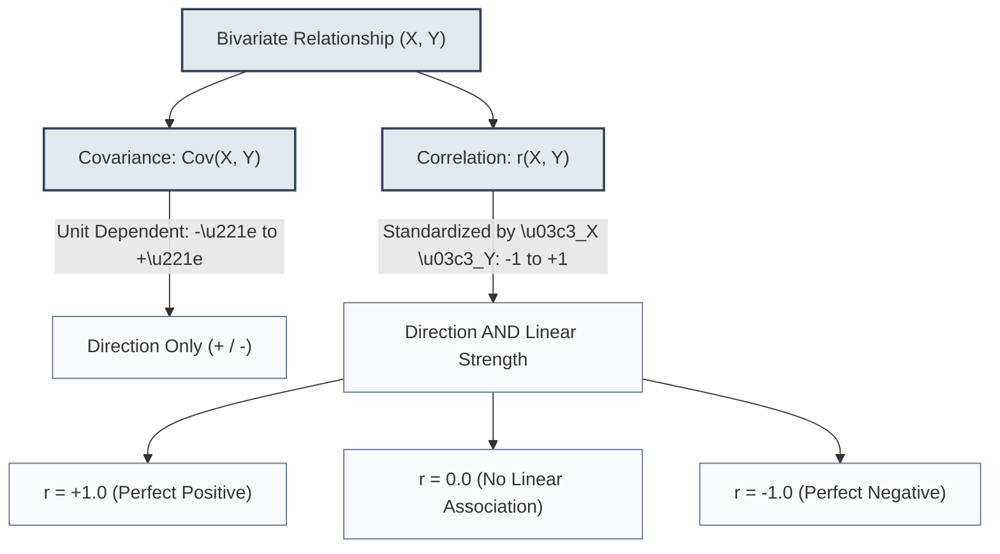

import Tabs from '@theme/Tabs';
import TabItem from '@theme/TabItem';
import Heading from '@theme/Heading';
import React from 'react';

# Covariance & Correlation Analysis

> **Topic -** Covariance and correlation evaluate bivariate relationships between numerical variables. While covariance establishes the directional co-movement of two features, Pearson correlation standardizes this relationship into a scale-free metric bounded between -1 and +1, quantifying both direction and linear strength.

---

## 1. Intuition & Architectural Flow

When examining two continuous features (e.g., advertising expenditure vs product sales, or engine displacement vs vehicle fuel efficiency), we must determine whether changes in one variable systematically associate with changes in the other.



### Core Intuition
*   **Covariance:** If values of $X$ above its mean consistently coincide with values of $Y$ above its mean, their product of deviations $(X_i - \bar{X})(Y_i - \bar{Y})$ is positive. If $X$ rises while $Y$ falls, the product is negative. However, because covariance is measured in the product of the original units (e.g., $\text{USD} \times \text{kg}$), its raw magnitude is uninterpretable.
*   **Correlation:** Normalizing the covariance by the product of both individual standard deviations removes the measurement scale, producing a pure, dimensionless number between $-1$ and $+1$.

---

## 2. Mathematical Formulations & Derivations

### Covariance

For two random variables $X$ and $Y$:

<Tabs>
  <TabItem value="pop-cov" label="1. Population Covariance" default>
    <br/>
    
    $$\text{Cov}(X, Y) = \sigma_{XY} = \frac{1}{N} \sum_{i=1}^N (X_i - \mu_X)(Y_i - \mu_Y) = \mathbb{E}[(X - \mu_X)(Y - \mu_Y)]$$
  </TabItem>
  <TabItem value="samp-cov" label="2. Sample Covariance">
    <br/>
    
    $$\text{Cov}(X, Y) = s_{XY} = \frac{1}{n - 1} \sum_{i=1}^n (X_i - \bar{X})(Y_i - \bar{Y})$$
    
    *   *Degrees of Freedom:* Just as with sample variance, division by $n - 1$ applies Bessel's correction to ensure $s_{XY}$ is an unbiased estimator of $\sigma_{XY}$.
    *   *Self-Covariance Property:* The covariance of a variable with itself is its variance: $\text{Cov}(X, X) = \text{Var}(X) = s_X^2$.
  </TabItem>
</Tabs>

### Pearson Correlation Coefficient ($r$)

Karl Pearson defined the correlation coefficient $r_{XY}$ as the ratio of sample covariance to the product of sample standard deviations:

$$r_{XY} = \frac{\text{Cov}(X, Y)}{s_X \cdot s_Y} = \frac{\sum_{i=1}^n (X_i - \bar{X})(Y_i - \bar{Y})}{\sqrt{\sum_{i=1}^n (X_i - \bar{X})^2} \sqrt{\sum_{i=1}^n (Y_i - \bar{Y})^2}}$$

### Mathematical Properties of Pearson Correlation

Click the tabs below to explore its foundational mathematical constraints:

<Tabs>
  <TabItem value="bounds" label="1. Strict Bounds [-1, +1]" default>
    <br/>
    
    *   By the **Cauchy-Schwarz Inequality** in linear algebra:
    
    $$\lvert \langle u, v \rangle \rvert \le \|u\| \cdot \|v\| \implies \left\lvert \sum_{i=1}^n (X_i - \bar{X})(Y_i - \bar{Y}) \right\rvert \le \sqrt{\sum (X_i - \bar{X})^2} \sqrt{\sum (Y_i - \bar{Y})^2}$$
    
    *   Therefore, $-1.0 \le r_{XY} \le +1.0$ holds universally for any valid dataset with non-zero variance.
  </TabItem>
  <TabItem value="invariance" label="2. Scale and Location Invariance">
    <br/>
    
    *   Let $U = aX + b$ and $V = cY + d$, where $a, b, c, d$ are constants.
    *   If $a > 0$ and $c > 0$, then $r_{UV} = r_{XY}$.
    *   *Engineering Significance:* Converting currency from USD to EUR, or temperatures from Celsius to Fahrenheit, has **zero** effect on the Pearson correlation coefficient.
  </TabItem>
  <TabItem value="symmetry" label="3. Symmetry & Directionality">
    <br/>
    
    *   $r_{XY} = r_{YX}$.
    *   Unlike regression coefficients ($\beta_1$), correlation does not distinguish between independent (feature) and dependent (target) variables. It measures mutual association, not asymmetric dependency.
  </TabItem>
</Tabs>

---

## 3. Comparative Taxonomy: Covariance vs Correlation

| Dimension | Covariance ($\text{Cov}(X, Y)$) | Correlation ($r_{XY}$) |
| :--- | :--- | :--- |
| **Fundamental Goal** | Measures whether two variables vary in the same direction | Measures both the direction and the relative linear strength |
| **Scale & Units** | Expressed in the product of original units (e.g., $\text{kg} \times \text{cm}$) | Completely dimensionless and unit-free |
| **Numerical Range** | $-\infty \le \text{Cov}(X, Y) \le +\infty$ | $-1.0 \le r_{XY} \le +1.0$ |
| **Scale Dependency** | Highly sensitive to unit changes (e.g., meters $\to$ millimeters inflates covariance by $1,000$) | Invariant to positive linear scale and origin transformations |
| **Direct Comparability**| Cannot compare relationships across different pairs of variables | Directly comparable across entirely unrelated domains |

---

## 4. Step-by-Step Numerical Walkthrough

Academic exams frequently present pairs of raw values and require computing both sample covariance and the Pearson correlation coefficient.

### Problem
A factory monitors raw material imports ($X$ in metric tons) and finished product exports ($Y$ in metric tons) across 5 production months:

$$X = [10, 11, 14, 14, 21], \quad Y = [12, 14, 15, 16, 23]$$

Compute:
1. Sample means $\bar{X}$ and $\bar{Y}$
2. Sample Covariance $\text{Cov}(X, Y)$
3. Sample Standard Deviations $s_X$ and $s_Y$
4. Pearson Correlation Coefficient $r_{XY}$

#### Step 1: Calculate Sample Means ($n = 5$)

$$\bar{X} = \frac{10 + 11 + 14 + 14 + 21}{5} = \frac{70}{5} = 14.0$$

$$\bar{Y} = \frac{12 + 14 + 15 + 16 + 23}{5} = \frac{80}{5} = 16.0$$

#### Step 2: Tabulate Deviations and Cross-Products

| Month $i$ | $X_i$ | $Y_i$ | $(X_i - \bar{X})$ | $(Y_i - \bar{Y})$ | $(X_i - \bar{X})^2$ | $(Y_i - \bar{Y})^2$ | $(X_i - \bar{X})(Y_i - \bar{Y})$ |
| :--- | :--- | :--- | :--- | :--- | :--- | :--- | :--- |
| **1** | 10 | 12 | $-4.0$ | $-4.0$ | $16.0$ | $16.0$ | $+16.0$ |
| **2** | 11 | 14 | $-3.0$ | $-2.0$ | $9.0$ | $4.0$ | $+6.0$ |
| **3** | 14 | 15 | $0.0$ | $-1.0$ | $0.0$ | $1.0$ | $0.0$ |
| **4** | 14 | 16 | $0.0$ | $0.0$ | $0.0$ | $0.0$ | $0.0$ |
| **5** | 21 | 23 | $+7.0$ | $+7.0$ | $49.0$ | $49.0$ | $+49.0$ |
| **Sum ($\sum$)** | **70** | **80** | **0.0** | **0.0** | **74.0** | **70.0** | **+71.0** |

#### Step 3: Compute Sample Covariance ($n - 1 = 4$)

$$\text{Cov}(X, Y) = \frac{\sum (X_i - \bar{X})(Y_i - \bar{Y})}{n - 1} = \frac{71.0}{4} = 17.75 \text{ tons}^2$$

*Interpretation:* The covariance is positive ($+17.75$), indicating that raw material imports and finished exports increase together.

#### Step 4: Compute Standard Deviations

$$s_X = \sqrt{\frac{\sum (X_i - \bar{X})^2}{n - 1}} = \sqrt{\frac{74.0}{4}} = \sqrt{18.5} \approx 4.301$$

$$s_Y = \sqrt{\frac{\sum (Y_i - \bar{Y})^2}{n - 1}} = \sqrt{\frac{70.0}{4}} = \sqrt{17.5} \approx 4.183$$

#### Step 5: Compute Pearson Correlation Coefficient

$$r_{XY} = \frac{\text{Cov}(X, Y)}{s_X \cdot s_Y} = \frac{17.75}{4.301 \times 4.183} = \frac{17.75}{17.991} \approx +0.9866$$

*Final Conclusion:* $r \approx +0.987$ indicates a very strong, nearly perfect positive linear association between imports and exports.

---

## 5. Implementation Lab

:::tip

**Implementation Lab: Covariance Matrices & Correlation Analysis in Python**

Execute bivariate analysis, covariance matrices, and correlation heatmaps across multivariate datasets.

<a href="https://colab.research.google.com/github/vettrivel-kl/vettrivel-kl.github.io/blob/master/static/labs/inferential-statistics/01-introduction/correlation_analysis.ipynb" target="_blank" rel="noopener noreferrer">
  
</a>

**Key Experiments to Run:**
*   **Experiment 1 (Scale Inflation Test):** Multiply feature $X$ by $1,000$. Verify that `cov(X, Y)` multiplies by $1,000$ while `corr(X, Y)` remains strictly constant.
*   **Experiment 2 (The Non-Linear Trap):** Generate quadratic data $Y = X^2$ on $X \in [-10, 10]$. Verify that Pearson $r \approx 0.0$ despite a perfect deterministic functional relationship.

:::

### Comparative Implementation

<Tabs>
  <TabItem value="pandas" label="1. Production (Pandas & SciPy)" default>
    <br/>

```python
import numpy as np
import pandas as pd
from scipy import stats

x = [10, 11, 14, 14, 21]
y = [12, 14, 15, 16, 23]
df = pd.DataFrame({'Imports': x, 'Exports': y})

# 1. Sample Covariance Matrix (ddof=1 applied automatically)
cov_matrix = df.cov()
cov_xy = cov_matrix.loc['Imports', 'Exports']

# 2. Pearson Correlation Matrix & p-value
corr_matrix = df.corr(method='pearson')
r_val, p_val = stats.pearsonr(df['Imports'], df['Exports'])

print(f"Sample Covariance: {cov_xy:.2f}")
print(f"Pearson Correlation (r): {r_val:.4f}")
print(f"Two-Tailed p-value: {p_val:.4e}")
```
  </TabItem>
  <TabItem value="scratch" label="2. Pure Python / NumPy from Scratch">
    <br/>

```python
import numpy as np

def bivariate_analysis(x_arr: list, y_arr: list):
    n = len(x_arr)
    assert n == len(y_arr) and n > 1, "Arrays must be equal length and n > 1"
    
    mean_x = sum(x_arr) / n
    mean_y = sum(y_arr) / n
    
    dev_x = [xi - mean_x for xi in x_arr]
    dev_y = [yi - mean_y for yi in y_arr]
    
    # Cross product sum and squared sums
    ss_xy = sum(dx * dy for dx, dy in zip(dev_x, dev_y))
    ss_xx = sum(dx ** 2 for dx in dev_x)
    ss_yy = sum(dy ** 2 for dy in dev_y)
    
    # Covariance and Pearson r
    cov_val = ss_xy / (n - 1)
    std_x = (ss_xx / (n - 1)) ** 0.5
    std_y = (ss_yy / (n - 1)) ** 0.5
    r_val = cov_val / (std_x * std_y)
    
    return {
        "mean_x": mean_x,
        "mean_y": mean_y,
        "covariance": cov_val,
        "std_x": std_x,
        "std_y": std_y,
        "pearson_r": r_val
    }

res = bivariate_analysis([10, 11, 14, 14, 21], [12, 14, 15, 16, 23])
print(res)
```
  </TabItem>
</Tabs>

---

## 6. Interactive Exploration: Correlation Sandbox

Observe how the scatter of points aligns as the target correlation coefficient ($r$) varies from $-1.0$ (perfect inverse linearity) to $+1.0$ (perfect direct linearity):

export const CorrelationSandbox = () => {
  const [targetR, setTargetR] = React.useState(0.8);
  
  const getDescriptor = (val) => {
    if (val === 1.0) return 'Perfect Positive Linear';
    if (val > 0.7) return 'Strong Positive Association';
    if (val > 0.3) return 'Moderate Positive Association';
    if (val > -0.3) return 'Negligible / No Linear Association';
    if (val > -0.7) return 'Moderate Negative Association';
    if (val > -1.0) return 'Strong Negative Association';
    return 'Perfect Negative Linear';
  };

  return (
    <div style={{ padding: '20px', border: '1px solid var(--ifm-color-emphasis-200)', borderRadius: '8px', backgroundColor: 'rgba(148, 163, 184, 0.05)', margin: '20px 0' }}>
      <h4 style={{ margin: '0 0 12px 0' }}>Correlation Strength & Direction Explorer</h4>
      <p style={{ margin: '0 0 14px 0', fontSize: '14px' }}>Adjust the correlation slider to evaluate relationship strength:</p>
      
      <input
        type="range"
        min="-100"
        max="100"
        value={Math.round(targetR * 100)}
        onChange={(e) => setTargetR(parseInt(e.target.value) / 100)}
        style={{ width: '100%', marginBottom: '16px' }}
      />
      
      <div style={{ display: 'grid', gridTemplateColumns: 'repeat(auto-fit, minmax(180px, 1fr))', gap: '12px' }}>
        <div style={{ padding: '12px', borderRadius: '6px', backgroundColor: 'var(--ifm-background-surface-color)', border: '1px solid var(--ifm-color-emphasis-300)' }}>
          <div style={{ fontSize: '11px', color: '#718096' }}>Pearson Coefficient (r)</div>
          <div style={{ fontSize: '18px', fontWeight: 'bold', color: targetR >= 0 ? '#3182ce' : '#e53e3e' }}>
            {targetR.toFixed(2)}
          </div>
        </div>
        <div style={{ padding: '12px', borderRadius: '6px', backgroundColor: 'var(--ifm-background-surface-color)', border: '1px solid var(--ifm-color-emphasis-300)' }}>
          <div style={{ fontSize: '11px', color: '#718096' }}>Classification</div>
          <div style={{ fontSize: '14px', fontWeight: 'bold', color: '#2b6cb0' }}>
            {getDescriptor(targetR)}
          </div>
        </div>
        <div style={{ padding: '12px', borderRadius: '6px', backgroundColor: 'var(--ifm-background-surface-color)', border: '1px solid var(--ifm-color-emphasis-300)' }}>
          <div style={{ fontSize: '11px', color: '#718096' }}>Variance Explained (R-squared)</div>
          <div style={{ fontSize: '18px', fontWeight: 'bold', color: '#38a169' }}>
            {(Math.pow(targetR, 2) * 100).toFixed(1)}%
          </div>
        </div>
      </div>
    </div>
  );
};

<CorrelationSandbox />

---

## 7. Exam Traps & Operational Nuances

<Tabs>
  <TabItem value="trap1" label="1. The Non-Linearity Pitfall" default>
    <br/>
    
    *   **The Trap:** Assuming that $r = 0$ implies variables $X$ and $Y$ are statistically independent.
    *   **The Mathematical Reality:** Pearson correlation measures **linear** association exclusively.
    *   *Classic Counter-Example:* Let $X \sim \text{Uniform}(-1, 1)$ and $Y = X^2$. Here, $Y$ is completely deterministic based on $X$. Yet, $\text{Cov}(X, Y) = 0$ and $r = 0$. Always inspect scatterplots before declaring lack of association.
  </TabItem>
  <TabItem value="trap2" label="2. Multicollinearity in Regression">
    <br/>
    
    *   **The Trap:** Feeding highly correlated features ($|r| > 0.85$) simultaneously into an unregularized Multiple Linear Regression model.
    *   **The Consequence:** Causes matrix singularity / near-zero determinant in $(X^TX)^{-1}$, resulting in exploding standard errors for regression coefficients and wildly erratic weights.
    *   **The Solution:** Calculate Variance Inflation Factors (VIF) and drop redundant features or apply Ridge regularization ($L_2$).
  </TabItem>
</Tabs>

---

## 8. Summary & Cheatsheet

<div className="row">
  <div className="col col--6">
    <div className="card" style={{ height: '100%', marginBottom: '15px' }}>
      <div className="card__header">
        <h3>Mathematical Core</h3>
      </div>
      <div className="card__body">
        <ul>
          <li><b>Sample Covariance:</b> $s_{XY} = \frac{1}{n-1}\sum (X_i - \bar{X})(Y_i - \bar{Y})$.</li>
          <li><b>Pearson $r$:</b> $r_{XY} = \frac{s_{XY}}{s_X s_Y}$, bounded within $[-1, +1]$.</li>
          <li><b>Scale Invariance:</b> Linear transformations preserve correlation: $r(aX+b, cY+d) = r(X, Y)$ for $a, c &gt; 0$.</li>
        </ul>
      </div>
    </div>
  </div>
  <div className="col col--6">
    <div className="card" style={{ height: '100%', marginBottom: '15px' }}>
      <div className="card__header">
        <h3>Diagnostic Rules</h3>
      </div>
      <div className="card__body">
        <ul>
          <li><b>Direction vs Strength:</b> Covariance gives sign only; correlation provides magnitude.</li>
          <li><b>Non-Linear Warning:</b> $r = 0$ does not mean independent; it only means no linear trend.</li>
          <li><b>Coefficient of Determination:</b> $r^2$ is the proportion of total variance shared between variables.</li>
        </ul>
      </div>
    </div>
  </div>
</div>

<br/>

:::info

**Key Takeaways**

*   **Takeaway 1:** Covariance indicates direction of co-movement but cannot determine relationship strength because it scales with measurement units.
*   **Takeaway 2:** Pearson correlation standardizes covariance into a scale-free metric ($[-1, 1]$), enabling direct comparisons across diverse features.
*   **Takeaway 3:** High correlation does not imply causation, and zero correlation does not rule out complex non-linear relationships.

:::

---

## 9. Active Recall & Practice

*Test your understanding by answering first, then clicking to reveal the underlying principles.*

### Checkpoint Quiz

export const PracticeQuiz3 = () => {
  const [selected, setSelected] = React.useState(null);
  return (
    <div style={{ padding: '20px', border: '1px solid var(--ifm-color-emphasis-200)', borderRadius: '8px', backgroundColor: 'rgba(148, 163, 184, 0.05)', margin: '20px 0' }}>
      <h4 style={{ margin: '0 0 10px 0' }}>Interactive Checkpoint: Self-Test</h4>
      <p style={{ margin: '0 0 15px 0' }}>If all values of variable X are multiplied by 5, what happens to Cov(X, Y) and r(X, Y)?</p>
      <div style={{ display: 'flex', gap: '10px', flexWrap: 'wrap' }}>
        <button onClick={() => setSelected('opt1')} style={{ padding: '8px 16px', borderRadius: '4px', border: '1px solid #3182ce', backgroundColor: selected === 'opt1' ? '#e53e3e' : 'transparent', color: selected === 'opt1' ? '#fff' : 'var(--ifm-font-color-base)', cursor: 'pointer', transition: '0.2s' }}>Both increase by 5x</button>
        <button onClick={() => setSelected('opt2')} style={{ padding: '8px 16px', borderRadius: '4px', border: '1px solid #3182ce', backgroundColor: selected === 'opt2' ? '#38a169' : 'transparent', color: selected === 'opt2' ? '#fff' : 'var(--ifm-font-color-base)', cursor: 'pointer', transition: '0.2s' }}>Covariance increases by 5x, Correlation remains unchanged (Correct)</button>
        <button onClick={() => setSelected('opt3')} style={{ padding: '8px 16px', borderRadius: '4px', border: '1px solid #3182ce', backgroundColor: selected === 'opt3' ? '#e53e3e' : 'transparent', color: selected === 'opt3' ? '#fff' : 'var(--ifm-font-color-base)', cursor: 'pointer', transition: '0.2s' }}>Neither changes</button>
      </div>
      {selected === 'opt1' && <p style={{ color: '#e53e3e', marginTop: '15px', fontWeight: 'bold', fontSize: '14px', marginBottom: '0' }}>Incorrect. Pearson correlation is scale-invariant and does not change.</p>}
      {selected === 'opt2' && <p style={{ color: '#38a169', marginTop: '15px', fontWeight: 'bold', fontSize: '14px', marginBottom: '0' }}>Correct! Cov(5X, Y) = 5 * Cov(X, Y), but the denominator in r also scales by \u221a(Var(5X)) = 5 * s_X, canceling the factor completely!</p>}
      {selected === 'opt3' && <p style={{ color: '#e53e3e', marginTop: '15px', fontWeight: 'bold', fontSize: '14px', marginBottom: '0' }}>Incorrect. Covariance is directly proportional to scale and will scale by 5.</p>}
    </div>
  );
};

<PracticeQuiz3 />

### Review Flashcards

<details>
  <summary><b>1. [SCALE] Why is covariance alone insufficient to evaluate the strength of an association?</b></summary>
  <div className="answer-content">
    <br/>
    
    *   Covariance is scale-dependent. Changing the measurement unit of a variable (e.g., converting height from meters to millimeters) multiplies the covariance by 1,000 without any change in the actual association.
    *   Without standardization, a covariance of $500$ cannot be judged as stronger or weaker than a covariance of $5$.
  </div>
</details>

<details>
  <summary><b>2. [EXAM QUESTION] Two variables have Cov(X, Y) = -18. If s_X = 4 and s_Y = 5, what is their correlation coefficient?</b></summary>
  <div className="answer-content">
    <br/>
    
    *   $$r = \frac{\text{Cov}(X, Y)}{s_X \cdot s_Y} = \frac{-18}{4 \times 5} = \frac{-18}{20} = -0.90$$
    *   This indicates a strong negative linear association.
  </div>
</details>

<details>
  <summary><b>3. [THEORY] Can Pearson's r be negative while Cov(X, Y) is positive?</b></summary>
  <div className="answer-content">
    <br/>
    
    *   **No.** By definition, $r = \frac{\text{Cov}(X, Y)}{s_X s_Y}$.
    *   Since standard deviations $s_X$ and $s_Y$ are strictly positive real numbers, the algebraic sign of $r$ is identical to the sign of $\text{Cov}(X, Y)$.
  </div>
</details>
