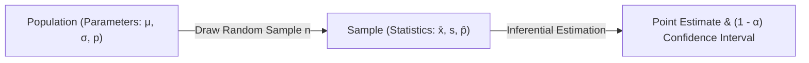
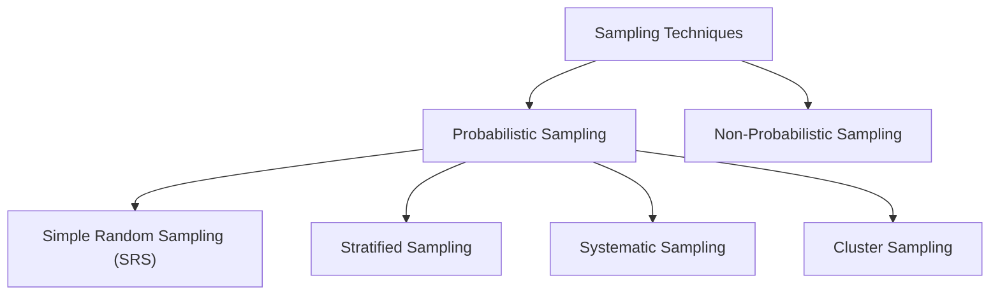

import Tabs from '@theme/Tabs';
import TabItem from '@theme/TabItem';
import Heading from '@theme/Heading';
import React from 'react';

# Sampling and Estimation

> **Topic -** In real-world data science, measuring an entire population is rarely feasible due to operational constraints. Instead, we use sampling distributions to estimate unknown population parameters. Point estimation produces a single best-guess statistic, while interval estimation constructs a confidence interval bounded by a margin of error.

---

## 1. Population vs. Sample & The Need for Sampling

*   **Population:** The complete collection of all elements, individuals, or items under study (e.g., all manufactured batteries from a factory). Characteristics of a population are called **parameters** (mean $\mu$, variance $\sigma^2$, proportion $p$).
*   **Sample:** A representative subset drawn from the population. Numerical summaries computed from a sample are called **statistics** (sample mean $\bar{x}$, sample variance $s^2$, sample proportion $\hat{p}$).

### The Practical Need to Sample
1.  **Destructive Testing:** Evaluating battery lifespan or the tensile strength of an alloy exhausts the product. Testing the whole population leaves zero inventory to sell.
2.  **Resource Constraints:** Gathering data on large populations (such as all citizens in a country) is cost-prohibitive and computationally intractable.
3.  **Efficiency:** An appropriately sized, unbiased random sample provides precise, mathematically bounded estimates with minimal variance.



### Probabilistic Sampling Techniques

Sampling methods dictate how observations are selected from a population. In statistical inference, **probabilistic sampling** ensures every element in the target population has a known, non-zero probability of selection, eliminating systematic selection bias.



| Sampling Method | Operational Mechanism | Key Characteristic / Use Case |
| :--- | :--- | :--- |
| **Simple Random (SRS)** | Every individual unit in the population has an equal probability of selection. | Baseline random sampling; standard train/test dataset splits. |
| **Stratified Sampling** | Population is divided into homogeneous, non-overlapping subgroups (**strata**); random samples are drawn proportionally from each stratum. | Used when data is heterogeneous across sub-populations; ensures minority classes are represented (e.g., `StratifiedKFold`). |
| **Systematic Sampling** | The first unit is selected randomly, and subsequent units are drawn at fixed periodic intervals ($k = N/n$). | Easy to implement for physical audits, large-scale quality control on assembly lines, or continuous data streams. |
| **Cluster Sampling** | Population is divided into naturally occurring heterogeneous subgroups (**clusters**); entire clusters are randomly selected as sample points. | Cost-effective when the population is widely dispersed geographically; sampling entire schools or regional centers instead of scattered individuals. |

#### Simple Random Sampling: With vs. Without Replacement

*   **Simple Random Sampling Without Replacement (SRSWOR):** Once a unit is selected, it is not returned to the population pool.
    *   From a population of $N$ units, the number of distinct possible samples of size $n$ is:
        $$\binom{N}{n} = \frac{N!}{n!(N-n)!}$$
    *   The probability of selecting any specific sample configuration is $\frac{1}{\binom{N}{n}}$.
    *   Python equivalent: `random.sample(population, k=n)`.
*   **Simple Random Sampling With Replacement (SRSWR):** Once a unit is selected and recorded, it is returned to the population pool, meaning an observation can be drawn multiple times.
    *   The number of possible ordered samples of size $n$ from population $N$ is:
        $$N^n$$
    *   The probability of selecting any specific sequence is $\frac{1}{N^n}$.
    *   Crucial for simulation studies, Monte Carlo simulations, and bootstrapping.
    *   Python equivalent: `random.choices(population, k=n)`.

### Resampling Methods

**Resampling** is an empirical, non-parametric methodology where repeated samples are drawn directly from an available observed sample rather than the underlying population:

*   **Bootstrap Resampling:** Repeatedly drawing samples of size $n$ **with replacement** from the observed dataset. It estimates the empirical sampling distribution of any statistic (mean, median, variance) without requiring parametric normality assumptions. It forms the computational foundation of Bootstrap Aggregating (Bagging) in ensemble models like Random Forests.
*   **Jackknife Resampling:** Systematically recomputing the estimator while iteratively leaving out one observation at a time ($n$ subsamples of size $n-1$). Primarily employed for estimating the bias and standard error of complex parameter estimators.

---

## 2. Sampling Distributions & The Central Limit Theorem (CLT)

When drawing $k$ independent random samples of size $n$ from a population, the calculated sample statistics $(\bar{x}_1, \bar{x}_2, \dots, \bar{x}_k)$ will naturally fluctuate. This variation across repeated samples is called **sampling variability**.

The probability distribution of these sample means is the **Sampling Distribution of the Mean**.

### The Central Limit Theorem Formulation

:::info

**The Central Limit Theorem (CLT)**

Regardless of the underlying population distribution (whether Normal, Poisson, Binomial, or Uniform), as the sample size $n$ becomes sufficiently large ($n \ge 30$), the sampling distribution of the sample mean $\bar{X}$ approaches a **Normal Distribution**:

$$\bar{X} \sim \mathcal{N}\left( \mu_{\bar{X}} = \mu, \; \sigma_{\bar{X}} = \frac{\sigma}{\sqrt{n}} \right)$$

:::

Where $\sigma_{\bar{X}} = \frac{\sigma}{\sqrt{n}}$ is called the **Standard Error of the Mean (SE)**.

Converting the sample mean to a standard normal variable:

$$Z = \frac{\bar{X} - \mu}{\sigma / \sqrt{n}} \sim \mathcal{N}(0, 1)$$

If the population standard deviation $\sigma$ is unknown, we substitute the sample standard deviation $s$, yielding $Z \approx \frac{\bar{X} - \mu}{s / \sqrt{n}}$ for large samples ($n \ge 30$).

---

## 3. Point Estimation

A **point estimate** uses a single statistic computed from sample observations to estimate an unknown population parameter.

:::info

**Motivating Question: Average Income of a 27-Year-Old in London**

*   **Question:** What would be the average income of a 27-year-old in London? How would you calculate it?
*   **The Trivial Approach:** Collect income figures for every single 27-year-old living in London and compute their exact mean ($\mu$).
*   **The Operational Reality:** Surveying the entire population is unfeasible due to time, labor, and computational costs.
*   **The Statistical Solution:** Draw a representative random sample of size $n$, calculate the sample mean $\bar{x}$, and use $\bar{x}$ as our **point estimate** for the population mean $\mu$.

:::

| Parameter to Estimate | Unbiased Point Estimator | Mathematical Formula |
| :--- | :--- | :--- |
| **Population Mean ($\mu$)** | Sample Mean ($\bar{x}$) | $\bar{x} = \frac{1}{n}\sum_{i=1}^n x_i$ |
| **Population Variance ($\sigma^2$)** | Sample Variance ($s^2$) | $s^2 = \frac{1}{n-1}\sum_{i=1}^n (x_i - \bar{x})^2$ |
| **Population Proportion ($p$)** | Sample Proportion ($\hat{p}$) | $\hat{p} = \frac{x}{n}$ |

### Sampling Error
The point estimate will differ from the true population parameter due to random chance. The absolute magnitude of this discrepancy is the **Sampling Error**:

$$\text{Sampling Error} = |\bar{x} - \mu|$$

Increasing the sample size $n$ consistently drives down the standard error ($\sigma / \sqrt{n}$), decreasing sampling error.

#### Worked Example: Morning Temperature Sampling Error
*   **Population Mean ($\mu$):** $55^\circ\text{F}$
*   **Sample Data ($n = 15$ mornings):** $[49.8, 52.3, 51.0, 56.9, 54.8, 63.0, 58.2, 54.1, 50.4, 49.2, 47.0, 51.3, 43.5, 56.0, 55.0]$
*   **Sample Mean ($\bar{x}$):**
    $$\bar{x} = \frac{792.5}{15} \approx 52.833^\circ\text{F}$$
*   **Sampling Error:**
    $$|\bar{x} - \mu| = |52.833 - 55.0| = 2.167^\circ\text{F}$$

---

## 4. Interval Estimation & Confidence Intervals

Because a point estimate rarely matches the true parameter exactly, **Interval Estimation** provides a range of plausible values $[L, U]$ associated with a specified **confidence level** ($1 - \alpha$).

### Derivation for Population Mean ($\mu$)
From the Central Limit Theorem, the probability that the standardized statistic $Z$ falls between two critical values $-z_{\alpha/2}$ and $z_{\alpha/2}$ is $1 - \alpha$:

$$P\left( -z_{\alpha/2} \le \frac{\bar{X} - \mu}{\sigma / \sqrt{n}} \le z_{\alpha/2} \right) = 1 - \alpha$$

Rearranging the inequality:

$$P\left( \bar{X} - z_{\alpha/2}\frac{\sigma}{\sqrt{n}} \le \mu \le \bar{X} + z_{\alpha/2}\frac{\sigma}{\sqrt{n}} \right) = 1 - \alpha$$

Thus, the **$100(1 - \alpha)\%$ Confidence Interval** is:

$$\text{CI} = \bar{X} \pm E$$

Where $E = z_{\alpha/2}\frac{\sigma}{\sqrt{n}}$ is the **Margin of Error**.

### Critical Values for Common Confidence Levels

<Tabs>
  <TabItem value="90" label="90% Confidence (α = 0.10)" default>
    <br/>
    
    *   $\alpha / 2 = 0.05$
    *   $z_{\alpha/2} = 1.645$
    *   $\text{CI} = \bar{X} \pm 1.645 \frac{\sigma}{\sqrt{n}}$
  </TabItem>
  <TabItem value="95" label="95% Confidence (α = 0.05)">
    <br/>
    
    *   $\alpha / 2 = 0.025$
    *   $z_{\alpha/2} = 1.960$
    *   $\text{CI} = \bar{X} \pm 1.960 \frac{\sigma}{\sqrt{n}}$
  </TabItem>
  <TabItem value="99" label="99% Confidence (α = 0.01)">
    <br/>
    
    *   $\alpha / 2 = 0.005$
    *   $z_{\alpha/2} = 2.575$
    *   $\text{CI} = \bar{X} \pm 2.575 \frac{\sigma}{\sqrt{n}}$
  </TabItem>
</Tabs>

:::info

**Computing Critical Z-Values in Python**

In Python, critical values $z_{\alpha/2}$ are computed using `scipy.stats`:
*   `scipy.stats.norm.ppf(1 - alpha / 2)`: Percent Point Function (inverse of CDF, returns the $z$-score with cumulative area $1 - \alpha/2$).
*   `scipy.stats.norm.isf(alpha / 2)`: Inverse Survival Function (returns the upper-tail critical $z$-score directly).

:::

:::tip

**Width vs. Confidence Tradeoff**

As the confidence level increases (e.g., from 90% to 99%), $z_{\alpha/2}$ grows larger, making the interval **wider**. A higher degree of certainty requires a wider net.

:::

---

## 5. Confidence Intervals for Proportions

For categorical variables (such as defective items or churn status), the sampling distribution of the sample proportion $\hat{p} = x/n$ follows an approximate normal distribution for large samples:

$$\hat{p} \sim \mathcal{N}\left( p, \; \sqrt{\frac{p(1 - p)}{n}} \right)$$

The **$100(1 - \alpha)\%$ Confidence Interval for Proportion** is:

$$\text{CI}_p = \hat{p} \pm z_{\alpha/2} \sqrt{\frac{\hat{p}(1 - \hat{p})}{n}}$$

---

## 6. Determining Sample Size from Margin of Error

When designing an experiment or survey, a primary goal is to determine how many observations $n$ must be sampled to guarantee a maximum tolerable margin of error $E$:

$$E = z_{\alpha/2}\frac{\sigma}{\sqrt{n}} \implies \sqrt{n} = \frac{z_{\alpha/2}\cdot \sigma}{E} \implies n = z_{\alpha/2}^2 \left( \frac{\sigma^2}{E^2} \right)$$

:::info

**Error vs. Sample Size Relationship**

Because $n$ is inversely proportional to $E^2$, halving the target margin of error requires a **fourfold increase** in the sample size.

:::

#### Verification Example: Coal Ash Testing
**Problem:** 100 bags of coal are tested and exhibit a standard deviation of $\sigma = 15\%$ ($0.15$). 
1.  **Margin of Error at 90% Confidence ($\alpha = 0.10 \implies z_{0.05} = 1.645$):**
    $$E = z_{\alpha/2}\frac{\sigma}{\sqrt{n}} = 1.645 \cdot \frac{0.15}{\sqrt{100}} = 1.645 \cdot 0.015 = 0.024675 \approx 2.47\%$$
2.  **Reverse Sample Size Calculation:** Given a target margin of error $E = 0.024675$, verify the required sample size:
    $$n = (1.645)^2 \cdot \left( \frac{0.15^2}{0.024675^2} \right) \approx 2.706 \cdot \frac{0.0225}{0.00060885} = 100 \text{ bags}$$

---

## 7. Numerical Problem Walkthroughs

### Scenario A: Portfolio Point Estimate
**Problem:** A financial firm manages $N = 50$ portfolios. A sample of $n = 13$ portfolios is audited, and $x = 8$ are found underperforming. Estimate the total number of underperforming portfolios in the firm.
1.  **Sample Proportion:** $\hat{p} = \frac{x}{n} = \frac{8}{13} \approx 0.6154$
2.  **Total Estimate:** $\hat{N}_{\text{under}} = \hat{p} \cdot N = 0.6154 \cdot 50 = 30.77 \approx 31$ portfolios.

### Scenario B: Average Income Confidence Interval
**Problem:** A sample of $n = 250$ twenty-seven-year-olds in London has an average income of $\bar{X} = 45,000$ GBP with population standard deviation $\sigma = 4,000$ GBP. Calculate the 95% Confidence Interval. Furthermore, obtain the 90% and 99% confidence intervals and logically explain which is the widest.
1.  **Given:** $\bar{X} = 45000$, $\sigma = 4000$, $n = 250$.
2.  **Standard Error:** $\text{SE} = \frac{\sigma}{\sqrt{n}} = \frac{4000}{\sqrt{250}} = \frac{4000}{15.811} \approx 252.98$ GBP.
3.  **95% Confidence Interval ($\alpha = 0.05, z_{0.025} = 1.96$):**
    $$E_{95\%} = 1.96 \cdot 252.98 = 495.84 \implies \text{CI}_{95\%} = [44504.16, \; 45495.84]$$
4.  **90% Confidence Interval ($\alpha = 0.10, z_{0.05} = 1.645$):**
    $$E_{90\%} = 1.645 \cdot 252.98 = 416.15 \implies \text{CI}_{90\%} = [44583.85, \; 45416.15]$$
5.  **99% Confidence Interval ($\alpha = 0.01, z_{0.005} = 2.575$):**
    $$E_{99\%} = 2.575 \cdot 252.98 = 651.42 \implies \text{CI}_{99\%} = [44348.58, \; 45651.42]$$
6.  **Width Comparison:**
    The **99% confidence interval is the widest** (width $\approx 1302.84$), followed by the 95% interval (width $\approx 991.68$), and the 90% interval (width $\approx 832.30$). To have higher confidence (99% certainty vs. 90% certainty) that the interval captures the fixed population mean $\mu$, the interval must cover a broader range of possible values.
7.  **Interpretation:** If we repeat this sampling process many times, roughly 95% of the calculated intervals will contain the true mean income. (It is incorrect to say there is a 95% chance that the true mean is inside this specific fixed interval, as the parameter $\mu$ is a fixed constant, not a random variable).

### Scenario C: Proportion Confidence Interval (Audited Portfolios)
**Problem:** A financial firm manages 50 portfolios. An audit of $n = 13$ portfolios reveals that $x = 8$ are underperforming. Construct a 99% confidence interval for the true population proportion of underperforming portfolios.
1.  **Given:** $n = 13$, $x = 8 \implies \hat{p} = \frac{8}{13} \approx 0.6154$
2.  **Critical Value:** For 99% confidence, $\alpha = 0.01 \implies z_{\alpha/2} = z_{0.005} = 2.575$
3.  **Standard Error of Proportion:**
    $$\text{SE}_p = \sqrt{\frac{\hat{p}(1 - \hat{p})}{n}} = \sqrt{\frac{0.6154 \cdot 0.3846}{13}} = \sqrt{\frac{0.2367}{13}} \approx \sqrt{0.0182} \approx 0.1349$$
4.  **Margin of Error:** $E = 2.575 \cdot 0.1349 \approx 0.3475$
5.  **Confidence Interval:**
    $$\text{CI}_{99\%} = 0.6154 \pm 0.3475 = [0.2679, \; 0.9629]$$
6.  **Interpretation:** With 99% confidence, the true proportion of underperforming portfolios across the firm lies between approximately 26.8% and 96.3%.

---

## 8. Implementation Lab

<a href="/labs/inferential-statistics/03-estimation-and-hypothesis-testing/estimation_and_confidence.ipynb" target="_blank" rel="noopener noreferrer">
  
</a>

```python
import numpy as np
from scipy import stats

# 1. Confidence Interval for Mean (London Income Scenario)
n = 250
mean_val = 45000
std_val = 4000
conf_level = 0.95

# Calculate scale = std / sqrt(n)
ci_mean = stats.norm.interval(conf_level, loc=mean_val, scale=std_val / np.sqrt(n))
print(f"95% CI for Mean: {ci_mean}")

# 2. Confidence Interval for Proportion (Portfolios Scenario)
n_port = 13
x_port = 8
p_hat = x_port / n_port
se_prop = np.sqrt((p_hat * (1 - p_hat)) / n_port)

ci_prop = stats.norm.interval(0.99, loc=p_hat, scale=se_prop)
print(f"99% CI for Proportion: {ci_prop}")
```

<br/>

:::info

**Key Takeaways**

*   **CLT Guarantees Normality:** The sampling distribution of the mean is normal for $n \ge 30$, even if the original population distribution is non-normal.
*   **Confidence vs. Probability:** The parameter $\mu$ is fixed. A 95% confidence interval means that across repeated sampling experiments, 95% of constructed intervals capture $\mu$.
*   **Controlling Margin of Error:** To cut the margin of error in half, you must quadruple the sample size ($n \propto 1/E^2$).

:::

**Next Section:** [Hypothesis Testing Foundations](./02-hypothesis-testing-foundations.mdx) - learning to evaluate statistical claims, understand errors, and compute test power.
