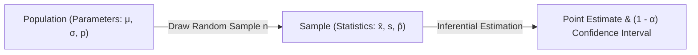

import Tabs from '@theme/Tabs';
import TabItem from '@theme/TabItem';
import Heading from '@theme/Heading';
import React from 'react';

# Sampling and Estimation

> **Topic -** In real-world data science, measuring an entire population is rarely feasible due to operational constraints. Instead, we use sampling distributions to estimate unknown population parameters. Point estimation produces a single best-guess statistic, while interval estimation constructs a confidence interval bounded by a margin of error.

---

## 1. Population vs. Sample & The Need for Sampling

*   **Population:** The complete collection of all elements, individuals, or items under study (e.g., all manufactured batteries from a factory). Characteristics of a population are called **parameters** (mean $\mu$, variance $\sigma^2$, proportion $p$).
*   **Sample:** A representative subset drawn from the population. Numerical summaries computed from a sample are called **statistics** (sample mean $\bar{x}$, sample variance $s^2$, sample proportion $\hat{p}$).

### The Practical Need to Sample
1.  **Destructive Testing:** Evaluating battery lifespan or the tensile strength of an alloy exhausts the product. Testing the whole population leaves zero inventory to sell.
2.  **Resource Constraints:** Gathering data on large populations (such as all citizens in a country) is cost-prohibitive and computationally intractable.
3.  **Efficiency:** An appropriately sized, unbiased random sample provides precise, mathematically bounded estimates with minimal variance.



---

## 2. Sampling Distributions & The Central Limit Theorem (CLT)

When drawing $k$ independent random samples of size $n$ from a population, the calculated sample statistics $(\bar{x}_1, \bar{x}_2, \dots, \bar{x}_k)$ will naturally fluctuate. This variation across repeated samples is called **sampling variability**.

The probability distribution of these sample means is the **Sampling Distribution of the Mean**.

### The Central Limit Theorem Formulation

:::info

**The Central Limit Theorem (CLT)**

Regardless of the underlying population distribution (whether Normal, Poisson, Binomial, or Uniform), as the sample size $n$ becomes sufficiently large ($n \ge 30$), the sampling distribution of the sample mean $\bar{X}$ approaches a **Normal Distribution**:

$$\bar{X} \sim \mathcal{N}\left( \mu_{\bar{X}} = \mu, \; \sigma_{\bar{X}} = \frac{\sigma}{\sqrt{n}} \right)$$

:::

Where $\sigma_{\bar{X}} = \frac{\sigma}{\sqrt{n}}$ is called the **Standard Error of the Mean (SE)**.

Converting the sample mean to a standard normal variable:

$$Z = \frac{\bar{X} - \mu}{\sigma / \sqrt{n}} \sim \mathcal{N}(0, 1)$$

If the population standard deviation $\sigma$ is unknown, we substitute the sample standard deviation $s$, yielding $Z \approx \frac{\bar{X} - \mu}{s / \sqrt{n}}$ for large samples ($n \ge 30$).

---

## 3. Point Estimation

A **point estimate** uses a single statistic computed from sample observations to estimate an unknown population parameter.

| Parameter to Estimate | Unbiased Point Estimator | Mathematical Formula |
| :--- | :--- | :--- |
| **Population Mean ($\mu$)** | Sample Mean ($\bar{x}$) | $\bar{x} = \frac{1}{n}\sum_{i=1}^n x_i$ |
| **Population Variance ($\sigma^2$)** | Sample Variance ($s^2$) | $s^2 = \frac{1}{n-1}\sum_{i=1}^n (x_i - \bar{x})^2$ |
| **Population Proportion ($p$)** | Sample Proportion ($\hat{p}$) | $\hat{p} = \frac{x}{n}$ |

### Sampling Error
The point estimate will differ from the true population parameter due to random chance. The absolute magnitude of this discrepancy is the **Sampling Error**:

$$\text{Sampling Error} = |\bar{x} - \mu|$$

Increasing the sample size $n$ consistently drives down the standard error ($\sigma / \sqrt{n}$), decreasing sampling error.

---

## 4. Interval Estimation & Confidence Intervals

Because a point estimate rarely matches the true parameter exactly, **Interval Estimation** provides a range of plausible values $[L, U]$ associated with a specified **confidence level** ($1 - \alpha$).

### Derivation for Population Mean ($\mu$)
From the Central Limit Theorem, the probability that the standardized statistic $Z$ falls between two critical values $-z_{\alpha/2}$ and $z_{\alpha/2}$ is $1 - \alpha$:

$$P\left( -z_{\alpha/2} \le \frac{\bar{X} - \mu}{\sigma / \sqrt{n}} \le z_{\alpha/2} \right) = 1 - \alpha$$

Rearranging the inequality:

$$P\left( \bar{X} - z_{\alpha/2}\frac{\sigma}{\sqrt{n}} \le \mu \le \bar{X} + z_{\alpha/2}\frac{\sigma}{\sqrt{n}} \right) = 1 - \alpha$$

Thus, the **$100(1 - \alpha)\%$ Confidence Interval** is:

$$\text{CI} = \bar{X} \pm E$$

Where $E = z_{\alpha/2}\frac{\sigma}{\sqrt{n}}$ is the **Margin of Error**.

### Critical Values for Common Confidence Levels

<Tabs>
  <TabItem value="90" label="90% Confidence (α = 0.10)" default>
    <br/>
    
    *   $\alpha / 2 = 0.05$
    *   $z_{\alpha/2} = 1.645$
    *   $\text{CI} = \bar{X} \pm 1.645 \frac{\sigma}{\sqrt{n}}$
  </TabItem>
  <TabItem value="95" label="95% Confidence (α = 0.05)">
    <br/>
    
    *   $\alpha / 2 = 0.025$
    *   $z_{\alpha/2} = 1.960$
    *   $\text{CI} = \bar{X} \pm 1.960 \frac{\sigma}{\sqrt{n}}$
  </TabItem>
  <TabItem value="99" label="99% Confidence (α = 0.01)">
    <br/>
    
    *   $\alpha / 2 = 0.005$
    *   $z_{\alpha/2} = 2.575$
    *   $\text{CI} = \bar{X} \pm 2.575 \frac{\sigma}{\sqrt{n}}$
  </TabItem>
</Tabs>

:::tip

**Width vs. Confidence Tradeoff**

As the confidence level increases (e.g., from 90% to 99%), $z_{\alpha/2}$ grows larger, making the interval **wider**. A higher degree of certainty requires a wider net.

:::

---

## 5. Confidence Intervals for Proportions

For categorical variables (such as defective items or churn status), the sampling distribution of the sample proportion $\hat{p} = x/n$ follows an approximate normal distribution for large samples:

$$\hat{p} \sim \mathcal{N}\left( p, \; \sqrt{\frac{p(1 - p)}{n}} \right)$$

The **$100(1 - \alpha)\%$ Confidence Interval for Proportion** is:

$$\text{CI}_p = \hat{p} \pm z_{\alpha/2} \sqrt{\frac{\hat{p}(1 - \hat{p})}{n}}$$

---

## 6. Determining Sample Size from Margin of Error

When designing an experiment or survey, a primary goal is to determine how many observations $n$ must be sampled to guarantee a maximum desired margin of error $E$:

$$E = z_{\alpha/2}\frac{\sigma}{\sqrt{n}} \implies \sqrt{n} = \frac{z_{\alpha/2}\cdot \sigma}{E} \implies n = z_{\alpha/2}^2 \left( \frac{\sigma^2}{E^2} \right)$$

---

## 7. Numerical Problem Walkthroughs

### Scenario A: Portfolio Point Estimate
**Problem:** A financial firm manages $N = 50$ portfolios. A sample of $n = 13$ portfolios is audited, and $x = 8$ are found underperforming. Estimate the total number of underperforming portfolios in the firm.
1.  **Sample Proportion:** $\hat{p} = \frac{x}{n} = \frac{8}{13} \approx 0.6154$
2.  **Total Estimate:** $\hat{N}_{\text{under}} = \hat{p} \cdot N = 0.6154 \cdot 50 = 30.77 \approx 31$ portfolios.

### Scenario B: Average Income Confidence Interval
**Problem:** A sample of $n = 250$ twenty-seven-year-olds in London has an average income of $\bar{X} = 45,000$ GBP with population standard deviation $\sigma = 4,000$ GBP. Calculate the 95% Confidence Interval.
1.  **Given:** $\bar{X} = 45000$, $\sigma = 4000$, $n = 250$, $\alpha = 0.05 \implies z_{0.025} = 1.96$
2.  **Standard Error:** $\text{SE} = \frac{\sigma}{\sqrt{n}} = \frac{4000}{\sqrt{250}} = \frac{4000}{15.811} \approx 252.98$
3.  **Margin of Error:** $E = 1.96 \cdot 252.98 = 495.84$
4.  **Interval:** $\text{CI} = 45000 \pm 495.84 = [44504.16, \; 45495.84]$
5.  **Interpretation:** If we repeat this sampling process many times, roughly 95% of the calculated intervals will contain the true mean income. (It is incorrect to say there is a 95% chance that the true mean is inside this specific fixed interval, as the parameter $\mu$ is a fixed constant, not a random variable).

---

## 8. Implementation Lab

<a href="/labs/inferential-statistics/03-estimation-and-hypothesis-testing/estimation_and_confidence.ipynb" target="_blank" rel="noopener noreferrer">
  
</a>

```python
import numpy as np
from scipy import stats

# 1. Confidence Interval for Mean (London Income Scenario)
n = 250
mean_val = 45000
std_val = 4000
conf_level = 0.95

# Calculate scale = std / sqrt(n)
ci_mean = stats.norm.interval(conf_level, loc=mean_val, scale=std_val / np.sqrt(n))
print(f"95% CI for Mean: {ci_mean}")

# 2. Confidence Interval for Proportion (Portfolios Scenario)
n_port = 13
x_port = 8
p_hat = x_port / n_port
se_prop = np.sqrt((p_hat * (1 - p_hat)) / n_port)

ci_prop = stats.norm.interval(0.99, loc=p_hat, scale=se_prop)
print(f"99% CI for Proportion: {ci_prop}")
```

<br/>

:::info

**Key Takeaways**

*   **CLT Guarantees Normality:** The sampling distribution of the mean is normal for $n \ge 30$, even if the original population distribution is non-normal.
*   **Confidence vs. Probability:** The parameter $\mu$ is fixed. A 95% confidence interval means that across repeated sampling experiments, 95% of constructed intervals capture $\mu$.
*   **Controlling Margin of Error:** To cut the margin of error in half, you must quadruple the sample size ($n \propto 1/E^2$).

:::

**Next Section:** [Hypothesis Testing Foundations](./02-hypothesis-testing-foundations.mdx) - learning to evaluate statistical claims, understand errors, and compute test power.
