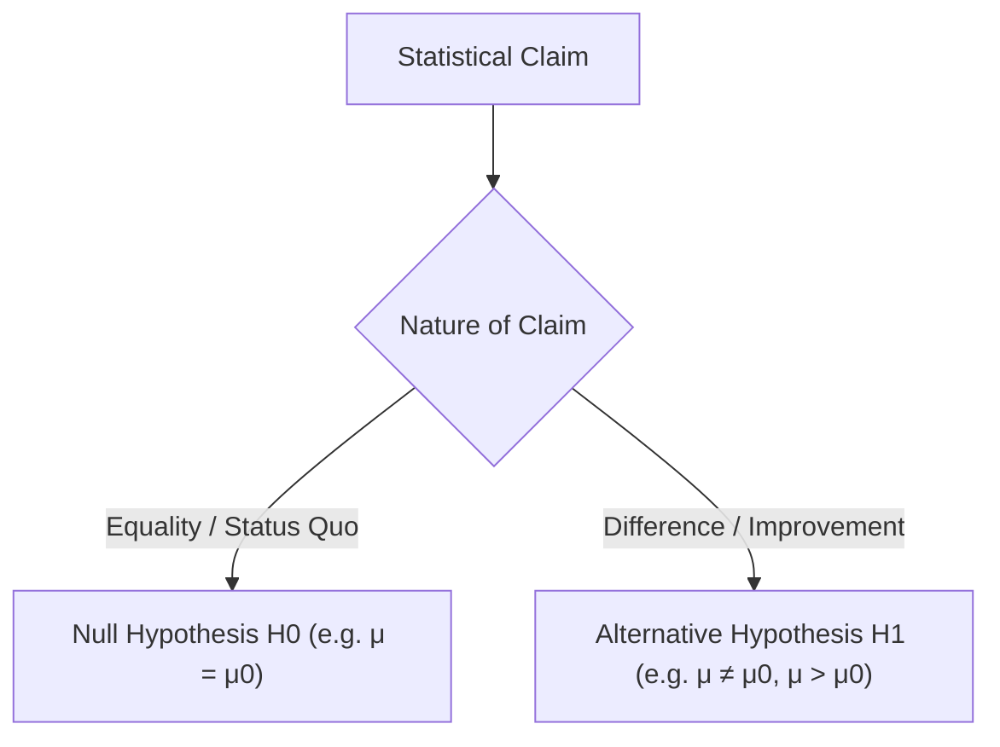
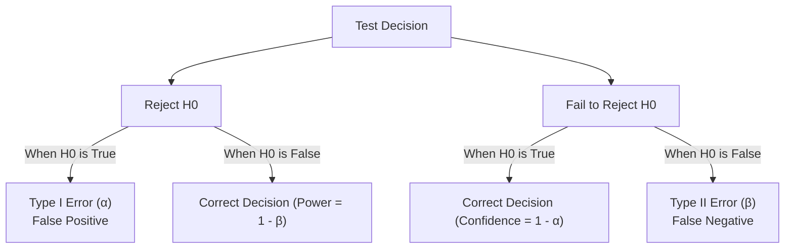
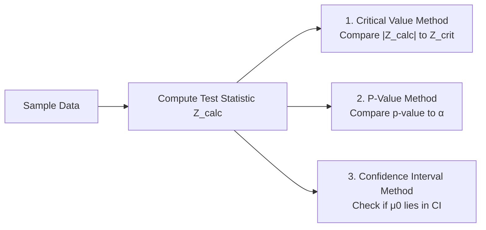

import Tabs from '@theme/Tabs';
import TabItem from '@theme/TabItem';
import Heading from '@theme/Heading';
import React from 'react';

# Hypothesis Testing Foundations

> **Topic -** A hypothesis is a formal, testable claim regarding an unknown population parameter. Hypothesis testing provides an objective statistical protocol to assess whether empirical sample data provides strong enough evidence to refute a baseline status-quo assumption.

---

## 1. Formulating Hypotheses

Hypothesis testing sets up a contest between two contrasting statements:

### The Null Hypothesis ($H_0$)
The hypothesis of **no effect**, **no difference**, or **status quo**. It represents the baseline assumption that is presumed true unless the sample evidence proves overwhelmingly otherwise.
*   Contains an equality condition ($=$, $\ge$, or $\le$).
*   Example: A manufacturing plant claims battery lifespan is 25,500 hours ($H_0: \mu = 25500$).

### The Alternative Hypothesis ($H_1$ or $H_a$)
The **research hypothesis** or claim of interest. It represents the claim that there is a genuine effect, difference, or change.
*   Directly contradicts the null hypothesis.
*   Contains a strict inequality ($\neq$, $<$, or $>$).
*   Example: A consumer watchdog claims the battery lifespan is less than 25,500 hours ($H_1: \mu < 25500$).

---

## 2. The Decision Paradigm: "Fail to Reject" vs. "Accept"

In scientific hypothesis testing, we **never "accept" the null hypothesis**. We either:
1.  **Reject $H_0$:** The sample evidence is sufficiently extreme that the null hypothesis is highly unlikely to be true.
2.  **Fail to Reject $H_0$:** There is insufficient sample evidence to conclude that the null hypothesis is false.

:::tip

**The Legal Analogy: Presumption of Innocence**

In a criminal trial, the defendant is presumed innocent until proven guilty ($H_0$: Innocent, $H_1$: Guilty). If evidence is lacking, the jury returns a verdict of **"Not Guilty"**, not **"Innocent"**. Failing to prove guilt does not prove innocence; it merely reflects an absence of conclusive evidence beyond a reasonable doubt.

:::

---

## 3. Errors in Hypothesis Testing

Because sample statistics fluctuate due to random sampling variability, decisions are subject to two fundamental types of error:

### The Error Matrix

| Reality | Decision: Reject $H_0$ | Decision: Fail to Reject $H_0$ |
| :--- | :--- | :--- |
| **$H_0$ is Actually True** | **Type I Error ($\alpha$)** False Alarm (convicting an innocent person) | **Correct Decision ($1 - \alpha$)** Confidence Level |
| **$H_0$ is Actually False** | **Correct Decision ($1 - \beta$)** Statistical Power | **Type II Error ($\beta$)** Missed Detection (letting a guilty person walk free) |

### Tradeoffs and Error Control
*   $\alpha$ (**Significance Level**): The maximum probability of committing a Type I error that the researcher is willing to tolerate (typically set to $0.05$ or $0.01$).
*   $\beta$: The probability of committing a Type II error.
*   **The Inversion:** For a fixed sample size $n$, lowering $\alpha$ (making it harder to reject $H_0$) automatically increases $\beta$ (increasing the chance of missing a real effect). Both errors cannot be minimized simultaneously without **increasing the sample size $n$**.

### Power of the Test ($1 - \beta$)
The probability of correctly rejecting a false null hypothesis. High power ($> 80\%$) indicates that the test is sensitive enough to detect true effects.

---

## 4. Number of Tails

The mathematical direction in $H_1$ determines the placement of the rejection region under the null sampling distribution:

<Tabs>
  <TabItem value="two" label="Two-Tailed Test (≠)" default>
     
    
    *   **Hypothesis:** $H_0: \mu = \mu_0$ vs. $H_1: \mu \neq \mu_0$
    *   **Rejection Region:** Split equally into both tails ($\alpha / 2$ in each tail).
    *   **Use Case:** Testing whether average output differs in either direction (e.g., machine filling bottles: both underfilling and overfilling are defects).
  </TabItem>
  <TabItem value="left" label="Left-Tailed Test (<)">
     
    
    *   **Hypothesis:** $H_0: \mu \ge \mu_0$ vs. $H_1: \mu < \mu_0$
    *   **Rejection Region:** Entire significance area $\alpha$ is concentrated in the left (lower) tail.
    *   **Use Case:** Testing for reductions (e.g., drug reducing recovery time, algorithm reducing API response latency).
  </TabItem>
  <TabItem value="right" label="Right-Tailed Test (>)">
     
    
    *   **Hypothesis:** $H_0: \mu \le \mu_0$ vs. $H_1: \mu > \mu_0$
    *   **Rejection Region:** Entire significance area $\alpha$ is concentrated in the right (upper) tail.
    *   **Use Case:** Testing for increases (e.g., campaign increasing sales, engine increasing fuel efficiency).
  </TabItem>
</Tabs>

### Formulation Scenarios from Course Material

| Business Scenario | Formulated Hypotheses | Test Type | Tail Placement |
| :--- | :--- | :--- | :--- |
| **Bolt Production:** A company claims that the average number of bolts manufactured daily is 60. | $H_0: \mu = 60$ $H_1: \mu \neq 60$ | **Two-Tailed** | Split equally across both tails ($\alpha / 2$) |
| **Virus Testing Kit:** A new testing kit takes less time than the standard kit that takes 34 hours for results. | $H_0: \mu \ge 34$ $H_1: \mu < 34$ | **Left-Tailed** | Concentrated entirely in the lower tail ($\alpha$) |
| **Stock Outperformance:** An analyst tests whether Apple Inc. stock outperformed in 2019 by more than 13.5%. | $H_0: \mu \le 13.5$ $H_1: \mu > 13.5$ | **Right-Tailed** | Concentrated entirely in the upper tail ($\alpha$) |

### Practice Check: Identifying Test Types

| Objective | Null Hypothesis ($H_0$) | Alternative Hypothesis ($H_1$) | Classification |
| :--- | :--- | :--- | :--- |
| Mean diastolic blood pressure for 85 adults is less than 90 mm | $\mu \ge 90$ | $\mu < 90$ | **Left-Tailed Test** |
| Tensile strength of an alloy is more than 500 Pa | $\mu \le 500$ | $\mu > 500$ | **Right-Tailed Test** |
| Average heart rate of a healthy adult is 85 beats per minute | $\mu = 85$ | $\mu \neq 85$ | **Two-Tailed Test** |
| Yield of BT cotton exceeds 450 kg lint per hectare | $\mu \le 450$ | $\mu > 450$ | **Right-Tailed Test** |

---

## 5. Three Decision-Making Criteria

There are three mathematically equivalent methods for deciding whether to reject $H_0$:

### 1. The Critical Region (Rejection Region) Approach
*   Determine critical cutoff $z_{\text{crit}}$ from the normal distribution table for the chosen $\alpha$.
*   **Two-tailed:** Reject $H_0$ if $|Z_{\text{calc}}| > z_{\alpha/2}$.
*   **Left-tailed:** Reject $H_0$ if $Z_{\text{calc}} < -z_{\alpha}$.
*   **Right-tailed:** Reject $H_0$ if $Z_{\text{calc}} > z_{\alpha}$.

### 2. The P-Value Approach
The **$p$-value** is the probability, assuming $H_0$ is true, of observing a test statistic as extreme as, or more extreme than, the value obtained from our sample.
*   **Decision Rule:**
    $$\text{If } p\text{-value} \le \alpha \implies \text{Reject } H_0$$
    $$\text{If } p\text{-value} > \alpha \implies \text{Fail to Reject } H_0$$
*   *"If the p-value is low, the null must go. If the p-value is high, the null will fly."*

### 3. The Confidence Interval Approach (Two-Tailed Tests)
Construct the $100(1 - \alpha)\%$ confidence interval around the sample mean $\bar{x}$.
*   If the hypothesized population parameter $\mu_0$ **does not lie inside** the confidence interval, **Reject $H_0$** at significance level $\alpha$.
*   If $\mu_0$ falls within the interval, **Fail to Reject $H_0$**.

---

## 6. Synthesis & Review

  

    

      

        <h3>Testing Principles</h3>
      

      

        <ul>
          <li><b>Directionality:</b> Direction of $H_1$ determines the critical tail. $\neq$ yields two tails; $&lt;$ yields left tail; $&gt;$ yields right tail.</li>
          <li><b>Equivalence:</b> The Critical Region, P-value, and Confidence Interval approaches always yield identical statistical decisions for two-tailed tests.</li>
        </ul>
      

    

  

  

    

      

        <h3>Common Traps</h3>
      

      

        <ul>
          <li><b>Never say 'Accept H0':</b> Lack of evidence against the null is not proof of the null.</li>
          <li><b>Do not change tails post-hoc:</b> Formulate $H_0$ and $H_1$ before observing the sample data to avoid p-hacking.</li>
        </ul>
      

    

  

 

:::info

**Key Takeaways**

*   **Alpha ($\alpha$):** The false-positive threshold, set by design prior to experimentation.
*   **P-Value:** A measure of evidence against $H_0$. Smaller $p$-values indicate stronger evidence against the null hypothesis.
*   **Statistical Power ($1 - \beta$):** The ability of an experiment to detect an actual effect when one exists. Higher sample sizes increase power.

:::

**Next Section:** [Large Sample Tests](./03-large-sample-tests.mdx) - implementing one-sample and two-sample Z-tests in Python.
