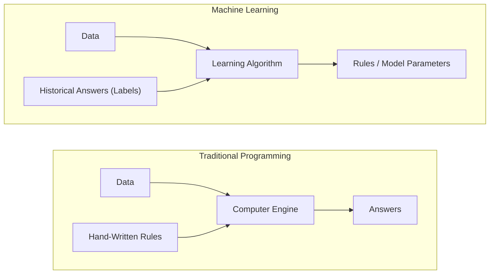

import Tabs from '@theme/Tabs';
import TabItem from '@theme/TabItem';
import React from 'react';

# What is Machine Learning?

> **Topic —** Every subsequent algorithm in machine learning is a specialized *technique*. This page establishes the foundational **argument** for why those techniques exist: there is an entire class of real-world problems that traditional, deterministic programming fundamentally cannot solve.

---

## 1. The Core Concept

In 1959, Arthur Samuel defined machine learning with five load-bearing words:

> **"Machine learning is the field of study that gives computers the ability to learn without being explicitly programmed."**
> - Arthur Samuel, 1959

In 1997, computer scientist Tom Mitchell formalized this into an operational engineering framework:

> **"A computer program is said to learn from experience $E$ with respect to some class of tasks $T$ and performance measure $P$, if its performance at tasks in $T$, as measured by $P$, improves with experience $E$."**
> - Tom Mitchell, 1997

If you cannot identify $T$, $E$, and $P$ for a business problem, it is **not** a machine learning problem yet.

---

## 2. Interactive Mitchell Framework Explorer

Select a domain below to inspect how Task ($T$), Experience ($E$), and Performance Measure ($P$) interact in real-world ML engineering:

export const MitchellFrameworkExplorer = () => {
  const [activeTask, setActiveTask] = React.useState('loan');

  const cases = {
    loan: {
      title: 'Credit Risk: Loan Default Prediction',
      T: 'Predict whether a loan applicant will default (binary classification: 0 = Repaid, 1 = Default).',
      E: 'Historical database of 500,000 past borrowers, including income, credit scores, debt-to-income ratios, and verified repayment outcomes.',
      P: 'Recall on defaulters (capturing risky loans to prevent bank losses) and ROC-AUC score, evaluated on a separate holdout test set.',
      trap: 'Using simple Accuracy as P fails due to class imbalance: if only 2% of applicants default, a dummy model predicting "No Default" achieves 98% accuracy while causing massive financial losses.'
    },
    vision: {
      title: 'Medical Imaging: Malignant Tumor Detection',
      T: 'Segment and classify microscopic biopsy images as benign or malignant tissue.',
      E: 'Dataset of 50,000 pathologically verified MRI and histology scans with pixel-level ground truth masks from expert oncologists.',
      P: 'False Negative Rate (must be near zero) and F2-Score, weighting recall much higher than precision to prevent missing cancer.',
      trap: 'A human cannot explicitly program pixel brightness rules because tumors vary wildly in shape, texture, lighting, and tissue density.'
    },
    car: {
      title: 'Autonomous Robotics: Self-Driving Steering',
      T: 'Steer the vehicle safely along highway lanes while avoiding obstacles and pedestrians.',
      E: 'Millions of hours of video camera streams, LiDAR point clouds, GPS traces, and corresponding human steering wheel angles.',
      P: 'Mean Distance Between Interventions (MDBI) and mean squared error between model steering angle and expert human driver.',
      trap: 'Writing hand-crafted if-statements for every possible street scenario requires billions of permutations and fails immediately in unexpected weather.'
    },
    chess: {
      title: 'Strategic Games: AlphaZero Chess AI',
      T: 'Select the optimal chess move in any legal board configuration to win the game.',
      E: 'Self-play experience generated by simulating 44 million games against itself from scratch using Monte Carlo Tree Search.',
      P: 'Win-rate and ELO rating against world-champion chess engines (e.g. Stockfish).',
      trap: 'Unlike classical chess engines that use hand-tuned board evaluation heuristics, ML learns positional valuation entirely from match outcomes.'
    }
  };

  const current = cases[activeTask];

  return (
    <div style={{ padding: '20px', border: '1px solid var(--ifm-color-emphasis-200)', borderRadius: '8px', backgroundColor: 'rgba(148, 163, 184, 0.05)', margin: '20px 0' }}>
      <h4 style={{ margin: '0 0 12px 0' }}>Tom Mitchell's T-E-P Architecture Explorer</h4>
      <p style={{ margin: '0 0 14px 0', fontSize: '14px' }}>
        Select a machine learning problem to break down its operational components:
      </p>

      <div style={{ display: 'flex', gap: '6px', flexWrap: 'wrap', marginBottom: '16px' }}>
        <button
          onClick={() => setActiveTask('loan')}
          style={{ padding: '5px 12px', borderRadius: '4px', border: '1px solid #3182ce', backgroundColor: activeTask === 'loan' ? '#3182ce' : 'transparent', color: activeTask === 'loan' ? '#fff' : 'var(--ifm-font-color-base)', cursor: 'pointer', fontSize: '12px' }}
        >
          1. Loan Default Prediction
        </button>
        <button
          onClick={() => setActiveTask('vision')}
          style={{ padding: '5px 12px', borderRadius: '4px', border: '1px solid #3182ce', backgroundColor: activeTask === 'vision' ? '#3182ce' : 'transparent', color: activeTask === 'vision' ? '#fff' : 'var(--ifm-font-color-base)', cursor: 'pointer', fontSize: '12px' }}
        >
          2. Medical Tumor Detection
        </button>
        <button
          onClick={() => setActiveTask('car')}
          style={{ padding: '5px 12px', borderRadius: '4px', border: '1px solid #3182ce', backgroundColor: activeTask === 'car' ? '#3182ce' : 'transparent', color: activeTask === 'car' ? '#fff' : 'var(--ifm-font-color-base)', cursor: 'pointer', fontSize: '12px' }}
        >
          3. Self-Driving Vehicle
        </button>
        <button
          onClick={() => setActiveTask('chess')}
          style={{ padding: '5px 12px', borderRadius: '4px', border: '1px solid #3182ce', backgroundColor: activeTask === 'chess' ? '#3182ce' : 'transparent', color: activeTask === 'chess' ? '#fff' : 'var(--ifm-font-color-base)', cursor: 'pointer', fontSize: '12px' }}
        >
          4. AlphaZero Chess AI
        </button>
      </div>

      <div style={{ padding: '16px', borderRadius: '6px', backgroundColor: 'var(--ifm-background-surface-color)', border: '1px solid var(--ifm-color-emphasis-300)' }}>
        <div style={{ fontSize: '16px', fontWeight: 'bold', color: '#3182ce', marginBottom: '12px' }}>
          {current.title}
        </div>

        <div style={{ display: 'grid', gridTemplateColumns: 'repeat(auto-fit, minmax(220px, 1fr))', gap: '12px', marginBottom: '14px' }}>
          <div style={{ padding: '10px 12px', borderRadius: '4px', backgroundColor: 'rgba(49, 130, 206, 0.08)' }}>
            <div style={{ fontSize: '11px', fontWeight: 'bold', textTransform: 'uppercase', color: '#2b6cb0' }}>
              Task (T)
            </div>
            <div style={{ fontSize: '13px', marginTop: '4px' }}>{current.T}</div>
          </div>

          <div style={{ padding: '10px 12px', borderRadius: '4px', backgroundColor: 'rgba(56, 161, 105, 0.08)' }}>
            <div style={{ fontSize: '11px', fontWeight: 'bold', textTransform: 'uppercase', color: '#276749' }}>
              Experience (E)
            </div>
            <div style={{ fontSize: '13px', marginTop: '4px' }}>{current.E}</div>
          </div>

          <div style={{ padding: '10px 12px', borderRadius: '4px', backgroundColor: 'rgba(128, 90, 213, 0.08)' }}>
            <div style={{ fontSize: '11px', fontWeight: 'bold', textTransform: 'uppercase', color: '#6b46c1' }}>
              Performance Measure (P)
            </div>
            <div style={{ fontSize: '13px', marginTop: '4px' }}>{current.P}</div>
          </div>
        </div>

        <div style={{ padding: '10px 14px', borderRadius: '4px', backgroundColor: 'rgba(221, 107, 32, 0.08)', borderLeft: '4px solid #dd6b20', fontSize: '13px' }}>
          <b>Engineering Nuance:</b> {current.trap}
        </div>
      </div>
    </div>
  );
};

<MitchellFrameworkExplorer />

---

## 3. The Collapse of Explicit Programming

In **traditional programming**, a human developer dictates explicit conditional instructions for every possible branch:

```python
def calculate(a, b, op):
    if op == "+": return a + b
    if op == "-": return a - b
    if op == "*": return a * b
    if op == "/": return a / b
```

This works cleanly because:
1.  The mathematical rules were completely known **before** writing the code.
2.  The input cases are finite and countable (only 4 operations).
3.  A human can state each rule precisely in a single line.

However, consider distinguishing between **cats and dogs** from photos.

### The Rule-Based Failure
If you attempt to write explicit if-else rules based on physical features:

```python
def what_animal(has_wings, num_legs, weight_kg):
    if has_wings:
        return "bird"
    if num_legs == 4 and weight_kg < 10:   # Human intuition: "small = cat"
        return "cat"
    if num_legs == 4 and weight_kg >= 10:  # Human intuition: "large = dog"
        return "dog"
    return "unknown"
```

This explicit system breaks immediately for three compounding reasons:
1.  **Combinatorial Explosion:** Each additional feature multiplies the required rule combinations exponentially ($k^d$).
2.  **Sample-Dependent Thresholds:** The `10 kg` threshold is an arbitrary human guess. The moment a **Chihuahua** ($2.5\text{ kg}$, dog) or **Maine Coon** ($12\text{ kg}$, cat) arrives, the rules produce complete misclassifications.
3.  **Zero Generalization:** Real-world distributions drift continuously. In traditional programming, every new outlier becomes a fresh bug report requiring endless manual rule patching.

---

## 4. Interactive Combinatorial Explosion Calculator

See how quickly manual rule-writing collapses as you add features and possible values:

export const CombinatorialExplosionVisualizer = () => {
  const [numFeatures, setNumFeatures] = React.useState(6);
  const [statesPerFeature, setStatesPerFeature] = React.useState(3);

  const totalRules = Math.pow(statesPerFeature, numFeatures);
  const humanDailyCapacity = 20; // rules written per day
  const daysToCode = Math.ceil(totalRules / humanDailyCapacity);

  return (
    <div style={{ padding: '20px', border: '1px solid var(--ifm-color-emphasis-200)', borderRadius: '8px', backgroundColor: 'rgba(148, 163, 184, 0.05)', margin: '20px 0' }}>
      <h4 style={{ margin: '0 0 12px 0' }}>The Combinatorial Explosion Calculator</h4>
      <p style={{ margin: '0 0 14px 0', fontSize: '14px' }}>
        Adjust feature counts to observe exponential growth in required manual rules:
      </p>

      <div style={{ display: 'grid', gridTemplateColumns: '1fr 1fr', gap: '16px', marginBottom: '16px' }}>
        <div>
          <label style={{ fontSize: '12px', fontWeight: 'bold' }}>
            Number of Features (d): {numFeatures}
          </label>
          <input
            type="range"
            min="2"
            max="10"
            value={numFeatures}
            onChange={(e) => setNumFeatures(parseInt(e.target.value))}
            style={{ width: '100%', marginTop: '4px' }}
          />
        </div>
        <div>
          <label style={{ fontSize: '12px', fontWeight: 'bold' }}>
            States per Feature (k): {statesPerFeature}
          </label>
          <input
            type="range"
            min="2"
            max="4"
            value={statesPerFeature}
            onChange={(e) => setStatesPerFeature(parseInt(e.target.value))}
            style={{ width: '100%', marginTop: '4px' }}
          />
        </div>
      </div>

      <div style={{ padding: '16px', borderRadius: '6px', backgroundColor: 'var(--ifm-background-surface-color)', border: '1px solid var(--ifm-color-emphasis-300)' }}>
        <div style={{ display: 'flex', justifyContent: 'space-between', alignItems: 'center', flexWrap: 'wrap', gap: '10px' }}>
          <div>
            <div style={{ fontSize: '11px', color: 'var(--ifm-color-emphasis-600)', textTransform: 'uppercase', fontWeight: 'bold' }}>
              Formula: k^d Combinations
            </div>
            <div style={{ fontSize: '24px', fontWeight: 'bold', color: totalRules > 1000 ? '#e53e3e' : '#3182ce', fontFamily: 'monospace' }}>
              {statesPerFeature}^{numFeatures} = {totalRules.toLocaleString()} Rules
            </div>
          </div>
          <div style={{ textAlign: 'right' }}>
            <span style={{ fontSize: '12px', color: 'var(--ifm-color-emphasis-600)' }}>Human Dev Writing Time:</span>
            <div style={{ fontSize: '18px', fontWeight: 'bold', color: daysToCode > 30 ? '#e53e3e' : '#38a169' }}>
              {daysToCode > 365 ? (daysToCode / 365).toFixed(1) + ' Years' : daysToCode + ' Days'}
            </div>
          </div>
        </div>

        <div style={{ marginTop: '12px', height: '10px', width: '100%', backgroundColor: 'rgba(148, 163, 184, 0.2)', borderRadius: '5px', overflow: 'hidden' }}>
          <div
            style={{
              height: '100%',
              width: `${Math.min(100, (totalRules / 50000) * 100)}%`,
              backgroundColor: totalRules > 5000 ? '#e53e3e' : '#3182ce',
              transition: 'width 0.3s ease'
            }}
          />
        </div>
      </div>

      <p style={{ margin: '12px 0 0 0', fontSize: '13px' }}>
        <b>The Core Bottleneck:</b> Human rule-writing capacity scales linearly ($O(d)$), while the problem state-space expands exponentially ($O(k^d)$). You cannot out-hire an exponential curve.
      </p>
    </div>
  );
};

<CombinatorialExplosionVisualizer />

---

## 5. The Paradigm Inversion

Machine learning resolves the combinatorial collapse by **inverting the inputs and outputs of software**:



| Dimension | Traditional Programming | Machine Learning |
| :--- | :--- | :--- |
| **Human Developer Supplies** | **The Rules** (Explicit logic) | **The Examples** (Data + Labels) |
| **Input to Computer** | Rules + Data | Data + Answers |
| **Output Produced** | Answers | **The Rules** (Statistical Model Parameters) |
| **Handling New Variations** | Manually rewrite or patch if-statements | Ingest more data and re-train |
| **Decision Boundaries** | Guessed by human intuition | Mathematically derived from covariance |

### The Cat-and-Dog Verification
When a Decision Tree was trained on real animal data with 5 features (`has_wings`, `legs`, `weight`, `snout`, `retractable_claws`), it completely ignored `weight`:

```text title="Model Output"
|--- retractable_claws <= 0.50
|   |--- has_wings <= 0.50
|   |   |--- class: dog
|   |--- has_wings >  0.50
|   |   |--- class: bird
|--- retractable_claws >  0.50
|   |--- class: cat
```

The algorithm autonomously discovered that `retractable_claws` cleanly separates cats from dogs with $100\%$ accuracy, completely avoiding the human's fragile weight threshold error on Chihuahuas and Maine Coons.

---

## 6. AI vs. ML vs. DL Taxonomy

The terms AI, Machine Learning, and Deep Learning are not interchangeable; they form a strictly nested taxonomy:

<div style={{
  border: '2px dashed var(--ifm-color-emphasis-300)',
  borderRadius: '8px',
  padding: '20px',
  backgroundColor: 'rgba(148, 163, 184, 0.05)',
  marginBottom: '20px'
}}>
  <h4 style={{ margin: '0 0 8px 0', color: 'var(--ifm-color-primary)' }}>Artificial Intelligence (Broadest Umbrella)</h4>
  <div style={{ fontSize: '13px', margin: '0 0 14px 0', opacity: 0.9 }}>
    Any computational system exhibiting autonomous, goal-directed behavior without direct real-time human intervention (includes classical search heuristics, minimax game trees, and rule-based expert systems).
  </div>
  
  <div style={{
    border: '2px solid #3182ce',
    borderRadius: '8px',
    padding: '16px',
    backgroundColor: 'rgba(49, 130, 206, 0.05)',
    marginBottom: '10px'
  }}>
    <h4 style={{ margin: '0 0 8px 0', color: '#3182ce' }}>Machine Learning (Statistical Subset)</h4>
    <div style={{ fontSize: '13px', margin: '0 0 14px 0', opacity: 0.9 }}>
      Systems that learn decision boundaries and continuous functions directly from empirical data ($E$) using statistical algorithms (e.g. Linear Models, Decision Trees, SVMs, Random Forests).
    </div>
    
    <div style={{
      border: '2px solid #319795',
      borderRadius: '8px',
      padding: '16px',
      backgroundColor: 'rgba(49, 151, 149, 0.05)'
    }}>
      <h4 style={{ margin: '0 0 8px 0', color: '#319795' }}>Deep Learning (Hierarchical Representation Subset)</h4>
      <div style={{ fontSize: '13px', margin: '0', opacity: 0.9 }}>
        Multi-layered neural architectures (Transformers, CNNs, Diffusion models) that automatically extract raw hierarchical representations from unstructured data (audio, raw pixels, natural language tokens).
      </div>
    </div>
  </div>
</div>

| Attribute | Artificial Intelligence (AI) | Machine Learning (ML) | Deep Learning (DL) |
| :--- | :--- | :--- | :--- |
| **Hierarchical Scope** | The entire encompassing field | **Strict subset of AI** | **Strict subset of ML** |
| **Requires Learning?** | **No** (Rule engines, Minimax are AI) | **Yes** (Statistical optimization) | **Yes** (Backpropagation in neural networks) |
| **Feature Engineering** | Manual specification | Usually required (Tabular features) | **Autonomous representation learning** |
| **Sample Efficiency** | N/A (Rules are deterministic) | Effective on small/medium tabular datasets | Requires massive scale ($10^5$ to $10^{11}$ samples) |
| **Handbook Focus** | General context | **Core engineering curriculum** | Advanced specialized extension |

---

## 7. Implementation Lab

:::tip

**Lab Exercise: Rules vs. Learning Contest**

An interactive, fully functional Google Colab / Jupyter Notebook is available to evaluate the rule-based approach against an autonomous Decision Tree classifier using real animal measurements live in your browser.

<a href="https://colab.research.google.com/github/vettrivel-kl/vettrivel-kl.github.io/blob/master/static/labs/01-foundations/rules_vs_learning.ipynb" target="_blank" rel="noopener noreferrer">
  
</a>

**How to run the lab:**
1. Click the **"Open In Colab"** badge above to launch the interactive notebook.
2. Run cells sequentially to benchmark hand-crafted thresholds against Scikit-Learn's `DecisionTreeClassifier`.

**Key Experiments to Run:**
*   **Experiment 1 (The Chihuahua/Maine Coon Test):** Run the handwritten rule set on the test set and observe accuracy drop to $50\%$ on outlier weights.
*   **Experiment 2 (Inspect Learned Features):** Print `tree.feature_importances_` to verify that the decision tree completely ignored `weight_kg` and selected `retractable_claws` instead.
*   **Experiment 3 (Feature Ablation):** Remove `retractable_claws` from the training data and retrain to observe the tree fall back to weight thresholds and reproduce human error.

:::

---

## 8. Common Mistakes

<Tabs>
  <TabItem value="m1" label="1. Does ML Write Programming Code?" default>
    <br/>
    
    *   **The Misconception:** *"Machine Learning means the computer writes Python code to solve the problem."*
    *   **Wrong Thinking:** Expecting a model to generate `.py` files or readable procedural scripts.
    *   **The Right Principle:** The model fits **numeric weight parameters** and matrix operations inside a fixed mathematical architecture chosen by the engineer.
  </TabItem>
  <TabItem value="m2" label="2. Using ML When Rules Are Known">
    <br/>
    
    *   **The Misconception:** *"ML is newer and more advanced, so we should build our tax calculator and password validator with ML."*
    *   **Wrong Thinking:** Introducing statistical probabilities to problems governed by exact, countable, static laws.
    *   **The Right Principle:** If the rules are 100% known and countable, **write standard code**. ML introduces stochastic error and should only be used when rules are impossible to write manually.
  </TabItem>
  <TabItem value="m3" label="3. More Features Always Equals Better Models">
    <br/>
    
    *   **The Misconception:** *"Adding 50 more columns to our dataset will always improve predictive accuracy."*
    *   **Wrong Thinking:** Dumping uncleaned, collinear features into a model.
    *   **The Right Principle:** Features multiply the dimension of the space exponentially ($k^d$), causing the **curse of dimensionality** and severe overfitting unless balanced by exponential sample size ($E$).
  </TabItem>
  <TabItem value="m4" label="4. Confusing AI with Statistical Learning">
    <br/>
    
    *   **The Misconception:** *"If a system does not use neural networks or statistical training, it cannot be called AI."*
    *   **Wrong Thinking:** Restricting AI to learning systems only.
    *   **The Right Principle:** AI encompasses all autonomous software. A classical chess program using Minimax search trees and hardcoded heuristics is genuine AI, even though it contains zero machine learning.
  </TabItem>
</Tabs>

---

## 9. Summary

<div className="row">
  <div className="col col--6">
    <div className="card" style={{ height: '100%', marginBottom: '15px' }}>
      <div className="card__header">
        <h3>Foundational Definitions</h3>
      </div>
      <div className="card__body">
        <ul>
          <li><b>Arthur Samuel (1959):</b> Learning without being explicitly programmed.</li>
          <li><b>Tom Mitchell (1997):</b> Performance at task $T$, measured by metric $P$, improves with experience $E$.</li>
          <li><b>The Inversion:</b> In ML, rules are the <b>output</b>, not the input.</li>
        </ul>
      </div>
    </div>
  </div>
  <div className="col col--6">
    <div className="card" style={{ height: '100%', marginBottom: '15px' }}>
      <div className="card__header">
        <h3>Why Explicit Rules Collapsed</h3>
      </div>
      <div className="card__body">
        <ul>
          <li><b>Combinatorial Explosion:</b> Rule count scales as $k^d$, easily outpacing human coding ability.</li>
          <li><b>Fragile Thresholds:</b> Hand-coded boundaries fail on unseen edge cases (Chihuahuas, Maine Coons).</li>
          <li><b>Drift and Maintenance:</b> Real-world data shifts continuously, rendering static rules obsolete.</li>
        </ul>
      </div>
    </div>
  </div>
</div>

<br/>

:::info

**Key Takeaways**

*   **The Inversion:** Traditional programming runs on hand-written rules; Machine Learning generates mathematical rules and weights autonomously from data.
*   **Mitchell's Trinity:** Always define Task ($T$), Experience ($E$), and Performance ($P$) before beginning any ML project.
*   **Nested Hierarchy:** $DL \subset ML \subset AI$. Deep learning learns features hierarchically; machine learning fits statistical boundaries; AI includes all autonomous systems.

:::

**Next Section:** [Applications and Techniques](./02-applications-and-techniques.mdx) - mapping real-world business problems to regression, classification, clustering, and dimensionality reduction.

---

## 10. Active Recall

*Test your understanding by answering first, then clicking to reveal the underlying principles.*

### Interactive Checkpoint Quiz

export const FoundationQuiz = () => {
  const [selected, setSelected] = React.useState(null);
  return (
    <div style={{ padding: '20px', border: '1px solid var(--ifm-color-emphasis-200)', borderRadius: '8px', backgroundColor: 'rgba(148, 163, 184, 0.05)', margin: '20px 0' }}>
      <h4 style={{ margin: '0 0 10px 0' }}>Interactive Checkpoint: The Paradigm Inversion</h4>
      <p style={{ margin: '0 0 15px 0' }}>In machine learning, what are the primary <b>inputs</b> provided to the learning algorithm?</p>
      <div style={{ display: 'flex', gap: '10px', flexWrap: 'wrap' }}>
        <button onClick={() => setSelected('opt1')} style={{ padding: '8px 16px', borderRadius: '4px', border: '1px solid #3182ce', backgroundColor: selected === 'opt1' ? '#e53e3e' : 'transparent', color: selected === 'opt1' ? '#fff' : 'var(--ifm-font-color-base)', cursor: 'pointer', transition: '0.2s' }}>Data + Hand-Written Rules</button>
        <button onClick={() => setSelected('opt2')} style={{ padding: '8px 16px', borderRadius: '4px', border: '1px solid #3182ce', backgroundColor: selected === 'opt2' ? '#38a169' : 'transparent', color: selected === 'opt2' ? '#fff' : 'var(--ifm-font-color-base)', cursor: 'pointer', transition: '0.2s' }}>Data + Historical Answers (Labels)</button>
        <button onClick={() => setSelected('opt3')} style={{ padding: '8px 16px', borderRadius: '4px', border: '1px solid #3182ce', backgroundColor: selected === 'opt3' ? '#e53e3e' : 'transparent', color: selected === 'opt3' ? '#fff' : 'var(--ifm-font-color-base)', cursor: 'pointer', transition: '0.2s' }}>Hand-Written Rules + Performance Metrics</button>
      </div>
      {selected === 'opt1' && <p style={{ color: '#e53e3e', marginTop: '15px', fontWeight: 'bold', fontSize: '14px', marginBottom: '0' }}>Incorrect. Supplying Data + Rules is the definition of Traditional Programming, which outputs Answers. Try again!</p>}
      {selected === 'opt2' && <p style={{ color: '#38a169', marginTop: '15px', fontWeight: 'bold', fontSize: '14px', marginBottom: '0' }}>Correct! In machine learning, the human provides empirical Data + historical Answers (labels). The algorithm processes them to output the Rules (the statistical model weights and decision boundaries)!</p>}
      {selected === 'opt3' && <p style={{ color: '#e53e3e', marginTop: '15px', fontWeight: 'bold', fontSize: '14px', marginBottom: '0' }}>Incorrect. Machine learning eliminates the requirement for hand-written rules. Try again!</p>}
    </div>
  );
};

<FoundationQuiz />

### Review Flashcards

<details>
  <summary><b>1. [THEORY] Mitchell's definition identifies T, E, and P. Formulate these three for an automated credit card fraud detector.</b></summary>
  <div className="answer-content">
    <br/>
    
    *   **Task ($T$):** Classify individual incoming credit card transactions in real time as legitimate or fraudulent ($0$ or $1$).
    *   **Experience ($E$):** A historical database of credit card transactions containing transaction amounts, merchant IDs, geo-locations, cardholder purchase frequency, and verified fraud chargebacks.
    *   **Performance Measure ($P$):** Precision-Recall AUC (PR-AUC) or Recall at a fixed low False Positive Rate (e.g. capturing $95\%$ of fraud while flagging less than $0.1\%$ of legitimate transactions).
  </div>
</details>

<details>
  <summary><b>2. [MATH] Why does adding a 7th feature to a dataset with 3 values per feature cause a combinatorial explosion for rule-based systems?</b></summary>
  <div className="answer-content">
    <br/>
    
    *   With $6$ features taking $3$ states, the required state-space of rules is:
        $$3^6 = 729 \text{ combinations}$$
    *   Adding a 7th feature multiplies the entire state space by $3$:
        $$3^7 = 2,187 \text{ combinations}$$
    *   While human developer rule-writing capacity scales **linearly** ($O(d)$), the required rule combinations scale **exponentially** ($O(k^d)$).
  </div>
</details>

<details>
  <summary><b>3. [THEORY] Why is a rule-based expert system or Minimax chess engine considered AI, even if it contains no Machine Learning?</b></summary>
  <div className="answer-content">
    <br/>
    
    *   **Artificial Intelligence** is the broad encompassing category of any computing system that performs autonomous, goal-directed tasks without direct human intervention.
    *   A Minimax search engine autonomously evaluates chess positions and chooses optimal strategic moves. It exhibits autonomous decision-making without learning from data ($E$), satisfying the definition of AI.
  </div>
</details>

<details>
  <summary><b>4. [PRACTICE] Why did the Decision Tree in our lab ignore body weight and choose `retractable_claws` instead?</b></summary>
  <div className="answer-content">
    <br/>
    
    *   **Human Cognitive Bias:** Humans pick obvious continuous attributes like `weight_kg` based on intuition ("dogs are heavy, cats are light").
    *   **Covariance and Invariance:** The decision tree evaluates the mathematical information gain of every feature across all training samples. It discovered that while heavy cats (Maine Coons) and light dogs (Chihuahuas) violate weight boundaries, `retractable_claws` provided an invariant biological separator ($100\%$ pure split).
  </div>
</details>

<details>
  <summary><b>5. [ANALYZE] Name two software applications where Machine Learning should NEVER be used, and explain why.</b></summary>
  <div className="answer-content">
    <br/>
    
    1.  **Salary & Tax Calculations:** Tax laws and mathematical addition are exact, static, and deterministic. Using a statistical model introduces probabilistic approximation errors to a problem requiring $100\%$ precision.
    2.  **Cryptographic Password Verification:** Passwords require exact byte-level matching. An ML model would predict a probability of a match, introducing false positives that compromise security.
  </div>
</details>
