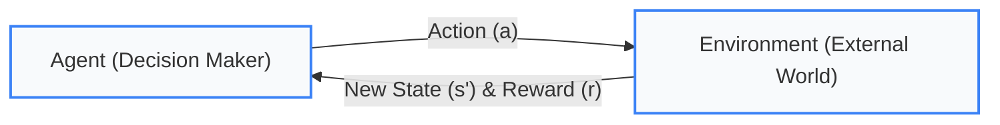

import Tabs from '@theme/Tabs';
import TabItem from '@theme/TabItem';
import React from 'react';

# Reinforcement Learning

> **Topic -** Supervised, unsupervised, and semi-supervised learning all begin with an existing table of data. Reinforcement learning begins with **no dataset at all**. An autonomous agent actively interacts with an external environment, collects numerical feedback, and learns optimal sequential behavior through trial and error.

This architectural shift fundamentally redefines what training data means: the dataset is generated dynamically by the agent's own actions.

---

## 1. The Core Concept

Reinforcement learning is a feedback-based learning paradigm in which an agent learns to make optimal decisions in an environment by performing actions and observing the resulting rewards or penalties.

*   **Positive Feedback (Reward):** Encourages the agent to reinforce and repeat the chosen behavior.
*   **Negative Feedback (Penalty):** Discourages the agent from selecting that action in similar situations.
*   **Zero Ground Truth Labels:** The agent is never told the correct action. It is only informed, after taking an action, of the numerical score it collected. It must work backwards from scalar feedback to deduce an optimal strategy.

**The ultimate goal of the agent is to maximize its cumulative positive reward (total return) over time.**

### Core Vocabulary

Reinforcement learning operates on a formal mathematical vocabulary where terms carry exact technical definitions:

| Term | Technical Meaning | In the 4x4 Gridworld Simulation |
|---|---|---|
| **Agent** | The decision-making entity and learner | The autonomous navigation algorithm |
| **Environment** | The external system the agent interacts with | The 4x4 maze, walls, and state transition rules |
| **State ($s$)** | The instantaneous observation or configuration | The current coordinate $(x, y)$ occupied on the grid |
| **Action ($a$)** | A discrete or continuous decision available | Movement: `Up`, `Down`, `Left`, or `Right` |
| **Reward ($r$)** | Scalar feedback returned by the environment | `+10` jackpot, `+2` small prize, `−10` pit, `−1` per step |
| **Policy ($\pi$)** | Strategy mapping situations to actions: $\pi(s) \to a$ | The complete navigation map across all 16 cells |
| **Episode** | One full trial from start to a terminal state | Navigation run until hitting the goal, a pit, or 100 steps |
| **Return ($G$)** | Cumulative discounted reward accumulated in an episode | $G_t = \sum_{k=0}^{\infty} \gamma^k r_{t+k+1}$ |
| **Value ($V$ or $Q$)** | Expected long-term return from a state or state-action pair | How promising a specific square or action is long-term |

The **policy** ($\pi$) is the actual output of reinforcement learning. Where supervised learning produces a model mapping features to static predictions, reinforcement learning produces a policy mapping environmental states to sequential behaviors.

---

export const RLTerminologyQuiz = () => {
  const [q1, setQ1] = React.useState(null);
  const [q2, setQ2] = React.useState(null);
  const [q3, setQ3] = React.useState(null);
  return (
    <div style={{ padding: '20px', border: '1px solid var(--ifm-color-emphasis-200)', borderRadius: '8px', backgroundColor: 'rgba(148, 163, 184, 0.05)', margin: '20px 0' }}>
      <h4 style={{ margin: '0 0 15px 0' }}>Interactive Checkpoint: Reinforcement Learning Terminology</h4>
      
      <div style={{ marginBottom: '20px' }}>
        <p style={{ margin: '0 0 10px 0' }}><b>Scenario 1:</b> An autonomous vehicle central computer decides to <i>"Apply maximum braking pressure"</i> after detecting an obstacle. What core RL component does this decision represent?</p>
        <div style={{ display: 'flex', gap: '10px', flexWrap: 'wrap' }}>
          <button onClick={() => setQ1('state')} style={{ padding: '6px 14px', borderRadius: '4px', border: '1px solid #3182ce', backgroundColor: q1 === 'state' ? '#e53e3e' : 'transparent', color: q1 === 'state' ? '#fff' : 'var(--ifm-font-color-base)', cursor: 'pointer', transition: '0.2s' }}>State</button>
          <button onClick={() => setQ1('action')} style={{ padding: '6px 14px', borderRadius: '4px', border: '1px solid #3182ce', backgroundColor: q1 === 'action' ? '#38a169' : 'transparent', color: q1 === 'action' ? '#fff' : 'var(--ifm-font-color-base)', cursor: 'pointer', transition: '0.2s' }}>Action</button>
          <button onClick={() => setQ1('policy')} style={{ padding: '6px 14px', borderRadius: '4px', border: '1px solid #3182ce', backgroundColor: q1 === 'policy' ? '#e53e3e' : 'transparent', color: q1 === 'policy' ? '#fff' : 'var(--ifm-font-color-base)', cursor: 'pointer', transition: '0.2s' }}>Policy</button>
          <button onClick={() => setQ1('reward')} style={{ padding: '6px 14px', borderRadius: '4px', border: '1px solid #3182ce', backgroundColor: q1 === 'reward' ? '#e53e3e' : 'transparent', color: q1 === 'reward' ? '#fff' : 'var(--ifm-font-color-base)', cursor: 'pointer', transition: '0.2s' }}>Reward</button>
        </div>
        {q1 === 'action' && <p style={{ color: '#38a169', marginTop: '10px', fontSize: '14px', fontWeight: 'bold' }}>Correct! Applying brakes is a physical choice executed by the agent, representing an Action.</p>}
        {q1 && q1 !== 'action' && <p style={{ color: '#e53e3e', marginTop: '10px', fontSize: '14px', fontWeight: 'bold' }}>Incorrect. Consider the physical commands or outputs the agent issues to influence the external world.</p>}
      </div>

      <div style={{ marginBottom: '20px' }}>
        <p style={{ margin: '0 0 10px 0' }}><b>Scenario 2:</b> The vehicle sensors report: <i>"Object detected at 10 meters, speed is 50 km/h, road is wet"</i>. What component does this represent?</p>
        <div style={{ display: 'flex', gap: '10px', flexWrap: 'wrap' }}>
          <button onClick={() => setQ2('state')} style={{ padding: '6px 14px', borderRadius: '4px', border: '1px solid #3182ce', backgroundColor: q2 === 'state' ? '#38a169' : 'transparent', color: q2 === 'state' ? '#fff' : 'var(--ifm-font-color-base)', cursor: 'pointer', transition: '0.2s' }}>State</button>
          <button onClick={() => setQ2('environment')} style={{ padding: '6px 14px', borderRadius: '4px', border: '1px solid #3182ce', backgroundColor: q2 === 'environment' ? '#e53e3e' : 'transparent', color: q2 === 'environment' ? '#fff' : 'var(--ifm-font-color-base)', cursor: 'pointer', transition: '0.2s' }}>Environment</button>
          <button onClick={() => setQ2('agent')} style={{ padding: '6px 14px', borderRadius: '4px', border: '1px solid #3182ce', backgroundColor: q2 === 'agent' ? '#e53e3e' : 'transparent', color: q2 === 'agent' ? '#fff' : 'var(--ifm-font-color-base)', cursor: 'pointer', transition: '0.2s' }}>Agent</button>
        </div>
        {q2 === 'state' && <p style={{ color: '#38a169', marginTop: '10px', fontSize: '14px', fontWeight: 'bold' }}>Correct! The instantaneous sensor configuration describing the current situation is the State.</p>}
        {q2 && q2 !== 'state' && <p style={{ color: '#e53e3e', marginTop: '10px', fontSize: '14px', fontWeight: 'bold' }}>Incorrect. While these objects exist in the external environment, the numerical snapshot observed by the agent is its State.</p>}
      </div>

      <div>
        <p style={{ margin: '0 0 10px 0' }}><b>Scenario 3:</b> The overall driving software that maps any arbitrary sensor input into steering, throttling, and braking commands represents the:</p>
        <div style={{ display: 'flex', gap: '10px', flexWrap: 'wrap' }}>
          <button onClick={() => setQ3('policy')} style={{ padding: '6px 14px', borderRadius: '4px', border: '1px solid #3182ce', backgroundColor: q3 === 'policy' ? '#38a169' : 'transparent', color: q3 === 'policy' ? '#fff' : 'var(--ifm-font-color-base)', cursor: 'pointer', transition: '0.2s' }}>Policy</button>
          <button onClick={() => setQ3('value')} style={{ padding: '6px 14px', borderRadius: '4px', border: '1px solid #3182ce', backgroundColor: q3 === 'value' ? '#e53e3e' : 'transparent', color: q3 === 'value' ? '#fff' : 'var(--ifm-font-color-base)', cursor: 'pointer', transition: '0.2s' }}>Value Function</button>
          <button onClick={() => setQ3('episode')} style={{ padding: '6px 14px', borderRadius: '4px', border: '1px solid #3182ce', backgroundColor: q3 === 'episode' ? '#e53e3e' : 'transparent', color: q3 === 'episode' ? '#fff' : 'var(--ifm-font-color-base)', cursor: 'pointer', transition: '0.2s' }}>Episode</button>
        </div>
        {q3 === 'policy' && <p style={{ color: '#38a169', marginTop: '10px', fontSize: '14px', fontWeight: 'bold' }}>Correct! The Policy is the strategy function mapping states to behavioral actions.</p>}
        {q3 && q3 !== 'policy' && <p style={{ color: '#e53e3e', marginTop: '10px', fontSize: '14px', fontWeight: 'bold' }}>Incorrect. The complete mapping function from situations to actions is the Policy.</p>}
      </div>
    </div>
  );
};

<RLTerminologyQuiz />

---

## 2. The Agent-Environment Loop

Every reinforcement learning problem operates through a continuous, closed-loop cycle of observation, action, and evaluation:



### The Two Primary Algorithmic Challenges

Two structural realities distinguish reinforcement learning from standard machine learning:

1.  **Actions Alter Future Data Distributions:** In supervised learning, the dataset is stationary and fixed before training begins. In reinforcement learning, the agent's actions dictate which states it visits next. If an early policy is poor, the agent wanders exclusively through low-reward states, never discovering high-value regions. The training distribution is non-stationary and coupled to the policy being learned.
2.  **Delayed Feedback & Credit Assignment:** Rewards are rarely immediate. An opening move in chess may determine a victory forty turns later, but the game-winning reward (`+1`) arrives only at checkmate. Apportioning credit or blame to intermediate actions taken long before the terminal state is called the **Credit Assignment Problem**.

### Comparative Paradigm Breakdown

| Dimension | Supervised | Unsupervised | Semi-Supervised | Reinforcement |
|---|---|---|---|---|
| **Training Data** | Pre-existing labelled rows $(X, y)$ | Pre-existing unlabelled rows $(X)$ | Both labelled and unlabelled | **No dataset: generated via active trial** |
| **Feedback Type** | Explicit target answers | No feedback | Partial target answers | **Evaluative scalar reward ($r$), not an answer** |
| **Told What is Right?** | Yes | Never | Sometimes | **No - only told how good or bad an action was** |
| **Data Distribution** | Fixed prior to training | Fixed prior to training | Fixed prior to training | **Dynamic: determined by the policy actions** |
| **Core Objective** | Minimize prediction loss | Discover latent clusters/patterns | Generalize with sparse labels | **Maximize cumulative return ($G_t$)** |
| **Learned Artifact** | Predictive model ($\hat{y} = f(X)$) | Cluster or density structure | Semi-supervised classifier | **Behavioral policy ($\pi: s \to a$)** |

:::note

**A Reward is Not a Label, and it is Not Nothing**

*   **Supervised learning** is told: *"The true answer was Malignant."*
*   **Unsupervised learning** is told: Nothing at all.
*   **Reinforcement learning** is told: *"Taking that step earned you a score of -1."*

A reward evaluates **how well the agent performed**, but never reveals **what the agent should have done instead**. Evaluating action A yields zero information about alternative actions B or C. The agent is forced to actively explore unknown alternatives to discover superior policies.

:::

---

## 3. Mathematical Formulation: Q-Learning

To solve the credit assignment problem and determine optimal policies, reinforcement learning algorithms estimate the **Action-Value Function** $Q(s, a)$, representing the expected cumulative reward of taking action $a$ in state $s$ and following policy $\pi$ thereafter.

In tabular **Q-Learning**, updates follow the **Bellman Optimality Equation**:

$$Q(s, a) \leftarrow Q(s, a) + \alpha \left[ r + \gamma \max_{a'} Q(s', a') - Q(s, a) \right]$$

### Mathematical Decomposition

Click through the tabs below to dissect the components of the Bellman update rule:

<Tabs>
  <TabItem value="current" label="1. Current Estimate Q(s, a)" default>
    <br/>

    *   **What it represents:** The current stored expectation of the total reward achievable by executing action $a$ in state $s$.
    *   **Algorithmic Role:** Acts as the baseline anchor. When the table is initialized, these values are typically set to zero.
  </TabItem>
  <TabItem value="alpha" label="2. Learning Rate (α)">
    <br/>

    *   **What it represents:** The step size parameter ($\alpha \in (0, 1]$) determining how aggressively new empirical observations overwrite prior beliefs.
    *   **Algorithmic Role:** Setting $\alpha = 0.1$ ensures stable, gradual updates in stochastic environments. Setting $\alpha = 1.0$ completely replaces the old estimate with the most recent experience.
  </TabItem>
  <TabItem value="target" label="3. TD Target (r + γ max Q)">
    <br/>

    *   **What it represents:** The **Temporal Difference (TD) Target** — the immediate reward $r$ observed, plus the discounted value of the best possible action in the subsequent state $s'$.
    *   **Algorithmic Role:** Provides the newly observed reality. Because it uses the agent's own estimates to update itself, Q-learning is a **bootstrapping** algorithm.
  </TabItem>
  <TabItem value="gamma" label="4. Discount Factor (γ)">
    <br/>

    *   **What it represents:** The discount rate ($\gamma \in [0, 1)$) defining how heavily the agent values future rewards compared to immediate ones.
    *   **Algorithmic Role:** When $\gamma \to 0$, the agent is short-sighted, caring only about immediate payoffs. When $\gamma \to 1$, the agent is far-sighted, willingly enduring negative step penalties to secure distant high-value jackpots.
  </TabItem>
  <TabItem value="error" label="5. TD Error (Target - Current)">
    <br/>

    *   **What it represents:** $\delta = \left[ r + \gamma \max_{a'} Q(s', a') - Q(s, a) \right]$ — the discrepancy between the expected return and the observed outcome.
    *   **Algorithmic Role:** Drives policy improvement. If the TD error is positive, taking action $a$ yielded a better outcome than expected, increasing $Q(s, a)$.
  </TabItem>
</Tabs>

---

## 4. The Exploration-Exploitation Dilemma

At every decision point, an agent faces a fundamental trade-off:

*   **Exploitation:** Choose the best action known from current memory to maximize immediate score.
    *   *Failure Mode:* If the agent exploits too early, it locks onto the first mediocre reward it finds (premature convergence) and never discovers that a 5x larger jackpot exists elsewhere.
*   **Exploration:** Choose an unvisited or random action to uncover new environmental dynamics.
    *   *Failure Mode:* If the agent explores too much, it wastes time taking actions it already knows are disastrous (such as walking into pits), driving its learning score deeply negative.

### The ε-Greedy Strategy

The industry-standard solution is the **$\epsilon$-greedy** selection rule:

$$a = \begin{cases} \operatorname{argmax}_a Q(s, a) & \text{with probability } 1 - \epsilon \quad \text{(Exploit)} \\ \text{Random action from } \mathcal{A} & \text{with probability } \epsilon \quad \text{(Explore)} \end{cases}$$

The parameter $\epsilon \in [0, 1]$ acts as a tuning dial between greed and curiosity.

---

export const GridworldVisualizer = () => {
  const [epsilonMode, setEpsilonMode] = React.useState('0.5');
  const [activeStep, setActiveStep] = React.useState(0);
  const [simRunning, setSimRunning] = React.useState(false);

  // Grid definition: 4x4
  // S at (0,0), small prize t (+2) at (0,2), Pits X (-10) at (1,1), (1,2), (2,3), Goal G (+10) at (3,3)
  const scenarios = {
    '0.0': {
      title: 'ε = 0.00 (Pure Greed / Zero Exploration)',
      desc: 'The agent never takes risks. Having discovered the nearby small prize (+2) in early trials, it locks onto it forever, completely blind to the +10 jackpot.',
      path: [[0,0], [0,1], [0,2]],
      outcome: 'Trapped in Local Optimum',
      terminalType: 'small_prize',
      finalScore: '+1.00',
      policyQuality: 'Sub-Optimal (Only 20% of achievable jackpot)',
      steps: 2
    },
    '0.2': {
      title: 'ε = 0.20 (Low Exploration)',
      desc: 'With only 20% exploration, the agent occasionally tries new steps, but 80% greed pulls it back to the small prize before it can navigate around the pits.',
      path: [[0,0], [0,1], [0,2]],
      outcome: 'Trapped in Local Optimum',
      terminalType: 'small_prize',
      finalScore: '+1.00',
      policyQuality: 'Sub-Optimal (Stuck on plateau)',
      steps: 2
    },
    '0.5': {
      title: 'ε = 0.50 (Balanced Curiosity)',
      desc: 'Willingness to explore 50% of the time enables the agent to endure negative step penalties, bypass the local small prize, circumnavigate the pits, and discover the +10 jackpot.',
      path: [[0,0], [1,0], [2,0], [2,1], [3,1], [3,2], [3,3]],
      outcome: 'Global Optimum Discovered',
      terminalType: 'jackpot',
      finalScore: '+5.00',
      policyQuality: 'Optimal Policy (Maximum theoretical return)',
      steps: 6
    },
    '1.0': {
      title: 'ε = 1.00 (Pure Random Walking)',
      desc: 'The agent takes 100% random actions. While it technically encounters the jackpot, it takes chaotic detours, repeatedly walking into pits and paying massive penalties.',
      path: [[0,0], [0,1], [1,1]],
      outcome: 'Catastrophic Pitfall',
      terminalType: 'pit',
      finalScore: '-11.00',
      policyQuality: 'Wasteful & Chaotic (No policy exploitation)',
      steps: 2
    }
  };

  const currentScenario = scenarios[epsilonMode];

  const gridData = [
    [{ type: 'start', label: 'S (Start)' }, { type: 'empty', label: '.' }, { type: 'small', label: 't (+2)' }, { type: 'empty', label: '.' }],
    [{ type: 'empty', label: '.' }, { type: 'pit', label: 'X (-10)' }, { type: 'pit', label: 'X (-10)' }, { type: 'empty', label: '.' }],
    [{ type: 'empty', label: '.' }, { type: 'empty', label: '.' }, { type: 'empty', label: '.' }, { type: 'pit', label: 'X (-10)' }],
    [{ type: 'empty', label: '.' }, { type: 'empty', label: '.' }, { type: 'empty', label: '.' }, { type: 'goal', label: 'G (+10)' }]
  ];

  const currentPos = currentScenario.path[activeStep] || currentScenario.path[currentScenario.path.length - 1];

  const runSimulation = () => {
    setActiveStep(0);
    setSimRunning(true);
    let step = 0;
    const interval = setInterval(() => {
      step += 1;
      if (step < currentScenario.path.length) {
        setActiveStep(step);
      } else {
        clearInterval(interval);
        setSimRunning(false);
      }
    }, 450);
  };

  return (
    <div style={{ padding: '24px', border: '1px solid var(--ifm-color-emphasis-200)', borderRadius: '8px', backgroundColor: 'rgba(148, 163, 184, 0.05)', margin: '25px 0' }}>
      <h4 style={{ margin: '0 0 12px 0' }}>Interactive 4x4 Gridworld & Exploration Visualizer</h4>
      <p style={{ margin: '0 0 16px 0', fontSize: '14px' }}>
        Observe how changing the exploration rate $\epsilon$ determines whether an agent locks onto the nearby small prize $(t, +2)$ or navigates around the penalty pits $(X, -10)$ to reach the distant jackpot $(G, +10)$:
      </p>

      <div style={{ display: 'flex', gap: '8px', flexWrap: 'wrap', marginBottom: '18px' }}>
        {Object.keys(scenarios).map(mode => (
          <button
            key={mode}
            onClick={() => { setEpsilonMode(mode); setActiveStep(0); setSimRunning(false); }}
            style={{
              padding: '6px 14px',
              borderRadius: '4px',
              border: '1px solid #3182ce',
              backgroundColor: epsilonMode === mode ? '#3182ce' : 'transparent',
              color: epsilonMode === mode ? '#fff' : 'var(--ifm-font-color-base)',
              cursor: 'pointer',
              fontWeight: 'bold',
              fontSize: '13px',
              transition: '0.2s'
            }}
          >
            {mode === '0.0' ? 'ε = 0.0 (Greedy)' : mode === '0.2' ? 'ε = 0.2 (Low)' : mode === '0.5' ? 'ε = 0.5 (Optimal)' : 'ε = 1.0 (Random)'}
          </button>
        ))}
      </div>

      <div style={{ display: 'grid', gridTemplateColumns: 'repeat(auto-fit, minmax(260px, 1fr))', gap: '24px', alignItems: 'center' }}>
        {/* 4x4 Grid Canvas */}
        <div style={{
          display: 'grid',
          gridTemplateColumns: 'repeat(4, 1fr)',
          gap: '8px',
          maxWidth: '320px',
          margin: '0 auto',
          padding: '12px',
          backgroundColor: 'var(--ifm-background-surface-color)',
          borderRadius: '8px',
          border: '2px solid var(--ifm-color-emphasis-300)'
        }}>
          {gridData.map((row, rIdx) =>
            row.map((cell, cIdx) => {
              const isAgentHere = currentPos[0] === rIdx && currentPos[1] === cIdx;
              let bg = 'rgba(148, 163, 184, 0.1)';
              let color = 'var(--ifm-font-color-base)';
              let border = '1px solid var(--ifm-color-emphasis-200)';

              if (cell.type === 'start') { bg = 'rgba(49, 130, 206, 0.15)'; color = '#2b6cb0'; }
              if (cell.type === 'small') { bg = 'rgba(236, 201, 75, 0.25)'; color = '#b7791f'; border = '1px solid #d69e2e'; }
              if (cell.type === 'pit')   { bg = 'rgba(229, 62, 62, 0.2)'; color = '#c53030'; border = '1px solid #e53e3e'; }
              if (cell.type === 'goal')  { bg = 'rgba(72, 187, 120, 0.25)'; color = '#276749'; border = '2px solid #38a169'; }

              if (isAgentHere) {
                border = '3px solid #3182ce';
                bg = '#3182ce';
                color = '#ffffff';
              }

              return (
                <div
                  key={`${rIdx}-${cIdx}`}
                  style={{
                    height: '62px',
                    display: 'flex',
                    flexDirection: 'column',
                    alignItems: 'center',
                    justifyContent: 'center',
                    borderRadius: '6px',
                    backgroundColor: bg,
                    color: color,
                    border: border,
                    fontWeight: isAgentHere ? 'bold' : 'normal',
                    fontSize: '11px',
                    textAlign: 'center',
                    transition: 'all 0.3s ease'
                  }}
                >
                  {isAgentHere ? (
                    <span style={{ fontSize: '13px', fontWeight: 'bold' }}>[AGENT]</span>
                  ) : (
                    <span>{cell.label}</span>
                  )}
                  <span style={{ fontSize: '9px', opacity: 0.7 }}>({rIdx},{cIdx})</span>
                </div>
              );
            })
          )}
        </div>

        {/* Diagnostic Telemetry Panel */}
        <div style={{ display: 'flex', flexDirection: 'column', gap: '12px' }}>
          <div style={{ padding: '14px', borderRadius: '6px', backgroundColor: 'var(--ifm-background-surface-color)', border: '1px solid var(--ifm-color-emphasis-300)' }}>
            <div style={{ fontSize: '14px', fontWeight: 'bold', color: '#3182ce', marginBottom: '6px' }}>
              {currentScenario.title}
            </div>
            <div style={{ fontSize: '13px', color: 'var(--ifm-color-emphasis-800)', lineHeight: '1.5' }}>
              {currentScenario.desc}
            </div>
          </div>

          <div style={{ display: 'grid', gridTemplateColumns: '1fr 1fr', gap: '10px' }}>
            <div style={{ padding: '10px 14px', borderRadius: '6px', backgroundColor: 'rgba(49, 130, 206, 0.08)' }}>
              <div style={{ fontSize: '11px', fontWeight: 'bold', textTransform: 'uppercase', color: '#2b6cb0' }}>Terminal Outcome</div>
              <div style={{ fontSize: '14px', fontWeight: 'bold', marginTop: '3px' }}>{currentScenario.outcome}</div>
            </div>
            <div style={{ padding: '10px 14px', borderRadius: '6px', backgroundColor: 'rgba(72, 187, 120, 0.08)' }}>
              <div style={{ fontSize: '11px', fontWeight: 'bold', textTransform: 'uppercase', color: '#276749' }}>Final Policy Value</div>
              <div style={{ fontSize: '16px', fontWeight: 'bold', marginTop: '3px', color: currentScenario.finalScore.startsWith('+5') ? '#276749' : '#c53030' }}>
                {currentScenario.finalScore}
              </div>
            </div>
          </div>

          <button
            onClick={runSimulation}
            disabled={simRunning}
            style={{
              padding: '10px 18px',
              borderRadius: '6px',
              border: 'none',
              backgroundColor: simRunning ? 'var(--ifm-color-emphasis-400)' : '#3182ce',
              color: '#fff',
              cursor: simRunning ? 'not-allowed' : 'pointer',
              fontWeight: 'bold',
              fontSize: '14px',
              transition: '0.2s',
              textAlign: 'center'
            }}
          >
            {simRunning ? 'Simulating Step ' + (activeStep + 1) + '...' : 'Run Episode Simulation'}
          </button>
        </div>
      </div>
    </div>
  );
};

<GridworldVisualizer />

### The Empirical Cost of Curiosity

Every row in the benchmark below executes the exact same Q-learning algorithm with identical random seeds for 3,000 training episodes on the 4x4 Gridworld. Only the exploration parameter $\epsilon$ differs:

| Exploration Rate ($\epsilon$) | Strategy Classification | Average Reward *While Learning* | Value of *Final Learned Policy* | Realized Outcome |
|---|---|---|---|---|
| **$\epsilon = 0.00$** | Pure Exploitation | **$+1.00$** | $+1.00$ | Permanently locked onto small prize $t$ |
| **$\epsilon = 0.10$** | Low Exploration | $+0.79$ | $+1.00$ | Trapped on local plateau |
| **$\epsilon = 0.30$** | Moderate-Low | $+0.44$ | $+1.00$ | Trapped on local plateau |
| **$\epsilon = 0.50$** | **Balanced Curiosity** | **$-4.73$** | **$+5.00$** | **Discovers optimal Jackpot route (5x payoff)** |
| **$\epsilon = 1.00$** | Pure Randomness | $-12.17$ | $+5.00$ | Finds jackpot, but pays massive exploration penalty |

#### Key Insights from the Empirical Data:

1.  **Low $\epsilon$ Yields Confident, Permanent Failure:** Agents with $\epsilon \in [0.00, 0.30]$ all converge confidently on a policy worth $+1.00$. This is not bad luck; it is structural. Because reaching the small prize terminates the episode in 2 steps, an agent lacking curiosity never receives the opportunity to explore the lower quadrants.
2.  **Curiosity Has an Inescapable Price:** Inspect the *Reward While Learning* column. As $\epsilon$ rises, score during training falls monotonically: $+1.00 \to +0.79 \to +0.44 \to -4.73 \to -12.17$. The $\epsilon = 0.00$ agent looks like the top performer during training, yet delivers the worst policy at test time.
3.  **Flat Learning Curves are Deceptive:** An agent can sit on a flat reward plateau for 2,000 consecutive episodes looking perfectly converged, only to experience an explosive breakthrough when an exploratory sequence unlocks the global jackpot.

---

## 5. Real-World Applications & The RLHF Pipeline

Reinforcement learning excels in complex, continuous control domains where writing explicit analytical rules is impossible, but evaluating behavioral outcomes is straightforward:

| Domain | The Learning Agent | The Environment | Objective Reward Signal |
|---|---|---|---|
| **Autonomous Vehicles** | Motion planning controller | Highway traffic, lane bounds, pedestrians | Progress made, lane centering, comfort, crash penalties |
| **Robotic Locomotion** | Actuator torque controller | Physical terrain, gravity, friction | Distance covered, energy efficiency, balance preservation |
| **Resource Scheduling** | Cloud compute orchestrator | Kubernetes cluster workloads | CPU utilization, response latency, operational server costs |
| **Quantitative Trading** | Order execution algorithm | Financial order book dynamics | Net profit, Sharpe ratio, drawdown risk penalties |
| **Generative AI Alignment** | Large Language Model (LLM) | Conversational dialogue turns | Human helpfulness, truthfulness, and safety scores |

### Deep-Dive: Reinforcement Learning from Human Feedback (RLHF)

The most transformative modern application of reinforcement learning is not in robotics or video games, but in **Generative AI** — fine-tuning Large Language Models (LLMs) to align with human intent, safety, and utility.

Pre-trained LLMs trained solely on next-token prediction (Self-Supervised Learning) mimic text found across the internet, making them prone to hallucinations, toxicity, or unhelpful answers. RLHF transforms raw foundation models into reliable assistants through a 3-stage alignment process.

---

export const RLHFStepper = () => {
  const [stage, setStage] = React.useState(1);

  const stages = {
    1: {
      title: 'Stage 1: Supervised Fine-Tuning & Human Ranking',
      component: 'Human / AI Raters',
      input: 'Prompt: "How do I build a simple solar dehydrator?"',
      process: 'The base model generates 4 candidate completions. Human or high-capability AI raters rank them from best to worst based on helpfulness, accuracy, and safety: [Completion B > Completion A > Completion C > Completion D].',
      output: 'Curated preference dataset of pairwise ranked completions (A preferred over B).'
    },
    2: {
      title: 'Stage 2: Training the Reward Model (RM)',
      component: 'Reward Neural Network',
      input: 'Pairwise ranked completions from Stage 1.',
      process: 'A separate neural network (the Reward Model) is trained using a pairwise ranking loss. It learns to accept any prompt-response pair and predict a single scalar score: r = RM(prompt, response).',
      output: 'A calibrated scoring engine that mirrors human approval quantitatively.'
    },
    3: {
      title: 'Stage 3: Policy Optimization with PPO / DPO',
      component: 'Actor-Critic Policy Engine',
      input: 'Base LLM policy π(tokens | prompt) and trained Reward Model.',
      process: 'The LLM is optimized as an RL Policy using Proximal Policy Optimization (PPO) or Direct Preference Optimization (DPO). The objective maximizes the Reward Model score while enforcing a KL-divergence penalty to ensure the model does not drift into gibberish.',
      output: 'Aligned production assistant (e.g., ChatGPT, Claude, Gemini).'
    }
  };

  const curr = stages[stage];

  return (
    <div style={{ padding: '24px', border: '1px solid var(--ifm-color-emphasis-200)', borderRadius: '8px', backgroundColor: 'rgba(148, 163, 184, 0.05)', margin: '25px 0' }}>
      <h4 style={{ margin: '0 0 12px 0' }}>Interactive 3-Stage RLHF Pipeline Stepper</h4>
      <p style={{ margin: '0 0 16px 0', fontSize: '14px' }}>
        Step through the pipeline that bridges raw token prediction to aligned conversational assistants:
      </p>

      <div style={{ display: 'flex', gap: '8px', marginBottom: '18px' }}>
        {[1, 2, 3].map(s => (
          <button
            key={s}
            onClick={() => setStage(s)}
            style={{
              padding: '8px 16px',
              borderRadius: '4px',
              border: '1px solid #3182ce',
              backgroundColor: stage === s ? '#3182ce' : 'transparent',
              color: stage === s ? '#fff' : 'var(--ifm-font-color-base)',
              cursor: 'pointer',
              fontWeight: 'bold',
              fontSize: '13px',
              transition: '0.2s'
            }}
          >
            {s === 1 ? '1. Preference Ranking' : s === 2 ? '2. Reward Model' : '3. PPO Optimization'}
          </button>
        ))}
      </div>

      <div style={{ padding: '16px', borderRadius: '6px', backgroundColor: 'var(--ifm-background-surface-color)', border: '1px solid var(--ifm-color-emphasis-300)' }}>
        <div style={{ fontSize: '15px', fontWeight: 'bold', color: '#3182ce', marginBottom: '8px' }}>
          {curr.title}
        </div>
        <div style={{ fontSize: '13px', marginBottom: '10px' }}>
          <b>Key Entity:</b> <code style={{ color: '#2b6cb0' }}>{curr.component}</code>
        </div>
        <div style={{ fontSize: '13px', marginBottom: '10px', lineHeight: '1.5' }}>
          <b>Operational Input:</b> <i>{curr.input}</i>
        </div>
        <div style={{ fontSize: '13px', marginBottom: '10px', lineHeight: '1.5', color: 'var(--ifm-color-emphasis-800)' }}>
          <b>Mechanism:</b> {curr.process}
        </div>
        <div style={{ padding: '8px 12px', borderRadius: '4px', backgroundColor: 'rgba(72, 187, 120, 0.1)', borderLeft: '4px solid #38a169', fontSize: '12px', fontWeight: 'bold' }}>
          Outcome: {curr.output}
        </div>
      </div>
    </div>
  );
};

<RLHFStepper />

---

## 6. Implementation Lab

:::tip

**Implementation Lab: Q-Learning Gridworld Simulation**

Execute a standalone NumPy implementation of a Q-learning agent navigating a 4x4 Gridworld containing jackpot rewards (+10), small prize traps (+2), and terminal penalty pits (-10). Experiment with varying exploration rates $\epsilon$ live to observe premature convergence and breakthroughs.

<a href="https://colab.research.google.com/github/vettrivel-kl/vettrivel-kl.github.io/blob/master/static/labs/01-foundations/gridworld_rl.ipynb" target="_blank" rel="noopener noreferrer">
  
</a>

**How to run the lab:**
1. Click the **"Open In Colab"** badge above to launch the notebook.
2. Click **"Runtime" > "Run all"** or execute cells individually using `Shift + Enter`.
3. Follow the guided experiments to test parameters such as `episodes=10000`, `gamma=0.5`, or `STEP_R=0.0`.

:::

### Comparative Implementation (Production vs. From Scratch)

Compare a high-level environment loop against the core vectorized Q-learning update step written in NumPy from scratch:

<Tabs>
  <TabItem value="env" label="1. Production Environment Loop (Gymnasium)" default>
    <br/>

    ```python
    import gymnasium as gym

    # Initialize environment
    env = gym.make("FrozenLake-v1", is_slippery=False)
    state, info = env.reset()

    # Execution loop
    for step in range(100):
        # Select action using policy or epsilon-greedy
        action = env.action_space.sample() 
        next_state, reward, terminated, truncated, info = env.step(action)
        
        if terminated or truncated:
            state, info = env.reset()
        else:
            state = next_state
            
    env.close()
    ```
  </TabItem>
  <TabItem value="scratch" label="2. Tabular Q-Learning (NumPy from Scratch)">
    <br/>

    ```python
    import numpy as np

    def update_q_table(Q, s, a, r, s_next, alpha=0.1, gamma=0.95):
        """
        Executes a single Bellman Optimality update:
        Q(s, a) <- Q(s, a) + alpha * [r + gamma * max_a' Q(s', a') - Q(s, a)]
        """
        best_future_q = np.max(Q[s_next])
        td_target = r + gamma * best_future_q
        td_error = td_target - Q[s, a]
        
        # In-place update
        Q[s, a] += alpha * td_error
        return Q
    ```
  </TabItem>
</Tabs>

---

## 7. Common Mistakes

<Tabs>
  <TabItem value="m1" label="1. Unsupervised Fallacy" default>
    <br/>

    *   **The Misconception:** *"Reinforcement learning is just an advanced form of unsupervised learning because neither method uses ground-truth labels."*
    *   **Wrong Thinking:** Assuming that absence of labels means absence of feedback.
    *   **The Right Principle:** Unsupervised learning receives **zero feedback** and simply clusters input features $X$. Reinforcement learning receives numerical **feedback signals (rewards/penalties)** that explicitly direct learning. It has evaluation without explicit answers.
  </TabItem>
  <TabItem value="m2" label="2. Reward = Label">
    <br/>

    *   **The Misconception:** *"A reward of -1 tells the agent that its chosen action was incorrect, acting like a training label."*
    *   **Wrong Thinking:** Believing scalar feedback reveals what the agent *should* have done.
    *   **The Right Principle:** A reward evaluates **how good** an action was, but never reveals **what the optimal action was**. Testing action A tells the agent nothing about actions B or C, which forces continuous exploration.
  </TabItem>
  <TabItem value="m3" label="3. Policy vs. Predictive Model">
    <br/>

    *   **The Misconception:** *"Reinforcement learning outputs a predictive regression or classification model."*
    *   **Wrong Thinking:** Looking for a static function that predicts target variables from fixed features.
    *   **The Right Principle:** RL produces a **policy ($\pi$)** — an active decision function mapping dynamic environmental states to optimal sequential actions.
  </TabItem>
  <TabItem value="m4" label="4. Epsilon Extremes (ε = 0 vs. ε = 1)">
    <br/>

    *   **The Misconception:** *"Setting ε = 0 guarantees maximum performance because the agent always picks its best action."*
    *   **Wrong Thinking:** Prioritizing immediate exploitation from the start.
    *   **The Right Principle:** With $\epsilon = 0$, the agent suffers premature convergence, locking onto the first mediocre reward it encounters. Conversely, $\epsilon = 1.0$ wanders randomly forever without leveraging its learned value function.
  </TabItem>
  <TabItem value="m5" label="5. Trusting Flat Learning Curves">
    <br/>

    *   **The Misconception:** *"The training curve has been flat for 1,000 episodes, so the agent has fully converged to the optimal policy."*
    *   **Wrong Thinking:** Confusing a local plateau with global convergence.
    *   **The Right Principle:** RL agents can remain trapped on sub-optimal plateaus for thousands of episodes before random exploration uncovers a superior path. Always test policy variance and probe with higher exploration before halting training.
  </TabItem>
  <TabItem value="m6" label="6. Evaluating Online Training Scores">
    <br/>

    *   **The Misconception:** *"Our agent learning curve is negative, so the algorithm is failing to learn."*
    *   **Wrong Thinking:** Judging an agent by the rewards it collects while actively exploring.
    *   **The Right Principle:** Exploratory actions intentionally choose suboptimal moves to gather information, pulling online scores down. To measure true capability, periodically test the **greedy policy** ($\epsilon = 0$) on separate clean evaluation runs.
  </TabItem>
</Tabs>

---

## 8. Summary

<div className="row">
  <div className="col col--6">
    <div className="card" style={{ height: '100%', marginBottom: '15px' }}>
      <div className="card__header" style={{ padding: '15px', borderBottom: '1px solid var(--ifm-color-emphasis-200)' }}>
        <h3>Core Mechanics</h3>
      </div>
      <div className="card__body" style={{ padding: '15px' }}>
        <ul>
          <li><b>No Pre-existing Dataset:</b> The agent generates its own experience dynamically through environmental interaction.</li>
          <li><b>Evaluative Feedback:</b> Numerical rewards/penalties tell the agent how well it performed, but never provide the correct answer.</li>
          <li><b>Objective:</b> Maximize cumulative discounted return ($G_t$) across episodes.</li>
        </ul>
      </div>
    </div>
  </div>
  <div className="col col--6">
    <div className="card" style={{ height: '100%', marginBottom: '15px' }}>
      <div className="card__header" style={{ padding: '15px', borderBottom: '1px solid var(--ifm-color-emphasis-200)' }}>
        <h3>Engineering Realities</h3>
      </div>
      <div className="card__body" style={{ padding: '15px' }}>
        <ul>
          <li><b>Output Artifact:</b> Produces a <b>policy ($\pi: s \to a$)</b> mapping states to sequential behavioral choices.</li>
          <li><b>The Exploration Dilemma:</b> High exploration ($\epsilon$) lowers training rewards but is mandatory to discover global optima.</li>
          <li><b>Primary Domains:</b> Robotics, autonomous driving, resource scheduling, and LLM alignment (RLHF via PPO/DPO).</li>
        </ul>
      </div>
    </div>
  </div>
</div>

<br/>

:::info

**Key Takeaways**

*   **Reward != Label:** Rewards evaluate the selected action but reveal nothing about untried alternatives. Exploration is mathematically mandatory.
*   **The Cost of Curiosity:** High exploration lowers immediate scores during training, but yields 5x higher policy values by escaping local traps.
*   **Credit Assignment Problem:** Delayed terminal rewards require temporal difference bootstrapping (Q-learning) to propagate value backwards to early choices.
*   **Stationarity Assumption Broken:** Actions change future observations; poor early policies alter the training distribution.

:::

**Next in this section:** [The Toolkit and the Pipeline](./05-toolkit-and-pipeline.mdx) - the libraries and workflow that implement all four paradigms.

---

## 9. Active Recall Flashcards

*Attempt each conceptual diagnostic question first, then click to reveal the underlying derivation and explanation.*

<details>
  <summary><b>1. [THEORY] Define reinforcement learning and explain why it is fundamentally distinct from unsupervised learning.</b></summary>
  <div className="answer-content">
    <br/>

    *   **Definition:** Reinforcement learning is a feedback-based paradigm where an agent learns to make a sequence of decisions in an environment by executing actions and receiving scalar rewards or penalties.
    *   **Distinction from Unsupervised Learning:** Unsupervised learning receives **zero feedback** and groups static input features $X$. Reinforcement learning receives explicit **numerical feedback** that evaluates the quality of each action, driving iterative policy improvement.
  </div>
</details>

<details>
  <summary><b>2. [ANALYZE] Why is a reward not equivalent to a label? How does this distinction force exploration?</b></summary>
  <div className="answer-content">
    <br/>

    *   **Why Reward != Label:** A label in supervised learning tells the model the exact ground-truth answer it should have predicted. A reward merely states how good or bad the *chosen* action was.
    *   **Why It Forces Exploration:** Receiving a reward of `-1` for action A gives the agent zero information about what would happen if it chose action B or C. To determine if action B yields `+10`, the agent must actively explore it.
  </div>
</details>

<details>
  <summary><b>3. [THEORY] What is the credit assignment problem, and why does delayed reward create it?</b></summary>
  <div className="answer-content">
    <br/>

    *   **Credit Assignment Problem:** The challenge of determining which specific past action(s) among hundreds or thousands of steps were responsible for a final outcome.
    *   **Why Delayed Reward Causes It:** When feedback arrives only at the end of an episode (e.g., winning or losing a chess match at turn 60), intermediate moves receive zero immediate feedback. Algorithms must propagate value backwards through time to assign credit to early tactical moves.
  </div>
</details>

<details>
  <summary><b>4. [ANALYZE] In supervised learning the dataset is fixed prior to training. Why is this not true in RL, and what danger does it create?</b></summary>
  <div className="answer-content">
    <br/>

    *   **Why It Is Not True:** The agent generates its own training data dynamically. Which state the agent visits next depends directly on the action it selects now.
    *   **The Danger:** If an early policy is poor, the agent will only ever visit low-reward states and never encounter high-reward regions. The training distribution is non-stationary and tightly coupled to the policy being trained.
  </div>
</details>

<details>
  <summary><b>5. [THEORY] Formulate the Bellman update rule for tabular Q-learning and define the Temporal Difference (TD) target.</b></summary>
  <div className="answer-content">
    <br/>

    *   **Update Rule:**
        $$Q(s, a) \leftarrow Q(s, a) + \alpha \left[ r + \gamma \max_{a'} Q(s', a') - Q(s, a) \right]$$
    *   **TD Target:** The term $r + \gamma \max_{a'} Q(s', a')$, representing the immediate reward $r$ plus the discounted value of the optimal action in the subsequent state $s'$.
  </div>
</details>

<details>
  <summary><b>6. [ANALYZE] Explain the exploration-exploitation dilemma and the consequences of setting ε = 0 vs. ε = 1 in ε-greedy selection.</b></summary>
  <div className="answer-content">
    <br/>

    *   **The Dilemma:** Balancing between trying new actions to discover better strategies (exploration) versus selecting the best-known action to maximize immediate reward (exploitation).
    *   **Consequence of $\epsilon = 0$:** The agent exploits 100% of the time, suffering from premature convergence by locking onto the first mediocre reward it finds.
    *   **Consequence of $\epsilon = 1$:** The agent acts completely randomly forever, accumulating massive penalties and failing to execute a learned strategy.
  </div>
</details>

<details>
  <summary><b>7. [OUT] In the empirical benchmark, why did agents with ε between 0.00 and 0.30 all converge on a policy worth only +1.0 instead of the +5.0 jackpot?</b></summary>
  <div className="answer-content">
    <br/>

    *   **Mechanism:** Reaching the nearby small prize ($t, +2$) terminated the episode after only two steps. Because exploration was low ($\le 0.30$), the agents rapidly discovered this local reward and greedy exploitation dominated. Because the episode terminated immediately upon touching $t$, the agent never had an opportunity to explore the lower quadrants where the $+10$ jackpot lay.
  </div>
</details>

<details>
  <summary><b>8. [ANALYZE] Why does average reward during training fall as exploration rate ε increases? What is this phenomenon called?</b></summary>
  <div className="answer-content">
    <br/>

    *   **Why It Falls:** Higher $\epsilon$ forces the agent to take random actions more frequently. Even when the agent has learned which actions are disastrous, exploration forces it to test them, stepping into penalty pits and incurring step costs.
    *   **The Phenomenon:** This is the literal **Cost of Curiosity**. The best-performing agent during learning ($\epsilon = 0$) delivers the worst final policy, while the agent that explores ($\epsilon = 0.5$) pays an immediate training cost to secure a 5x superior final policy.
  </div>
</details>

<details>
  <summary><b>9. [THEORY] Why is a flat learning curve over hundreds of episodes not proof of optimal convergence in reinforcement learning?</b></summary>
  <div className="answer-content">
    <br/>

    *   Because the agent can easily be trapped on a local optimum plateau. Until an exploratory sequence of actions breaches the local barrier and stumbles upon the global reward, the value function will show zero variance and remain flat.
  </div>
</details>

<details>
  <summary><b>10. [ANALYZE] Explain why autonomous vehicle navigation suits reinforcement learning better than supervised behavioral cloning.</b></summary>
  <div className="answer-content">
    <br/>

    *   **Supervised Behavioral Cloning Limitations:** Requires recording human drivers and mapping sensor inputs directly to steering angles. If the model makes a minor compounding error, it enters an out-of-distribution state never seen in human demonstrations, where it has no training labels and fails catastrophically.
    *   **Reinforcement Learning Fit:** Engineers can easily formulate the objective feedback rules (positive reward for progress, lane centering; negative penalties for collisions), allowing the agent to explore and learn self-correcting policies across infinite continuous scenarios.
  </div>
</details>
