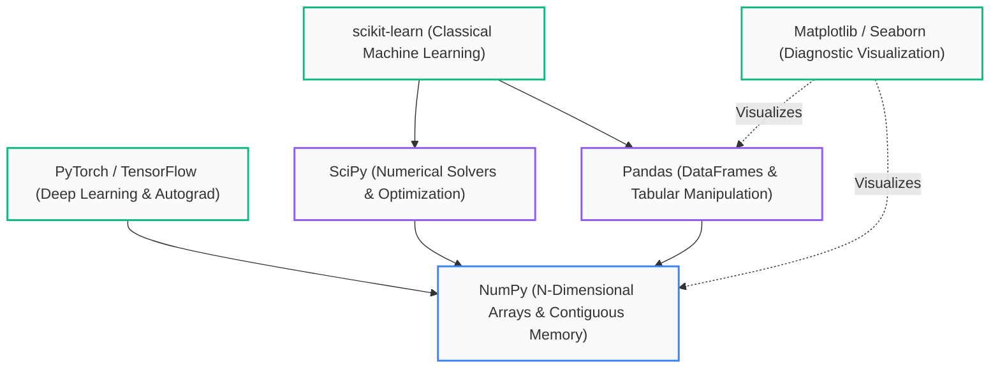
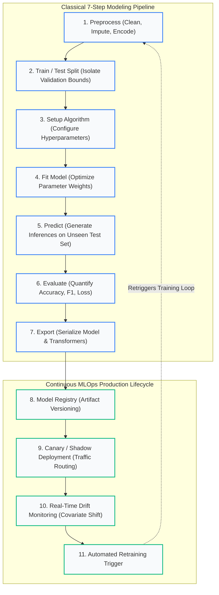

import Tabs from '@theme/Tabs';
import TabItem from '@theme/TabItem';
import Heading from '@theme/Heading';
import React from 'react';

# The Toolkit and the Pipeline

> **Topic -** Four chapters established the conceptual landscape of machine learning. This chapter bridges theory to production code. It covers the Python scientific library stack, scikit-learn's unified object contract, and the **seven-step pipeline** that governs every machine learning workflow.

Once you master the structure of the pipeline, the rest of machine learning reduces to choosing which algorithm to place into Step 3.

---

## 1. Why Python: The Library Ecosystem

Python is a general-purpose, interpreted programming language that became the undisputed standard for modern data science and machine learning.

Python did not win because of raw execution speed or language elegance. It won because of its **compiled library ecosystem**. Machine learning requires heavy linear algebra and matrix calculus. Python provides intuitive, readable high-level APIs that wrap high-performance, multithreaded C, C++, and Fortran computational engines.

### The Five Core Libraries & How They Stack

These five libraries are not competing alternatives. They represent a modular, hierarchical stack where each layer builds directly upon the primitives beneath it:



### Architectural Role of Each Layer

1.  **NumPy (Numerical Python):** The foundational substrate of scientific computing. It provides the **ndarray** (N-dimensional array), storing uniform numerical types in contiguous memory blocks. Vectorized operations run as single compiled SIMD instructions rather than slow interpreted Python loops.
2.  **SciPy (Scientific Python):** Provides advanced numerical calculus routines — including optimization solvers, numerical integration, signal processing, and statistical distributions. scikit-learn delegates heavy solver calculations (such as L-BFGS or coordinate descent) directly to SciPy.
3.  **Pandas:** The tabular data manipulation layer. Introduces the **DataFrame** — a two-dimensional, labeled data structure supporting mixed data types, date slicing, missing value indicators, and relational merges. Preprocessing (Steps 1 and 2) begins here.
4.  **Matplotlib & Seaborn:** The visual diagnostic engine. `matplotlib.pyplot` (imported as `plt`) renders distributions, residual plots, ROC curves, and decision boundaries.
5.  **scikit-learn:** The unified classical machine learning toolkit. Implements standardized, battle-tested algorithms for classification, regression, clustering, preprocessing, and model evaluation.
6.  **PyTorch / TensorFlow:** Deep learning frameworks extending the NumPy array philosophy to tensors with automatic differentiation (autograd) and GPU/TPU hardware acceleration.

:::note

**NumPy Sits Underneath Everything**

A Pandas DataFrame is fundamentally a collection of 1-D NumPy arrays. When you pass a DataFrame into scikit-learn, the library converts it into a C-contiguous NumPy array on input and returns NumPy arrays on output.

This is why dimensional mismatch exceptions (such as `ValueError: Expected 2D array, got 1D array instead`) surface as low-level NumPy messages even when you never imported NumPy directly.

:::

---

<Heading as="h2" id="the-contract-that-makes-it-work">2. The Scikit-Learn Contract: Estimators vs. Transformers</Heading>

scikit-learn achieved global dominance because of one design achievement: **API Consistency**. Every object in the library adheres to a strictly defined, predictable four-method interface:

| Method | Technical Purpose | Object Family |
|---|---|---|
| **`.fit(X, y)`** | **Learns parameters** from the data matrix (calculates statistics or optimizes weights) | All objects |
| **`.transform(X)`** | **Modifies the data** using previously learned parameters (scaling, encoding, imputation) | Transformers |
| **`.predict(X)`** | **Generates predictions** for unseen data using fitted weights | Estimators (Models) |
| **`.score(X, y)`** | **Evaluates performance** against ground-truth labels (returns $R^2$ or Accuracy) | Estimators (Models) |

### The Two Fundamental Object Types

*   **Transformers (`fit` + `transform`):** Objects that clean, encode, project, or scale data. Examples include `StandardScaler`, `SimpleImputer`, `OneHotEncoder`, and `PCA`.
*   **Estimators (`fit` + `predict`):** Predictive models that map feature matrices to target arrays. Examples include `LogisticRegression`, `RandomForestClassifier`, and `LinearRegression`.

The convenience method **`fit_transform(X)`** calculates parameters and applies them in a single optimized pass.

---

export const ContractInspector = () => {
  const [selectedClass, setSelectedClass] = React.useState('StandardScaler');

  const registry = {
    'StandardScaler': {
      type: 'Transformer (Preprocessor)',
      purpose: 'Standardizes features by removing the mean and scaling to unit variance.',
      hasFit: true,
      hasTransform: true,
      hasPredict: false,
      hasScore: false,
      learnedAttributes: ['mean_ (Mean per feature)', 'var_ (Variance per feature)', 'scale_ (Std deviation per feature)'],
      invalidCall: 'scaler.predict(X)',
      errorRaised: 'AttributeError: \'StandardScaler\' object has no attribute \'predict\''
    },
    'SimpleImputer': {
      type: 'Transformer (Preprocessor)',
      purpose: 'Replaces missing values (NaN) using statistical strategies (mean, median, most_frequent).',
      hasFit: true,
      hasTransform: true,
      hasPredict: false,
      hasScore: false,
      learnedAttributes: ['statistics_ (Imputation fill-values per column)'],
      invalidCall: 'imputer.predict(X)',
      errorRaised: 'AttributeError: \'SimpleImputer\' object has no attribute \'predict\''
    },
    'PCA': {
      type: 'Transformer (Dimensionality Reduction)',
      purpose: 'Projects high-dimensional data onto orthogonal axes of maximum variance.',
      hasFit: true,
      hasTransform: true,
      hasPredict: false,
      hasScore: false,
      learnedAttributes: ['components_ (Principal axes)', 'explained_variance_ratio_ (Percentage of variance per component)'],
      invalidCall: 'pca.predict(X)',
      errorRaised: 'AttributeError: \'PCA\' object has no attribute \'predict\''
    },
    'LogisticRegression': {
      type: 'Estimator (Classifier)',
      purpose: 'Fits linear decision boundaries for discrete binary or multiclass classification.',
      hasFit: true,
      hasTransform: false,
      hasPredict: true,
      hasScore: true,
      learnedAttributes: ['coef_ (Feature weight coefficients)', 'intercept_ (Bias offsets)', 'classes_ (Class labels)'],
      invalidCall: 'model.transform(X)',
      errorRaised: 'AttributeError: \'LogisticRegression\' object has no attribute \'transform\''
    },
    'RandomForestClassifier': {
      type: 'Estimator (Ensemble Classifier)',
      purpose: 'Averages predictions across a forest of randomized decision trees.',
      hasFit: true,
      hasTransform: false,
      hasPredict: true,
      hasScore: true,
      learnedAttributes: ['estimators_ (Collection of fitted DecisionTree objects)', 'feature_importances_ (Impurity reduction per feature)'],
      invalidCall: 'rf.transform(X)',
      errorRaised: 'AttributeError: \'RandomForestClassifier\' object has no attribute \'transform\''
    }
  };

  const item = registry[selectedClass];

  return (
    <div style={{ padding: '24px', border: '1px solid var(--ifm-color-emphasis-200)', borderRadius: '8px', backgroundColor: 'rgba(148, 163, 184, 0.05)', margin: '25px 0' }}>
      <h4 style={{ margin: '0 0 12px 0' }}>Interactive Scikit-Learn API Contract Inspector</h4>
      <p style={{ margin: '0 0 16px 0', fontSize: '14px' }}>
        Select a scikit-learn class to inspect its interface implementation, learned attributes, and invalid method calls:
      </p>

      <div style={{ display: 'flex', gap: '8px', flexWrap: 'wrap', marginBottom: '18px' }}>
        {Object.keys(registry).map(c => (
          <button
            key={c}
            onClick={() => setSelectedClass(c)}
            style={{
              padding: '6px 14px',
              borderRadius: '4px',
              border: '1px solid #3182ce',
              backgroundColor: selectedClass === c ? '#3182ce' : 'transparent',
              color: selectedClass === c ? '#fff' : 'var(--ifm-font-color-base)',
              cursor: 'pointer',
              fontWeight: 'bold',
              fontSize: '13px',
              transition: '0.2s'
            }}
          >
            {c}
          </button>
        ))}
      </div>

      <div style={{ padding: '16px', borderRadius: '6px', backgroundColor: 'var(--ifm-background-surface-color)', border: '1px solid var(--ifm-color-emphasis-300)' }}>
        <div style={{ display: 'flex', justifyContent: 'space-between', alignItems: 'center', flexWrap: 'wrap', gap: '10px', marginBottom: '10px' }}>
          <div style={{ fontSize: '16px', fontWeight: 'bold', color: '#2b6cb0' }}>
            <code>{selectedClass}</code>
          </div>
          <span style={{ fontSize: '12px', fontWeight: 'bold', padding: '4px 8px', borderRadius: '4px', backgroundColor: item.type.includes('Transformer') ? 'rgba(49, 130, 206, 0.15)' : 'rgba(72, 187, 120, 0.15)', color: item.type.includes('Transformer') ? '#2b6cb0' : '#276749' }}>
            {item.type}
          </span>
        </div>

        <div style={{ fontSize: '13px', color: 'var(--ifm-color-emphasis-800)', marginBottom: '16px', lineHeight: '1.5' }}>
          {item.purpose}
        </div>

        <div style={{ display: 'grid', gridTemplateColumns: 'repeat(auto-fit, minmax(130px, 1fr))', gap: '10px', marginBottom: '16px' }}>
          <div style={{ padding: '8px', borderRadius: '4px', backgroundColor: item.hasFit ? 'rgba(72, 187, 120, 0.1)' : 'rgba(229, 62, 62, 0.1)', textAlign: 'center', border: item.hasFit ? '1px solid #38a169' : '1px solid #e53e3e' }}>
            <div style={{ fontSize: '11px', fontWeight: 'bold' }}>.fit(X, y)</div>
            <div style={{ fontSize: '12px', fontWeight: 'bold', color: item.hasFit ? '#276749' : '#c53030' }}>{item.hasFit ? 'Implemented' : 'None'}</div>
          </div>
          <div style={{ padding: '8px', borderRadius: '4px', backgroundColor: item.hasTransform ? 'rgba(72, 187, 120, 0.1)' : 'rgba(148, 163, 184, 0.1)', textAlign: 'center', border: item.hasTransform ? '1px solid #38a169' : '1px solid var(--ifm-color-emphasis-300)' }}>
            <div style={{ fontSize: '11px', fontWeight: 'bold' }}>.transform(X)</div>
            <div style={{ fontSize: '12px', fontWeight: 'bold', color: item.hasTransform ? '#276749' : 'var(--ifm-color-emphasis-500)' }}>{item.hasTransform ? 'Implemented' : 'None'}</div>
          </div>
          <div style={{ padding: '8px', borderRadius: '4px', backgroundColor: item.hasPredict ? 'rgba(72, 187, 120, 0.1)' : 'rgba(148, 163, 184, 0.1)', textAlign: 'center', border: item.hasPredict ? '1px solid #38a169' : '1px solid var(--ifm-color-emphasis-300)' }}>
            <div style={{ fontSize: '11px', fontWeight: 'bold' }}>.predict(X)</div>
            <div style={{ fontSize: '12px', fontWeight: 'bold', color: item.hasPredict ? '#276749' : 'var(--ifm-color-emphasis-500)' }}>{item.hasPredict ? 'Implemented' : 'None'}</div>
          </div>
          <div style={{ padding: '8px', borderRadius: '4px', backgroundColor: item.hasScore ? 'rgba(72, 187, 120, 0.1)' : 'rgba(148, 163, 184, 0.1)', textAlign: 'center', border: item.hasScore ? '1px solid #38a169' : '1px solid var(--ifm-color-emphasis-300)' }}>
            <div style={{ fontSize: '11px', fontWeight: 'bold' }}>.score(X, y)</div>
            <div style={{ fontSize: '12px', fontWeight: 'bold', color: item.hasScore ? '#276749' : 'var(--ifm-color-emphasis-500)' }}>{item.hasScore ? 'Implemented' : 'None'}</div>
          </div>
        </div>

        <div style={{ marginBottom: '12px' }}>
          <div style={{ fontSize: '12px', fontWeight: 'bold', marginBottom: '4px' }}>Learned Attributes (populated strictly after .fit):</div>
          <ul style={{ margin: '0', paddingLeft: '20px', fontSize: '13px' }}>
            {item.learnedAttributes.map(attr => (
              <li key={attr}><code>{attr}</code></li>
            ))}
          </ul>
        </div>

        <div style={{ padding: '10px 14px', borderRadius: '4px', backgroundColor: 'rgba(229, 62, 62, 0.08)', borderLeft: '4px solid #e53e3e', fontSize: '12px' }}>
          <b>Invalid Call:</b> <code>{item.invalidCall}</code> raises <code>{item.errorRaised}</code>
        </div>
      </div>
    </div>
  );
};

<ContractInspector />

### The Cardinal Rule: Never Fit on Test Data

`fit` is where the object learns from observations: a `StandardScaler` calculates the sample mean ($\mu$) and standard deviation ($\sigma$).

If you call `fit` on your whole dataset before splitting, the test set distribution leaks into the training pipeline. The model trains on normalized features informed by data it is supposed to be blind to.

```python
# CORRECT: Strict train-test isolation
scaler = StandardScaler()
scaler.fit(X_train)                 # Learn statistics strictly from training data
X_train_scaled = scaler.transform(X_train)
X_test_scaled  = scaler.transform(X_test)  # Apply training parameters to test set
```

This error is known as **Data Leakage**. It silently inflates test scores, causing models to perform brilliantly in validation and fail catastrophically in production.

---

export const PipelineLeakageQuiz = () => {
  const [selected, setSelected] = React.useState(null);
  return (
    <div style={{ padding: '20px', border: '1px solid var(--ifm-color-emphasis-200)', borderRadius: '8px', backgroundColor: 'rgba(148, 163, 184, 0.05)', margin: '20px 0' }}>
      <h4 style={{ margin: '0 0 10px 0' }}>Interactive Checkpoint: Preventing Data Leakage</h4>
      <p style={{ margin: '0 0 15px 0' }}><b>Scenario:</b> You are building a predictive pipeline for real estate pricing. You must standardize your numerical features (mean = 0, std = 1). Which execution order is structurally leak-free?</p>
      <div style={{ display: 'flex', flexDirection: 'column', gap: '10px' }}>
        <button onClick={() => setSelected('wrong')} style={{ padding: '10px 14px', textAlign: 'left', borderRadius: '4px', border: '1px solid #3182ce', backgroundColor: selected === 'wrong' ? '#e53e3e' : 'transparent', color: selected === 'wrong' ? '#fff' : 'var(--ifm-font-color-base)', cursor: 'pointer', transition: '0.2s' }}>
          Option A: Fit the scaler on the entire dataset, partition into train/test, then fit the regressor on X_train.
        </button>
        <button onClick={() => setSelected('right')} style={{ padding: '10px 14px', textAlign: 'left', borderRadius: '4px', border: '1px solid #3182ce', backgroundColor: selected === 'right' ? '#38a169' : 'transparent', color: selected === 'right' ? '#fff' : 'var(--ifm-font-color-base)', cursor: 'pointer', transition: '0.2s' }}>
          Option B: Partition the raw dataset first, fit the scaler strictly on X_train, transform both partitions with that scaler, then fit the regressor.
        </button>
      </div>
      {selected === 'wrong' && <p style={{ color: '#e53e3e', marginTop: '15px', fontWeight: 'bold', fontSize: '14px', marginBottom: '0' }}>Incorrect. Fitting the scaler on the complete dataset incorporates test set distribution bounds (means and standard deviations) into training features. This causes silent data leakage and produces overly optimistic test scores.</p>}
      {selected === 'right' && <p style={{ color: '#38a169', marginTop: '15px', fontWeight: 'bold', fontSize: '14px', marginBottom: '0' }}>Correct! Partitioning first guarantees that scaling parameters are derived strictly from the training partition. Transforming the test set using those frozen training parameters preserves absolute test set isolation.</p>}
    </div>
  );
};

<PipelineLeakageQuiz />

---

## 3. The Seven-Step Pipeline & MLOps Lifecycle

Every classical machine learning project follows seven sequential steps. In modern engineering, this cycle feeds into continuous production **MLOps Lifecycle Management**:



---

export const PipelineStepper = () => {
  const [activeStep, setActiveStep] = React.useState(1);

  const pipelineSteps = {
    1: {
      name: 'Step 1: Data Preprocessing',
      lib: 'pandas / scikit-learn',
      code: `import pandas as pd\nfrom sklearn.impute import SimpleImputer\n\ndf = pd.read_csv("dataset.csv")\nX = df.drop(columns=["target"])\ny = df["target"]\n\nimputer = SimpleImputer(strategy="median")\nX_clean = imputer.fit_transform(X)`,
      state: 'Raw CSV converted into clean, imputed numerical matrix.',
      learned: 'imputer.statistics_ stores column medians.',
      danger: 'Do not scale features here! Scaling before partitioning causes immediate data leakage.'
    },
    2: {
      name: 'Step 2: Train / Test Split',
      lib: 'scikit-learn (model_selection)',
      code: `from sklearn.model_selection import train_test_split\n\nX_train, X_test, y_train, y_test = train_test_split(\n    X_clean, y, test_size=0.2, random_state=42, stratify=y\n)`,
      state: 'Dataset partitioned into disjoint 80% training and 20% testing subsets.',
      learned: 'Zero parameters learned. Partitioning is purely structural.',
      danger: 'Step 2 must precede Step 4. The test partition is a sealed vault opened only for final evaluation.'
    },
    3: {
      name: 'Step 3: Algorithm Setup',
      lib: 'scikit-learn (linear_model / ensemble)',
      code: `from sklearn.linear_model import LogisticRegression\n\nmodel = LogisticRegression(C=1.0, max_iter=1000)`,
      state: 'Estimator object initialized with structural hyperparameters in RAM.',
      learned: 'ABSOLUTELY NOTHING. Weights and coefficients are completely uninitialized.',
      danger: 'Step 3 is the ONLY step that changes when switching models (e.g., swapping to RandomForest).'
    },
    4: {
      name: 'Step 4: Model Fitting',
      lib: 'scikit-learn',
      code: `model.fit(X_train, y_train)`,
      state: 'Optimization solver minimizes loss function over training observations.',
      learned: 'model.coef_ and model.intercept_ are computed and saved to object memory.',
      danger: 'Fitting on test data (model.fit(X_test)) completely destroys experimental validity.'
    },
    5: {
      name: 'Step 5: Prediction',
      lib: 'scikit-learn',
      code: `y_pred = model.predict(X_test)\ny_prob = model.predict_proba(X_test)[:, 1]`,
      state: 'Fitted coefficients multiplied against unseen test features to output class labels.',
      learned: 'Zero parameters learned. Read-only inference execution.',
      danger: 'Predictions must use the same preprocessing transformations as the training set.'
    },
    6: {
      name: 'Step 6: Evaluation',
      lib: 'scikit-learn (metrics)',
      code: `from sklearn.metrics import classification_report, roc_auc_score\n\nacc = model.score(X_test, y_test)\nauc = roc_auc_score(y_test, y_prob)\nprint(classification_report(y_test, y_pred))`,
      state: 'Model predictions compared against ground-truth labels y_test.',
      learned: 'Objective evaluation metric quantified for model selection and auditing.',
      danger: 'Never judge an imbalanced model solely on raw accuracy. Always inspect Precision, Recall, and ROC-AUC.'
    },
    7: {
      name: 'Step 7: Model Export',
      lib: 'joblib',
      code: `import joblib\nfrom sklearn.pipeline import Pipeline\n\n# Best Practice: Bundle scaler + model together\nprod_pipeline = Pipeline([\n    ("scale", scaler),\n    ("clf", model)\n])\njoblib.dump(prod_pipeline, "production_model.joblib")`,
      state: 'Serialized binary file written to disk or uploaded to cloud model registry.',
      learned: 'Model weights AND preprocessing parameters archived for production serving.',
      danger: 'Saving the model without the scaler produces silent runtime failures when unscaled data hits the API.'
    }
  };

  const curr = pipelineSteps[activeStep];

  return (
    <div style={{ padding: '24px', border: '1px solid var(--ifm-color-emphasis-200)', borderRadius: '8px', backgroundColor: 'rgba(148, 163, 184, 0.05)', margin: '25px 0' }}>
      <h4 style={{ margin: '0 0 12px 0' }}>Interactive Seven-Step Pipeline Stepper</h4>
      <p style={{ margin: '0 0 16px 0', fontSize: '14px' }}>
        Step through the complete lifecycle to inspect code, memory states, learned parameters, and engineering rules:
      </p>

      <div style={{ display: 'flex', gap: '6px', flexWrap: 'wrap', marginBottom: '18px' }}>
        {[1, 2, 3, 4, 5, 6, 7].map(s => (
          <button
            key={s}
            onClick={() => setActiveStep(s)}
            style={{
              padding: '6px 12px',
              borderRadius: '4px',
              border: '1px solid #3182ce',
              backgroundColor: activeStep === s ? '#3182ce' : 'transparent',
              color: activeStep === s ? '#fff' : 'var(--ifm-font-color-base)',
              cursor: 'pointer',
              fontWeight: 'bold',
              fontSize: '12px',
              transition: '0.2s'
            }}
          >
            Step {s}
          </button>
        ))}
      </div>

      <div style={{ padding: '16px', borderRadius: '6px', backgroundColor: 'var(--ifm-background-surface-color)', border: '1px solid var(--ifm-color-emphasis-300)' }}>
        <div style={{ display: 'flex', justifyContent: 'space-between', alignItems: 'center', marginBottom: '10px' }}>
          <div style={{ fontSize: '16px', fontWeight: 'bold', color: '#2b6cb0' }}>
            {curr.name}
          </div>
          <span style={{ fontSize: '11px', padding: '3px 8px', borderRadius: '4px', backgroundColor: 'rgba(49, 130, 206, 0.1)', color: '#2b6cb0', fontWeight: 'bold' }}>
            {curr.lib}
          </span>
        </div>

        <pre style={{ margin: '0 0 14px 0', padding: '12px', borderRadius: '6px', fontSize: '13px', backgroundColor: '#1e293b', color: '#e2e8f0', overflowX: 'auto' }}>
          <code>{curr.code}</code>
        </pre>

        <div style={{ display: 'grid', gridTemplateColumns: 'repeat(auto-fit, minmax(220px, 1fr))', gap: '10px', marginBottom: '12px' }}>
          <div style={{ padding: '10px', borderRadius: '4px', backgroundColor: 'rgba(148, 163, 184, 0.08)', fontSize: '12px' }}>
            <b>Data Matrix State:</b><br />{curr.state}
          </div>
          <div style={{ padding: '10px', borderRadius: '4px', backgroundColor: 'rgba(72, 187, 120, 0.08)', fontSize: '12px' }}>
            <b>What is Learned:</b><br />{curr.learned}
          </div>
        </div>

        <div style={{ padding: '10px 14px', borderRadius: '4px', backgroundColor: 'rgba(221, 107, 32, 0.08)', borderLeft: '4px solid #dd6b20', fontSize: '12px' }}>
          <b>Engineering Caution:</b> {curr.danger}
        </div>
      </div>
    </div>
  );
};

<PipelineStepper />

### The Modularity Payoff: Swapping Algorithms

Notice the decisive payoff of scikit-learn's unified contract: **Step 3 is the only step that changes when swapping models.** 

When migrating from a linear baseline (`LogisticRegression`) to an ensemble (`RandomForestClassifier`) or an instance-based model (`KNeighborsClassifier`), Steps 1, 2, 4, 5, 6, and 7 remain completely untouched:

---

export const AlgorithmSwapper = () => {
  const [modelType, setModelType] = React.useState('lr');

  const models = {
    lr: {
      name: 'Logistic Regression',
      importLine: 'from sklearn.linear_model import LogisticRegression',
      setupLine: 'model = LogisticRegression(C=1.0, max_iter=1000)',
      desc: 'Linear parametric model. Calculates log-odds using convex numerical optimization.'
    },
    rf: {
      name: 'Random Forest',
      importLine: 'from sklearn.ensemble import RandomForestClassifier',
      setupLine: 'model = RandomForestClassifier(n_estimators=100, max_depth=5)',
      desc: 'Non-linear ensemble model. Averages predictions across 100 randomized decision trees.'
    },
    knn: {
      name: 'K-Nearest Neighbors',
      importLine: 'from sklearn.neighbors import KNeighborsClassifier',
      setupLine: 'model = KNeighborsClassifier(n_neighbors=5)',
      desc: 'Non-parametric instance-based model. Memorizes vectors and votes on Euclidean distance.'
    }
  };

  const current = models[modelType];

  return (
    <div style={{ padding: '24px', border: '1px solid var(--ifm-color-emphasis-200)', borderRadius: '8px', backgroundColor: 'rgba(148, 163, 184, 0.05)', margin: '25px 0' }}>
      <h4 style={{ margin: '0 0 12px 0' }}>Dynamic Algorithm Swapper: The Unified Contract in Action</h4>
      <p style={{ margin: '0 0 16px 0', fontSize: '14px' }}>
        Switch algorithms below and observe that <b>only Step 3 changes</b>. All surrounding data loading, splitting, training, predicting, and scoring steps remain identical:
      </p>

      <div style={{ display: 'flex', gap: '8px', marginBottom: '16px' }}>
        {Object.keys(models).map(key => (
          <button
            key={key}
            onClick={() => setModelType(key)}
            style={{
              padding: '6px 14px',
              borderRadius: '4px',
              border: '1px solid #3182ce',
              backgroundColor: modelType === key ? '#3182ce' : 'transparent',
              color: modelType === key ? '#fff' : 'var(--ifm-font-color-base)',
              cursor: 'pointer',
              fontWeight: 'bold',
              fontSize: '13px',
              transition: '0.2s'
            }}
          >
            {models[key].name}
          </button>
        ))}
      </div>

      <div style={{ padding: '12px', borderRadius: '6px', backgroundColor: '#1e293b', color: '#e2e8f0', fontSize: '13px', overflowX: 'auto', marginBottom: '14px' }}>
        <span style={{ color: '#64748b' }}># Step 1 & 2: Preprocess and Split (UNTOUCHED)</span><br />
        <span style={{ color: '#94a3b8' }}>X_train, X_test, y_train, y_test = train_test_split(X, y, test_size=0.2)</span><br /><br />
        <span style={{ color: '#38bdf8', fontWeight: 'bold' }}># --- STEP 3: THE ONLY CHANGED STEP ---</span><br />
        <span style={{ color: '#facc15', fontWeight: 'bold' }}>{current.importLine}</span><br />
        <span style={{ color: '#facc15', fontWeight: 'bold' }}>{current.setupLine}</span><br /><br />
        <span style={{ color: '#64748b' }}># Steps 4, 5, 6, 7: Fit, Predict, Evaluate, Export (UNTOUCHED)</span><br />
        <span style={{ color: '#94a3b8' }}>model.fit(X_train, y_train)</span><br />
        <span style={{ color: '#94a3b8' }}>predictions = model.predict(X_test)</span><br />
        <span style={{ color: '#94a3b8' }}>score = model.score(X_test, y_test)</span><br />
        <span style={{ color: '#94a3b8' }}>joblib.dump(model, "model.joblib")</span>
      </div>

      <div style={{ fontSize: '13px', color: 'var(--ifm-color-emphasis-700)', fontStyle: 'italic' }}>
        {current.desc}
      </div>
    </div>
  );
};

<AlgorithmSwapper />

---

## 4. Implementation Lab

:::tip

**Implementation Lab: The End-to-End Machine Learning Pipeline**

Execute the complete classical seven-step machine learning pipeline sequentially on the Iris classification benchmark. Compare manual step-by-step execution against a production `Pipeline` object, and run algorithm swaps in a single line.

<a href="https://colab.research.google.com/github/vettrivel-kl/vettrivel-kl.github.io/blob/master/static/labs/01-foundations/end_to_end_pipeline.ipynb" target="_blank" rel="noopener noreferrer">
  
</a>

**How to run the lab:**
1. Click the **"Open In Colab"** badge above to launch the interactive notebook.
2. Click **"Runtime" > "Run all"** or execute cells individually using `Shift + Enter`.
3. Follow the guided experiments: intentionally induce data leakage, test unscaled inputs, and evaluate decision tree depth boundaries.

:::

### Comparative Implementation: Manual Scripting vs. Production Pipeline

Compare the verbose manual execution of preprocessing and modeling against scikit-learn's clean, leak-free `Pipeline` object:

<Tabs>
  <TabItem value="manual" label="1. Manual Step-by-Step Scripting" default>
    <br/>

    ```python
    from sklearn.datasets import load_iris
    from sklearn.model_selection import train_test_split
    from sklearn.preprocessing import StandardScaler
    from sklearn.linear_model import LogisticRegression
    import joblib

    # 1. Load & 2. Split
    iris = load_iris()
    X_tr, X_te, y_tr, y_te = train_test_split(iris.data, iris.target, test_size=0.2, random_state=42)

    # 3. Setup & 4. Fit Preprocessing
    scaler = StandardScaler()
    X_tr_scaled = scaler.fit_transform(X_tr)
    X_te_scaled = scaler.transform(X_te)  # Must remember to transform test set!

    # Setup & Fit Model
    model = LogisticRegression(max_iter=1000)
    model.fit(X_tr_scaled, y_tr)

    # 5. Predict & 6. Evaluate
    print("Test Accuracy:", model.score(X_te_scaled, y_te))

    # 7. Export (Must manually serialize both objects)
    joblib.dump({"scaler": scaler, "model": model}, "bundle.joblib")
    ```
  </TabItem>
  <TabItem value="pipeline" label="2. Production Unified Pipeline">
    <br/>

    ```python
    from sklearn.datasets import load_iris
    from sklearn.model_selection import train_test_split
    from sklearn.preprocessing import StandardScaler
    from sklearn.linear_model import LogisticRegression
    from sklearn.pipeline import Pipeline
    import joblib

    # Load & Split
    iris = load_iris()
    X_tr, X_te, y_tr, y_te = train_test_split(iris.data, iris.target, test_size=0.2, random_state=42)

    # Unified Pipeline: Encapsulates transformers and estimators
    pipe = Pipeline([
        ("scale", StandardScaler()),
        ("model", LogisticRegression(max_iter=1000))
    ])

    # Fitting the pipeline automatically handles fit_transform on train!
    pipe.fit(X_tr, y_tr)

    # Scoring automatically applies learned scaler.transform to test data!
    print("Test Accuracy:", pipe.score(X_te, y_te))

    # A single call serializes the entire operational bundle
    joblib.dump(pipe, "pipeline.joblib")
    ```
  </TabItem>
</Tabs>

---

## 5. Common Mistakes

<Tabs>
  <TabItem value="m1" label="1. Pre-Split Scaling (Data Leakage)" default>
    <br/>

    *   **The Misconception:** *"We should normalize the whole dataset at the very start so all numbers are scaled uniformly."*
    *   **Wrong Thinking:** Calling `scaler.fit(X)` or `scaler.fit_transform(X)` before calling `train_test_split`.
    *   **The Right Principle:** Fitting before partitioning calculates means and variances over test rows, leaking validation bounds into the training feature space. Always call `train_test_split` first, then fit scalers strictly on `X_train`.
  </TabItem>
  <TabItem value="m2" label="2. Re-Fitting on Test Data">
    <br/>

    *   **The Misconception:** *"We should call scaler.fit(X_test) so the test data is normalized relative to its own mean."*
    *   **Wrong Thinking:** Calling `scaler.fit(X_test)` or `scaler.fit_transform(X_test)`.
    *   **The Right Principle:** A model's weights are calibrated to the scale and offset learned from the training set. Transforming test data with a new test mean shifts coordinate boundaries, corrupting inferences. Always call `scaler.transform(X_test)`.
  </TabItem>
  <TabItem value="m3" label="3. Monolithic Model Exports">
    <br/>

    *   **The Misconception:** *"We only need to export model.joblib to our production server."*
    *   **Wrong Thinking:** Serializing the fitted estimator without bundling its transformers.
    *   **The Right Principle:** A model trained on standardized inputs ($z = (x - \mu) / \sigma$) expects inputs centered at zero. Passing raw, unscaled production features directly into the model will produce garbage predictions with zero runtime errors. Always serialize a unified `Pipeline`.
  </TabItem>
  <TabItem value="m4" label="4. Re-Inventing Classical Algorithms">
    <br/>

    *   **The Misconception:** *"Writing our own linear regression solver in raw Python gives us full control over edge cases."*
    *   **Wrong Thinking:** Writing interpreted Python loops to optimize matrix parameters from scratch in production.
    *   **The Right Principle:** scikit-learn delegates optimization to highly tuned, multithreaded C and Fortran solvers via SciPy and BLAS/LAPACK. Custom interpreted Python implementations are orders of magnitude slower and lack numerical edge-case guards.
  </TabItem>
</Tabs>

---

## 6. Summary

<div className="row">
  <div className="col col--6">
    <div className="card" style={{ height: '100%', marginBottom: '15px' }}>
      <div className="card__header" style={{ padding: '15px', borderBottom: '1px solid var(--ifm-color-emphasis-200)' }}>
        <h3>The Data Stack Layer</h3>
      </div>
      <div className="card__body" style={{ padding: '15px' }}>
        <ul>
          <li><b>NumPy:</b> N-dimensional arrays. Fast contiguous memory storage powering the entire scientific stack.</li>
          <li><b>SciPy:</b> Numerical calculus routines and optimization solvers powering scikit-learn models.</li>
          <li><b>Pandas:</b> Labeled two-dimensional DataFrames for tabular data cleaning and slicing.</li>
          <li><b>Matplotlib / Seaborn:</b> Diagnostic data plotting and visualization engine.</li>
        </ul>
      </div>
    </div>
  </div>
  <div className="col col--6">
    <div className="card" style={{ height: '100%', marginBottom: '15px' }}>
      <div className="card__header" style={{ padding: '15px', borderBottom: '1px solid var(--ifm-color-emphasis-200)' }}>
        <h3>Pipeline & MLOps Layer</h3>
      </div>
      <div className="card__body" style={{ padding: '15px' }}>
        <ul>
          <li><b>scikit-learn Contract:</b> Strict interface (`.fit()`, `.predict()`, `.transform()`, `.score()`).</li>
          <li><b>Transformers vs. Estimators:</b> Preprocessors modify data shapes; estimators predict targets.</li>
          <li><b>The 7-Step Pipeline:</b> Preprocess $\to$ Split $\to$ Setup $\to$ Fit $\to$ Predict $\to$ Evaluate $\to$ Export.</li>
          <li><b>MLOps Extension:</b> Bridges local scripts to registries, canary routing, and drift-triggered retraining.</li>
        </ul>
      </div>
    </div>
  </div>
</div>

<br/>

:::info

**Key Takeaways**

*   **NumPy is the Substrate:** DataFrames and scikit-learn estimators operate directly on contiguous NumPy arrays. Shape mismatch errors bubble up from NumPy.
*   **Step 3 is the Only Variable:** Swapping models requires changing only Step 3. The surrounding six steps remain 100% identical.
*   **Leakage Fails Silently:** Fitting scalers on test data raises no errors, but destroys validation integrity. Split before you fit.
*   **Always Export a Pipeline:** Never export an estimator without its transformers. Package scalers and models into a single `Pipeline` artifact.

:::

**Next Section:** [Module 2: Data Preprocessing](../02-data-preprocessing/01-loading-and-preparing-data.mdx) - deep dive into data ingestion, imputation, and feature engineering.

**See also:** [What is Machine Learning?](./01-what-is-machine-learning.mdx) · [Types of Learning](./03-types-of-learning.mdx)

---

## 7. Active Recall Flashcards

*Attempt each conceptual diagnostic question first, then click to reveal the underlying derivation and explanation.*

<details>
  <summary><b>1. [THEORY] Describe the hierarchical dependency stack of Python scientific libraries, explaining why NumPy is foundational.</b></summary>
  <div className="answer-content">
    <br/>

    *   **The Hierarchy:** NumPy sits at the base. Pandas (tabular DataFrames) and SciPy (numerical solvers) build directly on top of NumPy arrays. scikit-learn (classical ML) and PyTorch/TensorFlow (deep learning) consume Pandas DataFrames and SciPy solvers, but execute all core array calculations over NumPy-compatible memory blocks. Matplotlib visualizes arrays from all layers.
    *   **Why NumPy is Foundational:** NumPy provides the `ndarray`, which stores homogeneous numerical types in contiguous memory buffers. This allows operations over millions of values to run as single, compiled C/SIMD vector instructions rather than slow, interpreted Python object loops.
  </div>
</details>

<details>
  <summary><b>2. [THEORY] Detail the four core methods of the scikit-learn API contract, specifying the input parameters and operational role of each.</b></summary>
  <div className="answer-content">
    <br/>

    *   **`.fit(X, y)`:** Learns parameters from training data. For estimators, it optimizes weight coefficients; for transformers, it calculates column statistics (e.g., mean and standard deviation).
    *   **`.transform(X)`:** Applies learned parameters to transform an input feature matrix without updating any internal coefficients. Implemented strictly by Transformers.
    *   **`.predict(X)`:** Applies fitted coefficients to predict class labels or continuous values on an unseen feature matrix. Implemented strictly by Estimators.
    *   **`.score(X, y)`:** Computes default evaluation metrics (accuracy for classification, $R^2$ for regression) by comparing model inferences against true target labels $y$.
  </div>
</details>

<details>
  <summary><b>3. [THEORY] Distinguish between a Transformer and an Estimator in scikit-learn by their method implementations and learned attributes.</b></summary>
  <div className="answer-content">
    <br/>

    *   **Transformer:** Implements `.fit()` and `.transform()`. Modifies the data matrix itself. Examples: `StandardScaler` (learns `mean_`, `scale_`), `SimpleImputer` (learns `statistics_`), `PCA` (learns `components_`).
    *   **Estimator:** Implements `.fit()` and `.predict()`. Computes predictions from feature matrices. Examples: `LogisticRegression` (learns `coef_`, `intercept_`), `RandomForestClassifier` (learns `estimators_`, `feature_importances_`).
  </div>
</details>

<details>
  <summary><b>4. [ANALYZE] Explain precisely what occurs when a StandardScaler is fitted on the full dataset before splitting. Why does this error fail silently?</b></summary>
  <div className="answer-content">
    <br/>

    *   **What Occurs (Data Leakage):** During `.fit()`, the scaler calculates the global mean ($\mu$) and standard deviation ($\sigma$) across all samples, including rows destined for the test set. Training features are normalized using test set distribution statistics.
    *   **Why It Fails Silently:** Both scaled and unscaled matrices have identical shapes and standard float data types. scikit-learn performs standard linear algebra cleanly with zero syntax or dimensional exceptions. The error manifests only as an artificially inflated test score that collapses when deployed to production.
  </div>
</details>

<details>
  <summary><b>5. [THEORY] List the seven steps of the classical machine learning pipeline in their strict operational order.</b></summary>
  <div className="answer-content">
    <br/>

    1.  **Preprocess:** Ingest raw data, handle missing values, and clean anomalous records.
    2.  **Split:** Partition dataset into disjoint training and testing pools (`train_test_split`).
    3.  **Algorithm Setup:** Instantiate the estimator and define hyperparameters.
    4.  **Fit:** Train the estimator strictly on the training partition (`model.fit(X_train, y_train)`).
    5.  **Predict:** Generate inferences on unseen test features (`model.predict(X_test)`).
    6.  **Evaluate:** Measure performance against ground-truth labels using objective metrics.
    7.  **Export:** Serialize the model and its associated preprocessors to disk (`joblib.dump`).
  </div>
</details>

<details>
  <summary><b>6. [ANALYZE] Contrast the internal state of a model immediately after Step 3 (Algorithm Setup) versus Step 4 (Model Fitting).</b></summary>
  <div className="answer-content">
    <br/>

    *   **After Step 3:** The model has learned **absolutely nothing**. Step 3 simply allocates an object in memory and stores structural configuration hyperparameters (such as regularization strength `C=1.0` or tree depth `max_depth=5`). Model weight attributes (`coef_`, `intercept_`) do not exist.
    *   **After Step 4:** The optimization solver has converged. Mathematical weights and bias parameters are fully populated, enabling the model to execute inferences via `.predict()`.
  </div>
</details>

<details>
  <summary><b>7. [ANALYZE] Why is Step 3 the only step that changes when swapping from Logistic Regression to a Random Forest? What does this demonstrate about software architecture?</b></summary>
  <div className="answer-content">
    <br/>

    *   **Why Only Step 3 Changes:** Because all scikit-learn estimators strictly adhere to the same unified interface contract (`fit` and `predict`). Steps 1 and 2 prepare the feature matrix, Step 4 calls `.fit()`, Step 5 calls `.predict()`, and Step 6 evaluates inferences identically regardless of the underlying algorithm.
    *   **Software Architecture Principle:** Demonstrates the power of **polymorphism and interface abstraction**. By decoupling the execution pipeline from specific algorithmic mechanics, machine learning workflows become completely modular and maintainable.
  </div>
</details>

<details>
  <summary><b>8. [ANALYZE] A developer exports only the fitted LogisticRegression object to disk, omitting the StandardScaler. What happens when the model is deployed in production?</b></summary>
  <div className="answer-content">
    <br/>

    *   **Production Failure Mode:** Live API requests will feed raw, unscaled feature values into the model. Because the model's coefficients are calibrated for zero-mean, unit-variance standardized coordinates, unscaled inputs (such as raw salaries or square footages) will heavily distort the linear dot product.
    *   **Silent Breakdown:** No error or exception will be raised because the input matrix dimensions match. The model will silently emit meaningless, heavily degraded predictions.
    *   **Solution:** Always serialize a unified scikit-learn `Pipeline` object containing both the scaler and the estimator.
  </div>
</details>

<details>
  <summary><b>9. [PROG] Write a concise Python script constructing a scikit-learn Pipeline that chains a SimpleImputer, StandardScaler, and LogisticRegression, then fits and exports it.</b></summary>
  <div className="answer-content">
    <br/>

    ```python
    import joblib
    from sklearn.datasets import load_iris
    from sklearn.model_selection import train_test_split
    from sklearn.impute import SimpleImputer
    from sklearn.preprocessing import StandardScaler
    from sklearn.linear_model import LogisticRegression
    from sklearn.pipeline import Pipeline

    # 1. Load & 2. Split
    data = load_iris()
    X_train, X_test, y_train, y_test = train_test_split(
        data.data, data.target, test_size=0.2, random_state=42, stratify=data.target
    )

    # 3. Setup Unified Pipeline
    pipeline = Pipeline([
        ("imputer", SimpleImputer(strategy="median")),
        ("scaler", StandardScaler()),
        ("classifier", LogisticRegression(max_iter=1000))
    ])

    # 4. Fit & 5/6. Evaluate
    pipeline.fit(X_train, y_train)
    print(f"Test Accuracy: {pipeline.score(X_test, y_test):.4f}")

    # 7. Export Entire Bundle
    joblib.dump(pipeline, "iris_production_pipeline.joblib")
    ```
  </div>
</details>

<details>
  <summary><b>10. [ANALYZE] How does the continuous MLOps lifecycle extend the classical 7-step modeling pipeline once a model reaches production?</b></summary>
  <div className="answer-content">
    <br/>

    *   **Model Registry (Step 8):** Versions, tags, and tracks serialized model artifacts alongside metadata, data lineage, and benchmark evaluation scores.
    *   **Canary / Shadow Deployment (Step 9):** Deploys candidate models in shadow mode (mirroring live traffic) or routes a tiny percentage (e.g., 5%) of live traffic to verify latency and performance before full release.
    *   **Drift Monitoring (Step 10):** Continuously computes statistical metrics (e.g., Kolmogorov-Smirnov test, Population Stability Index) to detect covariate shift (input distribution changes) and concept drift (relationship changes between inputs and targets).
    *   **Automated Retraining (Step 11):** Automatically retriggers the classical 7-step pipeline on refreshed data partitions when performance metrics or drift thresholds breach operational tolerances.
  </div>
</details>
