import Tabs from '@theme/Tabs';
import TabItem from '@theme/TabItem';
import Heading from '@theme/Heading';
import React from 'react';

# Loading and Preparing Data

> **Topic -** Machine learning algorithms assume input matrices are clean, homogeneous, and numeric. Real-world data arrives as messy text files filled with hidden sentinels, currency formatting, duplicate records, and corrupted types. This chapter establishes the defensive data loading practices, automated audits, and slicing rules required before any model fitting can begin.

A single corrupted character turns an entire numeric column into generic text objects. Catching these defects at the ingestion boundary saves hours of downstream debugging.

---

## 1. The Canonical Imports & Storage Formats

Every data preprocessing workflow in Python begins with three fundamental imports:

```python
import numpy as np
import pandas as pd
import matplotlib.pyplot as plt
```

| Alias | Library | Operational Responsibility |
|---|---|---|
| `np` | **NumPy** | N-dimensional arrays — the raw contiguous numeric memory underneath everything |
| `pd` | **Pandas** | DataFrames — two-dimensional labeled tables for data ingestion, cleaning, and slicing |
| `plt` | **Matplotlib (Pyplot)** | Diagnostic data plotting — visualizing distributions, missingness, and outliers |

### Row-Based (CSV/JSON) vs. Columnar (Parquet) Architecture

Before calling `pd.read_csv`, understand how data serialization layouts affect computational efficiency:

```mermaid
flowchart TD
    classDef box fill:#f8fafc,stroke:#3b82f6,stroke-width:2px;
    classDef col fill:#f8fafc,stroke:#10b981,stroke-width:2px;

    subgraph RowBased ["Row-Oriented Layout (CSV / JSON)"]
        R1["Row 1: [ID_1, Country_1, Age_1, Salary_1]"]
        R2["Row 2: [ID_2, Country_2, Age_2, Salary_2]"]
        R3["Row 3: [ID_3, Country_3, Age_3, Salary_3]"]
        R1 --> R2 --> R3
    end

    subgraph Columnar ["Column-Oriented Layout (Apache Parquet)"]
        C1["Chunk 'ID': [1, 2, 3]"]
        C2["Chunk 'Country': ['FR', 'ES', 'DE']"]
        C3["Chunk 'Age': [44, 27, 30]"]
        C4["Chunk 'Salary': [72000, 48000, 54000]"]
        C1 --> C2 --> C3 --> C4
    end

    class R1,R2,R3 box;
    class C1,C2,C3,C4 col;
```



*   **Row-Oriented Formats (CSV / JSON):** Store records sequentially on disk row by row (`Row 1, Row 2...`). Ideal for transactional writes, but disastrous for wide analytics: retrieving a single column requires scanning the entire file from disk into RAM.
*   **Column-Oriented Formats (Apache Parquet):** Store data by column chunks on disk (`All IDs, All Ages...`). Analytical queries read strictly the feature columns requested, skipping unneeded bytes completely. Parquet also enforces strongly typed schemas, Snappy compression, and column-level statistics.

---

<Heading as="h2" id="the-missingness-pandas-cannot-see">2. Silent Type Coercion & Missingness Pandas Cannot See</Heading>

A CSV file is raw text. Every token is a string until `pd.read_csv` makes a series of unannounced, column-by-column type inferences.

Consider this representative dirty dataset:

```text title="messy.csv"
id,Country,Age,Salary,Region,Purchased
1,France,44,72000,EU,No
2,Spain,27,48000,EU,Yes
3,Germany,30,54000,EU,No
4,Spain,38,"61,000",EU,No
5,Germany,40,,EU,Yes
6,France,35,58000,EU,Yes
7,Spain,N/A,52000,EU,No
8,France,48,79000,EU,Yes
9,Germany,-1,83000,EU,No
10,France,37,67000,EU,Yes
11,France,?,999999,EU,No
10,France,37,67000,EU,Yes
```

A naive load yields immediate silent failures:

```python
naive = pd.read_csv("messy.csv")
print(naive.dtypes)
print("Missing values detected:", naive.isna().sum().sum())
```

```text title="Output"
id            int64
Country      object
Age          object
Salary       object
Region       object
Purchased    object
dtype: object

Missing values detected: 2
```

### Two Silent Catastrophes

1.  **`Age` and `Salary` Collapsed to `object`:** Because row 11 has a `"?"` in `Age` and row 4 has `"61,000"` with a comma in `Salary`, Pandas abandons numeric parsing entirely and converts every single number in those columns into Python string objects. Mathematical operations will crash or silently concatenate strings.
2.  **Only 2 Missing Values Were Found:** The file actually contains **5** missing values. The `"?"` in Age, the `-1` in Age, and the `999999` in Salary were treated as legitimate values.

:::danger

**The Golden Habit: Print `.dtypes` Immediately After Every Load**

```python
df = pd.read_csv("data.csv")
print(df.dtypes)  # Execute immediately on every dataset
```

If a column that should be numeric appears as `object`, non-numeric characters are lurking in it. Catch this on line 2, not hours later when a scikit-learn model crashes with a cryptic formatting exception.

:::

---

export const CSVLoaderSandbox = () => {
  const [handleThousands, setHandleThousands] = React.useState(true);
  const [handleSentinels, setHandleSentinels] = React.useState(true);
  const [handleIdString, setHandleIdString] = React.useState(false);

  // Compute states
  const ageType = handleSentinels ? 'float64' : 'object';
  const salaryType = handleThousands && handleSentinels ? 'float64' : 'object';
  const idType = handleIdString ? 'object (string)' : 'int64';
  
  let missingCount = 2; // default NaN and N/A
  if (handleSentinels) missingCount += 3; // + '?', -1, 999999

  return (
    <div style={{ padding: '24px', border: '1px solid var(--ifm-color-emphasis-200)', borderRadius: '8px', backgroundColor: 'rgba(148, 163, 184, 0.05)', margin: '25px 0' }}>
      <h4 style={{ margin: '0 0 12px 0' }}>Interactive Defensive CSV Loader Simulator</h4>
      <p style={{ margin: '0 0 16px 0', fontSize: '14px' }}>
        Toggle the defensive ingestion parameters below to observe how Pandas resolves type coercion, captures sentinel values, and parses schemas cleanly:
      </p>

      <div style={{ display: 'flex', flexDirection: 'column', gap: '10px', marginBottom: '18px' }}>
        <label style={{ display: 'flex', alignItems: 'center', gap: '8px', fontSize: '13px', cursor: 'pointer' }}>
          <input
            type="checkbox"
            checked={handleThousands}
            onChange={(e) => setHandleThousands(e.target.checked)}
          />
          <span><b>Strip Digit Separators:</b> <code>thousands=","</code> (parses <code>"61,000"</code> as numeric)</span>
        </label>

        <label style={{ display: 'flex', alignItems: 'center', gap: '8px', fontSize: '13px', cursor: 'pointer' }}>
          <input
            type="checkbox"
            checked={handleSentinels}
            onChange={(e) => setHandleSentinels(e.target.checked)}
          />
          <span><b>Declare Domain Sentinels:</b> <code>na_values=["?", "-1", "999999"]</code></span>
        </label>

        <label style={{ display: 'flex', alignItems: 'center', gap: '8px', fontSize: '13px', cursor: 'pointer' }}>
          <input
            type="checkbox"
            checked={handleIdString}
            onChange={(e) => setHandleIdString(e.target.checked)}
          />
          <span><b>Preserve Identifier Types:</b> <code>dtype=&#123;"id": str&#125;</code> (preserves leading zeros)</span>
        </label>
      </div>

      <div style={{ padding: '16px', borderRadius: '6px', backgroundColor: 'var(--ifm-background-surface-color)', border: '1px solid var(--ifm-color-emphasis-300)' }}>
        <div style={{ fontSize: '14px', fontWeight: 'bold', color: '#2b6cb0', marginBottom: '12px' }}>
          Parsed Schema & Telemetry Readout
        </div>

        <div style={{ display: 'grid', gridTemplateColumns: 'repeat(auto-fit, minmax(130px, 1fr))', gap: '10px', marginBottom: '16px' }}>
          <div style={{ padding: '10px', borderRadius: '4px', backgroundColor: 'rgba(148, 163, 184, 0.08)', textAlign: 'center' }}>
            <div style={{ fontSize: '11px', fontWeight: 'bold' }}>Column 'Age'</div>
            <div style={{ fontSize: '13px', fontWeight: 'bold', color: ageType === 'float64' ? '#276749' : '#c53030' }}>{ageType}</div>
          </div>
          <div style={{ padding: '10px', borderRadius: '4px', backgroundColor: 'rgba(148, 163, 184, 0.08)', textAlign: 'center' }}>
            <div style={{ fontSize: '11px', fontWeight: 'bold' }}>Column 'Salary'</div>
            <div style={{ fontSize: '13px', fontWeight: 'bold', color: salaryType === 'float64' ? '#276749' : '#c53030' }}>{salaryType}</div>
          </div>
          <div style={{ padding: '10px', borderRadius: '4px', backgroundColor: 'rgba(148, 163, 184, 0.08)', textAlign: 'center' }}>
            <div style={{ fontSize: '11px', fontWeight: 'bold' }}>Column 'id'</div>
            <div style={{ fontSize: '13px', fontWeight: 'bold', color: '#2b6cb0' }}>{idType}</div>
          </div>
          <div style={{ padding: '10px', borderRadius: '4px', backgroundColor: missingCount === 5 ? 'rgba(72, 187, 120, 0.1)' : 'rgba(229, 62, 62, 0.1)', textAlign: 'center', border: missingCount === 5 ? '1px solid #38a169' : '1px solid #e53e3e' }}>
            <div style={{ fontSize: '11px', fontWeight: 'bold' }}>Detected NaN Count</div>
            <div style={{ fontSize: '15px', fontWeight: 'bold', color: missingCount === 5 ? '#276749' : '#c53030' }}>{missingCount} / 5</div>
          </div>
        </div>

        <div style={{ padding: '10px 14px', borderRadius: '4px', backgroundColor: missingCount === 5 && ageType === 'float64' && salaryType === 'float64' ? 'rgba(72, 187, 120, 0.1)' : 'rgba(221, 107, 32, 0.08)', borderLeft: missingCount === 5 && ageType === 'float64' && salaryType === 'float64' ? '4px solid #38a169' : '4px solid #dd6b20', fontSize: '12px' }}>
          {missingCount === 5 && ageType === 'float64' && salaryType === 'float64' ? (
            <span><b>Ingestion Clean:</b> All numbers correctly parsed as floats and all 5 missing sentinel coordinates successfully identified.</span>
          ) : (
            <span><b>Ingestion Warning:</b> Numeric columns masked as string <code>object</code>. Mathematical modeling algorithms will fail.</span>
          )}
        </div>
      </div>
    </div>
  );
};

<CSVLoaderSandbox />

### The 19 Default Missing Values vs. Domain Sentinels

Pandas recognizes 19 distinct string values as `NaN` automatically (including `""`, `"#N/A"`, `"NaN"`, `"null"`, `"n/a"`).

However, **no library can automatically infer sentinel placeholders**. If a database records missing income as `999999` or missing age as `-1`, Pandas sees legitimate numbers. Declaring them explicitly via `na_values` requires reviewing the data dictionary:

```python
df = pd.read_csv(
    "messy.csv",
    na_values=["?", "-1", "999999"],  # Domain knowledge, not automatic
    thousands=","
)
```

---

export const PandasParameterQuiz = () => {
  const [selected, setSelected] = React.useState(null);
  return (
    <div style={{ padding: '20px', border: '1px solid var(--ifm-color-emphasis-200)', borderRadius: '8px', backgroundColor: 'rgba(148, 163, 184, 0.05)', margin: '20px 0' }}>
      <h4 style={{ margin: '0 0 10px 0' }}>Interactive Checkpoint: Semicolon Delimiters & Leading Zeros</h4>
      <p style={{ margin: '0 0 15px 0' }}><b>Scenario:</b> You are handed an export separated by semicolons (<i>;</i>), where missing records are written as <i>unknown</i>, and the column <code>account_id</code> contains leading zeros (e.g., <i>00938</i>). Which parameter combination loads this defensively?</p>
      <div style={{ display: 'flex', flexDirection: 'column', gap: '10px' }}>
        <button onClick={() => setSelected('wrong')} style={{ padding: '10px 14px', textAlign: 'left', borderRadius: '4px', border: '1px solid #3182ce', backgroundColor: selected === 'wrong' ? '#e53e3e' : 'transparent', color: selected === 'wrong' ? '#fff' : 'var(--ifm-font-color-base)', cursor: 'pointer', transition: '0.2s' }}>
          <b>Option A:</b> <code>pd.read_csv("file.txt", sep=";", na_values=["unknown"])</code>
        </button>
        <button onClick={() => setSelected('right')} style={{ padding: '10px 14px', textAlign: 'left', borderRadius: '4px', border: '1px solid #3182ce', backgroundColor: selected === 'right' ? '#38a169' : 'transparent', color: selected === 'right' ? '#fff' : 'var(--ifm-font-color-base)', cursor: 'pointer', transition: '0.2s' }}>
          <b>Option B:</b> <code>pd.read_csv("file.txt", sep=";", na_values=["unknown"], dtype=&#123;"account_id": str&#125;)</code>
        </button>
      </div>
      {selected === 'wrong' && <p style={{ color: '#e53e3e', marginTop: '15px', fontWeight: 'bold', fontSize: '14px', marginBottom: '0' }}>Close, but incomplete! Semicolons are parsed and "unknown" becomes NaN. However, without specifying account_id as a string, Pandas casts it to integer 938, permanently destroying leading zeros. Try again!</p>}
      {selected === 'right' && <p style={{ color: '#38a169', marginTop: '15px', fontWeight: 'bold', fontSize: '14px', marginBottom: '0' }}>Correct! Specifying semicolons, declaring "unknown" as missingness, and forcing account_id to remain a string parses all records cleanly with leading zeros intact.</p>}
    </div>
  );
};

<PandasParameterQuiz />

---

<Heading as="h2" id="a-pre-flight-audit">3. The Pre-Flight Data Audit</Heading>

Rather than checking data quality ad-hoc, run an automated pre-flight audit function on every raw DataFrame immediately after ingestion:

```python
def audit(df, name):
    print(f"AUDIT - {name}: {df.shape[0]} rows x {df.shape[1]} columns")

    # 1. Duplicate row check
    dups = int(df.duplicated().sum())
    print(f"   duplicate rows:   {dups}")

    # 2. Zero-variance constant column check
    const = [c for c in df.columns if df[c].nunique(dropna=False) <= 1]
    print(f"   constant columns: {const if const else 'none'}")

    # 3. Numeric columns disguised as object
    for c in df.columns:
        note = ""
        if df[c].dtype == object:
            coerced = pd.to_numeric(df[c], errors="coerce")
            if coerced.notna().sum() > 0.5 * df[c].notna().sum():
                note = "LOOKS NUMERIC but is object"
        elif int((df[c] < 0).sum()):
            note = f"{int((df[c] < 0).sum())} negative value(s)"
        print(f"   {c:<12}{str(df[c].dtype):>9}{int(df[c].isna().sum()):>9}{df[c].nunique():>8}   {note}")
```

---

export const AuditDashboard = () => {
  const [cleanedView, setCleanedView] = React.useState(false);

  return (
    <div style={{ padding: '24px', border: '1px solid var(--ifm-color-emphasis-200)', borderRadius: '8px', backgroundColor: 'rgba(148, 163, 184, 0.05)', margin: '25px 0' }}>
      <h4 style={{ margin: '0 0 12px 0' }}>Interactive Pre-Flight Audit Diagnostic Dashboard</h4>
      <p style={{ margin: '0 0 16px 0', fontSize: '14px' }}>
        Compare the audit findings between the raw messy load and the cleaned table ready for modeling:
      </p>

      <div style={{ display: 'flex', gap: '8px', marginBottom: '16px' }}>
        <button
          onClick={() => setCleanedView(false)}
          style={{
            padding: '6px 14px',
            borderRadius: '4px',
            border: '1px solid #3182ce',
            backgroundColor: !cleanedView ? '#3182ce' : 'transparent',
            color: !cleanedView ? '#fff' : 'var(--ifm-font-color-base)',
            cursor: 'pointer',
            fontWeight: 'bold',
            fontSize: '13px',
            transition: '0.2s'
          }}
        >
          Raw Ingestion Audit
        </button>
        <button
          onClick={() => setCleanedView(true)}
          style={{
            padding: '6px 14px',
            borderRadius: '4px',
            border: '1px solid #3182ce',
            backgroundColor: cleanedView ? '#3182ce' : 'transparent',
            color: cleanedView ? '#fff' : 'var(--ifm-font-color-base)',
            cursor: 'pointer',
            fontWeight: 'bold',
            fontSize: '13px',
            transition: '0.2s'
          }}
        >
          Post-Audit Cleaned Table
        </button>
      </div>

      <div style={{ padding: '16px', borderRadius: '6px', backgroundColor: 'var(--ifm-background-surface-color)', border: '1px solid var(--ifm-color-emphasis-300)' }}>
        {!cleanedView ? (
          <div>
            <div style={{ fontSize: '14px', fontWeight: 'bold', color: '#c53030', marginBottom: '12px' }}>
              Detected Ingestion Anomalies: 12 rows x 6 columns
            </div>
            <div style={{ display: 'flex', flexDirection: 'column', gap: '8px', fontSize: '13px' }}>
              <div style={{ padding: '8px 12px', borderRadius: '4px', backgroundColor: 'rgba(229, 62, 62, 0.08)', borderLeft: '4px solid #e53e3e' }}>
                <b>Duplicate Row Flagged:</b> Row 10 appears twice. Duplicates straddling train/test splits cause immediate data leakage.
              </div>
              <div style={{ padding: '8px 12px', borderRadius: '4px', backgroundColor: 'rgba(221, 107, 32, 0.08)', borderLeft: '4px solid #dd6b20' }}>
                <b>Zero-Variance Constant Column:</b> <code>Region == 'EU'</code> for 100% of rows. Carries zero discriminative information; will cause multicollinearity in linear models.
              </div>
              <div style={{ padding: '8px 12px', borderRadius: '4px', backgroundColor: 'rgba(221, 107, 32, 0.08)', borderLeft: '4px solid #dd6b20' }}>
                <b>Coerced Numeric Columns:</b> <code>Age</code> and <code>Salary</code> contain over 90% numbers but are typed as string <code>object</code>.
              </div>
              <div style={{ padding: '8px 12px', borderRadius: '4px', backgroundColor: 'rgba(49, 130, 206, 0.08)', borderLeft: '4px solid #3182ce' }}>
                <b>Unique Identifier:</b> <code>id</code> has 11 unique values across 12 rows. Identifiers overfit models and must be dropped.
              </div>
            </div>
          </div>
        ) : (
          <div>
            <div style={{ fontSize: '14px', fontWeight: 'bold', color: '#276749', marginBottom: '12px' }}>
              Cleaned Feature Matrix: 11 rows x 4 columns
            </div>
            <div style={{ display: 'flex', flexDirection: 'column', gap: '8px', fontSize: '13px' }}>
              <div style={{ padding: '8px 12px', borderRadius: '4px', backgroundColor: 'rgba(72, 187, 120, 0.08)', borderLeft: '4px solid #38a169' }}>
                <b>Duplicates Dropped:</b> Exactly 1 duplicate row removed (`df.drop_duplicates()`).
              </div>
              <div style={{ padding: '8px 12px', borderRadius: '4px', backgroundColor: 'rgba(72, 187, 120, 0.08)', borderLeft: '4px solid #38a169' }}>
                <b>Zero-Variance Columns Removed:</b> `Region` dropped (`df.drop(columns=['Region'])`).
              </div>
              <div style={{ padding: '8px 12px', borderRadius: '4px', backgroundColor: 'rgba(72, 187, 120, 0.08)', borderLeft: '4px solid #38a169' }}>
                <b>Identifier Purged:</b> `id` removed to prevent memorization overfitting.
              </div>
              <div style={{ padding: '8px 12px', borderRadius: '4px', backgroundColor: 'rgba(72, 187, 120, 0.08)', borderLeft: '4px solid #38a169' }}>
                <b>Feature Partition:</b> Features <code>X</code> (11 rows x 3 columns) separated from target <code>y</code> (11 rows).
              </div>
            </div>
          </div>
        )}
      </div>
    </div>
  );
};

<AuditDashboard />

---

## 4. Separating Features and Target: loc vs. iloc

Once the dataset is audited and deduplicated, separate it into features $X$ and target $y$:

```python
clean = df.drop(columns=["id", "Region"]).drop_duplicates()

X_df = clean.iloc[:, :-1]  # All rows, every column but the last (2-D)
y_df = clean.iloc[:, -1]   # All rows, the last column only (1-D)
```

### The Two Differences Between loc and iloc

Everyone remembers that `iloc` is integer-based and `loc` is label-based. The **second** difference is the one that introduces production bugs:

| Dimension | `iloc` | `loc` |
|---|---|---|
| **Indexing Criterion** | Integer **position** ($0$-based) | Named **index label** |
| **Stop Boundary** | **Excluded** (standard Python sequence convention) | **Included** (both start and stop labels returned) |
| **Slice `[1:3]` Returns** | **2 items** (indices `1` and `2`) | **3 items** (labels `1`, `2`, and `3`) |
| **Survives Sorting** | No — position changes | Yes — label stays attached to the row |

---

export const LocVsIlocSandbox = () => {
  const [method, setMethod] = React.useState('iloc');

  const rows = [
    { label: 0, val: 10 },
    { label: 1, val: 20 },
    { label: 2, val: 30 },
    { label: 3, val: 40 },
    { label: 4, val: 50 }
  ];

  const selectedRows = method === 'iloc' ? [1, 2] : [1, 2, 3];

  return (
    <div style={{ padding: '24px', border: '1px solid var(--ifm-color-emphasis-200)', borderRadius: '8px', backgroundColor: 'rgba(148, 163, 184, 0.05)', margin: '25px 0' }}>
      <h4 style={{ margin: '0 0 12px 0' }}>Interactive loc vs. iloc Slice Visualizer</h4>
      <p style={{ margin: '0 0 16px 0', fontSize: '14px' }}>
        Observe how executing the exact same slice range <code>[1:3]</code> on <code>s = pd.Series([10, 20, 30, 40, 50])</code> yields different row counts:
      </p>

      <div style={{ display: 'flex', gap: '8px', marginBottom: '18px' }}>
        <button
          onClick={() => setMethod('iloc')}
          style={{
            padding: '6px 14px',
            borderRadius: '4px',
            border: '1px solid #3182ce',
            backgroundColor: method === 'iloc' ? '#3182ce' : 'transparent',
            color: method === 'iloc' ? '#fff' : 'var(--ifm-font-color-base)',
            cursor: 'pointer',
            fontWeight: 'bold',
            fontSize: '13px',
            transition: '0.2s'
          }}
        >
          s.iloc[1:3] (Integer Position)
        </button>
        <button
          onClick={() => setMethod('loc')}
          style={{
            padding: '6px 14px',
            borderRadius: '4px',
            border: '1px solid #3182ce',
            backgroundColor: method === 'loc' ? '#3182ce' : 'transparent',
            color: method === 'loc' ? '#fff' : 'var(--ifm-font-color-base)',
            cursor: 'pointer',
            fontWeight: 'bold',
            fontSize: '13px',
            transition: '0.2s'
          }}
        >
          s.loc[1:3] (Index Label)
        </button>
      </div>

      <div style={{ padding: '16px', borderRadius: '6px', backgroundColor: 'var(--ifm-background-surface-color)', border: '1px solid var(--ifm-color-emphasis-300)' }}>
        <div style={{ display: 'flex', gap: '10px', flexWrap: 'wrap', marginBottom: '14px' }}>
          {rows.map(r => {
            const isSelected = selectedRows.includes(r.label);
            return (
              <div
                key={r.label}
                style={{
                  padding: '12px 18px',
                  borderRadius: '6px',
                  backgroundColor: isSelected ? '#3182ce' : 'rgba(148, 163, 184, 0.1)',
                  color: isSelected ? '#ffffff' : 'var(--ifm-font-color-base)',
                  border: isSelected ? '2px solid #2b6cb0' : '1px solid var(--ifm-color-emphasis-200)',
                  textAlign: 'center',
                  transition: '0.2s'
                }}
              >
                <div style={{ fontSize: '11px', opacity: 0.8 }}>Label: {r.label}</div>
                <div style={{ fontSize: '16px', fontWeight: 'bold' }}>{r.val}</div>
                <div style={{ fontSize: '10px', marginTop: '4px' }}>{isSelected ? '[SELECTED]' : 'Excluded'}</div>
              </div>
            );
          })}
        </div>

        <div style={{ padding: '10px 14px', borderRadius: '4px', backgroundColor: 'rgba(49, 130, 206, 0.08)', borderLeft: '4px solid #3182ce', fontSize: '13px' }}>
          <b>Resulting Slice:</b> <code>{method === 'iloc' ? '[20, 30]' : '[20, 30, 40]'}</code> ({selectedRows.length} items returned).<br />
          <b>Why:</b> {method === 'iloc' ? 'iloc excludes stop offset 3 (standard 0-based Python sequence behavior).' : 'loc includes stop label 3 because labels are keys without natural sequence ordering.'}
        </div>
      </div>
    </div>
  );
};

<LocVsIlocSandbox />

---

<Heading as="h2" id="should-you-convert-to-numpy-at-all">5. When to Convert to NumPy: Memory and Speed Trade-offs</Heading>

Most online tutorials immediately write: `X = df.iloc[:, :-1].values`. While ubiquitous, converting to NumPy immediately upon ingestion carries severe hidden penalties:

### 1. Mixed Types Collapse to `object` (28x Slower Computation)

A NumPy array requires uniform data types. If your feature matrix mixes string categories (`'France'`) with numbers (`44.0`), NumPy converts every number into a generic Python pointer.

Benchmarking `300,000` floats:
*   Contiguous `float64` array sum: **`0.10 ms`**
*   Pointer-chasing `object` array sum: **`2.91 ms`**
*   **Result: `object` array operations run 28x slower.**

### 2. Loss of `feature_names_in_` Schema Validation

When scikit-learn models are fitted on a Pandas DataFrame, they record `feature_names_in_`. In production, passing features in a scrambled column order raises an immediate exception. If converted to a NumPy array prematurely, that check is lost and the model runs silent invalid dot products.

### 3. The Power of `category` Dtype (98.4% Memory Savings)

For text columns with few distinct values, Pandas `category` dtype compresses memory dramatically compared to raw string `object`:

*   200,000 rows with 3 distinct values stored as `object`: **`12.6 MB`**
*   Same 200,000 rows stored as `category`: **`200 KB` (98.4% reduction)**

:::tip

**The Production Rule:** Keep your data in Pandas DataFrames throughout loading, auditing, imputation, and categorical encoding. Convert to NumPy using `.to_numpy()` only when required by specialized tensor libraries.

:::

---

## 6. Implementation Lab

:::tip

**Implementation Lab: Defensive Data Ingestion in Pandas**

Verify the silent hazards of type inference, build automated audit pipelines to capture duplicated rows and zero-variance constant columns, and trace how loc vs. iloc slice models on messy dataset inputs.

<a href="https://colab.research.google.com/github/vettrivel-kl/vettrivel-kl.github.io/blob/master/static/labs/02-data-preprocessing/loading_data.ipynb" target="_blank" rel="noopener noreferrer">
  
</a>

**How to run the lab:**
1. Click the **"Open In Colab"** badge above to launch the interactive notebook.
2. Click **"Runtime" > "Run all"** or execute cells individually using `Shift + Enter`.
3. Follow the guided experiments: test unescaped thousands separators, induce object type degradation, and verify memory usage with `category` dtypes.

:::

---

## 7. Common Mistakes

<Tabs>
  <TabItem value="m1" label="1. Silent Coercion" default>
    <br/>

    *   **The Misconception:** *"The column contains ages, so Pandas will automatically load it as integers or floats."*
    *   **Wrong Thinking:** Assuming `Age` is float64 because the rows look numeric.
    *   **The Right Principle:** A single non-numeric token (such as `"?"` or `"N/A"`) coerces the entire column into string `object`. Always inspect `df.dtypes` immediately after every load.
  </TabItem>
  <TabItem value="m2" label="2. Leading-Zero ID Loss">
    <br/>

    *   **The Misconception:** *"Account numbers, ZIP codes, and phone numbers are made of digits, so they should be read as integers."*
    *   **Wrong Thinking:** Letting `id = 01234` parse as integer `1234`.
    *   **The Right Principle:** Identifiers with leading zeros are categorical keys, not quantities. If arithmetic on a column is meaningless, force it to string via `dtype={"id": str}`.
  </TabItem>
  <TabItem value="m3" label="3. Slicing Exclusivity (`loc` vs `iloc`)">
    <br/>

    *   **The Misconception:** *"Since iloc[1:3] returns 2 items, loc[1:3] will also return 2 items."*
    *   **Wrong Thinking:** Expecting `loc` to exclude the stop index.
    *   **The Right Principle:** `iloc` is integer-exclusive (returns 2 items), while `loc` is label-inclusive (returns 3 items). Mixing them up produces off-by-one errors in feature matrices.
  </TabItem>
  <TabItem value="m4" label="4. Premature Array Conversion">
    <br/>

    *   **The Misconception:** *"Converting to NumPy immediately with `.values` makes our code run faster."*
    *   **Wrong Thinking:** Calling `.values` on a raw DataFrame containing mixed string and numeric columns.
    *   **The Right Principle:** Converting mixed types forces NumPy into `object` arrays, running 28x slower and discarding `feature_names_in_` column alignment guards.
  </TabItem>
</Tabs>

---

## 8. Summary

<div className="row">
  <div className="col col--6">
    <div className="card" style={{ height: '100%', marginBottom: '15px' }}>
      <div className="card__header" style={{ padding: '15px', borderBottom: '1px solid var(--ifm-color-emphasis-200)' }}>
        <h3>Defensive Loader Checklist</h3>
      </div>
      <div className="card__body" style={{ padding: '15px' }}>
        <ul>
          <li><b>pd.read_csv:</b> Handle delimiters (`sep`), thousands separators (`thousands=","`), and sentinels (`na_values`).</li>
          <li><b>Parquet Advantage:</b> Columnar layout enables scanning only the requested features, skipping unneeded bytes entirely.</li>
          <li><b>Identifier Safety:</b> Explicitly declare postcodes and account numbers as strings to preserve leading zeros.</li>
        </ul>
      </div>
    </div>
  </div>
  <div className="col col--6">
    <div className="card" style={{ height: '100%', marginBottom: '15px' }}>
      <div className="card__header" style={{ padding: '15px', borderBottom: '1px solid var(--ifm-color-emphasis-200)' }}>
        <h3>Auditing & Slicing</h3>
      </div>
      <div className="card__body" style={{ padding: '15px' }}>
        <ul>
          <li><b>Automated Audit:</b> Flag duplicate rows, zero-variance constant columns, and masked object dtypes.</li>
          <li><b>loc vs. iloc:</b> <code>iloc</code> is 0-based positional (exclusive stop); <code>loc</code> is label-based (inclusive stop).</li>
          <li><b>Postpone Conversion:</b> Stay in DataFrames until categorical encoding is complete to prevent 28x object array slowdowns.</li>
        </ul>
      </div>
    </div>
  </div>
</div>

<br/>

:::info

**Key Takeaways**

*   **dtypes Fail Silently:** A single invalid character transforms numeric columns into string `object` dtypes. Always check `df.dtypes` on line 2.
*   **Sentinels Require Domain Knowledge:** Numbers like `-1` or `999999` bypass standard `NaN` checks. Declare them explicitly via `na_values`.
*   **loc Includes the Stop:** Slicing `loc[1:3]` returns 3 items; `iloc[1:3]` returns 2 items.
*   **Keep DataFrames:** Modern scikit-learn preserves `feature_names_in_` on DataFrames, preventing silent column reordering bugs.

:::

**Next in this section:** [Missing Values](./02-missing-values.mdx) - imputing and modeling the missing data this page has identified.

**See also:** [The Toolkit and the Pipeline](../01-foundations/05-toolkit-and-pipeline.mdx) · [Types of Learning](../01-foundations/03-types-of-learning.mdx)

---

## 9. Active Recall Flashcards

*Attempt each conceptual diagnostic question first, then click to reveal the underlying derivation and explanation.*

<details>
  <summary><b>1. [THEORY] How does `pd.read_csv` perform column type inference, and why does a single non-numeric token cause silent failure?</b></summary>
  <div className="answer-content">
    <br/>

    *   **Inference Mechanism:** Pandas inspects column values sequentially, attempting to cast each column into integers, floats, or booleans. If it encounters any token that cannot be parsed numerically (such as `"?"` or `"61,000"`), it abandons numeric casting and defaults to a Python string `object`.
    *   **Silent Failure:** No error or warning is reported during ingestion. The column appears to load cleanly, but downstream mathematical operations will crash with type exceptions or silently concatenate strings.
  </div>
</details>

<details>
  <summary><b>2. [THEORY] Differentiate between default missing value strings and domain sentinel values. Why can't libraries detect sentinels automatically?</b></summary>
  <div className="answer-content">
    <br/>

    *   **Default Missing Strings:** Standard placeholders recognized by Pandas (19 strings, including `""`, `"NaN"`, `"null"`, `"n/a"`).
    *   **Domain Sentinels:** Mathematically valid numbers (e.g., `-1` for age, `999999` for salary) deliberately used by legacy database systems to represent missingness.
    *   **Why Libraries Can't Detect Them:** To an algorithm, `-1` and `999999` are legitimate numeric coordinates. Only human domain knowledge can identify them and declare them via `na_values`.
  </div>
</details>

<details>
  <summary><b>3. [ANALYZE] Why must postal codes, telephone numbers, and account identifiers be loaded as strings (`dtype={"zip": str}`)? What occurs if they are loaded as integers?</b></summary>
  <div className="answer-content">
    <br/>

    *   **Leading Zero Loss:** A postal code such as `01234` loaded as an integer is converted to `1234`. The leading zero is permanently discarded and cannot be recovered.
    *   **The Decision Rule:** If arithmetic operations (such as calculating the mean or standard deviation) on a column are meaningless, the feature is a categorical identifier and must be read as a string.
  </div>
</details>

<details>
  <summary><b>4. [THEORY] Detail the four primary checks executed by an automated pre-flight data audit.</b></summary>
  <div className="answer-content">
    <br/>

    1.  **Dtype Verification:** Identifies numeric features that were coerced into string `object` due to formatting anomalies.
    2.  **Duplicate Row Detection:** Identifies duplicate rows that risk straddling train/test partitions and causing data leakage.
    3.  **Zero-Variance Check:** Flags constant columns (where `nunique <= 1`) that offer zero discriminative power and risk causing singular matrix errors.
    4.  **Domain Anomaly Bounds:** Flags out-of-range records, such as negative ages or placeholder salaries.
  </div>
</details>

<details>
  <summary><b>5. [ANALYZE] Why should unique ID columns always be dropped prior to machine learning modeling, even if they correlate with the target?</b></summary>
  <div className="answer-content">
    <br/>

    Unique IDs possess 100% cardinality (every sample has a distinct integer key). Machine learning models (especially decision trees and high-capacity regressors) will fit directly to the ID integers, achieving 100% training accuracy through pure memorization. When deployed to unseen test IDs, generalization collapses completely.
  </div>
</details>

<details>
  <summary><b>6. [THEORY] State the two fundamental differences between Pandas `loc` and `iloc` indexers.</b></summary>
  <div className="answer-content">
    <br/>

    1.  **Addressing Scheme:** `iloc` indexes strictly by $0$-based integer position; `loc` indexes strictly by row/column index labels.
    2.  **Stop Boundary Exclusivity:** `iloc` **excludes** the stop index (standard Python sequence convention); `loc` **includes** the stop label (both boundary keys are returned).
  </div>
</details>

<details>
  <summary><b>7. [OUT] Given `s = pd.Series([10, 20, 30, 40, 50])`, what are the exact outputs of `s.iloc[1:3]` and `s.loc[1:3]`? Explain the discrepancy.</b></summary>
  <div className="answer-content">
    <br/>

    *   **`s.iloc[1:3]`:** Returns `[20, 30]` (2 items, positions 1 and 2; stop position 3 is excluded).
    *   **`s.loc[1:3]`:** Returns `[20, 30, 40]` (3 items, labels 1, 2, and 3; stop label 3 is included).
    *   **Why:** `loc` includes the stop value because index labels are keys without natural chronological sequence ordering, making an exclusive stop unintuitive for arbitrary categorical labels.
  </div>
</details>

<details>
  <summary><b>8. [ANALYZE] Why do numerical calculations on NumPy `object` arrays run 28x slower than on contiguous `float64` arrays?</b></summary>
  <div className="answer-content">
    <br/>

    *   **`float64` Memory Layout:** Values are stored in a single, contiguous byte buffer in RAM. Mathematical operations run directly in compiled C layers using SIMD hardware instructions.
    *   **`object` Memory Layout:** The array stores memory pointers pointing to fragmented, heap-allocated Python float objects scattered across RAM. Every addition requires pointer chasing and runtime Python type unboxing.
  </div>
</details>

<details>
  <summary><b>9. [THEORY] How does training scikit-learn estimators on Pandas DataFrames prevent column-reordering production bugs?</b></summary>
  <div className="answer-content">
    <br/>

    When fitted on a DataFrame, scikit-learn models automatically store the column schema in `feature_names_in_`. If future production requests pass columns in a different order (e.g. `[Salary, Age]` instead of `[Age, Salary]`), the estimator raises an immediate schema validation error. With raw NumPy arrays, the model processes the scrambled columns silently.
  </div>
</details>

<details>
  <summary><b>10. [PROG] Write a complete, defensive Python snippet loading a CSV where semicolons are delimiters, '?' represents missingness, and account IDs preserve leading zeros.</b></summary>
  <div className="answer-content">
    <br/>

    ```python
    import pandas as pd

    # Defensive Ingestion Pipeline
    df = pd.read_csv(
        "customers.csv",
        sep=";",                             # Semicolon delimiter
        na_values=["?", "unknown", "-1"],    # Domain sentinels
        thousands=",",                       # Digit separators
        dtype={"account_id": str}           # Preserve leading zeros
    )

    # Immediate schema and missingness verification
    print(df.dtypes)
    print("Total missing entries:", df.isna().sum().sum())
    ```
  </div>
</details>
