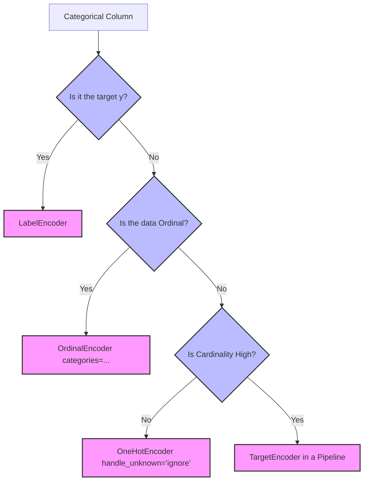

import Tabs from '@theme/Tabs';
import TabItem from '@theme/TabItem';
import React from 'react';

# Encoding Categorical Data

export const EncoderSandbox = () => {
  const [method, setMethod] = React.useState('label');
  const getEncoding = () => {
    if (method === 'label') {
      return {
        headers: ["Category", "Label Code"],
        rows: [
          ["Red", "0"],
          ["Green", "1"],
          ["Blue", "2"],
          ["Green", "1"]
        ],
        footprint: "1 column, small numeric values (0, 1, 2)"
      };
    } else if (method === 'onehot') {
      return {
        headers: ["Category", "Is_Red", "Is_Green", "Is_Blue"],
        rows: [
          ["Red", "1", "0", "0"],
          ["Green", "0", "1", "0"],
          ["Blue", "0", "0", "1"],
          ["Green", "0", "1", "0"]
        ],
        footprint: "3 columns, sparse representation recommended"
      };
    } else {
      return {
        headers: ["Category", "Bit_1", "Bit_0"],
        rows: [
          ["Red (0)", "0", "0"],
          ["Green (1)", "0", "1"],
          ["Blue (2)", "1", "0"],
          ["Green (1)", "0", "1"]
        ],
        footprint: "2 columns (ceil(log2(3)))"
      };
    }
  };
  const { headers, rows, footprint } = getEncoding();
  return (
    <div style={{ padding: '20px', border: '1px solid var(--ifm-color-emphasis-200)', borderRadius: '8px', backgroundColor: 'rgba(148, 163, 184, 0.05)', margin: '20px 0' }}>
      <h4 style={{ margin: '0 0 10px 0' }}>Live Encoder Sandbox</h4>
      <p style={{ margin: '0 0 15px 0', fontSize: '14px' }}>Toggle between different encoding schemes to see how the sample categorical array <code>["Red", "Green", "Blue", "Green"]</code> gets represented in the output matrix:</p>
      <div style={{ display: 'flex', gap: '10px', marginBottom: '20px' }}>
        <button onClick={() => setMethod('label')} style={{ padding: '8px 16px', borderRadius: '4px', border: '1px solid #3182ce', backgroundColor: method === 'label' ? '#3182ce' : 'transparent', color: method === 'label' ? '#fff' : 'var(--ifm-font-color-base)', cursor: 'pointer', transition: '0.2s', fontWeight: 'bold' }}>Label / Ordinal</button>
        <button onClick={() => setMethod('onehot')} style={{ padding: '8px 16px', borderRadius: '4px', border: '1px solid #3182ce', backgroundColor: method === 'onehot' ? '#3182ce' : 'transparent', color: method === 'onehot' ? '#fff' : 'var(--ifm-font-color-base)', cursor: 'pointer', transition: '0.2s', fontWeight: 'bold' }}>One-Hot</button>
        <button onClick={() => setMethod('binary')} style={{ padding: '8px 16px', borderRadius: '4px', border: '1px solid #3182ce', backgroundColor: method === 'binary' ? '#3182ce' : 'transparent', color: method === 'binary' ? '#fff' : 'var(--ifm-font-color-base)', cursor: 'pointer', transition: '0.2s', fontWeight: 'bold' }}>Binary</button>
      </div>
      <table style={{ width: '100%', borderCollapse: 'collapse', marginBottom: '15px' }}>
        <thead>
          <tr style={{ borderBottom: '2px solid var(--ifm-color-emphasis-300)' }}>
            {headers.map((h, i) => (
              <th key={i} style={{ padding: '8px', textAlign: 'left', fontSize: '13px' }}>{h}</th>
            ))}
          </tr>
        </thead>
        <tbody>
          {rows.map((r, i) => (
            <tr key={i} style={{ borderBottom: '1px solid var(--ifm-color-emphasis-200)' }}>
              {r.map((v, j) => (
                <td key={j} style={{ padding: '8px', fontSize: '13px', fontWeight: j > 0 ? 'bold' : 'normal', color: j > 0 && v === '1' ? '#38a169' : 'inherit' }}>{v}</td>
              ))}
            </tr>
          ))}
        </tbody>
      </table>
      <div style={{ fontSize: '12px', color: 'var(--ifm-color-emphasis-600)', fontStyle: 'italic' }}>
        <strong>Dimensionality footprint:</strong> {footprint}
      </div>
    </div>
  );
};

export const PracticeQuiz = () => {
  const [selected, setSelected] = React.useState(null);
  return (
    <div style={{ padding: '20px', border: '1px solid var(--ifm-color-emphasis-200)', borderRadius: '8px', backgroundColor: 'rgba(148, 163, 184, 0.05)', margin: '20px 0' }}>
      <h4 style={{ margin: '0 0 10px 0' }}>Interactive Checkpoint: Target Leakage</h4>
      <p style={{ margin: '0 0 15px 0' }}>Why does naive target encoding result in a heavily overfitted 0.71+ cross-validation score on completely random target labels?</p>
      <div style={{ display: 'flex', flexDirection: 'column', gap: '10px' }}>
        <button onClick={() => setSelected('opt1')} style={{ padding: '10px', borderRadius: '4px', border: '1px solid #3182ce', textAlign: 'left', backgroundColor: selected === 'opt1' ? '#e53e3e' : 'transparent', color: selected === 'opt1' ? '#fff' : 'var(--ifm-font-color-base)', cursor: 'pointer', transition: '0.2s' }}>Option A: The model is highly complex and has memorized the random seed.</button>
        <button onClick={() => setSelected('opt2')} style={{ padding: '10px', borderRadius: '4px', border: '1px solid #3182ce', textAlign: 'left', backgroundColor: selected === 'opt2' ? '#38a169' : 'transparent', color: selected === 'opt2' ? '#fff' : 'var(--ifm-font-color-base)', cursor: 'pointer', transition: '0.2s' }}>Option B: Calculating means over the whole dataset before splitting leaks each row's target y into its own feature X.</button>
        <button onClick={() => setSelected('opt3')} style={{ padding: '10px', borderRadius: '4px', border: '1px solid #3182ce', textAlign: 'left', backgroundColor: selected === 'opt3' ? '#e53e3e' : 'transparent', color: selected === 'opt3' ? '#fff' : 'var(--ifm-font-color-base)', cursor: 'pointer', transition: '0.2s' }}>Option C: Cross-validation has an inherent bug when evaluating target encoding.</button>
      </div>
      {selected === 'opt1' && <p style={{ color: '#e53e3e', marginTop: '15px', fontWeight: 'bold', fontSize: '14px', marginBottom: '0' }}>Incorrect. The model used is simple Logistic Regression; the issue lies in how features were encoded, not model capacity.</p>}
      {selected === 'opt2' && <p style={{ color: '#38a169', marginTop: '15px', fontWeight: 'bold', fontSize: '14px', marginBottom: '0' }}>Correct! Computing category target means across all rows incorporates the target value of the row itself, creating a severe data leak.</p>}
      {selected === 'opt3' && <p style={{ color: '#e53e3e', marginTop: '15px', fontWeight: 'bold', fontSize: '14px', marginBottom: '0' }}>Incorrect. Cross-validation works perfectly. The problem is that the leak happened BEFORE cross-validation split the data, so the leakage is present in all validation folds.</p>}
    </div>
  );
};

> **Topic -** Two pages ago `X` came out with `dtype('O')` because `Country` sits beside two numeric
> columns. This page fixes that. The easy part is making the text numeric; the hard part is doing it
> **without telling the model something false**.

Every encoding scheme is a trade between three things: how many columns it creates, whether it
invents an ordering, and whether it leaks. There is no scheme that wins all three.

---

## Why encoding is needed at all

Many machine learning algorithms - especially those built on mathematical operations, like linear
regression or neural networks - can only handle **numerical input**. `'France'` is not a number, and
there is no arithmetic that makes it one.

There is a second, weaker reason: numerical data is processed **more efficiently** than text, with
less memory. The previous page measured this - an `object` array summed **28× slower** than a
`float64` one, and a text column cost **98.4% more memory** than the same column as `category`.

So encoding is not optional. The question is only which scheme, and what each one costs.

<EncoderSandbox />

---

## Label encoding - and what it actually claims

**Label encoding assigns a unique integer to each category.** A feature `Color` with
`["Red", "Green", "Blue"]` might become `[0, 1, 2]`.

```python
le = LabelEncoder()
y = le.fit_transform(["No", "Yes", "No", "Yes"])     # -> [0, 1, 0, 1]
```

One column in, one column out. It is the cheapest possible encoding, and for a **binary target** like
`Purchased` it is exactly right.

The problem is what those integers assert. Writing `Red=0, Green=1, Blue=2` tells any model that
consumes it three things that are not true:

*   Blue **is greater than** Red
*   Green sits **exactly between** Red and Blue
*   Blue is **twice** Green

For genuinely **ordinal** data - `low < medium < high` - those claims are fine, because the order is
real. For **nominal** data - cities, colours, countries - they are fabrications. This is the
nominal/ordinal distinction from [Types of Learning](../01-foundations/03-types-of-learning.mdx#numeric-and-categorical-data),
and this is where it starts costing you accuracy.

### How much does it cost? It depends entirely on the model

Here is the measurement. Six cities each shift the outcome, and the effects **alternate** along
alphabetical order - the order every encoder numbers by - so no single threshold on the integer code
can separate them:

```text title="Output"
     0 = Chennai     2.5
     1 = Delhi      -2.0
     2 = Jaipur      2.4
     3 = Kolkata    -1.8
     4 = Mumbai      2.2
     5 = Pune       -2.1
     -> the sign flips at every step: no single cut separates them

   model                       label/ordinal   one-hot     gain
   LogisticRegression                 0.6737    0.9837  +0.3100
   Forest(max_depth=1)                0.6637    0.9837  +0.3200
   Forest(unrestricted)               0.9837    0.9837  +0.0000
   majority-class baseline: 0.5063
```

Three very different answers to "does label encoding hurt?":

**Logistic regression: it cost 31 accuracy points.** A linear model fits one coefficient per feature,
so it can only express "higher code $\to$ higher probability". Against alternating effects, that is
useless - `0.6737` against a `0.5063` baseline is barely better than guessing.

**A depth-1 forest: 32 points.** Same reason. One split on the integer axis cannot carve out three
separate positive regions.

**An unrestricted forest: no difference whatsoever.** `0.9837` either way. Given enough depth a tree
can split the integer axis repeatedly - `code ≤ 0.5`, then `1.5 < code ≤ 2.5`, and so on - and
reconstruct exactly the grouping one-hot would have handed it directly. The false ordering is still
there; the model just has the capacity to work around it.

:::tip

**The rule, stated properly**

Label encoding nominal data is **safe for unrestricted tree ensembles** and **damaging for linear
models, distance-based models (kNN, SVM), and neural networks**.

"Always one-hot encode" is not quite right, and "trees don't care" is only true when they're deep
enough to undo the damage. If you don't want to reason about it every time, one-hot is the safe
default - it never invents an order for any model.

:::

### `LabelEncoder` is for targets, not features

A genuine API point that trips people up: scikit-learn's `LabelEncoder` is documented for encoding
**target values `y`**, and its signature reflects that - it takes a 1-D array, not a 2-D matrix.

| Encoding | Use | Shape |
|---|---|---|
| `LabelEncoder` | The **target** `y` | 1-D |
| `OrdinalEncoder` | **Features** `X` | 2-D |

They do the same arithmetic. Using `LabelEncoder` in a loop over feature columns works but fights the
API, can't live in a `ColumnTransformer`, and won't participate in a `Pipeline`. Use `OrdinalEncoder`
for features.

### For real ordinal data, state the order

If the order *is* real, don't let the encoder guess it:

```python
OrdinalEncoder().fit(sizes)                                       # alphabetical
OrdinalEncoder(categories=[["low", "medium", "high"]]).fit(sizes) # yours
```

```text title="Output"
default (alphabetical): ['high', 'low', 'medium']
   -> [2.0, 1.0, 0.0, 1.0]   'high'=0, 'low'=1: meaningless
explicit order:         ['low', 'medium', 'high']
   -> [1.0, 0.0, 2.0, 0.0]   'low'=0 < 'medium'=1 < 'high'=2
```

By default it sorts alphabetically, which puts `high` before `low` and destroys the very ordering that
made ordinal encoding appropriate. **If a column is ordinal, always pass `categories=` explicitly.**

---

## One-hot encoding

**One-hot encoding creates a binary column for each category** - `1` marking the presence of that
category, `0` its absence.

For a `Neighborhood` feature with `"Downtown"`, `"Suburb"` and `"Countryside"`:

1.  **Identify the categories** - three distinct values
2.  **Create a binary column for each** - `Neighborhood_Downtown`, `Neighborhood_Suburb`,
    `Neighborhood_Countryside`
3.  **Convert to binary values** - put `1` in the column matching each row, `0` in the others

```text
France  ->  1  0  0
Germany ->  0  1  0
Spain   ->  0  0  1
```

Every category is now **equidistant** from every other. No ordering is implied, which is exactly the
property label encoding lacked.

### Applying it to some columns only

Real data mixes types, so you rarely want to transform everything. `ColumnTransformer` applies
different transformations to different columns:

```python
ct = ColumnTransformer(
    transformers=[("encoder", OneHotEncoder(), [0])],
    remainder="passthrough")
X = ct.fit_transform(X)
```

| Piece | Meaning |
|---|---|
| `"encoder"` | An arbitrary name for this transformation |
| `OneHotEncoder()` | The transformation to apply |
| `[0]` | Apply it to the column at index `0` |
| `remainder="passthrough"` | Leave every unlisted column **unchanged** |

The default is `remainder="drop"`, which silently discards every column you didn't name - a common
and confusing loss. `"passthrough"` is almost always what you want.

:::note

**Prefer column names over positions**

`[0]` breaks the moment a column is inserted upstream. `make_column_transformer` with names, or
`make_column_selector(dtype_include=object)`, expresses the intent instead of the position:

```python
ct = make_column_transformer(
    (OneHotEncoder(handle_unknown="ignore"), make_column_selector(dtype_include=object)),
    remainder="passthrough")
```

This also survives adding a new categorical column later, which the index form does not.

:::

### The dummy variable trap

One-hot columns carry a built-in redundancy. For example, if we have columns for Chennai, Delhi, and Mumbai, their values for any given row will always sum to exactly 1:

$$\text{Chennai} + \text{Delhi} + \text{Mumbai} = 1$$

Because of this equation, any one column is perfectly predictable if we know the others:

$$\text{Mumbai} = 1 - \text{Chennai} - \text{Delhi}$$

This creates **perfect multicollinearity** (the dummy variable trap). For unregularized linear models (Ordinary Least Squares), this makes the matrix inversion unstable and the coefficients unidentifiable - infinitely many combinations give the same predictions.

The fix is to drop one column, keeping $N-1$ columns:

```text title="Output"
drop='first'  ['city_Delhi', 'city_Mumbai']
[[0. 0.]
 [0. 1.]
 [1. 0.]
 [0. 0.]]
Chennai is now encoded as all-zeros — the 'reference' category
```

The dropped category becomes the **reference**, encoded as all zeros, and every remaining coefficient
reads as "relative to Chennai". No information is lost.

#### Dummy Variable Trap Equation Annotator
Explore the mathematics of the trap below:

<Tabs>
  <TabItem value="collinear" label="Perfect Collinearity" default>
    <br/>
    
    *   **The Equation:** $x_k = 1 - \sum_{j \neq k} x_j$
    *   **Mathematical Significance:** One feature column can be written as a perfect linear combination of other columns. The feature matrix $X$ lacks full column rank, making $X^T X$ non-invertible.
  </TabItem>
  <TabItem value="reference" label="Reference Category">
    <br/>
    
    *   **The Fix:** Dropping one column (using `drop="first"`) resolves the redundancy.
    *   **Mathematical Significance:** The dropped category (e.g., Chennai) becomes the **baseline/reference category** (represented as all zeros). Every other coefficient represents a shift relative to this baseline.
  </TabItem>
</Tabs>

| Situation | Drop a column? |
|---|---|
| Linear regression, statistical inference on coefficients | **Yes** - `drop="first"` |
| Regularised models (ridge, lasso, logistic with a penalty) | Not required - the penalty resolves it |
| Trees, forests, boosting | **No** - dropping just hides a category |
| You want interpretable per-category coefficients | Yes, and choose the reference deliberately |

---

## What cardinality costs

One-hot's weakness is the column count. With `k` categories you get `k` columns:

```text title="Output"
2. COST OF CARDINALITY — one column, 50,000 rows
    categories  one-hot cols   dense MB  sparse MB  binary cols
             3             3        1.2        0.8            2
            10            10        4.0        0.8            4
            50            50       20.0        0.8            6
           256           256      102.4        0.8            8
          1000          1000      400.0        0.8           10
```

**1,000 categories became 1,000 columns and 400 MB.** From one column of 50,000 values.

But look at the sparse figure: **0.8 MB, flat, regardless of cardinality.** One-hot output is
overwhelmingly zeros - exactly one `1` per row - so a sparse matrix stores only the non-zeros. At
1,000 categories that's a **500× reduction**, and the memory doesn't grow with the number of
categories at all.

:::tip

**`sparse_output=True` is the default, and worth keeping**

`OneHotEncoder` returns a sparse matrix unless you ask otherwise. The `sparse_output=False` in these
examples is purely so the arrays print readably.

Most scikit-learn estimators accept sparse input directly. If you're calling `.toarray()` or
`sparse_output=False` on a high-cardinality column, you are converting `0.8 MB` into `400 MB` for no
benefit. The "one-hot explodes" warning is about **columns**, not memory - provided you stay sparse.

:::

### Binary encoding

**Binary encoding** compresses in two steps: assign each category an integer, then convert that
integer to binary and give **each bit its own column**.

Compared with one-hot, which needs a separate column per category, binary encoding uses far fewer:
**256 categories need 256 one-hot columns but only 8 binary columns**, since 256 requires 8 bits. The
measured `binary cols` figure above is exactly $\lceil \log_2(k) \rceil$.

The catch, and the reason it's less common than its arithmetic suggests: the bit columns are
**arbitrary**. Bit 3 groups together every category whose code has that bit set - a grouping with no
meaning. It's a compression trick, not a representation, and it's largely been displaced by target
encoding and by models that handle categories natively.

### Frequency encoding

Replace each category with **how often it occurs**. One column, any cardinality, no ordering
invented - though two genuinely different categories with similar frequencies collapse to nearly the
same value. Cheap, and often a surprisingly strong baseline for high-cardinality features.

---

## Target encoding, and the leak inside it

**Target encoding** replaces each category with the **mean of the target** for that category. One
column, any cardinality, and it directly encodes the relationship you care about. It is the standard
choice for high-cardinality features, and it is **dangerous**.

The problem: it uses $y$. If you compute category means from the whole dataset and then evaluate, each
row's encoded value was partly computed **from its own target**.

Here is how bad that is. A feature of 500 random categories, a **completely random target**, 2,000
rows - so about 4 rows per category. The feature carries **no information at all**; any honest method
must score around `0.50`:

```text title="Output"
4. TARGET ENCODING ON A PURE-NOISE FEATURE (a perfect method scores ~0.50)
   2000 rows, 500 categories (~4 rows each), target is RANDOM
   naive — category means from all the data           0.7095   <- LEAKED
   TargetEncoder in a Pipeline (cross-fitted)         0.4935
```

**Naive target encoding scored 0.7095 on pure noise.** It manufactured 21 points of accuracy from a
feature with nothing in it. With ~4 rows per category, each category's mean is essentially a copy of
those 4 targets - so the "feature" is a lightly blurred version of $y$, smuggled into $X$.

Cross-validation did not catch it, because the leak happened **before** the split.

:::danger

**This is the most dangerous encoding in common use**

The failure mode is the worst kind: your validation score goes **up**, so it looks like success.
Production performance then collapses, because at predict time there is no target to leak from.

Use scikit-learn's `TargetEncoder`, which **cross-fits internally** - each row's encoding is computed
from *other* rows only - and put it inside a `Pipeline` so it refits within every fold. That scored
`0.4935`, correctly identifying the feature as worthless.

Never compute category means over your full dataset by hand.

:::

<PracticeQuiz />

---

## A category the encoder has never seen

Training data has three cities; a request arrives for a fourth. This is a routine production event and
most encoders **crash**:

```text title="Output"
3. UNSEEN CATEGORY AT PREDICT TIME
   CRASH   LabelEncoder
              -> ValueError: y contains previously unseen labels: 'Kolkata'
   CRASH   OrdinalEncoder (default)
              -> ValueError: Found unknown categories ['Kolkata'] in column 0
   OK      OrdinalEncoder(handle_unknown='use_encoded_value')
              -> [[0.0], [-1.0]]
   CRASH   OneHotEncoder (default)
              -> ValueError: Found unknown categories ['Kolkata'] in column 0
   OK      OneHotEncoder(handle_unknown='ignore')
              -> [[1.0, 0.0, 0.0], [0.0, 0.0, 0.0]]
```

Three of five fail by default. The two that survive behave sensibly:

*   `OneHotEncoder(handle_unknown="ignore")` emits **all zeros** - "none of the known categories",
    which is honest and keeps the column count stable
*   `OrdinalEncoder(handle_unknown="use_encoded_value", unknown_value=-1)` emits `-1`, a code outside
    the training range

`LabelEncoder` has **no** `handle_unknown` parameter at all - another reason it belongs on targets,
where the label set is closed.

:::warning

**Set `handle_unknown="ignore"` unless you want the crash**

Crashing is occasionally the right choice - if an unknown category means upstream corruption, failing
loudly beats predicting quietly. But it should be a decision, not a default you discover in
production. A rare category absent from your training split is enough to trigger it.

:::

---

## Choosing an Encoding Scheme

| Scheme | Columns | Invents order? | Handles high cardinality | Leaks? | Use when |
|---|---|---|---|---|---|
| **Label / Ordinal** | 1 | **Yes** | Yes | No | Genuinely ordinal data; targets; deep tree ensembles |
| **One-hot** | $k$ | No | Poorly (columns) | No | **The safe default** for nominal data |
| **One-hot, `drop="first"`** | $k-1$ | No | Poorly | No | Linear models; coefficient interpretation |
| **Binary** | $\lceil \log_2 k \rceil$ | Arbitrary groupings | Well | No | Legacy compression |
| **Frequency** | 1 | No | Well | No | Cheap high-cardinality baseline |
| **Target** | 1 | No | **Well** | **Yes, without care** | High cardinality - via `TargetEncoder` in a `Pipeline` |



A workable default policy:

1.  **Ordinal data** $\to$ `OrdinalEncoder(categories=[...])` with the order stated
2.  **Nominal, few categories** $\to$ `OneHotEncoder(handle_unknown="ignore")`, sparse
3.  **Nominal, many categories** $\to$ `TargetEncoder` in a `Pipeline`, or frequency encoding
4.  **Binary target** $\to$ `LabelEncoder`
5.  **Unsure** $\to$ one-hot; it is the only scheme that asserts nothing false

---

## Implementation Lab

:::tip

**Lab Exercise: Categorical Encoding**

An interactive, fully-functional Google Colab / Jupyter Notebook is available to experiment with these concepts live in your browser.

<a href="https://colab.research.google.com/github/vettrivel-kl/vettrivel-kl.github.io/blob/master/static/labs/02-data-preprocessing/encoding_categorical.ipynb" target="_blank" rel="noopener noreferrer">
  
</a>

**How to run the lab:**
1. Click the **"Open In Colab"** badge above to launch the interactive notebook.
2. Click **"Run all"** or execute cells individually using `Shift + Enter`.

**Things to try inside the script:**
*   **Experiment 1:** Check how changing the category alignment or sorting impacts model accuracy.
*   **Experiment 2:** Observe the memory footprint drop of 500x when switching from dense to sparse arrays with high cardinality.
*   **Experiment 3:** Intentionally bypass the cross-fitted pipeline of the `TargetEncoder` and observe how accuracy on random labels leaks up to 0.70+.

:::

### Comparative Implementation (Production vs. Scratch)

Compare a robust production target encoder pipeline against a manual (naive) lookup target encoder:

<Tabs>
  <TabItem value="sklearn" label="Production (Scikit-Learn Pipeline)" default>
    <br/>
    
    ```python
    from sklearn.pipeline import make_pipeline
    from sklearn.preprocessing import TargetEncoder
    from sklearn.linear_model import LogisticRegression
    
    # Safe cross-fitted encoding within cross-validation loop
    model = make_pipeline(
        TargetEncoder(target_type="binary"),
        LogisticRegression()
    )
    ```
  </TabItem>
  <TabItem value="scratch" label="Manual Naive (Dangerous Leak)">
    <br/>
    
    ```python
    # DANGEROUS: Leaks future target information because means
    # are calculated over the whole dataset before train-test split
    means = df.groupby("city")["target"].mean()
    df["city_encoded"] = df["city"].map(means)
    ```
  </TabItem>
</Tabs>

---

## Common Mistakes

Explore some of the most critical engineering pitfalls in categorical data encoding and how to avoid them:

<Tabs>
  <TabItem value="leakage" label="Pitfall 1: Target Leakage" default>
    <br/>
    
    *   **The Misconception:** *"Computing category means over the whole dataset or before train-test split is fine as long as I run cross-validation."*
    *   **Wrong Thinking:** Standard cross-validation cannot catch leaks that occurred **before** the split. Naive target encoding will score ~0.71+ on pure noise.
    *   **The Right Principle:** Always use a cross-fitted encoder like scikit-learn's `TargetEncoder` and place it inside a `Pipeline` so fitting is strictly isolated within training folds.
  </TabItem>
  <TabItem value="nominal" label="Pitfall 2: Nominal Labeling">
    <br/>
    
    *   **The Misconception:** *"Encoding Red=0, Green=1, Blue=2 is safe for any model because they are just numbers."*
    *   **Wrong Thinking:** This tells linear/distance-based models that `Blue > Red` and `Green` is exactly in-between, costing over 30 points of accuracy.
    *   **The Right Principle:** Nominal data (no real order) should be **one-hot encoded** by default. Use label/ordinal encoding only for deep trees or genuinely ordinal features (with explicit ordering passed via `categories=[...]`).
  </TabItem>
  <TabItem value="api" label="Pitfall 3: API Misuse">
    <br/>
    
    *   **The Misconception:** *"I can use LabelEncoder in a loop over my feature matrix X."*
    *   **Wrong Thinking:** `LabelEncoder` is strictly designed for 1-D targets (`y`). Using it on features violates the scikit-learn pipeline API and breaks `ColumnTransformer`.
    *   **The Right Principle:** Always use `OrdinalEncoder` for 2-D features (`X`), which integrates seamlessly into pipeline transformers.
  </TabItem>
  <TabItem value="dummy" label="Pitfall 4: Dummy Variable Trap">
    <br/>
    
    *   **The Misconception:** *"I should always drop the first column (drop='first') in one-hot encoding."*
    *   **Wrong Thinking:** While dropping is mandatory for Ordinary Least Squares (linear models) to prevent perfect multicollinearity, dropping columns for tree-based models or regularized models is counterproductive as it forces trees to split multiple times to reconstruct the dropped category.
    *   **The Right Principle:** Use `drop="first"` strictly for unregularized linear models, and retain all `k` columns for trees and regularized estimators.
  </TabItem>
  <TabItem value="memory" label="Pitfall 5: Memory Blowups">
    <br/>
    
    *   **The Misconception:** *"One-hot encoding is always safe because the data size is small."*
    *   **Wrong Thinking:** If you have high cardinality (e.g. 1000 categories) and convert the output to a dense array (`sparse_output=False` or `.toarray()`), a single column can explode from 0.8 MB to 400 MB.
    *   **The Right Principle:** Keep the default `sparse_output=True` (formerly `sparse=True`). Most scikit-learn models process sparse matrices natively with zero overhead.
  </TabItem>
</Tabs>

---

## Summary

<div className="row">
  <div className="col col--6">
    <div className="card" style={{ height: '100%', marginBottom: '15px' }}>
      <div className="card__header" style={{ padding: '15px', borderBottom: '1px solid var(--ifm-color-emphasis-200)' }}>
        <h3>Encoder Selection</h3>
      </div>
      <div className="card__body" style={{ padding: '15px' }}>
        <ul>
          <li><b>Ordinal Features:</b> Use <code>OrdinalEncoder(categories=[[...]]);</code> explicitly state the sequence to avoid arbitrary alphabetical order.</li>
          <li><b>Nominal Features (Low k):</b> Use <code>OneHotEncoder(handle_unknown="ignore")</code>. Keep sparse output enabled to avoid memory blowup.</li>
          <li><b>Nominal Features (High k):</b> Use <code>TargetEncoder()</code> inside a <code>Pipeline</code> to automatically prevent data leakage through cross-fitting.</li>
        </ul>
      </div>
    </div>
  </div>
  <div className="col col--6">
    <div className="card" style={{ height: '100%', marginBottom: '15px' }}>
      <div className="card__header" style={{ padding: '15px', borderBottom: '1px solid var(--ifm-color-emphasis-200)' }}>
        <h3>Production Guardrails</h3>
      </div>
      <div className="card__body" style={{ padding: '15px' }}>
        <ul>
          <li><b>Unseen Categories:</b> Set <code>handle_unknown="ignore"</code> to return all zeros rather than crashing during live inference.</li>
          <li><b>Dummy Variable Trap:</b> Use <code>drop="first"</code> strictly for unregularized linear regression; avoid dropping for trees.</li>
          <li><b>Pipeline Integrity:</b> Never hand-compute target encodings. Encapsulate all transformations in a <code>Pipeline</code>.</li>
        </ul>
      </div>
    </div>
  </div>
</div>

<br/>

:::info

**Key Takeaways**

*   **False ordering penalty:** Label encoding nominal data hurts linear models (−31 points accuracy) and shallow tree models (−32 points) because they cannot map alternating signs.
*   **Capacity solves ordering:** Unrestricted tree ensembles suffer zero penalty from false orderings because deep splits route around the integer mapping perfectly.
*   **Target encoding danger:** Naive target encoding generates 21 points of fake accuracy (0.71 vs 0.50) on pure noise; cross-fitted `TargetEncoder` correctly scores 0.49.

:::

**Next in this section:** [Feature Scaling and Transformation](./04-feature-scaling-and-transformation.mdx)

**See also:** [Types of Learning](../01-foundations/03-types-of-learning.mdx#numeric-and-categorical-data)
for nominal versus ordinal · [Loading and Preparing Data](./01-loading-and-preparing-data.mdx#should-you-convert-to-numpy-at-all)
for why `X` was `object` · [Missing Values](./02-missing-values.mdx) for handling gaps before this step

---

## Active Recall Flashcards

*Attempt each question first, then click to reveal detailed answers, mathematical derivations, and sample explanations.*

<details>
  <summary><b>1. [THEORY] Why must categorical data be encoded, and why is numerical representation more efficient?</b></summary>
  <div className="answer-content">
    <br/>
    
    *   **Requirement:** Machine learning algorithms built on mathematical operations (like linear regression or neural networks) require numbers for matrix arithmetic. Text categories have no intrinsic mathematical value.
    *   **Efficiency:** Numerical representation leverages low-level contiguous memory blocks. In Pandas, an `object` array of text strings is **28× slower** to sum and consumes **98.4% more memory** than an optimized categorical or numeric array.
  </div>
</details>

<details>
  <summary><b>2. [THEORY] What three false assumptions does label encoding nominal data Red=0, Green=1, Blue=2 make?</b></summary>
  <div className="answer-content">
    <br/>
    
    Assigning sequential integers asserts:
    1.  **Ordered magnitude:** Blue is greater than Red ($2 > 0$).
    2.  **Even spacing:** Green ($1$) is exactly halfway between Red ($0$) and Blue ($2$).
    3.  **Scale/ratio:** Blue ($2$) is twice as much as Green ($1$).
    
    For nominal features like colors or cities, these mathematical relations are completely artificial and mislead distance-based or linear estimators.
  </div>
</details>

<details>
  <summary><b>3. [ANALYZE] Why does label encoding nominal data damage linear models (-31 points accuracy) but leave unrestricted trees unaffected?</b></summary>
  <div className="answer-content">
    <br/>
    
    *   **Linear/Distance models:** Fit a single coefficient or measure straight-line distance. They assume a monotonic relationship: higher integer $\to$ higher output. Against alternating non-monotonic categorical effects, this assumption completely fails.
    *   **Unrestricted Trees:** Do not assume monotonicity. Given enough depth, a tree split can isolate individual category integers (e.g. `code <= 0.5`, then `1.5 < code <= 2.5`), reconstructing the exact representation that one-hot encoding would provide directly.
  </div>
</details>

<details>
  <summary><b>4. [THEORY] What is the difference between LabelEncoder and OrdinalEncoder in scikit-learn?</b></summary>
  <div className="answer-content">
    <br/>
    
    While both map strings to unique integers:
    *   `LabelEncoder` is built strictly for the **target vector `y`** (expects a 1-D array) and does not support 2-D feature structures.
    *   `OrdinalEncoder` is built for **feature matrix `X`** (expects a 2-D array), supports multi-column configurations, and integrates seamlessly into `ColumnTransformer` and `Pipeline` objects.
  </div>
</details>

<details>
  <summary><b>5. [THEORY] What is perfect multicollinearity (the dummy variable trap) and how does drop="first" fix it?</b></summary>
  <div className="answer-content">
    <br/>
    
    *   **Perfect Multicollinearity:** Since all one-hot encoded columns sum to exactly 1 ($\sum_{j=1}^k x_j = 1$), any single column can be perfectly predicted by subtracting the sum of the others from 1. 
    *   **The Trap:** This linear dependency prevents matrix inversion in Ordinary Least Squares (OLS) linear regression because the feature matrix $X^T X$ becomes singular (non-invertible).
    *   **The Fix:** Using `drop="first"` drops one category to serve as the baseline reference, breaking the dependency and restoring full column rank.
  </div>
</details>

<details>
  <summary><b>6. [ANALYZE] For which models is drop="first" necessary, and for which is it counterproductive?</b></summary>
  <div className="answer-content">
    <br/>
    
    *   **Necessary:** Mandatory for unregularized linear models (like Ordinary Least Squares) to avoid singular matrices.
    *   **Counterproductive:** Unnecessary and harmful for **tree-based models** (as dropping a category forces trees to make multiple splits to reconstruct the dropped baseline) and **regularized linear models** (where L1/L2 penalties naturally resolve multicollinearity).
  </div>
</details>

<details>
  <summary><b>7. [ANALYZE] Why does one-hot encoding memory stay flat at 0.8 MB for sparse output while exploding to 400 MB for dense output at 1,000 categories?</b></summary>
  <div className="answer-content">
    <br/>
    
    *   **Dense Representation:** Allocates memory for every single cell (including all 999 zeros per row). At 50,000 rows and 1,000 categories, this creates a $50,000 \times 1,000$ matrix, requiring 400 MB.
    *   **Sparse Representation:** Only stores coordinates and values of **non-zero** entries. Since every one-hot row contains exactly one `1`, only 50,000 entries are stored regardless of whether there are 3 categories or 1,000, keeping memory perfectly flat.
  </div>
</details>

<details>
  <summary><b>8. [THEORY] Describe how naive target encoding introduces target leakage, and how cross-fitting prevents it.</b></summary>
  <div className="answer-content">
    <br/>
    
    *   **Naive Target Leakage:** If you compute the target mean for category `A` over the whole dataset, each row's feature value includes its own target label `y`. The model can memorize this "blurred target" to score 0.71+ on pure noise.
    *   **Cross-Fitting:** Scikit-learn's `TargetEncoder` splits the data internally. For any given row, its categorical value is replaced with the mean target calculated strictly from the **other** folds, making it impossible for a row's encoding to contain its own target.
  </div>
</details>

<details>
  <summary><b>9. [THEORY] What happens by default when an encoder meets an unseen category at prediction time, and how do you resolve it?</b></summary>
  <div className="answer-content">
    <br/>
    
    *   **Default Behavior:** Most encoders (like `OneHotEncoder` or `OrdinalEncoder`) will raise a `ValueError` and crash the system.
    *   **Resolution:**
        *   For `OneHotEncoder`, set `handle_unknown="ignore"`, which outputs all zeros (representing none of the known categories).
        *   For `OrdinalEncoder`, set `handle_unknown="use_encoded_value"` and specify `unknown_value=-1`.
  </div>
</details>

<details>
  <summary><b>10. [ANALYZE] How many columns does binary encoding produce for 256 categories, and what is its main drawback?</b></summary>
  <div className="answer-content">
    <br/>
    
    *   **Column Count:** It produces $\lceil \log_2(256) \rceil = 8$ columns.
    *   **Drawback:** The resulting bit patterns are completely arbitrary. A split or weight on a specific bit column groups together unrelated categories that happen to share a binary bit (e.g. category 3 and 11), creating arbitrary non-sensical clusters that hinder model performance.
  </div>
</details>
