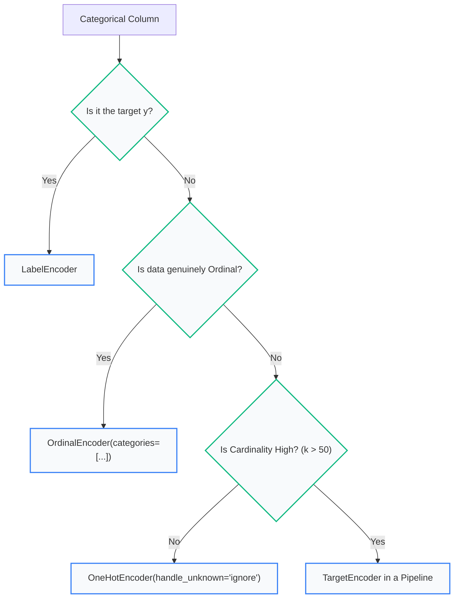

import Tabs from '@theme/Tabs';
import TabItem from '@theme/TabItem';
import Heading from '@theme/Heading';
import React from 'react';

# Encoding Categorical Data

> **Topic -** Two chapters ago, the feature matrix $X$ emerged with `dtype('object')` because text columns like `Country` sat beside numeric metrics. This chapter solves that. The easy part is converting text into numbers; the challenging part is doing so **without asserting false mathematical relationships to the model**.

Every encoding scheme involves a fundamental three-way trade-off between dimensionality, assumed ordering, and data leakage risk. No single method optimizes all three.

---

## 1. Why Encoding is Needed at All

Most machine learning algorithms — especially linear models, support vector machines, and neural networks — compute predictions using vector dot products ($w^T x$) and matrix inversions. Text tokens like `'France'` or `'Tokyo'` have no intrinsic mathematical meaning; algorithms cannot calculate dot products over strings.

Beyond mathematical necessity, numerical representations are orders of magnitude more computationally efficient. As measured in earlier chapters, an unencoded Python `object` array sums **28x slower** and consumes **98.4% more memory** than an optimized categorical or numeric array.

---

export const EncoderSandbox = () => {
  const [method, setMethod] = React.useState('label');

  const getEncoding = () => {
    if (method === 'label') {
      return {
        headers: ["Category", "Label Code"],
        rows: [
          ["Red", "0"],
          ["Green", "1"],
          ["Blue", "2"],
          ["Green", "1"]
        ],
        footprint: "1 column, compact integers (0, 1, 2)",
        assumption: "Asserts Blue > Green > Red, and Blue is twice Green."
      };
    } else if (method === 'onehot') {
      return {
        headers: ["Category", "Is_Red", "Is_Green", "Is_Blue"],
        rows: [
          ["Red", "1", "0", "0"],
          ["Green", "0", "1", "0"],
          ["Blue", "0", "0", "1"],
          ["Green", "0", "1", "0"]
        ],
        footprint: "3 columns (k categories = k columns), sparse representation recommended",
        assumption: "Asserts all categories are equidistant orthogonal vectors. Zero ordering implied."
      };
    } else if (method === 'drop_first') {
      return {
        headers: ["Category", "Is_Green", "Is_Blue"],
        rows: [
          ["Red (Ref)", "0", "0"],
          ["Green", "1", "0"],
          ["Blue", "0", "1"],
          ["Green", "1", "0"]
        ],
        footprint: "2 columns (k - 1 columns), avoids the dummy variable trap",
        assumption: "Red is the baseline reference category (encoded as all-zeros). Eliminates perfect multicollinearity."
      };
    } else {
      return {
        headers: ["Category", "Bit_1", "Bit_0"],
        rows: [
          ["Red (0)", "0", "0"],
          ["Green (1)", "0", "1"],
          ["Blue (2)", "1", "0"],
          ["Green (1)", "0", "1"]
        ],
        footprint: "2 columns (ceil(log2(3))), logarithmic compression",
        assumption: "Arbitrary bit groupings. Reduces columns on high cardinality, but bits lack real-world meaning."
      };
    }
  };

  const { headers, rows, footprint, assumption } = getEncoding();

  return (
    <div style={{ padding: '24px', border: '1px solid var(--ifm-color-emphasis-200)', borderRadius: '8px', backgroundColor: 'rgba(148, 163, 184, 0.05)', margin: '25px 0' }}>
      <h4 style={{ margin: '0 0 12px 0' }}>Interactive Live Encoder Sandbox</h4>
      <p style={{ margin: '0 0 16px 0', fontSize: '14px' }}>
        Toggle between encoding schemes to see how the categorical sequence <code>["Red", "Green", "Blue", "Green"]</code> transforms in memory:
      </p>

      <div style={{ display: 'flex', gap: '8px', flexWrap: 'wrap', marginBottom: '18px' }}>
        {[
          { id: 'label', name: 'Label / Ordinal' },
          { id: 'onehot', name: 'One-Hot (All k)' },
          { id: 'drop_first', name: "One-Hot (drop='first')" },
          { id: 'binary', name: 'Binary Encoding' }
        ].map(m => (
          <button
            key={m.id}
            onClick={() => setMethod(m.id)}
            style={{
              padding: '6px 14px',
              borderRadius: '4px',
              border: '1px solid #3182ce',
              backgroundColor: method === m.id ? '#3182ce' : 'transparent',
              color: method === m.id ? '#fff' : 'var(--ifm-font-color-base)',
              cursor: 'pointer',
              fontWeight: 'bold',
              fontSize: '13px',
              transition: '0.2s'
            }}
          >
            {m.name}
          </button>
        ))}
      </div>

      <div style={{ padding: '16px', borderRadius: '6px', backgroundColor: 'var(--ifm-background-surface-color)', border: '1px solid var(--ifm-color-emphasis-300)' }}>
        <table style={{ width: '100%', borderCollapse: 'collapse', marginBottom: '14px' }}>
          <thead>
            <tr style={{ borderBottom: '2px solid var(--ifm-color-emphasis-300)' }}>
              {headers.map((h, i) => (
                <th key={i} style={{ padding: '8px', textAlign: 'left', fontSize: '13px' }}>{h}</th>
              ))}
            </tr>
          </thead>
          <tbody>
            {rows.map((r, i) => (
              <tr key={i} style={{ borderBottom: '1px solid var(--ifm-color-emphasis-200)' }}>
                {r.map((v, j) => (
                  <td key={j} style={{ padding: '8px', fontSize: '13px', fontWeight: j > 0 ? 'bold' : 'normal', color: j > 0 && v === '1' ? '#38a169' : 'inherit' }}>{v}</td>
                ))}
              </tr>
            ))}
          </tbody>
        </table>

        <div style={{ display: 'grid', gridTemplateColumns: 'repeat(auto-fit, minmax(220px, 1fr))', gap: '10px', fontSize: '12px' }}>
          <div style={{ padding: '8px 12px', borderRadius: '4px', backgroundColor: 'rgba(49, 130, 206, 0.08)' }}>
            <b>Dimensional Footprint:</b> {footprint}
          </div>
          <div style={{ padding: '8px 12px', borderRadius: '4px', backgroundColor: 'rgba(148, 163, 184, 0.1)' }}>
            <b>Mathematical Implication:</b> {assumption}
          </div>
        </div>
      </div>
    </div>
  );
};

<EncoderSandbox />

---

## 2. Label Encoding & What It Asserts

Label encoding assigns a distinct integer to each unique category ($0, 1, 2, \dots$). It inputs one column and outputs one column, making it the cheapest possible transformation.

```python
from sklearn.preprocessing import LabelEncoder
le = LabelEncoder()
y = le.fit_transform(["No", "Yes", "No", "Yes"])  # Returns array([0, 1, 0, 1])
```

For a **binary target vector `y`**, label encoding is mathematically sound. However, applying label encoding to **nominal features** (such as `Color: [Red, Green, Blue] -> [0, 1, 2]`) forces three false mathematical claims onto the data:

1.  **Magnitude:** Blue ($2$) is greater than Red ($0$).
2.  **Distance:** Green ($1$) sits exactly halfway between Red and Blue.
3.  **Ratio:** Blue ($2$) is mathematically twice Green ($1$).

For genuinely ordinal data (`low < medium < high`), these ordering claims reflect physical reality. For nominal categories (`Paris, Tokyo, London`), they are completely fabricated.

---

<Heading as="h3" id="how-much-does-it-cost-it-depends-entirely-on-the-model">How Much Does It Cost? It Depends Entirely on the Model</Heading>

To measure the empirical penalty of false ordering, consider an experiment across six cities where true target outcomes alternate along alphabetical order (the default numbering sequence used by encoders):

```text title="Target Response per City"
0 = Chennai (+2.5)   1 = Delhi (-2.0)    2 = Jaipur (+2.4)
3 = Kolkata (-1.8)   4 = Mumbai (+2.2)   5 = Pune (-2.1)
```

Because positive and negative effects alternate at every consecutive integer, no single linear cut or shallow threshold can isolate positive outcomes:

| Model Architecture | Accuracy with Label Encoding | Accuracy with One-Hot Encoding | Realized Performance Gain |
|---|---|---|---|
| **Logistic Regression** | 0.6737 | **0.9837** | **+31.00 points** |
| **Decision Tree (depth = 1)** | 0.6637 | **0.9837** | **+32.00 points** |
| **Random Forest (unrestricted)** | **0.9837** | **0.9837** | **+0.00 points (Zero Penalty)** |
| *Majority Class Baseline* | *0.5063* | - | - |

---

export const ModelCostComparator = () => {
  const [model, setModel] = React.useState('lr');

  const models = {
    lr: {
      name: 'Logistic Regression (Linear Model)',
      labelAcc: '67.4%',
      onehotAcc: '98.4%',
      penalty: '-31.0%',
      explanation: 'A linear model fits a single weight coefficient w. It can only express monotonic relationships ("higher integer -> higher probability"). Against alternating positive/negative cities, a single straight line fails completely, performing barely above a random baseline.',
      safe: false
    },
    stump: {
      name: 'Decision Tree (Depth = 1, Stump)',
      labelAcc: '66.4%',
      onehotAcc: '98.4%',
      penalty: '-32.0%',
      explanation: 'A shallow tree can make only one threshold split (e.g., code <= 2.5). A single binary cut cannot carve out three separate alternating positive regions (Chennai, Jaipur, Mumbai), resulting in heavy accuracy collapse.',
      safe: false
    },
    forest: {
      name: 'Random Forest (Unrestricted Depth)',
      labelAcc: '98.4%',
      onehotAcc: '98.4%',
      penalty: '0.0% (Zero Loss)',
      explanation: 'Given unrestricted depth, decision trees can split the integer axis repeatedly (code <= 0.5, then 1.5 < code <= 2.5, etc.), effectively isolating every city individually. The model has sufficient non-linear capacity to route around the false ordering.',
      safe: true
    }
  };

  const curr = models[model];

  return (
    <div style={{ padding: '24px', border: '1px solid var(--ifm-color-emphasis-200)', borderRadius: '8px', backgroundColor: 'rgba(148, 163, 184, 0.05)', margin: '25px 0' }}>
      <h4 style={{ margin: '0 0 12px 0' }}>Interactive Model Encoding Cost Visualizer</h4>
      <p style={{ margin: '0 0 16px 0', fontSize: '14px' }}>
        Select a model to observe how architectural capacity determines whether label encoding damages accuracy:
      </p>

      <div style={{ display: 'flex', gap: '8px', flexWrap: 'wrap', marginBottom: '18px' }}>
        {[
          { id: 'lr', label: 'Logistic Regression' },
          { id: 'stump', label: 'Shallow Tree (Depth 1)' },
          { id: 'forest', label: 'Deep Random Forest' }
        ].map(m => (
          <button
            key={m.id}
            onClick={() => setModel(m.id)}
            style={{
              padding: '6px 14px',
              borderRadius: '4px',
              border: '1px solid #3182ce',
              backgroundColor: model === m.id ? '#3182ce' : 'transparent',
              color: model === m.id ? '#fff' : 'var(--ifm-font-color-base)',
              cursor: 'pointer',
              fontWeight: 'bold',
              fontSize: '13px',
              transition: '0.2s'
            }}
          >
            {m.label}
          </button>
        ))}
      </div>

      <div style={{ padding: '16px', borderRadius: '6px', backgroundColor: 'var(--ifm-background-surface-color)', border: '1px solid var(--ifm-color-emphasis-300)' }}>
        <div style={{ display: 'flex', justifyContent: 'space-between', alignItems: 'center', marginBottom: '12px' }}>
          <div style={{ fontSize: '15px', fontWeight: 'bold', color: '#2b6cb0' }}>{curr.name}</div>
          <span style={{ fontSize: '12px', fontWeight: 'bold', padding: '3px 8px', borderRadius: '4px', backgroundColor: curr.safe ? 'rgba(72, 187, 120, 0.15)' : 'rgba(229, 62, 62, 0.15)', color: curr.safe ? '#276749' : '#c53030' }}>
            {curr.safe ? 'Safe for Nominal Labels' : 'Severe Accuracy Penalty'}
          </span>
        </div>

        <div style={{ display: 'grid', gridTemplateColumns: 'repeat(auto-fit, minmax(130px, 1fr))', gap: '10px', marginBottom: '14px' }}>
          <div style={{ padding: '10px', borderRadius: '4px', backgroundColor: 'rgba(148, 163, 184, 0.08)', textAlign: 'center' }}>
            <div style={{ fontSize: '11px', fontWeight: 'bold' }}>Label Encoded Accuracy</div>
            <div style={{ fontSize: '16px', fontWeight: 'bold', color: curr.safe ? '#276749' : '#c53030' }}>{curr.labelAcc}</div>
          </div>
          <div style={{ padding: '10px', borderRadius: '4px', backgroundColor: 'rgba(148, 163, 184, 0.08)', textAlign: 'center' }}>
            <div style={{ fontSize: '11px', fontWeight: 'bold' }}>One-Hot Accuracy</div>
            <div style={{ fontSize: '16px', fontWeight: 'bold', color: '#276749' }}>{curr.onehotAcc}</div>
          </div>
          <div style={{ padding: '10px', borderRadius: '4px', backgroundColor: curr.safe ? 'rgba(72, 187, 120, 0.1)' : 'rgba(229, 62, 62, 0.1)', textAlign: 'center', border: curr.safe ? '1px solid #38a169' : '1px solid #e53e3e' }}>
            <div style={{ fontSize: '11px', fontWeight: 'bold' }}>Accuracy Penalty</div>
            <div style={{ fontSize: '16px', fontWeight: 'bold', color: curr.safe ? '#276749' : '#c53030' }}>{curr.penalty}</div>
          </div>
        </div>

        <div style={{ fontSize: '13px', color: 'var(--ifm-color-emphasis-800)', lineHeight: '1.5' }}>
          <b>Architectural Reason:</b> {curr.explanation}
        </div>
      </div>
    </div>
  );
};

<ModelCostComparator />

:::tip

**The Architectural Rule Stated Properly:**

Label encoding nominal data is **safe for deep, unrestricted tree ensembles** (Random Forests, Gradient Boosting) and **heavily damaging for linear models, SVMs, k-Nearest Neighbors, and neural networks**. When in doubt, one-hot encoding is the safest default because it asserts zero false orderings for any model family.

:::

### `LabelEncoder` (Targets) vs. `OrdinalEncoder` (Features)

A common scikit-learn API mistake is running `LabelEncoder` in a loop across input feature columns:

*   **`LabelEncoder`:** Documented strictly for **1-D targets (`y`)**. It expects a 1-D sequence and cannot participate in `ColumnTransformer` or standard feature pipelines.
*   **`OrdinalEncoder`:** Designed for **2-D feature matrices (`X`)**. Integrates directly into scikit-learn `Pipeline` and `ColumnTransformer` workflows.

```python
# For genuinely ordinal features, explicitly state the category hierarchy:
from sklearn.preprocessing import OrdinalEncoder

# BAD: Alphabetical default makes 'high'=0, 'low'=1, 'medium'=2 (meaningless)
naive_oe = OrdinalEncoder().fit(sizes)

# GOOD: Explicit hierarchical order preserved: low=0 < medium=1 < high=2
clean_oe = OrdinalEncoder(categories=[["low", "medium", "high"]]).fit(sizes)
```

---

## 3. One-Hot Encoding & The Dummy Variable Trap

One-hot encoding creates a binary column ($0$ or $1$) for each unique category. Every category becomes an orthogonal basis vector equidistant from every other category:

$$\text{France} \to [1, 0, 0], \quad \text{Germany} \to [0, 1, 0], \quad \text{Spain} \to [0, 0, 1]$$

### Applying One-Hot Encoding with `ColumnTransformer`

Real datasets contain mixed numeric and categorical columns. Use `ColumnTransformer` to target categorical features while leaving numerical columns intact:

```python
from sklearn.compose import ColumnTransformer, make_column_selector
from sklearn.preprocessing import OneHotEncoder

ct = ColumnTransformer(
    transformers=[
        ("cat", OneHotEncoder(handle_unknown="ignore"), make_column_selector(dtype_include=object))
    ],
    remainder="passthrough"  # Retain numerical features unchanged
)
```

### The Dummy Variable Trap & `drop="first"`

One-hot encoding introduces exact mathematical redundancy across columns. For any given sample, the sum across all $k$ one-hot indicator columns is identically equal to 1:

$$\sum_{j=1}^k x_j = 1 \implies x_k = 1 - \sum_{j \neq k} x_j$$

Because any single column can be predicted perfectly from the remaining $k-1$ columns, the feature matrix $X$ lacks full column rank. In unregularized linear regression (Ordinary Least Squares), this creates **perfect multicollinearity**, rendering the normal equation matrix $(X^T X)$ singular and non-invertible.

```python
# Resolve the trap by dropping the first category:
ohe = OneHotEncoder(drop="first", sparse_output=False)
```

The dropped category becomes the **baseline reference category** (represented as all-zeros). Every remaining regression coefficient represents an offset relative to this reference baseline.

<Tabs>
  <TabItem value="ols" label="Linear Models (OLS)" default>
    <br/>

    *   **Requirement:** Mandatory to set `drop="first"`.
    *   **Reason:** Eliminates the dummy variable trap, restoring full column rank to the matrix so $(X^T X)^{-1}$ can be inverted reliably.
  </TabItem>
  <TabItem value="regularized" label="Regularized Linear Models (Ridge / Lasso)">
    <br/>

    *   **Requirement:** Optional (`drop=None` is standard).
    *   **Reason:** The $L_2$ or $L_1$ penalty term ($\lambda I$) prevents matrix singularity, allowing symmetric coefficient regularization across all categories.
  </TabItem>
  <TabItem value="trees" label="Tree-Based Models (Random Forest / XGBoost)">
    <br/>

    *   **Requirement:** Do NOT drop (`drop=None`).
    *   **Reason:** Dropping a column forces decision trees to make multiple splits across $k-1$ columns just to isolate the dropped category, wasting tree depth.
  </TabItem>
</Tabs>

---

<Heading as="h2" id="what-cardinality-costs">4. What Cardinality Costs: Dense vs. Sparse Memory</Heading>

The fundamental weakness of one-hot encoding is dimensionality explosion on high-cardinality columns. If a feature contains $k$ unique categories, it creates $k$ new columns.

Consider encoding a single column across $50,000$ rows:

```text title="Memory Footprint per Cardinality Tier"
Categories (k)   One-Hot Cols    Dense Memory (MB)   Sparse Memory (MB)
             3              3              1.2 MB               0.8 MB
            10             10              4.0 MB               0.8 MB
            50             50             20.0 MB               0.8 MB
           256            256            102.4 MB               0.8 MB
         1,000          1,000            400.0 MB               0.8 MB  <- 500x difference
```

In dense format, 1,000 categories consumes **400 MB**. In sparse format (`scipy.sparse.csr_matrix`), it consumes only **0.8 MB flat** regardless of cardinality — a **500x memory reduction**!

---

export const CardinalityCalculator = () => {
  const [rows, setRows] = React.useState(50000);
  const [k, setK] = React.useState(500);

  // Dense: rows * k * 8 bytes (float64) / (1024 * 1024)
  const denseMB = ((rows * k * 8) / (1024 * 1024)).toFixed(1);
  // Sparse: rows * 16 bytes (data + indices) / (1024 * 1024)
  const sparseMB = ((rows * 16) / (1024 * 1024)).toFixed(2);
  const ratio = (denseMB / sparseMB).toFixed(0);

  return (
    <div style={{ padding: '24px', border: '1px solid var(--ifm-color-emphasis-200)', borderRadius: '8px', backgroundColor: 'rgba(148, 163, 184, 0.05)', margin: '25px 0' }}>
      <h4 style={{ margin: '0 0 12px 0' }}>Interactive Cardinality Memory & Sparsity Calculator</h4>
      <p style={{ margin: '0 0 16px 0', fontSize: '14px' }}>
        Adjust the dataset row count and feature cardinality to observe the memory divergence between dense and sparse matrix representations:
      </p>

      <div style={{ display: 'grid', gridTemplateColumns: 'repeat(auto-fit, minmax(200px, 1fr))', gap: '20px', marginBottom: '18px' }}>
        <div>
          <label style={{ fontSize: '13px', fontWeight: 'bold' }}>Number of Rows (N): {rows.toLocaleString()}</label>
          <input
            type="range"
            min="10000"
            max="200000"
            step="10000"
            value={rows}
            onChange={(e) => setRows(parseInt(e.target.value))}
            style={{ width: '100%', marginTop: '6px' }}
          />
        </div>
        <div>
          <label style={{ fontSize: '13px', fontWeight: 'bold' }}>Unique Categories (k): {k.toLocaleString()}</label>
          <input
            type="range"
            min="10"
            max="2000"
            step="10"
            value={k}
            onChange={(e) => setK(parseInt(e.target.value))}
            style={{ width: '100%', marginTop: '6px' }}
          />
        </div>
      </div>

      <div style={{ padding: '16px', borderRadius: '6px', backgroundColor: 'var(--ifm-background-surface-color)', border: '1px solid var(--ifm-color-emphasis-300)' }}>
        <div style={{ display: 'grid', gridTemplateColumns: '1fr 1fr', gap: '12px', textAlign: 'center', marginBottom: '12px' }}>
          <div style={{ padding: '12px', borderRadius: '4px', backgroundColor: denseMB > 200 ? 'rgba(229, 62, 62, 0.1)' : 'rgba(148, 163, 184, 0.1)', border: denseMB > 200 ? '1px solid #e53e3e' : '1px solid var(--ifm-color-emphasis-300)' }}>
            <div style={{ fontSize: '11px', fontWeight: 'bold', textTransform: 'uppercase' }}>Dense Memory Allocation</div>
            <div style={{ fontSize: '20px', fontWeight: 'bold', color: denseMB > 200 ? '#c53030' : 'var(--ifm-font-color-base)', marginTop: '4px' }}>
              {denseMB} MB
            </div>
            <div style={{ fontSize: '10px', opacity: 0.7 }}>N x k x 8 bytes</div>
          </div>
          <div style={{ padding: '12px', borderRadius: '4px', backgroundColor: 'rgba(72, 187, 120, 0.1)', border: '1px solid #38a169' }}>
            <div style={{ fontSize: '11px', fontWeight: 'bold', textTransform: 'uppercase' }}>Sparse Memory (CSR)</div>
            <div style={{ fontSize: '20px', fontWeight: 'bold', color: '#276749', marginTop: '4px' }}>
              {sparseMB} MB
            </div>
            <div style={{ fontSize: '10px', opacity: 0.7 }}>Stores only non-zero coordinates</div>
          </div>
        </div>

        <div style={{ fontSize: '13px', color: 'var(--ifm-color-emphasis-800)', lineHeight: '1.5' }}>
          <b>Sparsity Factor:</b> Sparse matrix storage provides a <b>{ratio}x memory reduction</b>. Calling <code>.toarray()</code> or setting <code>sparse_output=False</code> converts clean {sparseMB} MB allocations into {denseMB} MB of memory bloat, risking immediate Out-Of-Memory container termination.
        </div>
      </div>
    </div>
  );
};

<CardinalityCalculator />

### High-Cardinality Alternatives: Binary & Frequency Encoding

*   **Binary Encoding:** Converts integer category codes into binary bit representations ($\lceil \log_2 k \rceil$ columns). 256 categories require only 8 binary columns instead of 256 one-hot columns. However, bit representations group unrelated categories arbitrarily.
*   **Frequency Encoding:** Replaces each category with its empirical frequency ($P(\text{category})$). Encodes into exactly 1 column without asserting false orderings, serving as a clean non-leaking baseline.

---

<Heading as="h2" id="target-encoding-and-the-leak-inside-it">5. Target Encoding & The Leak Inside It</Heading>

**Target encoding** replaces each category with the average target outcome for that category:

$$\hat{x}_c = \frac{1}{|S_c|} \sum_{i \in S_c} y_i$$

It maps high-cardinality features into exactly **1 column**, directly capturing target correlations. However, computing category target means across your dataset creates **the most lethal data leak in machine learning**.

### The Pure-Noise Experiment

In an experiment with 2,000 rows, 500 categories (~4 rows each), and a **completely random target** (true theoretical score $\approx 0.50$):

```text title="Target Encoding on Pure Noise"
Method                                              CV Accuracy Score
Naive Global Target Mean (Leaked)                   0.7095  <- FAKE ACCURACY
Scikit-Learn TargetEncoder (Cross-Fitted)           0.4935  <- HONEST EVALUATION
```

Naive target encoding manufactured **21 points of fake accuracy** out of pure noise. Because each category had only ~4 rows, each category's mean was essentially a direct copy of those 4 target values, smuggling $y$ directly into $X$.

---

export const TargetLeakageSimulator = () => {
  const [mode, setMode] = React.useState('naive');

  return (
    <div style={{ padding: '24px', border: '1px solid var(--ifm-color-emphasis-200)', borderRadius: '8px', backgroundColor: 'rgba(148, 163, 184, 0.05)', margin: '25px 0' }}>
      <h4 style={{ margin: '0 0 12px 0' }}>Interactive Target Leakage Simulator</h4>
      <p style={{ margin: '0 0 16px 0', fontSize: '14px' }}>
        Compare naive global target encoding against scikit-learn's out-of-fold cross-fitting mechanism:
      </p>

      <div style={{ display: 'flex', gap: '8px', marginBottom: '16px' }}>
        <button
          onClick={() => setMode('naive')}
          style={{
            padding: '6px 14px',
            borderRadius: '4px',
            border: '1px solid #3182ce',
            backgroundColor: mode === 'naive' ? '#3182ce' : 'transparent',
            color: mode === 'naive' ? '#fff' : 'var(--ifm-font-color-base)',
            cursor: 'pointer',
            fontWeight: 'bold',
            fontSize: '13px',
            transition: '0.2s'
          }}
        >
          Naive Global Target Encoding
        </button>
        <button
          onClick={() => setMode('cross')}
          style={{
            padding: '6px 14px',
            borderRadius: '4px',
            border: '1px solid #3182ce',
            backgroundColor: mode === 'cross' ? '#3182ce' : 'transparent',
            color: mode === 'cross' ? '#fff' : 'var(--ifm-font-color-base)',
            cursor: 'pointer',
            fontWeight: 'bold',
            fontSize: '13px',
            transition: '0.2s'
          }}
        >
          Cross-Fitted TargetEncoder
        </button>
      </div>

      <div style={{ padding: '16px', borderRadius: '6px', backgroundColor: 'var(--ifm-background-surface-color)', border: '1px solid var(--ifm-color-emphasis-300)' }}>
        <div style={{ display: 'grid', gridTemplateColumns: 'repeat(auto-fit, minmax(140px, 1fr))', gap: '10px', marginBottom: '14px' }}>
          <div style={{ padding: '10px', borderRadius: '4px', backgroundColor: 'rgba(148, 163, 184, 0.08)', textAlign: 'center' }}>
            <div style={{ fontSize: '11px', fontWeight: 'bold' }}>CV Score on Random Noise</div>
            <div style={{ fontSize: '18px', fontWeight: 'bold', color: mode === 'naive' ? '#c53030' : '#276749' }}>
              {mode === 'naive' ? '0.7095' : '0.4935'}
            </div>
          </div>
          <div style={{ padding: '10px', borderRadius: '4px', backgroundColor: 'rgba(148, 163, 184, 0.08)', textAlign: 'center' }}>
            <div style={{ fontSize: '11px', fontWeight: 'bold' }}>Production Score on Live API</div>
            <div style={{ fontSize: '18px', fontWeight: 'bold', color: '#c53030' }}>0.5012</div>
          </div>
          <div style={{ padding: '10px', borderRadius: '4px', backgroundColor: mode === 'naive' ? 'rgba(229, 62, 62, 0.1)' : 'rgba(72, 187, 120, 0.1)', textAlign: 'center', border: mode === 'naive' ? '1px solid #e53e3e' : '1px solid #38a169' }}>
            <div style={{ fontSize: '11px', fontWeight: 'bold' }}>Leakage Status</div>
            <div style={{ fontSize: '14px', fontWeight: 'bold', color: mode === 'naive' ? '#c53030' : '#276749' }}>
              {mode === 'naive' ? 'Catastrophic Leak' : 'Leak-Free Validation'}
            </div>
          </div>
        </div>

        <div style={{ fontSize: '13px', color: 'var(--ifm-color-emphasis-800)', lineHeight: '1.5' }}>
          {mode === 'naive' ? (
            <span><b>The Trap:</b> Global target encoding incorporates row $i$\'s own target into its feature calculation before cross-validation folds are created. Cross-validation cannot catch the leak because all folds are contaminated, leading to catastrophic production failure.</span>
          ) : (
            <span><b>The Solution:</b> Scikit-learn\'s <code>TargetEncoder</code> computes out-of-fold statistics internally: row $i$\'s replacement value is derived strictly from rows $j \neq i$ within training folds. It accurately identifies the feature as noise (0.49 score).</span>
          )}
        </div>
      </div>
    </div>
  );
};

<TargetLeakageSimulator />

---

export const PracticeQuiz = () => {
  const [selected, setSelected] = React.useState(null);
  return (
    <div style={{ padding: '20px', border: '1px solid var(--ifm-color-emphasis-200)', borderRadius: '8px', backgroundColor: 'rgba(148, 163, 184, 0.05)', margin: '20px 0' }}>
      <h4 style={{ margin: '0 0 10px 0' }}>Interactive Checkpoint: Target Leakage</h4>
      <p style={{ margin: '0 0 15px 0' }}>Why does naive target encoding result in a heavily overfitted 0.71+ cross-validation score on completely random target labels?</p>
      <div style={{ display: 'flex', flexDirection: 'column', gap: '10px' }}>
        <button onClick={() => setSelected('opt1')} style={{ padding: '10px', borderRadius: '4px', border: '1px solid #3182ce', textAlign: 'left', backgroundColor: selected === 'opt1' ? '#e53e3e' : 'transparent', color: selected === 'opt1' ? '#fff' : 'var(--ifm-font-color-base)', cursor: 'pointer', transition: '0.2s' }}>Option A: The model is highly complex and has memorized the random seed.</button>
        <button onClick={() => setSelected('opt2')} style={{ padding: '10px', borderRadius: '4px', border: '1px solid #3182ce', textAlign: 'left', backgroundColor: selected === 'opt2' ? '#38a169' : 'transparent', color: selected === 'opt2' ? '#fff' : 'var(--ifm-font-color-base)', cursor: 'pointer', transition: '0.2s' }}>Option B: Calculating means over the whole dataset before splitting leaks each row's target y into its own feature X.</button>
        <button onClick={() => setSelected('opt3')} style={{ padding: '10px', borderRadius: '4px', border: '1px solid #3182ce', textAlign: 'left', backgroundColor: selected === 'opt3' ? '#e53e3e' : 'transparent', color: selected === 'opt3' ? '#fff' : 'var(--ifm-font-color-base)', cursor: 'pointer', transition: '0.2s' }}>Option C: Cross-validation has an inherent bug when evaluating target encoding.</button>
      </div>
      {selected === 'opt1' && <p style={{ color: '#e53e3e', marginTop: '15px', fontWeight: 'bold', fontSize: '14px', marginBottom: '0' }}>Incorrect. The model used is simple Logistic Regression; the issue lies in how features were encoded, not model capacity.</p>}
      {selected === 'opt2' && <p style={{ color: '#38a169', marginTop: '15px', fontWeight: 'bold', fontSize: '14px', marginBottom: '0' }}>Correct! Computing category target means across all rows incorporates the target value of the row itself, creating a severe data leak.</p>}
      {selected === 'opt3' && <p style={{ color: '#e53e3e', marginTop: '15px', fontWeight: 'bold', fontSize: '14px', marginBottom: '0' }}>Incorrect. Cross-validation works perfectly. The problem is that the leak happened BEFORE cross-validation split the data, so the leakage is present in all validation folds.</p>}
    </div>
  );
};

<PracticeQuiz />

---

## 6. Unseen Categories at Inference Time

In production, live requests frequently introduce categories that never appeared during training:

```python
# Training data has: ['Chennai', 'Delhi', 'Mumbai']
# Production request arrives with: 'Kolkata'
```

By default, scikit-learn encoders **crash**:

```text title="Default Exception on Unseen Category"
ValueError: Found unknown categories ['Kolkata'] in column 0 during transform
```

### Production Resiliency Settings

To prevent production pipeline crashes:

*   **`OneHotEncoder(handle_unknown="ignore")`:** Encodes unseen categories as an **all-zeros vector**, representing *"none of the known categories"*. This maintains identical column counts without crashing.
*   **`OrdinalEncoder(handle_unknown="use_encoded_value", unknown_value=-1)`:** Encodes unseen categories with a designated out-of-bounds marker (such as `-1`).
*   **`LabelEncoder`:** Has **no parameter** for unseen categories, reinforcing that it belongs strictly on closed target sets ($y$).

---

## 7. Choosing an Encoding Scheme



---

## 8. Implementation Lab

:::tip

**Implementation Lab: Categorical Encoding Benchmarks**

Benchmark accuracy impacts of label vs. one-hot encoding on linear models, inspect the 500x memory explosion when converting sparse representations to dense arrays, and simulate target leakage live on pure noise.

<a href="https://colab.research.google.com/github/vettrivel-kl/vettrivel-kl.github.io/blob/master/static/labs/02-data-preprocessing/encoding_categorical.ipynb" target="_blank" rel="noopener noreferrer">
  
</a>

**How to run the lab:**
1. Click the **"Open In Colab"** badge above to launch the interactive notebook.
2. Click **"Runtime" > "Run all"** or execute cells individually using `Shift + Enter`.
3. Follow the guided experiments: test `drop="first"`, verify memory with `sparse_output=True`, and measure target leakage on random labels.

:::

### Comparative Implementation: Production Pipeline vs. Naive Script

<Tabs>
  <TabItem value="pipeline" label="1. Production Cross-Fitted Pipeline" default>
    <br/>

    ```python
    from sklearn.pipeline import make_pipeline
    from sklearn.preprocessing import TargetEncoder
    from sklearn.linear_model import LogisticRegression

    # Safe out-of-fold target encoding inside pipeline
    model = make_pipeline(
        TargetEncoder(target_type="binary"),
        LogisticRegression()
    )
    model.fit(X_train, y_train)
    ```
  </TabItem>
  <TabItem value="naive" label="2. Naive Manual Target Leakage (DANGEROUS)">
    <br/>

    ```python
    # DANGEROUS: Calculates category means over the whole dataset
    # prior to splitting, leaking future target info into training rows
    global_means = df.groupby("city")["target"].mean()
    df["city_encoded"] = df["city"].map(global_means)
    ```
  </TabItem>
</Tabs>

---

## 9. Common Mistakes

<Tabs>
  <TabItem value="m1" label="1. Target Leakage" default>
    <br/>

    *   **The Misconception:** *"Calculating category means over the whole dataset before splitting is fine as long as I evaluate with cross-validation."*
    *   **Wrong Thinking:** Standard cross-validation cannot catch leaks that occurred before the split. Naive target encoding scores ~0.71 on pure random noise.
    *   **The Right Principle:** Always use scikit-learn's cross-fitted `TargetEncoder` and place it inside a `Pipeline` so that target statistics are strictly isolated within training folds.
  </TabItem>
  <TabItem value="m2" label="2. Nominal Labeling">
    <br/>

    *   **The Misconception:** *"Encoding Red=0, Green=1, Blue=2 is safe for any model because they are just numbers."*
    *   **Wrong Thinking:** Asserting artificial linear ordering costs linear models over 30 points of accuracy.
    *   **The Right Principle:** Nominal data (no real order) should be **one-hot encoded** by default. Use label/ordinal encoding strictly for deep tree ensembles or genuinely ordinal features.
  </TabItem>
  <TabItem value="m3" label="3. API Misuse (LabelEncoder on Features)">
    <br/>

    *   **The Misconception:** *"I can run LabelEncoder in a loop over my feature matrix X."*
    *   **Wrong Thinking:** `LabelEncoder` expects a 1-D sequence for target labels ($y$) and breaks `ColumnTransformer` integration.
    *   **The Right Principle:** Always use `OrdinalEncoder` for 2-D features ($X$).
  </TabItem>
  <TabItem value="m4" label="4. Dense Memory Blowups">
    <br/>

    *   **The Misconception:** *"One-hot encoding is always safe because the raw CSV is small."*
    *   **Wrong Thinking:** Converting high-cardinality one-hot outputs to dense arrays (`sparse_output=False` or `.toarray()`) causes a 500x memory explosion.
    *   **The Right Principle:** Keep the default `sparse_output=True`. Most scikit-learn models consume sparse matrices natively with zero overhead.
  </TabItem>
</Tabs>

---

## 10. Summary

<div className="row">
  <div className="col col--6">
    <div className="card" style={{ height: '100%', marginBottom: '15px' }}>
      <div className="card__header" style={{ padding: '15px', borderBottom: '1px solid var(--ifm-color-emphasis-200)' }}>
        <h3>Encoder Selection</h3>
      </div>
      <div className="card__body" style={{ padding: '15px' }}>
        <ul>
          <li><b>Ordinal Features:</b> Use <code>OrdinalEncoder(categories=[[...]]);</code> explicitly state the sequence to avoid alphabetical distortion.</li>
          <li><b>Nominal Features (Low k):</b> Use <code>OneHotEncoder(handle_unknown="ignore")</code> with sparse output enabled.</li>
          <li><b>Nominal Features (High k):</b> Use <code>TargetEncoder()</code> inside a <code>Pipeline</code> to prevent data leakage via cross-fitting.</li>
        </ul>
      </div>
    </div>
  </div>
  <div className="col col--6">
    <div className="card" style={{ height: '100%', marginBottom: '15px' }}>
      <div className="card__header" style={{ padding: '15px', borderBottom: '1px solid var(--ifm-color-emphasis-200)' }}>
        <h3>Production Guardrails</h3>
      </div>
      <div className="card__body" style={{ padding: '15px' }}>
        <ul>
          <li><b>Unseen Categories:</b> Set <code>handle_unknown="ignore"</code> to output all-zeros rather than crashing during live inference.</li>
          <li><b>Dummy Variable Trap:</b> Use <code>drop="first"</code> strictly for unregularized linear regression; retain all columns for trees.</li>
          <li><b>Pipeline Integrity:</b> Never hand-compute target encodings. Encapsulate all transformations in a <code>Pipeline</code>.</li>
        </ul>
      </div>
    </div>
  </div>
</div>

<br/>

:::info

**Key Takeaways**

*   **False Ordering Penalty:** Label encoding nominal data degrades linear models (−31 points accuracy) and shallow trees (−32 points) because they cannot map alternating signs.
*   **Capacity Solves Ordering:** Deep tree ensembles suffer zero penalty from false orderings because non-linear splits route around the integer mapping perfectly.
*   **Target Encoding Danger:** Naive target encoding manufactures 21 points of fake accuracy (0.71 vs 0.50) on pure noise; cross-fitted `TargetEncoder` correctly scores 0.49.
*   **Sparse by Default:** One-hot encoding high cardinality requires sparse matrices; converting to dense arrays causes a 500x memory explosion.

:::

**Next in this section:** [Feature Scaling and Transformation](./04-feature-scaling-and-transformation.mdx) - putting numeric features on comparable mathematical footing.

**See also:** [Types of Learning](../01-foundations/03-types-of-learning.mdx) · [Loading and Preparing Data](./01-loading-and-preparing-data.mdx) · [Missing Values](./02-missing-values.mdx)

---

## 11. Active Recall Flashcards

*Attempt each conceptual diagnostic question first, then click to reveal the underlying derivation and explanation.*

<details>
  <summary><b>1. [THEORY] Why must categorical data be encoded, and why is numerical representation more efficient?</b></summary>
  <div className="answer-content">
    <br/>

    *   **Mathematical Requirement:** Algorithms built on mathematical operations (linear regression, neural networks, SVMs) require numbers for vector dot products and matrix operations. String tokens have no intrinsic mathematical meaning.
    *   **Computational Efficiency:** Numerical arrays store homogeneous types in contiguous memory blocks. String `object` arrays require individual memory pointer lookups, running **28x slower** and using **98.4% more memory**.
  </div>
</details>

<details>
  <summary><b>2. [THEORY] What three false mathematical assertions does label encoding nominal data Red=0, Green=1, Blue=2 make?</b></summary>
  <div className="answer-content">
    <br/>

    1.  **Magnitude:** Asserts that Blue ($2$) is greater than Red ($0$).
    2.  **Distance:** Asserts that Green ($1$) sits exactly halfway between Red and Blue.
    3.  **Ratio:** Asserts that Blue ($2$) is mathematically twice Green ($1$).
  </div>
</details>

<details>
  <summary><b>3. [ANALYZE] Why does label encoding nominal data damage linear models (-31 points accuracy) but leave unrestricted trees unaffected?</b></summary>
  <div className="answer-content">
    <br/>

    *   **Linear Models:** A linear model fits a single weight $w$, forcing a monotonic relationship between the integer code and the target. When category effects alternate along alphabetical codes, a single linear hyperplane cannot separate them.
    *   **Unrestricted Trees:** Given sufficient depth, decision trees can split the integer axis repeatedly (e.g. `code <= 0.5`, then `1.5 < code <= 2.5`), isolating each category individually and completely overcoming the artificial ordering.
  </div>
</details>

<details>
  <summary><b>4. [THEORY] What is the difference between LabelEncoder and OrdinalEncoder in scikit-learn?</b></summary>
  <div className="answer-content">
    <br/>

    *   **`LabelEncoder`:** Strictly designed for **1-D target labels (`y`)**. Takes a 1-D sequence and cannot participate in `ColumnTransformer`.
    *   **`OrdinalEncoder`:** Designed for **2-D feature matrices (`X`)**. Supports multiple columns, handles unseen categories, and integrates seamlessly into scikit-learn pipelines.
  </div>
</details>

<details>
  <summary><b>5. [THEORY] What is perfect multicollinearity (the dummy variable trap) and how does drop="first" fix it?</b></summary>
  <div className="answer-content">
    <br/>

    *   **The Trap:** Across all $k$ one-hot columns, the sum for any row is identically 1 ($\sum x_j = 1$). One column can be predicted perfectly from the other $k-1$ columns ($x_k = 1 - \sum_{j \neq k} x_j$). The feature matrix lacks full rank, making $(X^T X)$ singular and non-invertible in Ordinary Least Squares.
    *   **The Fix:** `drop="first"` removes the first column, keeping $k-1$ columns. The dropped category becomes the baseline reference category (encoded as all-zeros), restoring full matrix rank.
  </div>
</details>

<details>
  <summary><b>6. [ANALYZE] For which models is drop="first" necessary, and for which is it counterproductive?</b></summary>
  <div className="answer-content">
    <br/>

    *   **Necessary:** Unregularized linear regression (Ordinary Least Squares) to prevent matrix singularity.
    *   **Counterproductive:** Tree-based models (Random Forests, Gradient Boosting). Dropping a column forces decision trees to make multiple splits across $k-1$ features just to isolate the dropped category.
  </div>
</details>

<details>
  <summary><b>7. [ANALYZE] Why does one-hot encoding memory stay flat at 0.8 MB for sparse output while exploding to 400 MB for dense output at 1,000 categories?</b></summary>
  <div className="answer-content">
    <br/>

    *   **Dense Output:** Allocates an $N \times k$ float64 array ($50,000 \times 1,000 \times 8\text{ bytes} \approx 400\text{ MB}$), storing millions of zeros explicitly.
    *   **Sparse Output (CSR):** One-hot rows contain exactly one `1` and $k-1$ zeros. Sparse format stores only the non-zero coordinates and column indices ($50,000 \times 16\text{ bytes} \approx 0.8\text{ MB}$), remaining completely flat regardless of category count.
  </div>
</details>

<details>
  <summary><b>8. [THEORY] Describe how naive target encoding introduces target leakage, and how cross-fitting prevents it.</b></summary>
  <div className="answer-content">
    <br/>

    *   **Naive Leakage:** Computes category target means across all rows prior to splitting. Row $i$'s encoded feature incorporates its own target $y_i$, allowing models to achieve fake 0.71+ accuracy on pure random noise.
    *   **Cross-Fitting Fix:** Scikit-learn's `TargetEncoder` computes out-of-fold means: row $i$'s replacement value is computed strictly from rows $j \neq i$ within training partitions, preserving strict validation isolation.
  </div>
</details>

<details>
  <summary><b>9. [THEORY] What happens by default when an encoder meets an unseen category at prediction time, and how do you resolve it?</b></summary>
  <div className="answer-content">
    <br/>

    *   **Default Behavior:** Raises a `ValueError: Found unknown categories in column 0`, crashing production pipelines.
    *   **Resolution:** Set `handle_unknown="ignore"` in `OneHotEncoder`, which encodes unseen categories as all-zeros (representing "none of the known categories"), keeping matrix shapes stable without crashing.
  </div>
</details>

<details>
  <summary><b>10. [ANALYZE] How many columns does binary encoding produce for 256 categories, and what is its main drawback?</b></summary>
  <div className="answer-content">
    <br/>

    *   **Columns Produced:** $\lceil \log_2(256) \rceil = 8$ columns (compared to 256 for one-hot).
    *   **Main Drawback:** Binary bit groupings are completely arbitrary. Bit 3 groups together every category whose integer code happens to have that bit set, creating meaningless composite features that confuse linear models and tree splits.
  </div>
</details>
