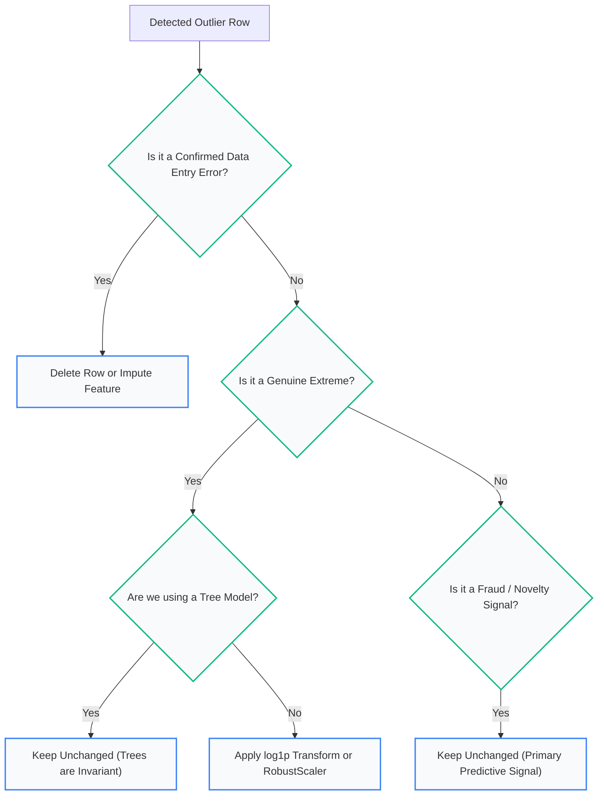

import Tabs from '@theme/Tabs';
import TabItem from '@theme/TabItem';
import Heading from '@theme/Heading';
import React from 'react';

# Outliers and Feature Engineering

> **Topic -** Removing outliers sounds like standard data hygiene until you examine what an outlier actually is: a data entry defect to delete, a genuine extreme to preserve, or a novelty to study? This chapter examines statistical detection rules, the masking cliff under Z-scores, why Huber regression only cures $y$-outliers, and the feature engineering patterns that supply relationships linear models cannot construct on their own.

Treating all anomalous points identically destroys valuable predictive signal. Knowing when an anomaly is an error versus when it is the entire signal is the mark of mature data engineering.

---

## 1. The Three Types of "Outlier"

Before calculating a single threshold, identify which generative process produced the anomaly:

| Outlier Category | Underlying Reality | Practical Example | Recommended Action |
|---|---|---|---|
| **Data Defects (Errors)** | Recording mistake, sensor glitch, or corrupt ETL parser | A patient weight recorded as `70,000` grams instead of `70` kg. | **Delete or impute.** These points are pure noise. |
| **Genuine Extremes** | Rare, legitimate events from the true underlying distribution | A luxury penthouse selling for $50M in a city housing dataset. | **Keep or winsorise/transform.** Removing them blinds models to high-value reality. |
| **Novelties / Anomalies** | Generated by a **different causal process** entirely | A credit card charge originating from an unauthorized offshore server. | **Isolate and study.** In fraud detection, novelties are the primary objective. |

---

## 2. The IQR Rule & Reading Boxplots

The most universal non-parametric outlier detection heuristic is John Tukey's **1.5x IQR Rule**:

$$\text{IQR} = Q_3 - Q_1$$

$$\text{Lower Bound} = Q_1 - 1.5 \times \text{IQR}, \qquad \text{Upper Bound} = Q_3 + 1.5 \times \text{IQR}$$

```text title="Boxplot Anatomical Boundaries"
     Lower Fence      Q1 (25th)     Median (50th)   Q3 (75th)      Upper Fence
  ---|--------------[===========|===============]--------------|---  o  o (Outliers)
     Q1 - 1.5*IQR                   IQR                            Q3 + 1.5*IQR
```

### Where 1.5 Comes From and What It Costs on Skewed Data

*   **Under a Normal Distribution:** The distance $Q_1 - 1.5 \times \text{IQR}$ corresponds mathematically to $-2.698\sigma$, and $Q_3 + 1.5 \times \text{IQR}$ corresponds to $+2.698\sigma$. The interval captures **99.30% of all observations**, flagging roughly **0.70%** as potential outliers.
*   **Under a Skewed Distribution:** On heavily right-skewed data (such as income or website visits), the natural distribution tail extends far to the right. Applying the 1.5x IQR rule directly on skewed raw data will flag up to **11% of completely legitimate, clean records as false outliers!**

:::tip

**Always Reduce Skew Before Applying the IQR Rule**

Never run `Q1 - 1.5*IQR` directly on heavily skewed features. Apply a variance-stabilizing transform (`np.log1p` or `PowerTransformer(method="yeo-johnson")`) first to symmetrize the distribution, then calculate IQR fences.

:::

---

<Heading as="h2" id="z-scores-and-why-outliers-hide-each-other">3. Z-Scores, and Why Outliers Hide Each Other (The Masking Cliff)</Heading>

The classic parametric outlier detector computes the sample Z-score:

$$z = \frac{x - \mu}{\sigma}$$

An observation is conventionally flagged if $|z| > 3$.

### The Masking Trap

Standard Z-scores suffer from a fatal flaw called **Masking**: the very outliers you are trying to detect are included in the calculation of the sample mean ($\mu$) and standard deviation ($\sigma$).

When multiple outliers contaminate a dataset:
1. They pull the sample mean $\mu$ toward themselves.
2. They **inflate the standard deviation $\sigma$ dramatically**.

Because $\sigma$ appears in the denominator, the Z-scores of all outliers collapse simultaneously, dropping below the $|z| > 3$ threshold — falling off a **masking cliff** where the detector becomes completely blind.

---

export const MaskingCliffVisualizer = () => {
  const [outlierCount, setOutlierCount] = React.useState(4);

  const cleanSample = [12, 14, 15, 15, 16, 18, 19, 20];
  const injected = Array(outlierCount).fill(100);
  const data = [...cleanSample, ...injected];

  // Mean & Std
  const mean = data.reduce((a, b) => a + b, 0) / data.length;
  const variance = data.reduce((a, b) => a + Math.pow(b - mean, 2), 0) / data.length;
  const std = Math.sqrt(variance);

  // Median & MAD
  const sorted = [...data].sort((a, b) => a - b);
  const median = sorted.length % 2 === 0
    ? (sorted[sorted.length / 2 - 1] + sorted[sorted.length / 2]) / 2
    : sorted[Math.floor(sorted.length / 2)];
  
  const absDevs = data.map(v => Math.abs(v - median)).sort((a, b) => a - b);
  const mad = absDevs.length % 2 === 0
    ? (absDevs[absDevs.length / 2 - 1] + absDevs[absDevs.length / 2]) / 2
    : absDevs[Math.floor(absDevs.length / 2)];

  // Outlier point (100) scores
  const zScore = outlierCount > 0 ? ((100 - mean) / std).toFixed(2) : 'N/A';
  const modZScore = outlierCount > 0 ? ((0.6745 * (100 - median)) / (mad || 1)).toFixed(2) : 'N/A';

  const isMasked = outlierCount > 0 && parseFloat(zScore) <= 3.0;

  return (
    <div style={{ padding: '24px', border: '1px solid var(--ifm-color-emphasis-200)', borderRadius: '8px', backgroundColor: 'rgba(148, 163, 184, 0.05)', margin: '25px 0' }}>
      <h4 style={{ margin: '0 0 12px 0' }}>Interactive Masking Cliff Visualizer: Z-Score vs. Modified Z-Score (MAD)</h4>
      <p style={{ margin: '0 0 16px 0', fontSize: '14px' }}>
        Inject extreme outliers (value <code>100</code>) into clean baseline data <code>[12, 14, 15, 15, 16, 18, 19, 20]</code> to observe the masking cliff:
      </p>

      <div style={{ marginBottom: '18px' }}>
        <label style={{ fontSize: '13px', fontWeight: 'bold' }}>Number of Injected Outliers (100s): {outlierCount}</label>
        <input
          type="range"
          min="0"
          max="6"
          value={outlierCount}
          onChange={(e) => setOutlierCount(parseInt(e.target.value))}
          style={{ width: '100%', marginTop: '6px' }}
        />
      </div>

      <div style={{ padding: '16px', borderRadius: '6px', backgroundColor: 'var(--ifm-background-surface-color)', border: '1px solid var(--ifm-color-emphasis-300)' }}>
        <div style={{ display: 'grid', gridTemplateColumns: 'repeat(auto-fit, minmax(140px, 1fr))', gap: '10px', marginBottom: '14px' }}>
          <div style={{ padding: '10px', borderRadius: '4px', backgroundColor: 'rgba(148, 163, 184, 0.08)', textAlign: 'center' }}>
            <div style={{ fontSize: '11px', fontWeight: 'bold' }}>Sample Mean (μ)</div>
            <div style={{ fontSize: '16px', fontWeight: 'bold' }}>{mean.toFixed(1)}</div>
          </div>
          <div style={{ padding: '10px', borderRadius: '4px', backgroundColor: 'rgba(148, 163, 184, 0.08)', textAlign: 'center' }}>
            <div style={{ fontSize: '11px', fontWeight: 'bold' }}>Sample Std Dev (σ)</div>
            <div style={{ fontSize: '16px', fontWeight: 'bold', color: std > 20 ? '#c53030' : 'inherit' }}>{std.toFixed(1)}</div>
          </div>
          <div style={{ padding: '10px', borderRadius: '4px', backgroundColor: isMasked ? 'rgba(229, 62, 62, 0.1)' : 'rgba(72, 187, 120, 0.1)', textAlign: 'center', border: isMasked ? '1px solid #e53e3e' : '1px solid #38a169' }}>
            <div style={{ fontSize: '11px', fontWeight: 'bold' }}>Standard Z-Score</div>
            <div style={{ fontSize: '16px', fontWeight: 'bold', color: isMasked ? '#c53030' : '#276749' }}>
              {zScore}
            </div>
            <div style={{ fontSize: '10px', marginTop: '2px' }}>{isMasked ? 'MASKED (Z <= 3.0)' : 'Flagged (Z > 3.0)'}</div>
          </div>
          <div style={{ padding: '10px', borderRadius: '4px', backgroundColor: 'rgba(72, 187, 120, 0.1)', textAlign: 'center', border: '1px solid #38a169' }}>
            <div style={{ fontSize: '11px', fontWeight: 'bold' }}>Modified Z-Score (MAD)</div>
            <div style={{ fontSize: '16px', fontWeight: 'bold', color: '#276749' }}>
              {modZScore}
            </div>
            <div style={{ fontSize: '10px', marginTop: '2px' }}>Always Flagged (&gt; 3.5)</div>
          </div>
        </div>

        <div style={{ fontSize: '13px', color: 'var(--ifm-color-emphasis-800)', lineHeight: '1.5' }}>
          {isMasked ? (
            <span style={{ color: '#c53030', fontWeight: 'bold' }}>
              The Masking Cliff Occurred: Because {outlierCount} outliers inflated the sample standard deviation to {std.toFixed(1)}, the Z-score of the 100s plummeted to {zScore}. They completely escape the standard |z| &gt; 3 detector!
            </span>
          ) : outlierCount === 0 ? (
            <span>Clean baseline sample. Mean is 16.1, Std is 2.5. Inject outliers above to test masking.</span>
          ) : (
            <span style={{ color: '#276749', fontWeight: 'bold' }}>
              Single outlier detected cleanly by Z-score ({zScore} &gt; 3.0). Increase the slider to see masking occur.
            </span>
          )}
        </div>
      </div>
    </div>
  );
};

<MaskingCliffVisualizer />

### The Solution: Modified Z-Score with MAD

Boris Iglewicz and David Hoaglin (1993) introduced the **Modified Z-Score**, replacing sample mean and standard deviation with the **median** and **Median Absolute Deviation (MAD)**:

$$\text{MAD} = \text{median}\left(|x_i - \text{median}(X)|\right)$$

$$\text{Modified } Z_i = \frac{0.6745 \times (x_i - \text{median}(X))}{\text{MAD}}$$

Because median and MAD have a **50% breakdown point** (up to half the dataset can be corrupted before the statistics break down), the Modified Z-Score is completely immune to masking. Any observation with $|\text{Modified } Z_i| > 3.5$ is flagged cleanly.

---

## 4. The Outlier No Single Column Can See: Multivariate Anomalies

Univariate checks scan columns one at a time. However, data points can be completely normal along every single individual feature while being an extreme anomaly in combination.

### The 155 cm, 85 kg Anomaly

Consider a biometric dataset containing Height and Weight ($r = 0.92$):

*   **Height = 155 cm:** A normal height for an adult ($Z \approx -1.2$).
*   **Weight = 85 kg:** A normal weight for an adult ($Z \approx +1.4$).

Both features pass univariate checks cleanly. However, an individual who is simultaneously **155 cm tall and weighs 85 kg** represents an extreme anomaly that shatters the correlation structure:

---

export const BivariateAnomalySandbox = () => {
  const [height, setHeight] = React.useState(155);
  const [weight, setWeight] = React.useState(85);

  // Mean height ~ 170, std ~ 10. Mean weight ~ 70, std ~ 12. Correlation r ~ 0.90
  const zH = ((height - 170) / 10).toFixed(2);
  const zW = ((weight - 70) / 12).toFixed(2);

  // Mahalanobis distance approximation for 2D with r=0.9
  // D_M^2 = (1 / (1 - r^2)) * (zH^2 - 2*r*zH*zW + zW^2)
  const r = 0.90;
  const dmSq = (1 / (1 - r * r)) * (Math.pow(zH, 2) - 2 * r * zH * zW + Math.pow(zW, 2));
  const dm = Math.sqrt(Math.max(0, dmSq)).toFixed(2);

  const isUniAnomaly = Math.abs(zH) > 3.0 || Math.abs(zW) > 3.0;
  const isMultiAnomaly = parseFloat(dm) > 3.5;

  return (
    <div style={{ padding: '24px', border: '1px solid var(--ifm-color-emphasis-200)', borderRadius: '8px', backgroundColor: 'rgba(148, 163, 184, 0.05)', margin: '25px 0' }}>
      <h4 style={{ margin: '0 0 12px 0' }}>Interactive Multivariate Covariance Anomaly Simulator</h4>
      <p style={{ margin: '0 0 16px 0', fontSize: '14px' }}>
        Adjust Height and Weight to observe how an observation can pass univariate checks while breaking covariance bounds:
      </p>

      <div style={{ display: 'grid', gridTemplateColumns: 'repeat(auto-fit, minmax(200px, 1fr))', gap: '20px', marginBottom: '18px' }}>
        <div>
          <label style={{ fontSize: '13px', fontWeight: 'bold' }}>Height: {height} cm</label>
          <input
            type="range"
            min="140"
            max="200"
            value={height}
            onChange={(e) => setHeight(parseInt(e.target.value))}
            style={{ width: '100%', marginTop: '6px' }}
          />
        </div>
        <div>
          <label style={{ fontSize: '13px', fontWeight: 'bold' }}>Weight: {weight} kg</label>
          <input
            type="range"
            min="45"
            max="115"
            value={weight}
            onChange={(e) => setWeight(parseInt(e.target.value))}
            style={{ width: '100%', marginTop: '6px' }}
          />
        </div>
      </div>

      <div style={{ padding: '16px', borderRadius: '6px', backgroundColor: 'var(--ifm-background-surface-color)', border: '1px solid var(--ifm-color-emphasis-300)' }}>
        <div style={{ display: 'grid', gridTemplateColumns: 'repeat(auto-fit, minmax(140px, 1fr))', gap: '10px', marginBottom: '14px' }}>
          <div style={{ padding: '10px', borderRadius: '4px', backgroundColor: 'rgba(148, 163, 184, 0.08)', textAlign: 'center' }}>
            <div style={{ fontSize: '11px', fontWeight: 'bold' }}>Height Z-Score</div>
            <div style={{ fontSize: '16px', fontWeight: 'bold', color: Math.abs(zH) > 3 ? '#c53030' : '#276749' }}>{zH}</div>
            <div style={{ fontSize: '10px' }}>{Math.abs(zH) > 3 ? 'Flagged' : 'Normal (|Z| <= 3)'}</div>
          </div>
          <div style={{ padding: '10px', borderRadius: '4px', backgroundColor: 'rgba(148, 163, 184, 0.08)', textAlign: 'center' }}>
            <div style={{ fontSize: '11px', fontWeight: 'bold' }}>Weight Z-Score</div>
            <div style={{ fontSize: '16px', fontWeight: 'bold', color: Math.abs(zW) > 3 ? '#c53030' : '#276749' }}>{zW}</div>
            <div style={{ fontSize: '10px' }}>{Math.abs(zW) > 3 ? 'Flagged' : 'Normal (|Z| <= 3)'}</div>
          </div>
          <div style={{ padding: '10px', borderRadius: '4px', backgroundColor: isMultiAnomaly ? 'rgba(229, 62, 62, 0.1)' : 'rgba(72, 187, 120, 0.1)', textAlign: 'center', border: isMultiAnomaly ? '1px solid #e53e3e' : '1px solid #38a169' }}>
            <div style={{ fontSize: '11px', fontWeight: 'bold' }}>Mahalanobis Distance (DM)</div>
            <div style={{ fontSize: '16px', fontWeight: 'bold', color: isMultiAnomaly ? '#c53030' : '#276749' }}>{dm} σ</div>
            <div style={{ fontSize: '10px' }}>{isMultiAnomaly ? 'ANOMALY DETECTED' : 'Covariance Valid'}</div>
          </div>
        </div>

        <div style={{ fontSize: '13px', color: 'var(--ifm-color-emphasis-800)', lineHeight: '1.5' }}>
          {!isUniAnomaly && isMultiAnomaly ? (
            <span style={{ color: '#c53030', fontWeight: 'bold' }}>
              Multivariate Blindness Confirmed: Both Height ({zH}) and Weight ({zW}) pass univariate checks with flying colors (|Z| &lt; 2.0). Yet Mahalanobis distance ({dm} σ) flags this point as an extreme anomaly because it completely breaks the height-weight covariance structure!
            </span>
          ) : isMultiAnomaly ? (
            <span style={{ color: '#c53030' }}>Point is extreme in individual coordinates and in joint distribution.</span>
          ) : (
            <span style={{ color: '#276749' }}>Point falls naturally along the height-weight correlation diagonal.</span>
          )}
        </div>
      </div>
    </div>
  );
};

<BivariateAnomalySandbox />

### Why Isolation Forest Struggles vs. Elliptic Envelope

*   **`IsolationForest`:** Isolates anomalies using randomized **axis-parallel cuts** (horizontal and vertical lines). Because the 155 cm, 85 kg point falls well within the individual coordinate ranges of both axes, axis-parallel lines require many splits to isolate it.
*   **`EllipticEnvelope`:** Fits a robust covariance matrix ($\Sigma$) to compute the **Mahalanobis Distance**:
    $$D_M(x) = \sqrt{(x - \mu)^T \Sigma^{-1} (x - \mu)}$$
    It captures the orientation of the covariance ellipse, instantly isolating points that violate the correlation slope.

---

## 5. Outlier Treatment: What Actually Works

To evaluate outlier treatments objectively, consider a benchmark on 280 training rows with 20 corrupted rows (a 10x recording error), evaluated on a clean test set:

```text title="Empirical Treatment Benchmark"
Treatment Applied                       Test R² Score       Recovery Status
Clean Data (Theoretical Ideal)              0.9902          100% Recovery
Do Nothing (Raw Training Data)              0.1310          Catastrophic Failure
Remove Flagged Rows (IQR Rule)              0.9867          Near-Total Recovery (99.6%)
Cap at Bounds (Winsorisation)               0.8083          Partial Recovery
Robust Model (HuberRegressor on X-outliers) 0.1232          Failed Completely
```

### Why Robust Models Fix y-Outliers, Not X-Outliers

`HuberRegressor` is designed to resist outliers by down-weighting observations with large residuals ($|y - \hat{y}| > \delta$). However, its effectiveness depends entirely on where the outlier sits:

```text title="Huber vs. OLS across Corruption Types"
Corruption Location         OLS Test R²     HuberRegressor Test R²  Outcome
Outliers in Target (y)        -2.3392               0.9901          Transformative Recovery
Outliers in Features (X)       0.1310               0.1232          Zero Improvement
```

*   **Target ($y$) Outliers:** The point has normal features $X$, but a wild target $y$. The vertical residual is massive. HuberRegressor down-weights the residual cleanly, delivering $R^2 = 0.9901$.
*   **Feature ($X$) Outliers (High Leverage):** The point sits far out along the $X$-axis. Like a long physical lever arm, it drags the regression line directly to itself! Because the line is pulled directly to the point, its **residual remains tiny**. Huber never down-weights it!

---

export const HighLeverageSimulator = () => {
  const [outlierType, setOutlierType] = React.useState('target');

  return (
    <div style={{ padding: '24px', border: '1px solid var(--ifm-color-emphasis-200)', borderRadius: '8px', backgroundColor: 'rgba(148, 163, 184, 0.05)', margin: '25px 0' }}>
      <h4 style={{ margin: '0 0 12px 0' }}>Interactive Leverage vs. Residual Simulator</h4>
      <p style={{ margin: '0 0 16px 0', fontSize: '14px' }}>
        Toggle between Target Outliers and High-Leverage Feature Outliers to see why robust loss functions behave differently:
      </p>

      <div style={{ display: 'flex', gap: '8px', marginBottom: '16px' }}>
        <button
          onClick={() => setOutlierType('target')}
          style={{
            padding: '6px 14px',
            borderRadius: '4px',
            border: '1px solid #3182ce',
            backgroundColor: outlierType === 'target' ? '#3182ce' : 'transparent',
            color: outlierType === 'target' ? '#fff' : 'var(--ifm-font-color-base)',
            cursor: 'pointer',
            fontWeight: 'bold',
            fontSize: '13px',
            transition: '0.2s'
          }}
        >
          Target Outlier (Vertical Error in y)
        </button>
        <button
          onClick={() => setOutlierType('feature')}
          style={{
            padding: '6px 14px',
            borderRadius: '4px',
            border: '1px solid #3182ce',
            backgroundColor: outlierType === 'feature' ? '#3182ce' : 'transparent',
            color: outlierType === 'feature' ? '#fff' : 'var(--ifm-font-color-base)',
            cursor: 'pointer',
            fontWeight: 'bold',
            fontSize: '13px',
            transition: '0.2s'
          }}
        >
          Feature Outlier (High Leverage in X)
        </button>
      </div>

      <div style={{ padding: '16px', borderRadius: '6px', backgroundColor: 'var(--ifm-background-surface-color)', border: '1px solid var(--ifm-color-emphasis-300)' }}>
        <div style={{ display: 'grid', gridTemplateColumns: 'repeat(auto-fit, minmax(140px, 1fr))', gap: '10px', marginBottom: '14px' }}>
          <div style={{ padding: '10px', borderRadius: '4px', backgroundColor: 'rgba(148, 163, 184, 0.08)', textAlign: 'center' }}>
            <div style={{ fontSize: '11px', fontWeight: 'bold' }}>OLS Test R²</div>
            <div style={{ fontSize: '18px', fontWeight: 'bold', color: '#c53030' }}>
              {outlierType === 'target' ? '-2.3392' : '0.1310'}
            </div>
          </div>
          <div style={{ padding: '10px', borderRadius: '4px', backgroundColor: 'rgba(148, 163, 184, 0.08)', textAlign: 'center' }}>
            <div style={{ fontSize: '11px', fontWeight: 'bold' }}>HuberRegressor Test R²</div>
            <div style={{ fontSize: '18px', fontWeight: 'bold', color: outlierType === 'target' ? '#276749' : '#c53030' }}>
              {outlierType === 'target' ? '0.9901' : '0.1232'}
            </div>
          </div>
          <div style={{ padding: '10px', borderRadius: '4px', backgroundColor: outlierType === 'target' ? 'rgba(72, 187, 120, 0.1)' : 'rgba(229, 62, 62, 0.1)', textAlign: 'center', border: outlierType === 'target' ? '1px solid #38a169' : '1px solid #e53e3e' }}>
            <div style={{ fontSize: '11px', fontWeight: 'bold' }}>Huber Effectiveness</div>
            <div style={{ fontSize: '14px', fontWeight: 'bold', color: outlierType === 'target' ? '#276749' : '#c53030' }}>
              {outlierType === 'target' ? 'Total Recovery' : 'Completely Ineffective'}
            </div>
          </div>
        </div>

        <div style={{ fontSize: '13px', color: 'var(--ifm-color-emphasis-800)', lineHeight: '1.5' }}>
          {outlierType === 'target' ? (
            <span><b>Target Noise Handled:</b> The observation has normal feature values but an extreme target value. The vertical residual is huge, allowing Huber loss to down-weight it and restore near-perfect R² (0.9901).</span>
          ) : (
            <span><b>High Leverage Point:</b> The outlier sits far out on the X-axis. It exerts tremendous leverage, dragging the fitted regression line directly to itself! Because the line is pulled directly to the point, its residual stays tiny. HuberRegressor fails to down-weight it, scoring an identical 0.1232!</span>
          )}
        </div>
      </div>
    </div>
  );
};

<HighLeverageSimulator />

---

export const PracticeQuiz = () => {
  const [selected, setSelected] = React.useState(null);
  return (
    <div style={{ padding: '20px', border: '1px solid var(--ifm-color-emphasis-200)', borderRadius: '8px', backgroundColor: 'rgba(148, 163, 184, 0.05)', margin: '20px 0' }}>
      <h4 style={{ margin: '0 0 10px 0' }}>Interactive Checkpoint: Robust Regression</h4>
      <p style={{ margin: '0 0 15px 0' }}>If your training set has outliers in its feature columns (X-outliers), why doesn't fitting a HuberRegressor help prevent model distortion?</p>
      <div style={{ display: 'flex', flexDirection: 'column', gap: '10px' }}>
        <button onClick={() => setSelected('opt1')} style={{ padding: '10px', borderRadius: '4px', border: '1px solid #3182ce', textAlign: 'left', backgroundColor: selected === 'opt1' ? '#e53e3e' : 'transparent', color: selected === 'opt1' ? '#fff' : 'var(--ifm-font-color-base)', cursor: 'pointer', transition: '0.2s' }}>Option A: HuberRegressor only works on classification targets, not continuous values.</button>
        <button onClick={() => setSelected('opt2')} style={{ padding: '10px', borderRadius: '4px', border: '1px solid #3182ce', textAlign: 'left', backgroundColor: selected === 'opt2' ? '#38a169' : 'transparent', color: selected === 'opt2' ? '#fff' : 'var(--ifm-font-color-base)', cursor: 'pointer', transition: '0.2s' }}>Option B: X-outliers are high-leverage points that drag the fitted regression line directly to themselves, keeping their residuals small and rendering residual-based Huber weighting useless.</button>
        <button onClick={() => setSelected('opt3')} style={{ padding: '10px', borderRadius: '4px', border: '1px solid #3182ce', textAlign: 'left', backgroundColor: selected === 'opt3' ? '#e53e3e' : 'transparent', color: selected === 'opt3' ? '#fff' : 'var(--ifm-font-color-base)', cursor: 'pointer', transition: '0.2s' }}>Option C: Robust models are always computationally identical to OLS when regularized.</button>
      </div>
      {selected === 'opt1' && <p style={{ color: '#e53e3e', marginTop: '15px', fontWeight: 'bold', fontSize: '14px', marginBottom: '0' }}>Incorrect. HuberRegressor is designed specifically for continuous regression, not classification.</p>}
      {selected === 'opt2' && <p style={{ color: '#38a169', marginTop: '15px', fontWeight: 'bold', fontSize: '14px', marginBottom: '0' }}>Correct! HuberRegressor works by down-weighting observations with large residuals (errors). However, an extreme X-outlier exerts high leverage, pulling the line to itself so its residual remains tiny. Hence, Huber fails to down-weight it.</p>}
      {selected === 'opt3' && <p style={{ color: '#e53e3e', marginTop: '15px', fontWeight: 'bold', fontSize: '14px', marginBottom: '0' }}>Incorrect. Robust Huber loss is mathematically different from OLS and handles y-outliers perfectly. It's high-leverage X-outliers that Huber is structurally blind to.</p>}
    </div>
  );
};

<PracticeQuiz />

### Decision Tree for Outlier Treatment



:::danger

**Never Clean the Test Set**

Removing outliers from training data is a valid decision about what patterns your model should learn. Removing outliers from the **test set** is fraudulent: it fabricates an evaluation report on a synthetic world that does not exist. Real production data will contain extreme outliers; if your model crashes or predicts nonsensical numbers, that is a discovery you must make during validation.

:::

---

## 6. Feature Engineering: Supplying What Models Cannot Form

Feature engineering adds information that is implicit in the data but structured in a form algorithms cannot learn on their own.

Just as with scaling and encoding, **linear models require extensive feature engineering, while deep tree ensembles generate interactions for themselves.**

### Cyclical Features: Hour 23 and Hour 0 Are Neighbors

Suppose an outcome depends on night-time hours ($22, 23, 0, 1, 2$). This sequence wraps past midnight. On a raw integer scale ($0..23$), hour 23 and hour 0 sit at opposite physical extremes:

```text title="Accuracy on Night-Time Events"
Feature Representation              Logistic Regression     Random Forest
Raw Hour (0..23)                    0.6933 (BASELINE)       0.8337
Trigonometric (sin / cos) of Hour   0.8203                  0.8337
One-Hot Encoded Hour (24 columns)   0.8337                  0.8337
Majority Class Baseline: 0.6933
```

Logistic regression on raw hour scored **`0.6933` — the majority class baseline**. It learned literally nothing because a single linear coefficient $\beta \cdot \text{hour}$ can only express monotonic trends (*"later hours are more likely"*).

Mapping hours onto a circle using sine and cosine wraps midnight seamlessly:

$$\text{hour\_sin} = \sin\left(\frac{2\pi \times \text{hour}}{24}\right), \qquad \text{hour\_cos} = \cos\left(\frac{2\pi \times \text{hour}}{24}\right)$$

---

export const CyclicalClockVisualizer = () => {
  const [hour, setHour] = React.useState(23);

  const rad = (2 * Math.PI * hour) / 24;
  const sinVal = Math.sin(rad).toFixed(3);
  const cosVal = Math.cos(rad).toFixed(3);

  // Distance to Hour 0 (sin=0, cos=1)
  const distToZeroLinear = hour;
  const distToZeroCirc = Math.sqrt(Math.pow(sinVal - 0, 2) + Math.pow(cosVal - 1, 2)).toFixed(3);

  return (
    <div style={{ padding: '24px', border: '1px solid var(--ifm-color-emphasis-200)', borderRadius: '8px', backgroundColor: 'rgba(148, 163, 184, 0.05)', margin: '25px 0' }}>
      <h4 style={{ margin: '0 0 12px 0' }}>Interactive Cyclical Feature Clock Visualizer</h4>
      <p style={{ margin: '0 0 16px 0', fontSize: '14px' }}>
        Select an hour of the day to inspect how sine and cosine coordinates preserve the continuous wrap-around past midnight:
      </p>

      <div style={{ marginBottom: '16px' }}>
        <label style={{ fontSize: '13px', fontWeight: 'bold' }}>Current Hour: {hour}:00</label>
        <input
          type="range"
          min="0"
          max="23"
          value={hour}
          onChange={(e) => setHour(parseInt(e.target.value))}
          style={{ width: '100%', marginTop: '6px' }}
        />
      </div>

      <div style={{ padding: '16px', borderRadius: '6px', backgroundColor: 'var(--ifm-background-surface-color)', border: '1px solid var(--ifm-color-emphasis-300)' }}>
        <div style={{ display: 'grid', gridTemplateColumns: 'repeat(auto-fit, minmax(140px, 1fr))', gap: '10px', marginBottom: '14px' }}>
          <div style={{ padding: '10px', borderRadius: '4px', backgroundColor: 'rgba(148, 163, 184, 0.08)', textAlign: 'center' }}>
            <div style={{ fontSize: '11px', fontWeight: 'bold' }}>hour_sin</div>
            <div style={{ fontSize: '16px', fontWeight: 'bold', color: '#2b6cb0' }}>{sinVal}</div>
          </div>
          <div style={{ padding: '10px', borderRadius: '4px', backgroundColor: 'rgba(148, 163, 184, 0.08)', textAlign: 'center' }}>
            <div style={{ fontSize: '11px', fontWeight: 'bold' }}>hour_cos</div>
            <div style={{ fontSize: '16px', fontWeight: 'bold', color: '#2b6cb0' }}>{cosVal}</div>
          </div>
          <div style={{ padding: '10px', borderRadius: '4px', backgroundColor: 'rgba(229, 62, 62, 0.1)', textAlign: 'center' }}>
            <div style={{ fontSize: '11px', fontWeight: 'bold' }}>Linear Distance to Hour 0</div>
            <div style={{ fontSize: '16px', fontWeight: 'bold', color: '#c53030' }}>{distToZeroLinear} units</div>
          </div>
          <div style={{ padding: '10px', borderRadius: '4px', backgroundColor: 'rgba(72, 187, 120, 0.1)', textAlign: 'center', border: '1px solid #38a169' }}>
            <div style={{ fontSize: '11px', fontWeight: 'bold' }}>Cyclical Distance to Hour 0</div>
            <div style={{ fontSize: '16px', fontWeight: 'bold', color: '#276749' }}>{distToZeroCirc} units</div>
          </div>
        </div>

        <div style={{ fontSize: '13px', color: 'var(--ifm-color-emphasis-800)', lineHeight: '1.5' }}>
          {hour === 23 ? (
            <span style={{ color: '#276749', fontWeight: 'bold' }}>
              Midnight Wrap-Around Preserved: On a linear scale, Hour 23 is 23 units away from Hour 0. But in circular trigonometric coordinates, Hour 23 and Hour 0 are immediate neighbors (distance = 0.261), allowing linear models to boost accuracy from 0.69 to 0.82!
            </span>
          ) : (
            <span>Trigonometric coordinates map every hour as a point along the circumference of a 2D unit circle.</span>
          )}
        </div>
      </div>
    </div>
  );
};

<CyclicalClockVisualizer />

### High-Yield Feature Engineering Families

| Feature Family | Concrete Example | Why It Unlocks Accuracy |
|---|---|---|
| **Ratios** | `debt / income`, `price per m²` | Linear models cannot divide; ratios are often the true underlying causal driver. |
| **Interactions** | `length * width` (Area) | Linear models compute weighted sums ($\sum w_j x_j$); they cannot multiply two features. |
| **Cyclical** | $\sin / \cos$ of hour, month | Preserves continuous boundaries across midnight or calendar year ends. |
| **Datetime Extractions** | `is_weekend`, `hour_of_day` | Raw timestamps are unusable continuous integers; business logic lives in cycles. |
| **Aggregates** | Past customer average spend | Collapses one-to-many transactional history into a single sample vector. |
| **Domain Formulas** | $\text{BMI} = \text{weight} / \text{height}^2$ | Encodes specialized physical or financial laws no algorithm can infer from sparse data. |

---

## 7. Implementation Lab

:::tip

**Implementation Lab: Outliers and Advanced Feature Engineering**

Observe the standard Z-score masking cliff live, compare univariate scans against bivariate Mahalanobis distance via EllipticEnvelope, evaluate the failure of HuberRegressor on high-leverage points, and construct cyclical sine/cosine encoders.

<a href="https://colab.research.google.com/github/vettrivel-kl/vettrivel-kl.github.io/blob/master/static/labs/02-data-preprocessing/outliers_and_features.ipynb" target="_blank" rel="noopener noreferrer">
  
</a>

**How to run the lab:**
1. Click the **"Open In Colab"** badge above to launch the interactive notebook.
2. Click **"Runtime" > "Run all"** or execute cells individually using `Shift + Enter`.
3. Follow the guided experiments: test the masking cliff by adding identical outliers, evaluate `PolynomialFeatures(interaction_only=True)`, and measure Cyclical hour gains.

:::

### Comparative Implementation: Feature Interactions & Cyclical Encoding

<Tabs>
  <TabItem value="pipeline" label="1. Production Preprocessing Pipeline" default>
    <br/>

    ```python
    import numpy as np
    import pandas as pd
    from sklearn.compose import ColumnTransformer
    from sklearn.preprocessing import FunctionTransformer, RobustScaler
    from sklearn.pipeline import Pipeline
    from sklearn.linear_model import LogisticRegression

    def encode_cyclical_hour(X):
        # Maps hour column (0-23) onto 2D unit circle
        hour = X[:, 0]
        sin = np.sin(2 * np.pi * hour / 24)[:, None]
        cos = np.cos(2 * np.pi * hour / 24)[:, None]
        return np.hstack([sin, cos])

    preprocessor = ColumnTransformer(
        transformers=[
            ("cyclical", FunctionTransformer(encode_cyclical_hour), ["hour"]),
            ("robust_num", RobustScaler(), ["salary", "debt_ratio"])
        ]
    )

    model = Pipeline([
        ("prep", preprocessor),
        ("clf", LogisticRegression())
    ])
    ```
  </TabItem>
  <TabItem value="scratch" label="2. Modified Z-Score with MAD from Scratch" default>
    <br/>

    ```python
    import numpy as np

    def modified_z_score(x):
        """
        Computes Iglewicz & Hoaglin modified z-score using median and MAD.
        Immune to the masking cliff.
        """
        med = np.median(x)
        mad = np.median(np.abs(x - med))
        if mad == 0:
            return np.zeros_like(x)
        
        mod_z = 0.6745 * (x - med) / mad
        return mod_z

    # Outlier mask: values with |mod_z| > 3.5
    outliers = np.abs(modified_z_score(data)) > 3.5
    ```
  </TabItem>
</Tabs>

---

## 8. Common Mistakes

<Tabs>
  <TabItem value="deleting" label="1. Blind Outlier Deletion" default>
    <br/>

    *   **The Misconception:** *"Every point flagged by a statistical outlier detection rule is corrupt and should be deleted immediately."*
    *   **Wrong Thinking:** Deleting flagged rows purges genuine extreme records and critical fraud signals, eliminating the most valuable rows in the dataset.
    *   **The Right Principle:** Only delete confirmed data entry defects. Genuine extremes should be preserved (or winsorised/transformed for linear models).
  </TabItem>
  <TabItem value="skew" label="2. Raw Skew Detection">
    <br/>

    *   **The Misconception:** *"Applying the IQR rule directly on skewed features isolates data errors."*
    *   **Wrong Thinking:** On heavily skewed distributions, the 1.5x IQR rule flags up to 11% of clean, legitimate observations as false outliers.
    *   **The Right Principle:** Always apply skew-reducing transformations (`log1p` or Yeo-Johnson) **before** running outlier detection rules.
  </TabItem>
  <TabItem value="masking" label="3. Standard Z-Score Masking">
    <br/>

    *   **The Misconception:** *"The standard $|z| > 3$ rule is the most robust way to find univariate outliers."*
    *   **Wrong Thinking:** Multiple outliers inflate the sample standard deviation, driving their own Z-scores below 3.0 and falling off the masking cliff.
    *   **The Right Principle:** Use Modified Z-scores with **Median Absolute Deviation (MAD)**, which has a 50% breakdown point and resists masking.
  </TabItem>
  <TabItem value="univariate" label="4. Univariate Blindness">
    <br/>

    *   **The Misconception:** *"Running outlier detection column-by-column catches every anomaly."*
    *   **Wrong Thinking:** Single-column rules cannot see correlation-breaking anomalies (e.g. 155 cm height, 85 kg weight).
    *   **The Right Principle:** Use multivariate tools like `EllipticEnvelope` (Mahalanobis distance) to detect violations of joint covariance structure.
  </TabItem>
  <TabItem value="huber" label="5. Huber Regressor on X-outliers">
    <br/>

    *   **The Misconception:** *"If features contain extreme outliers, I can just use a HuberRegressor robust loss."*
    *   **Wrong Thinking:** Huber regressor only resists target ($y$) outliers by down-weighting large residuals. Feature ($X$) outliers exert high leverage, dragging the fitted line to themselves so their residuals remain tiny.
    *   **The Right Principle:** Huber is only useful for $y$-corruption. For $X$-corruption, you must explicitly detect and remove, winsorise, or transform the outliers.
  </TabItem>
</Tabs>

---

## 9. Summary

<div className="row">
  <div className="col col--6">
    <div className="card" style={{ height: '100%', marginBottom: '15px' }}>
      <div className="card__header" style={{ padding: '15px', borderBottom: '1px solid var(--ifm-color-emphasis-200)' }}>
        <h3>Outlier Detection & Action</h3>
      </div>
      <div className="card__body" style={{ padding: '15px' }}>
        <ul>
          <li><b>Univariate Robustness:</b> Replace standard Z-scores with Modified Z-scores (median/MAD-based) to structurally prevent masking.</li>
          <li><b>Correlation Breaks:</b> Deploy <code>EllipticEnvelope</code> (Mahalanobis distance) to flag impossible multivariate combinations.</li>
          <li><b>Isolation Forest limits:</b> Use for extremes in individual coordinates; use covariance-aware models for correlated variables.</li>
          <li><b>X vs y Outliers:</b> Huber robust regression only fixes <code>y</code> outliers. Feature outliers must be capped, transformed, or removed.</li>
        </ul>
      </div>
    </div>
  </div>
  <div className="col col--6">
    <div className="card" style={{ height: '100%', marginBottom: '15px' }}>
      <div className="card__header" style={{ padding: '15px', borderBottom: '1px solid var(--ifm-color-emphasis-200)' }}>
        <h3>Feature Engineering</h3>
      </div>
      <div className="card__body" style={{ padding: '15px' }}>
        <ul>
          <li><b>Cyclical Wrapping:</b> Convert time parameters into <code>sin</code> and <code>cos</code> coordinates to bridge midnight boundaries.</li>
          <li><b>Multiplicative interactions:</b> Supply <code>length * width</code> explicitly to linear models so they can fit scale-sensitive area metrics.</li>
          <li><b>High-Yield Ratios:</b> Supply <code>debt / income</code> directly, as linear models cannot divide.</li>
          <li><b>Data Leakage:</b> Never calculate aggregates or means over test rows; isolate calculations to training splits only.</li>
        </ul>
      </div>
    </div>
  </div>
</div>

<br/>

:::info

**Key Takeaways**

*   **Outliers Are Not All Errors:** Recording errors must be deleted or imputed. Genuine extremes and novelties contain critical signal and must be preserved.
*   **The Masking Cliff:** Standard Z-scores suffer a masking cliff as outliers inflate sample variance. Median and MAD remain structurally immune.
*   **Linear Models Need Help:** Linear models score baseline performance on cyclical features like `hour`, whereas tree-based models decode the boundaries automatically.
*   **Never Clean the Test Set:** Removing outliers from test partitions fabricates evaluation reports on non-existent worlds.

:::

**Next in this section:** [Train / Test Split](./06-train-test-split.mdx) - honest evaluation, stratification, and avoiding split-time data leakage.

**See also:** [Feature Scaling and Transformation](./04-feature-scaling-and-transformation.mdx) · [Encoding Categorical Data](./03-encoding-categorical-data.mdx) · [Missing Values](./02-missing-values.mdx)

---

## 10. Active Recall Flashcards

*Attempt each conceptual diagnostic question first, then click to reveal the underlying derivation and explanation.*

<details>
  <summary><b>1. [THEORY] What are the three distinct categories of outliers, and how should their treatment differ?</b></summary>
  <div className="answer-content">
    <br/>

    1.  **Errors (Data Defects):** Mistyped or wrong data (e.g. weight in grams instead of kg). *Treatment:* Delete or impute.
    2.  **Genuine Extremes:** Real, rare data points from the same distribution (e.g. a mansion in housing data). *Treatment:* Keep (or transform/winsorise for linear models).
    3.  **Novelties / Anomalies:** Data points from a *different* generative process (e.g. fraud). *Treatment:* Keep and study, as they contain the primary signal.
  </div>
</details>

<details>
  <summary><b>2. [THEORY] Why is the standard IQR 1.5x rule dangerous to apply directly on skewed features?</b></summary>
  <div className="answer-content">
    <br/>

    *   The 1.5x IQR threshold is calibrated strictly for symmetric normal distributions (flagging about 0.70% of points).
    *   On heavily right-skewed clean distributions, the tail is naturally thick, causing the rule to flag up to **11%** of perfectly ordinary, legitimate data points as outliers. You must transform features to reduce skew **before** applying outlier detection.
  </div>
</details>

<details>
  <summary><b>3. [THEORY] What is masking in outlier detection, and what causes the abrupt masking "cliff" under Z-scores?</b></summary>
  <div className="answer-content">
    <br/>

    *   **Masking:** Occurs when multiple outliers inflate the very statistics (mean and standard deviation) used to measure them, allowing them to hide in plain sight.
    *   **The Cliff:** Because multiple outliers share nearly identical extreme values, they inflate standard deviation concurrently. Once standard deviation crosses a critical threshold, the Z-scores of all outliers drop below $|z| = 3$ simultaneously, causing them to vanish from the detector all at once.
  </div>
</details>

<details>
  <summary><b>4. [THEORY] How does modified Z-score using MAD prevent masking?</b></summary>
  <div className="answer-content">
    <br/>

    Instead of mean and standard deviation, modified Z-score is computed as:

    $$\text{Modified } z = \frac{0.6745 \times (x - \text{median})}{\text{MAD}}$$

    Because **median** and **Median Absolute Deviation (MAD)** are based on ranked middle values, they resist changes even if up to 50% of the sample is corrupted, preventing outliers from inflating the scale and escaping detection.
  </div>
</details>

<details>
  <summary><b>5. [ANALYZE] How can a data record be completely unflagged by univariate checks yet be the most extreme outlier in the dataset?</b></summary>
  <div className="answer-content">
    <br/>

    *   A multivariate outlier violates the **relationship (covariance structure)** between features rather than feature limits.
    *   For example, a height of 155 cm is a normal short height, and a weight of 85 kg is a normal heavy weight. Neither column is univariately flagged. However, a person who is both 155 cm and 85 kg represents an impossible joint distribution. This covariance break can only be detected via multivariate tools like **Mahalanobis distance**.
  </div>
</details>

<details>
  <summary><b>6. [ANALYZE] Why did IsolationForest fail to flag the 155 cm, 85 kg outlier while EllipticEnvelope succeeded?</b></summary>
  <div className="answer-content">
    <br/>

    *   **IsolationForest:** Isolates points using random **axis-parallel** cuts (perpendicular lines along coordinate axes). Since the outlier's height and weight are both within standard coordinates, it cannot be easily fenced off with axis-parallel lines.
    *   **EllipticEnvelope:** Fits a full covariance matrix to measure Mahalanobis distance. It directly captures the correlation slope (0.92) and flags the point because it falls far off the principal diagonal.
  </div>
</details>

<details>
  <summary><b>7. [ANALYZE] Why does HuberRegressor robust loss completely fail on X-outliers (features) while succeeding on y-outliers (targets)?</b></summary>
  <div className="answer-content">
    <br/>

    *   Huber regressor is a residual-based robust model: it down-weights points with large residuals (errors).
    *   Outliers in features ($X$) represent **high-leverage** points. They sit far along the feature axis and have so much lever-arm power that they drag the fitted OLS line directly to themselves. Because the line is pulled directly to the $X$-outlier, its residual stays tiny. Since its residual is small, Huber never down-weights it.
  </div>
</details>

<details>
  <summary><b>8. [THEORY] Why is raw hour (0-23) completely useless for a Logistic Regression model when modeling cyclical night events?</b></summary>
  <div className="answer-content">
    <br/>

    *   Linear models fit a single monotonic coefficient ($\beta$) per feature: it can only express "higher hours lead to higher probability."
    *   Night-time spans midnight, wrapping from hour 22, 23 to 0, 1, 2. A single monotonic coefficient cannot capture a relationship where both the highest hours (23) and lowest hours (0) have positive coefficients, resulting in zero performance.
  </div>
</details>

<details>
  <summary><b>9. [PROG] How do you transform a cyclical hour column into standard coordinates, and why are two columns required?</b></summary>
  <div className="answer-content">
    <br/>

    We map hours onto a circle of circumference $2\pi$ using sine and cosine waves:

    $$\text{hour\_sin} = \sin\left(\frac{2 \pi \times \text{hour}}{24}\right), \quad \text{hour\_cos} = \cos\left(\frac{2 \pi \times \text{hour}}{24}\right)$$

    *   **Two columns** are mandatory because a single cyclical coordinate is ambiguous (e.g. sine has identical values at both sunrise and sunset; cosine is required to disambiguate the direction). Together, they cleanly map hours as coordinates on a circle.
  </div>
</details>

<details>
  <summary><b>10. [ANALYZE] Why are ratio features (e.g. debt / income) highly effective additions for linear models?</b></summary>
  <div className="answer-content">
    <br/>

    Linear models can only compute weighted sums ($\beta_1 x_1 + \beta_2 x_2$). They are mathematically incapable of performing division or multiplication on features. Providing a ratio like `debt / income` explicitly supplies a critical scale-free feature that would be impossible for the model to construct on its own.
  </div>
</details>
