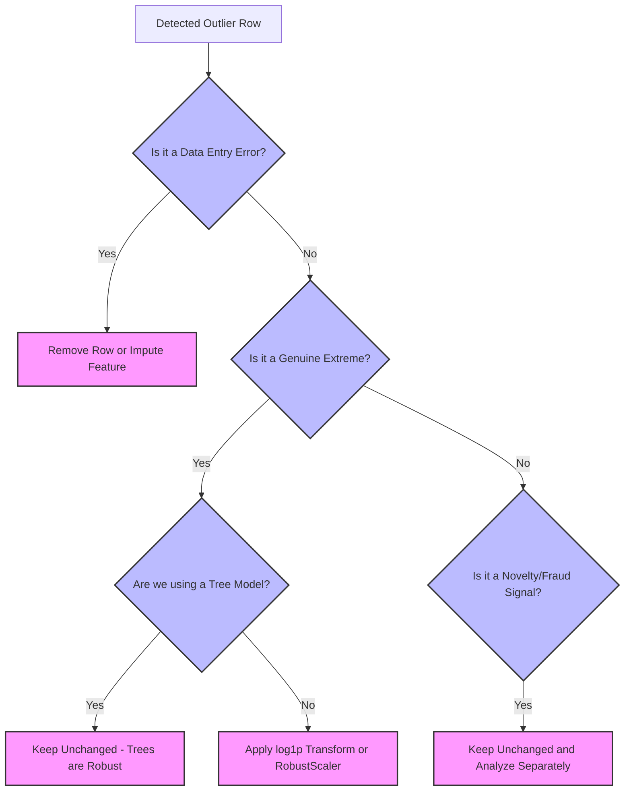

import Tabs from '@theme/Tabs';
import TabItem from '@theme/TabItem';
import React from 'react';

# Outliers and Feature Engineering

export const OutlierSandbox = () => {
  const [hasOutliers, setHasOutliers] = React.useState(false);
  const [method, setMethod] = React.useState('zscore');
  const baseline = [12, 14, 15, 15, 16, 18, 19, 20];
  const outliers = [100, 100, 100, 100];
  const data = hasOutliers ? [...baseline, ...outliers] : baseline;
  const getResults = () => {
    const n = data.length;
    const mean = data.reduce((a, b) => a + b, 0) / n;
    const variance = data.reduce((a, b) => a + Math.pow(b - mean, 2), 0) / n;
    const std = Math.sqrt(variance);
    const sorted = [...data].sort((a, b) => a - b);
    const median = sorted.length % 2 === 0 
      ? (sorted[sorted.length / 2 - 1] + sorted[sorted.length / 2]) / 2 
      : sorted[Math.floor(sorted.length / 2)];
    const absoluteDeviations = data.map(v => Math.abs(v - median));
    const sortedDeviations = [...absoluteDeviations].sort((a, b) => a - b);
    const mad = sortedDeviations.length % 2 === 0
      ? (sortedDeviations[sortedDeviations.length / 2 - 1] + sortedDeviations[sortedDeviations.length / 2]) / 2
      : sortedDeviations[Math.floor(sortedDeviations.length / 2)];
    const q25 = sorted[Math.floor(n * 0.25)];
    const q75 = sorted[Math.floor(n * 0.75)];
    const iqr = q75 - q25;
    const loIQR = q25 - 1.5 * iqr;
    const hiIQR = q75 + 1.5 * iqr;
    return data.map(v => {
      let score = 0;
      let flagged = false;
      let explanation = "";
      if (method === 'zscore') {
        score = (v - mean) / std;
        flagged = Math.abs(score) > 2.0;
        explanation = `Z-score: ${score.toFixed(2)}`;
      } else if (method === 'iqr') {
        flagged = v < loIQR || v > hiIQR;
        explanation = `IQR Bounds: [${loIQR.toFixed(1)}, ${hiIQR.toFixed(1)}]`;
      } else {
        const denom = mad === 0 ? 0.001 : mad;
        score = 0.6745 * (v - median) / denom;
        flagged = Math.abs(score) > 3.0;
        explanation = `Mod Z: ${score.toFixed(2)} (MAD=${mad.toFixed(1)})`;
      }
      return { value: v, flagged, explanation };
    });
  };
  const results = getResults();
  return (
    <div style={{ padding: '20px', border: '1px solid var(--ifm-color-emphasis-200)', borderRadius: '8px', backgroundColor: 'rgba(148, 163, 184, 0.05)', margin: '20px 0' }}>
      <h4 style={{ margin: '0 0 10px 0' }}>🎛️ Live Outlier Masking Sandbox</h4>
      <p style={{ margin: '0 0 15px 0', fontSize: '14px' }}>Experience **Masking** directly. Adding multiple outliers (<code>100</code>) inflates standard deviation, causing Z-score to go completely blind. Toggle robust MAD/IQR to see them recover:</p>
      <div style={{ display: 'flex', gap: '15px', marginBottom: '15px', alignItems: 'center' }}>
        <label style={{ fontWeight: 'bold', fontSize: '13px', display: 'flex', alignItems: 'center', gap: '5px', cursor: 'pointer' }}>
          <input type="checkbox" checked={hasOutliers} onChange={(e) => setHasOutliers(e.target.checked)} style={{ cursor: 'pointer' }} />
          Inject Multiple Outliers (Four copies of 100)
        </label>
      </div>
      <div style={{ display: 'flex', gap: '10px', marginBottom: '20px', flexWrap: 'wrap' }}>
        <button onClick={() => setMethod('zscore')} style={{ padding: '8px 16px', borderRadius: '4px', border: '1px solid #3182ce', backgroundColor: method === 'zscore' ? '#3182ce' : 'transparent', color: method === 'zscore' ? '#fff' : 'var(--ifm-font-color-base)', cursor: 'pointer', transition: '0.2s', fontWeight: 'bold' }}>Z-Score (Standard)</button>
        <button onClick={() => setMethod('iqr')} style={{ padding: '8px 16px', borderRadius: '4px', border: '1px solid #3182ce', backgroundColor: method === 'iqr' ? '#3182ce' : 'transparent', color: method === 'iqr' ? '#fff' : 'var(--ifm-font-color-base)', cursor: 'pointer', transition: '0.2s', fontWeight: 'bold' }}>IQR Bounds Rule</button>
        <button onClick={() => setMethod('mad')} style={{ padding: '8px 16px', borderRadius: '4px', border: '1px solid #3182ce', backgroundColor: method === 'mad' ? '#3182ce' : 'transparent', color: method === 'mad' ? '#fff' : 'var(--ifm-font-color-base)', cursor: 'pointer', transition: '0.2s', fontWeight: 'bold' }}>Modified Z (Median/MAD)</button>
      </div>
      <div style={{ display: 'flex', gap: '10px', flexWrap: 'wrap', marginBottom: '15px' }}>
        {results.map((r, i) => (
          <div key={i} style={{ 
            padding: '10px', 
            borderRadius: '6px', 
            border: `2px solid ${r.flagged ? '#e53e3e' : 'var(--ifm-color-emphasis-300)'}`,
            backgroundColor: r.flagged ? 'rgba(229, 62, 62, 0.1)' : 'var(--ifm-color-emphasis-100)',
            textAlign: 'center',
            width: '100px'
          }}>
            <div style={{ fontSize: '18px', fontWeight: 'bold', color: r.flagged ? '#e53e3e' : 'var(--ifm-font-color-base)' }}>{r.value}</div>
            <div style={{ fontSize: '9px', color: 'var(--ifm-color-emphasis-600)', marginTop: '5px' }}>{r.explanation}</div>
            <div style={{ fontSize: '10px', fontWeight: 'bold', color: r.flagged ? '#e53e3e' : '#38a169', marginTop: '5px' }}>
              {r.flagged ? "🔴 Flagged" : "🟢 Normal"}
            </div>
          </div>
        ))}
      </div>
      <div style={{ fontSize: '12px', color: 'var(--ifm-color-emphasis-600)', fontStyle: 'italic' }}>
        {method === 'zscore' && hasOutliers && "⚠️ Masking Occurred! Because standard deviation inflated from ~2.5 to ~39.2, Z-scores of the outliers fell to only ~1.4, causing them to hide in plain sight!"}
        {method === 'zscore' && !hasOutliers && "Baseline clean data. Standard Z-score works fine since there's no variance inflation."}
        {method === 'iqr' && hasOutliers && "✅ Recovered! IQR rule successfully flags the 100s because the interquartile range resists the extreme value shift."}
        {method === 'mad' && hasOutliers && "✅ Recovered! Modified Z-score (median/MAD) is completely immune to masking. It successfully flags all 100s with extreme scores (>13)!"}
      </div>
    </div>
  );
};

export const PracticeQuiz = () => {
  const [selected, setSelected] = React.useState(null);
  return (
    <div style={{ padding: '20px', border: '1px solid var(--ifm-color-emphasis-200)', borderRadius: '8px', backgroundColor: 'rgba(148, 163, 184, 0.05)', margin: '20px 0' }}>
      <h4 style={{ margin: '0 0 10px 0' }}>🧠 Interactive Checkpoint: Robust Regression</h4>
      <p style={{ margin: '0 0 15px 0' }}>If your training set has outliers in its feature columns (X-outliers), why doesn't fitting a HuberRegressor help prevent model distortion?</p>
      <div style={{ display: 'flex', flexDirection: 'column', gap: '10px' }}>
        <button onClick={() => setSelected('opt1')} style={{ padding: '10px', borderRadius: '4px', border: '1px solid #3182ce', textAlign: 'left', backgroundColor: selected === 'opt1' ? '#e53e3e' : 'transparent', color: selected === 'opt1' ? '#fff' : 'var(--ifm-font-color-base)', cursor: 'pointer', transition: '0.2s' }}>Option A: HuberRegressor only works on classification targets, not continuous values.</button>
        <button onClick={() => setSelected('opt2')} style={{ padding: '10px', borderRadius: '4px', border: '1px solid #3182ce', textAlign: 'left', backgroundColor: selected === 'opt2' ? '#38a169' : 'transparent', color: selected === 'opt2' ? '#fff' : 'var(--ifm-font-color-base)', cursor: 'pointer', transition: '0.2s' }}>Option B: X-outliers are high-leverage points that drag the fitted regression line directly to themselves, keeping their residuals small and rendering residual-based Huber weighting useless.</button>
        <button onClick={() => setSelected('opt3')} style={{ padding: '10px', borderRadius: '4px', border: '1px solid #3182ce', textAlign: 'left', backgroundColor: selected === 'opt3' ? '#e53e3e' : 'transparent', color: selected === 'opt3' ? '#fff' : 'var(--ifm-font-color-base)', cursor: 'pointer', transition: '0.2s' }}>Option C: Robust models are always computationally identical to OLS when regularized.</button>
      </div>
      {selected === 'opt1' && <p style={{ color: '#e53e3e', marginTop: '15px', fontWeight: 'bold', fontSize: '14px', marginBottom: '0' }}>❌ Incorrect. HuberRegressor is designed specifically for continuous regression, not classification.</p>}
      {selected === 'opt2' && <p style={{ color: '#38a169', marginTop: '15px', fontWeight: 'bold', fontSize: '14px', marginBottom: '0' }}>✅ Correct! HuberRegressor works by down-weighting observations with large residuals (errors). However, an extreme X-outlier exerts high leverage, pulling the line to itself so its residual remains tiny. Hence, Huber fails to down-weight it.</p>}
      {selected === 'opt3' && <p style={{ color: '#e53e3e', marginTop: '15px', fontWeight: 'bold', fontSize: '14px', marginBottom: '0' }}>❌ Incorrect. Robust Huber loss is mathematically different from OLS and handles y-outliers perfectly. It's high-leverage X-outliers that Huber is structurally blind to.</p>}
    </div>
  );
};

> **Topic -** The previous page ended with one extreme value crushing two of four scalers into
> uselessness. This page deals with those values directly - and then with the opposite problem: not
> removing bad information, but **adding** information the model cannot derive on its own.

---

## First: three different things called "outlier"

Lumping these together is the root of most bad outlier decisions, because the correct treatment
differs completely.

| Kind | What it is | Example | What to do |
|---|---|---|---|
| **Error** | The value is wrong | A weight recorded in grams among kilograms; a decimal slip | **Fix or remove** - it is not data |
| **Genuine extreme** | Real, rare, from the same process | A genuinely enormous house in a housing dataset | **Keep** - usually the most informative rows you have |
| **Novelty** | Real, but from a *different* process | A fraudulent transaction among legitimate ones | **Keep and study** - often the entire point |

Only the first is a data-quality problem. The second and third are signal.

:::danger

**"Outlier" is a statistical verdict, not a factual one**

Every method below identifies values that are **statistically unusual**. None can tell you *why*.
Deleting rows because a formula flagged them means deleting genuine extremes and novelties along with
errors - and in fraud detection or fault prediction, those are precisely the rows you were hired to
find.

Detection narrows what to look at. **You** decide what it means.

:::

---

## The IQR rule

The standard method uses quartiles. **Q1** is the 25th percentile, **Q3** the 75th, and the
**interquartile range** is defined as:

$$\text{IQR} = Q_3 - Q_1$$

The bounds are computed as:

$$\text{Lower Bound} = Q_1 - 1.5 \times \text{IQR}$$

$$\text{Upper Bound} = Q_3 + 1.5 \times \text{IQR}$$

Anything outside those bounds is flagged.

### Reading a box plot

A box plot is this rule drawn:

```
                    ┌─────┬─────┐
        ├───────────┤     │     ├───────────┤        ●        ●
                    └─────┴─────┘
        │           │     │     │           │        │
      lower        Q1  median  Q3         upper   flagged points
      whisker                            whisker
      (Q1−1.5·IQR)                       (Q3+1.5·IQR)
        └──────────────── the box = middle 50% ────┘
```

| Element | Meaning |
|---|---|
| The box | Q1 to Q3 - the middle 50% |
| Line in the box | The **median**, not the mean |
| Whiskers | Reach to the furthest point **within** $1.5 \times \text{IQR}$ |
| Individual dots | Points beyond the whiskers |

Whiskers stop at the last *real* data point inside the bound, not at the bound itself - so whisker
length varies. The box uses the **median**, which is why a box plot is readable even when the mean
has been dragged away by extremes.

### Where does 1.5 come from, and what does it cost?

`1.5` is a convention, chosen so that for **roughly normal** data it flags about 0.7% of values.
Here is what it actually flags on 100,000 values from various distributions, **none of which contain
a single error**:

```text title="Output"
   distribution             skew   IQR 1.5x    |z|>3
   normal                  -0.01     0.75%    0.29%
   uniform                 -0.01     0.00%    0.00%
   exponential              2.02     4.86%    1.87%
   lognormal (mild)         1.78     3.81%    1.53%
   lognormal (heavy)       16.74    10.96%    1.34%
```

**On normal data the rule behaves exactly as advertised** - `0.75%`, against a theoretical `0.70%`.

**On skewed data it falls apart.** The heavy log-normal column had **10.96% of its values flagged** -
roughly one in nine - and every one of them is a perfectly ordinary value for that distribution. On
uniform data it flags **nothing**, because there are no tails at all.

The rule is not measuring \"wrongness\". It is measuring \"distance from the middle in IQR units\", and
that only corresponds to unusualness when the distribution is roughly symmetric.

:::tip

**Fix the shape before hunting outliers**

This is where the [previous page](./04-feature-scaling-and-transformation.mdx#transformations-changing-the-shape)
pays off. `AveOccup` had skew `97.63`; the IQR rule on a column like that would condemn a large
fraction of legitimate data.

Apply `log1p` or `PowerTransformer` **first**, then detect. A skewed column and a column full of
errors look identical to the IQR rule, and only one of them is a problem.

:::

---

## Z-scores, and why outliers hide each other

The other common rule flags $|z| > 3$, where:

$$z = \frac{x - \mu}{\sigma}$$

It has a structural flaw: **the outliers are included in the mean and standard deviation they are being compared against.**

Take 200 clean values around 50 with a standard deviation of 5, and add $k$ copies of `100`:

```text title="Output"
       k     std  |z|>3 finds  MAD-z>3.5 finds
       1     6.1            1                1
       5     9.1            5                5
      10    11.7           10               10
      20    15.1           20               20
      40    19.1            0               40
```

Read the last two rows. At $k = 20$ the z-score rule finds **all twenty**. At $k = 40$ it finds
**none at all** - while the robust alternative finds all forty.

This is **masking**, and note its shape: not a gradual decline but a **cliff**. Every outlier here has
almost the same z-score, so as the inflating standard deviation pushes that score below `3`, they all
disappear from view simultaneously. The rule goes from perfect to blind between two adjacent values
of $k$.

The standard deviation went from `5` (true) to `19.1` - the outliers manufactured the yardstick that
then declared them normal.

<OutlierSandbox />

### The robust version

Replace mean with **median** and standard deviation with **MAD** (median absolute deviation):

$$\text{MAD} = \text{median}(|x - \text{median}(x)|)$$

$$\text{Modified } z = \frac{0.6745 \times (x - \text{median})}{\text{MAD}}$$

Flag $|\text{Modified } z| > 3.5$. The `0.6745` makes MAD comparable to a standard deviation for normal data.

It found every outlier at every $k$, because 40 extreme values out of 240 cannot move a median. Same
logic as `RobustScaler` on the previous page - **medians and quartiles resist what means and standard
deviations absorb.**

| Method | Centre | Spread | Masking-prone |
|---|---|---|---|
| Z-score | mean | std | **Yes - badly** |
| IQR | median (implicitly) | IQR | Resistant |
| Modified z (MAD) | **median** | **MAD** | **No** |

---

## The outlier no single column can see

Everything so far examines **one column at a time**. That misses an entire category of outlier.

Here is a dataset of heights and weights, correlated at `0.92`, into which one point has been
inserted - **155 cm and 85 kg**:

```text title="Output"
   inserted: height 155.0 cm, weight 85.0 kg
   a 155 cm person here typically weighs 56.5 kg   (columns correlate 0.92)
   column     value            IQR bounds  flagged    |z|
   height     155.0        [148.3, 192.0]    False   1.77
   weight      85.0          [48.3, 92.4]    False   1.76
   IsolationForest flagged: False   EllipticEnvelope flagged: True
   Mahalanobis rank: 0 of 501  (0 = most extreme)
```

**Both values are entirely unremarkable on their own.** 155 cm is a short but ordinary height, well
inside the IQR bounds at $|z| = 1.77$. 85 kg is a heavy but ordinary weight, $|z| = 1.76$. Neither
rule flags either.

Together they are impossible - a 155 cm person in this data typically weighs 56.5 kg. And by
**Mahalanobis distance**, which accounts for the correlation between the columns, this point ranks
**0 of 501: the single most extreme point in the entire dataset.**

Every univariate method missed it completely.

:::note

**The two multivariate methods disagreed - and that's instructive**

`EllipticEnvelope` caught it. `IsolationForest` **did not**.

`IsolationForest` isolates points using random **axis-parallel** cuts - effectively asking \"how easily
can I fence this point off using vertical and horizontal lines?\" Our point sits comfortably inside both
marginal ranges, so it is hard to fence off that way.

`EllipticEnvelope` fits a covariance matrix and measures Mahalanobis distance, so it knows the two
columns should move together and sees immediately that this point violates that.

The lesson: for outliers that break a **relationship** rather than a range, use a covariance-aware
method. `IsolationForest` is excellent at extremes in individual dimensions and can miss
correlation-breaking points entirely.

:::

| Method | Sees | Catches correlation breaks |
|---|---|---|
| IQR, z-score, MAD | One column | **No** |
| `IsolationForest` | All columns, axis-parallel | Partially |
| `EllipticEnvelope` / Mahalanobis | Covariance structure | **Yes** |
| `LocalOutlierFactor` | Local density | Yes |

---

## Treatment: what actually works

Detection is the easy half. Here is a measured comparison - 20 of 280 training rows corrupted by a
10× recording error, with a **clean** test set representing reality:

```text title="Output"
   treatment                                 test R2
   clean data (unreachable ideal)             0.9902
   do nothing                                 0.1310
   remove flagged rows (IQR)                  0.9867
   cap at IQR bounds (winsorise)              0.8083
   robust model (Huber), rows kept            0.1232
```

**Doing nothing was catastrophic** - $R^2 = 0.1310$ against an achievable `0.9902`. Twenty bad rows out
of 280 destroyed the model.

**Removing the flagged rows very nearly recovered the ideal**, `0.9867` versus `0.9902`. When the
outliers are genuinely errors, deletion is hard to beat.

**Capping helped but noticeably less**, `0.8083`. Winsorising pulls extreme values back to the bounds
rather than discarding the row, so it keeps the row's other columns - at the cost of leaving a
distorted value in place.

**The robust model did not help at all** - `0.1232`, no better than doing nothing. That result is
worth a section of its own.

### Robust models fix `y`-outliers, not `X`-outliers

`HuberRegressor` is *supposed* to resist outliers. Why didn't it? Because it resists the wrong kind:

```text title="Output"
   corruption in             OLS    Huber
   X (the features)       0.1310   0.1232
   y (the target)        -2.3392   0.9901
```

**With corruption in $y$, Huber is transformative** - $R^2$ goes from `−2.3392` (worse than predicting
the mean) to `0.9901`, essentially full recovery.

**With corruption in $X$, it does nothing.** Robust regression down-weights points with large
*residuals*. A corrupted feature value creates a **high-leverage** point: it sits far out along the
x-axis and *drags the fitted line to itself*, so its residual stays small. Nothing about it looks
suspicious to a residual-based method.

This distinction is routinely glossed over. \"Use a robust model\" is good advice for noisy targets and
no help at all for corrupted features.

<PracticeQuiz />

### Decision Tree for Outlier Treatment



### The full menu

| Treatment | Keeps the row | Good for | Watch out |
|---|---|---|---|
| **Remove** | No | Confirmed errors | Loses the row's other columns; biases if not MCAR |
| **Cap / winsorise** | Yes | Genuine extremes you want to damp | Leaves a fabricated value |
| **Transform** (`log1p`) | Yes | Skew rather than errors | Doesn't fix true errors |
| **Impute** | Yes | Errors in one column of a good row | Same caveats as any imputation |
| **Keep + flag** | Yes | When extremeness is informative | Adds a column |
| **Robust model** | Yes | Outliers in **`y`** | Useless for outliers in $X$ |

:::danger

**Never clean the test set**

Removing outliers from training data is a legitimate choice about what the model learns from. Removing
them from the **test** set is not - it makes your evaluation a report on a world that doesn't exist.

Real inputs will contain extreme values. If your model can't handle them, that is a finding you want,
not one to hide. Clean the training data; leave the test set exactly as reality delivered it.

:::

---

## Feature engineering

The other direction: instead of removing bad information, **add** information that is present in the
data but not in a form the model can use.

The measured results below make the same point twice, and it is the same point as
[label encoding](./03-encoding-categorical-data.mdx#how-much-does-it-cost-it-depends-entirely-on-the-model)
and [scaling](./04-feature-scaling-and-transformation.mdx#which-models-actually-need-it): **linear
models need help that tree models generate for themselves.**

### Cyclical features - hour 23 and hour 0 are neighbours

Suppose an outcome depends on night-time - hours `22, 23, 0, 1, 2`. That range **wraps past
midnight**, and the raw integer `hour` cannot express it: `23` and `0` are adjacent in reality but
sit at opposite ends of a `0..23` scale.

```text title="Output"
   features                           LogReg   Forest
   raw hour (0..23)                   0.6933   0.8337
   sin/cos of hour                    0.8203   0.8337
   one-hot of hour (24 cols)          0.8337   0.8337
   majority-class baseline: 0.6933
```

**Logistic regression on raw hour scored `0.6933` - exactly the majority-class baseline.** It learned
literally nothing. A single coefficient on `hour` can only say \"later is more likely\", and the truth
is \"both ends are more likely\".

The standard fix maps the hour onto a circle, so that 23 and 0 land next to each other:

```python
df["hour_sin"] = np.sin(2 * np.pi * df["hour"] / 24)
df["hour_cos"] = np.cos(2 * np.pi * df["hour"] / 24)
```

Two columns instead of one, and the wrap-around is preserved by construction. That took logistic
regression from `0.6933` to `0.8203`. One-hot encoding the hour did slightly better again at `0.8337`
- it makes no assumption about smoothness at all, at the cost of 24 columns.

**The forest scored `0.8337` on all three.** It never needed the transformation: it can split the
integer axis at `hour ≤ 2.5` and again at `hour > 21.5`, recovering the wrap on its own.

Use `sin`/`cos` for any genuinely cyclical quantity - hour of day, day of week, month, wind direction,
angle.

### Interactions- the product a linear model cannot form

Price depends on **area**, which is $\text{length} \times \text{width}$. The data contains length and width:

```text title="Output"
   LinearRegression on length, width                   R2 = 0.9023
   LinearRegression on length, width, length x width   R2 = 0.9997
```

`0.9023 → 0.9997` from one added column. A linear model computes a weighted **sum** of its inputs; it
has no mechanism to multiply two of them. Given `length × width` explicitly, it fits almost perfectly.

`PolynomialFeatures(degree=2, interaction_only=True)` generates all pairwise products automatically -
useful, but the column count grows as roughly $k^2/2$, so it becomes unusable on wide data. A handful
of interactions you have a reason to expect will usually beat a blanket expansion.

### The families worth knowing

| Family | Example | Why it helps |
|---|---|---|
| **Interactions** | `length × width` | Linear models can't multiply |
| **Ratios** | `debt / income`, `price per m²` | Scale-free; often the real driver |
| **Cyclical** | `sin`/`cos` of hour, month | Preserves wrap-around |
| **Datetime parts** | day of week, is_weekend, hour | A timestamp is unusable raw |
| **Aggregates** | customer's mean past spend | Brings history into one row |
| **Counts** | number of previous claims | Summarises a one-to-many relationship |
| **Binning** | age $\to$ age bands | Lets a linear model fit a non-monotonic effect |
| **Domain formulas** | BMI from height and weight | Encodes knowledge no algorithm has |

Two cautions. **Binning discards information** - it converts a precise number into a coarse band, and
helps only when the relationship really is step-like or when you need interpretability. And
**aggregates computed over the whole dataset leak**, exactly as target encoding did: a customer's
\"mean past spend\" must be computed from data strictly before the row you're predicting.

:::tip

**Ratios are the highest-value, lowest-effort feature**

`debt / income` beats `debt` and `income` as separate columns in almost every credit model, because
the *relationship* is what matters and a linear model can no more divide than multiply.

When you have two columns where one is naturally \"per\" the other, the ratio is usually worth more than
either.

:::

---

## Implementation Lab

:::tip

**Lab Exercise: Outlier Auditing and Advanced Feature Engineering**

An interactive, fully-functional Google Colab / Jupyter Notebook is available to experiment with these concepts live in your browser.

<a href="https://colab.research.google.com/github/vettrivel-kl/vettrivel-kl.github.io/blob/master/static/labs/02-data-preprocessing/outliers_and_features.ipynb" target="_blank" rel="noopener noreferrer">
  
</a>

**How to run the lab:**
1. Click the **"Open In Colab"** badge above to launch the interactive notebook.
2. Click **"Run all"** or execute cells individually using `Shift + Enter`.

**Things to try inside the script:**
*   **Experiment 1:** Run a simulated masking trial by scaling identical outliers and find exactly where standard Z-score fails.
*   **Experiment 2:** Evaluate bivariate outlier detection via EllipticEnvelope and watch it catch correlation breaks that are completely hidden from univariate scanners.
*   **Experiment 3:** Construct cyclical hour/day sine and cosine waves to bridge time gaps past midnight and improve Logistic Regression performance from 0.69 to 0.82.

:::

---

## Common Mistakes

Explore some of the most critical engineering pitfalls in outlier detection and feature engineering:

<Tabs>
  <TabItem value="deleting" label="🚨 Pitfall 1: Blind Deletion" default>
    <br/>
    
    *   **The Misconception:** *"Every point flagged by a statistical outlier detection rule is a data-quality error and should be deleted immediately."*
    *   **❌ Wrong Thinking:** Deleting flagged rows can silently purge genuine extreme signals or key fraud-novelties, effectively deleting the most valuable rows in the dataset.
    *   **✅ The Right Principle:** Only delete confirmed data errors (e.g. key-punch slips). Genuinely extreme values should be kept (or winsorised/transformed for linear models).
  </TabItem>
  <TabItem value="skew" label="🚨 Pitfall 2: Raw Skew Detection">
    <br/>
    
    *   **The Misconception:** *"Applying the IQR rule directly on skewed features will isolate errors."*
    *   **❌ Wrong Thinking:** On heavily skewed distributions, the IQR rule flags up to 11% of perfectly clean, legitimate data points as outliers.
    *   **✅ The Right Principle:** Always apply skew-reducing transformations (e.g., `log1p` or Yeo-Johnson) **before** running outlier detection rules.
  </TabItem>
  <TabItem value="masking" label="🚨 Pitfall 3: Standard Z-Score Masking">
    <br/>
    
    *   **The Misconception:** *"The standard $|z| > 3$ rule is the most robust way to find univariate outliers."*
    *   **❌ Wrong Thinking:** Standard Z-scores suffer from masking. Since outliers are included in the mean and standard deviation, multiple outliers inflate the std and drop below the detection threshold, rendering the Z-score completely blind.
    *   **✅ The Right Principle:** Use robust statistics. Median and Median Absolute Deviation (MAD) are immune to masking and find all outliers.
  </TabItem>
  <TabItem value="univariate" label="🚨 Pitfall 4: Univariate Blindness">
    <br/>
    
    *   **The Misconception:** *"Running outlier detection column-by-column catches every outlier."*
    *   **❌ Wrong Thinking:** Single-column rules cannot see correlation-breaking anomalies (e.g. 155 cm height, 85 kg weight). Each value is ordinary independently, but impossible in combination.
    *   **✅ The Right Principle:** Use multivariate detection tools like `EllipticEnvelope` (Mahalanobis distance) to detect violations of covariance structure.
  </TabItem>
  <TabItem value="huber" label="🚨 Pitfall 5: Huber Regressor on X-outliers">
    <br/>
    
    *   **The Misconception:** *"If features contain extreme outliers, I can just use a HuberRegressor robust loss."*
    *   **❌ Wrong Thinking:** Huber regressor only resists target ($y$) outliers by down-weighting large residuals. Outliers in features ($X$) create high-leverage points that drag the regression line to themselves, leaving tiny residuals that Huber never notices.
    *   **✅ The Right Principle:** Huber is only useful for $y$-corruption. For $X$-corruption, you must explicitly detect and remove, winsorise, or transform the outliers.
  </TabItem>
</Tabs>

---

## Summary

<div className="row">
  <div className="col col--6">
    <div className="card" style={{ height: '100%', marginBottom: '15px' }}>
      <div className="card__header" style={{ padding: '15px', borderBottom: '1px solid var(--ifm-color-emphasis-200)' }}>
        <h3>🤖 Outlier Detection & Action</h3>
      </div>
      <div className="card__body" style={{ padding: '15px' }}>
        <ul>
          <li><b>Univariate Robustness:</b> Replace standard Z-scores with modified Z-scores (median/MAD-based) to structurally prevent masking.</li>
          <li><b>Correlation Breaks:</b> Deploy <code>EllipticEnvelope</code> or Mahalanobis distance to flag impossible multivariate combinations.</li>
          <li><b>Isolation Forest limits:</b> Use for extremes in individual coordinates; use covariance-aware models for correlated variables.</li>
          <li><b>X vs y Outliers:</b> Huber robust regression only fixes <code>y</code> outliers. Feature outliers must be capped, transformed, or removed.</li>
        </ul>
      </div>
    </div>
  </div>
  <div className="col col--6">
    <div className="card" style={{ height: '100%', marginBottom: '15px' }}>
      <div className="card__header" style={{ padding: '15px', borderBottom: '1px solid var(--ifm-color-emphasis-200)' }}>
        <h3>🛠️ Feature Engineering</h3>
      </div>
      <div className="card__body" style={{ padding: '15px' }}>
        <ul>
          <li><b>Cyclical Wrapping:</b> Convert parameters like hour or month into <code>sin</code> and <code>cos</code> coordinates to bridge midnight/year-end boundaries.</li>
          <li><b>Multiplicative interactions:</b> Supply <code>length x width</code> explicitly to linear models so they can fit scale-sensitive area metrics.</li>
          <li><b>High-Yield Ratios:</b> Supply <code>debt / income</code> directly, as linear models cannot divide.</li>
          <li><b>Data Leakage:</b> Never calculate aggregates or means over test rows; isolate calculations to training splits only.</li>
        </ul>
      </div>
    </div>
  </div>
</div>

<br/>

:::info

**📌 Key Takeaways**

*   **🎯 Outliers are not all errors:** Errors must be deleted/fixed. Genuine extremes and novelties are highly informative signals and must be preserved.
*   **⚠️ The Masking Cliff:** Standard Z-scores suffer a masking cliff. Median and Median Absolute Deviation (MAD) remain structurally immune, finding all outliers.
*   **🔄 Linear models need help:** Linear models score raw baseline performance on cyclical features like `hour`, whereas tree-based models decode the boundaries automatically.

:::

**Next in this section:** [Train / Test Split](./06-train-test-split.mdx)

**See also:** [Feature Scaling and Transformation](./04-feature-scaling-and-transformation.mdx#transformations-changing-the-shape)
for fixing skew before detection · [Encoding Categorical Data](./03-encoding-categorical-data.mdx#what-cardinality-costs)
for the same linear-versus-tree divide · [Missing Values](./02-missing-values.mdx) for imputing what
you remove

---

## Active Recall Flashcards

*Attempt each question first, then click to reveal detailed answers, mathematical derivations, and sample explanations.*

<details>
  <summary>❓ <b>1. [THEORY] What are the three distinct categories of outliers, and how should their treatment differ?</b></summary>
  <div className="answer-content">
    <br/>
    
    The three categories are:
    1.  **Errors (Data Defects):** Mistyped or wrong data (e.g. weight in grams instead of kg). *Treatment:* Delete or impute.
    2.  **Genuine Extremes:** Real, rare data points from the same distribution (e.g., a massive mansion in housing data). *Treatment:* Keep (or transform/winsorise for linear models).
    3.  **Novelties:** Data points from a *different* generative process (e.g., fraud). *Treatment:* Keep and study, as they contain the primary signal.
  </div>
</details>

<details>
  <summary>❓ <b>2. [THEORY] Why is the standard IQR 1.5x rule dangerous to apply directly on skewed features?</b></summary>
  <div className="answer-content">
    <br/>
    
    *   The 1.5x IQR threshold is calibrated strictly for symmetric normal distributions (flagging about 0.70% of points).
    *   On heavily right-skewed clean distributions, the tail is naturally thick, causing the rule to flag up to **11%** of perfectly ordinary, legitimate data points as outliers. You must transform features to reduce skew **before** applying outlier detection.
  </div>
</details>

<details>
  <summary>❓ <b>3. [THEORY] What is masking in outlier detection, and what causes the abrupt masking "cliff" under Z-scores?</b></summary>
  <div className="answer-content">
    <br/>
    
    *   **Masking:** Occurs when multiple outliers inflate the very statistics (mean and standard deviation) used to measure them, allowing them to hide in plain sight.
    *   **The Cliff:** Because multiple outliers share nearly identical extreme values, they inflate standard deviation concurrently. Once standard deviation crosses a critical threshold, the Z-scores of all outliers drop below $|z| = 3$ simultaneously, causing them to vanish from the detector all at once.
  </div>
</details>

<details>
  <summary>❓ <b>4. [THEORY] How does modified Z-score using MAD prevent masking?</b></summary>
  <div className="answer-content">
    <br/>
    
    Instead of mean and standard deviation, modified Z-score is computed as:
    
    $$\text{Modified } z = \frac{0.6745 \times (x - \text{median})}{\text{MAD}}$$
    
    Because **median** and **Median Absolute Deviation (MAD)** are based on ranked middle values, they resist changes even if up to 50% of the sample is corrupted, preventing outliers from inflating the scale and escaping detection.
  </div>
</details>

<details>
  <summary>❓ <b>5. [ANALYZE] How can a data record be completely unflagged by univariate checks yet be the most extreme outlier in the dataset?</b></summary>
  <div className="answer-content">
    <br/>
    
    *   A multivariate outlier violates the **relationship (covariance structure)** between features rather than feature limits.
    *   For example, a height of 155 cm is a normal short height, and a weight of 85 kg is a normal heavy weight. Neither column is univariable-flagged. However, a person who is both 155 cm and 85 kg represents an impossible joint distribution. This covariance break can only be detected via multivariate tools like **Mahalanobis distance**.
  </div>
</details>

<details>
  <summary>❓ <b>6. [ANALYZE] Why did IsolationForest fail to flag the 155 cm, 85 kg outlier while EllipticEnvelope succeeded?</b></summary>
  <div className="answer-content">
    <br/>
    
    *   **IsolationForest:** Isolates points using random **axis-parallel** cuts (perpendicular lines along coordinate axes). Since the outlier's height and weight are both within standard coordinates, it cannot be easily fenced off with axis-parallel lines.
    *   **EllipticEnvelope:** Fits a full covariance matrix to measure Mahalanobis distance. It directly captures the correlation slope (0.92) and flags the point because it falls far off the principal diagonal.
  </div>
</details>

<details>
  <summary>❓ <b>7. [ANALYZE] Why does HuberRegressor robust loss completely fail on X-outliers (features) while succeeding on y-outliers (targets)?</b></summary>
  <div className="answer-content">
    <br/>
    
    *   Huber regressor is a residual-based robust model: it down-weights points with large residuals (errors).
    *   Outliers in features ($X$) represent **high-leverage** points. They sit far along the feature axis and have so much lever-arm power that they drag the fitted OLS line directly to themselves. Because the line is pulled directly to the $X$-outlier, its residual stays tiny. Since its residual is small, Huber never down-weights it.
  </div>
</details>

<details>
  <summary>❓ <b>8. [THEORY] Why is raw hour (0-23) completely useless for a Logistic Regression model when modeling cyclical night events?</b></summary>
  <div className="answer-content">
    <br/>
    
    *   Linear models fit a single monotonic coefficient ($\beta$) per feature: it can only express "higher hours lead to higher probability."
    *   Night-time spans midnight, wrapping from hour 22, 23 to 0, 1, 2. A single monotonic coefficient cannot capture a relationship where both the highest hours (23) and lowest hours (0) have positive coefficients, resulting in zero performance.
  </div>
</details>

<details>
  <summary>❓ <b>9. [PROG] How do you transform a cyclical hour column into standard coordinates, and why are two columns required?</b></summary>
  <div className="answer-content">
    <br/>
    
    We map hours onto a circle of circumference $2\pi$ using sine and cosine waves:
    
    $$\text{hour\_sin} = \sin\left(\frac{2 \pi \times \text{hour}}{24}\right), \quad \text{hour\_cos} = \cos\left(\frac{2 \pi \times \text{hour}}{24}\right)$$
    
    *   **Two columns** are mandatory because a single cyclical coordinate is ambiguous. (e.g., sine has identical values at both sunrise and sunset; cosine is required to disambiguate the direction). Together, they cleanly map hours as coordinates on a circle.
  </div>
</details>

<details>
  <summary>❓ <b>10. [ANALYZE] Why are ratio features (e.g. debt / income) highly effective additions for linear models?</b></summary>
  <div className="answer-content">
    <br/>
    
    Linear models can only compute weighted sums ($\beta_1 x_1 + \beta_2 x_2$). They are mathematically incapable of performing division or multiplication on features. Providing a ratio like `debt / income` explicitly supplies a critical scale-free feature that would be impossible for the model to construct on its own.
  </div>
</details>
