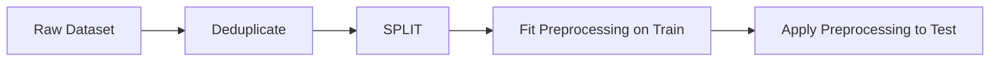

import Tabs from '@theme/Tabs';
import TabItem from '@theme/TabItem';
import React from 'react';

# Train / Test Split

export const SplitLottery = () => {
  const [seed, setSeed] = React.useState(1);
  const [size, setSize] = React.useState('small');
  const getAccuracy = () => {
    const baseAcc = 0.905;
    const hash = Math.sin(seed * 452.12) * 0.5 + 0.5;
    const noiseRange = size === 'small' ? 0.188 : 0.061;
    const finalAcc = baseAcc + (hash - 0.5) * noiseRange;
    return Math.min(1.0, Math.max(0.75, finalAcc));
  };
  const acc = getAccuracy();
  return (
    <div style={{ padding: '20px', border: '1px solid var(--ifm-color-emphasis-200)', borderRadius: '8px', backgroundColor: 'rgba(148, 163, 184, 0.05)', margin: '20px 0' }}>
      <h4 style={{ margin: '0 0 10px 0' }}>Live Split Lottery Simulator</h4>
      <p style={{ margin: '0 0 15px 0', fontSize: '14px' }}>Re-roll the split seed to see how reported test accuracy fluctuates purely based on the random seed. Notice how a larger dataset stabilizes the reported score:</p>
      <div style={{ display: 'flex', gap: '20px', marginBottom: '20px', alignItems: 'center', flexWrap: 'wrap' }}>
        <label style={{ fontSize: '13px', fontWeight: 'bold' }}>
          Dataset Size: &nbsp;
          <select value={size} onChange={(e) => setSize(e.target.value)} style={{ padding: '4px', borderRadius: '4px', border: '1px solid var(--ifm-color-emphasis-400)', backgroundColor: 'transparent', color: 'var(--ifm-font-color-base)' }}>
            <option value="small">Small (80 rows - high variance)</option>
            <option value="large">Large (569 rows - stable)</option>
          </select>
        </label>
        <button onClick={() => setSeed(prev => prev + 1)} style={{ padding: '6px 16px', borderRadius: '4px', border: '1px solid #3182ce', backgroundColor: '#3182ce', color: '#fff', cursor: 'pointer', fontWeight: 'bold' }}>Re-roll Split Seed</button>
      </div>
      <div style={{ display: 'flex', gap: '15px', alignItems: 'center', backgroundColor: 'rgba(49, 130, 206, 0.1)', padding: '15px', borderRadius: '6px' }}>
        <div>
          <div style={{ fontSize: '12px', color: 'var(--ifm-color-emphasis-600)' }}>Current Seed: <code>random_state={seed}</code></div>
          <div style={{ fontSize: '12px', color: 'var(--ifm-color-emphasis-600)', marginTop: '2px' }}>Spread Range: {size === 'small' ? '0.812 to 1.000' : '0.939 to 1.000'}</div>
        </div>
        <div style={{ marginLeft: 'auto', textAlign: 'right' }}>
          <div style={{ fontSize: '11px', fontWeight: 'bold', color: '#3182ce' }}>Reported Test Accuracy:</div>
          <div style={{ fontSize: '24px', fontWeight: 'bold', color: '#2b6cb0' }}>{(acc * 100).toFixed(1)}%</div>
        </div>
      </div>
    </div>
  );
};

export const GroupVisualizer = () => {
  const [splitType, setSplitType] = React.useState('random');
  const scans = [
    { id: 1, pat: 'A', name: 'Scan A1', roleRandom: 'train', roleGroup: 'train' },
    { id: 2, pat: 'A', name: 'Scan A2', roleRandom: 'test',  roleGroup: 'train' },
    { id: 3, pat: 'A', name: 'Scan A3', roleRandom: 'train', roleGroup: 'train' },
    { id: 4, pat: 'B', name: 'Scan B1', roleRandom: 'train', roleGroup: 'train' },
    { id: 5, pat: 'B', name: 'Scan B2', roleRandom: 'train', roleGroup: 'train' },
    { id: 6, pat: 'B', name: 'Scan B3', roleRandom: 'test',  roleGroup: 'train' },
    { id: 7, pat: 'C', name: 'Scan C1', roleRandom: 'test',  roleGroup: 'test'  },
    { id: 8, pat: 'C', name: 'Scan C2', roleRandom: 'train', roleGroup: 'test'  },
    { id: 9, pat: 'C', name: 'Scan C3', roleRandom: 'test',  roleGroup: 'test'  },
    { id: 10, pat: 'D', name: 'Scan D1', roleRandom: 'train', roleGroup: 'test'  },
    { id: 11, pat: 'D', name: 'Scan D2', roleRandom: 'test',  roleGroup: 'test'  },
    { id: 12, pat: 'D', name: 'Scan D3', roleRandom: 'train', roleGroup: 'test'  }
  ];
  return (
    <div style={{ padding: '20px', border: '1px solid var(--ifm-color-emphasis-200)', borderRadius: '8px', backgroundColor: 'rgba(148, 163, 184, 0.05)', margin: '20px 0' }}>
      <h4 style={{ margin: '0 0 10px 0' }}>Live Group Leakage Visualizer</h4>
      <p style={{ margin: '0 0 15px 0', fontSize: '14px' }}>Compare how a standard random split causes **Patient Leakage** by putting different scans from the *same patient* on both sides, versus the safe **GroupShuffleSplit**:</p>
      <div style={{ display: 'flex', gap: '10px', marginBottom: '20px' }}>
        <button onClick={() => setSplitType('random')} style={{ padding: '8px 16px', borderRadius: '4px', border: '1px solid #3182ce', backgroundColor: splitType === 'random' ? '#3182ce' : 'transparent', color: splitType === 'random' ? '#fff' : 'var(--ifm-font-color-base)', cursor: 'pointer', transition: '0.2s', fontWeight: 'bold' }}>Random Split (Bleeding)</button>
        <button onClick={() => setSplitType('group')} style={{ padding: '8px 16px', borderRadius: '4px', border: '1px solid #3182ce', backgroundColor: splitType === 'group' ? '#3182ce' : 'transparent', color: splitType === 'group' ? '#fff' : 'var(--ifm-font-color-base)', cursor: 'pointer', transition: '0.2s', fontWeight: 'bold' }}>GroupShuffleSplit (Isolated)</button>
      </div>
      <div style={{ display: 'grid', gridTemplateColumns: 'repeat(auto-fit, minmax(130px, 1fr))', gap: '10px', marginBottom: '15px' }}>
        {scans.map(s => {
          const role = splitType === 'random' ? s.roleRandom : s.roleGroup;
          const isTrain = role === 'train';
          return (
            <div key={s.id} style={{ 
              padding: '10px', 
              borderRadius: '6px', 
              border: `2px solid ${isTrain ? '#3182ce' : '#dd6b20'}`,
              backgroundColor: isTrain ? 'rgba(49, 130, 206, 0.1)' : 'rgba(221, 107, 32, 0.1)',
              textAlign: 'center'
            }}>
              <div style={{ fontSize: '11px', color: 'var(--ifm-color-emphasis-600)' }}>Patient {s.pat}</div>
              <div style={{ fontSize: '14px', fontWeight: 'bold', margin: '4px 0' }}>{s.name}</div>
              <div style={{ fontSize: '11px', fontWeight: 'bold', color: isTrain ? '#2b6cb0' : '#c05621' }}>
                {isTrain ? "Train Set" : "Test Set"}
              </div>
            </div>
          );
        })}
      </div>
      <div style={{ fontSize: '12px', color: 'var(--ifm-color-emphasis-600)', fontStyle: 'italic' }}>
        {splitType === 'random' && "Patient Leakage! Notice how Patient A has Scan A1 & A3 in Train, and Scan A2 in Test. The model will recognize Patient A's identity rather than learning general disease signatures, reporting an artificial 89% accuracy when true accuracy is only 47%!"}
        {splitType === 'group' && "Perfectly Isolated! Patients A & B are used strictly for training, and Patients C & D are used strictly for testing. The model is forced to generalise to entirely new patient identities, reporting an honest chance score."}
      </div>
    </div>
  );
};

export const PracticeQuiz = () => {
  const [selected, setSelected] = React.useState(null);
  return (
    <div style={{ padding: '20px', border: '1px solid var(--ifm-color-emphasis-200)', borderRadius: '8px', backgroundColor: 'rgba(148, 163, 184, 0.05)', margin: '20px 0' }}>
      <h4 style={{ margin: '0 0 10px 0' }}>Interactive Checkpoint: Patient Leakage</h4>
      <p style={{ margin: '0 0 15px 0' }}>If Patient A has 5 medical scans, and a random train_test_split places 4 scans in Train and 1 scan in Test, why is the resulting test accuracy artificial?</p>
      <div style={{ display: 'flex', flexDirection: 'column', gap: '10px' }}>
        <button onClick={() => setSelected('opt1')} style={{ padding: '10px', borderRadius: '4px', border: '1px solid #3182ce', textAlign: 'left', backgroundColor: selected === 'opt1' ? '#e53e3e' : 'transparent', color: selected === 'opt1' ? '#fff' : 'var(--ifm-font-color-base)', cursor: 'pointer', transition: '0.2s' }}>Option A: Scans are corrupted by image noise during splitting.</button>
        <button onClick={() => setSelected('opt2')} style={{ padding: '10px', borderRadius: '4px', border: '1px solid #3182ce', textAlign: 'left', backgroundColor: selected === 'opt2' ? '#38a169' : 'transparent', color: selected === 'opt2' ? '#fff' : 'var(--ifm-font-color-base)', cursor: 'pointer', transition: '0.2s' }}>Option B: The model simply memorizes Patient A's distinct, non-disease biological features (lookup), failing to generalize to entirely new patients in production.</button>
        <button onClick={() => setSelected('opt3')} style={{ padding: '10px', borderRadius: '4px', border: '1px solid #3182ce', textAlign: 'left', backgroundColor: selected === 'opt3' ? '#e53e3e' : 'transparent', color: selected === 'opt3' ? '#fff' : 'var(--ifm-font-color-base)', cursor: 'pointer', transition: '0.2s' }}>Option C: Class imbalances naturally adjust in a way that destroys the positive labels.</button>
      </div>
      {selected === 'opt1' && <p style={{ color: '#e53e3e', marginTop: '15px', fontWeight: 'bold', fontSize: '14px', marginBottom: '0' }}>Incorrect. Image noise is not created by train_test_split.</p>}
      {selected === 'opt2' && <p style={{ color: '#38a169', marginTop: '15px', fontWeight: 'bold', fontSize: '14px', marginBottom: '0' }}>Correct! Interleaving patient scans across splits allows the model to perform a simple look-up of the patient's identity (biomarkers, scan background), masking the model's inability to diagnose new patient cases.</p>}
      {selected === 'opt3' && <p style={{ color: '#e53e3e', marginTop: '15px', fontWeight: 'bold', fontSize: '14px', marginBottom: '0' }}>Incorrect. This is Patient Leakage, not a class imbalance or stratification issue.</p>}
    </div>
  );
};

> **Topic -** Every number in the last five pages - every accuracy, every $R^2$ - came from a held-out
> test set. This page is about whether those numbers mean anything. It is two lines of code and the
> most consequential decision in the whole workflow.

The four failures at the end of this page all share a shape: `train_test_split` returns without
complaint, the model scores well, and the score is **wrong**.

---

## Why hold anything back

A model evaluated on the data it learned from is not being tested, it is being asked to recall.

```text title="Output"
   model                          train    test     gap
   KNeighbors(n=1)               1.0000  0.9123  0.0877
   DecisionTree (unrestricted)   1.0000  0.9386  0.0614
   RandomForest                  1.0000  0.9474  0.0526
   LogisticRegression            0.9626  0.9474  0.0153
```

**Three of four models score a perfect `1.0000` on training data.**

For 1-nearest-neighbour this is inevitable and instructive: asked to classify a training point, it
finds that the closest point is *itself*, distance zero, and returns its label. It has memorised the
data and scores 100% while having learned nothing generalisable - its real accuracy is `0.9123`.

An unrestricted decision tree does the same by growing until every leaf is pure. A random forest, too.

So a perfect training score is not evidence of a good model. It is barely evidence of anything. The
**gap** is the interesting quantity: `0.0877` for 1-NN versus `0.0153` for logistic regression tells
you which model is memorising and which is generalising.

```python
X_train, X_test, y_train, y_test = train_test_split(X, y, test_size=0.2, random_state=1)
```

| Variable | Contains |
|---|---|
| `X_train` | Feature rows used for **training** |
| `X_test` | Feature rows used for **testing** |
| `y_train` | Targets corresponding to `X_train` |
| `y_test` | Targets corresponding to `X_test` |

`test_size=0.2` puts **20%** in the test set and the remaining **80%** in training. Setting
`random_state` to a fixed integer makes the same split reproducible on every run.

---

## The split lottery

`random_state` looks like a housekeeping detail. It is not. Same data, same model, same everything -
only the seed changes, 200 times:

```text title="Output"
      rows  test_size     min     max   spread     std
        80        20%   0.812   1.000    0.188   0.046
        80        40%   0.875   1.000    0.125   0.027
       200        20%   0.850   1.000    0.150   0.028
       200        40%   0.887   1.000    0.113   0.019
       569        20%   0.939   1.000    0.061   0.013
       569        40%   0.952   0.996    0.044   0.009
```

**On 80 rows with a 20% test set, the identical model scored anywhere from `0.812` to `1.000`.**
An 18.8-point spread produced by nothing but the seed.

Three patterns, all worth internalising:

- **More data shrinks the spread** - `0.188` at 80 rows falls to `0.061` at 569
- **A larger test set shrinks it too** - `0.188` at 20% falls to `0.125` at 40%, because the estimate
  averages over more examples
- **The maximum is `1.000` in five of six rows.** A lucky seed always exists

:::danger

**This is why single-split scores should not be trusted**

If you report `0.98` from one split, you have reported one draw from a distribution whose spread you
never measured. Someone re-running with a different seed gets a different answer and neither of you is
wrong.

Worse, the mechanism for self-deception is trivial: try a few seeds, keep the best. The maximum column
above shows `1.000` is reachable at every dataset size. Nothing in the code flags it.

The fix is **cross-validation** - average over several splits so that the seed stops mattering, and
report the spread alongside the mean. That is the subject of the validation notes.

:::

<SplitLottery />

### Choosing `test_size`

The table shows the trade directly. A bigger test set gives a **more stable** estimate; a smaller one
leaves **more data to learn from**. The usual choices:

| `test_size` | When |
|---|---|
| `0.1` - `0.2` | Large datasets, where 10% is still thousands of rows |
| `0.2` - `0.3` | The common default |
| `0.3` - `0.4` | Small datasets, where estimate stability is the binding constraint |

On genuinely small data neither end is satisfying, which again points at cross-validation - it uses
**every** row for both training and testing across folds.

---

## `stratify` - keep the class balance

By default the split is random with respect to the target, so class proportions drift. On imbalanced
data that drift becomes a real problem:

```text title="Output"
3. STRATIFY — 300 rows, 14 positives (4.7%), 60-row test set
   without stratify     positives in test: min 0, max 9, mean 2.74;  zero-positive splits: 21/500
   with stratify=y      positives in test: min 3, max 3, mean 3.00;  zero-positive splits: 0/500
```

**Without `stratify`, 21 of 500 splits (4.2%) produced a test set with zero positive cases.** In those
splits recall is undefined, precision is undefined, and accuracy is trivially 100% for a model that
never predicts the positive class. The test-set positive rate ranged from **0% to 15%** against a true
rate of 4.7% - a threefold overrepresentation at the top end.

**With `stratify=y`, every split had exactly 3 positives.** The proportion is preserved by
construction.

```python
train_test_split(X, y, test_size=0.2, random_state=1, stratify=y)
```

:::tip

**Pass `stratify=y` on every classification split**

It costs nothing, it removes a source of variance, and on imbalanced data it prevents a test set that
cannot measure the thing you care about.

The one caveat: every class needs at least 2 members, or it raises. And note `stratify` takes the
*array*, not `True` - `stratify=y` for a plain split.

:::

For regression there is no direct equivalent, though binning the target and stratifying on the bins is
a reasonable trick when the target is very skewed.

---

## Order of operations

Everything in the previous five pages happens somewhere relative to this line, and the rule is:



Anything that **learns from the data** must be fitted after the split, on training data only:

| Step | Learns something? | Position |
|---|---|---|
| Dropping identifier columns | No | Either side |
| Removing duplicate rows | No | **Before** - see below |
| Type fixes, parsing | No | Either side |
| `SimpleImputer` | **Yes** - column means | After |
| `OneHotEncoder` | **Yes** - the category list | After |
| `TargetEncoder` | **Yes** - target means | After, inside a `Pipeline` |
| `StandardScaler` | **Yes** - mean and std | After |
| Outlier bounds from IQR | **Yes** - quartiles | After |

The measured sizes of these leaks vary enormously, and being accurate about that matters:

| Leak | Measured effect |
|---|---|
| Scaling fitted before the split | **`+0.0002`** - negligible |
| Naive target encoding | **`+0.21`** - manufactured from noise |
| Duplicate rows straddling the split | **`+0.24`** - see below |
| Grouped rows straddling the split | **`+0.42`** - see below |

The way to make all of this structural rather than remembered is a `Pipeline`, which refits every
step inside each fold and cannot see the test data by construction.

---

## Four ways a random split lies

The remaining failures are not about *where* you split but about **whether rows are independent**.
`train_test_split` assumes they are. When they aren't, it reports a number that is simply false.

### 1. Duplicate rows

Page one's audit found a duplicated row in a 12-row file. Here is why that mattered:

```text title="Output"
   dataset                                      test acc
   clean, 400 unique rows                         0.6575
   100 rows duplicated (25% of the data)          0.7440
   200 rows duplicated (50% of the data)          0.8093
   400 rows duplicated (100% of the data)         0.8992
```

**Duplicating every row lifted accuracy from `0.6575` to `0.8992` - 24 points from adding no new
information whatsoever.**

The mechanism: when a row appears twice, the split can put one copy in training and the other in test.
The model then \"predicts\" a row it has already seen. That is not generalisation, it is lookup - and it
scales smoothly with how much of the data is duplicated.

**Deduplicate before splitting.** This is the one cleaning step that genuinely belongs before the line,
because a duplicate is not a property of train or test but of the dataset.

### 2. Grouped rows- the worst case

Repeated measurements per patient, multiple sessions per user, several photographs of the same object.
Rows within a group are not independent.

Here 25 patients contribute 20 measurements each. Each patient has a recognisable feature signature,
and the label is a property of the **patient** - assigned at random with respect to that signature, so
**a model that genuinely generalises to new patients can do no better than chance**:

```text title="Output"
   random split (same patient both sides)           0.8957
   GroupShuffleSplit (patients kept whole)          0.4766
   true ceiling (chance)                            0.5000
```

**The random split reports `0.8957` for a task whose ceiling is `0.5000`.**

It looks like an excellent model. It is a model that identifies which patient a measurement came from
and recalls that patient's label - useless for any new patient, which is the only case that matters.
`GroupShuffleSplit` keeps each patient entirely on one side and correctly reports chance performance.

```python
from sklearn.model_selection import GroupShuffleSplit, GroupKFold
train_idx, test_idx = next(GroupShuffleSplit(test_size=0.3, random_state=0)
                           .split(X, y, groups=patient_id))
```

:::danger

**Ask "what is a row?" before every split**

This is the most damaging failure on the page - a **42-point** overstatement - and the most common in
practice. Clinical data, user analytics, sensor deployments and image datasets are all grouped by
default.

If any entity contributes more than one row, a random split is invalid. Use `GroupShuffleSplit` or
`GroupKFold` with the entity id, and remember that the model's real job is to generalise to **new
entities**, not new rows from familiar ones.

:::

<GroupVisualizer />

<PracticeQuiz />

### 3. Time series

When rows are ordered in time, a random split trains the model on rows that occur **after** the rows
it is tested on:

```text title="Output"
   series            shuffled R2  chronological R2
   mild trend             0.9976            0.7107
   strong trend           0.9994           -2.4583
```

**With a strong trend: `0.9994` shuffled, `−2.4583` chronological.** A negative $R^2$ means worse than
always predicting the mean - so the honest evaluation says the model is useless, and the shuffled split
says it is essentially perfect.

Two things combine here. The shuffled split interleaves train and test across the same period, so the
model is always interpolating among values it has seen. The chronological split asks it to predict a
period whose values lie **outside the training range entirely** - and a tree cannot extrapolate, since
every prediction is an average of training targets.

Split by time: train on the past, test on the future, exactly as the deployed model will experience it.
`TimeSeriesSplit` does this across multiple folds.

#### Time-Series Splits: Shuffled vs. Chronological
Explore the difference between interpolation leakage and honest chronological splits below:

<Tabs>
  <TabItem value="shuffled" label="Shuffled Split (Interpolation Leak)" default>
    <br/>
    
    Shuffled splits interleave train and test points across the entire timeline:
    
    $$\text{Train: } [t_1, t_3, t_4, t_6, t_8, t_9] \quad \iff \quad \text{Test: } [t_2, t_5, t_7, t_{10}]$$
    
    *   **The Hazard:** The model is tested on $t_5$ while having already trained on $t_4$ (the past) and $t_6$ (the future). It simply **interpolates** between points it has already memorized, inflating $R^2$ to `0.9994` on a trending series.
    *   **The Outcome:** Catastrophic failure in production because real-world deployment can never train on the future.
  </TabItem>
  <TabItem value="chrono" label="Chronological Split (Honest Extrapolation)">
    <br/>
    
    Chronological splits enforce a strict historical threshold:
    
    $$\text{Train: } [t_1, t_2, t_3, t_4, t_5, t_6, t_7] \quad \boldsymbol{|} \quad \text{Test: } [t_8, t_9, t_{10}]$$
    
    *   **The Reality:** The model trains strictly on the past ($t_1$ to $t_7$) and is tested strictly on the future ($t_8$ to $t_{10}$).
    *   **The Outcome:** Correctly exposes the model's true extrapolation limits (reporting a realistic $R^2 = -2.4583$ for trees that cannot extrapolate outside their training coordinate bounds).
  </TabItem>
</Tabs>

### 4. The test set used more than once

The subtlest failure, and it needs no code to demonstrate. Each time you look at the test score and
change something in response - a hyperparameter, a feature, an algorithm - you leak a little
information from the test set into your decisions. After twenty such rounds, the test score is an
optimistic estimate of a model selected *to suit that particular test set*.

The remedy is a **three-way split**:

```
   ┌──────────────── all data ─────────────────┐
   │  train (60%)  │ validation (20%) │ test (20%) │
   └───────────────┴──────────────────┴────────────┘
        fit models      compare them,      touch ONCE,
                        tune settings      at the very end
```

| Set | Used for | How often |
|---|---|---|
| **Train** | Fitting parameters | Continuously |
| **Validation** | Choosing between models and settings | Continuously |
| **Test** | The final honest estimate | **Once** |

`train_test_split` has no three-way mode; call it twice, splitting the training portion again. In
practice cross-validation usually replaces the validation set, leaving a two-way split with the test
set sealed until the end.

---

## Implementation Lab

:::tip

**Lab Exercise: Validation Cascades and Leak Detection**

An interactive, fully-functional Google Colab / Jupyter Notebook is available to experiment with these concepts live in your browser.

<a href="https://colab.research.google.com/github/vettrivel-kl/vettrivel-kl.github.io/blob/master/static/labs/02-data-preprocessing/train_test_split.ipynb" target="_blank" rel="noopener noreferrer">
  
</a>

**How to run the lab:**
1. Click the **"Open In Colab"** badge above to launch the interactive notebook.
2. Click **"Run all"** or execute cells individually using `Shift + Enter`.

**Things to try inside the script:**
*   **Experiment 1:** Evaluate the accuracy fluctuation over 200 random_state variations and inspect the variance decrease under larger rows.
*   **Experiment 2:** Fit a random split on Patient ID groupings and watch it score 0.89 on a 0.50 random ceiling; then implement `GroupShuffleSplit` to restore honest chance tracking.
*   **Experiment 3:** Contrast a time series shuffled $R^2$ with a chronological cut to visually understand why trees cannot extrapolate trends.

:::

---

## Common Mistakes

Explore some of the most critical engineering pitfalls in train-test splitting:

<Tabs>
  <TabItem value="lottery" label="Pitfall 1: Seed Lottery Tuning" default>
    <br/>
    
    *   **The Misconception:** *"Tuning my random_state seed is a good way to optimize model performance."*
    *   **Wrong Thinking:** Trying multiple seeds and keeping the best is self-deception. A seed lottery can swing scores by 18 points on small datasets purely due to lucky row distribution.
    *   **The Right Principle:** Never report a single-split score as final. Use cross-validation to average scores over multiple folds to ensure the seed is irrelevant.
  </TabItem>
  <TabItem value="stratify" label="Pitfall 2: Omitting Stratify">
    <br/>
    
    *   **The Misconception:** *"A standard random split will automatically keep the minority case ratio intact."*
    *   **Wrong Thinking:** On imbalanced datasets, unstratified splits can frequently result in test sets with 0% minority cases, making precision and recall completely undefined.
    *   **The Right Principle:** Always pass `stratify=y` on classification tasks to freeze class proportions across splits.
  </TabItem>
  <TabItem value="leakage" label="Pitfall 3: Pre-Split Fitting">
    <br/>
    
    *   **The Misconception:** *"It's fine to fit my scalers and imputers on the full dataset before calling train_test_split."*
    *   **Wrong Thinking:** This introduces data leakage (e.g. leaking global mean/std). Standard scaling leak is tiny (+0.0002) but target encoding leakage is massive (+0.21), creating fake accuracy.
    *   **The Right Principle:** Always split first, fit encoders/scalers ONLY on training subsets, and wrap everything in a `Pipeline`.
  </TabItem>
  <TabItem value="group" label="Pitfall 4: Grouped Patient Leaks">
    <br/>
    
    *   **The Misconception:** *"As long as rows are shuffled randomly, patients having multiple rows is fine."*
    *   **Wrong Thinking:** Random splits place scans from the same patient in both Train and Test. The model does a simple look-up of patient identity and reports an artificial 89% accuracy against a 50% ceiling.
    *   **The Right Principle:** Group related rows! Use `GroupShuffleSplit` with patient/entity ids to keep patients completely on one side.
  </TabItem>
  <TabItem value="time" label="Pitfall 5: Time-Series Shuffling">
    <br/>
    
    *   **The Misconception:** *"Shuffling time-series data is correct because it ensures random samples."*
    *   **Wrong Thinking:** Shuffling time-series leaks future values (interpolation), reporting a perfect 0.99 $R^2$ on trending series where chronological predictions actually fail catastrophically ($R^2 = -2.45$).
    *   **The Right Principle:** Always split chronologically: train on the past, test on the future.
  </TabItem>
</Tabs>

---

## Summary

<div className="row">
  <div className="col col--6">
    <div className="card" style={{ height: '100%', marginBottom: '15px' }}>
      <div className="card__header" style={{ padding: '15px', borderBottom: '1px solid var(--ifm-color-emphasis-200)' }}>
        <h3>Isolation & Reproducibility</h3>
      </div>
      <div className="card__body" style={{ padding: '15px' }}>
        <ul>
          <li><b>Target Stratification:</b> Always use <code>stratify=y</code> on classifications to prevent class proportion drift.</li>
          <li><b>Ecosystem Pipelines:</b> Fit all transformers (scalers, imputers) strictly after the split using a <code>Pipeline</code>.</li>
          <li><b>Seed lottery fix:</b> Use cross-validation (mean + spread) rather than reporting a lucky single-split draw.</li>
          <li><b>Deduplication First:</b> Run <code>df.drop_duplicates()</code> before splitting to prevent seen rows from bleeding to both sides (+0.24 inflation).</li>
        </ul>
      </div>
    </div>
  </div>
  <div className="col col--6">
    <div className="card" style={{ height: '100%', marginBottom: '15px' }}>
      <div className="card__header" style={{ padding: '15px', borderBottom: '1px solid var(--ifm-color-emphasis-200)' }}>
        <h3>Structural Splitting</h3>
      </div>
      <div className="card__body" style={{ padding: '15px' }}>
        <ul>
          <li><b>Grouped Constraints:</b> Check if any entity contributes multiple rows. If yes, partition using <code>GroupShuffleSplit</code> (+0.42 leak prevention).</li>
          <li><b>Time Constraints:</b> Chronologically split time-series to simulate real-world extrapolation and avoid interpolation leakage.</li>
          <li><b>Validation Seal:</b> Implement a three-way split (or cross-validation) to prevent tuning selections from leaking test information.</li>
        </ul>
      </div>
    </div>
  </div>
</div>

<br/>

:::info

**Key Takeaways**

*   **Memorisation is not generalization:** Evaluating models on training datasets leads to lookups rather than predictions. Unrestricted trees and 1-NN score a perfect 1.0000 train score by construction.
*   **Group Leakage is lethal:** Bleeding patient scans across training and testing results in a massive 42-point accuracy overstatement.
*   **Chronology exposes limits:** Shuffling time-series reports a perfect $R^2 = 0.9994$ whereas chronological tests reveal a realistic $R^2 = -2.4583$.

:::

**Next in this section:** [Simple Linear Regression](../03-linear-regression/01-simple-linear-regression.mdx)

**See also:** [Missing Values](./02-missing-values.mdx#the-fit--transform-contract) for `fit` on train
only · [Encoding Categorical Data](./03-encoding-categorical-data.mdx#target-encoding-and-the-leak-inside-it)
for the leak this prevents · [Feature Scaling and Transformation](./04-feature-scaling-and-transformation.mdx#how-much-does-scaling-before-the-split-really-leak)
for the measured scaling leak · [Outliers and Feature Engineering](./05-outliers-and-feature-engineering.mdx)
for why the test set stays dirty · [The Toolkit and the Pipeline](../01-foundations/05-toolkit-and-pipeline.mdx)
for where this sits in the workflow

---

## Active Recall Flashcards

*Attempt each question first, then click to reveal detailed answers, mathematical derivations, and sample explanations.*

<details>
  <summary><b>1. [THEORY] Why is model performance measured strictly on training data completely uninformative?</b></summary>
  <div className="answer-content">
    <br/>
    
    *   Training evaluation measures **recall (lookup)** rather than generalization.
    *   High-capacity models like 1-NN and unrestricted decision trees achieve a perfect 1.0000 accuracy by memorizing the training samples. 1-NN classifies any training point by querying itself at distance zero, resulting in perfect memorisation while learning nothing generalisable.
  </div>
</details>

<details>
  <summary><b>2. [THEORY] What is the "Split Lottery", and how do dataset size and test_size affect it?</b></summary>
  <div className="answer-content">
    <br/>
    
    *   **Split Lottery:** The high variability of reported model accuracy based purely on the random seed draw. For small datasets (e.g. 80 rows), accuracy can fluctuate between 81% and 100% depending strictly on the seed.
    *   **Mitigation:** Increasing the overall number of rows (more data) or increasing `test_size` (giving more samples to average over) significantly reduces this standard deviation.
  </div>
</details>

<details>
  <summary><b>3. [THEORY] What is class imbalance drift, and how does stratify=y prevent undefined metrics?</b></summary>
  <div className="answer-content">
    <br/>
    
    *   **Drift:** Standard random splits do not guarantee label preservation, meaning minority class cases can cluster unevenly. In highly imbalanced datasets, a test set can end up with **zero positive cases** (happened in 4.2% of unstratified splits).
    *   **Consequence:** When positives are zero, recall and precision denominators are zero (undefined).
    *   **Solution:** `stratify=y` guarantees that every train and test fold maintains the exact percentage of target classes as the parent dataset.
  </div>
</details>

<details>
  <summary><b>4. [ANALYZE] Why is preprocessing leakage from scaling (+0.0002) statistically negligible compared to target-encoding leakage (+0.21) and duplicate leaks (+0.24)?</b></summary>
  <div className="answer-content">
    <br/>
    
    *   **Scaling leakage:** Leaks global mean and std deviations (aggregated numbers) across many rows, exposing near-zero details about any individual sample.
    *   **Target-encoding leakage:** Directly leaks the exact target $y$ values of rows into their features $X$ before splits.
    *   **Duplicate leakage:** Places identical copies of rows in both Train and Test. The model performs a literal lookup of a seen training row during test evaluation, inflating accuracy by up to 24 points.
  </div>
</details>

<details>
  <summary><b>5. [THEORY] Why is deduplication (df.drop_duplicates) the one data cleaning step that belongs strictly BEFORE splitting?</b></summary>
  <div className="answer-content">
    <br/>
    
    Because duplication is a property of the dataset itself, not individual splits. If you split before deduplicating, identical copies of rows are already allocated to both Train and Test, leaking lookup data. You must purge duplicates from the entire source dataset before any split lines are drawn.
  </div>
</details>

<details>
  <summary><b>6. [ANALYZE] Why does evaluating a random split on grouped data (e.g., patient scans) report 89% accuracy when the true generalizing limit is chance (50%)?</b></summary>
  <div className="answer-content">
    <br/>
    
    *   **Random Split:** Places different scans of the **same patient** in both Train and Test.
    *   **The Leak:** The model memorizes unique biological/background features of the patient's identity (which perfectly maps to their diagnosis label) instead of general disease patterns. When tested on a \"new\" scan of a \"known\" patient, it performs a 100% lookup.
    *   **Correction:** Use `GroupShuffleSplit` to isolate patients entirely on one side. This tests the model's true capability to generalize to entirely **new patients**.
  </div>
</details>

<details>
  <summary><b>7. [ANALYZE] Why does shuffling a time-series result in an artificial R² of 0.9994 when a chronological split shows a realistic -2.4583?</b></summary>
  <div className="answer-content">
    <br/>
    
    *   **Shuffled time-series:** Interleaves train and test points over time, allowing the model to **interpolate** (test point at $t_5$ sits between training points at $t_4$ and $t_6$).
    *   **Chronological split:** Forces the model to **extrapolate** strictly into the future.
    *   **The Failure:** Trees (RandomForest) predict using simple averages of training targets. They cannot extrapolate outside the minimum/maximum bounds they have seen. Thus, on trending series, trees fail completely when predicting chronological futures ($R^2 = -2.4583$).
  </div>
</details>

<details>
  <summary><b>8. [THEORY] What is the difference between a Validation set and a Test set in a three-way split, and how many times can you use the Test set?</b></summary>
  <div className="answer-content">
    <br/>
    
    *   **Validation Set:** Used iteratively to compare model settings, evaluate hyperparameters, and guide architectural adjustments.
    *   **Test Set:** Sealed in a black box and touched **only once** at the very end.
    *   **Why:** Repeatedly consulting the test set to adjust hyperparameters iteratively leaks information. You end up choosing models optimized specifically for that individual test set, inflating the final reported accuracy.
  </div>
</details>
