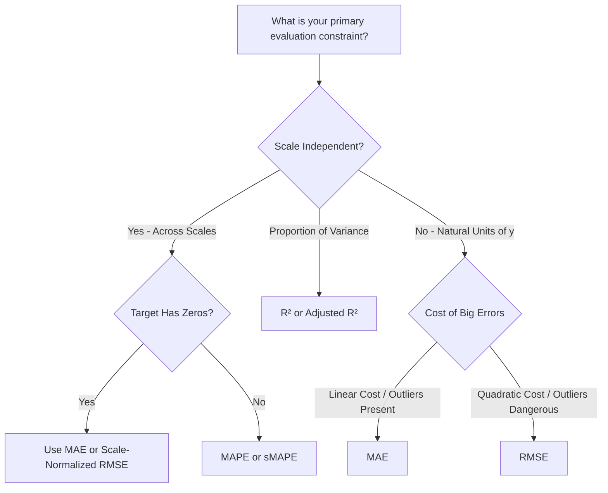

import Tabs from '@theme/Tabs';
import TabItem from '@theme/TabItem';
import React from 'react';

# Residual Analysis and Choosing a Metric

> **Topic —** A single summary metric (MAE, RMSE, $R^2$) reduces model performance to a single number, but it hides systematic flaws. Residuals—the individual error on every prediction—tell the true diagnostic story. This guide covers how to read residual patterns, detect violations like heteroscedasticity and nonlinearity, and choose the optimal reporting metric for your specific production constraints.

---

## 1. The Core Concept

A fitted regression model makes a point prediction for every observation. Subtracting the prediction from the actual ground truth yields the **residual**:

$$r_i = y_i - \hat{y}_i$$

While aggregate metrics evaluate overall accuracy, **residual analysis tests your model's statistical assumptions**. A well-fitted model extracts all predictable signal from the features, leaving behind only pure, white noise.

### Characteristics of Ideal Residuals

1.  **Zero Mean:** $\mathbb{E}[r] \approx 0$ across all slices of the data.
2.  **Constant Variance (Homoscedasticity):** The spread of residuals does not depend on the magnitude of $\hat{y}$ or any feature $x$.
3.  **Independence:** Residuals are uncorrelated with one another ($r_i$ gives no clue about $r_{i+1}$).
4.  **Normal Distribution:** Residuals are symmetrically distributed around zero with light tails, validating prediction intervals.

:::tip

**If you only take one thing from this page**

A single summary metric tells you **how much** error exists; residual plots tell you **why** that error exists and **how to fix it**. Good residuals resemble a formless, random cloud around zero. Any distinct shape (a curve, funnel, or cluster) indicates that your model has left predictable signal on the table.

:::

---

## 2. Interactive Equation Breakdown

Let us unpack the Relative Error formula (MAPE) to understand why percentage metrics behave differently than absolute metrics:

$$\text{MAPE} = \frac{100\%}{n} \sum_{i=1}^{n} \left| \frac{y_i - \hat{y}_i}{y_i} \right|$$

<Tabs>
  <TabItem value="numerator" label="Numerator: |y - ŷ|" default>
    <br/>
    
    *   **The Component:** $|y_i - \hat{y}_i|$
    *   **Role:** Measures the absolute distance between truth and guess.
    *   **Intuition:** The absolute value removes the direction of error, preventing positive and negative misses from cancelling each other out.
  </TabItem>
  <TabItem value="denominator" label="Denominator: / y">
    <br/>
    
    *   **The Component:** $\frac{1}{y_i}$
    *   **Role:** Normalizes the miss by the true magnitude, converting absolute rupees/units into a relative scale.
    *   **🚨 The Catch:** If $y_i = 0$, division by zero causes a crash. If $y_i$ is close to zero, a tiny error creates an astronomical percentage penalty.
  </TabItem>
  <TabItem value="scale" label="Scale Factor: 100% / n">
    <br/>
    
    *   **The Component:** $\frac{100\%}{n} \sum$
    *   **Role:** Calculates the arithmetic mean across all observations and formats the ratio as a familiar percentage.
  </TabItem>
</Tabs>

---

## 3. Diagnostic Plots: Visualizing the Misses

### Plot 1: Residuals vs. Fitted Values

This is the primary diagnostic plot. It displays predictions $\hat{y}$ on the horizontal axis and residuals $r$ on the vertical axis.

```
       Residual
          ▲
          │       •    •  •   •
          │     •   •       •
     r = 0├───•───•───•───•───•───•──► Fitted Values (ŷ)
          │     •   •       •
          │       •    •  •   •
          │
```

*   **Ideal (Homoscedasticity):** A uniform, random horizontal band around the zero line with constant width across all fitted values.
*   **Systematic Curve (Nonlinearity):** If the residuals bow upward or downward in a parabolic U-shape, the relationship between features and target is nonlinear.
    *   *Solution:* Introduce polynomial terms, splines, or switch to tree-based regressors.
*   **Funnel Shape (Heteroscedasticity):** If the vertical spread fans out or pinches inward as $\hat{y}$ increases, variance is non-constant.
    *   *Solution:* Apply a log or Box-Cox transform on $y$, or fit via Weighted Least Squares (WLS).

### Plot 2: Normal Q-Q Plot (Quantile-Quantile)

Compares the empirical quantiles of your standardized residuals against theoretical quantiles drawn from a standard normal distribution $\mathcal{N}(0, 1)$.

```
 Standardized
   Residuals
       ▲
       │          / •
       │        / •
       │      / •
  r = 0├────/•────────► Theoretical Quantiles
       │  / •
       │/ •
       │
```

*   **Ideal:** Points adhere closely to the 45-degree diagonal reference line.
*   **S-Curve Pattern:** Points deviate from the line at the extremes (tails). An upward bend on the right and downward bend on the left indicates heavy tails (leptokurtic error), meaning extreme outliers are much more frequent than a normal distribution expects.

### Plot 3: Scale-Location Plot

Plots $\sqrt{|\text{standardized residuals}|}$ against fitted values $\hat{y}$.

*   **Purpose:** Evaluates homoscedasticity directly by eliminating the sign of errors and dampening extreme outliers via the square root.
*   **Ideal:** A flat, horizontal trendline with evenly scattered points. An upward-sloping trend confirms that error magnitude expands systematically with higher predictions.

---

## 4. Decision Sandbox: Which Metric to Report?

export const MetricSelector = () => {
  const [goal, setGoal] = React.useState('interpret');
  return (
    <div style={{ padding: '20px', border: '1px solid var(--ifm-color-emphasis-200)', borderRadius: '8px', backgroundColor: 'rgba(148, 163, 184, 0.05)', margin: '20px 0' }}>
      <h4 style={{ margin: '0 0 10px 0' }}>🎯 Interactive Metric Chooser</h4>
      <p style={{ margin: '0 0 15px 0' }}>Select your primary objective or business constraint to find the appropriate evaluation metric:</p>
      <div style={{ display: 'flex', gap: '8px', flexWrap: 'wrap', marginBottom: '15px' }}>
        <button onClick={() => setGoal('interpret')} style={{ padding: '8px 14px', borderRadius: '4px', border: '1px solid #3182ce', backgroundColor: goal === 'interpret' ? '#3182ce' : 'transparent', color: goal === 'interpret' ? '#fff' : 'var(--ifm-font-color-base)', cursor: 'pointer', transition: '0.2s' }}>Natural Units & Outlier Robust</button>
        <button onClick={() => setGoal('penalty')} style={{ padding: '8px 14px', borderRadius: '4px', border: '1px solid #3182ce', backgroundColor: goal === 'penalty' ? '#3182ce' : 'transparent', color: goal === 'penalty' ? '#fff' : 'var(--ifm-font-color-base)', cursor: 'pointer', transition: '0.2s' }}>Penalize Large Errors Heavily</button>
        <button onClick={() => setGoal('relative')} style={{ padding: '8px 14px', borderRadius: '4px', border: '1px solid #3182ce', backgroundColor: goal === 'relative' ? '#3182ce' : 'transparent', color: goal === 'relative' ? '#fff' : 'var(--ifm-font-color-base)', cursor: 'pointer', transition: '0.2s' }}>Relative Percentage Error</button>
        <button onClick={() => setGoal('variance')} style={{ padding: '8px 14px', borderRadius: '4px', border: '1px solid #3182ce', backgroundColor: goal === 'variance' ? '#3182ce' : 'transparent', color: goal === 'variance' ? '#fff' : 'var(--ifm-font-color-base)', cursor: 'pointer', transition: '0.2s' }}>Proportion of Variance Explained</button>
      </div>
      {goal === 'interpret' && (
        <div style={{ padding: '12px', borderLeft: '4px solid #3182ce', backgroundColor: 'rgba(49, 130, 206, 0.08)' }}>
          <strong style={{ fontSize: '15px' }}>Report: MAE (Mean Absolute Error)</strong>
          <p style={{ margin: '6px 0 0 0', fontSize: '14px' }}><b>Why:</b> Direct, intuitive business translation. Off by an average of ₹50,000. Treats all misses linearly, meaning one massive outlier does not warp your entire model assessment.</p>
        </div>
      )}
      {goal === 'penalty' && (
        <div style={{ padding: '12px', borderLeft: '4px solid #dd6b20', backgroundColor: 'rgba(221, 107, 32, 0.08)' }}>
          <strong style={{ fontSize: '15px' }}>Report: RMSE (Root Mean Squared Error)</strong>
          <p style={{ margin: '6px 0 0 0', fontSize: '14px' }}><b>Why:</b> Preserves the original units of $y$, but the underlying squaring severely penalizes isolated catastrophic errors. Essential for safety-critical engineering, grid demand, or inventory where large errors cause non-linear losses.</p>
        </div>
      )}
      {goal === 'relative' && (
        <div style={{ padding: '12px', borderLeft: '4px solid #38a169', backgroundColor: 'rgba(56, 161, 105, 0.08)' }}>
          <strong style={{ fontSize: '15px' }}>Report: MAPE / sMAPE (Symmetric MAPE)</strong>
          <p style={{ margin: '6px 0 0 0', fontSize: '14px' }}><b>Why:</b> Normalizes error across products or entities spanning orders of magnitude (e.g. ₹100 items vs ₹1,000,000 items). <i>Constraint:</i> Cannot be used if target $y$ contains zero or near-zero values.</p>
        </div>
      )}
      {goal === 'variance' && (
        <div style={{ padding: '12px', borderLeft: '4px solid #805ad5', backgroundColor: 'rgba(128, 90, 213, 0.08)' }}>
          <strong style={{ fontSize: '15px' }}>Report: $R^2$ (or Adjusted $R^2$)</strong>
          <p style={{ margin: '6px 0 0 0', fontSize: '14px' }}><b>Why:</b> Standardized benchmark indicating the proportion of variance explained relative to a trivial mean baseline. Essential when benchmarking different model families against the same dataset.</p>
        </div>
      )}
    </div>
  );
};

<MetricSelector />

### Metric Selection Architecture



---

## 5. Implementation Lab

:::tip

**Lab Exercise: Residual Diagnostics and Outlier Impact**

An interactive, fully functional Google Colab / Jupyter Notebook is available to experiment with residual diagnostics, normality tests, and heteroscedasticity live in your browser.

<a href="https://colab.research.google.com/github/vettrivel-kl/vettrivel-kl.github.io/blob/master/static/labs/05-regression-metrics/residual_analysis.ipynb" target="_blank" rel="noopener noreferrer">
  
</a>

**How to run the lab:**
1. Click the **"Open In Colab"** badge above to launch the interactive notebook.
2. Run cells sequentially to generate synthetic non-linear and heteroscedastic datasets.

**Key Experiments to Run:**
*   **Experiment 1 (Shapiro-Wilk Normality):** Evaluate how underfitting quadratic data forces residual skewness and causes the Shapiro-Wilk test to reject normality ($p < 0.05$).
*   **Experiment 2 (Binned Variance Test):** Group residuals by fitted value bins to quantify the spreading variance of heteroscedastic datasets.
*   **Experiment 3 (Outlier Shock):** Corrupt a single row in a 20-sample dataset and track how RMSE diverges by $+10.0$ while MAE shifts by only $+1.2$.

:::

---

## 6. Common Mistakes

<Tabs>
  <TabItem value="m1" label="🚨 1. Trusting Aggregate Metrics Only" default>
    <br/>
    
    *   **The Misconception:** *"My model achieved an $R^2$ of 0.92 and low RMSE, so the model is well-specified and ready for production."*
    *   **❌ Wrong Thinking:** Relying entirely on single scalar summaries without visual diagnostics.
    *   **✅ The Right Principle:** Summary metrics average errors over all samples, concealing systematic failures. An underfit model with missing quadratic terms can still produce high $R^2$. Always inspect residual plots to verify zero-mean randomness.
  </TabItem>
  <TabItem value="m2" label="🚨 2. Ignoring Heteroscedasticity">
    <br/>
    
    *   **The Misconception:** *"A funnel-shaped residual pattern just means higher predictions have a bit more noise."*
    *   **❌ Wrong Thinking:** Treating increasing variance as harmless real-world scatter.
    *   **✅ The Right Principle:** Heteroscedasticity violates the core Gauss-Markov assumption of Ordinary Least Squares (OLS). While point predictions remain unbiased, the calculated standard errors and confidence intervals are invalid. Fix by applying variance-stabilizing transforms ($\log(y)$) or Weighted Least Squares.
  </TabItem>
  <TabItem value="m3" label="🚨 3. Using MAPE on Zero-Valued Targets">
    <br/>
    
    *   **The Misconception:** *"MAPE is the standard relative metric, so I should use it to benchmark all sales data."*
    *   **❌ Wrong Thinking:** Computing MAPE on datasets containing zero or near-zero observations.
    *   **✅ The Right Principle:** When $y_i = 0$, MAPE divides by zero and produces `inf` or `nan`. If $y_i$ is tiny, even an insignificant error produces thousands of percent in error. Use MAE, WAPE, or sMAPE instead.
  </TabItem>
  <TabItem value="m4" label="🚨 4. Cross-Dataset R² Comparisons">
    <br/>
    
    *   **The Misconception:** *"Model A has an $R^2$ of 0.85 on Dataset 1, while Model B has an $R^2$ of 0.70 on Dataset 2. Therefore, Model A is inherently superior."*
    *   **❌ Wrong Thinking:** Comparing $R^2$ across different datasets with different target variances.
    *   **✅ The Right Principle:** $R^2$ is normalized by the variance of the target in that specific dataset ($\text{SST}$). If Dataset 2 has minimal target spread, $R^2$ will appear lower even if prediction errors are smaller. Cross-dataset quality must be evaluated using unit-consistent metrics like MAE or RMSE.
  </TabItem>
  <TabItem value="m5" label="🚨 5. Overreacting to Q-Q Tail Deviations">
    <br/>
    
    *   **The Misconception:** *"Three points bend away from the line at the edge of the Q-Q plot, so the residuals are not normal and the model is invalid."*
    *   **❌ Wrong Thinking:** Expecting empirical samples to match infinite Gaussian theoretical quantiles at the extremes.
    *   **✅ The Right Principle:** Minor scatter at the extreme tails is expected, particularly on small sample sizes ($n < 100$). Only systematic, continuous curvature across the distribution (such as a pronounced S-curve) signifies meaningful departure from normality.
  </TabItem>
</Tabs>

---

## 7. Summary

<div className="row">
  <div className="col col--6">
    <div className="card" style={{ height: '100%', marginBottom: '15px' }}>
      <div className="card__header">
        <h3>🤖 Residual Diagnostics</h3>
      </div>
      <div className="card__body">
        <ul>
          <li><b>Residuals vs. Fitted:</b> Validates linearity and homoscedasticity. Points must form a patternless cloud around $r=0$.</li>
          <li><b>Normal Q-Q Plot:</b> Compares empirical error quantiles to theoretical normal quantiles. Systematic S-curves indicate heavy tails and outliers.</li>
          <li><b>Scale-Location:</b> Plots $\sqrt{|\text{std res}|}$ to detect variance expansion without outlier noise.</li>
          <li><b>Fixing Violations:</b> Curves require feature transformations or splines; funnels require log transforms or WLS.</li>
        </ul>
      </div>
    </div>
  </div>
  <div className="col col--6">
    <div className="card" style={{ height: '100%', marginBottom: '15px' }}>
      <div className="card__header">
        <h3>🛠️ Metric Selection Realities</h3>
      </div>
      <div className="card__body">
        <ul>
          <li><b>MAE:</b> Best for business communication in native units; robust to isolated outliers.</li>
          <li><b>RMSE:</b> Best when large misses must be severely penalized due to downstream costs.</li>
          <li><b>MAPE:</b> Measures relative percent errors; strictly invalid when target values reach zero.</li>
          <li><b>$R^2$:</b> Explains variance relative to the mean; valid only within the same target distribution.</li>
        </ul>
      </div>
    </div>
  </div>
</div>

<br/>

:::info

**📌 Key Takeaways**

*   **Residuals reveal structure:** Aggregate metrics condense errors into a single scalar, hiding nonlinear trends and unequal spread. Always inspect residual scatter before certifying a model.
*   **The Trinity of Checks:** Check Linearity and Homoscedasticity via *Residuals vs. Fitted*, Normality via *Q-Q Plot*, and Variance Drift via *Scale-Location*.
*   **Pick for your objective:** MAE for direct linear interpretation and outlier resistance; RMSE when extreme errors carry outsized business risk; MAPE for multi-scale percentage benchmarks without zeros; $R^2$ for relative variance explained within the same distribution.

:::

**Next Module:** [Validation Strategy - Why Cross-Validation](../06-validation-strategy/01-why-cross-validation.md) - moving from reporting error on single splits to robust out-of-sample resampling and cross-validation architectures.

---

## 8. Active Recall

*Test your understanding by answering first, then clicking to reveal the underlying principles.*

### Interactive Checkpoint Quiz

export const ResidualQuiz = () => {
  const [selected, setSelected] = React.useState(null);
  return (
    <div style={{ padding: '20px', border: '1px solid var(--ifm-color-emphasis-200)', borderRadius: '8px', backgroundColor: 'rgba(148, 163, 184, 0.05)', margin: '20px 0' }}>
      <h4 style={{ margin: '0 0 10px 0' }}>🧠 Interactive Checkpoint: Residual Pattern Diagnosis</h4>
      <p style={{ margin: '0 0 15px 0' }}>You inspect a <b>Residuals vs. Fitted Values</b> plot and observe an expanding funnel pattern (vertical spread increases systematically as predictions grow). What is this violation, and how should it be addressed?</p>
      <div style={{ display: 'flex', gap: '10px', flexWrap: 'wrap' }}>
        <button onClick={() => setSelected('opt1')} style={{ padding: '8px 16px', borderRadius: '4px', border: '1px solid #3182ce', backgroundColor: selected === 'opt1' ? '#e53e3e' : 'transparent', color: selected === 'opt1' ? '#fff' : 'var(--ifm-font-color-base)', cursor: 'pointer', transition: '0.2s' }}>Nonlinearity; fit a higher-degree polynomial</button>
        <button onClick={() => setSelected('opt2')} style={{ padding: '8px 16px', borderRadius: '4px', border: '1px solid #3182ce', backgroundColor: selected === 'opt2' ? '#38a169' : 'transparent', color: selected === 'opt2' ? '#fff' : 'var(--ifm-font-color-base)', cursor: 'pointer', transition: '0.2s' }}>Heteroscedasticity; log-transform y or apply Weighted Least Squares</button>
        <button onClick={() => setSelected('opt3')} style={{ padding: '8px 16px', borderRadius: '4px', border: '1px solid #3182ce', backgroundColor: selected === 'opt3' ? '#e53e3e' : 'transparent', color: selected === 'opt3' ? '#fff' : 'var(--ifm-font-color-base)', cursor: 'pointer', transition: '0.2s' }}>Autocorrelation; add lagged time-series features</button>
      </div>
      {selected === 'opt1' && <p style={{ color: '#e53e3e', marginTop: '15px', fontWeight: 'bold', fontSize: '14px', marginBottom: '0' }}>❌ Incorrect. A bowed curve indicates nonlinearity. A funnel shape indicates non-constant variance (heteroscedasticity). Try again!</p>}
      {selected === 'opt2' && <p style={{ color: '#38a169', marginTop: '15px', fontWeight: 'bold', fontSize: '14px', marginBottom: '0' }}>✅ Correct! A funnel shape confirms heteroscedasticity (error variance expands with prediction scale). Applying a variance-stabilizing transformation like $\log(y)$ or using Weighted Least Squares (WLS) restores constant variance.</p>}
      {selected === 'opt3' && <p style={{ color: '#e53e3e', marginTop: '15px', fontWeight: 'bold', fontSize: '14px', marginBottom: '0' }}>❌ Incorrect. Autocorrelation is detected in sequence-ordered residual lag plots, not standard fitted scatter plots. Try again!</p>}
    </div>
  );
};

<ResidualQuiz />

### Review Flashcards

<details>
  <summary>❓ <b>1. [THEORY] Why is an aggregate metric like RMSE or R² insufficient on its own to evaluate model health?</b></summary>
  <div className="answer-content">
    <br/>
    
    *   **Summary Loss:** An aggregate metric collapses hundreds or thousands of error data points into a single scalar value.
    *   **Masking Patterns:** A model that completely misses a quadratic trajectory can still report high $R^2$ (e.g. 0.85) simply because the linear trend accounts for the bulk of the variance.
    *   **The Diagnostic Value:** Residual plots reveal whether the remaining error is genuine white noise or contains unextracted deterministic patterns that indicate model underfitting.
  </div>
</details>

<details>
  <summary>❓ <b>2. [ANALYZE] Under what business circumstance should you select MAE over RMSE, and vice versa?</b></summary>
  <div className="answer-content">
    <br/>
    
    *   **Choose MAE when:** Communicating to non-technical stakeholders (direct linear interpretation) or when the training set contains inevitable measurement outliers that should not disproportionately skew model validation.
    *   **Choose RMSE when:** The cost of an error scales non-linearly. In supply chain or power grids, a prediction error of 100 units causes catastrophic stockouts, whereas ten 10-unit errors are easily absorbed. RMSE penalizes large errors quadratically.
  </div>
</details>

<details>
  <summary>❓ <b>3. [THEORY] What does an S-shaped departure from the diagonal in a Normal Q-Q plot signify?</b></summary>
  <div className="answer-content">
    <br/>
    
    *   **Heavy Tails (Leptokurtosis):** In an S-curve, the negative residuals are smaller than expected (bending downward) and positive residuals are larger than expected (bending upward).
    *   This indicates that extreme prediction errors occur far more frequently than a Gaussian distribution predicts.
    *   Standard confidence intervals derived from Gaussian assumptions will underestimate actual uncertainty.
  </div>
</details>

<details>
  <summary>❓ <b>4. [ANALYZE] Why does evaluating models across different datasets using R² lead to invalid conclusions?</b></summary>
  <div className="answer-content">
    <br/>
    
    *   **Dependence on Total Variance:** $R^2 = 1 - \frac{\text{SS}_{\text{res}}}{\text{SS}_{\text{tot}}}$. It is normalized by the total sum of squares of the dataset's target.
    *   If Dataset A has wide intrinsic target variation, its $\text{SS}_{\text{tot}}$ is huge, making $R^2$ appear high even with sloppy residuals.
    *   If Dataset B is tightly grouped around its mean, $\text{SS}_{\text{tot}}$ is small, resulting in a low $R^2$ despite having tiny absolute errors.
  </div>
</details>

<details>
  <summary>❓ <b>5. [PRACTICE] How do you systematically test if residuals violate the constant variance assumption without relying solely on visual inspection?</b></summary>
  <div className="answer-content">
    <br/>
    
    *   **Statistical Tests:** Execute the **Breusch-Pagan test** or **White's test**, which regress squared residuals against the independent features to test for statistically significant variance trends ($p < 0.05$ indicates heteroscedasticity).
    *   **Empirical Binned Variance:** Sort predictions into quantiles (e.g. 5 bins) and compute the standard deviation of residuals in each bin. A monotonic increase in standard deviation confirms a funnel pattern.
  </div>
</details>
