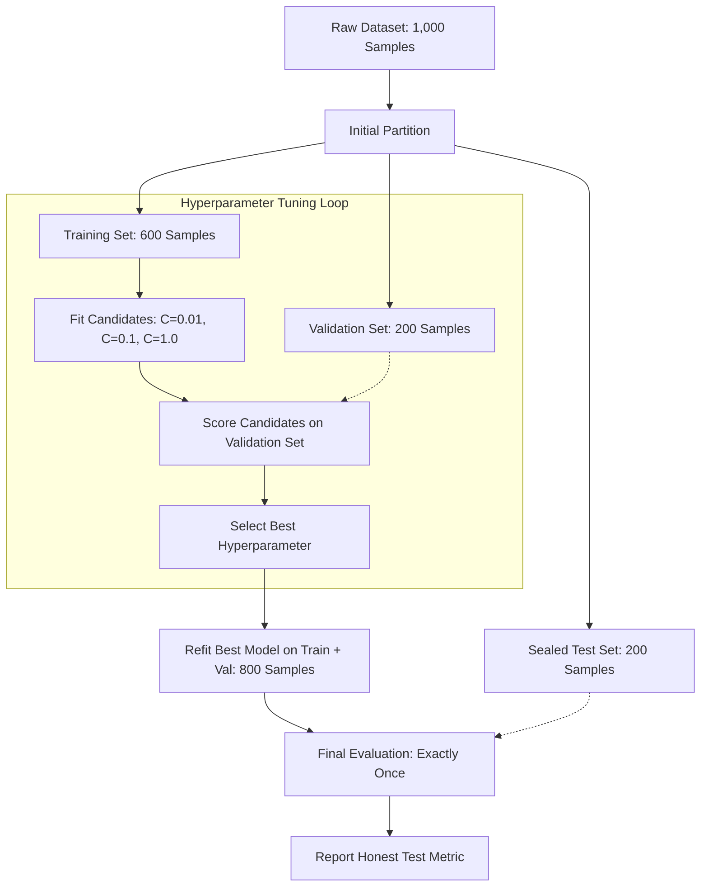

import Tabs from '@theme/Tabs';
import TabItem from '@theme/TabItem';
import React from 'react';

# Why Cross-Validation

> **Topic —** A single train-test split on one random partition of data is a gamble. You might get lucky (high test accuracy by chance) or unlucky (low test accuracy despite a well-specified model). This chapter explains why a single split is fundamentally fragile, introduces the three-way split (Train/Val/Test), and motivates cross-validation as an essential statistical defense against random partition noise.

---

## 1. The Core Concept

In machine learning, our ultimate objective is **generalization**: how accurately a model performs on completely unseen data drawn from the true underlying distribution.

To measure this, standard practice dictates separating our dataset into disjoint subsets. However, relying on a **single train-test split** introduces a silent statistical vulnerability: **sampling variance**.

### The Train-Test Split Lottery

Consider evaluating a model on 100 observations using an 80-20 split (80 train, 20 test). Because 20 test samples represent an extremely small sample size, the test score depends heavily on which specific rows happen to fall into the test bucket:

| Random Split | Train Size | Test Size | Measured Accuracy |
| :--- | :--- | :--- | :--- |
| Split 1 (`seed=0`) | 80 | 20 | 90.0% |
| Split 2 (`seed=1`) | 80 | 20 | 85.0% |
| Split 3 (`seed=2`) | 80 | 20 | 95.0% (Lucky Draw) |
| Split 4 (`seed=3`) | 80 | 20 | 80.0% (Unlucky Draw) |
| Split 5 (`seed=4`) | 80 | 20 | 90.0% |

*   **Empirical Mean:** $88.0\%$
*   **Standard Deviation:** $5.8\%$
*   **Spread Range:** $80.0\% - 95.0\%$ (A 15 percentage-point spread!)

:::tip

**If you only take one thing from this page**

A single train-test split does not measure a definitive property of your algorithm; it measures the algorithm's interaction with **one arbitrary lottery draw** of test rows. Cross-validation runs multiple distinct splits and averages the results to wash away partition noise.

:::

---

## 2. Evolution of Partitioning Strategies

<Tabs>
  <TabItem value="naive" label="1. No Split (Resubstitution)" default>
     
    
    *   **The Setup:** Train on 100% of the data; evaluate on the exact same 100% of the data.
    *   **The Flaw:** Severe optimistic bias. Models with high capacity (like unpruned decision trees or high-degree polynomials) achieve 100% training accuracy through pure rote memorization.
    *   **Verdict:** Gives zero indication of real-world generalization.
  </TabItem>
  <TabItem value="twoway" label="2. Two-Way Split (Train / Test)">
     
    
    *   **The Setup:** Partition into 80% Train and 20% Test.
    *   **The Flaw:** High variance on small datasets (the lottery effect). Furthermore, if you iteratively tune hyperparameters to maximize this test score, the test set becomes contaminated by implicit information leakage.
    *   **Verdict:** Acceptable only for very large datasets when no hyperparameter optimization is performed.
  </TabItem>
  <TabItem value="threeway" label="3. Three-Way Split (Train / Val / Test)">
     
    
    *   **The Setup:** Partition into 60% Train, 20% Validation, and 20% Test.
    *   **The Mechanics:** Train candidates on the training set, tune hyperparameters using the validation set, and evaluate the single winning configuration once on the sealed test set.
    *   **Verdict:** Standard industrial baseline for large datasets.
  </TabItem>
</Tabs>

---

## 3. The Three-Way Partition Lifecycle

To prevent hyperparameter tuning from memorizing test data, we must decouple model selection from final performance certification.

### The Sealed Test Set Protocol

The final test partition must remain **strictly sealed** until all architectural and hyperparameter choices are frozen:
1.  **Zero Peeking:** Never calculate summary statistics (mean, variance, distribution) on the test set during feature engineering.
2.  **Zero Model Selection:** Never use the test set to compare two distinct models or select regularizers.
3.  **Single Evaluation:** Evaluate the finalized model on the test partition exactly once. Any iterative re-tuning after seeing test performance converts the test set into a leaked validation set.

---

## 4. Implementation Lab

:::tip

**Lab Exercise: The Train-Test Lottery & Data Leakage**

An interactive, fully functional Google Colab / Jupyter Notebook is available to experiment with partition variance and test-peeking leakage live in your browser.

**How to run the lab:**
1. Click the **"Open In Colab"** badge above to launch the interactive notebook.
2. Run cells sequentially to generate synthetic non-linear and partition experiments.

**Key Experiments to Run:**
*   **Experiment 1 (The 15% Swing):** Observe how 5 consecutive random seeds on a 100-row dataset generate test accuracies ranging from 80% to 95%.
*   **Experiment 2 (Three-Way Split Flow):** Walk through hyperparameter optimization across $C \in [0.001, 10.0]$ using validation accuracy, followed by a final fit on combined data.
*   **Experiment 3 (Quantifying Leakage):** Simulate a researcher who tests 5 candidate configurations on the test set and reports the maximum, proving an artificial $+5.0\%$ performance inflation.

:::

---

## 5. Common Mistakes

<Tabs>
  <TabItem value="m1" label="1. Reporting Unanchored Test Accuracy" default>
     
    
    *   **The Misconception:** *"Our model achieved 91.2% accuracy on the test set, proving it will achieve ~91% in production."*
    *   **Wrong Thinking:** Quoting a single scalar accuracy without reporting standard deviation or confidence intervals.
    *   **The Right Principle:** On moderate datasets, a single test score has high standard error. Always report cross-validated performance as $\mu \pm \sigma$ (e.g., $88.6\% \pm 2.5\%$) to communicate partition uncertainty honestly.
  </TabItem>
  <TabItem value="m2" label="2. Test Set Peeking (Implicit Tuning)">
     
    
    *   **The Misconception:** *"I evaluated 10 different model architectures on the test set and reported the score of the best one."*
    *   **Wrong Thinking:** Using the test partition as an arbiter between candidate algorithms.
    *   **The Right Principle:** Selecting the best model using the test set optimizes for that specific test partition's idiosyncrasies. The reported score is optimistic and biased. Model selection must occur strictly on a validation set or via nested cross-validation.
  </TabItem>
  <TabItem value="m3" label="3. Inadvertent Feature Leakage Prior to Split">
     
    
    *   **The Misconception:** *"Standardizing the entire dataset with StandardScaler before train_test_split is harmless because it doesn't touch the labels."*
    *   **Wrong Thinking:** Computing global statistics across all samples before partitioning.
    *   **The Right Principle:** Calculating feature means or standard deviations across the whole dataset leaks test set distribution information into the training pipeline. Always split first, fit scalers exclusively on the training partition, and use `transform` on the test partition.
  </TabItem>
  <TabItem value="m4" label="4. Ignoring Class Imbalance in Random Splits">
     
    
    *   **The Misconception:** *"A random 80-20 split automatically preserves class balance across partitions."*
    *   **Wrong Thinking:** Relying on unstratified random sampling on imbalanced classification datasets.
    *   **The Right Principle:** In rare-event detection (e.g. 1% fraud), an unstratified split can easily assign zero positive instances to the test set purely by chance. Always use **Stratified Splits** to ensure identical class proportions across all partitions.
  </TabItem>
  <TabItem value="m5" label="5. Discarding the Validation Set During Final Training">
     
    
    *   **The Misconception:** *"Once hyperparameter tuning is complete, evaluate the model trained on just the 60% training set on the test set."*
    *   **Wrong Thinking:** Leaving 20% of your valuable training data on the table.
    *   **The Right Principle:** After selecting the winning hyperparameter configuration using the validation set, refit the model on the combined **Train + Validation (80%)** data before final evaluation on the test set. More data yields better parameter estimates.
  </TabItem>
</Tabs>

---

## 6. Summary

  

    

      

        <h3>Partitioning Realities</h3>
      

      

        <ul>
          <li><b>Sampling Variance:</b> On small or moderate datasets, single test scores exhibit massive fluctuations based on partition randomness.</li>
          <li><b>Two-Way Split:</b> Acceptable only when data is abundant and hyperparameters are fixed in advance.</li>
          <li><b>Three-Way Split:</b> Decouples parameter fitting (Train), hyperparameter tuning (Validation), and unbiased assessment (Test).</li>
          <li><b>Refitting Principle:</b> After hyperparameter selection, combine Train and Validation sets to train the final model.</li>
        </ul>
      

    

  

  

    

      

        <h3>Experimental Hygiene</h3>
      

      

        <ul>
          <li><b>Sealed Test Set:</b> Must never be inspected, tuned against, or used for feature selection.</li>
          <li><b>Leakage Prevention:</b> Preprocessing pipelines (imputation, scaling, encoding) must be fitted strictly on training folds.</li>
          <li><b>Stratification:</b> Mandatory for classification datasets with class imbalances to avoid degenerate splits.</li>
          <li><b>The Path Forward:</b> When data is too limited to sacrifice 20% for a validation set, <b>K-Fold Cross-Validation</b> is required.</li>
        </ul>
      

    

  

 

:::info

**Key Takeaways**

*   **The Lottery Trap:** A single split gives a single point estimate with unknown variance. Never trust an unanchored test metric.
*   **The Sealed Vault:** The test partition is a sealed envelope opened exactly once. The moment it guides any modeling decision, it ceases to be an honest test set.
*   **The Cross-Validation Mandate:** Whenever dataset size makes a three-way split prohibitive, K-Fold Cross-Validation provides the gold standard for reliable generalization estimates.

:::

**Next Section:** [Cross-Validation Methods](./02-cross-validation-methods.mdx) - exploring Leave-One-Out (LOO), Leave-P-Out (LPO), and K-Fold architectures.

---

## 7. Active Recall

*Test your understanding by answering first, then clicking to reveal the underlying principles.*

### Interactive Checkpoint Quiz

export const ValidationQuiz = () => {
  const [selected, setSelected] = React.useState(null);
  return (
    

      <h4 style={{ margin: '0 0 10px 0' }}>Interactive Checkpoint: The Kaggle Leaderboard Trap</h4>
      
A machine learning practitioner submits 150 different models to a competition public leaderboard, choosing the model that scored highest on the public test set. When final rankings are calculated on the private test set, their rank plunges dramatically. What statistical failure occurred?

      

        <button onClick={() => setSelected('opt1')} style={{ padding: '8px 16px', borderRadius: '4px', border: '1px solid #3182ce', backgroundColor: selected === 'opt1' ? '#e53e3e' : 'transparent', color: selected === 'opt1' ? '#fff' : 'var(--ifm-font-color-base)', cursor: 'pointer', transition: '0.2s' }}>The model underfit the training data</button>
        <button onClick={() => setSelected('opt2')} style={{ padding: '8px 16px', borderRadius: '4px', border: '1px solid #3182ce', backgroundColor: selected === 'opt2' ? '#38a169' : 'transparent', color: selected === 'opt2' ? '#fff' : 'var(--ifm-font-color-base)', cursor: 'pointer', transition: '0.2s' }}>They overfit the public test set through repetitive feedback leakage</button>
        <button onClick={() => setSelected('opt3')} style={{ padding: '8px 16px', borderRadius: '4px', border: '1px solid #3182ce', backgroundColor: selected === 'opt3' ? '#e53e3e' : 'transparent', color: selected === 'opt3' ? '#fff' : 'var(--ifm-font-color-base)', cursor: 'pointer', transition: '0.2s' }}>The private test set used a different evaluation metric</button>
      

      {selected === 'opt1' && 
Incorrect. The model did not necessarily underfit; it achieved top performance on the public split. Try again!
}
      {selected === 'opt2' && 
Correct! Submitting 150 times and selecting the top score turns the public test set into an unsealed validation set. The practitioner overfit to the idiosyncratic noise of the public split, causing performance to collapse on the truly sealed private test set.
}
      {selected === 'opt3' && 
Incorrect. Competitions use identical evaluation metrics across both public and private splits. Try again!
}
    

  );
};

<ValidationQuiz />

### Review Flashcards

  
<b>1. [THEORY] Why does a single train-test split introduce high estimation variance on small datasets?</b>

  

     
    
    *   **Sampling Fluctuation:** When a test set contains few samples (e.g., $n=20$), each individual misclassification shifts the error rate by 5 full percentage points.
    *   **Cluster Density:** Depending on the random seed, outliers or borderline ambiguous instances may cluster disproportionately in either the train or test partition.
    *   **The Result:** The reported score reflects the idiosyncrasies of that specific lottery draw rather than the true expected risk of the model.
  

  
<b>2. [ANALYZE] Why is it statistically invalid to report validation set accuracy as the final generalization performance of your model?</b>

  

     
    
    *   **Selection Bias:** The validation set was actively used to pick the best hyperparameter configuration among many alternatives.
    *   **Information Leakage:** Even though the model was not trained on the validation rows via gradient descent, the human engineer "trained" on it by choosing whichever hyperparameter performed best on that specific set of rows.
    *   **Optimistic Bias:** The validation score is biased upward. An independent, untouched test set is required to assess true generalization.
  

  
<b>3. [PRACTICE] In a 3-way split (Train/Val/Test), why do we refit the chosen model on Train + Val before testing?</b>

  

     
    
    *   **Data Maximization:** The validation set's sole purpose was to identify the optimal hyperparameters (e.g. $C=0.1$).
    *   Once that choice is frozen, holding out the validation data is wasteful.
    *   Refitting on combined **Train + Val** provides more sample diversity, decreases parameter variance, and yields a higher-performing model for deployment.
  

  
<b>4. [THEORY] What is the difference between data leakage via feature engineering vs. leakage via hyperparameter tuning?</b>

  

     
    
    *   **Feature Engineering Leakage:** Fitting transforms (imputers, scalers, encoders) on the entire dataset allows test set statistics (mean, variance) to contaminate training features before the model fits.
    *   **Hyperparameter Tuning Leakage:** Using test set evaluation scores to select hyperparameters or model architectures optimizes parameters against the test partition, corrupting the test set's independence.
  

  
<b>5. [ANALYZE] If you have a dataset of only 150 rows, why is a 3-way split problematic, and what should you do instead?</b>

  

     
    
    *   **Severe Data Starvation:** A 60/20/20 split leaves only 90 rows for training, 30 for validation, and 30 for testing.
    *   90 rows is insufficient for model convergence, and 30 validation rows makes hyperparameter tuning highly unstable (one row = 3.3% accuracy swing).
    *   **The Solution:** Use **Nested K-Fold Cross-Validation**, which avoids setting aside a static validation split while still providing unbiased hyperparameter tuning and performance estimation.
  

