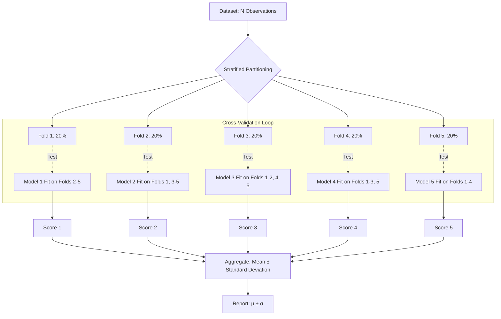

import Tabs from '@theme/Tabs';
import TabItem from '@theme/TabItem';
import React from 'react';

# K-Fold and Stratified K-Fold

> **Topic —** While K-Fold Cross-Validation is the practical standard for evaluating machine learning models, tuning the fold count $K$ and handling class proportions are critical to obtaining trustworthy estimates. This guide explores the statistical trade-offs of selecting $K$, why **Stratified K-Fold** is mathematically essential on imbalanced classification datasets, and walks through the end-to-end fold execution architecture.

---

## 1. The Core Concept

In standard **K-Fold Cross-Validation**, the dataset of $N$ observations is partitioned into $K$ contiguous or randomly shuffled folds of roughly equal size $\approx N/K$. 

Across $K$ distinct training rounds:
*   Fold $i$ serves as the **test set** ($N/K$ samples).
*   The union of the remaining $K-1$ folds forms the **training set** ($\frac{K-1}{K} N$ samples).
*   The model fits on the training set, predicts on the test fold, and records an evaluation metric.

The final generalization metric is computed by taking the mean and standard error of the $K$ recorded scores.

:::tip

**If you only take one thing from this page**

For balanced datasets or regression tasks, standard **K-Fold ($K=5$ or $K=10$)** is optimal. But for any classification problem with class imbalance, standard K-Fold risks creating folds with zero minority samples. You must use **Stratified K-Fold**, which forces every fold to preserve the original class ratio.

:::

---

## 2. Choosing K: Practical Rules of Thumb

Selecting the number of folds $K$ involves balancing **computational budget**, **estimation bias**, and **fold variance**:

<Tabs>
  <TabItem value="small" label="🌱 Small Data (N < 100)" default>
     
    
    *   **Recommended:** $K=3$ or Leave-One-Out (LOO-CV).
    *   **Statistical Rationale:** When data is scarce, setting $K=10$ creates test folds with only a handful of rows, resulting in noisy, binary-like evaluations. Setting $K=3$ or $K=5$ preserves enough training data per fold to allow model convergence.
  </TabItem>
  <TabItem value="medium" label="🌿 Medium Data (100 ≤ N ≤ 10,000)">
     
    
    *   **Recommended:** $K=5$ (Speed Default) or $K=10$ (Benchmark Standard).
    *   **Statistical Rationale:** Training on 80% ($K=5$) or 90% ($K=10$) of the data places your model near the flat asymptote of its learning curve, keeping pessimistic bias negligible while averaging out partition noise over 5 to 10 independent test sets.
  </TabItem>
  <TabItem value="large" label="🌳 Large Data (N > 10,000)">
     
    
    *   **Recommended:** $K=5$ or a single 3-way split (Train/Val/Test).
    *   **Statistical Rationale:** With large sample sizes, parameter estimates are highly stable. The marginal bias reduction between 5-Fold and 10-Fold is undetectable, but 10-Fold doubles your computational and energy footprint.
  </TabItem>
</Tabs>

---

## 3. The Stratification Imperative

When dealing with class imbalance (e.g., 95% negative, 5% positive), standard random shuffling is dangerous:

<Tabs>
  <TabItem value="random" label="❌ Standard K-Fold (Unstratified)" default>
     
    
    *   **The Hazard:** Random partitioning distributes samples without regard to target labels.
    *   **Example (100 rows, 5 positives, K=5):**
        *   Fold 1: 20 negative, **0 positive** (Test fold has 0% minority class!).
        *   Fold 2: 19 negative, 1 positive.
        *   Fold 5: 18 negative, **2 positives** (Twice the natural frequency).
    *   **The Failure:** The model tested on Fold 1 cannot compute Precision, Recall, or ROC-AUC correctly because the positive class does not exist in the test ground truth.
  </TabItem>
  <TabItem value="stratified" label="✅ Stratified K-Fold">
     
    
    *   **The Mechanism:** Groups samples by class label before partitioning, systematically distributing minority instances evenly across all $K$ buckets.
    *   **Example (100 rows, 5 positives, K=5):**
        *   Fold 1: 19 negative, 1 positive (95:5 ratio).
        *   Fold 2: 19 negative, 1 positive (95:5 ratio).
        *   Fold 5: 19 negative, 1 positive (95:5 ratio).
    *   **The Guarantee:** Every fold represents a miniature, proportional replica of the true population distribution.
  </TabItem>
</Tabs>

---

## 4. The K-Fold Process Architecture

---

## 5. Implementation Lab

:::tip

**Lab Exercise: Stratified vs. Random K-Fold & Variance Scaling**

An interactive, fully functional Google Colab / Jupyter Notebook is available to experiment with fold size selection, severe class imbalance splits, and step-by-step CV loops.

**How to run the lab:**
1. Click the **"Open In Colab"** badge above to launch the interactive notebook.
2. Run cells sequentially to simulate imbalanced datasets and observe fold composition.

**Key Experiments to Run:**
*   **Experiment 1 (Variance Scaling):** Track how standard deviation of CV scores drops systematically as $N$ expands from 50 to 1,000 rows.
*   **Experiment 2 (The Zero-Minority Fold):** Inspect an unstratified 5-Fold split on a 95:5 dataset to witness a fold containing zero positive samples.
*   **Experiment 3 (Manual CV Loop):** Step through the explicit training and evaluation loops on 20 samples to see how individual fold accuracies average out to a stable score ($85.0\% \pm 0.200$).

:::

---

## 6. Common Mistakes

<Tabs>
  <TabItem value="m1" label="🚨 1. Using Standard KFold on Imbalanced Classes" default>
     
    
    *   **The Misconception:** *"Shuffling the dataset before running standard KFold ensures random class distribution, making stratification redundant."*
    *   **❌ Wrong Thinking:** Relying on chance to preserve rare event proportions.
    *   **✅ The Right Principle:** Random sampling on rare classes (e.g. 1% fraud) frequently leads to zero-event test folds or over-concentrated training folds. Always use `StratifiedKFold` for classification.
  </TabItem>
  <TabItem value="m2" label="🚨 2. Attempting to Stratify Continuous Targets">
     
    
    *   **The Misconception:** *"StratifiedKFold is safer, so I will use it for my house price regression model."*
    *   **❌ Wrong Thinking:** Applying classification splitters to continuous float targets.
    *   **✅ The Right Principle:** `StratifiedKFold` expects discrete categorical labels. Running it on continuous regression targets raises a `ValueError` or creates thousands of single-sample strata. For regression, use standard `KFold` (or bin targets into quantiles if distribution stratification is strictly required).
  </TabItem>
  <TabItem value="m3" label="🚨 3. Neglecting to Set a Random Seed on Shuffled Folds">
     
    
    *   **The Misconception:** *"Setting shuffle=True is enough for a good cross-validation run."*
    *   **❌ Wrong Thinking:** Omitting `random_state` during shuffled cross-validation.
    *   **✅ The Right Principle:** Without `random_state`, every execution partitions data differently, preventing reproducible bug diagnostics and invalidating fair model-to-model comparisons. Always pin `random_state=42`.
  </TabItem>
  <TabItem value="m4" label="🚨 4. Comparing Models Using Different Folds">
     
    
    *   **The Misconception:** *"I evaluated Model A with K=5 and Model B with K=10, and Model B scored 1% higher, so Model B is better."*
    *   **❌ Wrong Thinking:** Comparing models evaluated across different fold counts or different partition seeds.
    *   **✅ The Right Principle:** Different $K$ values possess different estimation biases. To compare two algorithms fairly, evaluate them on the **exact same cross-validation splits** using identical splitters.
  </TabItem>
  <TabItem value="m5" label="🚨 5. Tuning Inside the Evaluation Fold Loop">
     
    
    *   **The Misconception:** *"Inside each fold, I tested 10 different regularization strengths on the test fold and picked the winner."*
    *   **❌ Wrong Thinking:** Using the evaluation test fold as a tuning set.
    *   **✅ The Right Principle:** The test fold must be evaluated strictly once per outer loop. Optimizing hyperparameters on the test fold causes severe data leakage. Use nested cross-validation or a separate train/val/test split.
  </TabItem>
</Tabs>

---

## 7. Summary

  

    

      

        <h3>🤖 Fold Selection Realities</h3>
      

      

        <ul>
          <li><b>Standard Sweet Spot:</b> $K=5$ or $K=10$ strikes the ideal balance between low bias, manageable variance, and training speed.</li>
          <li><b>Large Datasets ($N > 10,000$):</b> $K=5$ is preferred; larger $K$ doubles training time for imperceptible bias gains.</li>
          <li><b>Reporting Standard:</b> Publish both mean and standard deviation ($\mu \pm \sigma$) across the $K$ folds.</li>
        </ul>
      

    

  

  

    

      

        <h3>🛠️ Stratification Rules</h3>
      

      

        <ul>
          <li><b>Mandatory for Classification:</b> Always deploy `StratifiedKFold` whenever classes are imbalanced.</li>
          <li><b>Continuous Targets:</b> Stratification applies to discrete labels; use standard `KFold` for continuous regression.</li>
          <li><b>Reproducibility:</b> Always pair `shuffle=True` with an explicit `random_state` seed.</li>
        </ul>
      

    

  

 

:::info

**📌 Key Takeaways**

*   **⚖️ Stratification protects rare classes:** On imbalanced problems, unstratified splits can create unrepresentative or completely empty test folds.
*   **🎯 Anchor your metrics:** Never quote a single cross-validation number. A score of $85\% \pm 0.5\%$ indicates stability; $85\% \pm 8.0\%$ flags dangerous partition sensitivity.
*   **🔒 Standardize the benchmark:** Always test competing model architectures on the exact same folds.

:::

**Next Section:** [Data Leakage and Best Practices](./04-data-leakage-and-best-practices.md) - preventing subtle pipeline leakage, feature-scaling contamination, and mastering Nested CV.

---

## 8. Active Recall

*Test your understanding by answering first, then clicking to reveal the underlying principles.*

### Interactive Checkpoint Quiz

export const StratificationQuiz = () => {
  const [selected, setSelected] = React.useState(null);
  return (
    

      <h4 style={{ margin: '0 0 10px 0' }}>🧠 Interactive Checkpoint: Handling Severe Imbalance</h4>
      
You are training a fraud detection model on 10,000 transactions where only 50 are fraudulent (0.5% fraud rate). Why is standard 10-Fold CV unacceptable here?

      

        <button onClick={() => setSelected('opt1')} style={{ padding: '8px 16px', borderRadius: '4px', border: '1px solid #3182ce', backgroundColor: selected === 'opt1' ? '#e53e3e' : 'transparent', color: selected === 'opt1' ? '#fff' : 'var(--ifm-font-color-base)', cursor: 'pointer', transition: '0.2s' }}>Because 10 folds takes too long to compute on 10,000 samples</button>
        <button onClick={() => setSelected('opt2')} style={{ padding: '8px 16px', borderRadius: '4px', border: '1px solid #3182ce', backgroundColor: selected === 'opt2' ? '#38a169' : 'transparent', color: selected === 'opt2' ? '#fff' : 'var(--ifm-font-color-base)', cursor: 'pointer', transition: '0.2s' }}>Random splits can easily yield test folds with 0 or 1 fraud cases, invalidating recall metrics</button>
        <button onClick={() => setSelected('opt3')} style={{ padding: '8px 16px', borderRadius: '4px', border: '1px solid #3182ce', backgroundColor: selected === 'opt3' ? '#e53e3e' : 'transparent', color: selected === 'opt3' ? '#fff' : 'var(--ifm-font-color-base)', cursor: 'pointer', transition: '0.2s' }}>Because standard K-Fold only works on regression datasets</button>
      

      {selected === 'opt1' && 
❌ Incorrect. 10 fits on 10,000 tabular rows completes in seconds for standard linear or tree models. Try again!
}
      {selected === 'opt2' && 
✅ Correct! With only 50 positives across 10 folds, each fold averages just 5 positive cases. In an unstratified split, random variance will leave some folds with 0 or 1 positive samples, making Precision and Recall completely degenerate. StratifiedKFold guarantees exactly 5 positives per fold.
}
      {selected === 'opt3' && 
❌ Incorrect. Standard K-Fold works on both regression and classification, but it ignores class distributions. Try again!
}
    

  );
};

<StratificationQuiz />

### Review Flashcards

  
❓ <b>1. [THEORY] How does Stratified K-Fold partition data differently from standard K-Fold?</b>

  

     
    
    *   **Standard K-Fold:** Shuffles indices globally and splits data into $K$ contiguous slices, completely blind to target values.
    *   **Stratified K-Fold:** Segregates indices by class label first (creating separate strata for each class), splits each stratum into $K$ equal sub-buckets, and merges the $i$-th sub-bucket from each class to construct fold $i$.
    *   This guarantees that every fold matches the exact population class proportions.
  

  
❓ <b>2. [ANALYZE] Why is setting K=20 usually wasteful compared to K=5 on medium tabular datasets?</b>

  

     
    
    *   **Diminishing Returns on Bias:** The training size difference between 80% ($K=5$) and 95% ($K=20$) is minimal once sample size surpasses a few thousand observations.
    *   **Fold Noise:** With $K=20$, each test fold holds only 5% of the data, increasing evaluation noise per fold.
    *   **Computational Cost:** $K=20$ takes $4\times$ longer to compute than $K=5$ with no meaningful improvement in selection accuracy.
  

  
❓ <b>3. [PRACTICE] Can StratifiedKFold be applied directly to a continuous target in a regression problem?</b>

  

     
    
    *   **No:** Stratification requires discrete categorical bins to group sample indices.
    *   Passing continuous floating-point targets directly into `StratifiedKFold` will raise a `ValueError` or treat every unique floating-point value as its own class.
    *   If distribution balance is mandatory in regression, discretize the target into quantiles using `pd.qcut` first, pass those discrete bins to `StratifiedKFold`, and fit on the continuous target.
  

  
❓ <b>4. [THEORY] What is the difference between setting shuffle=False vs. shuffle=True in KFold?</b>

  

     
    
    *   **shuffle=False:** Partitions the data into consecutive ordered blocks. If the dataset was collected chronologically or sorted by target label, folds will be severely biased.
    *   **shuffle=True:** Randomizes index order before slicing into folds, ensuring that each fold draws independently from across the entire collection.
    *   Always pair `shuffle=True` with an explicit `random_state` seed for reproducibility.
  

  
❓ <b>5. [ANALYZE] You run 5-Fold CV on two different models. Model A scores 89% ± 0.3%, while Model B scores 91% ± 7.2%. Which model is safer for production?</b>

  

     
    
    *   **Model A is significantly safer:**
    *   Model B exhibits extreme partition variance ($\pm 7.2\%$), suggesting it is highly sensitive to which subset of data is available for training or testing (likely overfitting to specific feature clusters).
    *   Model A delivers reliable, repeatable performance across all data partitions, giving engineers high confidence in real-world generalization.
  

