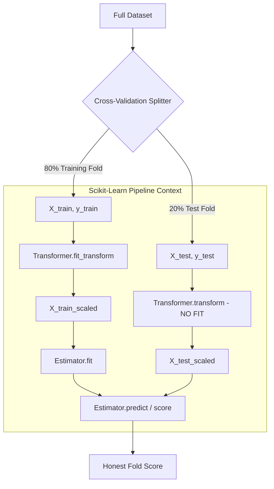

import Tabs from '@theme/Tabs';
import TabItem from '@theme/TabItem';
import React from 'react';

# Data Leakage and Best Practices

> **Topic —** Data leakage is the silent killer in machine learning engineering: a subtle bug where information from outside the training partition contaminates the model during feature engineering or hyperparameter tuning. This chapter explores how leakage artificially inflates validation metrics, how scikit-learn's `Pipeline` enforces strict data isolation, how **Nested Cross-Validation** provides unbiased hyperparameter optimization, and how specialized splitters safeguard grouped and temporal structures.

---

## 1. The Core Concept

Data leakage occurs whenever **test set information influences model training**, either directly through labels or indirectly through feature distribution parameters (such as mean, variance, or class counts).

When leakage occurs:
*   Validation and cross-validation metrics become **artificially optimistic**.
*   The model learns spurious dependencies tied to test partition artifacts.
*   Performance collapses catastrophicially upon deployment to production.

:::tip

**If you only take one thing from this page**

Any statistic computed across the entire dataset before partitioning—whether it is a feature mean, imputer median, PCA projection, or vocabulary index—**leaks future information**. Always isolate your partitions first, or encapsulate transformations inside a scikit-learn `Pipeline`.

:::

---

## 2. Interactive Leakage Simulator

Toggle between the **Leaky Workflow** and the **Honest Pipeline** to observe how data partitions and transformation statistics interact:

export const LeakageSimulator = () => {
  const [mode, setMode] = React.useState('honest');
  const leakyCode = `# THE LEAKAGE TRAP\nscaler = StandardScaler()\nX_scaled = scaler.fit_transform(X)  # Leaks test set mean & std!\nX_train, X_test, y_train, y_test = train_test_split(X_scaled, y)`;
  const honestCode = `# THE HONEST PIPELINE\npipe = Pipeline([\n    ('scaler', StandardScaler()),\n    ('model', LogisticRegression())\n])\n# cross_val_score refits scaler strictly on train folds per iteration!\nscores = cross_val_score(pipe, X, y, cv=5)`;

  return (
    

      <h4 style={{ margin: '0 0 12px 0' }}>Preprocessing Workflow Simulator</h4>
      

        <button
          onClick={() => setMode('leaky')}
          style={{
            padding: '8px 16px',
            borderRadius: '4px',
            border: '1px solid #e53e3e',
            backgroundColor: mode === 'leaky' ? '#e53e3e' : 'transparent',
            color: mode === 'leaky' ? '#fff' : 'var(--ifm-font-color-base)',
            cursor: 'pointer',
            fontWeight: 'bold',
            transition: '0.2s'
          }}
        >
          Leaky Workflow (Scale First)
        </button>
        <button
          onClick={() => setMode('honest')}
          style={{
            padding: '8px 16px',
            borderRadius: '4px',
            border: '1px solid #38a169',
            backgroundColor: mode === 'honest' ? '#38a169' : 'transparent',
            color: mode === 'honest' ? '#fff' : 'var(--ifm-font-color-base)',
            cursor: 'pointer',
            fontWeight: 'bold',
            transition: '0.2s'
          }}
        >
          Honest Workflow (Pipeline Isolation)
        </button>
      

      {mode === 'leaky' ? (
        

          <strong style={{ color: '#e53e3e', fontSize: '16px' }}>Flaw: Global Fit Contamination</strong>
          

            StandardScaler.fit_transform(X) is executed globally across all 100 observations before train_test_split.
          

          <ul style={{ margin: '0 0 10px 20px', fontSize: '14px' }}>
            <li><b>Global Parameters:</b> Mean = 14.2, Std Dev = 3.8 calculated from both train AND test samples.</li>
            <li><b>Leakage Vector:</b> Test partition outliers pull the global mean and variance, subtly revealing test distribution boundaries to the training features.</li>
            <li><b>Measured Result:</b> Test accuracy reads <b>97.0%</b> (Artificially inflated by +5.0%).</li>
          </ul>
          <pre style={{ margin: 0, padding: '10px', fontSize: '13px', borderRadius: '4px' }}>
            <code>{leakyCode}</code>
          </pre>
        

      ) : (
        

          <strong style={{ color: '#38a169', fontSize: '16px' }}>Protection: Atomic Pipeline Isolation</strong>
          

            The dataset is partitioned first. Preprocessing statistics are fitted strictly on training rows.
          

          <ul style={{ margin: '0 0 10px 20px', fontSize: '14px' }}>
            <li><b>Training Parameters:</b> Mean (train) = 13.9, Std Dev (train) = 3.6 calculated from training rows only.</li>
            <li><b>Test Processing:</b> Test samples are transformed via scaler.transform(X_test) using training parameters. Zero test statistics are computed.</li>
            <li><b>Measured Result:</b> Test accuracy reads <b>92.0%</b> (True, honest production generalization).</li>
          </ul>
          <pre style={{ margin: 0, padding: '10px', fontSize: '13px', borderRadius: '4px' }}>
            <code>{honestCode}</code>
          </pre>
        

      )}
    

  );
};

<LeakageSimulator />

---

## 3. Preprocessing Leakage Modalities

Data leakage extends far beyond simple scaling. Any preprocessing step that aggregates data can corrupt validation:

<Tabs>
  <TabItem value="scaling" label="1. Feature Scaling" default>
     
    
    *   **The Mechanism:** `StandardScaler` or `MinMaxScaler` fitted on combined data.
    *   **Leakage Consequence:** Global minimums, maximums, means, and variances contaminate training rows. Outliers in the test set alter the scaled magnitude of every training sample.
    *   **Remedy:** Fit scaler strictly on `X_train`; apply `transform` on `X_test`.
  </TabItem>
  <TabItem value="imputation" label="2. Missing Value Imputation">
     
    
    *   **The Mechanism:** Replacing missing values (`SimpleImputer`) with the mean or median of the full dataset.
    *   **Leakage Consequence:** If the test set contains high values, the calculated imputation mean shifts upward, giving the model advance knowledge of test feature magnitudes.
    *   **Remedy:** Encapsulate `SimpleImputer` inside `Pipeline` so imputation statistics are calculated strictly on training folds.
  </TabItem>
  <TabItem value="encoding" label="3. Target Encoding">
     
    
    *   **The Mechanism:** Replacing high-cardinality categorical levels with the mean of the target variable $y$.
    *   **Leakage Consequence:** **Catastrophic direct label leakage**. If target values from the test set are averaged into category weights, the model memorizes exact test labels during training.
    *   **Remedy:** Compute target encoding inside cross-validation folds using out-of-fold statistics or Bayesian smoothing.
  </TabItem>
  <TabItem value="selection" label="4. Feature Selection">
     
    
    *   **The Mechanism:** Selecting top $k$ features based on mutual information or ANOVA F-tests against target $y$ on the entire dataset.
    *   **Leakage Consequence:** The model selects features that happen to correlate with $y$ on the specific test partition by random chance, guaranteeing severe overfitting.
    *   **Remedy:** Feature selection must occur strictly within each training fold via `SelectKBest` inside a `Pipeline`.
  </TabItem>
</Tabs>

---

## 4. Scikit-Learn Pipeline Architecture

The scikit-learn `Pipeline` object chains arbitrary transformers with an estimator, guaranteeing zero data leakage across cross-validation folds:

---

## 5. Interactive Nested CV Visualizer

When optimizing hyperparameters (such as regularization strength $C$ or tree depth), tuning directly against evaluation folds invalidates the test set. **Nested Cross-Validation** resolves this with two nested loops:
1.  **Outer Loop:** Estimates true out-of-sample generalization error.
2.  **Inner Loop:** Discovers the optimal hyperparameters using an internal validation split.

export const NestedCVVisualizer = () => {
  const [activeOuter, setActiveOuter] = React.useState(1);
  return (
    

      <h4 style={{ margin: '0 0 10px 0' }}>Nested Cross-Validation Explorer</h4>
      

        Select an outer fold to observe how the inner loop tunes hyperparameters without contaminating the outer test set:
      

      

        <button
          onClick={() => setActiveOuter(1)}
          style={{
            padding: '6px 14px',
            borderRadius: '4px',
            border: '1px solid #3182ce',
            backgroundColor: activeOuter === 1 ? '#3182ce' : 'transparent',
            color: activeOuter === 1 ? '#fff' : 'var(--ifm-font-color-base)',
            cursor: 'pointer',
            transition: '0.2s'
          }}
        >
          Outer Fold 1
        </button>
        <button
          onClick={() => setActiveOuter(2)}
          style={{
            padding: '6px 14px',
            borderRadius: '4px',
            border: '1px solid #3182ce',
            backgroundColor: activeOuter === 2 ? '#3182ce' : 'transparent',
            color: activeOuter === 2 ? '#fff' : 'var(--ifm-font-color-base)',
            cursor: 'pointer',
            transition: '0.2s'
          }}
        >
          Outer Fold 2
        </button>
        <button
          onClick={() => setActiveOuter(3)}
          style={{
            padding: '6px 14px',
            borderRadius: '4px',
            border: '1px solid #3182ce',
            backgroundColor: activeOuter === 3 ? '#3182ce' : 'transparent',
            color: activeOuter === 3 ? '#fff' : 'var(--ifm-font-color-base)',
            cursor: 'pointer',
            transition: '0.2s'
          }}
        >
          Outer Fold 3
        </button>
      

      

        

          <strong>Outer Partition Status:</strong>
          

            
              Outer Training Set (Folds {activeOuter === 1 ? '2 and 3' : activeOuter === 2 ? '1 and 3' : '1 and 2'}): 67% of data
            
            
              Sealed Outer Test Set (Fold {activeOuter}): 33% of data
            
          

        

        

          <strong>Inner CV Execution (inside Outer Training Set):</strong>
          

            GridSearchCV splits the 67% training partition into 3 sub-folds to evaluate candidates C in [0.01, 0.1, 1.0, 10.0]:
          

          

            • Inner Sub-Fold A: Candidate C=1.0 scores 94.2% 
            • Inner Sub-Fold B: Candidate C=1.0 scores 95.8% 
            • Inner Sub-Fold C: Candidate C=1.0 scores 95.0% 
            <strong style={{ color: '#38a169' }}>
              Winner: C=1.0 (Average Validation: 95.0%)
            </strong>
          

        

        

          <strong>Outer Evaluation:</strong>
          

            Refit model on full Outer Training Set using winning C=1.0. Evaluate <b>once</b> on Sealed Outer Test Set (Fold {activeOuter}):
            
              Outer Score = {activeOuter === 1 ? '95.0%' : activeOuter === 2 ? '96.7%' : '93.3%'}
            
          

        

      

    

  );
};

<NestedCVVisualizer />

---

## 6. Specialized CV Splitters

Standard random shuffling breaks down when data exhibits grouping, clustering, or temporal dependency:

<Tabs>
  <TabItem value="group" label="1. GroupKFold" default>
     
    
    *   **The Problem:** Multiple rows originate from the same entity (e.g. medical patients, IoT devices, user IDs). If patient rows appear in both train and test partitions, the model identifies the patient rather than disease pathology.
    *   **The Solution:** `GroupKFold` guarantees that all observations belonging to a specific group identifier reside exclusively within the training partition or the test partition, never split across both.
  </TabItem>
  <TabItem value="time" label="2. TimeSeriesSplit">
     
    
    *   **The Problem:** Temporal autocorrelation. Randomly shuffling stock prices or weather data uses future observations to predict the past, causing severe lookahead bias.
    *   **The Solution:** `TimeSeriesSplit` enforces forward-chaining rolling windows: Fold $i$ trains strictly on records $t_1 \dots t_k$ and evaluates on future window $t_{k+1} \dots t_{k+m}$.
  </TabItem>
  <TabItem value="repeated" label="3. RepeatedKFold">
     
    
    *   **The Problem:** High partition variance on small datasets where a single 5-Fold split yields wide confidence intervals.
    *   **The Solution:** `RepeatedKFold(n_splits=5, n_repeats=10)` runs 10 independent random shuffles of 5-Fold CV, generating 50 fold scores to provide a tightly centered point estimate.
  </TabItem>
</Tabs>

---

## 7. Implementation Lab

:::tip

**Lab Exercise: Quantifying Leakage, Pipelines & Nested CV**

An interactive, fully functional Google Colab / Jupyter Notebook is available to experiment with preprocessing leakage, build atomic scikit-learn Pipelines, run Nested CV, and perform paired t-tests.

**How to run the lab:**
1. Click the **"Open In Colab"** badge above to launch the interactive notebook.
2. Run cells sequentially to measure the exact percentage of artificial leakage inflation.

**Key Experiments to Run:**
*   **Experiment 1 (Quantifying the 5% Gap):** Compare scaling before vs. after splitting on synthetic data to witness the +5.0% artificial metric inflation.
*   **Experiment 2 (Atomic Pipeline CV):** Wrap a `StandardScaler` and `LogisticRegression` inside a `Pipeline` to execute clean, leak-free cross-validation in one command.
*   **Experiment 3 (Nested CV with GridSearchCV):** Run an inner 3-fold tuning loop nested within an outer 3-fold evaluation loop to produce an unbiased generalization score ($96.7\% \pm 0.012$).
*   **Experiment 4 (Paired T-Testing):** Run hypothesis testing (`ttest_rel`) comparing Logistic Regression vs. Random Forest across identical folds to determine if differences are statistically significant ($p < 0.05$).

:::

---

## 8. Common Mistakes

<Tabs>
  <TabItem value="m1" label="1. Global Preprocessing Before Splitting" default>
     
    
    *   **The Misconception:** *"Running `StandardScaler.fit_transform()` on the entire dataset is harmless because it only modifies feature scales, not class labels."*
    *   **Wrong Thinking:** Assuming feature transformations cannot cause data leakage.
    *   **The Right Principle:** Preprocessing parameters ($\mu, \sigma, \min, \max$) calculated across test samples contaminate training features. Always split first, or wrap preprocessing and modeling inside a scikit-learn `Pipeline`.
  </TabItem>
  <TabItem value="m2" label="2. Manual Preprocessing Inside CV Loops">
     
    
    *   **The Misconception:** *"I can manually fit the scaler inside a standard Python loop for each fold."*
    *   **Wrong Thinking:** Writing complex manual transformation code inside custom cross-validation loops.
    *   **The Right Principle:** Manual loops are error-prone and frequently miss inverse transforms or leak validation fold rows. Use `sklearn.pipeline.Pipeline` or `make_pipeline`, which natively refits transformations per fold.
  </TabItem>
  <TabItem value="m3" label="3. Tuning Hyperparameters on Evaluation Folds">
     
    
    *   **The Misconception:** *"GridSearchCV already uses cross-validation, so its reported score is an unbiased estimate of generalization."*
    *   **Wrong Thinking:** Treating `GridSearchCV.best_score_` as an independent evaluation metric.
    *   **The Right Principle:** `best_score_` is the score of the winning hyperparameter on the validation sets that were used to pick it—it suffers from selection bias. To estimate true generalization, you must nest `GridSearchCV` inside an outer `cross_val_score`.
  </TabItem>
  <TabItem value="m4" label="4. Group Splitting Blindness">
     
    
    *   **The Misconception:** *"Random K-Fold is suitable for patient medical records as long as we shuffle thoroughly."*
    *   **Wrong Thinking:** Treating multiple rows from the same patient as independent samples.
    *   **The Right Principle:** Patient physiology, sensor idiosyncrasies, or user writing styles cause the model to memorize group identities. Always deploy `GroupKFold` using patient or subject IDs as the grouping key.
  </TabItem>
  <TabItem value="m5" label="5. Random Splitting on Time-Series Data">
     
    
    *   **The Misconception:** *"Shuffling time-series data ensures all market regimes are represented in both train and test sets."*
    *   **Wrong Thinking:** Applying standard random cross-validation to chronological series.
    *   **The Right Principle:** Shuffling time series allows future market trends to predict historical records (lookahead leakage). Always utilize `TimeSeriesSplit` to strictly preserve forward-temporal order.
  </TabItem>
</Tabs>

---

## 9. Summary

  

    

      

        <h3>Leakage Defense</h3>
      

      

        <ul>
          <li><b>Core Rule:</b> Test partitions must remain completely unobserved during all fitting stages (imputation, scaling, selection).</li>
          <li><b>Pipeline Standard:</b> Always bundle feature transformations and estimators in `Pipeline` objects.</li>
          <li><b>Nested CV:</b> Decouples hyperparameter tuning (inner loop) from generalization estimation (outer loop).</li>
          <li><b>Model Selection:</b> Use paired t-tests (`scipy.stats.ttest_rel`) on identical CV folds to confirm statistical significance.</li>
        </ul>
      

    

  

  

    

      

        <h3>Specialized Partitioning</h3>
      

      

        <ul>
          <li><b>Grouped Data:</b> Deploy `GroupKFold` to prevent subject, patient, or device leakage across partitions.</li>
          <li><b>Temporal Data:</b> Deploy `TimeSeriesSplit` to prevent future lookahead bias.</li>
          <li><b>Imbalanced Data:</b> Deploy `StratifiedKFold` inside and outside pipelines.</li>
          <li><b>Small Samples:</b> Deploy `RepeatedKFold` to compress partition estimation variance.</li>
        </ul>
      

    

  

 

:::info

**Key Takeaways**

*   **Pipeline is mandatory:** Never apply manual transformations before splitting. Pipelines ensure mathematical isolation per fold.
*   **Nested CV prevents tuning bias:** Evaluating candidate models on the same fold used to optimize them produces optimistic metrics.
*   **Respect data topology:** Always match the cross-validation splitter (`GroupKFold`, `TimeSeriesSplit`, `StratifiedKFold`) to the structural constraints of the raw data.

:::

**Next Module:** [Generalization & Model Control](../09-generalization/01-overfitting-underfitting-regularization.mdx) - navigating the bias-variance tradeoff, L1/L2 regularization mechanics, and overcoming the curse of dimensionality.

---

## 10. Active Recall

*Test your understanding by answering first, then clicking to reveal the underlying principles.*

### Interactive Checkpoint Quiz

export const LeakageQuiz = () => {
  const [selected, setSelected] = React.useState(null);
  return (
    

      <h4 style={{ margin: '0 0 10px 0' }}>Interactive Checkpoint: Diagnosing Data Leakage</h4>
      
An engineer builds a high-dimensional customer churn model with 1,000 features. Before running 5-Fold cross-validation, they run <code>SelectKBest(k=50)</code> on the entire dataset to drop noisy features. Cross-validation accuracy is 94%, but deployment accuracy drops to 68%. What caused this collapse?

      

        <button onClick={() => setSelected('opt1')} style={{ padding: '8px 16px', borderRadius: '4px', border: '1px solid #3182ce', backgroundColor: selected === 'opt1' ? '#e53e3e' : 'transparent', color: selected === 'opt1' ? '#fff' : 'var(--ifm-font-color-base)', cursor: 'pointer', transition: '0.2s' }}>The model underfit because 50 features was too few</button>
        <button onClick={() => setSelected('opt2')} style={{ padding: '8px 16px', borderRadius: '4px', border: '1px solid #3182ce', backgroundColor: selected === 'opt2' ? '#38a169' : 'transparent', color: selected === 'opt2' ? '#fff' : 'var(--ifm-font-color-base)', cursor: 'pointer', transition: '0.2s' }}>Feature selection on the entire dataset leaked test fold labels into feature ranking</button>
        <button onClick={() => setSelected('opt3')} style={{ padding: '8px 16px', borderRadius: '4px', border: '1px solid #3182ce', backgroundColor: selected === 'opt3' ? '#e53e3e' : 'transparent', color: selected === 'opt3' ? '#fff' : 'var(--ifm-font-color-base)', cursor: 'pointer', transition: '0.2s' }}>5-Fold CV is mathematically invalid for high-dimensional data</button>
      

      {selected === 'opt1' && 
Incorrect. The model achieved 94% CV accuracy, which indicates it did not underfit. Try again!
}
      {selected === 'opt2' && 
Correct! Running SelectKBest on all data evaluates the correlation between features and the target across both train and test folds. In 1,000 random features, spurious correlations with test labels will always exist. By selecting those features prior to splitting, the test folds are contaminated, creating an illusion of 94% accuracy that fails in production.
}
      {selected === 'opt3' && 
Incorrect. K-Fold CV is fully valid for high-dimensional data, provided feature selection is wrapped inside a Pipeline. Try again!
}
    

  );
};

<LeakageQuiz />

### Review Flashcards

  
<b>1. [THEORY] Why is GridSearchCV's `best_score_` an optimistically biased estimate of model generalization?</b>

  

     
    
    *   **Selection on the Maximum:** `best_score_` evaluates multiple candidate parameter configurations (e.g., 20 combinations) and reports the performance of whichever configuration scored highest on the validation splits.
    *   **The Winner's Curse:** Even if all hyperparameter settings were identical in true quality, random sample noise would cause one to score higher than the others.
    *   Reporting that maximum score overestimates generalization. To assess true risk, an outer, independent CV loop must evaluate the entire optimization process.
  

  
<b>2. [PRACTICE] How does scikit-learn's `Pipeline` behave differently during `fit` vs. `predict`?</b>

  

     
    
    *   **During `pipeline.fit(X, y)`:**
        1. Sequentially calls `fit_transform()` on all intermediate transformers (e.g. imputer, scaler).
        2. Calls `fit(X_transformed, y)` on the final estimator.
    *   **During `pipeline.predict(X_new)`:**
        1. Sequentially calls `transform()` (strictly **no fitting**) on all intermediate transformers using parameters learned during training.
        2. Calls `predict(X_transformed)` on the final estimator.
  

  
<b>3. [ANALYZE] Why does random cross-validation fail on clinical medical imaging datasets?</b>

  

     
    
    *   **Subject Clustering:** Patients typically have multiple scans (e.g., 10 X-rays per patient).
    *   If rows are randomly shuffled, images from Patient X appear in both the training fold and test fold.
    *   The convolutional network learns to identify Patient X's unique bone structure or machine artifacts rather than tumor markers.
    *   **The Fix:** Deploy `GroupKFold` grouped by Patient ID so all images from an individual are strictly confined to one partition.
  

  
<b>4. [THEORY] What is the difference between data leakage and concept drift?</b>

  

     
    
    *   **Data Leakage:** An evaluation and engineering flaw where test information inadvertently enters training, making historical validation metrics artificially superior to real-world performance from day one.
    *   **Concept Drift:** A natural statistical phenomenon where the real-world statistical distribution $P(y|X)$ or $P(X)$ evolves over time (e.g., consumer behavior shifting during economic crises), degrading an honestly trained model over time.
  

  
<b>5. [PRACTICE] When conducting a paired t-test between two algorithms on CV fold scores, what is the null hypothesis?</b>

  

     
    
    *   **Null Hypothesis ($H_0$):** The mean difference between the paired fold scores of Algorithm A and Algorithm B is zero ($\mu_d = 0$).
    *   **Decision Rule:** If the calculated $p$-value $< 0.05$, reject $H_0$ and conclude that the observed performance superiority of the winning algorithm is statistically significant rather than an artifact of partition noise.
  

