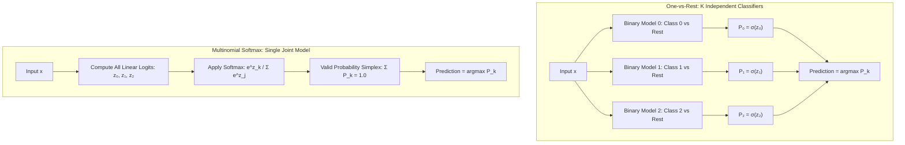

import Tabs from '@theme/Tabs';
import TabItem from '@theme/TabItem';
import React from 'react';

# Multiclass and Practical Use

> **Topic —** Real-world classification frequently spans more than two categories: diagnosing dermatology conditions, routing customer support tickets, or classifying digits. This chapter explores how binary logistic regression scales to multiclass tasks ($K > 2$) through **One-vs-Rest (OvR)** heuristics and unified **Multinomial Softmax** architectures. We analyze decision boundaries, probability simplex constraints, and the multiplicative odds-ratio interpretation of model coefficients.

---

## 1. The Core Concept

Binary logistic regression predicts a single probability $P(y = 1 \mid x) = \sigma(w^T x + b)$. When extending to $K$ mutually exclusive categories ($y \in \{0, 1, \dots, K-1\}$), we must estimate a probability distribution vector:

$$\mathbf{p} = [p_0, p_1, \dots, p_{K-1}]^T$$

To represent a mathematically valid probability distribution across discrete classes, the output vector must satisfy the **probability simplex constraints**:

$$\sum_{k=0}^{K-1} p_k = 1.0 \qquad \text{and} \qquad p_k \ge 0 \quad \forall k$$

There are two primary paradigms for achieving multiclass classification in linear models:
1.  **One-vs-Rest (OvR):** Decomposes the multiclass task into $K$ separate binary classification sub-problems.
2.  **Multinomial Softmax:** Directly models the joint categorical distribution through a normalized exponential squashing function.

:::tip

**If you only take one thing from this page**

**One-vs-Rest (OvR)** fits $K$ separate binary classifiers; because models train independently, their predicted probabilities **do not sum to 1.0**. **Multinomial Softmax** fits a single model with a joint denominator $\sum e^{z_j}$, strictly guaranteeing that class probabilities sum to exactly $1.000$.

:::

---

## 2. Interactive Softmax vs. OvR Normalizer

Vary the raw linear logit scores $(z_0, z_1, z_2)$ below to compare independent OvR Sigmoids against the unified Softmax distribution:

export const SoftmaxVsOvRSimulator = () => {
  const [z0, setZ0] = React.useState(1.5);
  const [z1, setZ1] = React.useState(0.5);
  const [z2, setZ2] = React.useState(-1.0);

  // OvR Independent Sigmoids
  const sig0 = 1.0 / (1.0 + Math.exp(-z0));
  const sig1 = 1.0 / (1.0 + Math.exp(-z1));
  const sig2 = 1.0 / (1.0 + Math.exp(-z2));
  const ovrSum = sig0 + sig1 + sig2;

  // Softmax Probabilities
  const exp0 = Math.exp(z0);
  const exp1 = Math.exp(z1);
  const exp2 = Math.exp(z2);
  const expSum = exp0 + exp1 + exp2;

  const soft0 = exp0 / expSum;
  const soft1 = exp1 / expSum;
  const soft2 = exp2 / expSum;
  const softSum = soft0 + soft1 + soft2;

  const winner = z0 >= z1 && z0 >= z2 ? 0 : z1 >= z2 ? 1 : 2;

  return (
    

      <h4 style={{ margin: '0 0 12px 0' }}>Softmax vs. One-vs-Rest Normalizer</h4>
      

        Adjust the raw linear logit scores to inspect probability normalization across a 3-class problem:
      

      

        

          <label style={{ fontSize: '13px', fontWeight: 'bold' }}>
            Class 0 Logit (z₀): {z0.toFixed(2)}
          </label>
          <input
            type="range"
            min="-4"
            max="4"
            step="0.1"
            value={z0}
            onChange={(e) => setZ0(parseFloat(e.target.value))}
            style={{ width: '100%', marginTop: '6px' }}
          />
        

        

          <label style={{ fontSize: '13px', fontWeight: 'bold' }}>
            Class 1 Logit (z₁): {z1.toFixed(2)}
          </label>
          <input
            type="range"
            min="-4"
            max="4"
            step="0.1"
            value={z1}
            onChange={(e) => setZ1(parseFloat(e.target.value))}
            style={{ width: '100%', marginTop: '6px' }}
          />
        

        

          <label style={{ fontSize: '13px', fontWeight: 'bold' }}>
            Class 2 Logit (z₂): {z2.toFixed(2)}
          </label>
          <input
            type="range"
            min="-4"
            max="4"
            step="0.1"
            value={z2}
            onChange={(e) => setZ2(parseFloat(e.target.value))}
            style={{ width: '100%', marginTop: '6px' }}
          />
        

      

      

        

          <strong style={{ fontSize: '15px', color: '#e53e3e' }}>One-vs-Rest (3 Independent Sigmoids)</strong>
          

            • P₀ = σ(z₀) = <b>{(sig0 * 100).toFixed(1)}%</b> 
            • P₁ = σ(z₁) = <b>{(sig1 * 100).toFixed(1)}%</b> 
            • P₂ = σ(z₂) = <b>{(sig2 * 100).toFixed(1)}%</b>
          

          

            Sum of Probabilities: <b style={{ color: Math.abs(ovrSum - 1.0) > 0.05 ? '#e53e3e' : '#38a169' }}>{(ovrSum * 100).toFixed(1)}%</b>
            

              {Math.abs(ovrSum - 1.0) > 0.05 ? 'Violates probability axioms (Sum ≠ 100%)' : 'Coincidentally near 100%'}
            

          

        

        

          <strong style={{ fontSize: '15px', color: '#38a169' }}>Multinomial Softmax (Joint Simplex)</strong>
          

            • P₀ = e^z₀ / Σe^z = <b>{(soft0 * 100).toFixed(1)}%</b> 
            • P₁ = e^z₁ / Σe^z = <b>{(soft1 * 100).toFixed(1)}%</b> 
            • P₂ = e^z₂ / Σe^z = <b>{(soft2 * 100).toFixed(1)}%</b>
          

          

            Sum of Probabilities: <b style={{ color: '#38a169' }}>{(softSum * 100).toFixed(1)}%</b>
            

              ✓ Strict mathematical guarantee: Sum is identically 100%
            

          

        

      

      

        Current Argmax Prediction: <b>Class {winner}</b> (Highest linear logit score)
      

    

  );
};

<SoftmaxVsOvRSimulator />

---

## 3. Multiclass Architecture Paradigms

<Tabs>
  <TabItem value="ovr" label="1. One-vs-Rest (OvR)" default>
     
    
    *   **The Concept:** Fit $K$ separate binary logistic regressions. For class $k$, samples from class $k$ receive label $1$, while all other $K-1$ classes receive label $0$.
    *   **Total Models Trained:** Exactly $K$.
    *   **Decision Rule:** $\hat{y} = \arg\max_{k} \sigma(w_k^T x + b_k)$.
    *   **Tradeoffs:**
        *   *Pros:* Trivially parallelizable; can turn any binary classifier into a multiclass system.
        *   *Cons:* Severe class imbalance introduced during binary training (1 vs $K-1$). Probabilities do not sum to 1.
  </TabItem>
  <TabItem value="ovo" label="2. One-vs-One (OvO)">
     
    
    *   **The Concept:** Fit a dedicated binary classifier for every unique pair of classes $(j, k)$.
    *   **Total Models Trained:** $\frac{K(K-1)}{2}$ classifiers.
    *   **Decision Rule:** Majority voting among all pairwise winners.
    *   **Tradeoffs:**
        *   *Pros:* Each sub-problem trains on smaller, balanced subsets.
        *   *Cons:* Combinatorial explosion: for 10 classes, requires 45 models; for 100 classes, requires 4,950 models! Rarely used for logistic regression (primarily used for SVMs).
  </TabItem>
  <TabItem value="softmax" label="3. Multinomial Softmax">
     
    
    *   **The Concept:** A single unified probabilistic model that optimizes parameter vectors $W = [w_0, w_1, \dots, w_{K-1}]$ jointly.
    *   **Mathematical Formula:**
        $$P(y = k \mid x) = \frac{e^{w_k^T x + b_k}}{\sum_{j=0}^{K-1} e^{w_j^T x + b_j}}$$
    *   **Loss Function:** Categorical Cross-Entropy (Multiclass Negative Log-Likelihood):
        $$J(W) = -\frac{1}{n} \sum_{i=1}^{n} \sum_{k=0}^{K-1} y_{ik} \ln(\hat{y}_{ik})$$
    *   **Tradeoffs:** Mathematically principled, well-calibrated probabilities, captures inter-class competition directly.
  </TabItem>
</Tabs>

---

## 4. Odds Ratio and Coefficient Interpretation

In binary logistic regression, the linear equation models the **log-odds (logit)** directly:

$$\ln\left(\frac{p}{1-p}\right) = w_1 x_1 + w_2 x_2 + \dots + b$$

Exponentiating both sides yields the **Odds Ratio**:

$$\text{Odds} = \frac{p}{1-p} = e^{w_1 x_1 + w_2 x_2 + \dots + b} = e^b \cdot (e^{w_1})^{x_1} \cdot (e^{w_2})^{x_2} \dots$$

### The Multiplicative Odds Principle

When feature $x_j$ increases by $\Delta x$ units, the odds of the positive outcome are multiplied by:

$$\text{Odds Multiplier} = e^{w_j \cdot \Delta x}$$

*   **If $w_j > 0$:** $e^{w_j} > 1.0$. Increasing $x_j$ increases the odds of the event.
*   **If $w_j = 0$:** $e^{w_j} = 1.0$. The feature has zero effect on the outcome.
*   **If $w_j < 0$:** $e^{w_j} < 1.0$. Increasing $x_j$ decreases the odds of the event.

export const OddsRatioExplorer = () => {
  const [weight, setWeight] = React.useState(0.5);
  const [deltaX, setDeltaX] = React.useState(1);

  const deltaLogOdds = weight * deltaX;
  const oddsRatio = Math.exp(deltaLogOdds);

  return (
    

      <h4 style={{ margin: '0 0 12px 0' }}>Interactive Odds Ratio Explorer</h4>
      

        Adjust feature weight $w$ and increment $\Delta x$ to inspect the multiplicative impact on odds:
      

      

        

          <label style={{ fontSize: '13px', fontWeight: 'bold' }}>
            Feature Weight (w): {weight.toFixed(2)}
          </label>
          <input
            type="range"
            min="-1.5"
            max="1.5"
            step="0.05"
            value={weight}
            onChange={(e) => setWeight(parseFloat(e.target.value))}
            style={{ width: '100%', marginTop: '6px' }}
          />
        

        

          <label style={{ fontSize: '13px', fontWeight: 'bold' }}>
            Feature Change (Δx units): {deltaX}
          </label>
          <input
            type="range"
            min="1"
            max="5"
            step="1"
            value={deltaX}
            onChange={(e) => setDeltaX(parseInt(e.target.value))}
            style={{ width: '100%', marginTop: '6px' }}
          />
        

      

      

        

          
Change in Log-Odds (Δz)

          

            {deltaLogOdds >= 0 ? '+' : ''}{deltaLogOdds.toFixed(3)}
          

          
Additive shift in linear space

        

        

          
Multiplicative Odds Factor (e^[w·Δx])

          
= 1.0 ? '#38a169' : '#e53e3e', marginTop: '4px' }}>
            {oddsRatio.toFixed(3)}x
          

          
Multiplicative factor on odds

        

      

      

        <b>Business Interpretation:</b> For every {deltaX} unit increase in this feature, the odds of the event are multiplied by <b>{oddsRatio.toFixed(2)}x</b> ({oddsRatio > 1.0 ? `an increase of ${((oddsRatio - 1) * 100).toFixed(1)}%` : `a decrease of ${((1 - oddsRatio) * 100).toFixed(1)}%`}).
      

    

  );
};

<OddsRatioExplorer />

---

## 5. Implementation Lab

:::tip

**Lab Exercise: Multiclass Benchmarks & Odds Ratios**

An interactive, fully functional Google Colab / Jupyter Notebook is available to benchmark OvR vs. Multinomial Softmax on Iris, evaluate probability normalization, and extract coefficient odds ratios live in your browser.

**How to run the lab:**
1. Click the **"Open In Colab"** badge above to launch the interactive notebook.
2. Run cells sequentially to benchmark OvR vs. Softmax and visualize decision boundaries.

**Key Experiments to Run:**
*   **Experiment 1 (Probability Sum Check):** Inspect synthetic toy samples to witness OvR sums fluctuating between $0.90$ and $1.00$, while Softmax sums identically equal $1.000$.
*   **Experiment 2 (Iris Multiclass Benchmark):** Compare train accuracy and confusion matrices between `multi_class='ovr'` ($92.0\%$) and `multi_class='multinomial'` ($94.7\%$).
*   **Experiment 3 (Odds Ratio Extraction):** Compute $e^w$ across Iris features to quantify how Sepal Width increases Setosa odds by $6.65\times$ per centimeter.

:::

---

## 6. Common Mistakes

<Tabs>
  <TabItem value="m1" label="1. Expecting OvR Probabilities to Sum to 1" default>
     
    
    *   **The Misconception:** *"The probabilities output by `predict_proba` in One-vs-Rest represent a genuine joint probability distribution."*
    *   **Wrong Thinking:** Expecting independently trained binary models to satisfy probability simplex constraints.
    *   **The Right Principle:** OvR models are trained completely independently. Summing their output probabilities can yield $0.7$ or $1.4$. Scikit-learn artificially normalizes them post-hoc by dividing by their sum, but they remain heuristic. Use `multi_class='multinomial'` for genuine joint probabilities.
  </TabItem>
  <TabItem value="m2" label="2. Linear Probability Interpretation of Weights">
     
    
    *   **The Misconception:** *"A feature weight of $w=0.4$ means the probability of the class increases by 40%."*
    *   **Wrong Thinking:** Treating logistic regression weights as linear probability slopes.
    *   **The Right Principle:** Logistic regression is linear in **log-odds**, not probability. A weight of $0.4$ means **odds** multiply by $e^{0.4} \approx 1.49$ (a 49% increase in odds). The change in actual probability depends on the baseline probability.
  </TabItem>
  <TabItem value="m3" label="3. Multiclass Decision Boundary Misunderstanding">
     
    
    *   **The Misconception:** *"The decision boundary in multiclass occurs where $P(\text{class}) = 0.5$."*
    *   **Wrong Thinking:** Applying binary 0.5 threshold rules to multiclass settings.
    *   **The Right Principle:** In multiclass classification, the decision boundary occurs where the top two predicted probabilities are equal: $P_j(x) = P_k(x)$ (i.e. where $\arg\max$ flips). A class can easily win with $P=0.36$ in a 4-class problem.
  </TabItem>
  <TabItem value="m4" label="4. Solver and Multiclass Incompatibility">
     
    
    *   **The Misconception:** *"Setting `multi_class='multinomial'` works with any scikit-learn solver."*
    *   **Wrong Thinking:** Pairing `solver='liblinear'` with multinomial loss.
    *   **The Right Principle:** The legacy `liblinear` solver only supports One-vs-Rest (OvR). To use true Multinomial Softmax, you must specify a modern solver such as `lbfgs`, `saga`, or `newton-cg`.
  </TabItem>
  <TabItem value="m5" label="5. Blindly Using OvO on Large Class Counts">
     
    
    *   **The Misconception:** *"One-vs-One (OvO) is more accurate, so I will use it for my 50-class product categorization task."*
    *   **Wrong Thinking:** Using pairwise decomposition on large class counts.
    *   **The Right Principle:** OvO scales quadratically $\frac{K(K-1)}{2}$. For 50 classes, OvO fits $\frac{50 \times 49}{2} = 1,225$ individual models. Use Multinomial Softmax or OvR instead.
  </TabItem>
</Tabs>

---

## 7. Summary

  

    

      

        <h3>Multiclass Architectures</h3>
      

      

        <ul>
          <li><b>One-vs-Rest (OvR):</b> Fits $K$ binary models. Fast, parallelizable, but probabilities are unnormalized and ignore inter-class competition.</li>
          <li><b>Multinomial Softmax:</b> Fits 1 joint model via $P_k = \frac{e^{z_k}}{\sum e^{z_j}}$. Probabilities strictly sum to $1.000$.</li>
          <li><b>Decision Rule:</b> $\hat{y} = \arg\max_k P_k(x)$. Boundary is where top two class logits intersect ($z_j = z_k$).</li>
        </ul>
      

    

  

  

    

      

        <h3>Practical Engineering</h3>
      

      

        <ul>
          <li><b>Odds Multiplier:</b> $e^{w_j \cdot \Delta x}$ represents the multiplicative shift in odds per $\Delta x$ unit change.</li>
          <li><b>Scikit-Learn Solvers:</b> Use `solver='lbfgs'` for standard multinomial; use `solver='saga'` for large datasets with L1 elastic net.</li>
          <li><b>Loss Function:</b> Categorical Cross-Entropy $J = -\frac{1}{n} \sum \sum y_{ik} \ln(\hat{y}_{ik})$.</li>
        </ul>
      

    

  

 

:::info

**Key Takeaways**

*   **Prefer Softmax over OvR:** Multinomial Softmax models genuine joint probabilities and typically achieves superior generalization.
*   **Understand Odds vs Probability:** Log-odds are linear in features ($w^T x + b$); probability is non-linear ($\sigma$ or Softmax). Always interpret weights multiplicatively via $e^w$.
*   **Boundary geometry:** Linear logistic models produce piecewise linear decision boundaries between classes in feature space.

:::

**Next Module:** [Classification Metrics](../08-classification-metrics/01-confusion-matrix-and-basic-metrics.mdx) - evaluating classifiers via confusion matrices, precision, recall, F1-scores, and ROC-AUC curves.

---

## 8. Active Recall

*Test your understanding by answering first, then clicking to reveal the underlying principles.*

### Interactive Checkpoint Quiz

export const MulticlassQuiz = () => {
  const [selected, setSelected] = React.useState(null);
  return (
    

      <h4 style={{ margin: '0 0 10px 0' }}>Interactive Checkpoint: Softmax vs. OvR Probabilities</h4>
      
Why are raw predicted probabilities from a One-vs-Rest (OvR) model mathematically incapable of forming a true probability distribution without ad-hoc post-processing?

      

        <button onClick={() => setSelected('opt1')} style={{ padding: '8px 16px', borderRadius: '4px', border: '1px solid #3182ce', backgroundColor: selected === 'opt1' ? '#e53e3e' : 'transparent', color: selected === 'opt1' ? '#fff' : 'var(--ifm-font-color-base)', cursor: 'pointer', transition: '0.2s' }}>Because OvR uses polynomial features</button>
        <button onClick={() => setSelected('opt2')} style={{ padding: '8px 16px', borderRadius: '4px', border: '1px solid #3182ce', backgroundColor: selected === 'opt2' ? '#38a169' : 'transparent', color: selected === 'opt2' ? '#fff' : 'var(--ifm-font-color-base)', cursor: 'pointer', transition: '0.2s' }}>Because the K binary classifiers are fit independently with no shared normalization denominator</button>
        <button onClick={() => setSelected('opt3')} style={{ padding: '8px 16px', borderRadius: '4px', border: '1px solid #3182ce', backgroundColor: selected === 'opt3' ? '#e53e3e' : 'transparent', color: selected === 'opt3' ? '#fff' : 'var(--ifm-font-color-base)', cursor: 'pointer', transition: '0.2s' }}>Because OvR requires categorical targets to be integers</button>
      

      {selected === 'opt1' && 
Incorrect. OvR does not use polynomial features unless explicitly added in a Pipeline. Try again!
}
      {selected === 'opt2' && 
Correct! Each of the K binary classifiers in OvR optimizes its own independent log-loss function. Because Classifier 0 knows nothing about Classifier 1, their individual sigmoid outputs σ(z_k) do not share a common denominator and will almost never sum to 1.0. Softmax enforces this constraint directly via its joint denominator Σ e^z_j.
}
      {selected === 'opt3' && 
Incorrect. Label encoding format has no impact on mathematical normalization. Try again!
}
    

  );
};

<MulticlassQuiz />

### Review Flashcards

  
<b>1. [THEORY] How does Softmax mathematically reduce to the standard binary sigmoid when K = 2?</b>

  

     
    
    *   For $K=2$ with logits $z_1$ and $z_2$:
        $$P(y = 1) = \frac{e^{z_1}}{e^{z_1} + e^{z_2}}$$
    *   Divide numerator and denominator by $e^{z_1}$:
        $$P(y = 1) = \frac{1}{1 + e^{z_2 - z_1}} = \frac{1}{1 + e^{-(z_1 - z_2)}}$$
    *   Letting $z = z_1 - z_2$ produces the standard binary sigmoid formula $\sigma(z) = \frac{1}{1 + e^{-z}}$.
    *   The binary sigmoid is simply a 2-class Softmax with parameter redundancy eliminated!
  

  
<b>2. [MATH] A logistic model for disease diagnosis has a weight of w = 0.693 for a binary symptom feature (fever = 1). What is the exact odds ratio?</b>

  

     
    
    *   **Formula:** $\text{Odds Ratio} = e^w$.
    *   $\text{OR} = e^{0.693} = \exp(\ln(2)) = 2.0$.
    *   **Interpretation:** Patients with a fever have exactly **twice the odds** ($2\times$) of having the disease compared to patients without a fever.
  

  
<b>3. [ANALYZE] In a 4-class problem, a Softmax model outputs probabilities [0.35, 0.25, 0.20, 0.20]. What is the predicted class, and why is threshold 0.5 irrelevant here?</b>

  

     
    
    *   **Predicted Class:** Class 0 (via $\arg\max$, since $0.35$ is the largest probability).
    *   **Threshold Irrelevance:** In multiclass classification with mutually exclusive labels, predictions are decided by relative ranking ($\arg\max$). Expecting any class to exceed $0.50$ is unnecessary; when probability is divided across 4 classes, a plurality ($35\%$) is sufficient to determine the winning decision.
  

  
<b>4. [PRACTICE] Why does training an OvR classifier on 100 classes with balanced data create severe class imbalance during training?</b>

  

     
    
    *   **The 1 vs. 99 Ratio:** Suppose each of the 100 classes has 10 samples (1,000 samples total).
    *   When training the binary classifier for Class 0 vs Rest, Class 0 has 10 positive samples ($1\%$), while the "Rest" contains 990 negative samples ($99\%$).
    *   Every single one of the 100 binary models is trained on a heavily imbalanced 1:99 dataset, causing naive binary models to predict "Rest" almost everywhere.
  

  
<b>5. [THEORY] What is the geometric shape of the decision boundaries between classes in a Multinomial Softmax classifier?</b>

  

     
    
    *   **Piecewise Linear Boundaries:** The boundary between class $j$ and class $k$ occurs where $P_j(x) = P_k(x)$, which simplifies to $z_j = z_k$:
        $$w_j^T x + b_j = w_k^T x + b_k \implies (w_j - w_k)^T x + (b_j - b_k) = 0$$
    *   This is the equation of a straight line (in 2D) or a flat hyperplane (in higher dimensions).
    *   The complete decision space is partitioned into convex polygonal regions known as a **Voronoi-like linear tessellation**.
  

