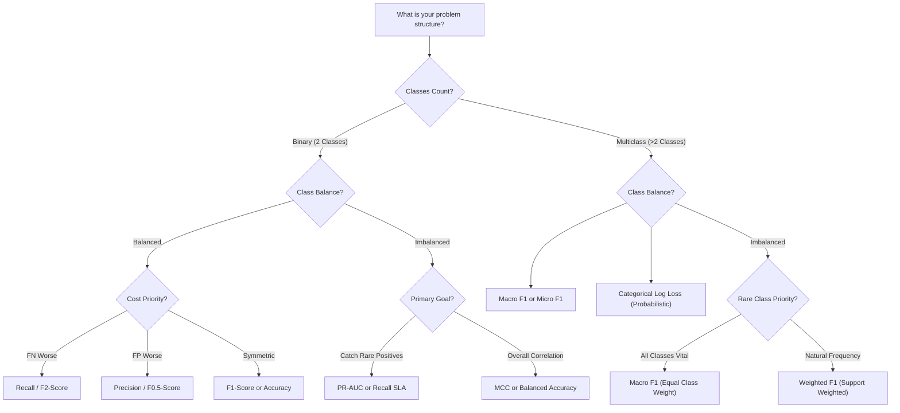

import Tabs from '@theme/Tabs';
import TabItem from '@theme/TabItem';
import React from 'react';

# Multiclass and Choosing Metrics

> **Topic —** Real-world classification problems frequently involve more than two categories: diagnosing dozens of medical conditions, recognizing hand-written digits, or categorizing customer inquiries. This guide covers how to extend binary metrics to multiclass settings using **One-vs-Rest (OvR)** decomposition, compares **Macro**, **Micro**, and **Weighted** averaging, and provides an **Interactive Metric Selection Wizard** to determine the optimal evaluation metric for any machine learning problem.

---

## 1. The Core Concept

In a multiclass problem with $K > 2$ categories, the confusion matrix expands into an $K \times K$ grid where:
*   **Rows** represent the **Actual Ground Truth Class** ($y$).
*   **Columns** represent the **Predicted Class** ($\hat{y}$).
*   The main diagonal entries represent **correct classifications**.
*   All off-diagonal entries represent **misclassification confusions**.

### One-vs-Rest (OvR) Metric Extraction

To compute Precision, Recall, or $F_1$ for any individual class $k$, we treat category $k$ as the **Positive Class ($1$)** and the union of all other $K-1$ categories as the **Negative Class ($0$)**:

*   **$\text{TP}_k$:** The diagonal cell for class $k$ ($\text{Matrix}[k, k]$).
*   **$\text{FP}_k$:** Column sum for class $k$ minus $\text{TP}_k$ (other classes falsely predicted as $k$).
*   **$\text{FN}_k$:** Row sum for class $k$ minus $\text{TP}_k$ (actual instances of $k$ misclassified elsewhere).

:::tip

**If you only take one thing from this page**

*   **Macro-averaging** treats every class equally, making it essential when performance on rare minority classes matters.
*   **Weighted-averaging** weights each class by its support, reflecting population distribution.
*   **Micro-averaging** pools samples globally and is mathematically identical to standard **Overall Accuracy**.

:::

---

## 2. Interactive Averaging Calculator: Macro vs. Weighted

Observe how performance on a rare category ($1\%$ prevalence) influences Macro vs. Weighted metrics:

export const MulticlassAveragingCalculator = () => {
  const [f1A, setF1A] = React.useState(0.95);
  const [f1B, setF1B] = React.useState(0.85);
  const [f1C, setF1C] = React.useState(0.10);

  const nA = 1000;
  const nB = 100;
  const nC = 10;
  const total = nA + nB + nC;

  const macroF1 = (f1A + f1B + f1C) / 3;
  const weightedF1 = (nA * f1A + nB * f1B + nC * f1C) / total;
  const gap = (weightedF1 - macroF1) * 100;

  const applyPreset = (a, b, c) => {
    setF1A(a);
    setF1B(b);
    setF1C(c);
  };

  return (
    

      <h4 style={{ margin: '0 0 12px 0' }}>🧮 Interactive Multiclass Averaging Calculator</h4>
      

        Dataset Support: Class A (1,000 samples, 90.1%), Class B (100 samples, 9.0%), Class C (10 samples, 0.9%).
      

      

        <button
          onClick={() => applyPreset(0.96, 0.88, 0.00)}
          style={{ padding: '6px 12px', borderRadius: '4px', border: '1px solid #e53e3e', backgroundColor: f1C === 0 ? '#e53e3e' : 'transparent', color: f1C === 0 ? '#fff' : 'var(--ifm-font-color-base)', cursor: 'pointer', fontSize: '12px', fontWeight: 'bold', transition: '0.2s' }}
        >
          🚨 Rare Class C Collapse (F1 = 0%)
        </button>
        <button
          onClick={() => applyPreset(0.90, 0.90, 0.90)}
          style={{ padding: '6px 12px', borderRadius: '4px', border: '1px solid #38a169', backgroundColor: f1A === 0.9 && f1C === 0.9 ? '#38a169' : 'transparent', color: f1A === 0.9 && f1C === 0.9 ? '#fff' : 'var(--ifm-font-color-base)', cursor: 'pointer', fontSize: '12px', transition: '0.2s' }}
        >
          Balanced Performance (F1 = 90%)
        </button>
        <button
          onClick={() => applyPreset(0.50, 0.95, 0.95)}
          style={{ padding: '6px 12px', borderRadius: '4px', border: '1px solid #3182ce', backgroundColor: f1A === 0.5 ? '#3182ce' : 'transparent', color: f1A === 0.5 ? '#fff' : 'var(--ifm-font-color-base)', cursor: 'pointer', fontSize: '12px', transition: '0.2s' }}
        >
          Majority Class Struggles (F1_A = 50%)
        </button>
      

      

        

          

            Class A (Majority - 1,000):
            {(f1A * 100).toFixed(0)}%
          

          <input
            type="range"
            min="0.0"
            max="1.0"
            step="0.05"
            value={f1A}
            onChange={(e) => setF1A(parseFloat(e.target.value))}
            style={{ width: '100%', marginTop: '6px' }}
          />
        

        

          

            Class B (Medium - 100):
            {(f1B * 100).toFixed(0)}%
          

          <input
            type="range"
            min="0.0"
            max="1.0"
            step="0.05"
            value={f1B}
            onChange={(e) => setF1B(parseFloat(e.target.value))}
            style={{ width: '100%', marginTop: '6px' }}
          />
        

        

          

            Class C (Rare - 10):
            {(f1C * 100).toFixed(0)}%
          

          <input
            type="range"
            min="0.0"
            max="1.0"
            step="0.05"
            value={f1C}
            onChange={(e) => setF1C(parseFloat(e.target.value))}
            style={{ width: '100%', marginTop: '6px' }}
          />
        

      

      

        

          
Macro F1 (Unweighted Average)

          

            {(macroF1 * 100).toFixed(1)}%
          

          
(F₁_A + F₁_B + F₁_C) / 3

        

        

          
Weighted F1 (Support-Weighted)

          

            {(weightedF1 * 100).toFixed(1)}%
          

          
Σ (n_k / N) · F₁_k

        

      

      

        {f1C < 0.2 ? (
          

            <strong style={{ color: '#c53030' }}>🚨 Masking Alert: Minority Class Failure Hidden</strong>
            

              Class C is failing miserably (F1 = {(f1C * 100).toFixed(0)}%). Yet, <b>Weighted F1 reports a stellar {(weightedF1 * 100).toFixed(1)}%</b> because Class A dominates 90% of samples! <b>Macro F1 plummets to {(macroF1 * 100).toFixed(1)}%</b>, exposing that the system cannot detect the rare category.
            

          

        ) : (
          

            <strong style={{ color: '#276749' }}>✓ Healthy Multiclass Performance</strong>
            

              All classes achieve acceptable discrimination. Macro F1 ({(macroF1 * 100).toFixed(1)}%) and Weighted F1 ({(weightedF1 * 100).toFixed(1)}%) remain in close agreement.
            

          

        )}
      

    

  );
};

<MulticlassAveragingCalculator />

---

## 3. Comparing Averaging Schemes

<Tabs>
  <TabItem value="macro" label="1. Macro-Averaging" default>
     
    
    *   **The Math:** Unweighted arithmetic mean across all $K$ classes:
        $$\text{Macro } F_1 = \frac{1}{K} \sum_{k=0}^{K-1} F_{1, k}$$
    *   **Equal Weighting:** A class with 10 samples has the exact same voting power as a class with 100,000 samples.
    *   **Best For:** When performance on every class is vital (e.g. rare disease diagnosis, multi-language translation).
  </TabItem>
  <TabItem value="weighted" label="2. Weighted-Averaging">
     
    
    *   **The Math:** Weighted by the support (true instance count $n_k$) of each class:
        $$\text{Weighted } F_1 = \sum_{k=0}^{K-1} \left( \frac{n_k}{N} \right) F_{1, k}$$
    *   **Support Weighting:** Reflects real-world class prevalence.
    *   **Best For:** When class frequency represents natural production volume and minority failure carries no outsized penalty.
  </TabItem>
  <TabItem value="micro" label="3. Micro-Averaging">
     
    
    *   **The Math:** Aggregates global $\sum \text{TP}_k, \sum \text{FP}_k, \sum \text{FN}_k$ before computing the metric:
        $$\text{Micro Precision} = \frac{\sum \text{TP}_k}{\sum \text{TP}_k + \sum \text{FP}_k}$$
    *   **Mathematical Equivalence:** Because every multiclass error is simultaneously a False Positive for one class and a False Negative for another ($\sum \text{FP}_k = \sum \text{FN}_k$), **Micro Precision = Micro Recall = Micro F1 = Overall Accuracy**.
    *   **Best For:** Rarely useful; standard Accuracy is simpler and identical.
  </TabItem>
</Tabs>

---

## 4. Interactive Metric Selection Wizard

Select your project parameters to receive the exact recommended metric, scikit-learn API snippet, and production rationale:

export const MetricDecisionWizard = () => {
  const [problemType, setProblemType] = React.useState('binary');
  const [balance, setBalance] = React.useState('imbalanced');
  const [cost, setCost] = React.useState('fn');

  let recommendation = {
    title: 'Precision-Recall AUC (PR-AUC)',
    metric: 'average_precision_score(y_true, y_scores)',
    rationale: 'On binary imbalanced data where false negatives are critical (e.g. fraud or disease), PR-AUC evaluates true positive coverage while directly penalizing false alarms without being inflated by massive true negatives.'
  };

  if (problemType === 'binary') {
    if (balance === 'balanced') {
      if (cost === 'fn') {
        recommendation = {
          title: 'F2-Score (or High-Recall Threshold)',
          metric: 'fbeta_score(y_true, y_pred, beta=2.0)',
          rationale: 'Weights Recall twice as heavily as Precision, penalizing missed positives.'
        };
      } else if (cost === 'fp') {
        recommendation = {
          title: 'F0.5-Score (or High-Precision Threshold)',
          metric: 'fbeta_score(y_true, y_pred, beta=0.5)',
          rationale: 'Weights Precision twice as heavily as Recall, avoiding costly false alarms.'
        };
      } else {
        recommendation = {
          title: 'F1-Score or Standard Accuracy',
          metric: 'f1_score(y_true, y_pred)',
          rationale: 'Balanced data with symmetric costs is the only regime where Accuracy and standard F1 are completely dependable.'
        };
      }
    } else {
      if (cost === 'fn') {
        recommendation = {
          title: 'PR-AUC or Recall at Fixed Precision',
          metric: 'average_precision_score(y_true, y_scores)',
          rationale: 'On severe binary imbalance, PR-AUC avoids ROC inflation and exposes false alarm floods.'
        };
      } else if (cost === 'fp') {
        recommendation = {
          title: 'Precision at Minimum Recall SLA',
          metric: 'precision_score(y_true, y_pred)',
          rationale: 'Tunes threshold high to ensure false alarms do not destroy user trust.'
        };
      } else {
        recommendation = {
          title: 'Matthews Correlation Coefficient (MCC)',
          metric: 'matthews_corrcoef(y_true, y_pred)',
          rationale: 'MCC uses all four confusion matrix quadrants, providing the most rigorous balanced summary on imbalanced data.'
        };
      }
    }
  } else {
    if (balance === 'balanced') {
      recommendation = {
        title: 'Macro F1-Score',
        metric: 'f1_score(y_true, y_pred, average="macro")',
        rationale: 'Evaluates multiclass categories with unweighted equal respect across all classes.'
      };
    } else {
      if (cost === 'fn' || cost === 'symmetric') {
        recommendation = {
          title: 'Macro F1-Score',
          metric: 'f1_score(y_true, y_pred, average="macro")',
          rationale: 'Guarantees that poor performance on small minority classes cannot be masked by high majority class support.'
        };
      } else {
        recommendation = {
          title: 'Weighted F1-Score',
          metric: 'f1_score(y_true, y_pred, average="weighted")',
          rationale: 'Weights categories proportional to natural production support when minority classes carry no extra penalty.'
        };
      }
    }
  }

  return (
    

      <h4 style={{ margin: '0 0 12px 0' }}>🎯 Interactive Metric Decision Wizard</h4>
      

        Configure your production constraints below to discover the optimal evaluation strategy:
      

      

        

          <label style={{ fontSize: '12px', fontWeight: 'bold' }}>1. Problem Structure</label>
          

            <button
              onClick={() => setProblemType('binary')}
              style={{ padding: '6px 10px', borderRadius: '4px', border: '1px solid #3182ce', backgroundColor: problemType === 'binary' ? '#3182ce' : 'transparent', color: problemType === 'binary' ? '#fff' : 'var(--ifm-font-color-base)', cursor: 'pointer', fontSize: '12px', textAlign: 'left' }}
            >
              Binary (2 Classes)
            </button>
            <button
              onClick={() => setProblemType('multiclass')}
              style={{ padding: '6px 10px', borderRadius: '4px', border: '1px solid #3182ce', backgroundColor: problemType === 'multiclass' ? '#3182ce' : 'transparent', color: problemType === 'multiclass' ? '#fff' : 'var(--ifm-font-color-base)', cursor: 'pointer', fontSize: '12px', textAlign: 'left' }}
            >
              Multiclass (3+ Classes)
            </button>
          

        

        

          <label style={{ fontSize: '12px', fontWeight: 'bold' }}>2. Class Balance</label>
          

            <button
              onClick={() => setBalance('balanced')}
              style={{ padding: '6px 10px', borderRadius: '4px', border: '1px solid #38a169', backgroundColor: balance === 'balanced' ? '#38a169' : 'transparent', color: balance === 'balanced' ? '#fff' : 'var(--ifm-font-color-base)', cursor: 'pointer', fontSize: '12px', textAlign: 'left' }}
            >
              Balanced (~50:50 or Equal)
            </button>
            <button
              onClick={() => setBalance('imbalanced')}
              style={{ padding: '6px 10px', borderRadius: '4px', border: '1px solid #38a169', backgroundColor: balance === 'imbalanced' ? '#38a169' : 'transparent', color: balance === 'imbalanced' ? '#fff' : 'var(--ifm-font-color-base)', cursor: 'pointer', fontSize: '12px', textAlign: 'left' }}
            >
              Imbalanced (Rare Classes)
            </button>
          

        

        

          <label style={{ fontSize: '12px', fontWeight: 'bold' }}>3. Cost Asymmetry</label>
          

            <button
              onClick={() => setCost('fn')}
              style={{ padding: '6px 10px', borderRadius: '4px', border: '1px solid #805ad5', backgroundColor: cost === 'fn' ? '#805ad5' : 'transparent', color: cost === 'fn' ? '#fff' : 'var(--ifm-font-color-base)', cursor: 'pointer', fontSize: '12px', textAlign: 'left' }}
            >
              Missed Positives Worse (FN)
            </button>
            <button
              onClick={() => setCost('fp')}
              style={{ padding: '6px 10px', borderRadius: '4px', border: '1px solid #805ad5', backgroundColor: cost === 'fp' ? '#805ad5' : 'transparent', color: cost === 'fp' ? '#fff' : 'var(--ifm-font-color-base)', cursor: 'pointer', fontSize: '12px', textAlign: 'left' }}
            >
              False Alarms Worse (FP)
            </button>
            <button
              onClick={() => setCost('symmetric')}
              style={{ padding: '6px 10px', borderRadius: '4px', border: '1px solid #805ad5', backgroundColor: cost === 'symmetric' ? '#805ad5' : 'transparent', color: cost === 'symmetric' ? '#fff' : 'var(--ifm-font-color-base)', cursor: 'pointer', fontSize: '12px', textAlign: 'left' }}
            >
              Symmetric / Equal Cost
            </button>
          

        

      

      

        
RECOMMENDED PRIMARY METRIC:

        

          {recommendation.title}
        

        <pre style={{ margin: '10px 0', padding: '8px 12px', fontSize: '13px', backgroundColor: 'rgba(148, 163, 184, 0.15)', borderRadius: '4px' }}>
          <code>{recommendation.metric}</code>
        </pre>
        

          <b>Why:</b> {recommendation.rationale}
        

      

    

  );
};

<MetricDecisionWizard />

---

## 5. Metric Selection Architecture

---

## 6. Implementation Lab

:::tip

**Lab Exercise: Multiclass Averaging & Metric Benchmarking**

An interactive, fully functional Google Colab / Jupyter Notebook is available to extract One-vs-Rest counts, benchmark Macro vs. Weighted F1 on imbalanced cohorts, and evaluate multiclass Log Loss live in your browser.

**How to run the lab:**
1. Click the **"Open In Colab"** badge above to launch the interactive notebook.
2. Run cells sequentially to extract per-class metrics and calculate averaging divergence.

**Key Experiments to Run:**
*   **Experiment 1 (Extracting OvR from 3x3 Matrix):** Extract $TP, FP, FN$ for Iris Setosa, Versicolor, and Virginica, computing individual $F_1$ scores ($98.0\%, 95.0\%, 94.0\%$).
*   **Experiment 2 (The Minority Collapse Test):** Misclassify 100% of minority Class 2 on an imbalanced cohort to watch Weighted F1 stay high ($91.1\%$) while Macro F1 plunges ($60.6\%$).
*   **Experiment 3 (Multiclass Log Loss):** Compute cross-entropy across predicted probability matrices using `log_loss` to evaluate confidence calibration.

:::

---

## 7. Common Mistakes

<Tabs>
  <TabItem value="m1" label="🚨 1. Using Accuracy on Imbalanced Multiclass" default>
     
    
    *   **The Misconception:** *"Our 10-class document classifier achieved 93% accuracy, so it is ready for deployment."*
    *   **❌ Wrong Thinking:** Quoting accuracy without checking per-class support.
    *   **✅ The Right Principle:** If two majority classes account for 90% of documents, an accuracy of 93% can coexist with 0% accuracy on the remaining 8 rare document types. Always inspect **Macro F1** and the full confusion matrix.
  </TabItem>
  <TabItem value="m2" label="🚨 2. Believing Micro F1 is a Novel Metric">
     
    
    *   **The Misconception:** *"Micro F1 provides a balanced harmonic synthesis across classes."*
    *   **❌ Wrong Thinking:** Treating Micro F1 as distinct from Overall Accuracy.
    *   **✅ The Right Principle:** In mutually exclusive multiclass classification, total False Positives equal total False Negatives ($\sum FP = \sum FN$). Therefore, $\text{Micro Precision} = \text{Micro Recall} = \text{Micro } F_1 \equiv \text{Accuracy}$.
  </TabItem>
  <TabItem value="m3" label="🚨 3. Omitting the 'average' Flag in Scikit-Learn">
     
    
    *   **The Misconception:** *"Calling `f1_score(y_true, y_pred)` works automatically for multiclass."*
    *   **❌ Wrong Thinking:** Relying on default parameter settings.
    *   **✅ The Right Principle:** By default, `f1_score` sets `average='binary'`. Calling it on multiclass targets raises a `ValueError: Target is multiclass but average='binary'`. You must explicitly specify `average='macro'` or `average='weighted'`.
  </TabItem>
  <TabItem value="m4" label="🚨 4. Defaulting to Weighted F1 on Extreme Imbalance">
     
    
    *   **The Misconception:** *"Weighted F1 is always superior to Macro F1 because it uses class counts."*
    *   **❌ Wrong Thinking:** Using weighted averaging when rare class detection is mission-critical.
    *   **✅ The Right Principle:** Weighted F1 multiplies minority classes by their tiny sample percentage ($0.01$), hiding complete failure on rare events. Use **Macro F1** when every class matters equally.
  </TabItem>
  <TabItem value="m5" label="🚨 5. Ignoring Baseline Performance Benchmarks">
     
    
    *   **The Misconception:** *"Macro F1 = 0.40 on a 5-class problem is poor."*
    *   **❌ Wrong Thinking:** Evaluating metrics without comparing against random or zero-rule baselines.
    *   **✅ The Right Principle:** Random guessing on 5 balanced classes yields $\text{Macro } F_1 \approx 0.20$. An $F_1$ of $0.40$ represents a $2\times$ lift over chance. Always benchmark against `DummyClassifier`.
  </TabItem>
</Tabs>

---

## 8. Summary

  

    

      

        <h3>🤖 Averaging Schemes</h3>
      

      

        <ul>
          <li><b>Macro:</b> Arithmetic mean of per-class metrics. Treats all classes equally. Exposes rare class collapse.</li>
          <li><b>Weighted:</b> Support-weighted mean. Reflects natural sample frequency.</li>
          <li><b>Micro:</b> Globally pooled sample counts. Identical to overall accuracy.</li>
          <li><b>One-vs-Rest:</b> Treats class $k$ as positive and all others as negative to extract per-class TP, FP, FN.</li>
        </ul>
      

    

  

  

    

      

        <h3>🛠️ Selection Guide</h3>
      

      

        <ul>
          <li><b>Binary Balanced:</b> Accuracy or $F_1$-Score.</li>
          <li><b>Binary Imbalanced:</b> PR-AUC, MCC, or Balanced Accuracy.</li>
          <li><b>High Recall Focus (FN Critical):</b> $F_2$-Score or threshold tuning.</li>
          <li><b>High Precision Focus (FP Costly):</b> $F_{0.5}$-Score or threshold tuning.</li>
          <li><b>Multiclass Imbalanced:</b> Macro $F_1$ (rare class vital) or Weighted $F_1$ (volume focus).</li>
        </ul>
      

    

  

 

:::info

**📌 Key Takeaways**

*   **📊 Macro protects the rare:** Whenever catching minority classes is critical, Macro F1 prevents majority classes from masking failures.
*   **⚡ Micro is just Accuracy:** Never report Micro F1 as if it were a new balanced metric; it is mathematically identical to accuracy.
*   **🎯 Anchor against baseline:** Always compare model metrics to a zero-rule dummy classifier to quantify genuine diagnostic lift.

:::

**Next Module:** [Generalization & Model Control](../09-generalization/01-overfitting-underfitting-regularization.mdx) - diagnosing bias vs. variance, mastering L1 and L2 regularization, and defeating the curse of dimensionality.

---

## 9. Active Recall

*Test your understanding by answering first, then clicking to reveal the underlying principles.*

### Interactive Checkpoint Quiz

export const MulticlassMetricsQuiz = () => {
  const [selected, setSelected] = React.useState(null);
  return (
    

      <h4 style={{ margin: '0 0 10px 0' }}>🧠 Interactive Checkpoint: Averaging Scheme for Rare Tumors</h4>
      
A pathology model classifies 5 tumor types. Benign cysts represent 85% of cases, while an aggressive malignant lymphoma represents only 1% of cases. Which averaging method should the clinical evaluation committee prioritize to ensure the rare lymphoma is not overlooked?

      

        <button onClick={() => setSelected('opt1')} style={{ padding: '8px 16px', borderRadius: '4px', border: '1px solid #3182ce', backgroundColor: selected === 'opt1' ? '#e53e3e' : 'transparent', color: selected === 'opt1' ? '#fff' : 'var(--ifm-font-color-base)', cursor: 'pointer', transition: '0.2s' }}>Micro F1-Score</button>
        <button onClick={() => setSelected('opt2')} style={{ padding: '8px 16px', borderRadius: '4px', border: '1px solid #3182ce', backgroundColor: selected === 'opt2' ? '#e53e3e' : 'transparent', color: selected === 'opt2' ? '#fff' : 'var(--ifm-font-color-base)', cursor: 'pointer', transition: '0.2s' }}>Weighted F1-Score</button>
        <button onClick={() => setSelected('opt3')} style={{ padding: '8px 16px', borderRadius: '4px', border: '1px solid #3182ce', backgroundColor: selected === 'opt3' ? '#38a169' : 'transparent', color: selected === 'opt3' ? '#fff' : 'var(--ifm-font-color-base)', cursor: 'pointer', transition: '0.2s' }}>Macro F1-Score</button>
      

      {selected === 'opt1' && 
❌ Incorrect. Micro F1 equals Overall Accuracy, which is dominated 85% by the benign cyst class! Try again!
}
      {selected === 'opt2' && 
❌ Incorrect. Weighted F1 multiplies the lymphoma score by its 1% frequency (weight = 0.01). If the model catches 0% of lymphomas, Weighted F1 barely moves. Try again!
}
      {selected === 'opt3' && 
✅ Correct! Macro F1 gives equal (20%) voting power to all 5 tumor categories regardless of sample frequency. If the model fails on the 1% malignant lymphoma, Macro F1 drops by a massive 20 percentage points, immediately alerting clinicians to the failure.
}
    

  );
};

<MulticlassMetricsQuiz />

### Review Flashcards

  
❓ <b>1. [THEORY] Why is Micro F1 mathematically identical to Overall Accuracy in mutually exclusive multiclass classification?</b>

  

     
    
    *   **Every Error is Dual:** If sample $i$ belonging to Class A is misclassified as Class B:
        *   It is simultaneously a False Positive for Class B ($\text{FP}_B \uparrow$).
        *   And a False Negative for Class A ($\text{FN}_A \uparrow$).
    *   Summing across all classes:
        $$\sum_{k=0}^{K-1} \text{FP}_k = \sum_{k=0}^{K-1} \text{FN}_k = \text{Total Misclassifications}$$
    *   Therefore:
        $$\text{Micro Precision} = \frac{\sum \text{TP}_k}{\sum \text{TP}_k + \sum \text{FP}_k} = \frac{\text{Correct}}{\text{Total}} \equiv \text{Accuracy}$$
  

  
❓ <b>2. [MATH] A 3-class model achieves per-class F1 scores of [0.90, 0.70, 0.20] on classes with support [700, 200, 100]. Compute Macro F1 and Weighted F1.</b>

  

     
    
    *   **Macro F1:**
        $$\text{Macro } F_1 = \frac{0.90 + 0.70 + 0.20}{3} = \frac{1.80}{3} = 0.60 \quad (60.0\%)$$
    *   **Weighted F1:**
        $$\text{Weighted } F_1 = \frac{700(0.90) + 200(0.70) + 100(0.20)}{1000} = \frac{630 + 140 + 20}{1000} = \frac{790}{1000} = 0.79 \quad (79.0\%)$$
    *   Notice the huge 19 percentage point gap! Weighted F1 looks great ($79\%$), but Macro F1 exposes the severe struggle on Class 2 ($20\%$).
  

  
❓ <b>3. [ANALYZE] In scikit-learn, what error occurs if you call `precision_score(y_true, y_pred)` on multiclass targets without parameters?</b>

  

     
    
    *   `ValueError: Target is multiclass but average='binary'. Please choose another average setting, one of [None, 'micro', 'macro', 'weighted'].`
    *   Scikit-learn defaults to binary averaging (`average='binary'`), which expects labels in $\{0, 1\}$.
    *   You must pass `average='macro'`, `average='weighted'`, or `average=None` (to get per-class scores).
  

  
❓ <b>4. [PRACTICE] Given a 3x3 confusion matrix: Row 0: [45, 3, 2], Row 1: [2, 40, 8], Row 2: [1, 4, 45]. Extract TP, FP, FN for Class 1.</b>

  

     
    
    *   **$\text{TP}_1$:** Diagonal element $\text{Matrix}[1, 1] = 40$.
    *   **$\text{FP}_1$:** Column 1 sum minus diagonal $= (3 + 40 + 4) - 40 = 7$.
    *   **$\text{FN}_1$:** Row 1 sum minus diagonal $= (2 + 40 + 8) - 40 = 10$.
    *   **Precision:** $\frac{40}{40 + 7} = \frac{40}{47} \approx 85.1\%$.
    *   **Recall:** $\frac{40}{40 + 10} = \frac{40}{50} = 80.0\%$.
  

  
❓ <b>5. [THEORY] Why is Log Loss considered a superior evaluation metric to F1 when outputs are used for probabilistic decision making?</b>

  

     
    
    *   **Calibration & Uncertainty:** $F_1$ only evaluates discrete hard predictions after applying a threshold cutoff, ignoring confidence entirely.
    *   A prediction of $51\%$ and a prediction of $99\%$ receive identical treatment in $F_1$.
    *   **Log Loss** directly penalizes overconfident wrong predictions and rewards well-calibrated posterior probabilities, making it essential for financial risk, medical staging, and downstream expected value modeling.
  

