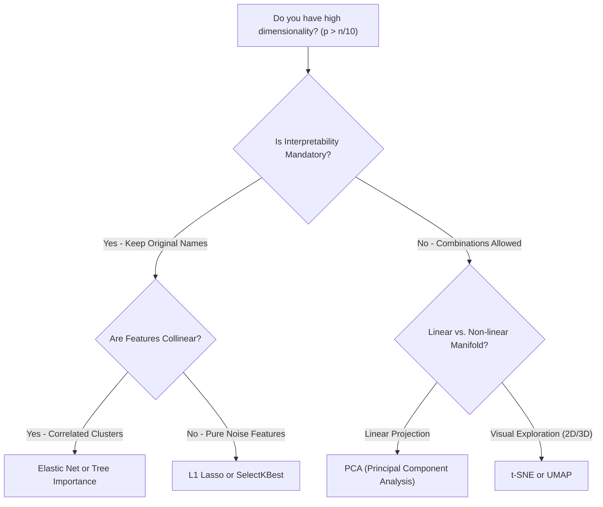

import Tabs from '@theme/Tabs';
import TabItem from '@theme/TabItem';
import React from 'react';

# Curse of Dimensionality

> **Topic —** In classical machine learning, intuition derived from 2D and 3D Euclidean geometry fails completely in high dimensions ($d > 10$). Adding more features without exponentially expanding sample size makes data catastrophically sparse, drives pairwise Euclidean distances toward equidistance, and evaporates volume into the outer corners of hypercubes. This guide explores the mathematical reality of the **Curse of Dimensionality** and contrasts **Feature Selection** with **Dimensionality Reduction (PCA)**.

---

## 1. The Core Concept

When we add features to a tabular dataset, the volume of the feature space expands exponentially:

$$\text{Volume}(d) \propto s^d$$

To maintain the same sample density across space as $10$ points uniformly distributed along a 1D unit interval $[0, 1]$:
*   In **1D**: Requires $10^1 = 10$ observations.
*   In **2D**: Requires $10^2 = 100$ observations.
*   In **10D**: Requires $10^{10} = 10,000,000,000$ (10 billion) observations!
*   In **100D**: Requires $10^{100}$ observations (exceeding total atoms in the observable universe).

In practice, datasets contain hundreds of features with only thousands of rows. The consequence is **severe data sparsity**: every observation becomes an isolated island surrounded by an immense void of empty space.

:::tip

**If you only take one thing from this page**

More features do not equal more information. In high dimensions, **points migrate to the outer boundaries**, **all pairwise distances become equidistant**, and models suffer severe overfitting. To maintain generalization when $p > n / 10$, you must actively compress dimensions or filter uninformative noise.

:::

---

## 2. Interactive High-Dimensional Geometry Simulator

Vary the dimension slider $d$ below to observe the three mathematical catastrophes of high-dimensional geometry:

export const CurseOfDimensionalitySimulator = () => {
  const [dim, setDim] = React.useState(3);

  // Gamma helper for integer and half-integer
  const gamma = (z) => {
    const gValues = {
      0.5: Math.sqrt(Math.PI),
      1.0: 1.0,
      1.5: 0.5 * Math.sqrt(Math.PI),
      2.0: 1.0,
      2.5: 1.32934,
      3.0: 2.0,
      3.5: 3.32335,
      4.0: 6.0,
      4.5: 11.6317,
      5.0: 24.0,
      5.5: 52.3427,
      6.0: 120.0,
      6.5: 287.885,
      7.0: 720.0,
      7.5: 1871.25,
      8.0: 5040.0,
      8.5: 14034.4,
      9.0: 40320.0,
      9.5: 119292.0,
      10.0: 362880.0,
      10.5: 1.133e6,
      11.0: 3.628e6
    };
    return gValues[z] || Math.exp((z - 0.5) * Math.log(z) - z + 0.5 * Math.log(2 * Math.PI));
  };

  // Hypersphere volume inside unit hypercube
  // V_sphere / V_cube = (pi^(d/2) / (2^d * Gamma(d/2 + 1)))
  const sphereRatio = Math.min(1.0, Math.pow(Math.PI, dim / 2.0) / (Math.pow(2.0, dim) * gamma(dim / 2.0 + 1.0)));
  const spherePercent = (sphereRatio * 100);

  // Shell volume: fraction in outer 10% shell = 1 - 0.9^d
  const shellPercent = (1.0 - Math.pow(0.90, dim)) * 100;

  // Relative contrast: (d_max - d_min) / d_min ~ 1 / sqrt(d)
  const relativeContrast = Math.min(1.0, 1.0 / Math.sqrt(dim));

  return (
    

      <h4 style={{ margin: '0 0 12px 0' }}>🌌 High-Dimensional Geometry and Sparsity Simulator</h4>
      

        Slide dimension d to observe how volume and distance behave in Euclidean hyperspace:
      

      

        

          Feature Dimension (d):
          {dim} Dimensions
        

        <input
          type="range"
          min="1"
          max="20"
          step="1"
          value={dim}
          onChange={(e) => setDim(parseInt(e.target.value))}
          style={{ width: '100%', marginTop: '6px' }}
        />
      

      

        

          

            Inscribed Sphere Volume
            
              {spherePercent < 0.001 ? '< 0.001%' : `${spherePercent.toFixed(2)}%`}
            
          

          

            

          

          
Evaporates to 0.0% (Corners dominate)

        

        

          

            Outer Shell Mass (Skin)
             70 ? '#e53e3e' : '#38a169' }}>
              {shellPercent.toFixed(1)}%
            
          

          

            
 70 ? '#e53e3e' : '#38a169', borderRadius: '4px', transition: '0.2s' }} />
          

          
Fraction in outer 10% margin

        

        

          

            Distance Contrast
            
              {(relativeContrast * 100).toFixed(0)}%
            
          

          

            

          

          
(d_max - d_min) / d_min

        

      

      

        <strong style={{ fontSize: '14px', color: dim <= 3 ? '#276749' : dim <= 8 ? '#2b6cb0' : '#c53030' }}>
          {dim <= 3 ? '🌱 Low-Dimensional Regime (Dense & Intuitive)' : dim <= 8 ? '⚠️ Moderate Dimensionality (Emerging Sparsity)' : '🚨 Curse of Dimensionality Regime'}
        </strong>
        

          {dim <= 3
            ? 'Euclidean geometry behaves intuitively. Inscribed sphere occupies ' + spherePercent.toFixed(0) + '% of cube volume. Pairwise distances have high relative contrast.'
            : dim <= 8
            ? 'Hypersphere volume collapses to ' + spherePercent.toFixed(1) + '%. Notice that ' + shellPercent.toFixed(0) + '% of all points now sit within 10% of the outer boundary!'
            : 'Extreme sparsity! The inscribed sphere has evaporated (' + (spherePercent < 0.01 ? '<0.01%' : spherePercent.toFixed(2) + '%') + '); 99%+ of volume is trapped in the sharp corners. Relative distance contrast collapses, meaning all points are virtually equidistant!'}
        

      

    

  );
};

<CurseOfDimensionalitySimulator />

---

## 3. The Three Manifestations of the Curse

<Tabs>
  <TabItem value="empty" label="1. The Empty Space Phenomenon" default>
     
    
    *   **The Math:** Consider an inscribed hypersphere inside a unit hypercube $[-1, 1]^d$. As $d \to \infty$:
        $$\lim_{d \to \infty} \frac{\text{Volume}(\text{Sphere})}{\text{Volume}(\text{Cube})} = 0.000$$
    *   **The Paradox:** Even though the sphere touches all $2d$ faces of the cube, the sphere contains virtually **$0\%$ of the cube's volume**.
    *   **Where is the volume?** It all resides in the $2^d$ corners of the hypercube!
  </TabItem>
  <TabItem value="surface" label="2. All Points Live on the Surface">
     
    
    *   **The Math:** Fraction of volume in an outer shell of thickness $\epsilon = 0.10$:
        $$\text{Shell Volume} = 1 - (1 - \epsilon)^d = 1 - 0.9^d$$
    *   **Consequence:** In $d=20$, **$88\%$** of data points live within the outer $10\%$ skin. In $d=50$, **$99.5\%$** of all data sits on the extreme surface boundary.
    *   **Failure Mode:** There is no "interior" or "center" in high dimensions; every sample is an extreme outlier!
  </TabItem>
  <TabItem value="distance" label="3. Distance Concentration (All Points Equidistant)">
     
    
    *   **The Math:** By the Central Limit Theorem, the Euclidean distance between any two random vectors concentrates:
        $$\lim_{d \to \infty} \frac{d_{\max} - d_{\min}}{d_{\min}} = 0$$
    *   **Consequence:** The nearest neighbor is almost as far away as the farthest neighbor!
    *   **Failure Mode:** Algorithms based on Euclidean distance ($k$-Nearest Neighbors, KMeans, RBF kernel SVMs) degrade into random classification.
  </TabItem>
</Tabs>

---

## 4. Defending Against the Curse: Selection vs. Projection

To combat high dimensionality, engineers choose between two primary paradigms:

export const DefenseStrategyComparator = () => {
  const [interpretability, setInterpretability] = React.useState('high');
  const [collinear, setCollinear] = React.useState(false);

  return (
    

      <h4 style={{ margin: '0 0 12px 0' }}>🛡️ High-Dimensional Defense Strategy Chooser</h4>
      

        Select your domain constraints to identify the optimal dimensionality defense:
      

      

        

          <label style={{ fontSize: '12px', fontWeight: 'bold' }}>1. Interpretability Requirement</label>
          

            <button
              onClick={() => setInterpretability('high')}
              style={{ padding: '5px 10px', borderRadius: '4px', border: '1px solid #3182ce', backgroundColor: interpretability === 'high' ? '#3182ce' : 'transparent', color: interpretability === 'high' ? '#fff' : 'var(--ifm-font-color-base)', cursor: 'pointer', fontSize: '12px' }}
            >
              Must Retain Original Features
            </button>
            <button
              onClick={() => setInterpretability('low')}
              style={{ padding: '5px 10px', borderRadius: '4px', border: '1px solid #3182ce', backgroundColor: interpretability === 'low' ? '#3182ce' : 'transparent', color: interpretability === 'low' ? '#fff' : 'var(--ifm-font-color-base)', cursor: 'pointer', fontSize: '12px' }}
            >
              Combinations Allowed
            </button>
          

        

        

          <label style={{ fontSize: '12px', fontWeight: 'bold' }}>2. Correlation Structure</label>
          

            <button
              onClick={() => setCollinear(false)}
              style={{ padding: '5px 10px', borderRadius: '4px', border: '1px solid #38a169', backgroundColor: !collinear ? '#38a169' : 'transparent', color: !collinear ? '#fff' : 'var(--ifm-font-color-base)', cursor: 'pointer', fontSize: '12px' }}
            >
              Independent / Uncorrelated
            </button>
            <button
              onClick={() => setCollinear(true)}
              style={{ padding: '5px 10px', borderRadius: '4px', border: '1px solid #38a169', backgroundColor: collinear ? '#38a169' : 'transparent', color: collinear ? '#fff' : 'var(--ifm-font-color-base)', cursor: 'pointer', fontSize: '12px' }}
            >
              Highly Collinear / Clustered
            </button>
          

        

      

      

        
RECOMMENDED DEFENSE STRATEGY:

        

          {interpretability === 'high'
            ? (collinear ? 'Elastic Net or Recursive Feature Elimination (RFE)' : 'L1 Lasso or SelectKBest (Univariate Filter)')
            : 'Principal Component Analysis (PCA Projection)'}
        

        <pre style={{ margin: '10px 0', padding: '8px 12px', fontSize: '13px', backgroundColor: 'rgba(148, 163, 184, 0.15)', borderRadius: '4px' }}>
          <code>
            {interpretability === 'high'
              ? (collinear
                  ? 'from sklearn.linear_model import ElasticNetCV\nmodel = ElasticNetCV(l1_ratio=0.5)'
                  : 'from sklearn.feature_selection import SelectKBest, f_regression\nselector = SelectKBest(score_func=f_regression, k=10)')
              : 'from sklearn.decomposition import PCA\npca = PCA(n_components=0.95)  # Retain 95% variance'}
          </code>
        </pre>
        

          <b>Why:</b> {interpretability === 'high'
            ? (collinear
                ? 'When features are collinear and domain stakeholders demand original features, Elastic Net avoids arbitrary selection by grouping correlated predictors.'
                : 'When features are independent and interpretability is non-negotiable (e.g. medicine/finance), univariate filters or Lasso eliminate pure noise while preserving feature names.')
            : 'PCA projects correlated feature manifolds into orthogonal principal components, capturing maximal variance with zero multicollinearity.'}
        

      

    

  );
};

<DefenseStrategyComparator />

---

## 5. Decision Flowchart: Tackling High Dimensions

---

## 6. Implementation Lab

:::tip

**Lab Exercise: The Curse of Dimensionality & Feature Reduction**

An interactive, fully functional Google Colab / Jupyter Notebook is available to simulate cross-validation degradation as dimensions expand, verify distance concentration, and benchmark SelectKBest vs. PCA live in your browser.

**How to run the lab:**
1. Click the **"Open In Colab"** badge above to launch the interactive notebook.
2. Run cells sequentially to simulate expanding feature spaces and measure distance concentration.

**Key Experiments to Run:**
*   **Experiment 1 (The Curse in Action):** Fix $N=100$ and expand features from $p=2$ to $150$. Watch training $R^2$ stay at $1.000$ while CV $R^2$ collapses from $+0.850$ down to $-0.580$.
*   **Experiment 2 (Distance Concentration Test):** Measure pairwise distance contrast across $d \in [2, 1000]$ to observe relative contrast plunge from $1.00$ to $0.05$ (equidistance).
*   **Experiment 3 (Defense Comparison):** Benchmark raw 30 features ($R^2 = 0.421$) against `SelectKBest(k=10)` ($R^2 = 0.578$) and `PCA(n_comp=10)` ($R^2 = 0.612$).

:::

---

## 7. Common Mistakes

<Tabs>
  <TabItem value="m1" label="🚨 1. Adding Features Blindly" default>
     
    
    *   **The Misconception:** *"More features always provide more information, so collecting 500 features is strictly better than 20."*
    *   **❌ Wrong Thinking:** Assuming all features add net predictive signal.
    *   **✅ The Right Principle:** Every feature introduces a parameter to estimate and expands the volume of empty space. Without exponentially more data, noise features dilute signal and guarantee overfitting.
  </TabItem>
  <TabItem value="m2" label="🚨 2. Feature Selection on the Entire Dataset">
     
    
    *   **The Misconception:** *"Running SelectKBest on all data before train_test_split is fine because it doesn't train the model."*
    *   **❌ Wrong Thinking:** Leaking test distribution correlations into feature ranking.
    *   **✅ The Right Principle:** Feature selection evaluates correlation with labels across all rows. Doing this prior to splitting leaks test fold identities, creating artificial 95% CV scores that crash in production. Wrap `SelectKBest` inside a `Pipeline`.
  </TabItem>
  <TabItem value="m3" label="🚨 3. Applying PCA on Unstandardized Data">
     
    
    *   **The Misconception:** *"PCA handles scale differences automatically because it finds eigenvectors."*
    *   **❌ Wrong Thinking:** Passing raw features to PCA without scaling.
    *   **✅ The Right Principle:** PCA seeks directions that maximize raw variance. A feature measured in millions (e.g. Annual Revenue) will have massive variance purely due to units, completely hijacking the first principal component and ignoring subtle informative features. Always apply `StandardScaler` first.
  </TabItem>
  <TabItem value="m4" label="🚨 4. Keeping Too Many Principal Components">
     
    
    *   **The Misconception:** *"To be safe, I will retain 99.9% of variance, keeping 45 out of 50 components."*
    *   **❌ Wrong Thinking:** Retaining noise components to achieve arbitrary variance thresholds.
    *   **✅ The Right Principle:** The tail components of PCA capture mostly random measurement noise. Retaining too many components defeats the purpose of dimensionality reduction and re-introduces the curse. Aim for the "elbow" (e.g. 80-90% variance).
  </TabItem>
  <TabItem value="m5" label="🚨 5. Using t-SNE as a Preprocessing Step for Linear Models">
     
    
    *   **The Misconception:** *"t-SNE reduced my data to 2D for plotting, so I can use those 2 columns as training features."*
    *   **❌ Wrong Thinking:** Using non-parametric manifold embeddings for out-of-sample prediction.
    *   **✅ The Right Principle:** Standard t-SNE does not have a deterministic out-of-sample projection function (`transform()` does not exist). Use PCA, UMAP (with parametric models), or Autoencoders for ML feature pipelines.
  </TabItem>
</Tabs>

---

## 8. Summary

  

    

      

        <h3>🤖 Curse Manifestations</h3>
      

      

        <ul>
          <li><b>Empty Space:</b> Hypersphere volume collapses to $0.00\%$; data points migrate to outer boundaries.</li>
          <li><b>Distance Concentration:</b> Contrast $\frac{d_{\max}-d_{\min}}{d_{\min}} \to 0$. Points become equidistant.</li>
          <li><b>Sample Explosion:</b> Maintaining density requires exponential sample growth ($10^d$).</li>
          <li><b>Diagnostic Signature:</b> Training $R^2 \to 1.000$ while CV $R^2$ collapses below zero.</li>
        </ul>
      

    

  

  

    

      

        <h3>🛠️ Engineering Defenses</h3>
      

      

        <ul>
          <li><b>Feature Selection:</b> Discards uninformative features. Preserves interpretability (`SelectKBest`, `Lasso`).</li>
          <li><b>Dimensionality Reduction:</b> Projects onto orthogonal variance directions (`PCA`). Compresses collinearity.</li>
          <li><b>Scaling Mandate:</b> PCA and distance algorithms strictly require `StandardScaler`.</li>
          <li><b>Pipeline Standard:</b> Always encapsulate feature reduction inside `Pipeline` to prevent leakage.</li>
        </ul>
      

    

  

 

:::info

**📌 Key Takeaways**

*   **🌌 High dimensions are empty:** In high dimensions, intuition fails; all points live on the extreme surface skin and distance contrast vanishes.
*   **🎯 Choose your defense:** If stakeholders demand original feature names, use **Feature Selection**; if features are collinear clusters, use **PCA Projection**.
*   **🛡️ Pipeline isolation:** Never select features or fit PCA outside a cross-validation pipeline.

:::

**Next Module:** [Supervised Machine Learning Handbook Complete] - Congratulations on completing Foundations, Preprocessing, Linear Regression, Optimization, Regression Metrics, Validation Strategies, Logistic Regression, Classification Metrics, and Generalization!

---

## 9. Active Recall

*Test your understanding by answering first, then clicking to reveal the underlying principles.*

### Interactive Checkpoint Quiz

export const CurseQuiz = () => {
  const [selected, setSelected] = React.useState(null);
  return (
    

      <h4 style={{ margin: '0 0 10px 0' }}>🧠 Interactive Checkpoint: k-NN Failure in High Dimensions</h4>
      
A data scientist fits a 5-Nearest Neighbors classifier on raw 500-dimensional gene expression vectors. The classifier performs no better than random guessing. What fundamental mathematical phenomenon caused this failure?

      

        <button onClick={() => setSelected('opt1')} style={{ padding: '8px 16px', borderRadius: '4px', border: '1px solid #3182ce', backgroundColor: selected === 'opt1' ? '#e53e3e' : 'transparent', color: selected === 'opt1' ? '#fff' : 'var(--ifm-font-color-base)', cursor: 'pointer', transition: '0.2s' }}>The model underfit because k=5 is too small</button>
        <button onClick={() => setSelected('opt2')} style={{ padding: '8px 16px', borderRadius: '4px', border: '1px solid #3182ce', backgroundColor: selected === 'opt2' ? '#38a169' : 'transparent', color: selected === 'opt2' ? '#fff' : 'var(--ifm-font-color-base)', cursor: 'pointer', transition: '0.2s' }}>Distance concentration: in 500D, the nearest and farthest neighbors are almost equidistant</button>
        <button onClick={() => setSelected('opt3')} style={{ padding: '8px 16px', borderRadius: '4px', border: '1px solid #3182ce', backgroundColor: selected === 'opt3' ? '#e53e3e' : 'transparent', color: selected === 'opt3' ? '#fff' : 'var(--ifm-font-color-base)', cursor: 'pointer', transition: '0.2s' }}>k-NN cannot be evaluated with cross-validation</button>
      

      {selected === 'opt1' && 
❌ Incorrect. Small k increases variance; it does not cause underfitting. Try again!
}
      {selected === 'opt2' && 
✅ Correct! In high dimensions, Euclidean distance concentrates: the ratio (d_max - d_min) / d_min converges toward zero. Because all points become practically equidistant from one another, the concept of a 'nearest neighbor' becomes meaningless, reducing k-NN to random guessing.
}
      {selected === 'opt3' && 
❌ Incorrect. k-NN works seamlessly with cross-validation. Try again!
}
    

  );
};

<CurseQuiz />

### Review Flashcards

  
❓ <b>1. [THEORY] What is the 'Empty Space Phenomenon' in high-dimensional Euclidean space?</b>

  

     
    
    *   **Hypersphere Evaporation:** The volume of an inscribed hypersphere inside a unit hypercube $[-1, 1]^d$ is:
        $$\frac{V_{\text{sphere}}(d)}{V_{\text{cube}}(d)} = \frac{\pi^{d/2}}{2^d \cdot \Gamma(d/2 + 1)}$$
    *   In 2D: $78.5\%$ of the square is inside the circle.
    *   In 10D: only $0.25\%$ of the hypercube is inside the sphere.
    *   In 20D: only $0.00002\%$ of volume is inside the sphere.
    *   **The Paradox:** Virtually all volume in high-dimensional space migrates into the sharp corners of the hypercube, leaving the center a vast, empty vacuum.
  

  
❓ <b>2. [MATH] If a 1D feature requires 10 samples to achieve a density of 10 points per unit, how many samples are required in 10 dimensions?</b>

  

     
    
    *   **Exponential Scaling:**
        $$N = k^d = 10^{10} = 10,000,000,000 \quad (10 \text{ billion samples})$$
    *   To maintain the same local density in 10D as 10 points in 1D requires more data than most global internet companies possess.
    *   This is why high-dimensional datasets without massive sample sizes are inherently sparse.
  

  
❓ <b>3. [ANALYZE] Why is PCA considered a linear dimensionality reduction method, and what limitation does this impose?</b>

  

     
    
    *   **Linear Projections:** Principal components are linear combinations of original features:
        $$\text{PC}_1 = c_1 x_1 + c_2 x_2 + \dots + c_p x_p$$
    *   **Limitation:** PCA can only discover flat hyperplanes of maximum variance.
    *   If data resides on a curved non-linear manifold (such as a 3D Swiss Roll or spiral), PCA projects overlapping folds onto each other, destroying neighborhood relationships. Non-linear manifold learning (Kernel PCA, UMAP) is required for curved topologies.
  

  
❓ <b>4. [PRACTICE] What happens if you fit PCA on unstandardized data where one feature has a variance of 1,000,000 and another has a variance of 0.1?</b>

  

     
    
    *   **Eigenvector Hijacking:** PCA seeks orthogonal directions that maximize raw numerical variance.
    *   The feature with variance $1,000,000$ will account for $99.99\%$ of total variance simply due to its measurement scale (e.g. centimeters vs kilometers).
    *   The first principal component will align almost perfectly with that single feature, rendering PCA completely useless. Features must be standardized with `StandardScaler` prior to PCA.
  

  
❓ <b>5. [THEORY] What is the difference between Filter, Wrapper, and Embedded feature selection methods?</b>

  

     
    
    *   **Filter Methods (`SelectKBest`):** Evaluates features based on statistical correlation tests (ANOVA, mutual info) independently of any model. Fast, but ignores feature interactions.
    *   **Wrapper Methods (`RFE`):** Uses a model to evaluate subsets of features iteratively, removing the least important. Captures interactions, but computationally expensive.
    *   **Embedded Methods (`Lasso`, Tree Importance):** Feature selection occurs naturally during model fitting as part of the objective optimization (e.g. $L_1$ penalty driving weights to zero).
  

