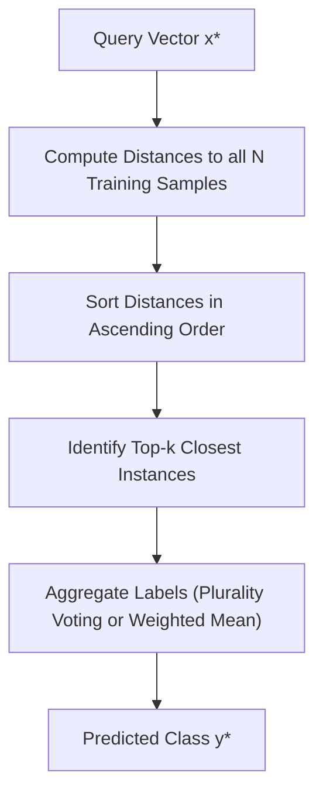
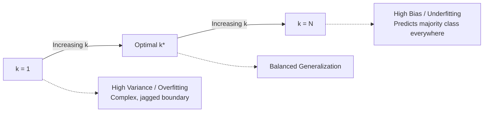

import Tabs from '@theme/Tabs';
import TabItem from '@theme/TabItem';
import Heading from '@theme/Heading';
import React from 'react';

# KNN Fundamentals

> **Topic -** K-Nearest Neighbors (KNN) is an instance-based, non-parametric supervised learning algorithm used for classification and regression. Instead of learning an explicit parameterized decision boundary during a dedicated training phase, it memorizes the entire dataset and defers all computations until an unseen query point arrives. This approach is ideal for low-dimensional datasets where decision boundaries are irregular and complex.

---

## 1. Intuition & Architectural Flow

The governing principle behind KNN is simple: **similar instances exist in close proximity within feature space**. 

Unlike eager learners (such as Logistic Regression or Neural Networks) which optimize a set of fixed weights $\mathbf{w}$ to construct an explicit mapping function $f(\mathbf{x})$, KNN belongs to the family of **lazy learners** (also termed memory-based or instance-based learners).

### The Eager vs. Lazy Learning Paradigm

*   **Eager Learning:** The training phase is computationally expensive ($\mathcal{O}(N \cdot d \cdot \text{iterations})$), but test-time evaluation is virtually instantaneous ($\mathcal{O}(d)$) because it only requires evaluating the learned functional form.
*   **Lazy Learning (KNN):** The training phase has $\mathcal{O}(1)$ time complexity because fitting the model merely involves loading the feature matrix $\mathbf{X} \in \mathbb{R}^{N \times d}$ and target vector $\mathbf{y} \in \{1, \dots, C\}^N$ into memory. However, the inference phase for a single test point requires computing distances to all $N$ training samples, scaling at $\mathcal{O}(N \cdot d)$.

---

## 2. Mathematical Formulation & Distance Metrics

To identify the "nearest" points, KNN projects instances onto a metric space $\mathbb{R}^d$ and applies a distance function $D(\mathbf{x}, \mathbf{z})$.

### Minkowski Distance ($L_p$ Norm)

The generalized distance metric between two points $\mathbf{x} = (x_1, \dots, x_d)$ and $\mathbf{z} = (z_1, \dots, z_d)$ is defined by the Minkowski distance:

$$D_p(\mathbf{x}, \mathbf{z}) = \|\mathbf{x} - \mathbf{z}\|_p = \left( \sum_{j=1}^d |x_j - z_j|^p \right)^{\frac{1}{p}}$$

The choice of parameter $p \ge 1$ yields different geometric distance models:

<Tabs>
  <TabItem value="l2" label="Euclidean Distance (p = 2)" default>
     
    
    $$\mathcal{D}_{\text{Euclidean}}(\mathbf{x}, \mathbf{z}) = \sqrt{\sum_{j=1}^d (x_j - z_j)^2}$$
    
    *   **Geometric Shape:** Induces spherical (circular in 2D) isocontours.
    *   **Properties:** Represents the shortest straight-line distance in Euclidean space. Highly sensitive to extreme coordinate discrepancies and outliers due to the squaring operation.
  </TabItem>
  <TabItem value="l1" label="Manhattan Distance (p = 1)">
     
    
    $$\mathcal{D}_{\text{Manhattan}}(\mathbf{x}, \mathbf{z}) = \sum_{j=1}^d |x_j - z_j|$$
    
    *   **Geometric Shape:** Induces diamond-shaped (rhomboid) isocontours.
    *   **Properties:** Also termed City-Block or Taxicab distance. Measures rectilinear path length along coordinate axes. Less sensitive to outliers compared to Euclidean distance because absolute differences grow linearly rather than quadratically.
  </TabItem>
  <TabItem value="cosine" label="Cosine Similarity / Distance">
     
    
    $$\mathcal{S}_{\text{Cosine}}(\mathbf{x}, \mathbf{z}) = \frac{\mathbf{x} \cdot \mathbf{z}}{\|\mathbf{x}\|_2 \|\mathbf{z}\|_2}, \quad \mathcal{D}_{\text{Cosine}} = 1 - \mathcal{S}_{\text{Cosine}}$$
    
    *   **Geometric Interpretation:** Evaluates the cosine of the angle between two multi-dimensional vectors, completely ignoring vector magnitudes.
    *   **Application:** Critical for high-dimensional sparse representations, such as text classification with TF-IDF vectors or gene expression profiles.
  </TabItem>
</Tabs>

### Voting and Decision Rules

Once the set of $k$ closest indices $\mathcal{N}_k(\mathbf{x})$ is extracted, the predicted class label $\hat{y}$ is obtained via one of two primary strategies:

#### 1. Majority (Plurality) Voting
Each neighbor possesses an equal unit weight:

$$\hat{y} = \arg\max_{c \in \{1, \dots, C\}} \sum_{i \in \mathcal{N}_k(\mathbf{x})} \mathbb{I}(y_i = c)$$

Where $\mathbb{I}(\cdot)$ is the indicator function returning 1 if the condition is satisfied, and 0 otherwise.

#### 2. Distance-Weighted Voting
Closer neighbors should logically exert greater influence over the classification decision than distant ones. The weight $w_i$ assigned to training point $\mathbf{x}_i$ is inversely proportional to its distance:

$$w_i = \frac{1}{\mathcal{D}(\mathbf{x}, \mathbf{x}_i) + \epsilon}$$

Where $\epsilon > 0$ is a tiny positive scalar preventing division by zero when an identical instance coincides with the query point. The final decision rule becomes:

$$\hat{y} = \arg\max_{c \in \{1, \dots, C\}} \sum_{i \in \mathcal{N}_k(\mathbf{x})} w_i \cdot \mathbb{I}(y_i = c)$$

---

## 3. Step-by-Step Numerical Walkthrough

Consider a two-dimensional binary classification problem ($C \in \{0, 1\}$) with five training points:

| Point | Feature $x_1$ | Feature $x_2$ | Class $y$ |
| :--- | :--- | :--- | :--- |
| $\mathbf{x}_1$ | 2.0 | 3.0 | 0 |
| $\mathbf{x}_2$ | 3.0 | 3.5 | 0 |
| $\mathbf{x}_3$ | 5.0 | 1.5 | 1 |
| $\mathbf{x}_4$ | 6.0 | 2.0 | 1 |
| $\mathbf{x}_5$ | 4.0 | 4.0 | 0 |

Let the query instance be $\mathbf{x}^* = (4.0, 2.5)$. We will classify $\mathbf{x}^*$ using **$k = 3$** with both standard Euclidean distance and distance-weighted voting.

### Step 1: Distance Calculation
Compute Euclidean distance $\mathcal{D}(\mathbf{x}^*, \mathbf{x}_i) = \sqrt{(4.0 - x_{i,1})^2 + (2.5 - x_{i,2})^2}$:

*   $\mathcal{D}(\mathbf{x}^*, \mathbf{x}_1) = \sqrt{(4 - 2)^2 + (2.5 - 3.0)^2} = \sqrt{4 + 0.25} = \sqrt{4.25} \approx 2.0616$
*   $\mathcal{D}(\mathbf{x}^*, \mathbf{x}_2) = \sqrt{(4 - 3)^2 + (2.5 - 3.5)^2} = \sqrt{1 + 1.00} = \sqrt{2.00} \approx 1.4142$
*   $\mathcal{D}(\mathbf{x}^*, \mathbf{x}_3) = \sqrt{(4 - 5)^2 + (2.5 - 1.5)^2} = \sqrt{1 + 1.00} = \sqrt{2.00} \approx 1.4142$
*   $\mathcal{D}(\mathbf{x}^*, \mathbf{x}_4) = \sqrt{(4 - 6)^2 + (2.5 - 2.0)^2} = \sqrt{4 + 0.25} = \sqrt{4.25} \approx 2.0616$
*   $\mathcal{D}(\mathbf{x}^*, \mathbf{x}_5) = \sqrt{(4 - 4)^2 + (2.5 - 4.0)^2} = \sqrt{0 + 2.25} = \sqrt{2.25} = 1.5000$

### Step 2: Ranking and Identifying Nearest Neighbors
Sorting instances by distance in ascending order:

1.  $\mathbf{x}_2$: Distance $\approx 1.4142$, Class = 0
2.  $\mathbf{x}_3$: Distance $\approx 1.4142$, Class = 1
3.  $\mathbf{x}_5$: Distance $= 1.5000$, Class = 0
4.  $\mathbf{x}_1$: Distance $\approx 2.0616$, Class = 0
5.  $\mathbf{x}_4$: Distance $\approx 2.0616$, Class = 1

For $k = 3$, the neighborhood set is $\mathcal{N}_3(\mathbf{x}^*) = \{\mathbf{x}_2, \mathbf{x}_3, \mathbf{x}_5\}$.

### Step 3: Aggregation and Final Output

*   **Standard Uniform Voting:**
    *   Class 0 Votes: $\mathbb{I}(y_2 = 0) + \mathbb{I}(y_5 = 0) = 1 + 1 = 2$
    *   Class 1 Votes: $\mathbb{I}(y_3 = 1) = 1$
    *   **Decision:** $\hat{y} = 0$ (Class 0 wins with a 2-to-1 plurality).

*   **Distance-Weighted Voting ($w_i = 1 / d_i$):**
    *   $w_2 = 1 / 1.4142 \approx 0.7071$ (Class 0)
    *   $w_3 = 1 / 1.4142 \approx 0.7071$ (Class 1)
    *   $w_5 = 1 / 1.5000 \approx 0.6667$ (Class 0)
    *   Sum of weights for Class 0: $0.7071 + 0.6667 = 1.3738$
    *   Sum of weights for Class 1: $0.7071$
    *   **Decision:** $\hat{y} = 0$ (Class 0 wins decisively).

---

## 4. Hyperparameter Selection: Choosing $k$

The hyperparameter $k$ governs the model's structural capacity and controls the **bias-variance tradeoff**:

### Extreme Value Dynamics

*   **When $k = 1$:** The decision boundary tightly wraps around every individual training sample. Noise, mislabeled points, and outliers will produce tiny "islands" of opposing class predictions. The model has **zero training error** ($E_{\text{train}} = 0$) but suffers from **high variance** and poor test generalization.
*   **When $k = N$ (Total Samples):** The model ignores local geometric structure entirely. The prediction everywhere in the feature space collapses to the global majority class of the dataset. This results in **maximum bias** and very low variance.

:::tip

**Rule of Thumb for Binary Classification**

Always choose an **odd value of $k$** (e.g., $k \in \{3, 5, 7, 9\}$) when solving binary classification problems. This mathematically guarantees the absence of voting ties, ensuring a deterministic decision boundary.

:::

---

## 5. Interactive Hyperparameter Simulator

Experiment with different values of $k$ to observe the trade-off between neighborhood size, voting confidence, and boundary sensitivity:

export const KnnSimulator = () => {
  const [k, setK] = React.useState(3);
  const [metric, setMetric] = React.useState('euclidean');
  
  // Toy dataset coordinates
  const points = [
    { id: 1, x: 20, y: 35, cls: 'A' },
    { id: 2, x: 35, y: 45, cls: 'A' },
    { id: 3, x: 45, y: 80, cls: 'B' },
    { id: 4, x: 65, y: 65, cls: 'B' },
    { id: 5, x: 55, y: 40, cls: 'A' },
    { id: 6, x: 80, y: 75, cls: 'B' },
    { id: 7, x: 30, y: 60, cls: 'B' },
  ];
  
  const query = { x: 45, y: 50 };
  
  const calculateDistance = (p1, p2) => {
    if (metric === 'euclidean') {
      return Math.sqrt(Math.pow(p1.x - p2.x, 2) + Math.pow(p1.y - p2.y, 2));
    } else {
      return Math.abs(p1.x - p2.x) + Math.abs(p1.y - p2.y);
    }
  };
  
  const sorted = points.map(p => ({
    ...p,
    d: calculateDistance(p, query)
  })).sort((a, b) => a.d - b.d);
  
  const neighbors = sorted.slice(0, k);
  const countA = neighbors.filter(p => p.cls === 'A').length;
  const countB = neighbors.filter(p => p.cls === 'B').length;
  const predicted = countA > countB ? 'Class A' : (countB > countA ? 'Class B' : 'Tie');

  return (
    

      <h3 style={{ marginTop: 0 }}>Interactive KNN Neighborhood Explorer</h3>
      

        

          <label style={{ fontWeight: 'bold', display: 'block', marginBottom: '6px' }}>Neighborhood Size (k): {k}</label>
          <input 
            type="range" 
            min="1" 
            max="7" 
            step="2" 
            value={k} 
            onChange={(e) => setK(parseInt(e.target.value))} 
            style={{ width: '180px' }}
          />
        

        

          <label style={{ fontWeight: 'bold', display: 'block', marginBottom: '6px' }}>Distance Metric:</label>
          <select 
            value={metric} 
            onChange={(e) => setMetric(e.target.value)}
            style={{ padding: '6px 12px', borderRadius: '6px', border: '1px solid var(--ifm-color-emphasis-300)' }}
          >
            <option value="euclidean">Euclidean (L2)</option>
            <option value="manhattan">Manhattan (L1)</option>
          </select>
        

      

      

        

          <h4 style={{ margin: '0 0 8px 0' }}>Classification Result</h4>
          
<strong>Predicted:</strong> {predicted}

          
<strong>Votes:</strong> Class A ({countA}) vs Class B ({countB})

          
<strong>Confidence:</strong> {Math.round((Math.max(countA, countB) / k) * 100)}%

        

        

          <h4 style={{ margin: '0 0 8px 0' }}>Active Neighbors (k = {k})</h4>
          <ul style={{ margin: 0, paddingLeft: '18px', fontSize: '13px' }}>
            {neighbors.map(n => (
              <li key={n.id}>
                Point {n.id} ({n.cls}): dist = {n.d.toFixed(2)}
              </li>
            ))}
          </ul>
        

      

    

  );
};

<KnnSimulator />

---

## 6. Algorithmic Complexity

| Phase | Brute-Force KNN | KD-Tree (Low $d$) | Ball Tree (Higher $d$) |
| :--- | :--- | :--- | :--- |
| **Training Complexity** | $\mathcal{O}(1)$ | $\mathcal{O}(d \cdot N \log N)$ | $\mathcal{O}(d \cdot N \log N)$ |
| **Query Time Complexity** | $\mathcal{O}(d \cdot N)$ | $\mathcal{O}(d \cdot \log N)$ | $\mathcal{O}(d \cdot \log N)$ |
| **Storage Complexity** | $\mathcal{O}(d \cdot N)$ | $\mathcal{O}(d \cdot N)$ | $\mathcal{O}(d \cdot N)$ |

---

## 7. Synthesis & Strategic Review

  

    

      

        <h3>Theoretical Strengths</h3>
      

      

        <ul>
          <li><b>Zero Training Assumption:</b> No assumptions made regarding the underlying distribution $P(\mathbf{X}, y)$; non-parametric.</li>
          <li><b>Multi-Class Native:</b> Handles arbitrary numbers of classes without requiring OvR (One-vs-Rest) or OvO (One-vs-One) wrappers.</li>
          <li><b>Analytical Simplicity:</b> Intuitive decision mechanics facilitate transparent auditing.</li>
        </ul>
      

    

  

  

    

      

        <h3>Operational Vulnerabilities</h3>
      

      

        <ul>
          <li><b>Inference Bottleneck:</b> Evaluating test queries on millions of vectors causes severe latency bottlenecks.</li>
          <li><b>Curse of Dimensionality:</b> Distance metrics collapse in high-dimensional feature spaces ($\mathbb{R}^d$ where $d > 50$).</li>
          <li><b>Scale Sensitivity:</b> Absolute scale discrepancies distort neighbor geometries unless standardized.</li>
        </ul>
      

    

  

 

:::info

**Key Takeaways**

*   **Instance-Based Learning:** KNN stores training instances directly; it does not construct an explicit model prior to inference.
*   **The Bias-Variance Balance:** $k = 1$ leads to high variance and complex decision surfaces; high $k$ causes high bias and over-smoothing.
*   **Metric Selection:** Euclidean distance works well for standard continuous geometric data, whereas Manhattan distance provides greater robustness against extreme outliers.

:::

**Next Section:** [Practical KNN & Feature Scaling](./02-practical-knn-and-scaling.mdx) - learn how feature scaling mitigates distance bias and explore KD-Trees and Ball-Trees.

---

## 8. Active Recall & Practice

*Test your comprehension of KNN fundamentals before progressing to the next chapter.*

### Checkpoint Quiz

export const PracticeQuiz = () => {
  const [selected, setSelected] = React.useState(null);
  return (
    

      <h4 style={{ margin: '0 0 10px 0' }}>Interactive Checkpoint: Self-Test</h4>
      
Why is an odd value of k typically preferred in a binary classification setting?

      

        <button onClick={() => setSelected('opt1')} style={{ padding: '8px 16px', borderRadius: '4px', border: '1px solid #3182ce', backgroundColor: selected === 'opt1' ? '#38a169' : 'transparent', color: selected === 'opt1' ? '#fff' : 'var(--ifm-font-color-base)', cursor: 'pointer', transition: '0.2s' }}>A) Prevents voting ties</button>
        <button onClick={() => setSelected('opt2')} style={{ padding: '8px 16px', borderRadius: '4px', border: '1px solid #3182ce', backgroundColor: selected === 'opt2' ? '#e53e3e' : 'transparent', color: selected === 'opt2' ? '#fff' : 'var(--ifm-font-color-base)', cursor: 'pointer', transition: '0.2s' }}>B) Decreases computational latency</button>
        <button onClick={() => setSelected('opt3')} style={{ padding: '8px 16px', borderRadius: '4px', border: '1px solid #3182ce', backgroundColor: selected === 'opt3' ? '#e53e3e' : 'transparent', color: selected === 'opt3' ? '#fff' : 'var(--ifm-font-color-base)', cursor: 'pointer', transition: '0.2s' }}>C) Solves the curse of dimensionality</button>
      

      {selected === 'opt1' && 
Correct! With two classes, an odd value of k ensures that one class will always receive a strict majority of votes.
}
      {selected === 'opt2' && 
Incorrect. The choice of an odd k does not reduce the number of distance calculations. Try again!
}
      {selected === 'opt3' && 
Incorrect. The curse of dimensionality is an intrinsic property of high-dimensional spaces, independent of k being odd or even.
}
    

  );
};

<PracticeQuiz />

### Review Flashcards

  
<b>1. [THEORY] What defines KNN as a "lazy" learning algorithm?</b>

  

     
    
    *   **Lazy Paradigm:** KNN postpones generalization until a query instance is evaluated.
    *   **Computation Tradeoff:** There is no explicit training phase ($\mathcal{O}(1)$ time to memorize), but all distance computations and neighborhood sorting are executed during the prediction step ($\mathcal{O}(N \cdot d)$).
  

  
<b>2. [EXAM PRACTICE] How does the decision boundary change as $k$ moves from 1 to $N$?</b>

  

     
    
    *   **$k = 1$:** Highly non-linear, fragmented, and jagged decision boundary. Overfits noise and yields zero training error.
    *   **Increasing $k$:** Boundaries progressively smooth out, reducing variance while increasing bias.
    *   **$k = N$:** The decision surface vanishes completely, predicting the majority class across the entire feature space.
  

