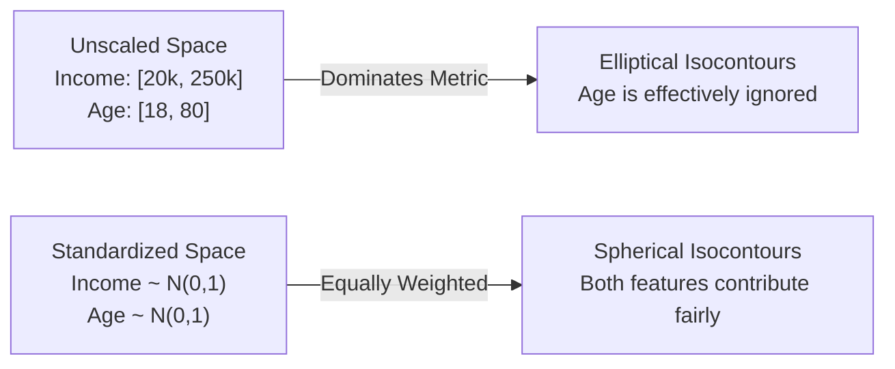
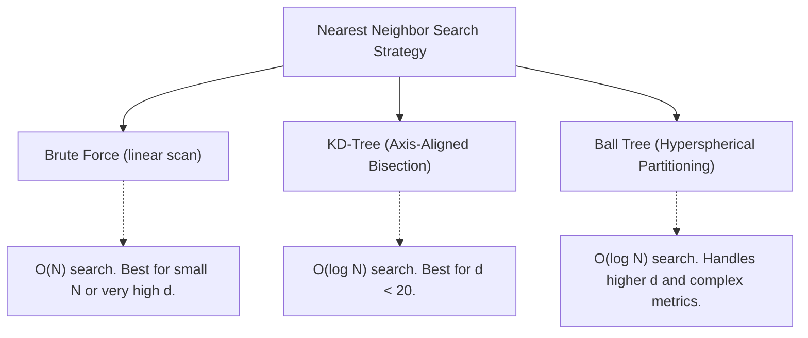

import Tabs from '@theme/Tabs';
import TabItem from '@theme/TabItem';
import Heading from '@theme/Heading';
import React from 'react';

# Practical KNN & Feature Scaling

> **Topic -** Distance-based classifiers are completely dependent on the geometric scale of the input features. Without normalization, features with wide dynamic ranges dominate distance metrics, rendering other features irrelevant. Furthermore, high-dimensional geometries induce the Curse of Dimensionality, which can degrade neighbor searches unless mitigated by dimensionality reduction or tree-based spatial partitioning.

---

## 1. The Scaling Imperative

In distance-based machine learning, the spatial distance between two vectors is calculated across all coordinate dimensions simultaneously:

$$\mathcal{D}(\mathbf{x}, \mathbf{z}) = \sqrt{\sum_{j=1}^d (x_j - z_j)^2}$$

If feature $x_1$ represents **Annual Income** (ranging from 20,000 to 250,000) while feature $x_2$ represents **Age** (ranging from 18 to 80), the numerical difference along $x_1$ will be on the order of thousands, whereas the difference along $x_2$ will rarely exceed a few dozen. Consequently, the distance metric will almost entirely ignore the Age feature.

### Geometric Distortion Illustrated



---

## 2. Standardization vs. Normalization

To eliminate scale-dependent distortions, features must be transformed onto comparable numerical domains:

<Tabs>
  <TabItem value="standard" label="StandardScaler (Z-Score)" default>
    <br/>
    
    Transforms features to exhibit zero mean and unit variance ($\mu = 0, \sigma^2 = 1$):
    
    $$z_{ij} = \frac{x_{ij} - \mu_j}{\sigma_j}$$
    
    *   **When to Use:** Standard default for KNN. Preserves the shape of Gaussian-like distributions and accommodates outliers better than bounded scaling.
    *   **Inference Rule:** The test vector must be scaled using the training set parameters ($\mu_{\text{train}}, \sigma_{\text{train}}$) to prevent data leakage.
  </TabItem>
  <TabItem value="minmax" label="MinMaxScaler (Range Scaling)">
    <br/>
    
    Binds all feature values into a closed interval, typically $[0, 1]$:
    
    $$x_{\text{scaled}} = \frac{x - x_{\min}}{x_{\max} - x_{\min}}$$
    
    *   **When to Use:** Appropriate when features must strictly inhabit non-negative bounded ranges (e.g., pixel intensities or bounded survey scores).
    *   **Vulnerability:** Extreme outliers will compress the vast majority of valid in-distribution data into a tiny subset of the $[0, 1]$ interval.
  </TabItem>
</Tabs>

---

## 3. The Curse of Dimensionality

As the number of feature dimensions $d$ expands, the volume of the feature space grows exponentially ($\mathcal{O}(2^d)$). This induces severe geometric pathologies:

### 1. The Empty Space Phenomenon
To maintain a constant density of data points across higher dimensions, the number of training samples $N$ must increase exponentially:

$$N \propto C^d \quad (C > 1)$$

Without an exponential surge in data points, the feature space becomes completely empty, meaning all observations are distant outliers from one another.

### 2. Distance Metric Collapse
In high-dimensional space, the ratio between the distance to the nearest neighbor and the distance to the farthest neighbor approaches 1:

$$\lim_{d \to \infty} \frac{\mathcal{D}_{\max} - \mathcal{D}_{\min}}{\mathcal{D}_{\min}} \to 0$$

When all data points are almost equidistant from the query instance, the notion of a "nearest neighbor" becomes statistically meaningless.

:::warning

**Mitigating High Dimensionality**

When dealing with high-dimensional datasets ($d > 50$), always precede KNN with feature selection or dimensionality reduction techniques, such as **Principal Component Analysis (PCA)** or **t-SNE/UMAP** for visualization.

:::

---

## 4. Accelerating Neighbor Search: Trees vs. Brute-Force

Computing pairwise distances to all $N$ points becomes intractable as datasets grow into hundreds of thousands of samples. Scikit-Learn implements three underlying search algorithms:



*   **Brute Force (`algorithm='brute'`):** Evaluates all Euclidean distances directly. Ideal when $d$ is very large ($d > 30$) because tree structures lose their pruning efficiency in high dimensions.
*   **KD-Tree (`algorithm='kd_tree'`):** Recursively bisects data along the axis of maximum variance, constructing a binary search tree. When $d < 20$, query time drops to $\mathcal{O}(\log N)$. Above 20 dimensions, query time degrades back to $\mathcal{O}(N)$.
*   **Ball Tree (`algorithm='ball_tree'`):** Partitions space into nested multidimensional hyperspheres ("balls"). More effective than KD-Trees when handling complex distance metrics (such as Haversine distance) or slightly higher dimensions.

---

## 5. Implementation Lab

This lab builds a complete, leak-free classification pipeline using Scikit-Learn, executing cross-validated hyperparameter tuning over $k$ and neighborhood weighting schemes.

<a href="/labs/10-k-nearest-neighbors/knn_classification.ipynb" target="_blank" rel="noopener noreferrer">
  
</a>

```python
import numpy as np
import pandas as pd
import matplotlib.pyplot as plt
from sklearn.datasets import load_iris
from sklearn.model_selection import train_test_split, GridSearchCV, StratifiedKFold
from sklearn.preprocessing import StandardScaler
from sklearn.neighbors import KNeighborsClassifier
from sklearn.pipeline import Pipeline
from sklearn.metrics import classification_report, confusion_matrix

# 1. Load Dataset
data = load_iris()
X, y = data.data, data.target

# 2. Stratified Train-Test Split (80/20)
X_train, X_test, y_train, y_test = train_test_split(
    X, y, test_size=0.20, random_state=42, stratify=y
)

# 3. Construct Pipeline to Prevent Data Leakage
# StandardScaler must be fit ONLY on the training folds during cross-validation
knn_pipeline = Pipeline([
    ('scaler', StandardScaler()),
    ('knn', KNeighborsClassifier())
])

# 4. Define Hyperparameter Search Grid
param_grid = {
    'knn__n_neighbors': list(range(1, 31, 2)),  # Test odd k values from 1 to 29
    'knn__weights': ['uniform', 'distance'],
    'knn__metric': ['euclidean', 'manhattan']
}

# 5. Execute 5-Fold Stratified Grid Search
cv = StratifiedKFold(n_splits=5, shuffle=True, random_state=42)
grid_search = GridSearchCV(
    estimator=knn_pipeline,
    param_grid=param_grid,
    cv=cv,
    scoring='accuracy',
    n_jobs=-1
)
grid_search.fit(X_train, y_train)

print(f"Optimal Hyperparameters: {grid_search.best_params_}")
print(f"Best Cross-Validation Accuracy: {grid_search.best_score_:.4f}")

# 6. Evaluate on Unseen Holdout Test Set
best_model = grid_search.best_estimator_
y_pred = best_model.predict(X_test)

print("\n--- Out-of-Sample Classification Report ---")
print(classification_report(y_test, y_pred, target_names=data.target_names))
```

---

## 6. Synthesis & Strategic Review

<div className="row">
  <div className="col col--6">
    <div className="card" style={{ height: '100%', marginBottom: '15px' }}>
      <div className="card__header">
        <h3>Deployment Checklist</h3>
      </div>
      <div className="card__body">
        <ul>
          <li><b>Pipeline Encapsulation:</b> Always encapsulate preprocessing (`StandardScaler`) and estimator within a Scikit-Learn `Pipeline`.</li>
          <li><b>Hyperparameter Search:</b> Evaluate odd values of $k$ across both `uniform` and `distance` weighting.</li>
          <li><b>Dimensionality Audit:</b> If $d > 30$, inspect feature redundancy and apply PCA or UMAP prior to fitting.</li>
        </ul>
      </div>
    </div>
  </div>
  <div className="col col--6">
    <div className="card" style={{ height: '100%', marginBottom: '15px' }}>
      <div className="card__header">
        <h3>Pitfalls to Avoid</h3>
      </div>
      <div className="card__body">
        <ul>
          <li><b>Global Scaling Leakage:</b> Never run `fit_transform` on the entire dataset prior to splitting into train/test sets.</li>
          <li><b>Unscaled Outliers:</b> `StandardScaler` can be influenced by heavy-tailed outliers; use `RobustScaler` if extreme anomalies exist.</li>
          <li><b>Unpruned Trees:</b> Avoid KD-Trees for text classification where $d \sim 10,000$; use Brute-Force with Cosine Distance instead.</li>
        </ul>
      </div>
    </div>
  </div>
</div>

<br/>

:::info

**Key Takeaways**

*   **Scale Invariance is Absent:** KNN is not scale-invariant; distance calculations are completely distorted by unstandardized numerical features.
*   **The Curse of Dimensionality:** As dimensions increase, metric contrast degenerates ($\lim_{d \to \infty} \frac{\mathcal{D}_{\max} - \mathcal{D}_{\min}}{\mathcal{D}_{\min}} \to 0$), requiring dimensionality reduction.
*   **Search Acceleration:** KD-Trees and Ball-Trees reduce query time from $\mathcal{O}(N)$ to $\mathcal{O}(\log N)$ for low to moderate dimensions.

:::

**Next Topic:** Bayes' Theorem for Classification - transition to probabilistic generative modeling.

---

## 7. Active Recall & Practice

*Test your understanding of the practical nuances and operational pitfalls of KNN.*

### Checkpoint Quiz

export const PracticeQuiz = () => {
  const [selected, setSelected] = React.useState(null);
  return (
    <div style={{ padding: '20px', border: '1px solid var(--ifm-color-emphasis-200)', borderRadius: '8px', backgroundColor: 'rgba(148, 163, 184, 0.05)', margin: '20px 0' }}>
      <h4 style={{ margin: '0 0 10px 0' }}>Interactive Checkpoint: Self-Test</h4>
      <p style={{ margin: '0 0 15px 0' }}>What is the primary danger of applying `StandardScaler().fit_transform(X)` to the entire dataset before `train_test_split`?</p>
      <div style={{ display: 'flex', gap: '10px', flexWrap: 'wrap' }}>
        <button onClick={() => setSelected('opt1')} style={{ padding: '8px 16px', borderRadius: '4px', border: '1px solid #3182ce', backgroundColor: selected === 'opt1' ? '#38a169' : 'transparent', color: selected === 'opt1' ? '#fff' : 'var(--ifm-font-color-base)', cursor: 'pointer', transition: '0.2s' }}>A) Data leakage from test to train sets</button>
        <button onClick={() => setSelected('opt2')} style={{ padding: '8px 16px', borderRadius: '4px', border: '1px solid #3182ce', backgroundColor: selected === 'opt2' ? '#e53e3e' : 'transparent', color: selected === 'opt2' ? '#fff' : 'var(--ifm-font-color-base)', cursor: 'pointer', transition: '0.2s' }}>B) Increased computational complexity during training</button>
        <button onClick={() => setSelected('opt3')} style={{ padding: '8px 16px', borderRadius: '4px', border: '1px solid #3182ce', backgroundColor: selected === 'opt3' ? '#e53e3e' : 'transparent', color: selected === 'opt3' ? '#fff' : 'var(--ifm-font-color-base)', cursor: 'pointer', transition: '0.2s' }}>C) Non-convergence of the gradient descent solver</button>
      </div>
      {selected === 'opt1' && <p style={{ color: '#38a169', marginTop: '15px', fontWeight: 'bold', fontSize: '14px', marginBottom: '0' }}>Correct! Computing mean and variance across the full dataset incorporates distribution statistics from test instances, leading to overly optimistic cross-validation results.</p>}
      {selected === 'opt2' && <p style={{ color: '#e53e3e', marginTop: '15px', fontWeight: 'bold', fontSize: '14px', marginBottom: '0' }}>Incorrect. Preprocessing the data all at once does not increase the training complexity of KNN. Try again!</p>}
      {selected === 'opt3' && <p style={{ color: '#e53e3e', marginTop: '15px', fontWeight: 'bold', fontSize: '14px', marginBottom: '0' }}>Incorrect. KNN is a non-parametric model that does not use gradient descent. Try again!</p>}
    </div>
  );
};

<PracticeQuiz />

### Review Flashcards

<details>
  <summary><b>1. [DIAGNOSTIC] Why does KD-Tree performance degrade to brute-force in high dimensions ($d > 30$)?</b></summary>
  <div className="answer-content">
    <br/>
    
    *   **Geometric Pathology:** In high dimensions, the query point's hypersphere intersects almost every bounding box defined by the tree's axis-aligned hyperplanes.
    *   **Pruning Breakdown:** The algorithm is unable to safely prune branches without searching them, forcing it to visit almost every leaf node.
  </div>
</details>

<details>
  <summary><b>2. [ENGINEERING] How does `weights='distance'` alter the decision boundary compared to `weights='uniform'`?</b></summary>
  <div className="answer-content">
    <br/>
    
    *   **Uniform Weighting:** All $k$ neighbors receive 1 vote, producing discrete step-like boundaries.
    *   **Distance Weighting:** Points closer to the query exert vastly higher influence ($w = 1/d$), resulting in smoother, localized probability contours that are less vulnerable to distant neighbors in large $k$ configurations.
  </div>
</details>
