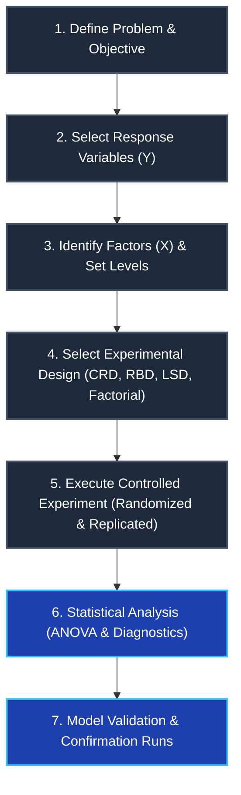
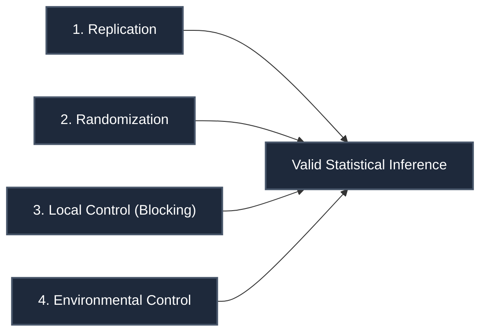

import Tabs from '@theme/Tabs';
import TabItem from '@theme/TabItem';
import Heading from '@theme/Heading';
import React from 'react';

# Foundations of Design of Experiments (DOE)

> **Topic -** Design of Experiments (DOE) is a systematic, mathematically structured methodology used to plan, conduct, analyze, and interpret controlled experimental tests. It evaluates how multiple input variables (factors) jointly influence a measurable output (response). By manipulating factors simultaneously rather than testing one factor at a time (OFAT), DOE efficiently reveals main effects, quantifies multi-factor interactions, and isolates experimental error with minimal sample runs.

---

## 1. Intuition & Architectural Flow

In scientific research and industrial engineering, testing factors in isolation (the traditional One-Factor-At-A-Time or OFAT approach) fails when variables interact. If the optimal temperature depends on the chamber pressure, changing temperature while holding pressure constant yields misleading conclusions and misses the true system optimum.

Design of Experiments provides an organized testing matrix where factors vary systematically. This deliberate variation allows researchers to:
1. Distinguish real signals from background noise (uncontrolled variation).
2. Measure non-additive interaction effects between multiple variables.
3. Optimize process setpoints while maximizing reproducibility.

### The Experimental Flow

---

## 2. Core Terminology in Experimental Design

A rigorous understanding of experimental terminology is required before setting up an ANOVA model:

| Term | Formal Definition | Engineering / Research Example |
| :--- | :--- | :--- |
| **Factor** | An independent variable deliberately altered or controlled by the experimenter. | Temperature, chamber pressure, catalyst concentration. |
| **Level** | The specific numerical value or discrete setting assigned to a factor during a trial. | Low ($100^\circ\text{C}$), High ($150^\circ\text{C}$). |
| **Response** | The measurable dependent outcome variable influenced by the factors. | Chemical yield (%), ultimate tensile strength ($\text{MPa}$). |
| **Treatment** | A unique combination of specific factor levels applied during an experimental run. | Temperature at $120^\circ\text{C}$ with Catalyst at $2\%$. |
| **Experimental Unit** | The smallest physical entity, batch, or subject to which a treatment is applied. | A silicon wafer, a plot of land, an individual animal. |
| **Replication** | The repetition of an entire treatment run across distinct experimental units. | Running the same setting on 3 independent batches to estimate error variance. |
| **Randomization** | Allocating treatments to units and execution order via random mechanisms. | Shuffling trial order using a random number generator to eliminate temporal drift. |
| **Blocking** | Grouping uniform experimental units into homogeneous sets to absorb nuisance variation. | Grouping agricultural plots by soil moisture gradient before assigning treatments. |

:::note

**Replication vs. Repeated Measurements**

Replication requires applying the treatment to completely new, independent experimental units. Measuring the same physical sample five times is a *repeated measurement* (which only captures instrument measurement error), whereas processing five separate samples through the same furnace setting is a true *replication* (which captures the true experimental process error $\sigma^2$).

:::

---

## 3. The Fundamental Principles of Experimental Design

Modern experimental statistics rests on three foundational principles formulated by Sir Ronald A. Fisher, along with environmental control:

<Tabs>
  <TabItem value="replication" label="1. Replication" default>
     
    
    *   **Core Purpose:** Provides an estimate of the internal experimental error variance ($\sigma^2$) and increases the precision of estimated treatment means.
    *   **Mathematical Mechanism:** The standard error of a treatment mean decreases inversely with the square root of replications:
        $$\text{SE}(\bar{y}) = \frac{\sigma}{\sqrt{r}}$$
        Without replication, the Mean Square Error ($\text{MSE}$) cannot be calculated, leaving zero degrees of freedom to conduct an $F$-test.
  </TabItem>
  <TabItem value="randomization" label="2. Randomization">
     
    
    *   **Core Purpose:** Protects against systematic bias, operator learning effects, machine wear, and ambient temperature drifts.
    *   **Mathematical Mechanism:** Satisfies the Gauss-Markov assumption that observation residuals $\epsilon_{ij}$ are independently and identically distributed:
        $$\epsilon_{ij} \overset{\text{iid}}{\sim} \mathcal{N}(0, \sigma^2)$$
        Randomization transforms potential systematic confounding variables into random, uncorrelated noise.
  </TabItem>
  <TabItem value="blocking" label="3. Local Control (Blocking)">
     
    
    *   **Core Purpose:** Segregates known, controllable nuisance sources of variation from the residual experimental error.
    *   **Mathematical Mechanism:** Partitions the total sum of squares such that variation attributable to the nuisance factor is absorbed into $\text{SS}_{\text{Block}}$ rather than inflating $\text{SS}_{\text{Error}}$:
        $$\text{SS}_{\text{Total}} = \text{SS}_{\text{Treat}} + \text{SS}_{\text{Block}} + \text{SS}_{\text{Error}}$$
        A smaller $\text{SS}_{\text{Error}}$ increases the calculated $F$-ratio, thereby boosting statistical power.
  </TabItem>
  <TabItem value="control" label="4. Environmental Control">
     
    
    *   **Core Purpose:** Holds extraneous, non-experimental variables at constant, fixed settings throughout the trial.
    *   **Operational Execution:** Operating under regulated cleanroom temperature, standard humidity, or using a single raw material batch ensures that changes in response are solely attributable to the active factors under investigation.
  </TabItem>
</Tabs>

---

## 4. The 7-Step Methodological Framework

Executing an industrial or scientific design of experiment follows seven structured stages:

1.  **Define the Objective:**
    Establish the exact research hypothesis (e.g., "Identify which of 4 sintering temperatures maximizes tensile strength without increasing porosity").
2.  **Select Response Variables:**
    Choose quantitative, continuous response metrics that directly reflect product or system performance. Ensure measurement gauge reproducibility and repeatability (GR&R).
3.  **Select Factors and Levels:**
    Classify variables into design factors (controllable inputs to vary), held-constant factors, and noise factors. Choose realistic operational ranges (e.g., Low setting $-1$, High setting $+1$).
4.  **Choose the Experimental Design:**
    Select the layout matching unit homogeneity:
    *   *Completely Randomized Design (CRD):* Homogeneous units, single factor.
    *   *Randomized Block Design (RBD):* Single primary factor, one nuisance gradient.
    *   *Latin Square Design (LSD):* Single primary factor, two independent nuisance gradients.
    *   *Factorial Design ($2^k$):* Multiple factors, investigating main effects and interaction structures.
5.  **Execute the Experiment:**
    Strictly enforce the randomized sequence. Ensure trial conditions reflect normal operation without special adjustments during runs.
6.  **Statistical Data Analysis:**
    Fit the statistical model, compute the Analysis of Variance (ANOVA) decomposition, check residual assumptions (normality, equal variance, independence), and determine factor significance via $F$-statistics.
7.  **Draw Conclusions and Validate:**
    Run confirmation trials at predicted optimum factor setpoints. Validate that real-world outcomes match model predictions within statistical confidence intervals.

---

## 5. Interactive Concept Verification

export const TerminologyQuiz = () => {
  const [selected, setSelected] = React.useState(null);
  return (
    

      <h4 style={{ margin: '0 0 10px 0' }}>Interactive Checkpoint: DOE Principles</h4>
      

        An engineer tests 4 different chemical catalysts on 12 identical test tubes. She tests Catalyst 1 on the first 3 tubes, Catalyst 2 on the next 3 tubes, and so on, over an 8-hour workday. Ambient lab temperature rises by 6°C during the day. Which foundational principle was violated, leading to biased results?
      

      

        <button 
          onClick={() => setSelected('rep')} 
          style={{ padding: '8px 16px', borderRadius: '4px', border: '1px solid #3182ce', backgroundColor: selected === 'rep' ? '#e53e3e' : 'transparent', color: selected === 'rep' ? '#fff' : 'var(--ifm-font-color-base)', cursor: 'pointer' }}>
          Replication
        </button>
        <button 
          onClick={() => setSelected('rand')} 
          style={{ padding: '8px 16px', borderRadius: '4px', border: '1px solid #3182ce', backgroundColor: selected === 'rand' ? '#38a169' : 'transparent', color: selected === 'rand' ? '#fff' : 'var(--ifm-font-color-base)', cursor: 'pointer' }}>
          Randomization
        </button>
        <button 
          onClick={() => setSelected('unit')} 
          style={{ padding: '8px 16px', borderRadius: '4px', border: '1px solid #3182ce', backgroundColor: selected === 'unit' ? '#e53e3e' : 'transparent', color: selected === 'unit' ? '#fff' : 'var(--ifm-font-color-base)', cursor: 'pointer' }}>
          Experimental Unit Selection
        </button>
      

      {selected === 'rand' && (
        

          Correct! Running treatments in chronological batches without randomizing run order conformed Catalyst type with the diurnal temperature drift. Any observed difference could be caused by room temperature rather than the catalyst.
        

      )}
      {selected === 'rep' && (
        

          Incorrect. The engineer replicated each catalyst 3 times across 12 tubes. The issue is how the runs were ordered in time.
        

      )}
      {selected === 'unit' && (
        

          Incorrect. The test tubes were specified as identical. The failure stems from not randomizing run sequence across the known time/temperature gradient.
        

      )}
    

  );
};

<TerminologyQuiz />

---

## 6. Exam Traps & Operational Nuances

<Tabs>
  <TabItem value="t1" label="1. The Pseudoreplication Trap" default>
     
    
    *   **The Trap:** Treating 5 aliquots drawn from a single large beaker as 5 independent replications ($r=5$).
    *   **The Consequence:** The degrees of freedom for error are falsely inflated, drastically underestimating experimental error. Any batch contamination is attributed to treatment effect, leading to a False Positive (Type I error).
    *   **The Correction:** Always prepare independent batches for each replicate run.
  </TabItem>
  <TabItem value="t2" label="2. The OFAT (One-Factor-at-a-Time) Fallacy">
     
    
    *   **The Trap:** Varying Temperature while keeping Pressure fixed, then varying Pressure while keeping Temperature fixed.
    *   **The Consequence:** Total failure to detect synergistic or antagonistic **interaction effects** ($\text{Temperature} \times \text{Pressure}$). If the optimal setting of factor A depends on the level of factor B, OFAT never converges to the global maximum.
    *   **The Correction:** Use Factorial or Response Surface designs where all factors vary simultaneously in balanced combinations.
  </TabItem>
</Tabs>

---

## 7. Summary & Cheatsheet

  

    

      

        <h3>Core Principles</h3>
      

      

        <ul>
          <li><b>Replication:</b> Establishes experimental error variance ($\text{MSE}$) and increases precision ($\sigma/\sqrt{r}$).</li>
          <li><b>Randomization:</b> Neutralizes systematic bias and validates i.i.d. error distribution.</li>
          <li><b>Blocking:</b> Eliminates variability from known nuisance gradients by partitioning sum of squares.</li>
        </ul>
      

    

  

  

    

      

        <h3>Design Selection Criteria</h3>
      

      

        <ul>
          <li><b>CRD:</b> Completely homogeneous material (e.g. laboratory tubes, controlled greenhouse).</li>
          <li><b>RBD:</b> One-directional gradient (e.g. soil fertility slope, machine operator shifts).</li>
          <li><b>LSD:</b> Two orthogonal gradients ($k \times k$ matrix, e.g. operator $\times$ machine).</li>
          <li><b>Factorial:</b> Evaluating multiple factors and their interactions simultaneously.</li>
        </ul>
      

    

  

 

:::info

**Key Takeaways**

*   **Principle Integration:** Reliable experimental inference strictly requires replication to quantify random error, randomization to avoid systematic bias, and blocking to isolate nuisance variability.
*   **Systemic Interaction:** Factorial arrangements are essential whenever factors influence one another; isolated single-factor adjustments cannot find joint optima.
*   **Sequential Iteration:** DOE is typically sequential: initial screening isolates active factors, factorial designs characterize interaction structures, and response surface methods locate the optimum.

:::

**Next Section:** [Standard Experimental Designs & ANOVA](./02-standard-experimental-designs.mdx) - In-depth statistical formulation, ANOVA tables, and step-by-step solved problems for CRD, RBD, LSD, and Full Factorial layouts.

---

## 8. Active Recall & Practice

### Review Flashcards

  
<b>1. [THEORY] What is the difference between a factor level and an experimental treatment?</b>

  

     
    
    *   A **level** is a specific numeric setting or condition of a single factor (e.g., Temperature = $100^\circ\text{C}$).
    *   A **treatment** is the complete combination of factor levels across all factors applied to an experimental unit in a single run (e.g., Temperature = $100^\circ\text{C}$, Pressure = $2\,\text{bar}$, Catalyst = $1\%$). In a single-factor experiment, each level constitutes a treatment.
  

  
<b>2. [EXAM PRACTICE] Why can an ANOVA test not be computed if an experiment has only one replication ($r=1$) per treatment in a CRD?</b>

  

     
    
    *   In a Completely Randomized Design with $t$ treatments and $r$ replications, total observations $N = t \times r$.
    *   The degrees of freedom for error are $\text{df}_{\text{Error}} = N - t = t(r - 1)$.
    *   If $r = 1$, $\text{df}_{\text{Error}} = t(1 - 1) = 0$.
    *   Since Mean Square Error ($\text{MSE}$) requires dividing the Error Sum of Squares by its degrees of freedom ($\text{MSE} = \text{SSE} / 0$), the denominator of the $F$-test ($F = \text{MSTreat} / \text{MSE}$) is undefined. Thus, experimental error cannot be estimated without replication.
  

