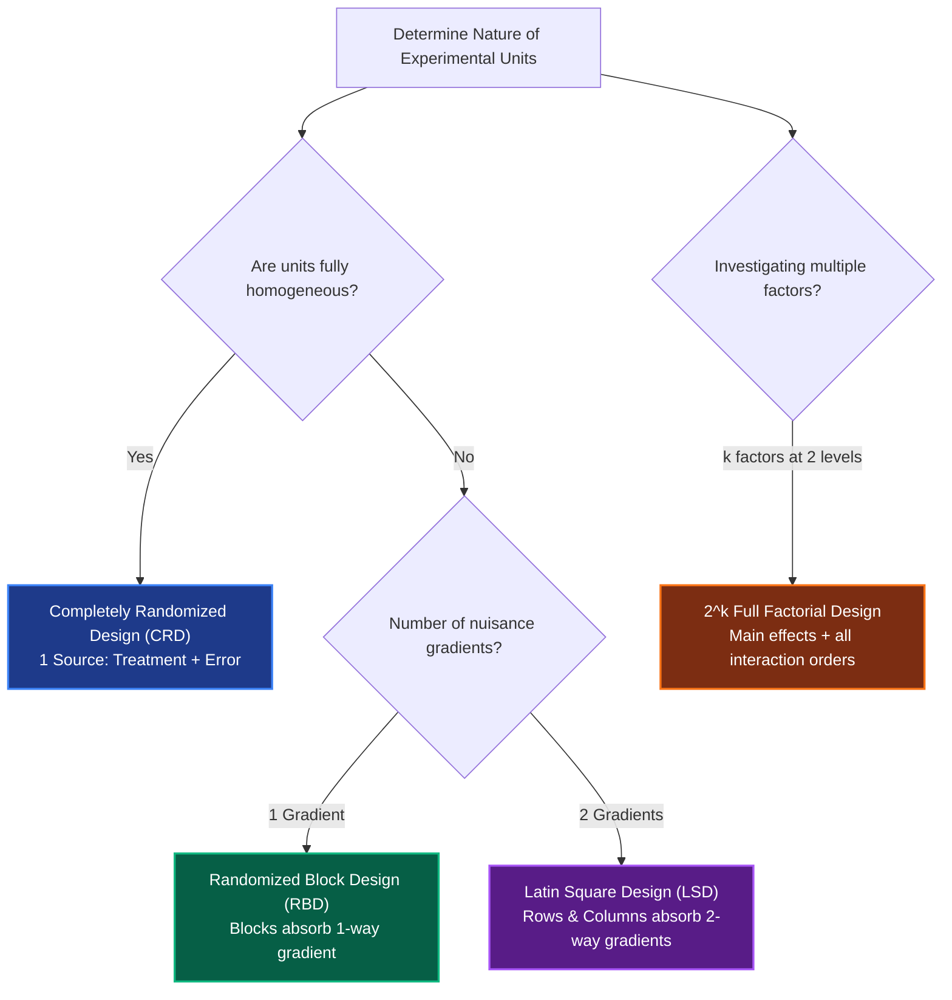

import Tabs from '@theme/Tabs';
import TabItem from '@theme/TabItem';
import Heading from '@theme/Heading';
import React from 'react';

# Standard Experimental Designs & ANOVA

> **Topic -** Experimental designs structure how treatments are allocated to experimental units to isolate factor effects from background error. The four classical designs - Completely Randomized Design (CRD), Randomized Block Design (RBD), Latin Square Design (LSD), and $2^k$ Full Factorial Design - progressively control for zero, one, two, or multiple interactive sources of variation through linear hypothesis testing and Analysis of Variance (ANOVA).

---

## 1. Comparative Architecture of Standard Designs

Selecting an experimental layout depends strictly on the physical homogeneity of the experimental material and the presence of external nuisance factors:

| Design | Blocking Structure | ANOVA Type | Sources of Variation | Key Precondition |
| :--- | :--- | :--- | :--- | :--- |
| **CRD** | No blocks (homogeneous units) | One-Way ANOVA | Treatments, Error | All experimental units are uniform. |
| **RBD** | 1 blocking factor | Two-Way ANOVA | Treatments, Blocks, Error | One-directional gradient across units. |
| **LSD** | 2 blocking factors (Rows & Columns) | Three-Way ANOVA | Treatments, Rows, Columns, Error | Exactly $p \times p$ matrix; no interactions between factors. |
| **$2^k$ Full Factorial** | All combinations of $k$ factors at 2 levels | Multi-Factor ANOVA | Main Effects, Interactions, Error | Evaluates joint variable interactions. |

---

## 2. Completely Randomized Design (CRD)

### Theoretical Model & Assumptions
CRD is the basic single-factor design where treatments are assigned completely at random to all units. It is appropriate when units are completely homogeneous (e.g., standard laboratory test tubes, incubator shelves, well-mixed chemicals).

$$\text{Statistical Model: } y_{ij} = \mu + \tau_i + \epsilon_{ij}$$

Where $\mu$ is the overall mean, $\tau_i$ is the effect of treatment $i$, and $\epsilon_{ij} \overset{\text{iid}}{\sim} \mathcal{N}(0, \sigma^2)$ is the random experimental error.

### Mathematical Layout & Formulas
Given $t$ treatments each replicated $r$ times ($N = t \times r$ observations):
*   **Grand Total ($G$):** $G = \sum_{i=1}^t \sum_{j=1}^r y_{ij}$
*   **Correction Factor ($CF$):** 
    $$CF = \frac{G^2}{N}$$
*   **Total Sum of Squares ($\text{SS}_{\text{Total}}$):**
    $$\text{SS}_{\text{Total}} = \sum_{i=1}^t \sum_{j=1}^r y_{ij}^2 - CF$$
*   **Treatment Sum of Squares ($\text{SS}_{\text{Treat}}$):**
    $$\text{SS}_{\text{Treat}} = \sum_{i=1}^t \frac{T_i^2}{r} - CF$$
*   **Error Sum of Squares ($\text{SS}_{\text{Error}}$):**
    $$\text{SS}_{\text{Error}} = \text{SS}_{\text{Total}} - \text{SS}_{\text{Treat}}$$

### Standard CRD ANOVA Table

| Source of Variation | Degrees of Freedom ($\text{df}$) | Sum of Squares ($\text{SS}$) | Mean Square ($\text{MS}$) | Calculated $F$ ($F_{\text{cal}}$) |
| :--- | :--- | :--- | :--- | :--- |
| **Treatments** | $t - 1$ | $\text{SS}_{\text{Treat}}$ | $\text{MS}_{\text{Treat}} = \frac{\text{SS}_{\text{Treat}}}{t - 1}$ | $\frac{\text{MS}_{\text{Treat}}}{\text{MS}_{\text{Error}}}$ |
| **Error** | $N - t = t(r - 1)$ | $\text{SS}_{\text{Error}}$ | $\text{MS}_{\text{Error}} = \frac{\text{SS}_{\text{Error}}}{N - t}$ | - |
| **Total** | $N - 1$ | $\text{SS}_{\text{Total}}$ | - | - |

**Decision Rule:** Compare $F_{\text{cal}}$ with tabulated $F_{\alpha, (t-1), (N-t)}$. If $F_{\text{cal}} \gt F_{\text{tab}}$, reject $H_0$ (at least one treatment mean differs significantly).

---

### Solved Problem: Fertilizer Yield Evaluation
**Problem Statement:** Three fertilizers ($A, B, C$) are tested on a homogeneous field. Each treatment is replicated 4 times ($t=3, r=4, N=12$). Observed crop yields (kg) are:
*   Fertilizer A: $18, 20, 19, 22$
*   Fertilizer B: $24, 22, 21, 23$
*   Fertilizer C: $26, 25, 27, 28$

Test at $\alpha = 0.05$ whether there are significant treatment differences.

#### Step 1: Compute Totals and Correction Factor
*   $T_A = 18 + 20 + 19 + 22 = 79$
*   $T_B = 24 + 22 + 21 + 23 = 90$
*   $T_C = 26 + 25 + 27 + 28 = 106$
*   $G = 79 + 90 + 106 = 275$
*   $$CF = \frac{G^2}{N} = \frac{275^2}{12} = \frac{75625}{12} \approx 6302.0833$$

#### Step 2: Sum of Squares
*   $$\sum y_{ij}^2 = 18^2 + 20^2 + 19^2 + 22^2 + 24^2 + 22^2 + 21^2 + 23^2 + 26^2 + 25^2 + 27^2 + 28^2 = 6413$$
*   $$\text{SS}_{\text{Total}} = 6413 - 6302.0833 = 110.9167$$
*   $$\text{SS}_{\text{Treat}} = \frac{79^2 + 90^2 + 106^2}{4} - CF = \frac{6241 + 8100 + 11236}{4} - 6302.0833 = \frac{25577}{4} - 6302.0833 = 6394.25 - 6302.0833 = 92.1667$$
*   $$\text{SS}_{\text{Error}} = \text{SS}_{\text{Total}} - \text{SS}_{\text{Treat}} = 110.9167 - 92.1667 = 18.7500$$

#### Step 3: Mean Squares & F-Ratio
*   $\text{df}_{\text{Treat}} = 3 - 1 = 2$
*   $\text{df}_{\text{Error}} = 12 - 3 = 9$
*   $\text{MS}_{\text{Treat}} = \frac{92.1667}{2} = 46.0833$
*   $\text{MS}_{\text{Error}} = \frac{18.7500}{9} = 2.0833$
*   $$F_{\text{cal}} = \frac{46.0833}{2.0833} \approx 22.12$$

#### Step 4: Decision & Conclusion
*   Critical $F_{0.05, 2, 9} \approx 4.26$.
*   Since $F_{\text{cal}} = 22.12 \gt 4.26$, we reject the null hypothesis $H_0$ at the $5\%$ level of significance.
*   **Conclusion:** The three fertilizers differ significantly in their mean crop yield.

---

## 3. Randomized Block Design (RBD)

### Theoretical Model & Assumptions
RBD is an improvement over CRD when experimental units exhibit a known one-directional gradient (e.g., slope fertility, temperature gradient across an oven, different laboratory technicians). Units are divided into homogeneous groups called **blocks**. Each treatment appears exactly once in every block in a randomized sequence.

$$\text{Statistical Model: } y_{ij} = \mu + \tau_i + \beta_j + \epsilon_{ij}$$

Where $\tau_i$ is the $i$-th treatment effect, $\beta_j$ is the $j$-th block effect, and $\epsilon_{ij} \overset{\text{iid}}{\sim} \mathcal{N}(0, \sigma^2)$.

### Mathematical Formulas
Given $t$ treatments and $r$ blocks ($N = t \times r$):
*   **Block Sum of Squares ($\text{SS}_{\text{Block}}$):**
    $$\text{SS}_{\text{Block}} = \sum_{j=1}^r \frac{B_j^2}{t} - CF$$
*   **Error Sum of Squares ($\text{SS}_{\text{Error}}$):**
    $$\text{SS}_{\text{Error}} = \text{SS}_{\text{Total}} - \text{SS}_{\text{Treat}} - \text{SS}_{\text{Block}}$$

### Standard RBD ANOVA Table

| Source | Degrees of Freedom ($\text{df}$) | Sum of Squares ($\text{SS}$) | Mean Square ($\text{MS}$) | Calculated $F$ |
| :--- | :--- | :--- | :--- | :--- |
| **Treatments** | $t - 1$ | $\text{SS}_{\text{Treat}}$ | $\text{MS}_{\text{Treat}} = \frac{\text{SS}_{\text{Treat}}}{t - 1}$ | $\frac{\text{MS}_{\text{Treat}}}{\text{MS}_{\text{Error}}}$ |
| **Blocks** | $r - 1$ | $\text{SS}_{\text{Block}}$ | $\text{MS}_{\text{Block}} = \frac{\text{SS}_{\text{Block}}}{r - 1}$ | $\frac{\text{MS}_{\text{Block}}}{\text{MS}_{\text{Error}}}$ *(Optional)* |
| **Error** | $(t - 1)(r - 1)$ | $\text{SS}_{\text{Error}}$ | $\text{MS}_{\text{Error}} = \frac{\text{SS}_{\text{Error}}}{(t - 1)(r - 1)}$ | - |
| **Total** | $N - 1$ | $\text{SS}_{\text{Total}}$ | - | - |

---

### Solved Problem: Cholesterol Analysis Across 4 Diets in 4 Labs
**Problem Statement:** Measurement of cholesterol content (%) is performed in 4 different laboratories ($A, B, C, D$) across 4 diet foods ($D_1, D_2, D_3, D_4$). Analyze the data using RBD at $\alpha = 0.05$ (Given critical $F_{0.05}(3, 9) = 3.86$).

| Laboratory (Block) | $D_1$ | $D_2$ | $D_3$ | $D_4$ | Block Total ($B_j$) |
| :--- | :--- | :--- | :--- | :--- | :--- |
| **A** | 2 | 5 | 4 | 3 | **14** |
| **B** | 3 | 7 | 4 | 2 | **16** |
| **C** | 5 | 5 | 6 | 4 | **20** |
| **D** | 5 | 5 | 8 | 5 | **23** |
| **Treatment Total ($T_i$)** | **15** | **22** | **22** | **14** | **$G = 73$** |

#### Step 1: Totals and Correction Factor
*   $t = 4, r = 4, N = 16$
*   $G = 73$
*   $$CF = \frac{73^2}{16} = \frac{5329}{16} = 333.0625$$

#### Step 2: Sum of Squares
*   $$\sum y_{ij}^2 = 2^2 + 5^2 + 4^2 + 3^2 + 3^2 + 7^2 + 4^2 + 2^2 + 5^2 + 5^2 + 6^2 + 4^2 + 5^2 + 5^2 + 8^2 + 5^2 = 373$$
*   $$\text{SS}_{\text{Total}} = 373 - 333.0625 = 39.9375$$
*   $$\text{SS}_{\text{Treat}} = \frac{15^2 + 22^2 + 22^2 + 14^2}{4} - CF = \frac{225 + 484 + 484 + 196}{4} - 333.0625 = \frac{1389}{4} - 333.0625 = 347.25 - 333.0625 = 14.1875$$
*   $$\text{SS}_{\text{Block}} = \frac{14^2 + 16^2 + 20^2 + 23^2}{4} - CF = \frac{196 + 256 + 400 + 529}{4} - 333.0625 = \frac{1381}{4} - 333.0625 = 345.25 - 333.0625 = 12.1875$$
*   $$\text{SS}_{\text{Error}} = 39.9375 - 14.1875 - 12.1875 = 13.5625$$

#### Step 3: Mean Squares & Decision
*   $\text{df}_{\text{Treat}} = 4 - 1 = 3$
*   $\text{df}_{\text{Block}} = 4 - 1 = 3$
*   $\text{df}_{\text{Error}} = (4 - 1)(4 - 1) = 9$
*   $\text{MS}_{\text{Treat}} = \frac{14.1875}{3} \approx 4.7292$
*   $\text{MS}_{\text{Error}} = \frac{13.5625}{9} \approx 1.5069$
*   $$F_{\text{cal}} = \frac{4.7292}{1.5069} \approx 3.14$$
*   **Comparison:** $F_{\text{cal}} = 3.14 \lt F_{\text{tab}} = 3.86$.
*   **Conclusion:** Fail to reject $H_0$. At the $5\%$ significance level, there is no statistically significant difference in cholesterol content among the four diet foods after accounting for laboratory blocking variations.

---

## 4. Latin Square Design (LSD)

### Theoretical Model & Assumptions
When two independent sources of nuisance variability exist simultaneously (e.g., Machine differences along rows and Operator differences along columns), the Latin Square Design (LSD) isolates both. 
*   A $p \times p$ square arrangement is used where each of $p$ treatments appears **exactly once in each row and once in each column**.
*   The number of treatments must equal the number of rows and columns ($t = \text{rows} = \text{columns} = p$).
*   **Strict Assumption:** There are no interactions between rows, columns, and treatments.

$$\text{Statistical Model: } y_{ijk} = \mu + \tau_i + \rho_j + \gamma_k + \epsilon_{ijk}$$

Where $\tau_i$ is treatment effect, $\rho_j$ is row effect, and $\gamma_k$ is column effect.

### Mathematical Formulas ($N = p^2$)
*   $$CF = \frac{G^2}{p^2}$$
*   $$\text{SS}_{\text{Total}} = \sum y^2 - CF$$
*   $$\text{SS}_{\text{Treat}} = \frac{\sum T_i^2}{p} - CF, \quad \text{SS}_{\text{Row}} = \frac{\sum R_j^2}{p} - CF, \quad \text{SS}_{\text{Col}} = \frac{\sum C_k^2}{p} - CF$$
*   $$\text{SS}_{\text{Error}} = \text{SS}_{\text{Total}} - \text{SS}_{\text{Treat}} - \text{SS}_{\text{Row}} - \text{SS}_{\text{Col}}$$
*   $\text{df}_{\text{Treat}} = p - 1, \quad \text{df}_{\text{Row}} = p - 1, \quad \text{df}_{\text{Col}} = p - 1, \quad \text{df}_{\text{Error}} = (p - 1)(p - 2), \quad \text{df}_{\text{Total}} = p^2 - 1$

---

### Solved Problem: 4x4 Latin Square Evaluation
**Problem Statement:** Four treatments ($A, B, C, D$) are allocated in a $4 \times 4$ Latin square to control for row and column effects ($p=4, N=16$). 
*   Row 1: $A(18), B(22), C(25), D(28) \implies R_1 = 93$
*   Row 2: $B(21), C(24), D(26), A(20) \implies R_2 = 91$
*   Row 3: $C(19), D(23), A(22), B(25) \implies R_3 = 89$
*   Row 4: $D(20), A(21), B(23), C(27) \implies R_4 = 91$

Column totals: $C_1 = 78, C_2 = 90, C_3 = 96, C_4 = 100$. Grand Total $G = 364$.
Treatment totals: $T_A = 81, T_B = 91, T_C = 95, T_D = 97$. Total sum of squares $\sum y^2 = 8408$.

Test at $\alpha = 0.05$ whether treatment differences are significant ($F_{0.05}(3, 6) = 4.76$).

#### Step 1: Sum of Squares
*   $$CF = \frac{364^2}{16} = \frac{132496}{16} = 8281.0$$
*   $$\text{SS}_{\text{Total}} = 8408.0 - 8281.0 = 127.0$$
*   $$\text{SS}_{\text{Treat}} = \frac{81^2 + 91^2 + 95^2 + 97^2}{4} - 8281.0 = \frac{33276}{4} - 8281.0 = 8319.0 - 8281.0 = 38.0$$
*   $$\text{SS}_{\text{Row}} = \frac{93^2 + 91^2 + 89^2 + 91^2}{4} - 8281.0 = \frac{33132}{4} - 8281.0 = 8283.0 - 8281.0 = 2.0$$
*   $$\text{SS}_{\text{Col}} = \frac{78^2 + 90^2 + 96^2 + 100^2}{4} - 8281.0 = \frac{33400}{4} - 8281.0 = 8350.0 - 8281.0 = 69.0$$
*   $$\text{SS}_{\text{Error}} = 127.0 - 38.0 - 2.0 - 69.0 = 18.0$$

#### Step 2: LSD ANOVA Table

| Source | $\text{df}$ | $\text{SS}$ | $\text{MS}$ | $F_{\text{cal}}$ | Critical $F_{0.05}$ |
| :--- | :--- | :--- | :--- | :--- | :--- |
| **Rows** | 3 | 2.0 | 0.6667 | - | - |
| **Columns** | 3 | 69.0 | 23.0000 | - | - |
| **Treatments** | 3 | 38.0 | 12.6667 | $\frac{12.6667}{3.0} \approx 4.222$ | 4.76 |
| **Error** | $(4-1)(4-2)=6$ | 18.0 | 3.0000 | - | - |
| **Total** | 15 | 127.0 | - | - | - |

*   **Decision:** $F_{\text{cal}} = 4.222 \lt 4.76$. Fail to reject $H_0$. 
*   **Conclusion:** After adjusting for row and column variations, treatments do not produce statistically significant differences at the $5\%$ level.

---

## 5. Full Factorial Design ($2^2, 2^3, 2^k$)

### Orthogonal Coding & Contrast Formulation
In a $2^k$ factorial design, $k$ factors are evaluated at 2 coded levels: Low ($-1$) and High ($+1$).
*   Total combinations: $2^k$. With $r$ replicates, total runs $N = r \cdot 2^k$.
*   **Contrast ($C$):** Sum of signed responses for an effect:
    $$C = \sum_{i=1}^{2^k} \text{Sign}_i \cdot (\text{Sum of replicates for run } i)$$
*   **Estimated Effect:**
    $$\text{Effect} = \frac{C}{2^{k-1} \cdot r}$$
*   **Sum of Squares for any Effect:**
    $$\text{SS} = \frac{C^2}{r \cdot 2^k}$$

---

### Solved Problem: $2^2$ Chemical Reaction Factorial Analysis
**Problem Statement:** A chemical engineer studies the effect of Temperature ($A$) and Pressure ($B$) on product yield (%). Both factors are tested at two coded levels: Low ($-1$) and High ($+1$) with $r=2$ replicates ($N = 2^2 \times 2 = 8$).

| Run | A | B | Interaction ($AB = A \times B$) | Run 1 ($y_{i1}$) | Run 2 ($y_{i2}$) | Treatment Total ($y_{i+}$) |
| :--- | :--- | :--- | :--- | :--- | :--- | :--- |
| **1** | $-1$ | $-1$ | $+1$ | 42 | 43 | 85 |
| **2** | $+1$ | $-1$ | $-1$ | 50 | 49 | 99 |
| **3** | $-1$ | $+1$ | $-1$ | 46 | 45 | 91 |
| **4** | $+1$ | $+1$ | $+1$ | 62 | 61 | 123 |
| **Grand Total** | | | | | | **$G = 398$** |

#### Step 1: Contrasts & Main Effects
*   **Contrast for A:** $C_A = -85 + 99 - 91 + 123 = 46$
    $$\hat{A} = \frac{C_A}{2^{2-1} \cdot 2} = \frac{46}{4} = 11.5$$
*   **Contrast for B:** $C_B = -85 - 99 + 91 + 123 = 30$
    $$\hat{B} = \frac{C_B}{4} = \frac{30}{4} = 7.5$$
*   **Contrast for AB:** $C_{AB} = +85 - 99 - 91 + 123 = 18$
    $$\widehat{AB} = \frac{C_{AB}}{4} = \frac{18}{4} = 4.5$$

#### Step 2: Sum of Squares ($N = 8$)
*   $$\text{SS}_A = \frac{C_A^2}{8} = \frac{46^2}{8} = \frac{2116}{8} = 264.5$$
*   $$\text{SS}_B = \frac{C_B^2}{8} = \frac{30^2}{8} = \frac{900}{8} = 112.5$$
*   $$\text{SS}_{AB} = \frac{C_{AB}^2}{8} = \frac{18^2}{8} = \frac{324}{8} = 40.5$$
*   $$\text{SS}_{\text{Treat}} = 264.5 + 112.5 + 40.5 = 417.5$$
*   $$\sum y^2 = 42^2 + 43^2 + 50^2 + 49^2 + 46^2 + 45^2 + 62^2 + 61^2 = 20220$$
*   $$CF = \frac{398^2}{8} = \frac{158404}{8} = 19800.5$$
*   $$\text{SS}_{\text{Total}} = 20220 - 19800.5 = 419.5$$
*   $$\text{SS}_{\text{Error}} = \text{SS}_{\text{Total}} - \text{SS}_{\text{Treat}} = 419.5 - 417.5 = 2.0$$

#### Step 3: $2^2$ Factorial ANOVA Table

| Source | $\text{df}$ | $\text{SS}$ | $\text{MS}$ | Calculated $F$ | Critical $F_{0.05}(1, 4)$ | Conclusion |
| :--- | :--- | :--- | :--- | :--- | :--- | :--- |
| **A (Temperature)** | 1 | 264.5 | 264.5 | $\frac{264.5}{0.5} = 529.0$ | 7.708 | Reject $H_0$ ($p \lt 0.001$) |
| **B (Pressure)** | 1 | 112.5 | 112.5 | $\frac{112.5}{0.5} = 225.0$ | 7.708 | Reject $H_0$ ($p \lt 0.001$) |
| **AB (Interaction)** | 1 | 40.5 | 40.5 | $\frac{40.5}{0.5} = 81.0$ | 7.708 | Reject $H_0$ ($p \lt 0.001$) |
| **Error (Residual)** | $2^2(2 - 1) = 4$ | 2.0 | $\text{MSE} = 0.5$ | - | - | - |
| **Total** | 7 | 419.5 | - | - | - | - |

**Engineering Interpretation:**
Increasing Temperature raises yield by an average of $11.5\%$. Increasing Pressure raises yield by $7.5\%$. The strong positive interaction ($AB = +4.5\%$, $F = 81.0$) demonstrates synergistic behavior: the positive impact of temperature is amplified at high pressure.

---

## 6. Exam Traps & Operational Nuances

<Tabs>
  <TabItem value="e1" label="1. Degrees of Freedom Trap in LSD" default>
     
    
    *   **The Trap:** Confusing error degrees of freedom in Latin Square Design.
    *   **The Reality:** In a $p \times p$ square, $\text{df}_{\text{Error}} = (p - 1)(p - 2)$. 
    *   **Exam Consequence:** For a $2 \times 2$ Latin Square, $\text{df}_{\text{Error}} = (2 - 1)(2 - 2) = 0$. For a $3 \times 3$ square, $\text{df}_{\text{Error}} = (2)(1) = 2$ (too small to achieve statistical power). Hence, Latin Squares should practically be at least $4 \times 4$ ($p \ge 4$).
  </TabItem>
  <TabItem value="e2" label="2. Factorial Divisor Confusion">
     
    
    *   **The Trap:** Using $N$ instead of $2^{k-1} \cdot r$ when computing the estimated main effect from a contrast.
    *   **The Reality:** The effect is the difference between two averages (High average minus Low average). Each average contains half the observations ($2^{k-1} \cdot r$). In contrast, when computing Sum of Squares, the denominator is the total observations $N = 2^k \cdot r$.
  </TabItem>
</Tabs>

---

## 7. Summary & Cheatsheet

  

    

      

        <h3>ANOVA Decomposition</h3>
      

      

        <ul>
          <li><b>CRD:</b> $\text{SST} = \text{SSTreat} + \text{SSE}$ ($\text{df}: t-1, N-t$).</li>
          <li><b>RBD:</b> $\text{SST} = \text{SSTreat} + \text{SSBlock} + \text{SSE}$ ($\text{df}_{\text{Error}} = (t-1)(r-1)$).</li>
          <li><b>LSD:</b> $\text{SST} = \text{SSTreat} + \text{SSRow} + \text{SSCol} + \text{SSE}$ ($\text{df}_{\text{Error}} = (p-1)(p-2)$).</li>
        </ul>
      

    

  

  

    

      

        <h3>2^k Factorial Rules</h3>
      

      

        <ul>
          <li><b>Contrast:</b> $C = \sum (\pm 1) \cdot y_{i+}$.</li>
          <li><b>Effect:</b> $\text{Effect} = C / (2^{k-1} r)$.</li>
          <li><b>Sum of Squares:</b> $\text{SS} = C^2 / (2^k r)$ with $\text{df} = 1$ per effect.</li>
        </ul>
      

    

  

 

:::info

**Key Takeaways**

*   **Blocking Reduces MSE:** Introducing blocks (RBD) or rows and columns (LSD) partitions nuisance variation out of the error sum of squares, lowering $\text{MSE}$ and boosting the $F$-test sensitivity.
*   **Synergy in Factorials:** Full factorial designs are uniquely capable of discovering non-linear interactions where the effect of one parameter depends on another.
*   **Exponential Scaling:** As $k$ increases, full factorial runs escalate exponentially ($2^k$), motivating fractional factorial designs and Taguchi orthogonal arrays.

:::

**Next Section:** [Fractional Factorials & Taguchi Robust Design](./03-fractional-factorials-and-taguchi.mdx) - Learn how fractional designs and Taguchi orthogonal arrays ($L_9$) dramatically reduce required runs while optimizing robust performance against noise.
