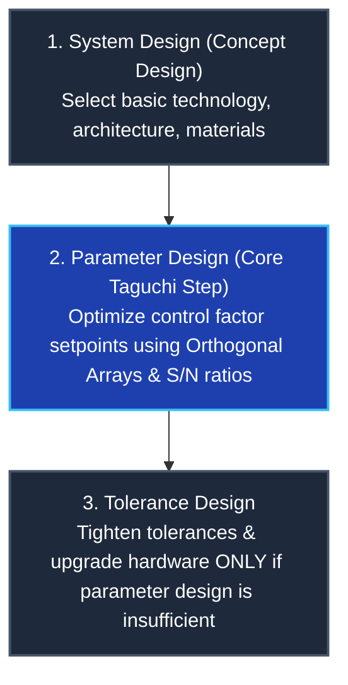
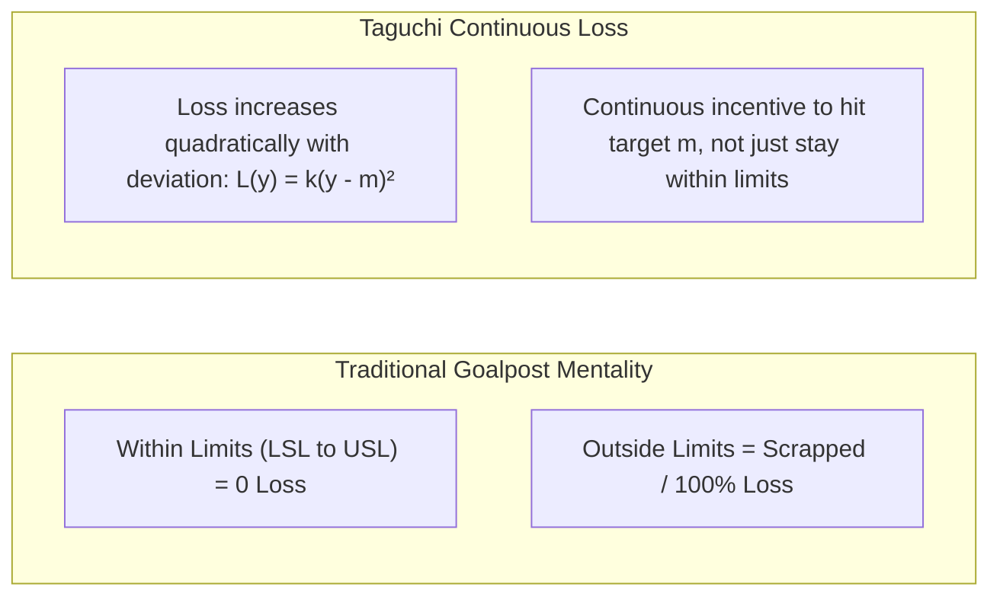

import Tabs from '@theme/Tabs';
import TabItem from '@theme/TabItem';
import Heading from '@theme/Heading';
import React from 'react';

# Fractional Factorials & Taguchi Robust Design

> **Topic -** When industrial processes involve many factors, full factorial designs become exponentially intractable ($N = L^k$). Fractional Factorial designs and Dr. Genichi Taguchi's Robust Parameter Design solve this bottleneck using balanced Orthogonal Arrays (OAs) and Signal-to-Noise ($S/N$) ratios. Rather than eliminating external noise through expensive hardware control, Taguchi methodology tunes control parameters to make performance inherently insensitive to noise.

---

## 1. Limitations of Full Factorials & The Fractional Solution

While full factorial designs identify all main effects and interaction orders, they suffer from practical limitations:

| Limitation | Technical Mechanism & Consequence |
| :--- | :--- |
| **Exponential Run Explosion** | Total runs scale as $N = L^k$. For 6 factors at 3 levels, $3^6 = 729$ trials - economically and temporally infeasible. |
| **Sparsity of Effects Principle** | Real-world engineering systems are primarily driven by main effects and low-order (2-factor) interactions. 3-factor and higher interactions are almost always negligible noise. |
| **Zero Robustness to Noise** | Full factorials optimize setpoints under tightly controlled lab conditions but ignore environmental degradation and field noise. |

### Fractional Factorial Design ($2^{k-p}$)
To overcome run explosion, experimenters execute a carefully selected fraction ($1/2^p$) of the full design:
*   A **$2^{4-1}$ fractional factorial** runs only $2^3 = 8$ runs instead of 16.
*   **Confounding (Aliasing):** In exchange for reducing runs, higher-order interactions are mathematically blended (aliased) with main effects or 2-way interactions. Designers choose generator polynomials so that main effects are aliased only with negligible 3-way interactions.

---

## 2. Taguchi Robust Design Philosophy

Dr. Genichi Taguchi (1924-2012) revolutionized quality engineering by redefining quality not as "conformance to arbitrary tolerance limits," but as **the minimal loss imparted to society**.

### The 3-Step Design Methodology
1.  **System Design (Concept Design):**
    Architects choose functional technologies, raw chemical paths, or mechanical configurations to produce a working prototype under ideal conditions.
2.  **Parameter Design (The Core Robust Step):**
    Engineers determine the optimal setpoints of controllable parameters to minimize sensitivity to noise factors. This step costs nothing in physical manufacturing changes.
3.  **Tolerance Design:**
    If parameter design fails to meet quality standards, engineers selectively invest in tighter manufacturing tolerances, precision components, or grade-A materials.

---

## 3. Taguchi Quality Loss Function (QLF)

The traditional Western "goalpost" mentality assumes that any part within the Lower Specification Limit ($\text{LSL}$) and Upper Specification Limit ($\text{USL}$) has zero defect cost, while parts outside incur a step cost.

Taguchi argued that customer dissatisfaction and societal loss begin as soon as the response deviates from the nominal target ($m$), following a continuous quadratic function:

$$L(y) = k(y - m)^2$$

Where:
*   $y$ is the observed performance characteristic.
*   $m$ is the ideal target value.
*   $L(y)$ is the economic loss per unit produced.
*   $k$ is the quality loss coefficient:
    $$k = \frac{\text{Cost of product scrapping / repair}}{\Delta^2} = \frac{A}{\Delta^2}$$
    (where $\Delta$ is the tolerance distance: $\text{USL} - m$).

---

## 4. Parameter Classification & Array Architecture

Taguchi categorizes process parameters into distinct functional groups:

| Parameter Type | Symbol | Definition | Industrial Example |
| :--- | :--- | :--- | :--- |
| **Signal Factor** | $M$ | Parameter set by the end user to convey desired output performance. | Steering wheel angle, thermostat dial, accelerator pedal. |
| **Control Factor** | $Z$ | Process/design variables chosen and set by the engineer. | Material grade, curing temperature, holding time. |
| **Noise Factor** | $X$ | Extraneous variables that cause deviation, uncontrollable or expensive to regulate. | Ambient humidity, operator fatigue, line voltage fluctuations. |
| **Response** | $Y$ | Measurable quality output characteristic. | Tensile strength, surface finish, coating thickness. |

### Inner and Outer Arrays
*   **Inner Array:** A design matrix containing the controllable design factors ($Z$).
*   **Outer Array:** A separate design matrix containing the noise factors ($X$) intentionally varied to simulate environmental stress.
*   Running the outer array across every row of the inner array evaluates the **Control $\times$ Noise interaction**, identifying settings where the system remains stable despite noise fluctuations.

---

## 5. Taguchi Orthogonal Arrays (OAs)

Taguchi designed a library of standard balanced matrices designated as $L_N(S^k)$, where $N$ is the number of experimental runs, $S$ is the number of factor levels, and $k$ is the maximum number of factors:

| Orthogonal Array | Number of Runs ($N$) | Number of Levels ($S$) | Maximum Factors ($k$) | Full Factorial Comparison |
| :--- | :--- | :--- | :--- | :--- |
| **$L_4$** | 4 | 2 | 3 | $2^3 = 8$ runs |
| **$L_8$** | 8 | 2 | 7 | $2^7 = 128$ runs |
| **$L_9$** | 9 | 3 | 4 | $3^4 = 81$ runs |
| **$L_{16}$** | 16 | 2 | 15 | $2^{15} = 32768$ runs |
| **$L_{27}$** | 27 | 3 | 13 | $3^{13} = 1594323$ runs |

Every column in an orthogonal array is pairwise orthogonal: for any two columns, all possible level pairs appear an equal number of times, allowing factor effects to be evaluated independently without mutual confounding.

---

## 6. Signal-to-Noise ($S/N$) Ratio Formulations

The Signal-to-Noise ratio ($S/N$ or $\eta$, expressed in decibels $\text{dB}$) consolidates the mean and variance into a single objective metric. In all Taguchi analyses:

$$\text{\bf Golden Rule: Always MAXIMIZE the Signal-to-Noise Ratio!}$$

<Tabs>
  <TabItem value="ltb" label="1. Larger-the-Better (LTB)" default>
     
    
    *   **Objective:** Maximize desired performance (e.g., tensile strength, battery life, solar efficiency).
    *   **Formula:**
        $$\eta_{\text{LTB}} = -10 \log_{10} \left( \frac{1}{n} \sum_{i=1}^n \frac{1}{y_i^2} \right)$$
    *   *Single Observation ($n=1$):* Simplifies to $\eta_{\text{LTB}} = 20 \log_{10}(y)$.
  </TabItem>
  <TabItem value="stb" label="2. Smaller-the-Better (STB)">
     
    
    *   **Objective:** Minimize undesirable defects or losses (e.g., surface roughness, wear rate, vehicle emissions, shrinkage).
    *   **Formula:**
        $$\eta_{\text{STB}} = -10 \log_{10} \left( \frac{1}{n} \sum_{i=1}^n y_i^2 \right)$$
  </TabItem>
  <TabItem value="ntb" label="3. Nominal-the-Best (NTB)">
     
    
    *   **Objective:** Hit a specific non-zero target value with minimal dispersion (e.g., output voltage, resistor resistance, critical dimension).
    *   **Formula:**
        $$\eta_{\text{NTB}} = 10 \log_{10} \left( \frac{\bar{y}^2}{s^2} \right)$$
        Where $\bar{y} = \frac{1}{n}\sum y_i$ and $s^2 = \frac{1}{n-1}\sum (y_i - \bar{y})^2$.
  </TabItem>
</Tabs>

---

## 7. Solved Problem 1: Single-Observation $L_9$ Taguchi Optimization

**Problem Statement:** A manufacturer seeks to maximize the tensile strength ($y$ in $\text{MPa}$) of a machined component. Three 3-level control factors are selected:
*   **Factor A (Temperature):** Level 1 = $200^\circ\text{C}$, Level 2 = $220^\circ\text{C}$, Level 3 = $240^\circ\text{C}$
*   **Factor B (Holding Time):** Level 1 = $10\,\text{min}$, Level 2 = $20\,\text{min}$, Level 3 = $30\,\text{min}$
*   **Factor C (Pressure):** Level 1 = $5\,\text{bar}$, Level 2 = $7\,\text{bar}$, Level 3 = $9\,\text{bar}$

An $L_9(3^3)$ array is executed with one observation per run ($n=1$). Objective: Larger-the-better.

### Experimental Layout & S/N Computation ($S/N = 20 \log_{10}(y)$)

| Run | Factor A (Temp) | Factor B (Time) | Factor C (Pressure) | Tensile Yield $y$ ($\text{MPa}$) | $S/N$ Ratio ($20 \log_{10}(y)$) |
| :--- | :--- | :--- | :--- | :--- | :--- |
| **1** | 1 | 1 | 1 | 42 | $32.4650\,\text{dB}$ |
| **2** | 1 | 2 | 2 | 48 | $33.6248\,\text{dB}$ |
| **3** | 1 | 3 | 3 | 50 | $33.9794\,\text{dB}$ |
| **4** | 2 | 1 | 2 | 55 | $34.8073\,\text{dB}$ |
| **5** | 2 | 2 | 3 | 60 | $35.5630\,\text{dB}$ |
| **6** | 2 | 3 | 1 | 58 | $35.2686\,\text{dB}$ |
| **7** | 3 | 1 | 3 | 65 | $36.2583\,\text{dB}$ |
| **8** | 3 | 2 | 1 | 62 | $35.8478\,\text{dB}$ |
| **9** | 3 | 3 | 2 | 59 | $35.4170\,\text{dB}$ |
| **Overall Mean** | | | | | **$\overline{S/N} = 34.8035\,\text{dB}$** |

---

### Step 2: Compute Factor-Level S/N Response Table

Calculate the average $S/N$ ratio for each level of every factor:

*   **Factor A (Temperature):**
    *   Level 1 (Runs 1, 2, 3): $\frac{32.4650 + 33.6248 + 33.9794}{3} = 33.3564\,\text{dB}$
    *   Level 2 (Runs 4, 5, 6): $\frac{34.8073 + 35.5630 + 35.2686}{3} = 35.2130\,\text{dB}$
    *   Level 3 (Runs 7, 8, 9): $\frac{36.2583 + 35.8478 + 35.4170}{3} = 35.8410\,\text{dB}$
*   **Factor B (Holding Time):**
    *   Level 1 (Runs 1, 4, 7): $\frac{32.4650 + 34.8073 + 36.2583}{3} = 34.5102\,\text{dB}$
    *   Level 2 (Runs 2, 5, 8): $\frac{33.6248 + 35.5630 + 35.8478}{3} = 35.0119\,\text{dB}$
    *   Level 3 (Runs 3, 6, 9): $\frac{33.9794 + 35.2686 + 35.4170}{3} = 34.8883\,\text{dB}$
*   **Factor C (Pressure):**
    *   Level 1 (Runs 1, 6, 8): $\frac{32.4650 + 35.2686 + 35.8478}{3} = 34.5271\,\text{dB}$
    *   Level 2 (Runs 2, 4, 9): $\frac{33.6248 + 34.8073 + 35.4170}{3} = 34.6164\,\text{dB}$
    *   Level 3 (Runs 3, 5, 7): $\frac{33.9794 + 35.5630 + 36.2583}{3} = 35.2669\,\text{dB}$

### Response Summary & Factor Ranking ($\Delta = \text{Max} - \text{Min}$)

| Factor | Level 1 ($S/N$) | Level 2 ($S/N$) | Level 3 ($S/N$) | Range ($\Delta$) | Importance Rank | Optimum Level |
| :--- | :--- | :--- | :--- | :--- | :--- | :--- |
| **A (Temperature)** | $33.3564$ | $35.2130$ | **$35.8410$** | **$2.4846$** | **1 (Dominant)** | **$A_3$ ($240^\circ\text{C}$)** |
| **B (Holding Time)**| $34.5102$ | **$35.0119$** | $34.8883$ | $0.5017$ | **3 (Least)** | **$B_2$ ($20\,\text{min}$)** |
| **C (Pressure)** | $34.5271$ | $34.6164$ | **$35.2669$** | $0.7398$ | **2 (Moderate)** | **$C_3$ ($9\,\text{bar}$)** |

**Optimal Parameter Combination:** **$A_3 B_2 C_3$** (Temperature $240^\circ\text{C}$, Time $20\,\text{min}$, Pressure $9\,\text{bar}$). Note that this specific combination was never physically run in the 9 experimental trials!

---

### Step 3: Performance Prediction at Optimum Setpoint
Taguchi's additive prediction model projects performance at the unmeasured optimum condition:

$$\overline{S/N}_{\text{pred}} = \overline{S/N} + (A_3 - \overline{S/N}) + (B_2 - \overline{S/N}) + (C_3 - \overline{S/N})$$

*   $A_3 - \overline{S/N} = 35.8410 - 34.8035 = +1.0375\,\text{dB}$
*   $B_2 - \overline{S/N} = 35.0119 - 34.8035 = +0.2084\,\text{dB}$
*   $C_3 - \overline{S/N} = 35.2669 - 34.8035 = +0.4634\,\text{dB}$
*   $$\overline{S/N}_{\text{pred}} = 34.8035 + 1.0375 + 0.2084 + 0.4634 = 36.5128\,\text{dB}$$

**Back-transforming to Tensile Strength:**
$$\hat{y} = 10^{\frac{\overline{S/N}_{\text{pred}}}{20}} = 10^{\frac{36.5128}{20}} = 10^{1.8256} \approx 66.93\,\text{MPa}$$

The predicted optimum yield is approximately **$66.9\,\text{MPa}$**, surpassing all 9 original trials (highest was Run 7 at $65\,\text{MPa}$). A physical confirmation run must be executed at $A_3 B_2 C_3$ to validate the model.

---

## 8. Exam Traps & Operational Nuances

<Tabs>
  <TabItem value="t1" label="1. The S/N Goal Inversion Trap" default>
     
    
    *   **The Trap:** Thinking that in *Smaller-the-better* problems, you should minimize the $S/N$ ratio.
    *   **The Reality:** The negative sign in front of the formula ($-10 \log_{10}$) mathematically inverts the relationship. Therefore, **always maximize the $S/N$ ratio**, regardless of whether your objective is Larger-the-better, Smaller-the-better, or Nominal-the-best.
  </TabItem>
  <TabItem value="t2" label="2. Misinterpreting Unrun Optimum Setpoints">
     
    
    *   **The Trap:** Rejecting the optimum factor combination (e.g., $A_3 B_2 C_3$) because it was not one of the runs in the $L_9$ table.
    *   **The Reality:** Orthogonal arrays test a sparse, representative skeleton of the full search space ($9$ runs out of $27$). Because factor effects are orthogonal, their effects sum additively, allowing valid prediction of untried combinations.
  </TabItem>
</Tabs>

---

## 9. Summary & Cheatsheet

  

    

      

        <h3>Taguchi Loss Function</h3>
      

      

        <ul>
          <li><b>Formula:</b> $L(y) = k(y - m)^2$.</li>
          <li><b>Loss Constant:</b> $k = \text{Cost} / \Delta^2$.</li>
          <li><b>Philosophy:</b> Any deviation from nominal target $m$ imparts economic loss to society.</li>
        </ul>
      

    

  

  

    

      

        <h3>S/N Ratio Summary</h3>
      

      

        <ul>
          <li><b>LTB:</b> $-10 \log_{10} (\frac{1}{n}\sum y_i^{-2})$.</li>
          <li><b>STB:</b> $-10 \log_{10} (\frac{1}{n}\sum y_i^2)$.</li>
          <li><b>NTB:</b> $10 \log_{10} (\bar{y}^2 / s^2)$.</li>
          <li><b>Criterion:</b> Always pick levels that maximize $S/N$.</li>
        </ul>
      

    

  

 

:::info

**Key Takeaways**

*   **Robustness via Nonlinearity:** Parameter design exploits non-linear relationships to place the system in a flat response regime where noise variations induce negligible performance changes.
*   **Orthogonal Efficiency:** Taguchi Orthogonal Arrays drastically slash required testing iterations (e.g. $L_9$ substitutes for 27 full factorial runs) while preserving uncorrelated factor estimations.
*   **Mandatory Confirmation:** Because optimal factor combinations are frequently unexecuted in the orthogonal array, empirical confirmation runs are required to validate the additive prediction model.

:::

**Next Section:** [RSM Fundamentals & First-Order Modeling](./04-rsm-fundamentals-and-first-order.mdx) - The canonical 10-step RSM methodology, step-by-step first-order regression calculations, and the Method of Steepest Ascent.
