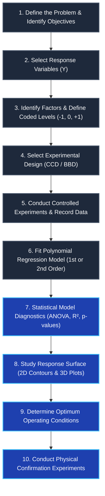

import Tabs from '@theme/Tabs';
import TabItem from '@theme/TabItem';
import Heading from '@theme/Heading';
import React from 'react';

# RSM Fundamentals & First-Order Modeling

> **Topic -** Response Surface Methodology (RSM) is a collection of mathematical and statistical techniques used for modeling, analyzing, and optimizing continuous industrial processes. When operating far from an unknown optimum, RSM employs first-order planar regression to evaluate factor impacts and determine the quickest path toward improvement using the **Method of Steepest Ascent**.

---

## 1. Intuition & The Sequential Architecture of RSM

In manufacturing and chemical engineering, optimizing an operation (e.g., maximizing product yield) typically begins with uncertainty regarding the location of the true peak. 

RSM solves this challenge through a structured sequential strategy:
1.  **Phase 1 (Screening & First-Order Modeling):** Conduct an initial two-level factorial or fractional experiment. Fit a linear planar model to determine the active factors and establish the gradient direction of maximum improvement.
2.  **Phase 2 (Steepest Ascent):** Move the process setpoints along the gradient trajectory until experimental responses peak.
3.  **Phase 3 (Curvature & Second-Order Modeling):** When center points reveal non-linear curvature in the vicinity of the peak, augment the design to a **Central Composite Design (CCD)** or **Box-Behnken Design (BBD)** to fit a quadratic surface and solve for the exact stationary optimum.

---

## 2. The Canonical 10-Step Methodological Framework

The complete academic framework of Response Surface Methodology consists of ten structured stages:

### Step 1: Define the Problem
*   Establish the objective of the study.
*   Determine whether the response is to be **maximized** (e.g., product yield, tensile strength), **minimized** (e.g., surface roughness, energy consumption), or **targeted** (e.g., achieving an exact coating thickness).

### Step 2: Select Response Variable
*   Identify the quantitative output variable ($Y$) to be measured.
*   Verify that measurement instruments exhibit high repeatability and precision.
*   *Examples:* Yield (%), Surface Roughness ($R_a$), Tensile Strength ($\text{MPa}$), Thermal Efficiency (%).

### Step 3: Identify Factors and Levels
*   Select the critical continuous input parameters ($X_1, X_2, \dots$).
*   Establish realistic operational ranges and normalize them into standard coded coordinates: Low ($-1$), Center ($0$), and High ($+1$).

| Factor | Parameter Name | Low Level ($-1$) | Center Point ($0$) | High Level ($+1$) |
| :--- | :--- | :--- | :--- | :--- |
| **$X_1$** | Temperature | $100^\circ\text{C}$ | $120^\circ\text{C}$ | $140^\circ\text{C}$ |
| **$X_2$** | Pressure | $10\,\text{psi}$ | $15\,\text{psi}$ | $20\,\text{psi}$ |

*Coded Coordinate Transformation:*
$$x_i = \frac{X_i - X_{i, \text{center}}}{\Delta X_i / 2}$$

### Step 4: Select Experimental Design
Choose an experimental matrix capable of estimating the required polynomial terms:
*   *For linear exploration:* $2^k$ Factorial design with replicated center points.
*   *For quadratic curvature:* Central Composite Design (CCD) or Box-Behnken Design (BBD).

### Step 5: Conduct Experiments
*   Perform trials according to the randomized design matrix.
*   Record the response values ($Y$), ensuring experimental units remain independent.

### Step 6: Fit the Mathematical Model
Develop a first-order or second-order polynomial model using least squares regression:
*   **First-Order Model:**
    $$Y = \beta_0 + \beta_1 X_1 + \beta_2 X_2 + \epsilon$$
*   **Second-Order Model:**
    $$Y = \beta_0 + \beta_1 X_1 + \beta_2 X_2 + \beta_{12} X_1 X_2 + \beta_{11} X_1^2 + \beta_{22} X_2^2 + \epsilon$$

### Step 7: Analyze the Model
Evaluate model quality using formal statistical tests:
*   **ANOVA ($F$-value & $p$-value):** Tests whether the overall regression model is statistically significant ($p \lt 0.05$).
*   **Coefficient of Determination ($R^2$):** Quantifies the proportion of variation explained by the model ($R^2 \ge 0.85$ desired).
*   **Adjusted $R^2$ ($R^2_{\text{adj}}$):** Validates that added terms contribute genuine predictive power.
*   **Lack-of-Fit Test:** Compares residual error against pure error ($p \gt 0.05$ indicates an adequate model).

### Step 8: Study the Response Surface
Generate graphical representations:
*   **2D Contour Plots:** Visualizing lines of constant response across the factor space.
*   **3D Surface Plots:** Topographical elevation view showing peaks, valleys, and ridges.

### Step 9: Determine the Optimum Conditions
Locate the factor setpoint that yields the optimal response:
*   In first-order models: follow the gradient path of **steepest ascent**.
*   In second-order models: calculate the stationary point ($\mathbf{x}_0 = -\frac{1}{2}\mathbf{B}^{-1}\mathbf{b}$).

### Step 10: Conduct Confirmation Experiment
*   Perform physical experiments at the predicted optimum settings.
*   Compare actual experimental values with model-predicted values to validate the optimization.

---

## 3. Comprehensive Solved Example: First-Order Model & Steepest Ascent

To understand the mathematical mechanics of first-order RSM, consider the following benchmark industrial case study:

> **Problem Statement:** A chemical manufacturing facility seeks to **maximize product yield ($Y$, in $\%$)**.
> Two continuous factors are considered:
> *   **Temperature ($X_1$):** Low ($-1$) = $100^\circ\text{C}$, High ($+1$) = $140^\circ\text{C}$ (Center point $0$ = $120^\circ\text{C}$).
> *   **Pressure ($X_2$):** Low ($-1$) = $10\,\text{psi}$, High ($+1$) = $20\,\text{psi}$ (Center point $0$ = $15\,\text{psi}$).

---

### Step 1: Conduct Experiments ($2^2$ Design Matrix)
Four baseline experimental runs are performed:

| Run | $X_1$ (Temperature) | $X_2$ (Pressure) | Yield $Y$ (%) |
| :--- | :--- | :--- | :--- |
| **1** | $-1$ | $-1$ | 70 |
| **2** | $-1$ | $+1$ | 76 |
| **3** | $+1$ | $-1$ | 80 |
| **4** | $+1$ | $+1$ | 86 |

---

### Step 2: Assume First-Order Model
For simplicity, in this initial exploration region, assume a planar first-order relationship:

$$Y = \beta_0 + \beta_1 X_1 + \beta_2 X_2$$

We need to compute the regression coefficients: $\beta_0$, $\beta_1$, and $\beta_2$.

---

### Step 3: Calculate Regression Coefficients
Using the orthogonal properties of coded coordinates in a balanced $2^k$ design:

#### 1. Calculate Intercept ($\beta_0$)
The intercept is the average of all responses across the four runs:

$$\beta_0 = \frac{\sum Y_i}{N} = \frac{70 + 76 + 80 + 86}{4} = \frac{312}{4} = 78$$

$$\boxed{\beta_0 = 78}$$

#### 2. Calculate Effect of Temperature ($\beta_1$)
Multiply the response column by the coded levels of $X_1$:

$$\beta_1 = \frac{\sum X_{1i} Y_i}{N} = \frac{(-1)(70) + (-1)(76) + (+1)(80) + (+1)(86)}{4}$$

$$\beta_1 = \frac{-70 - 76 + 80 + 86}{4} = \frac{20}{4} = 5$$

$$\boxed{\beta_1 = 5}$$

#### 3. Calculate Effect of Pressure ($\beta_2$)
Multiply the response column by the coded levels of $X_2$:

$$\beta_2 = \frac{\sum X_{2i} Y_i}{N} = \frac{(-1)(70) + (+1)(76) + (-1)(80) + (+1)(86)}{4}$$

$$\beta_2 = \frac{-70 + 76 - 80 + 86}{4} = \frac{12}{4} = 3$$

$$\boxed{\beta_2 = 3}$$

---

### Step 4: Write the Mathematical Model
Substitute the computed coefficients into the first-order equation:

$$\boxed{Y = 78 + 5X_1 + 3X_2}$$

Where:
*   $78$ = Intercept (predicted baseline yield at center conditions $X_1 = 0, X_2 = 0$).
*   $5$ = Regression coefficient representing the main effect of Temperature.
*   $3$ = Regression coefficient representing the main effect of Pressure.

---

### Step 5: Verify the Model
Test the model against known experimental data. Suppose $X_1 = 1, X_2 = 1$ (Run 4):

$$Y = 78 + 5(1) + 3(1) = 78 + 5 + 3 = 86$$

*   **Observed value:** $86\%$
*   **Predicted value:** $86\%$
*   **Residual:** $86 - 86 = 0$

The fitted model matches the experimental data points with zero residual error.

---

### Step 6: Predict Response at New Point
Predict the expected yield at the center point coordinates ($X_1 = 0, X_2 = 0$), corresponding to physical operating settings of $120^\circ\text{C}$ and $15\,\text{psi}$:

$$Y = 78 + 5(0) + 3(0) = 78$$

*   **Predicted yield at center point:** $\mathbf{78\%}$

---

### Step 7: Find Direction of Improvement
Observe the fitted coefficients:

$$Y = 78 + \mathbf{5}X_1 + \mathbf{3}X_2$$

*   Both coefficients are positive ($+5X_1, +3X_2$). Therefore, increasing Temperature and increasing Pressure will increase product yield.
*   Since $5 \gt 3$, Temperature has a stronger effect on yield than Pressure.

---

### Step 8: Execute Method of Steepest Ascent
To move rapidly toward the optimum, proceed along the gradient vector:

$$\nabla Y = \begin{bmatrix} \beta_1 \\ \beta_2 \end{bmatrix} = \begin{bmatrix} 5 \\ 3 \end{bmatrix}$$

Move along the path in proportional coordinate steps of $\Delta X_1 = 0.5$ and $\Delta X_2 = 0.3$:

| Step | Coded $X_1$ (Temp) | Coded $X_2$ (Pressure) | Physical Temperature ($^\circ\text{C}$) | Physical Pressure ($\text{psi}$) |
| :--- | :--- | :--- | :--- | :--- |
| **Start (Center)** | 0.0 | 0.0 | $120.0^\circ\text{C}$ | $15.0\,\text{psi}$ |
| **Step 1** | 0.5 | 0.3 | $130.0^\circ\text{C}$ | $16.5\,\text{psi}$ |
| **Step 2** | 1.0 | 0.6 | $140.0^\circ\text{C}$ | $18.0\,\text{psi}$ |
| **Step 3** | 1.5 | 0.9 | $150.0^\circ\text{C}$ | $19.5\,\text{psi}$ |

Physical trials are conducted along this path until observed yield ceases to increase, indicating arrival near a stationary peak.

---

### Step 9: If Curvature Exists
When additional trials near the peak exhibit non-linear curvature, fit a second-order quadratic model:

$$Y = \beta_0 + \beta_1 X_1 + \beta_2 X_2 + \beta_{12} X_1 X_2 + \beta_{11} X_1^2 + \beta_{22} X_2^2$$

Suppose the augmented experiments yield:

$$\boxed{Y = 90 + 4X_1 + 3X_2 - 2X_1 X_2 - 5X_1^2 - 4X_2^2}$$

This quadratic equation accounts for curvature and interaction, allowing contour plotting and stationary point optimization.

---

### Step 10: Conduct Confirmation Experiment
Suppose mathematical optimization locates the predicted optimum point at:

$$X_1 = 0.4, \quad X_2 = 0.3$$

*   **Predicted Yield from Model:** $92\%$
*   **Actual Physical Experiment:** $91.5\%$

**Conclusion:** Since the actual experimental value ($91.5\%$) closely validates the predicted response ($92\%$), the model is validated.

---

## 4. Exam Traps & Operational Nuances

<Tabs>
  <TabItem value="t1" label="1. The Planar Extrapolation Trap" default>
     
    
    *   **The Trap:** Extrapolating a first-order model indefinitely along the path of steepest ascent.
    *   **The Reality:** Physical systems always exhibit diminishing returns. First-order models are local approximations valid only within the immediate screening window. When yield plateaus or starts declining, curvature has been reached, requiring second-order design augmentation (CCD/BBD).
  </TabItem>
  <TabItem value="t2" label="2. Step Size Proportionality">
     
    
    *   **The Trap:** Changing factors by equal physical increments rather than proportional gradient units.
    *   **The Reality:** The ratio of coded step sizes must strictly equal the ratio of regression coefficients ($\Delta X_1 / \Delta X_2 = \beta_1 / \beta_2$). Changing temperature and pressure arbitrarily leads off the trajectory of steepest ascent.
  </TabItem>
</Tabs>

---

## 5. Summary & Cheatsheet

  

    

      

        <h3>First-Order Coefficients</h3>
      

      

        <ul>
          <li><b>Intercept:</b> $\beta_0 = \frac{\sum Y_i}{N}$ (mean response).</li>
          <li><b>Slope:</b> $\beta_i = \frac{\sum X_{ij} Y_j}{N}$ (orthogonal contrast).</li>
          <li><b>Fitted Model:</b> $Y = \beta_0 + \sum \beta_i X_i$.</li>
        </ul>
      

    

  

  

    

      

        <h3>Steepest Ascent Trajectory</h3>
      

      

        <ul>
          <li><b>Gradient Vector:</b> $\nabla Y = [\beta_1, \beta_2, \dots, \beta_k]^T$.</li>
          <li><b>Trajectory:</b> Proportional step size $\Delta X_i \propto \beta_i$.</li>
          <li><b>Termination:</b> Stop when experimental response plateaus.</li>
        </ul>
      

    

  

 

:::info

**Key Takeaways**

*   **Sequential Efficiency:** First-order models identify whether factors are active and establish the direction of improvement without investing in expensive second-order runs prematurely.
*   **Gradient Tracking:** The Method of Steepest Ascent follows the path of maximum positive rate of change in response, navigating the process setpoints toward the optimum dome.
*   **Curvature Signal:** When steepest ascent plateaus, quadratic curvature terms must be added via Central Composite or Box-Behnken designs.

:::

**Next Section:** [RSM Designs: Central Composite & Box-Behnken Designs](./05-rsm-designs-ccd-and-bbd.mdx) - Mathematical formulas for point components, rotatability ($\alpha$), run count derivations, and design trade-offs.
