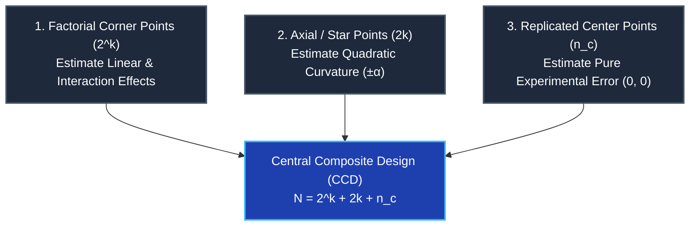
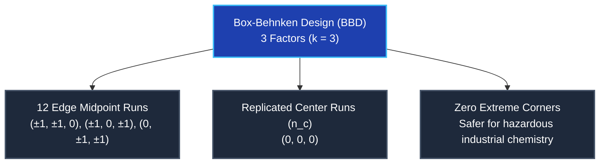

import Tabs from '@theme/Tabs';
import TabItem from '@theme/TabItem';
import Heading from '@theme/Heading';
import React from 'react';

# RSM Designs: Central Composite & Box-Behnken

> **Topic -** When a process nears an optimum, first-order planar models exhibit significant lack-of-fit due to physical curvature. To fit a full second-order polynomial response surface with quadratic and interaction terms, experimenters transition to two specialized experimental designs: the **Central Composite Design (CCD)** and the **Box-Behnken Design (BBD)**.

---

## 1. Second-Order Modeling & The Need for Curvature Designs

A standard two-level factorial ($2^k$) design only samples the boundary corners of the design space. It provides information on main effects and linear interactions, but **cannot estimate pure quadratic curvature** ($\beta_{ii} X_i^2$).

To capture curvature, each factor must be evaluated at a minimum of **three distinct levels**. Response Surface Methodology addresses this requirement through quadratic polynomial models:

$$
Y = \beta_0 + \sum_{i=1}^k \beta_i X_i + \sum_{i=1}^k \beta_{ii} X_i^2 + \sum_{i \lt j} \beta_{ij} X_i X_j + \epsilon
$$

For a two-factor system ($k = 2$):

$$
Y = \beta_0 + \beta_1 X_1 + \beta_2 X_2 + \beta_{12} X_1 X_2 + \beta_{11} X_1^2 + \beta_{22} X_2^2 + \epsilon
$$

Where:
*   $\beta_0$ = Intercept (predicted baseline at center conditions).
*   $\beta_1, \beta_2$ = Linear main effects.
*   $\beta_{12}$ = Cross-product interaction effect.
*   $\beta_{11}, \beta_{22}$ = Quadratic curvature effects.

---

## 2. Central Composite Design (CCD)

### Core Definition & Purpose
The **Central Composite Design (CCD)** is the most widely utilized experimental design in Response Surface Methodology. It is specifically structured to evaluate:
*   Linear effects
*   Interaction effects
*   Quadratic (curvature) effects
*   Optimum operating setpoints

A CCD is created by augmenting an existing $2^k$ factorial design with **axial (star) points** and **replicated center points**.

---

### The Three Components of CCD Points

A CCD is partitioned into three distinct geometric categories:

#### A. Factorial Points ($2^k$)
Vertices of the $k$-dimensional hypercube evaluated at coded coordinates $(\pm 1, \pm 1, \dots)$.
*   *For two factors ($k = 2$):* $2^2 = 4$ corner runs:
    *   Run 1: $(-1, -1)$
    *   Run 2: $(-1, +1)$
    *   Run 3: $(+1, -1)$
    *   Run 4: $(+1, +1)$
*   *Estimation Role:* Main effects and interaction effects.

#### B. Axial / Star Points ($2k$)
Points placed symmetrically along each factor axis at distance $\pm \alpha$ from the center, with all other factor coordinates set to zero:
*   *For two factors ($k = 2$):* $2(2) = 4$ axial runs:
    *   Run 5: $(-\alpha, 0)$
    *   Run 6: $(+\alpha, 0)$
    *   Run 7: $(0, -\alpha)$
    *   Run 8: $(0, +\alpha)$
*   *Estimation Role:* Pure quadratic curvature effects ($\beta_{11}, \beta_{22}$).

#### C. Center Points ($n_c$)
Replicated trials conducted at the origin $(0, 0, \dots, 0)$.
*   *For two factors with $n_c = 5$:* Runs 9, 10, 11, 12, 13 at $(0, 0)$.
*   *Estimation Role:* Estimate pure experimental error variance ($\sigma^2$), detect global curvature, and assess model adequacy.

---

### Derivation of Total Number of Experiments

For $k$ factors, the total number of experimental runs in a standard CCD is given by:

$$
\boxed{N = 2^k + 2k + n_c}
$$

Where:
*   $2^k$ = Number of factorial cube points.
*   $2k$ = Number of axial (star) points.
*   $n_c$ = Number of center point replications.

**Example Calculation ($k = 2$ factors, $n_c = 5$ center points):**
$$
\begin{aligned}
N &= 2^2 + 2(2) + 5 \\
N &= 4 + 4 + 5 \\
\mathbf{N} &= \mathbf{13 \text{ experimental runs}}
\end{aligned}
$$

---

### The Meaning and Derivation of $\alpha$ (Star Distance)

The parameter $\alpha$ designates the radial distance of the axial points from the design center.

To establish **rotatability** (meaning the prediction variance $\text{Var}[\hat{y}(\mathbf{x})]$ depends solely on the distance from the design center and is invariant to direction), $\alpha$ is derived as:

$$
\boxed{\alpha = (2^k)^{\frac{1}{4}}}
$$

**For $k = 2$ Factors:**
$$
\alpha = (2^2)^{\frac{1}{4}} = 4^{\frac{1}{4}} = \sqrt{2} \approx \mathbf{1.414}
$$

Thus, the axial coordinates for a rotatable two-factor CCD are:
$$
(\pm 1.414, 0) \quad \text{and} \quad (0, \pm 1.414)
$$

---

### Converting Axial Points into Physical Engineering Settings

Consider the baseline industrial ranges:
*   **Temperature ($X_1$):** Center = $120^\circ\text{C}$, Half-range $\Delta X_1 = 20^\circ\text{C}$ (Low $100^\circ\text{C}$, High $140^\circ\text{C}$).
*   **Pressure ($X_2$):** Center = $15\,\text{psi}$, Half-range $\Delta X_2 = 5\,\text{psi}$ (Low $10\,\text{psi}$, High $20\,\text{psi}$).

Converting the coded axial coordinates ($X = \pm 1.414$) into physical units:

#### Temperature Axial Conversions ($X_1$)
$$
T_{\text{high}} = 120 + 20(1.414) = 120 + 28.28 = \mathbf{148.28^\circ\text{C}}
$$

$$
T_{\text{low}} = 120 - 20(1.414) = 120 - 28.28 = \mathbf{91.72^\circ\text{C}}
$$

#### Pressure Axial Conversions ($X_2$)
$$
P_{\text{high}} = 15 + 5(1.414) = 15 + 7.07 = \mathbf{22.07\,\text{psi}}
$$

$$
P_{\text{low}} = 15 - 5(1.414) = 15 - 7.07 = \mathbf{7.93\,\text{psi}}
$$

#### Coded vs. Physical Design Matrix

| Coded Point | Actual Physical Setting | Operational Classification |
| :--- | :--- | :--- |
| $(-1, 0)$ | $100^\circ\text{C}, 15.0\,\text{psi}$ | Factorial Boundary Run |
| $(+1, 0)$ | $140^\circ\text{C}, 15.0\,\text{psi}$ | Factorial Boundary Run |
| $(-1.414, 0)$ | $\mathbf{91.72^\circ\text{C}}, 15.0\,\text{psi}$ | Axial Curvature Run |
| $(+1.414, 0)$ | $\mathbf{148.28^\circ\text{C}}, 15.0\,\text{psi}$ | Axial Curvature Run |
| $(0, -1.414)$ | $120^\circ\text{C}, \mathbf{7.93\,\text{psi}}$ | Axial Curvature Run |
| $(0, +1.414)$ | $120^\circ\text{C}, \mathbf{22.07\,\text{psi}}$ | Axial Curvature Run |
| $(0, 0)$ | $120^\circ\text{C}, 15.0\,\text{psi}$ | Center Point Replicate |

:::info

**Engineering Interpretation of Axial Coordinates**

The calculated values $91.72^\circ\text{C}, 148.28^\circ\text{C}, 7.93\,\text{psi},$ and $22.07\,\text{psi}$ are **not** final optimum values. They are deliberate experimental probe settings extending beyond the initial factor boundaries to observe whether the surface continues to rise, flattens, or curves downward into a peak.

:::

---

### The 11 Steps in CCD Execution

1.  **Define the problem and response:** Formulate the objective (e.g., maximize yield).
2.  **Select important factors:** Identify the continuous inputs ($X_1, X_2$).
3.  **Choose factor ranges:** Determine realistic upper and lower operational limits.
4.  **Code the factor values:** Normalize physical scales to $(-1, 0, +1)$.
5.  **Construct the CCD matrix:** Assemble Factorial points ($2^k$) + Axial points ($2k$) + Center points ($n_c$).
6.  **Conduct experiments and record responses:** Execute trials in randomized order.
7.  **Fit the second-order model:** Estimate coefficients ($\beta_0, \beta_i, \beta_{ii}, \beta_{ij}$).
8.  **Perform ANOVA diagnostics:** Evaluate $F$-value, $p$-value, $R^2$, Adjusted $R^2$, and Lack-of-Fit.
9.  **Generate response surfaces:** Produce 2D contour maps and 3D topographical surface plots.
10. **Determine optimum factor settings:** Calculate the stationary point coordinates ($\mathbf{x}_0$).
11. **Conduct a confirmation experiment:** Physically test the predicted optimum setting.

---

## 3. Box-Behnken Design (BBD)

### Core Definition & Purpose
The **Box-Behnken Design (BBD)** is an independent, spherical three-level design ($-1, 0, +1$) used in Response Surface Methodology to fit second-order models without requiring axial star points.

It is particularly advantageous when:
*   There are **$3$ or more factors** ($k \ge 3$).
*   Factors are evaluated at three discrete settings: Low ($-1$), Middle ($0$), and High ($+1$).
*   **Experiments at extreme corner combinations are undesirable or hazardous** (e.g., combining high temperature, high pressure, and high catalyst concentration might cause an explosion or equipment burnout).

---

### Geometric Architecture: Edge Midpoints

Unlike CCD, Box-Behnken **does not use the corner points** of the cubic domain (e.g., $(+1, +1, +1)$ is excluded) and contains **no star points outside the cube** ($\alpha$ points).

Instead, experimental points are located exclusively at the **midpoints of the edges** of the design space and at the center:

---

### Derivation of Number of Experiments in BBD

For $k$ factors, the total number of experimental trials in a standard Box-Behnken Design is:

$$
\boxed{N = 2k(k - 1) + n_c}
$$

Where:
*   $k$ = Number of factors ($k \ge 3$).
*   $2k(k - 1)$ = Number of edge midpoint points.
*   $n_c$ = Number of center points.

**Example Calculation ($k = 3$ factors, $n_c = 3$ center points):**
$$
\begin{aligned}
N &= 2(3)(3 - 1) + 3 \\
N &= 2(3)(2) + 3 \\
N &= 12 + 3 \\
\mathbf{N} &= \mathbf{15 \text{ experimental runs}}
\end{aligned}
$$

*(By comparison, a 3-factor CCD requires $2^3 + 2(3) + 3 = 17$ runs minimum, and up to 20 runs with recommended center replicates).*

---

### Complete Standard 3-Factor BBD Matrix ($N = 15$)

| Run | $X_1$ | $X_2$ | $X_3$ | Point Category |
| :--- | :--- | :--- | :--- | :--- |
| **1** | $-1$ | $-1$ | $0$ | Edge Midpoint |
| **2** | $-1$ | $+1$ | $0$ | Edge Midpoint |
| **3** | $+1$ | $-1$ | $0$ | Edge Midpoint |
| **4** | $+1$ | $+1$ | $0$ | Edge Midpoint |
| **5** | $-1$ | $0$ | $-1$ | Edge Midpoint |
| **6** | $-1$ | $0$ | $+1$ | Edge Midpoint |
| **7** | $+1$ | $0$ | $-1$ | Edge Midpoint |
| **8** | $+1$ | $0$ | $+1$ | Edge Midpoint |
| **9** | $0$ | $-1$ | $-1$ | Edge Midpoint |
| **10** | $0$ | $-1$ | $+1$ | Edge Midpoint |
| **11** | $0$ | $+1$ | $-1$ | Edge Midpoint |
| **12** | $0$ | $+1$ | $+1$ | Edge Midpoint |
| **13** | $0$ | $0$ | $0$ | Center Point |
| **14** | $0$ | $0$ | $0$ | Center Point |
| **15** | $0$ | $0$ | $0$ | Center Point |

---

### Factor Coding in BBD
The standard coding transformation equation is:

$$
X_i = \frac{x_i - x_{i, c}}{\Delta x_i}
$$

Where $x_i$ is actual value, $x_{i, c}$ is center value, and $\Delta x_i$ is half-range.

For Temperature ($100^\circ\text{C}$ to $140^\circ\text{C}$):
$$
X_1 = \frac{T - 120}{20} \implies \begin{cases} X_1 = -1 \to 100^\circ\text{C} \\ X_1 = 0 \to 120^\circ\text{C} \\ X_1 = +1 \to 140^\circ\text{C} \end{cases}
$$

**Critical Property:** Unlike CCD (which pushes star points outside to $\pm 1.414$), BBD keeps all experimental runs strictly **within the specified factor range**.

---

### The 12 Steps in BBD Execution

1.  **Define the problem:** Clarify the process objective.
2.  **Select the response:** Specify output $Y$ (e.g., $Y = \text{Yield}$).
3.  **Identify important factors:** Select continuous parameters (e.g., Temperature, Pressure, Time).
4.  **Select three levels:** Establish $(-1, 0, +1)$ values.
5.  **Construct the BBD matrix:** Assemble $2k(k-1)$ edge points + $n_c$ center points.
6.  **Conduct the experiments:** Run trials in randomized sequence.
7.  **Record the responses:** Collect quantitative performance metrics.
8.  **Fit the second-order model:** Estimate full quadratic coefficients.
9.  **Perform ANOVA:** Verify $F$-value, $p$-value, $R^2$, Adjusted $R^2$, and Lack-of-Fit.
10. **Generate response surface & contour plots:** Inspect 2D/3D interaction topologies.
11. **Determine optimum factor settings:** Solve for optimal coordinate vector.
12. **Conduct a confirmation experiment:** Verify mathematical predictions empirically.

---

## 4. Comprehensive Comparison: BBD vs. CCD

| Feature | Box-Behnken Design (BBD) | Central Composite Design (CCD) |
| :--- | :--- | :--- |
| **Full Name** | Box-Behnken Design | Central Composite Design |
| **Main Purpose** | Fit second-order quadratic model | Fit second-order quadratic model |
| **Factor Levels** | Exactly **3 levels** ($-1, 0, +1$) | **5 levels** ($- \alpha, -1, 0, +1, + \alpha$) in rotatable CCD |
| **Corner Points** | **Not used** (all corners excluded) | Factorial corner points are used |
| **Axial Points** | **No separate star points** | Uses $2k$ axial / star points at distance $\pm \alpha$ |
| **Extreme Combinations** | **Avoided** (protects hazardous systems) | Included through factorial and axial layout |
| **Operational Scope** | Experimental domain restricted strictly within factor range | Axial points extend beyond original factor range |
| **Useful When** | Extreme parameter settings are undesirable or unsafe | Wider exploration and rotatable curvature estimation is desired |
| **Basic Points ($k = 3$)** | **$12$ edge points** $+ n_c$ center points ($N = 15$) | **$8$ factorial** $+ 6$ axial $+ n_c$ center points ($N = 17\text{--}20$) |

---

## 5. Exam Traps & Operational Nuances

<Tabs>
  <TabItem value="t1" label="1. The 2-Factor BBD Fallacy" default>
     
    
    *   **The Trap:** Attempting to build a Box-Behnken design for $k = 2$ factors.
    *   **The Reality:** Box-Behnken designs do not exist for $k = 2$. By definition, an edge midpoint requires at least 3 dimensions to leave one factor at center while varying the other two ($2k(k-1) = 2(2)(1) = 4$, which degenerates into an unrotated square). For $k=2$, always use a Central Composite Design (CCD).
  </TabItem>
  <TabItem value="t2" label="2. The Safety Factor in Chemical Synthesis">
     
    
    *   **The Trap:** Choosing a CCD when factor extremes can cause thermal runaway or mechanical breakdown.
    *   **The Reality:** In a rotatable CCD, axial points push the factors to $\pm 1.414$ times the nominal range, and corner points test all high extremes simultaneously. If exceeding $140^\circ\text{C}$ or combining high pressure with high temperature is dangerous, BBD is the mandatory industry choice.
  </TabItem>
</Tabs>

---

## 6. Summary & Cheatsheet

  

    

      

        <h3>CCD Run Formulas</h3>
      

      

        <ul>
          <li><b>Total Runs:</b> $N = 2^k + 2k + n_c$.</li>
          <li><b>Rotatability:</b> $\alpha = (2^k)^{1/4}$ ($\sqrt{2} \approx 1.414$ for $k=2$).</li>
          <li><b>Points:</b> Cube ($2^k$) + Star ($2k$) + Center ($n_c$).</li>
        </ul>
      

    

  

  

    

      

        <h3>BBD Run Formulas</h3>
      

      

        <ul>
          <li><b>Total Runs:</b> $N = 2k(k - 1) + n_c$ ($k \ge 3$).</li>
          <li><b>Levels:</b> Strictly 3 levels ($-1, 0, +1$).</li>
          <li><b>Points:</b> Edge midpoints only; zero corners, zero stars.</li>
        </ul>
      

    

  

 

:::info

**Key Takeaways**

*   **Curvature Necessity:** Estimating quadratic curvature parameters ($\beta_{ii}$) strictly requires testing at three or more factor levels.
*   **CCD Rotatability:** Central Composite Designs provide rotatable variance contours by extending axial star points to distance $\alpha = (2^k)^{1/4}$.
*   **BBD Operational Safety:** Box-Behnken designs protect fragile or hazardous experimental units by omitting extreme factorial corners and eliminating out-of-range star points.

:::

**Next Section:** [RSM: Multi-Response Optimization (MRO)](./06-rsm-multi-response-optimization.mdx) - Balancing competing responses, linear and exponential desirability functions, and complete multi-criteria trade-off walkthroughs.
