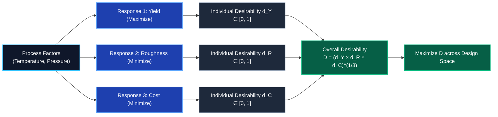

import Tabs from '@theme/Tabs';
import TabItem from '@theme/TabItem';
import Heading from '@theme/Heading';
import React from 'react';

# RSM: Multi-Response Optimization (MRO)

> **Topic -** In complex industrial systems, optimizing a single process response in isolation is often counter-productive. Improving throughput or chemical yield frequently degrades surface roughness, accelerates machine wear, or elevates operational costs. **Multi-Response Optimization (MRO)** uses the **Derringer-Suich Desirability Function** to simultaneously balance multiple competing outputs into a single composite metric.

---

## 1. The Multi-Response Dilemma

When analyzing a system with multiple dependent variables ($Y_1, Y_2, \dots, Y_m$):
*   **Single-Response RSM:** Maps inputs directly to a single scalar:
    $$(X_1, X_2) \longrightarrow Y$$
*   **Multi-Response RSM:** Simultaneously maps inputs to an array of competing criteria:
    $$(X_1, X_2) \longrightarrow \begin{cases} Y_1 \text{ (maximize yield)} \\ Y_2 \text{ (minimize roughness)} \\ Y_3 \text{ (target thickness)} \end{cases} \longrightarrow \text{Composite Desirability } D$$

---

## 2. The Desirability Function Approach

The desirability methodology converts each physical response $Y_i$ with different physical units (e.g., $\%$, $\mu\text{m}$, $\text{MPa}$) into a dimensionless scale bounded strictly between $0$ and $1$:
*   $d_i = 0 \implies$ Completely undesirable outcome (unacceptable defect).
*   $d_i = 1 \implies$ Fully desirable or ideal target performance.

---

### Linear Desirability Formulations

When linear transitions between acceptable boundaries are assumed:

#### 1. Larger-the-Better Response (e.g., Yield, Hardness)
Given lower threshold $Y_{\min}$ and upper ideal target $Y_{\max}$:

$$
d_Y = \frac{Y - Y_{\min}}{Y_{\max} - Y_{\min}}
$$

*   If $Y \le Y_{\min}$, then $d_Y = 0$.
*   If $Y \ge Y_{\max}$, then $d_Y = 1$.

#### 2. Smaller-the-Better Response (e.g., Roughness, Defects)
Given lower ideal target $R_{\min}$ and upper intolerable threshold $R_{\max}$:

$$
d_R = \frac{R_{\max} - R}{R_{\max} - R_{\min}}
$$

*   If $R \le R_{\min}$, then $d_R = 1$.
*   If $R \ge R_{\max}$, then $d_R = 0$.

---

### Non-Linear Exponential Formulations (Derringer-Suich)

When the rate of satisfaction changes non-linearly, shape parameters ($s$ and $t$) are introduced:

#### Maximization:
$$
d_i = \begin{cases} 
  0 & \text{if } \hat{y} \lt L \\ 
  \left(\frac{\hat{y} - L}{T - L}\right)^s & \text{if } L \le \hat{y} \le T \\ 
  1 & \text{if } \hat{y} \gt T 
\end{cases}
$$

#### Minimization:
$$
d_i = \begin{cases} 
  1 & \text{if } \hat{y} \lt T \\ 
  \left(\frac{U - \hat{y}}{U - T}\right)^t & \text{if } T \le \hat{y} \le U \\ 
  0 & \text{if } \hat{y} \gt U 
\end{cases}
$$

---

## 3. The Overall Composite Desirability ($D$)

To evaluate the overall system performance across all $k$ responses, the individual desirability scores are combined using the **geometric mean**:

$$
\boxed{D = \left( d_1 \times d_2 \times \dots \times d_k \right)^{\frac{1}{k}} = \left(\prod_{i=1}^k d_i\right)^{\frac{1}{k}}}
$$

Or, when responses carry different priority weights ($w_i$):

$$
D = \left( d_1^{w_1} \times d_2^{w_2} \times \dots \times d_k^{w_k} \right)^{\frac{1}{\sum w_i}}
$$

:::warning

**The Zero-Product Rule of Desirability**

The geometric mean possesses a strict mathematical safeguard:
$$d_j = 0 \implies D = 0$$
If **even a single response** violates specifications ($d_j = 0$), the overall composite desirability collapses to zero regardless of how exceptional the other responses are.

:::

---

## 4. Comprehensive Solved Example: Yield vs. Roughness Trade-Off

Consider an industrial process evaluated across four candidate factor setpoints:
*   **Yield ($Y$, in $\%$):** Larger-the-better ($Y_{\min} = 80\%, Y_{\max} = 100\%$).
*   **Surface Roughness ($R$, in $\mu\text{m}$):** Smaller-the-better ($R_{\min} = 2.0\,\mu\text{m}, R_{\max} = 4.0\,\mu\text{m}$).

### Measured Process Data

| Factor Setting | Observed Yield ($Y$) | Observed Roughness ($R$) |
| :--- | :--- | :--- |
| **Setting A** | $88\%$ | $3.2\,\mu\text{m}$ |
| **Setting B** | $92\%$ | $2.8\,\mu\text{m}$ |
| **Setting C** | $95\%$ | $3.5\,\mu\text{m}$ |
| **Setting D** | $90\%$ | $2.4\,\mu\text{m}$ |

*Analysis:* We cannot simply select Setting C for its highest yield ($95\%$) because its surface roughness ($3.5\,\mu\text{m}$) is substantially degraded.

---

### Step-by-Step Desirability Calculation for a Second Production Run

Suppose operating conditions are refined, yielding the following performance metrics across Settings A, B, C, and D:

| Setting | Yield ($Y$) | Yield Desirability ($d_Y$) | Roughness ($R$) | Roughness Desirability ($d_R$) | Overall Desirability ($D$) |
| :--- | :--- | :--- | :--- | :--- | :--- |
| **A** | $94$ | $\mathbf{0.70}$ | $2.7$ | $\mathbf{0.65}$ | $D_A = \sqrt{0.70 \times 0.65} \approx \mathbf{0.674}$ |
| **B** | $98$ | $\mathbf{0.90}$ | $2.3$ | $\mathbf{0.85}$ | $D_B = \sqrt{0.90 \times 0.85} \approx \mathbf{0.875}$ |
| **C** | $100$ | $\mathbf{1.00}$ | $3.0$ | $\mathbf{0.50}$ | $D_C = \sqrt{1.00 \times 0.50} \approx \mathbf{0.707}$ |
| **D** | $96$ | $\mathbf{0.80}$ | $2.1$ | $\mathbf{0.95}$ | $D_D = \sqrt{0.80 \times 0.95} \approx \mathbf{0.872}$ |

---

### Mathematical Verification for Setting B:

#### 1. Yield Desirability ($d_Y$):
$$
d_Y = \frac{98 - 80}{100 - 80} = \frac{18}{20} = \mathbf{0.90}
$$

#### 2. Roughness Desirability ($d_R$):
$$
d_R = \frac{4.0 - 2.3}{4.0 - 2.0} = \frac{1.7}{2.0} = \mathbf{0.85}
$$

#### 3. Overall Desirability ($D$):
$$
D = \sqrt{d_Y \times d_R} = \sqrt{0.90 \times 0.85} = \sqrt{0.765} \approx \mathbf{0.875}
$$

---

### Engineering Decision Analysis

*   **Setting C:** Achieves the maximum yield ($100\%, d_Y = 1.00$), but poor surface finish ($d_R = 0.50$) lowers its overall score to $D = 0.707$.
*   **Setting D:** Achieves extraordinary surface finish ($2.1\,\mu\text{m}, d_R = 0.95$), but slightly lower yield gives $D = 0.872$.
*   **Setting B (The Global Optimum):** Yields $98\%$ with a clean $2.3\,\mu\text{m}$ roughness, producing the **highest overall desirability ($D = 0.875$)**.

**Final Recommendation:** Select **Setting B** because it delivers the optimal compromise between productivity and surface quality.

---

## 5. Exam Traps & Operational Nuances

<Tabs>
  <TabItem value="t1" label="1. The Arithmetic Average Error" default>
     
    
    *   **The Trap:** Averaging desirability scores with an arithmetic mean: $\bar{d} = \frac{d_1 + d_2}{2}$.
    *   **The Consequence:** If $d_1 = 1.0$ (perfect yield) and $d_2 = 0.0$ (totally defective roughness), the arithmetic average is $0.50$ (acceptable!). In reality, the product is defective scrap. The geometric mean correctly yields $D = \sqrt{1.0 \times 0.0} = 0.00$.
  </TabItem>
  <TabItem value="t2" label="2. Misinterpreting Unconstrained Optima">
     
    
    *   **The Trap:** Optimizing each response's regression polynomial separately and attempting to superimpose the optimum setpoints.
    *   **The Reality:** The individual optimum of Response 1 rarely coincides with Response 2. Multi-response optimization must be conducted simultaneously on the composite objective function $D(\mathbf{x})$ over the shared factor space.
  </TabItem>
</Tabs>

---

## 6. Summary & Cheatsheet

  

    

      

        <h3>Desirability Formulas</h3>
      

      

        <ul>
          <li><b>Larger-the-Better:</b> $d = \frac{Y - Y_{\min}}{Y_{\max} - Y_{\min}}$.</li>
          <li><b>Smaller-the-Better:</b> $d = \frac{R_{\max} - R}{R_{\max} - R_{\min}}$.</li>
          <li><b>Range:</b> $0 \le d \le 1$.</li>
        </ul>
      

    

  

  

    

      

        <h3>Composite Desirability</h3>
      

      

        <ul>
          <li><b>Geometric Mean:</b> $D = (\prod d_i)^{1/k}$.</li>
          <li><b>Zero-Product Safeguard:</b> Any $d_i = 0 \implies D = 0$.</li>
          <li><b>Goal:</b> Maximize $D$ across the joint factor space.</li>
        </ul>
      

    

  

 

:::info

**Key Takeaways**

*   **Simultaneous Trade-Off:** Multi-Response Optimization systematically resolves competing operational criteria that single-response RSM cannot handle.
*   **Scale Invariance:** Converting physical outputs to dimensionless desirability values ($0$ to $1$) allows apples-to-oranges aggregation of yields, tolerances, and costs.
*   **Zero Defect Guarantee:** The geometric mean prevents any individual critical parameter violation from being hidden by superior performance elsewhere.

:::

**Next Section:** [Global Optimization & Metaheuristics Taxonomy](./07-global-optimization-and-taxonomy.mdx) - Components of formal optimization problems, local vs. global extrema, and the master 5-branch taxonomy of derivative-free metaheuristics.
