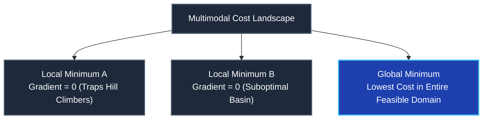
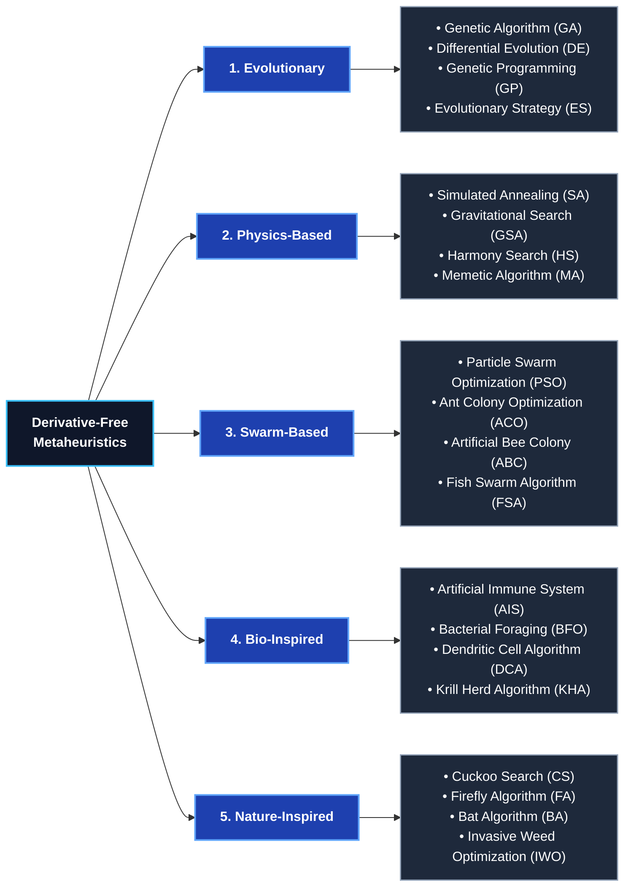

import Tabs from '@theme/Tabs';
import TabItem from '@theme/TabItem';
import Heading from '@theme/Heading';
import React from 'react';

# Global Optimization & Metaheuristics Taxonomy

> **Topic -** Optimization is the mathematical formulation of finding decision variable setpoints that minimize or maximize an objective function while satisfying real-world constraints. In complex multimodal landscapes where analytical gradient-based methods get trapped in local extrema, derivative-free metaheuristics systematically balance stochastic exploration (diversification) and localized exploitation (intensification) to discover global optima.

---

## 1. The 5 Core Components of an Optimization Problem

Every formal optimization problem is defined by five structural components:

| Component | Formal Meaning | Engineering / Industrial Realization |
| :--- | :--- | :--- |
| **1. Decision Variables** | Unknown parameters whose values can be altered and controlled. | Operating temperature ($X_1$), chamber pressure ($X_2$), cutting speed ($V$). |
| **2. Objective Function** | The mathematical function that defines what we want to maximize or minimize. | Maximize chemical yield ($Y$), minimize total production cost ($C$), minimize surface roughness ($R$). |
| **3. Constraints** | Operational conditions, physical limits, or regulatory bounds that must be satisfied. | Temperature $\le 150^\circ\text{C}$, non-negative processing time ($t \ge 0$), stress $\le \sigma_{\text{yield}}$. |
| **4. Parameters** | Fixed constants or ambient properties given in the problem context. | Raw material unit cost, thermal conductivity, total electrical grid capacity. |
| **5. Optimization Algorithm/Method** | The computational procedure used to discover the best variable values. | Response Surface Methodology (RSM), Genetic Algorithm (GA), Particle Swarm Optimization (PSO). |

---

## 2. Local Optima vs. Global Optima

A fundamental challenge in modern computational optimization is navigating complex, multimodal response landscapes:

*   **Local Optimum ($\mathbf{x}^*$):** A point where the objective value is better than or equal to all neighboring points within an immediate radius $\delta$:

$$
f(\mathbf{x}^*) \le f(\mathbf{x}) \quad \forall \mathbf{x} \text{ such that } \|\mathbf{x} - \mathbf{x}^*\| \lt \delta
$$

*   **Global Optimum ($\mathbf{x}^{**}$):** A point where the objective value is strictly superior or equal to all feasible points across the entire problem domain $\Omega$:

$$
f(\mathbf{x}^{**}) \le f(\mathbf{x}) \quad \forall \mathbf{x} \in \Omega
$$

:::warning

**The Gradient Entrapment Trap**

Traditional gradient-based solvers (such as Newton-Raphson or Gradient Descent) rely on local derivative vectors ($\nabla f$). On complex surfaces with multiple hills, valleys, and saddle points, they terminate immediately upon finding any stationary point ($\nabla f = 0$), permanently trapped in a suboptimal local basin.

:::

---

## 3. Heuristic vs. Metaheuristic Foundations

*   **Heuristic (from Greek *heuriskein* - "to discover"):** A problem-specific rule of thumb or trial-and-error procedure designed to find an acceptable solution quickly. Heuristics are usually greedy and easily trapped in local extrema.
*   **Metaheuristic ("Beyond Heuristic"):** A higher-level master search strategy used to find good or near-optimal solutions.
    *   It acts as a **master strategy** that guides, coordinates, and modifies subordinate search methods.
    *   It helps search **beyond solutions** that are normally generated by simple local search.
    *   It is indispensable for complex, non-differentiable, or discontinuous optimization problems where exact mathematical solutions are intractable.
    *   *Core Examples:* Genetic Algorithms (GA), Particle Swarm Optimization (PSO), Simulated Annealing (SA), Ant Colony Optimization (ACO), Differential Evolution (DE).

---

### The Fundamental Duality: Exploration vs. Exploitation
All metaheuristic algorithms operate through a dynamic balance between two competing mechanisms:

$$\text{\bf Metaheuristic Balance} = \text{\bf Randomization (Exploration)} + \text{\bf Local Search (Exploitation)}$$

<Tabs>
  <TabItem value="explore" label="1. Exploration (Diversification)" default>
     
    
    *   **Operational Role:** Investigates completely unvisited regions of the search space.
    *   **Mechanism:** Large stochastic jumps, random mutations, and high-temperature state transitions.
    *   **Objective:** Prevents premature entrapment in suboptimal local attractors.
    *   **Risk:** Excessive exploration degenerates into an inefficient random walk.
  </TabItem>
  <TabItem value="exploit" label="2. Exploitation (Intensification)">
     
    
    *   **Operational Role:** Concentrates search efforts locally around the best solutions discovered so far.
    *   **Mechanism:** Local gradient steps, cognitive pulls toward personal bests, and fine mutation.
    *   **Objective:** Refines solutions to achieve high numerical precision at the peak.
    *   **Risk:** Excessive exploitation causes premature convergence to a local optimum.
  </TabItem>
</Tabs>

---

## 4. The Master Taxonomy of Metaheuristic Algorithms

Metaheuristic algorithms are classified into five major paradigms based on their natural, biological, or physical inspiration:

---

## 5. Comparative Evaluation of Paradigms

| Paradigm | Governing Natural Principle | Core Representative | Exploration Mechanism | Exploitation Mechanism |
| :--- | :--- | :--- | :--- | :--- |
| **Evolutionary** | Darwinian natural selection and genetics ("Survival of the Fittest"). | Genetic Algorithm (GA) | Random bit mutation and uniform crossover. | Fitness-proportionate parent selection and elitist survival. |
| **Physics-Based** | Physical thermodynamic laws, gravity, or acoustic resonance. | Simulated Annealing (SA) | High-temperature Metropolis transitions accepting uphill moves. | Controlled temperature reduction cooling schedule. |
| **Swarm-Based** | Collective intelligence and decentralized flocking/foraging behavior. | Particle Swarm Optimization (PSO) | Inertia weight ($w$) propelling particles into new coordinates. | Acceleration pulls toward personal best ($\mathbf{pbest}$) and global best ($\mathbf{gbest}$). |
| **Bio-Inspired** | Cellular biology, immune system defense, and bacterial motility. | Artificial Immune System (AIS) | Hypermutation of receptor paratopes. | Clonal selection of high-affinity antibodies. |
| **Nature-Inspired** | Animal echolocation, bioluminescent signaling, parasitic breeding. | Cuckoo Search / Firefly | Heavy-tailed Lévy flight step jumps. | Attraction to brighter fireflies / best host nests. |

---

## 6. Exam Traps & Operational Nuances

<Tabs>
  <TabItem value="t1" label="1. The Local Search Assumption" default>
     
    
    *   **The Trap:** Assuming that setting derivative $\nabla f(\mathbf{x}) = 0$ guarantees finding the best global solution.
    *   **The Reality:** On complex non-convex surfaces, $\nabla f = 0$ identifies only stationary points (which may be sub-optimal local peaks or saddle points). Derivative-free metaheuristics are required to break out of local catchment basins.
  </TabItem>
  <TabItem value="t2" label="2. Premature Convergence vs. Pure Random Walk">
     
    
    *   **The Trap:** Tuning an algorithm with either zero exploration or zero exploitation.
    *   **The Reality:** If exploration is too low, the population rapidly converges prematurely to a poor local optimum. If exploration is too high, the algorithm degrades into an aimless random walk, failing to refine solutions near high-fitness zones.
  </TabItem>
</Tabs>

---

## 7. Summary & Cheatsheet

  

    

      

        <h3>5 Optimization Components</h3>
      

      

        <ul>
          <li><b>Decision Variables:</b> Adjustable inputs ($X_i$).</li>
          <li><b>Objective:</b> Goal to minimize or maximize ($f$).</li>
          <li><b>Constraints:</b> Boundary limits ($g_i \le 0, h_j = 0$).</li>
          <li><b>Parameters:</b> Fixed problem constants.</li>
          <li><b>Algorithm:</b> Solver method (RSM, GA, PSO).</li>
        </ul>
      

    

  

  

    

      

        <h3>Taxonomy Branches</h3>
      

      

        <ul>
          <li><b>Evolutionary:</b> GA, DE, GP, ES (genetics).</li>
          <li><b>Physics:</b> SA, GSA, HS, MA (thermodynamics/gravity).</li>
          <li><b>Swarm:</b> PSO, ACO, ABC, FSA (flocking/foraging).</li>
          <li><b>Bio & Nature:</b> AIS, BFO, CS, FA (immune/parasitism).</li>
        </ul>
      

    

  

 

:::info

**Key Takeaways**

*   **Multimodal Robustness:** Metaheuristics excel where objective functions are discontinuous, non-differentiable, noisy, or contain thousands of deceptive local optima.
*   **Balancing Trade-offs:** The performance of all metaheuristics hinges on the balance between stochastic diversification (global exploration) and localized intensification (exploitation).
*   **Taxonomic Organization:** Algorithms are systematically classified into Evolutionary, Physics-based, Swarm-based, Bio-inspired, and Nature-inspired branches based on their underlying generative metaphor.

:::

**Next Section:** [Genetic Algorithms (GA)](./08-genetic-algorithms.mdx) - Deep dive into chromosomes, Darwinian selection, crossover, mutation, elitism, and a step-by-step solved binary optimization example.
