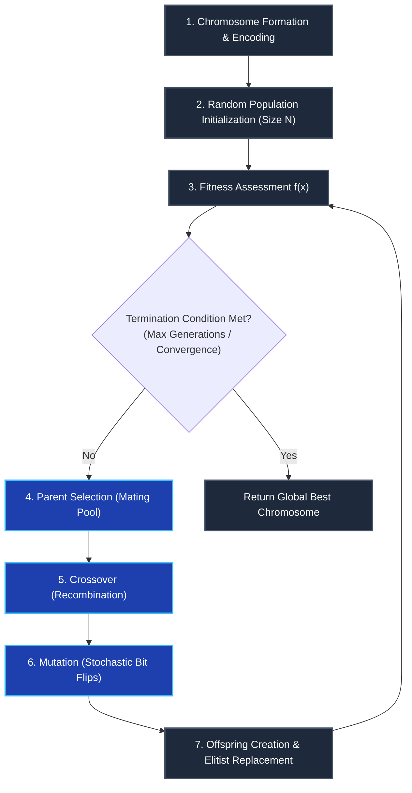

import Tabs from '@theme/Tabs';
import TabItem from '@theme/TabItem';
import Heading from '@theme/Heading';
import React from 'react';

# Genetic Algorithms (GA)

> **Topic -** The Genetic Algorithm (GA) is an adaptive heuristic search algorithm modeled on Darwinian natural selection and genetics. By treating candidate solutions as chromosomes and evolving a population through selection, crossover, and mutation, GAs intelligently exploit random search within complex, multi-dimensional search spaces to solve discontinuous, non-linear optimization problems.

---

## 1. Foundational Principles & Biological Analogy

Originating from the work of John Holland (1975), Genetic Algorithms simulate the fundamental processes that govern biological evolution:

*   **Natural Selection:** Embodies Darwin's principle of **"Survival of the Fittest"** - individuals with higher fitness have a greater probability of reproducing and transmitting their genetic material to future generations.
*   **Chromosomes & Genes:** Each candidate solution vector is represented as a **chromosome**, where individual decision variables or bits constitute the **genes**.
*   **Population:** A collection of $N$ candidate chromosomes evaluated concurrently.
*   **Fitness Function ($f(\mathbf{x})$):** The quantitative objective metric that scores how effectively each candidate solution satisfies the problem goal.
*   **Stochastic Balance:** GAs combine **random search + Darwinian selection** to thoroughly explore the landscape while progressively concentrating search power in promising high-fitness regions.

---

## 2. The 7 Methodological Stages of Genetic Algorithms

Execution of a Genetic Algorithm follows seven structured stages:

### Stage 1: Chromosome Formation
Represent each possible problem solution as an encoded data structure (chromosome):
*   *Binary Encoding:* Strings of bits ($0$ and $1$), ideal for discrete or bounded integer problems.
*   *Real-Valued (Continuous) Encoding:* Vectors of floating-point numbers ($\mathbf{x} \in \mathbb{R}^d$), preferred for physical engineering parameter optimization.

### Stage 2: Random Population Creation
Generate an initial population of $N$ candidate chromosomes using uniform random distribution across the feasible search space to ensure maximum initial diversity.

### Stage 3: Fitness Assessment
Evaluate each individual chromosome using the problem's mathematical fitness function ($f(\mathbf{x})$). Solutions that better satisfy constraints and objectives are assigned higher numerical fitness values.

### Stage 4: Selection / Mating Pool
Select superior individuals from the current population to serve as parents for reproduction:
*   **Roulette Wheel Selection:** Probability of selection is proportional to individual fitness:
    $$P_i = \frac{f_i}{\sum_{j=1}^N f_j}$$
*   **Tournament Selection:** Subsets of $k$ individuals are picked at random; the fittest individual in each tournament is selected.
*   **Mean Partitioning:** Calculate the population's average fitness ($\bar{f}$). Divide the population into group $p_1$ (fitness $\gt \bar{f}$, high performers) and group $p_2$ (fitness $\lt \bar{f}$, preserving diversity). Pairs are chosen across groups to balance quality and diversity.

### Stage 5: Crossover (Recombination)
Combine sub-sequences of two parent chromosomes to produce offspring with shared traits:
*   *Single-Point Crossover:* A single cut point is randomly chosen; segments to the right of the cut are swapped between parents.
*   *Double-Point Crossover:* Two cut points are selected; the middle genetic segment is swapped.
*   *Uniform Crossover:* Each gene in the child is chosen randomly from either parent according to a fixed probability (e.g., $0.5$).

### Stage 6: Mutation
Introduce small random changes into offspring chromosomes with a low probability ($p_m \approx 0.001\text{--}0.05$):
*   In binary chromosomes, mutation flips a bit ($0 \to 1$ or $1 \to 0$).
*   *Purpose:* Reintroduces lost genetic alleles and prevents the population from prematurely converging to a suboptimal local peak.

### Stage 7: New Offspring Creation & Generational Replacement
Form the next generation by combining newly generated children with selected elite individuals from the previous generation:
*   **Elitism:** Automatically copies the top 1 or 2 highest-fitness chromosomes directly into the new generation without alteration, guaranteeing that the best solution found never deteriorates over time.
*   **Repetition:** The process repeats through Stages 3 to 7 until convergence or reaching the maximum generation limit.

---

## 3. Step-by-Step Solved Problem: Maximizing $f(x) = x^2$

> **Benchmark Optimization Task:** Maximize the function $f(x) = x^2$ over the integer domain $0 \le x \le 31$.
> *   **Encoding:** 5-bit binary strings (since $2^5 = 32$, covering integers $0$ to $31$).
> *   **Population Size:** $N = 4$ candidate solutions.

---

### Step 1: Population Initialization
Initialize 4 random binary chromosomes:
*   Chromosome 1 ($C_1$): $10110_2$
*   Chromosome 2 ($C_2$): $00101_2$
*   Chromosome 3 ($C_3$): $11100_2$
*   Chromosome 4 ($C_4$): $01011_2$

---

### Step 2: Binary to Decimal Decoding
Convert each binary string into its corresponding integer decimal value:
*   $C_1 = 10110_2 = (1 \times 16) + (0 \times 8) + (1 \times 4) + (1 \times 2) + (0 \times 1) = 16 + 4 + 2 = \mathbf{22}$
*   $C_2 = 00101_2 = (0 \times 16) + (0 \times 8) + (1 \times 4) + (0 \times 2) + (1 \times 1) = 4 + 1 = \mathbf{5}$
*   $C_3 = 11100_2 = (1 \times 16) + (1 \times 8) + (1 \times 4) + (0 \times 2) + (0 \times 1) = 16 + 8 + 4 = \mathbf{28}$
*   $C_4 = 01011_2 = (0 \times 16) + (1 \times 8) + (0 \times 4) + (1 \times 2) + (1 \times 1) = 8 + 2 + 1 = \mathbf{11}$

The initial population in decimal is $\{22, 5, 28, 11\}$.

---

### Step 3: Fitness Function Evaluation ($f(x) = x^2$)
Calculate the fitness of each decoded individual:
*   $f(22) = 22^2 = \mathbf{484}$
*   $f(5) = 5^2 = \mathbf{25}$
*   $f(28) = 28^2 = \mathbf{784}$
*   $f(11) = 11^2 = \mathbf{121}$

**Initial Generation Average Fitness ($\bar{f}_0$):**
$$
\bar{f}_0 = \frac{484 + 25 + 784 + 121}{4} = \frac{1414}{4} = \mathbf{353.5}
$$

---

### Step 4: Parent Selection
Select the two chromosomes with the highest fitness values:
*   **Parent 1:** $C_3 = 11100$ ($x = 28$, Fitness = $784$)
*   **Parent 2:** $C_1 = 10110$ ($x = 22$, Fitness = $484$)

---

### Step 5: Crossover (Single-Point Cut after Bit 2)
Divide each parent chromosome after the second bit:
*   $\text{Parent 1: } [11 \mid 100]$
*   $\text{Parent 2: } [10 \mid 110]$

Swap the tail segments to produce two new offspring:
*   $\text{Child 1: } [11 \mid 110] \implies 11110_2 = 16 + 8 + 4 + 2 + 0 = \mathbf{30} \implies f(30) = 30^2 = \mathbf{900}$
*   $\text{Child 2: } [10 \mid 100] \implies 10100_2 = 16 + 0 + 4 + 0 + 0 = \mathbf{20} \implies f(20) = 20^2 = \mathbf{400}$

---

### Step 6: Mutation (Bit Flip)
Apply a random mutation to Child 2 by flipping its 5th (last) bit from $0$ to $1$:
$$
\text{Child 2} = 10100 \xrightarrow{\text{flip bit 5}} 10101_2 = 16 + 4 + 1 = \mathbf{21}
$$

$$
\text{Mutated Child 2 Fitness: } f(21) = 21^2 = \mathbf{441}
$$

---

### Step 7: New Generation Assembly (with Elitism)
To maintain search progress without losing peak solutions, combine the two offspring with the two elite performers from Generation 0:
1.  **Child 1:** $11110_2 \implies x = 30, f = \mathbf{900}$ *(New best solution discovered!)*
2.  **Child 2 (Mutated):** $10101_2 \implies x = 21, f = \mathbf{441}$
3.  **Elite Old Best:** $11100_2 \implies x = 28, f = \mathbf{784}$
4.  **Elite Old Second Best:** $10110_2 \implies x = 22, f = \mathbf{484}$

#### New Generation Average Fitness ($\bar{f}_1$):
$$
\bar{f}_1 = \frac{900 + 441 + 784 + 484}{4} = \frac{2609}{4} = \mathbf{652.25}
$$

**Evolutionary Improvement:**
$$
\text{Percentage Increase} = \frac{652.25 - 353.5}{353.5} \times 100\% \approx \mathbf{+84.5\%}
$$

In a single generation, the average population fitness increased by **$84.5\%$**, and the algorithm discovered an individual ($x = 30$) achieving $900$, which is $93.7\%$ of the theoretical global maximum ($31^2 = 961$).

---

## 4. Exam Traps & Operational Nuances

<Tabs>
  <TabItem value="t1" label="1. The Zero-Mutation Trap" default>
     
    
    *   **The Trap:** Setting mutation rate to zero ($p_m = 0$) to avoid disrupting high-fitness parents.
    *   **The Consequence:** If an allele (e.g., bit $1$ at position 1) is missing from all individuals in the initial population, crossover can **never** introduce a $1$ at that index. The search space is permanently truncated, leading to premature convergence in a sub-optimal hypercube.
    *   **The Correction:** Always sustain a small background mutation rate ($0.001 \le p_m \le 0.05$).
  </TabItem>
  <TabItem value="t2" label="2. Excessive Selection Pressure">
     
    
    *   **The Trap:** Selecting only the single top-ranking individual for all crossover pairings.
    *   **The Consequence:** The entire population becomes genetically identical within 2-3 generations, destroying population diversity and ending exploration.
    *   **The Correction:** Use stochastic selection (roulette wheel or tournament) so sub-average individuals with rare, useful alleles retain a non-zero probability of reproduction.
  </TabItem>
</Tabs>

---

## 5. Summary & Cheatsheet

  

    

      

        <h3>Core Genetic Operators</h3>
      

      

        <ul>
          <li><b>Selection:</b> Biased toward higher fitness $f(\mathbf{x})$.</li>
          <li><b>Crossover:</b> Swaps genetic blocks between parents.</li>
          <li><b>Mutation:</b> Random bit flips prevent allele extinction.</li>
          <li><b>Elitism:</b> Automatically preserves top performers.</li>
        </ul>
      

    

  

  

    

      

        <h3>7 Execution Stages</h3>
      

      

        <ul>
          <li><b>1-3:</b> Chromosome encode, init population, score fitness.</li>
          <li><b>4-6:</b> Parent selection, crossover, bit mutation.</li>
          <li><b>7:</b> Generational replacement & elitist survival.</li>
        </ul>
      

    

  

 

:::info

**Key Takeaways**

*   **Intelligent Exploitation:** Genetic algorithms do not conduct blind random search; they intelligently propagate winning building blocks of genetic material (schemata) across generations.
*   **Diversity Preservation:** Balancing crossover recombination with stochastic bit-flip mutation sustains population variance, preventing premature stagnation.
*   **Monotonic Convergence:** Implementing elitism ensures the highest fitness discovered across all iterations never deteriorates as the population evolves.

:::

**Next Section:** [Physics & Swarm-Based Optimization (SA & PSO)](./09-physics-and-swarm-algorithms.mdx) - Deep dive into Simulated Annealing thermodynamics, Metropolis acceptance criteria, and Particle Swarm velocity dynamics.
