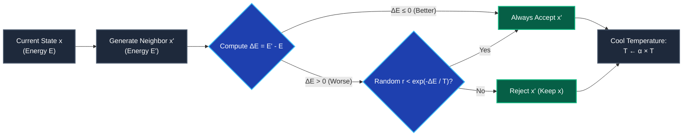

import Tabs from '@theme/Tabs';
import TabItem from '@theme/TabItem';
import Heading from '@theme/Heading';
import React from 'react';

# Physics & Swarm Algorithms: SA & PSO

> **Topic -** When optimizing high-dimensional, non-differentiable engineering systems, physics-based and swarm-based algorithms provide powerful alternatives to evolutionary methods. **Simulated Annealing (SA)** exploits thermodynamic annealing principles to escape local minima via probabilistic uphill transitions, while **Particle Swarm Optimization (PSO)** coordinates decentralized swarm intelligence through inertia, personal memory, and social collaboration.

---

## 1. Algorithmic Comparison: SA vs. PSO

| Dimension | Simulated Annealing (SA) | Particle Swarm Optimization (PSO) |
| :--- | :--- | :--- |
| **Foundational Metaphor** | Statistical thermodynamics and crystal annealing | Collective flocking behavior of birds and fish |
| **Search Paradigm** | Single-point trajectory (state-to-state walk) | Population-based (swarm of flying particles) |
| **Governing Equation** | Metropolis probability: $P = \exp(-\Delta E / T)$ | Velocity vector update: $\mathbf{V}_i^{t+1} = w\mathbf{V}_i^t + c_1 r_1 \Delta \mathbf{pbest} + c_2 r_2 \Delta \mathbf{gbest}$ |
| **Memory Tracking** | Current best state ($\mathbf{x}_{\text{best}}$) | Dual memory: individual ($\mathbf{pbest}_i$) and swarm ($\mathbf{gbest}$) |
| **Exploration Control** | System temperature ($T$), cooled via schedule $T \leftarrow \alpha T$ | Inertia weight ($w$), dynamically decayed over time |
| **Primary Domain** | Combinatorial and discrete scheduling problems | Continuous multi-dimensional parameter spaces |

---

## 2. Simulated Annealing (SA)

### Physical Metallurgy Analogy
Simulated Annealing simulates the thermodynamic process of heating a metal alloy above its melting point and cooling it gradually:
1.  **Heating Stage:** High thermal energy enhances particle mobility, freeing atoms from existing crystalline dislocations.
2.  **Isothermal Phase:** Particles collide and exchange thermal energy at constant temperature within an equilibrium boundary.
3.  **Cooling Stage:** Gradual thermal decay reduces atomic kinetic motion, freezing molecules into the lowest possible energy crystal lattice.

---

### The Metropolis Acceptance Criterion
In a cost minimization problem, let $\Delta E = f(\mathbf{x}_{\text{new}}) - f(\mathbf{x}_{\text{current}})$.
*   If $\Delta E \le 0$ (downhill move toward lower cost): **Always Accept** ($\mathbf{x}_{\text{current}} \leftarrow \mathbf{x}_{\text{new}}$).
*   If $\Delta E \gt 0$ (uphill move toward higher cost): Accept with **Metropolis Probability ($P$)**:

$$
\boxed{P = \exp\left(-\frac{\Delta E}{T}\right)}
$$

A uniform random number $r \sim \mathcal{U}(0, 1)$ is drawn. If $r \lt P$, the inferior solution is accepted.

---

### Temperature Trajectory & Cooling Schedules
*   **High Temperature ($T \to \infty$):** $P \approx 1$. The algorithm accepts virtually every uphill move, exploring the entire landscape and jumping freely out of deep local valleys.
*   **Low Temperature ($T \to 0$):** $P \to 0$. Uphill moves are rejected; the algorithm behaves as a greedy local gradient descent, refining the solution.
*   **Geometric Cooling Schedule:**
    $$T_{k+1} = \alpha T_k \quad (0.80 \le \alpha \le 0.99)$$

---

## 3. Particle Swarm Optimization (PSO)

### Biological Metaphor & Swarm Mechanics
Introduced by James Kennedy and Russell Eberhart (1995), PSO simulates the collective foraging intelligence of bird flocks. A swarm of $M$ particles navigates a continuous $D$-dimensional search space without centralized coordination.

Each particle $i$ tracks three coordinates:
1.  **Current Position ($\mathbf{X}_i^t$):** Coordinates in the problem domain.
2.  **Personal Best ($\mathbf{pbest}_i$):** The highest-fitness position achieved by particle $i$ across all iterations.
3.  **Global Best ($\mathbf{gbest}$):** The highest-fitness coordinate discovered across the entire swarm.

---

### The Governing Velocity and Position Equations

Every particle updates its velocity vector and shifts position at time step $t+1$ according to:

$$
\mathbf{V}_i^{t+1} = \underbrace{w \mathbf{V}_i^t}_{\text{Inertia Component}} + \underbrace{c_1 r_1 (\mathbf{pbest}_i - \mathbf{X}_i^t)}_{\text{Cognitive (Personal) Component}} + \underbrace{c_2 r_2 (\mathbf{gbest} - \mathbf{X}_i^t)}_{\text{Social (Swarm) Component}}
$$

$$
\mathbf{X}_i^{t+1} = \mathbf{X}_i^t + \mathbf{V}_i^{t+1}
$$

<Tabs>
  <TabItem value="inertia" label="1. Inertia Component (w)" default>
     
    
    *   **Mathematical Role:** $w \mathbf{V}_i^t$ preserves current flight momentum.
    *   **Search Function:** High inertia ($w \approx 0.9$) drives broad **exploration** of unknown space. Low inertia ($w \approx 0.4$) focuses on localized **exploitation**.
    *   **Standard Practice:** Linearly decrease $w$ over iterations from $0.9$ to $0.4$.
  </TabItem>
  <TabItem value="cognitive" label="2. Cognitive Component (c1)">
     
    
    *   **Mathematical Role:** $c_1 r_1 (\mathbf{pbest}_i - \mathbf{X}_i^t)$ pulls the particle toward its own historical best.
    *   **Search Function:** Represents individual memory and self-confidence.
    *   $r_1 \sim \mathcal{U}(0, 1)$ injects stochastic diversification.
  </TabItem>
  <TabItem value="social" label="3. Social Component (c2)">
     
    
    *   **Mathematical Role:** $c_2 r_2 (\mathbf{gbest} - \mathbf{X}_i^t)$ pulls the particle toward the swarm's collective consensus.
    *   **Search Function:** Facilitates global communication and flock convergence.
    *   $r_2 \sim \mathcal{U}(0, 1)$ prevents premature clustering.
  </TabItem>
</Tabs>

---

## 4. Exam Traps & Operational Nuances

<Tabs>
  <TabItem value="t1" label="1. Cooling Schedule Too Fast (Quenching)" default>
     
    
    *   **The Trap:** Reducing temperature too rapidly (e.g., $\alpha = 0.5$).
    *   **The Consequence:** Known in metallurgy as *quenching*. Thermal motion vanishes before molecules escape crystalline dislocations, causing the algorithm to freeze permanently in a local minimum.
    *   **The Correction:** Maintain gradual cooling ($0.85 \le \alpha \le 0.98$).
  </TabItem>
  <TabItem value="t2" label="2. PSO Velocity Explosion">
     
    
    *   **The Trap:** Leaving acceleration parameters unbounded without velocity clamping ($V_{\text{max}}$).
    *   **The Consequence:** When particles are far from $\mathbf{gbest}$, velocity terms compound exponentially, throwing particles outside the problem boundaries.
    *   **The Correction:** Always enforce velocity clamping: $-V_{\text{max}} \le V_i \le V_{\text{max}}$.
  </TabItem>
</Tabs>

---

## 5. Summary & Cheatsheet

  

    

      

        <h3>Simulated Annealing</h3>
      

      

        <ul>
          <li><b>Metropolis:</b> $P = \exp(-\Delta E / T)$.</li>
          <li><b>Cooling:</b> $T \leftarrow \alpha T$ ($0.8 \le \alpha \le 0.99$).</li>
          <li><b>Property:</b> High $T$ explores; low $T$ exploits.</li>
        </ul>
      

    

  

  

    

      

        <h3>Particle Swarm Optimization</h3>
      

      

        <ul>
          <li><b>Velocity:</b> $\mathbf{V}^{t+1} = w\mathbf{V}^t + c_1 r_1 \Delta \mathbf{pbest} + c_2 r_2 \Delta \mathbf{gbest}$.</li>
          <li><b>Position:</b> $\mathbf{X}^{t+1} = \mathbf{X}^t + \mathbf{V}^{t+1}$.</li>
          <li><b>Balance:</b> Inertia $w$ decays from $0.9$ to $0.4$.</li>
        </ul>
      

    

  

 

:::info

**Key Takeaways**

*   **Asymptotic Optimality:** Simulated Annealing guarantees asymptotic convergence to the global optimum provided the temperature decreases logarithmically or sufficiently slowly.
*   **Swarm Consensus:** Particle Swarm Optimization excels in continuous multi-dimensional search spaces by balancing individual memory ($\mathbf{pbest}$) against swarm consensus ($\mathbf{gbest}$).
*   **Hyperparameter Discipline:** Algorithm performance depends strictly on cooling parameters in SA and velocity clamping/inertia tuning in PSO.

:::

**Next Section:** Review the [Module 4 Exam Prep Checklist](../../Exam-Prep/Research-Methodology/Module4/01-module-4-checklist.mdx) and [Solved Practice Problems](../../Exam-Prep/Research-Methodology/Module4/02-practice-problems.mdx) for examination review and practice exercises.
