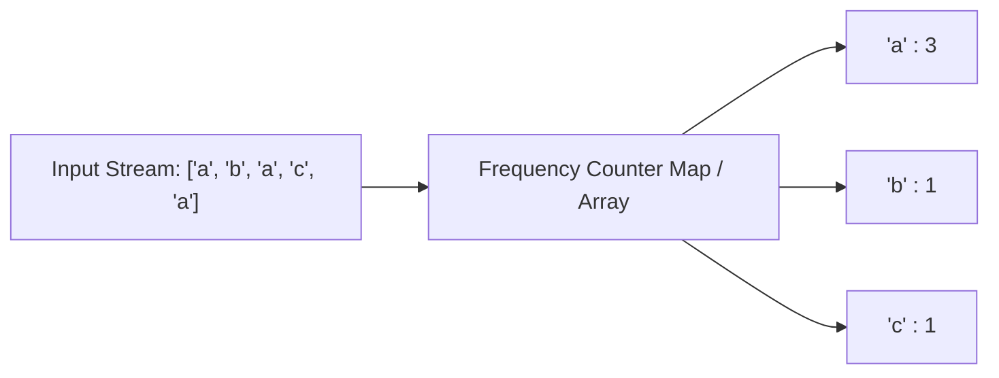

import Tabs from '@theme/Tabs';
import TabItem from '@theme/TabItem';

# Invariant 01: Frequency Counters & State Compression

A frequency counter records the number of times each unique item occurs in a dataset. By capturing item counts in a map or a fixed-size array, we decouple the order of elements from their cardinality.

---

## The Core Invariant

:::info

**The Mathematical Invariant**

Let a sequence $S = [s_1, s_2, \dots, s_n]$ be mapped to a frequency dictionary $F_S: \Sigma \to \mathbb{N}$, where $F_S(x) = |\{i : s_i = x\}|$.

For any two sequences $A$ and $B$, $A$ is an exact permutation (or anagram) of $B$ if and only if:
$$F_A(x) = F_B(x) \quad \forall x \in \Sigma$$

:::

### Why It Works
1. **Collapsing Order into State:** Sorting an array takes $O(N \log N)$ time to group identical items. A frequency counter achieves the same grouped tally in $O(N)$ time by writing directly to an $O(1)$ addressable map or direct-indexed array.
2. **Space Optimization via Alphabet Bound:** When the universe of keys $\Sigma$ is bounded (such as lowercase English letters, ASCII, or digits), the space complexity collapses from $O(N)$ dynamic map storage to $O(1)$ constant overhead via fixed-size lookup tables (e.g., `int[26]`).

---

## State & Transition Mechanics



---

## Progressive Examples

### Example 1: Valid Anagram ([LeetCode 242](https://leetcode.com/problems/valid-anagram/))
*Difficulty: Easy (Foundational)* · **[Practice on LeetCode](https://leetcode.com/problems/valid-anagram/)**

**Problem Statement:**
Given two strings `s` and `t`, return `true` if `t` is an anagram of `s`, and `false` otherwise. An anagram is a word or phrase formed by rearranging the letters of a different word or phrase, typically using all the original letters exactly once.

#### Examples
- **Example 1:**
  - **Input:** `s = "anagram"`, `t = "nagaram"`
  - **Output:** `true`
- **Example 2:**
  - **Input:** `s = "rat"`, `t = "car"`
  - **Output:** `false`

#### Constraints
- $1 \le \text{s.length, t.length} \le 5 \times 10^4$
- `s` and `t` consist of lowercase English letters.

#### Invariant Application
Maintain a single frequency array of size 26. Increment counts for characters in `s`, and decrement for characters in `t`. If all slots in the frequency array return to zero, the invariant $F_s(x) = F_t(x)$ holds.

#### Detailed Explanation
- **Intuition & Mental Model:** Two strings are anagrams if and only if they possess identical character counts across every unique letter. While sorting both strings achieves grouping in $O(N \log N)$ time, a frequency counter achieves the tally in linear $O(N)$ time. Because the character universe is restricted to lowercase English letters (`'a'` through `'z'`), an array of 26 integers provides constant-time $O(1)$ indexing with minimal cache overhead.
- **Step-by-Step Walkthrough:**
  1. **Dimension Check:** Compare `s.length()` and `t.length()`. If their lengths differ, they cannot be anagrams; exit early with `false`.
  2. **Allocate Fixed Counter:** Instantiate a 26-element integer array `counts` initialized to zero.
  3. **Simultaneous Balanced Scan:** Iterate through the strings from index $0$ to $N - 1$. For each index $i$:
     - Increment `counts[s.charAt(i) - 'a']`.
     - Decrement `counts[t.charAt(i) - 'a']`.
  4. **Evaluate Conservation Invariant:** Iterate through all 26 elements in `counts`. If any slot is non-zero, a character surplus or deficit exists; return `false`. If all 26 slots evaluate to zero, return `true`.
- **Edge Cases & Failure Modes:** Strings with unequal lengths (guarded at step 1), strings of length 1 (`s = "a"`, `t = "a"` $\to$ `true`), identical strings, and character mismatches where lengths match (`s = "ab"`, `t = "ac"` $\to$ `false`).

<Tabs>
<TabItem value="java" label="Java">

```java
public class Solution {
    public boolean isAnagram(String s, String t) {
        if (s.length() != t.length()) return false;
        
        int[] counts = new int[26];
        for (int i = 0; i < s.length(); i++) {
            counts[s.charAt(i) - 'a']++;
            counts[t.charAt(i) - 'a']--;
        }
        
        for (int count : counts) {
            if (count != 0) return false;
        }
        return true;
    }
}
```

</TabItem>
<TabItem value="ts" label="TypeScript">

```typescript
function isAnagram(s: string, t: string): boolean {
    if (s.length !== t.length) return false;
    
    const counts = new Array(26).fill(0);
    const aCode = 'a'.charCodeAt(0);
    
    for (let i = 0; i < s.length; i++) {
        counts[s.charCodeAt(i) - aCode]++;
        counts[t.charCodeAt(i) - aCode]--;
    }
    
    return counts.every(c => c === 0);
}
```

</TabItem>
<TabItem value="python" label="Python">

```python
class Solution:
    def isAnagram(self, s: str, t: str) -> bool:
        if len(s) != len(t):
            return False
            
        counts = [0] * 26
        for char_s, char_t in zip(s, t):
            counts[ord(char_s) - ord('a')] += 1
            counts[ord(char_t) - ord('a')] -= 1
            
        return all(c == 0 for c in counts)
```

</TabItem>
</Tabs>

- **Time Complexity:** $O(N)$ single pass over the strings of length $N$.
- **Space Complexity:** $O(1)$ auxiliary memory, bounded strictly to 26 integer slots.

#### Follow-up

<details>
<summary><b>Follow-up Question:</b> What if the inputs contain Unicode characters? How would you adapt your solution, and what are the architectural edge cases?</summary>
<div>
<br/>

**Technical Rationale & Solution:**
1. **Character Set Explosion:** Unicode contains over 1,114,000 code points. A fixed-size array (`int[26]`) would result in an array out-of-bounds error or require a massive, sparse array. We must substitute the fixed array with a dynamic hash map (`Map<Integer, Integer>`) keyed by Unicode code points.
2. **Surrogate Pairs:** In Java and JavaScript, strings are UTF-16 encoded. Characters outside the Basic Multilingual Plane (BMP, such as emojis or historical scripts) consume two 16-bit code units (surrogate pairs). Calling `.charAt(i)` or indexing `s[i]` inspects raw code units rather than complete Unicode code points. In Java, use `s.codePoints()`; in Python 3, strings natively iterate over complete Unicode codepoints.
3. **Canonical Equivalence & Combining Characters:** Characters like `é` can be represented as a single precomposed code point (`U+00E9`) or as a decomposed letter + combining acute accent (`U+0065 U+0301`). Even though visually identical, their raw code point frequencies differ. A production system must normalize both strings using Unicode Normalization Form C (`NFC`) via standard libraries before performing frequency comparison.

</div>
</details>

---

### Example 2: Group Anagrams ([LeetCode 49](https://leetcode.com/problems/group-anagrams/))
*Difficulty: Medium (Canonical State Hashing)* · **[Practice on LeetCode](https://leetcode.com/problems/group-anagrams/)**

**Problem Statement:**
Given an array of strings `strs`, group the anagrams together. You can return the answer in any order.

#### Examples
- **Example 1:**
  - **Input:** `strs = ["eat","tea","tan","ate","nat","bat"]`
  - **Output:** `[["bat"],["nat","tan"],["ate","eat","tea"]]`
- **Example 2:**
  - **Input:** `strs = [""]`
  - **Output:** `[[""]]`
- **Example 3:**
  - **Input:** `strs = ["a"]`
  - **Output:** `[["a"]]`

#### Constraints
- $1 \le \text{strs.length} \le 10^4$
- $0 \le \text{strs}[i]\text{.length} \le 100$
- `strs[i]` consists of lowercase English letters.

#### Invariant Application
Each anagram group has identical character frequencies. We compute the frequency tuple of length 26 for each string, convert that invariant state into a serialized hash key (e.g., `#1#0#2...`), and map it to a list of matching words.

#### Detailed Explanation
- **Intuition & Mental Model:** Every word in an anagram group shares an identical canonical signature. Sorting each word individually costs $O(K \log K)$ per string (where $K$ is maximum word length), leading to an aggregate cost of $O(N \cdot K \log K)$. By directly tallying the 26 character frequencies in $O(K)$ time and using that frequency signature as a hash key, we reduce total execution time to $O(N \cdot K)$.
- **Step-by-Step Walkthrough:**
  1. **Initialize State Map:** Create a hash table mapping canonical serialized keys to lists of strings (`Map<String, List<String>>`).
  2. **Compute 26-Bin Signature:** For each string `s` in the input array `strs`, instantiate an integer array `count` of size 26. Iterate over each character `c` in `s` and increment `count[c - 'a']`.
  3. **Serialize the Frequency Key:** Convert the 26 counts into a unique, unambiguous string key. In Python, `tuple(count)` is natively hashable. In Java and TypeScript, serialize with an explicit delimiter (e.g., `#1#0#0...`).
  4. **Bucket Insertion:** Insert the original string `s` into the bucket corresponding to its serialized key: `map.computeIfAbsent(key, k -> new ArrayList<>()).add(s)`.
  5. **Construct Output:** Return all grouped list values from the hash table as `new ArrayList<>(map.values())`.
- **Why the Delimiter is Architecturally Essential:** Without an explicit delimiter like `#`, counts for different bins bleed into each other. For example, a word with 1 'a' and 11 'b's would produce digits `1110...`, which is identical to the digits produced by a word with 11 'a's and 1 'b' (`1110...`), creating catastrophic false collisions. The delimiter `#1#11#0...` vs `#11#1#0...` strictly separates dimension boundaries.

<Tabs>
<TabItem value="java" label="Java">

```java
import java.util.*;

public class Solution {
    public List<List<String>> groupAnagrams(String[] strs) {
        Map<String, List<String>> map = new HashMap<>();
        
        for (String s : strs) {
            int[] count = new int[26];
            for (char c : s.toCharArray()) {
                count[c - 'a']++;
            }
            
            // Format state key: #1#0#2...
            StringBuilder sb = new StringBuilder();
            for (int i = 0; i < 26; i++) {
                sb.append('#').append(count[i]);
            }
            String key = sb.toString();
            
            map.computeIfAbsent(key, k -> new ArrayList<>()).add(s);
        }
        
        return new ArrayList<>(map.values());
    }
}
```

</TabItem>
<TabItem value="ts" label="TypeScript">

```typescript
function groupAnagrams(strs: string[]): string[][] {
    const map = new Map<string, string[]>();
    const aCode = 'a'.charCodeAt(0);
    
    for (const s of strs) {
        const count = new Array(26).fill(0);
        for (let i = 0; i < s.length; i++) {
            count[s.charCodeAt(i) - aCode]++;
        }
        
        const key = count.join('#');
        if (!map.has(key)) {
            map.set(key, []);
        }
        map.get(key)!.push(s);
    }
    
    return Array.from(map.values());
}
```

</TabItem>
<TabItem value="python" label="Python">

```python
from collections import defaultdict
from typing import List

class Solution:
    def groupAnagrams(self, strs: List[str]) -> List[List[str]]:
        groups = defaultdict(list)
        
        for s in strs:
            count = [0] * 26
            for char in s:
                count[ord(char) - ord('a')] += 1
            # Use tuple of counts as hashable key
            groups[tuple(count)].append(s)
            
        return list(groups.values())
```

</TabItem>
</Tabs>

- **Time Complexity:** $O(N \cdot K)$ where $N$ is the number of strings and $K$ is the maximum length of a string.
- **Space Complexity:** $O(N \cdot K)$ auxiliary space to store the hash map keys and grouped strings.

#### Follow-up

<details>
<summary><b>Follow-up Question:</b> Sorting each word costs $O(K \log K)$ per string, while our frequency key reduces it to $O(K)$. However, what if you are building an anagram search service processing an offline corpus of 1 billion words ($10^9$) that exceeds single-machine RAM?</summary>
<div>
<br/>

**Technical Rationale & Solution:**
1. **MapReduce / Distributed Aggregation:** When the dataset cannot reside in a single node's memory, this problem maps to a distributed **MapReduce / Spark** pattern:
   - **Map Phase:** Worker nodes stream word partitions from distributed object storage (S3/GCS). For each word $w$, the worker computes the deterministic canonical key $K(w)$ (e.g., sorted letters or serialized count signature) and emits key-value pairs `(K(w), w)`.
   - **Shuffle Phase:** The distributed engine partitions intermediate keys using consistent hashing: $\text{ReducerID} = \text{hash}(K(w)) \pmod R$. This guarantees all words with identical anagram signatures land on the same reducer node.
   - **Reduce Phase:** Each reducer writes `[w_1, w_2, ...]` to persistent columnar storage (Parquet/BigQuery) indexed by $K(w)$.

</div>
</details>

---

### Example 3: Top K Frequent Elements ([LeetCode 347](https://leetcode.com/problems/top-k-frequent-elements/))
*Difficulty: Medium (Bucketing Invariant)* · **[Practice on LeetCode](https://leetcode.com/problems/top-k-frequent-elements/)**

**Problem Statement:**
Given an integer array `nums` and an integer `k`, return the `k` most frequent elements. You may return the answer in any order.

#### Examples
- **Example 1:**
  - **Input:** `nums = [1,1,1,2,2,3]`, `k = 2`
  - **Output:** `[1,2]`
- **Example 2:**
  - **Input:** `nums = [1]`, `k = 1`
  - **Output:** `[1]`

#### Constraints
- $1 \le \text{nums.length} \le 10^5$
- $-10^4 \le \text{nums}[i] \le 10^4$
- $k$ is in the range $[1, \text{number of unique elements in nums}]$.
- It is guaranteed that the answer is unique.

#### Invariant Application
Count frequencies in $O(N)$ with a hash map. Notice the invariant: the frequency of any element in an array of size $N$ is strictly bounded within $[1, N]$. We can invert the mapping using **Bucket Sort** (an array where index = frequency) to collect elements in $O(N)$ time, bypassing the $O(N \log K)$ heap approach.

#### Detailed Explanation
- **Intuition & Mental Model:** The conventional approach tallies elements and pushes them into a size-$K$ Min-Heap, taking $O(N \log K)$ time. However, in an array of length $N$, an element cannot possibly appear more than $N$ times or less than $1$ time. Because the range of possible frequencies is discrete and strictly bounded by $[1, N]$, we can apply **Bucket Sort** by treating the frequency itself as an array index. This collapses sorting to $O(N)$ time.
- **Step-by-Step Walkthrough:**
  1. **Build Frequency Map:** Iterate over `nums` and count frequencies using a hash map `countMap`.
  2. **Construct Inverted Frequency Buckets:** Allocate an array of lists `buckets` of length $N + 1$, where `buckets[f]` will store all numbers that appeared with frequency $f$.
  3. **Populate Buckets:** For each entry `(num, freq)` in `countMap`, append `num` into `buckets[freq]`.
  4. **Reverse Linear Sweep:** Scan the `buckets` array from right to left (index $N$ down to $1$). Higher indices represent higher occurrence rates.
  5. **Extract Top K:** Iterate through the elements at each non-empty bucket, appending values into the result array until exactly $K$ numbers are gathered.
- **Algorithmic Guarantees:** Allocating the bucket array takes $O(N)$ space. Distributing unique keys into buckets takes $O(U) \le O(N)$ time. The reverse sweep inspects $N + 1$ bucket slots and halts immediately after collecting $K$ items. The overall process executes strictly in $O(N)$ time and $O(N)$ auxiliary space.

<Tabs>
<TabItem value="java" label="Java">

```java
import java.util.*;

public class Solution {
    public int[] topKFrequent(int[] nums, int k) {
        Map<Integer, Integer> countMap = new HashMap<>();
        for (int n : nums) {
            countMap.put(n, countMap.getOrDefault(n, 0) + 1);
        }
        
        // Buckets index = frequency
        List<Integer>[] buckets = new List[nums.length + 1];
        for (int key : countMap.keySet()) {
            int freq = countMap.get(key);
            if (buckets[freq] == null) {
                buckets[freq] = new ArrayList<>();
            }
            buckets[freq].add(key);
        }
        
        int[] result = new int[k];
        int idx = 0;
        for (int i = buckets.length - 1; i >= 0 && idx < k; i--) {
            if (buckets[i] != null) {
                for (int val : buckets[i]) {
                    result[idx++] = val;
                    if (idx == k) break;
                }
            }
        }
        return result;
    }
}
```

</TabItem>
<TabItem value="ts" label="TypeScript">

```typescript
function topKFrequent(nums: number[], k: number): number[] {
    const counts = new Map<number, number>();
    for (const n of nums) {
        counts.set(n, (counts.get(n) || 0) + 1);
    }
    
    const buckets: number[][] = Array.from({ length: nums.length + 1 }, () => []);
    for (const [num, freq] of counts.entries()) {
        buckets[freq].push(num);
    }
    
    const result: number[] = [];
    for (let i = buckets.length - 1; i >= 0 && result.length < k; i--) {
        for (const num of buckets[i]) {
            result.push(num);
            if (result.length === k) break;
        }
    }
    
    return result;
}
```

</TabItem>
<TabItem value="python" label="Python">

```python
from collections import Counter
from typing import List

class Solution:
    def topKFrequent(self, nums: List[int], k: int) -> List[int]:
        count = Counter(nums)
        # Bucket where index is the frequency
        buckets = [[] for _ in range(len(nums) + 1)]
        
        for num, freq in count.items():
            buckets[freq].append(num)
            
        result = []
        for freq in range(len(buckets) - 1, 0, -1):
            for num in buckets[freq]:
                result.append(num)
                if len(result) == k:
                    return result
        return result
```

</TabItem>
</Tabs>

- **Time Complexity:** $O(N)$ linear time.
- **Space Complexity:** $O(N)$ auxiliary storage for the buckets and frequency map.

#### Follow-up

<details>
<summary><b>Follow-up Question:</b> Your algorithm's time complexity must be better than $O(N \log N)$. Bucket sort achieves $O(N)$ runtime with $O(N)$ memory. What if you receive an infinite real-time event stream (e.g., top trending search queries on Google or Twitter) where storing exact frequency counters in memory is impossible?</summary>
<div>
<br/>

**Technical Rationale & Solution:**
1. **Count-Min Sketch (Heavy Hitters):** In streaming architectures with unbounded cardinality, exact frequency maps cause Out-Of-Memory crashes. We apply a **Count-Min Sketch** - a probabilistic 2D sub-linear space array $d \times w$ driven by pairwise independent hash functions:
   - For every incoming event $x$, increment $d$ bucket counters across $d$ rows: $\text{table}[i][h_i(x)]\text{++}$.
   - The estimated frequency is $\min_{i} \text{table}[i][h_i(x)]$.
2. **Space-Saving Algorithm / Lossy Counting:** Combine the sketch with a fixed-capacity min-heap or priority dictionary of size $K$. When an element's estimated count exceeds the heap's minimum, update the heap. This bounds memory to $O(K + \frac{1}{\epsilon})$ while ensuring top-$K$ accuracy within an $\epsilon$-error guarantee.

</div>
</details>

---

### Example 4: Longest Palindrome ([LeetCode 409](https://leetcode.com/problems/longest-palindrome/))
*Difficulty: Easy / Medium (Parity Invariant)* · **[Practice on LeetCode](https://leetcode.com/problems/longest-palindrome/)**

**Problem Statement:**
Given a string `s` which consists of lowercase or uppercase letters, return the length of the longest palindrome that can be built with those letters. Letters are case sensitive, for example, `"Aa"` is not considered a palindrome here.

#### Examples
- **Example 1:**
  - **Input:** `s = "abccccdd"`
  - **Output:** `7`
  - **Explanation:** One longest palindrome that can be built is `"dccaccd"`, whose length is 7.
- **Example 2:**
  - **Input:** `s = "a"`
  - **Output:** `1`
  - **Explanation:** The longest palindrome that can be built is `"a"`, whose length is 1.

#### Constraints
- $1 \le \text{s.length} \le 2000$
- `s` consists of lowercase and/or uppercase English letters only.

#### Invariant Application
In any palindrome, all characters except at most one must appear an **even** number of times. As we count frequencies, every pair of identical characters ($count \pmod 2 == 0$) adds 2 to our length budget. If any character frequency remains odd at the end, we can center exactly one odd element ($+1$).

#### Detailed Explanation
- **Intuition & Mental Model:** A palindrome mirrors itself around its midpoint. For every character on the left side of the mirror, an identical character must exist on the right side. Consequently, any character appearing with an even count $2k$ can be distributed symmetrically into the palindrome. If a character appears with an odd count $2k + 1$, its largest even portion ($2k$) can still be placed symmetrically. Finally, a palindrome can accommodate at most *one* single character directly in its center.
- **Step-by-Step Walkthrough:**
  1. **Tally Frequencies:** Use a 128-element integer array (to capture standard ASCII uppercase and lowercase letters) or a hash map to count character frequencies.
  2. **Initialize Accumulators:** Set `length = 0` and a boolean flag `hasOdd = false`.
  3. **Greedy Even Extraction:** Iterate through each character's count $c$:
     - Add `(c / 2) * 2` (or `c & ~1`) to `length`. This extracts all symmetrical pairs.
     - If `c % 2 != 0`, set `hasOdd = true` (identifying that an unused odd character remains available for the center).
  4. **Center Character Bonus:** After evaluating all character counts, if `hasOdd` is `true`, increment `length` by 1.
  5. **Return Result:** Return `length`.
- **Edge Cases & Failure Modes:** Strings where all characters are distinct (`"abcdef"` $\to$ all counts 1, length is $0 + 1 = 1$), strings where all character counts are even (`"aabb"` $\to$ counts 2,2, `hasOdd` is false, length is 4), and single-character strings (`"a"` $\to$ length 1).

<Tabs>
<TabItem value="java" label="Java">

```java
public class Solution {
    public int longestPalindrome(String s) {
        int[] counts = new int[128]; // Direct ASCII table
        for (char c : s.toCharArray()) {
            counts[c]++;
        }
        
        int length = 0;
        boolean hasOdd = false;
        
        for (int c : counts) {
            length += (c / 2) * 2;
            if (c % 2 != 0) {
                hasOdd = true;
            }
        }
        
        return hasOdd ? length + 1 : length;
    }
}
```

</TabItem>
<TabItem value="ts" label="TypeScript">

```typescript
function longestPalindrome(s: string): number {
    const counts = new Map<string, number>();
    for (const char of s) {
        counts.set(char, (counts.get(char) || 0) + 1);
    }
    
    let length = 0;
    let hasOdd = false;
    
    for (const count of counts.values()) {
        length += Math.floor(count / 2) * 2;
        if (count % 2 !== 0) {
            hasOdd = true;
        }
    }
    
    return hasOdd ? length + 1 : length;
}
```

</TabItem>
<TabItem value="python" label="Python">

```python
from collections import Counter

class Solution:
    def longestPalindrome(self, s: str) -> int:
        counts = Counter(s)
        length = 0
        has_odd = False
        
        for count in counts.values():
            length += (count // 2) * 2
            if count % 2 == 1:
                has_odd = True
                
        return length + 1 if has_odd else length
```

</TabItem>
</Tabs>

- **Time Complexity:** $O(N)$ single pass over the string.
- **Space Complexity:** $O(1)$ auxiliary memory (bounded to 128 ASCII slots).

#### Follow-up

<details>
<summary><b>Follow-up Question:</b> Can this problem be solved without maintaining frequency integer counts, using bit manipulation and zero array allocations?</summary>
<div>
<br/>

**Technical Rationale & Solution:**
1. **The Parity Observation:** We do not need the *exact* count of each character; we only care about whether each character's count is **even** or **odd**.
2. **Bitmask Representation:** An integer's bits can serve as toggle flags. In a 64-bit integer, bit $i$ is flipped each time character $i$ is encountered (`mask ^= (1L << char_id)`).
3. **Set Bits Calculation:** After the loop, the number of `1` bits in `mask` equals the count of characters with odd frequencies (`Long.bitCount(mask)`).
4. **Formula:** The answer is simply:
   $$\text{Length} = \text{s.length} - \text{odd\_count} + (\text{odd\_count} > 0 \ ? \ 1 : 0)$$
   This reduces memory to a single 64-bit CPU register with maximum hardware efficiency.

</div>
</details>

---

## Additional Practice & Advanced Variations

To internalize and master the Frequency Counter invariant, work through these progressive problem sets:

### Reinforcement & Direct Variations
These problems reinforce direct frequency mapping and fixed-size bucket arrays:

| Problem | Difficulty | Key Concept / Invariant Application |
|---|---|---|
| **[Ransom Note (LeetCode 383)](https://leetcode.com/problems/ransom-note/)** | Easy | Unilateral decrementing of character capacity in a 26-slot array. |
| **[First Unique Character in a String (LeetCode 387)](https://leetcode.com/problems/first-unique-character-in-a-string/)** | Easy | Two-pass frequency tally followed by earliest index discovery. |
| **[Find the Difference (LeetCode 389)](https://leetcode.com/problems/find-the-difference/)** | Easy | Single-character discrepancy detection via frequency counts or XOR sum. |
| **[Unique Number of Occurrences (LeetCode 1207)](https://leetcode.com/problems/unique-number-of-occurrences/)** | Easy | Secondary set uniqueness check over the values of a frequency map. |

### Upgraded & Advanced Variations
These problems combine frequency tracking with auxiliary data structures (sliding windows, buckets, heaps, and monotonic structures):

| Problem | Difficulty | Key Concept / Invariant Application |
|---|---|---|
| **[Sort Characters By Frequency (LeetCode 451)](https://leetcode.com/problems/sort-characters-by-frequency/)** | Medium | Frequency map coupled with bucket sort or max-heap character reconstruction. |
| **[Find All Anagrams in a String (LeetCode 438)](https://leetcode.com/problems/find-all-anagrams-in-a-string/)** | Medium | Fixed-length sliding window maintaining a dynamic 26-character frequency match count. |
| **[Permutation in String (LeetCode 567)](https://leetcode.com/problems/permutation-in-string/)** | Medium | Sliding window frequency array comparing exact character matches without full map allocations. |
| **[Minimum Window Substring (LeetCode 76)](https://leetcode.com/problems/minimum-window-substring/)** | Hard | Dynamic sliding window tracking remaining unmet frequency requirements across a dictionary. |
| **[Subarrays with K Different Integers (LeetCode 992)](https://leetcode.com/problems/subarrays-with-k-different-integers/)** | Hard | Tracking frequency dictionary size and reducing "Exactly $K$" to $\text{AtMost}(K) - \text{AtMost}(K-1)$. |
