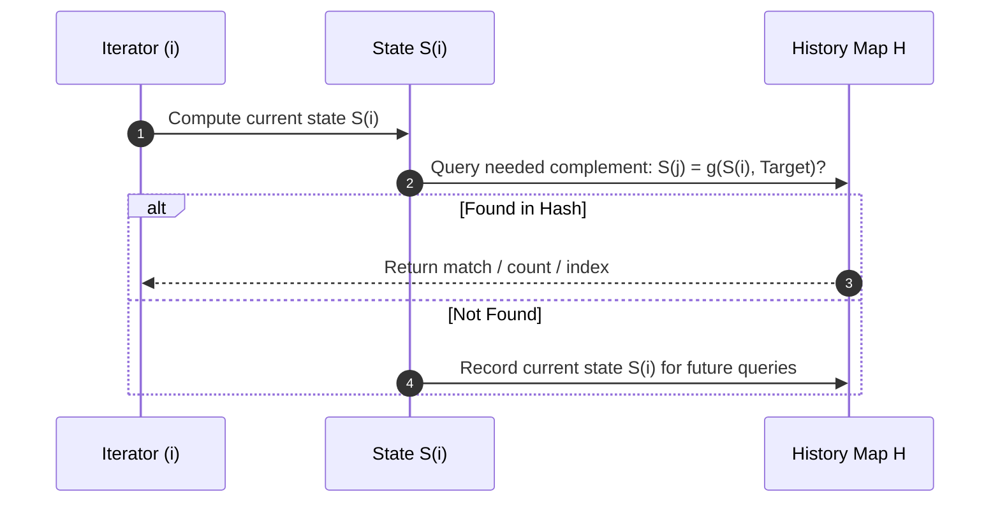

import Tabs from '@theme/Tabs';
import TabItem from '@theme/TabItem';

# Invariant 02: Historical Prefix & Complement Lookups

Brute force algorithms often search backward or forward over a collection, leading to quadratic $O(N^2)$ execution times. The **Prefix & Complement Lookup** invariant eliminates nested iterations by turning temporal search into an $O(1)$ memory inquiry: *Has the complementary state required to satisfy the equation already been seen?*

---

## The Core Invariant

:::info

**The Mathematical Invariant**

Given an ongoing cumulative evaluation or sequence function $S(i)$ and a required relational condition:
$$f(S(i), S(j)) = \text{Target} \quad (j < i)$$

We rewrite the condition algebraically to isolate the historical state $S(j)$:
$$S(j) = g(S(i), \text{Target})$$

Instead of executing a nested scan over all previous indices $j \in [0, i-1]$, we maintain a hash table of historical states $H$. At step $i$, we perform an $O(1)$ lookup for $g(S(i), \text{Target})$.

:::

### Why It Works
1. **One-Way Directional Memory:** By accumulating state from left to right, we can answer questions about continuous subarrays or pairs in a single linear pass ($O(N)$).
2. **Subarray Sum Reduction:** Any contiguous subarray sum from index $j+1$ to $i$ can be expressed as the difference of two prefix sums:
   $$\sum_{k=j+1}^i A[k] = \text{Prefix}[i] - \text{Prefix}[j]$$
   If this subarray sum equals $K$, then $\text{Prefix}[j] = \text{Prefix}[i] - K$.

---

## State & Transition Mechanics



---

## Progressive Examples

### Example 1: Two Sum ([LeetCode 1](https://leetcode.com/problems/two-sum/))
*Difficulty: Easy (Direct Complement)* · **[Practice on LeetCode](https://leetcode.com/problems/two-sum/)**

**Problem Statement:**
Given an array of integers `nums` and an integer `target`, return indices of the two numbers such that they add up to `target`. You may assume that each input would have exactly one solution, and you may not use the same element twice. You can return the answer in any order.

#### Examples
- **Example 1:**
  - **Input:** `nums = [2,7,11,15]`, `target = 9`
  - **Output:** `[0,1]`
  - **Explanation:** Because `nums[0] + nums[1] == 9`, we return `[0, 1]`.
- **Example 2:**
  - **Input:** `nums = [3,2,4]`, `target = 6`
  - **Output:** `[1,2]`
- **Example 3:**
  - **Input:** `nums = [3,3]`, `target = 6`
  - **Output:** `[0,1]`

#### Constraints
- $2 \le \text{nums.length} \le 10^4$
- $-10^9 \le \text{nums}[i] \le 10^9$
- $-10^9 \le \text{target} \le 10^9$
- Only one valid answer exists.

#### Invariant Application
Equation: $A[i] + A[j] = \text{Target}$. Isolated historical state: $A[j] = \text{Target} - A[i]$. As we scan index $i$, check if the complement has been recorded in the hash map. If so, return $(H[\text{Target} - A[i]], i)$. Otherwise, record $H[A[i]] = i$.

#### Detailed Explanation
- **Intuition & Mental Model:** The naive approach uses nested loops to inspect all possible pairs $(i, j)$, consuming $O(N^2)$ time. Instead of searching *forward* in the array for an element's partner, we record elements into a hash table as we encounter them and look *backward*. For any current value $x$ at index $i$, there is exactly one value $y$ that can satisfy the equation: $y = \text{target} - x$. If $y$ is already in our table, we have discovered the solution pair in $O(1)$ lookup time.
- **Step-by-Step Walkthrough:**
  1. **Allocate State Map:** Initialize an empty hash table `seen` mapping `number_value -> index`.
  2. **Linear Iteration:** Traverse the array with pointer $i$ from $0$ to $N - 1$.
  3. **Calculate Complement:** At index $i$, calculate `complement = target - nums[i]`.
  4. **Probe Historical Cache:**
     - If `seen.containsKey(complement)` is true, return the indices `[seen.get(complement), i]`.
     - If not found, insert the current element and its index into the map: `seen.put(nums[i], i)`.
  5. **Sequential Guarding:** Because we query the hash map *before* inserting `nums[i]`, an element cannot erroneously pair with itself.
- **Edge Cases & Failure Modes:** Negative numbers (algebraically transparent, e.g., target $-3$, current $-5 \implies \text{complement} = 2$), duplicate values (if `nums = [3, 3]` and target is 6, the first 3 is stored at index 0, and the second 3 matches it immediately at index 1), and large inputs up to $10^9$ where arithmetic bounds must be respected.

<Tabs>
<TabItem value="java" label="Java">

```java
import java.util.HashMap;
import java.util.Map;

public class Solution {
    public int[] twoSum(int[] nums, int target) {
        Map<Integer, Integer> seen = new HashMap<>();
        
        for (int i = 0; i < nums.length; i++) {
            int complement = target - nums[i];
            if (seen.containsKey(complement)) {
                return new int[]{seen.get(complement), i};
            }
            seen.put(nums[i], i);
        }
        
        return new int[]{};
    }
}
```

</TabItem>
<TabItem value="ts" label="TypeScript">

```typescript
function twoSum(nums: number[], target: number): number[] {
    const seen = new Map<number, number>();
    
    for (let i = 0; i < nums.length; i++) {
        const complement = target - nums[i];
        if (seen.has(complement)) {
            return [seen.get(complement)!, i];
        }
        seen.set(nums[i], i);
    }
    
    return [];
}
```

</TabItem>
<TabItem value="python" label="Python">

```python
from typing import List

class Solution:
    def twoSum(self, nums: List[int], target: int) -> List[int]:
        seen = {}
        for i, num in enumerate(nums):
            complement = target - num
            if complement in seen:
                return [seen[complement], i]
            seen[num] = i
        return []
```

</TabItem>
</Tabs>

- **Time Complexity:** $O(N)$ single iteration over the array.
- **Space Complexity:** $O(N)$ hash table storage to hold up to $N$ seen elements.

#### Follow-up

<details>
<summary><b>Follow-up Question:</b> Can you solve this problem with $O(1)$ auxiliary space if the input array is already sorted in non-decreasing order?</summary>
<div>
<br/>

**Technical Rationale & Solution:**
1. **Transition to Two Pointers:** If `nums` is pre-sorted, we transition from the hash table complement invariant to the **Two Pointers invariant**.
2. **Opposite-End Convergence:** Initialize `left = 0` and `right = nums.length - 1`. Because the array is monotonically non-decreasing:
   - If `nums[left] + nums[right] < target`, the sum must increase, so increment `left++`.
   - If `nums[left] + nums[right] > target`, the sum must decrease, so decrement `right--`.
   - If equal, return `[left, right]`.
3. **Complexity Trade-off:** This maintains $O(N)$ runtime while dropping additional space complexity from $O(N)$ to strictly $O(1)$.

</div>
</details>

---

### Example 2: Subarray Sum Equals K ([LeetCode 560](https://leetcode.com/problems/subarray-sum-equals-k/))
*Difficulty: Medium (Prefix Frequency Accumulation)* · **[Practice on LeetCode](https://leetcode.com/problems/subarray-sum-equals-k/)**

**Problem Statement:**
Given an array of integers `nums` and an integer `k`, return the total number of subarrays whose sum equals to `k`. A subarray is a contiguous non-empty sequence of elements within an array.

#### Examples
- **Example 1:**
  - **Input:** `nums = [1,1,1]`, `k = 2`
  - **Output:** `2`
  - **Explanation:** Subarrays `[1,1]` at indices `0..1` and `1..2` both sum to 2.
- **Example 2:**
  - **Input:** `nums = [1,2,3]`, `k = 3`
  - **Output:** `2`
  - **Explanation:** Subarrays `[1,2]` (indices `0..1`) and `[3]` (index `2`) both sum to 3.

#### Constraints
- $1 \le \text{nums.length} \le 2 \times 10^4$
- $-1000 \le \text{nums}[i] \le 1000$
- $-10^7 \le k \le 10^7$

#### Invariant Application
Let $\text{current\_sum} = \sum_{m=0}^i \text{nums}[m]$. We need to find previous indices $j$ such that $\text{current\_sum} - \text{prefix\_sum}[j] = k$, which means $\text{prefix\_sum}[j] = \text{current\_sum} - k$.
We store the **frequency** of each seen prefix sum in a hash table. Initialize the table with $\{0: 1\}$ to handle subarrays starting at index 0.

#### Detailed Explanation
- **Intuition & Mental Model:** The sum of elements between indices $j + 1$ and $i$ equals the difference between two prefix sums:
  $$\text{Sum}(j+1 \dots i) = \text{Prefix}[i] - \text{Prefix}[j]$$
  Setting this subarray sum equal to $k$ yields:
  $$\text{Prefix}[i] - \text{Prefix}[j] = k \iff \text{Prefix}[j] = \text{Prefix}[i] - k$$
  Instead of enumerating all $O(N^2)$ candidate subarrays, we maintain a running prefix sum $\text{Prefix}[i]$ and query a frequency hash map for how many times the required prior state $\text{Prefix}[i] - k$ has appeared. Each occurrence corresponds to a valid subarray ending exactly at index $i$.
- **Step-by-Step Walkthrough:**
  1. **Initialize State Tracker:** Allocate integer variables `count = 0` and `currentSum = 0`. Create a hash table `prefixCounts` storing `prefix_sum -> frequency`.
  2. **The Zero-Prefix Base Case:** Seed the map with `prefixCounts.put(0, 1)`. If `currentSum == k` at any point, `neededPrefix = k - k = 0`. Without the initial `{0: 1}`, subarrays starting at the very beginning of the array (index 0) would be omitted.
  3. **Linear Accumulation:** Iterate through `num` in `nums`:
     - Accumulate `currentSum += num`.
     - Calculate the required past prefix: `neededPrefix = currentSum - k`.
     - Retrieve its recorded count: `count += prefixCounts.getOrDefault(neededPrefix, 0)`.
     - Record the new prefix sum: increment `prefixCounts[currentSum]` by 1.
  4. **Return Total Count:** Return `count`.
- **Why Two-Pointer / Sliding Window Fails Here:** A classic sliding window assumes monotonicity: adding elements increases the window sum, and removing elements decreases it. Because `nums` can contain negative numbers and zeros, the prefix sum oscillates non-monotonically. Only prefix state hashing can handle negative values in strict $O(N)$ time.

<Tabs>
<TabItem value="java" label="Java">

```java
import java.util.HashMap;
import java.util.Map;

public class Solution {
    public int subarraySum(int[] nums, int k) {
        int count = 0;
        int currentSum = 0;
        Map<Integer, Integer> prefixCounts = new HashMap<>();
        prefixCounts.put(0, 1); // Base case for subarray starting at index 0
        
        for (int num : nums) {
            currentSum += num;
            int neededPrefix = currentSum - k;
            
            count += prefixCounts.getOrDefault(neededPrefix, 0);
            prefixCounts.put(currentSum, prefixCounts.getOrDefault(currentSum, 0) + 1);
        }
        
        return count;
    }
}
```

</TabItem>
<TabItem value="ts" label="TypeScript">

```typescript
function subarraySum(nums: number[], k: number): number {
    let count = 0;
    let currentSum = 0;
    const prefixCounts = new Map<number, number>();
    prefixCounts.set(0, 1);
    
    for (const num of nums) {
        currentSum += num;
        const neededPrefix = currentSum - k;
        
        count += prefixCounts.get(neededPrefix) || 0;
        prefixCounts.set(currentSum, (prefixCounts.get(currentSum) || 0) + 1);
    }
    
    return count;
}
```

</TabItem>
<TabItem value="python" label="Python">

```python
from collections import defaultdict
from typing import List

class Solution:
    def subarraySum(self, nums: List[int], k: int) -> int:
        count = 0
        current_sum = 0
        prefix_counts = defaultdict(int)
        prefix_counts[0] = 1 # Base case
        
        for num in nums:
            current_sum += num
            needed_prefix = current_sum - k
            
            count += prefix_counts[needed_prefix]
            prefix_counts[current_sum] += 1
            
        return count
```

</TabItem>
</Tabs>

- **Time Complexity:** $O(N)$ linear pass.
- **Space Complexity:** $O(N)$ space for the hash map of unique prefix sums.

#### Follow-up

<details>
<summary><b>Follow-up Question:</b> Why does the sliding window (two pointers) approach fail on this problem? Under what exact constraint change would sliding window become viable?</summary>
<div>
<br/>

**Technical Rationale & Solution:**
1. **Monotonicity Breakdown:** The sliding window technique requires **monotonicity**: expanding the right pointer must strictly non-decrease the window sum, and advancing the left pointer must strictly non-increase it.
2. **Negative Values Invalidate Pointers:** Because `nums[i]` can be negative (e.g., `nums = [1, -1, 1, -1], k = 0`), expanding the right pointer could cause the sum to decrease, and shrinking the left pointer could cause the sum to increase. There is no deterministic decision rule for pointer movement.
3. **Constraint for Sliding Window:** A sliding window is only viable if the problem statement guarantees all non-negative integers ($\forall i, \text{nums}[i] \ge 0$). When negative numbers are present, prefix sum hashing is mandatory.

</div>
</details>

---

### Example 3: Contiguous Array ([LeetCode 525](https://leetcode.com/problems/contiguous-array/))
*Difficulty: Medium (Parity Balancing / State Normalization)* · **[Practice on LeetCode](https://leetcode.com/problems/contiguous-array/)**

**Problem Statement:**
Given a binary array `nums`, return the maximum length of a contiguous subarray with an equal number of `0` and `1`.

#### Examples
- **Example 1:**
  - **Input:** `nums = [0,1]`
  - **Output:** `2`
  - **Explanation:** `[0, 1]` is the longest contiguous subarray with an equal number of 0 and 1.
- **Example 2:**
  - **Input:** `nums = [0,1,0]`
  - **Output:** `2`
  - **Explanation:** `[0, 1]` (or `[1, 0]`) is a longest contiguous subarray with equal 0s and 1s.

#### Constraints
- $1 \le \text{nums.length} \le 10^5$
- `nums[i]` is either `0` or `1`.

#### Invariant Application
Transform the problem domain: replace each `0` with `-1`. Now, an equal number of `0`s and `1`s translates to a contiguous subarray sum of **zero**:
$$\text{Prefix}[i] - \text{Prefix}[j] = 0 \iff \text{Prefix}[i] = \text{Prefix}[j]$$
We store the **first index** at which each prefix sum was seen. To maximize length $(i - j)$, we keep early indices and never overwrite existing map entries.

#### Detailed Explanation
- **Intuition & Mental Model:** Tracking counts of 0s and 1s simultaneously appears to demand two-dimensional state tracking. However, an algebraic substitution collapses the problem to one dimension: transform every `0` into `-1` while leaving `1` as `+1`. In this transformed space, a subarray with equal counts of 0s and 1s has a net sum of zero:
  $$\sum_{m=j+1}^i \text{val}[m] = 0 \iff \text{Prefix}[i] - \text{Prefix}[j] = 0 \iff \text{Prefix}[i] = \text{Prefix}[j]$$
  The problem simplifies to: find the maximum distance between two identical prefix sum values.
- **Step-by-Step Walkthrough:**
  1. **Allocate Index Map:** Create a hash table `firstSeen` mapping `running_sum -> earliest_index`.
  2. **Initialize Boundary Anchor:** Store `firstSeen.put(0, -1)`. If a balanced subarray starts at index 0 and extends through index $i$, the running sum will equal 0 at index $i$. The length is $i - (-1) = i + 1$.
  3. **Linear Sweep with State Update:**
     - Initialize `runningSum = 0` and `maxLength = 0`.
     - For each index $i$ from 0 to $N - 1$:
       - Add $+1$ if `nums[i] == 1`, else $-1$.
       - Check if `runningSum` is already recorded in `firstSeen`:
         - If **seen**: A zero-sum subarray spans from `firstSeen.get(runningSum) + 1` to $i$. Calculate length $i - \text{firstSeen.get(runningSum)}$ and update `maxLength = Math.max(maxLength, length)`.
         - If **not seen**: Insert the pair `firstSeen.put(runningSum, i)`.
  4. **The Greedy Non-Overwriting Invariant:** Crucially, never update `firstSeen` if `runningSum` already exists. To maximize subarray length $(i - j)$, the anchor index $j$ must remain as small (as far to the left) as possible.
  5. **Return Result:** Return `maxLength`.
- **Edge Cases & Failure Modes:** Arrays containing exclusively 0s or exclusively 1s (prefix sum grows strictly monotonically; no matches found, returns 0), perfectly alternating arrays (`[0, 1, 0, 1]` $\to$ returns full length 4), and minimal input sizes (`[0, 1]` $\to$ returns 2).

<Tabs>
<TabItem value="java" label="Java">

```java
import java.util.HashMap;
import java.util.Map;

public class Solution {
    public int findMaxLength(int[] nums) {
        Map<Integer, Integer> firstSeen = new HashMap<>();
        firstSeen.put(0, -1); // Prefix sum 0 before the array starts
        
        int maxLength = 0;
        int runningSum = 0;
        
        for (int i = 0; i < nums.length; i++) {
            runningSum += (nums[i] == 1) ? 1 : -1;
            
            if (firstSeen.containsKey(runningSum)) {
                maxLength = Math.max(maxLength, i - firstSeen.get(runningSum));
            } else {
                firstSeen.put(runningSum, i);
            }
        }
        
        return maxLength;
    }
}
```

</TabItem>
<TabItem value="ts" label="TypeScript">

```typescript
function findMaxLength(nums: number[]): number {
    const firstSeen = new Map<number, number>();
    firstSeen.set(0, -1);
    
    let maxLength = 0;
    let runningSum = 0;
    
    for (let i = 0; i < nums.length; i++) {
        runningSum += nums[i] === 1 ? 1 : -1;
        
        if (firstSeen.has(runningSum)) {
            maxLength = Math.max(maxLength, i - firstSeen.get(runningSum)!);
        } else {
            firstSeen.set(runningSum, i);
        }
    }
    
    return maxLength;
}
```

</TabItem>
<TabItem value="python" label="Python">

```python
from typing import List

class Solution:
    def findMaxLength(self, nums: List[int]) -> int:
        first_seen = {0: -1}
        max_length = 0
        running_sum = 0
        
        for i, num in enumerate(nums):
            running_sum += 1 if num == 1 else -1
            
            if running_sum in first_seen:
                max_length = max(max_length, i - first_seen[running_sum])
            else:
                first_seen[running_sum] = i
                
        return max_length
```

</TabItem>
</Tabs>

- **Time Complexity:** $O(N)$ single pass over the array.
- **Space Complexity:** $O(N)$ hash table storage for prefix sum states.

#### Follow-up

<details>
<summary><b>Follow-up Question:</b> How does this invariant generalize if the array contains three distinct values (e.g., 0, 1, and 2) and we want the longest contiguous subarray with an equal number of all three elements?</summary>
<div>
<br/>

**Technical Rationale & Solution:**
1. **Multi-Dimensional State Balance:** For two values, balance is a single scalar: $\Delta = \text{count}(1) - \text{count}(0)$. For three values, balance requires two simultaneous invariant equations:
   $$\Delta_{10} = \text{count}(1) - \text{count}(0)$$
   $$\Delta_{20} = \text{count}(2) - \text{count}(0)$$
2. **State Tuple Hashing:** Maintain running counters for 0, 1, and 2. At each index $i$, construct the composite state tuple $(\Delta_{10}, \Delta_{20})$.
3. **Earliest Occurrence Invariant:** Store the earliest index for each tuple in a hash map. If $(\Delta_{10}, \Delta_{20})$ reappears at index $j$, all three counts grew by the identical amount over $(first\_seen, j]$, yielding $O(N)$ runtime.

</div>
</details>

---

### Example 4: Subarray Sums Divisible by K ([LeetCode 974](https://leetcode.com/problems/subarray-sums-divisible-by-k/))
*Difficulty: Medium / Hard (Modulo Congruence Invariant)* · **[Practice on LeetCode](https://leetcode.com/problems/subarray-sums-divisible-by-k/)**

**Problem Statement:**
Given an integer array `nums` and an integer `k`, return the number of non-empty subarrays that have a sum divisible by `k`. A subarray is a contiguous part of an array.

#### Examples
- **Example 1:**
  - **Input:** `nums = [4,5,0,-2,-3,1]`, `k = 5`
  - **Output:** `7`
  - **Explanation:** There are 7 subarrays with a sum divisible by k = 5:
    `[4, 5, 0, -2, -3, 1]`, `[5]`, `[5, 0]`, `[5, 0, -2, -3]`, `[0]`, `[0, -2, -3]`, `[-2, -3]`.
- **Example 2:**
  - **Input:** `nums = [5]`, `k = 9`
  - **Output:** `0`

#### Constraints
- $1 \le \text{nums.length} \le 3 \times 10^4$
- $-10^4 \le \text{nums}[i] \le 10^4$
- $2 \le k \le 10^4$

#### Invariant Application
Two prefix sums have a difference divisible by $K$ if and only if they share the same remainder when divided by $K$:
$$(\text{Prefix}[i] - \text{Prefix}[j]) \pmod K = 0 \iff \text{Prefix}[i] \pmod K \equiv \text{Prefix}[j] \pmod K$$
Because Python handles negative modulo natively while Java and TypeScript yield negative results for negative dividends, we normalize remainder calculations via `((sum % k) + k) % k`.

#### Detailed Explanation
- **Intuition & Mental Model:** According to modular congruence, if two integers $A$ and $B$ leave the identical remainder when divided by $K$, their difference $A - B$ is strictly divisible by $K$:
  $$A \equiv B \pmod K \iff (A - B) \equiv 0 \pmod K$$
  Since a contiguous subarray sum is $\text{Prefix}[i] - \text{Prefix}[j]$, any two indices $i$ and $j$ ($j < i$) whose prefix sums share the same remainder modulo $K$ form a subarray divisible by $K$. Thus, instead of storing raw prefix sums, we track the *frequency of remainders modulo $K$*.
- **Step-by-Step Walkthrough:**
  1. **Allocate Remainder Counter:** Create a hash table (or fixed-size array of size $K$) `remainderCounts` mapping `remainder -> frequency`.
  2. **Initialize Zero-Remainder Base Case:** Insert `remainderCounts.put(0, 1)`. A prefix sum that is itself a multiple of $K$ (remainder 0) forms a valid subarray beginning at index 0.
  3. **Linear Accumulation with Modulo Normalization:**
     - Initialize `count = 0` and `runningSum = 0`.
     - For each `num` in `nums`:
       - Add `runningSum += num`.
       - Compute canonical remainder: `int remainder = ((runningSum % k) + k) % k`.
       - Add previously recorded matches: `count += remainderCounts.getOrDefault(remainder, 0)`.
       - Update tally: increment `remainderCounts[remainder]` by 1.
  4. **Return Total Count:** Return `count`.
- **The Critical Negative Modulo Pitfall:** In languages like Java, C++, and TypeScript, the `%` operator computes truncated remainder rather than mathematical modulo. For example, `-7 % 5 == -2`. However, in modular arithmetic, $-7 \equiv 3 \pmod 5$ (since $-7 = (-2) \times 5 + 3$). If negative remainders are not normalized to the range $[0, K-1]$ using `((val % k) + k) % k`, identical remainder classes will be split into positive and negative keys, resulting in silent undercounting.

<Tabs>
<TabItem value="java" label="Java">

```java
import java.util.HashMap;
import java.util.Map;

public class Solution {
    public int subarraysDivByK(int[] nums, int k) {
        Map<Integer, Integer> remainderCounts = new HashMap<>();
        remainderCounts.put(0, 1);
        
        int count = 0;
        int runningSum = 0;
        
        for (int num : nums) {
            runningSum += num;
            // Normalize negative remainders
            int remainder = ((runningSum % k) + k) % k;
            
            count += remainderCounts.getOrDefault(remainder, 0);
            remainderCounts.put(remainder, remainderCounts.getOrDefault(remainder, 0) + 1);
        }
        
        return count;
    }
}
```

</TabItem>
<TabItem value="ts" label="TypeScript">

```typescript
function subarraysDivByK(nums: number[], k: number): number {
    const remainderCounts = new Map<number, number>();
    remainderCounts.set(0, 1);
    
    let count = 0;
    let runningSum = 0;
    
    for (const num of nums) {
        runningSum += num;
        const remainder = ((runningSum % k) + k) % k;
        
        count += remainderCounts.get(remainder) || 0;
        remainderCounts.set(remainder, (remainderCounts.get(remainder) || 0) + 1);
    }
    
    return count;
}
```

</TabItem>
<TabItem value="python" label="Python">

```python
from collections import defaultdict
from typing import List

class Solution:
    def subarraysDivByK(self, nums: List[int], k: int) -> int:
        remainder_counts = defaultdict(int)
        remainder_counts[0] = 1
        
        count = 0
        running_sum = 0
        
        for num in nums:
            running_sum += num
            # Python % handles negative numbers directly: -1 % 5 == 4
            remainder = running_sum % k
            
            count += remainder_counts[remainder]
            remainder_counts[remainder] += 1
            
        return count
```

</TabItem>
</Tabs>

- **Time Complexity:** $O(N)$ linear pass.
- **Space Complexity:** $O(\min(N, K))$ storage for remainder buckets.

#### Follow-up

<details>
<summary><b>Follow-up Question:</b> Since $k \le 10^4$, how can we optimize memory footprint, GC pressure, and cache locality compared to a dynamic hash table?</summary>
<div>
<br/>

**Technical Rationale & Solution:**
1. **Direct Array Indexing:** Because the normalized remainder is strictly bounded in the discrete range $[0, k-1]$, we can eliminate dynamic heap-allocated hash map nodes by allocating a primitive array `int[] remainderCounts = new int[k]`.
2. **Hardware Benefits:** 
   - Eliminates object boxing/unboxing (`Integer` vs `int`).
   - Guarantees $O(1)$ lookup and increment with zero hash collisions or bucket chaining.
   - Provides sequential memory layout with $L1/L2$ CPU cache locality.
   - Reduces space from $O(N)$ dynamic map overhead to fixed $O(k)$ memory.

</div>
</details>

---

## Additional Practice & Advanced Variations

To deepen your intuition for Historical Prefix and Complement lookups, work through these progressive problem sets:

### Reinforcement & Direct Variations
These problems reinforce prefix sum accumulation, index caching, and target difference queries:

| Problem | Difficulty | Key Concept / Invariant Application |
|---|---|---|
| **[Two Sum II - Input Array Is Sorted (LeetCode 167)](https://leetcode.com/problems/two-sum-ii-input-array-is-sorted/)** | Medium | Two-pointer optimization of the complement lookup on sorted data ($O(1)$ space). |
| **[Find Pivot Index (LeetCode 724)](https://leetcode.com/problems/find-pivot-index/)** | Easy | Single-pass prefix sum query: $\text{LeftSum} = \text{TotalSum} - \text{LeftSum} - \text{nums}[i]$. |
| **[Running Sum of 1d Array (LeetCode 1480)](https://leetcode.com/problems/running-sum-of-1d-array/)** | Easy | In-place cumulative state accumulation building prefix arrays. |
| **[Range Sum Query - Immutable (LeetCode 303)](https://leetcode.com/problems/range-sum-query-immutable/)** | Easy | Precomputing prefix array to answer arbitrary range queries $[L, R]$ in $O(1)$ time. |

### Upgraded & Advanced Variations
These problems elevate the prefix invariant across trees, modulo arithmetic, 2D planes, and monotonic data structures:

| Problem | Difficulty | Key Concept / Invariant Application |
|---|---|---|
| **[Continuous Subarray Sum (LeetCode 523)](https://leetcode.com/problems/continuous-subarray-sum/)** | Medium | Prefix sum modulo arithmetic requiring minimum subarray length $\ge 2$. |
| **[Maximum Size Subarray Sum Equals k (LeetCode 325)](https://leetcode.com/problems/maximum-size-subarray-sum-equals-k/)** | Medium | Earliest prefix sum occurrence caching to maximize subarray span $(i - j)$. |
| **[Range Sum Query 2D - Immutable (LeetCode 304)](https://leetcode.com/problems/range-sum-query-2d-immutable/)** | Medium | 2D inclusion-exclusion principle over 2D prefix integral matrices. |
| **[Path Sum III (LeetCode 437)](https://leetcode.com/problems/path-sum-iii/)** | Medium | Prefix sum hash map combined with tree DFS and backtracking state removal. |
| **[Shortest Subarray with Sum at Least K (LeetCode 862)](https://leetcode.com/problems/shortest-subarray-with-sum-at-least-k/)** | Hard | Prefix sum array paired with a monotonic deque to handle arbitrary negative numbers in $O(N)$ time. |
